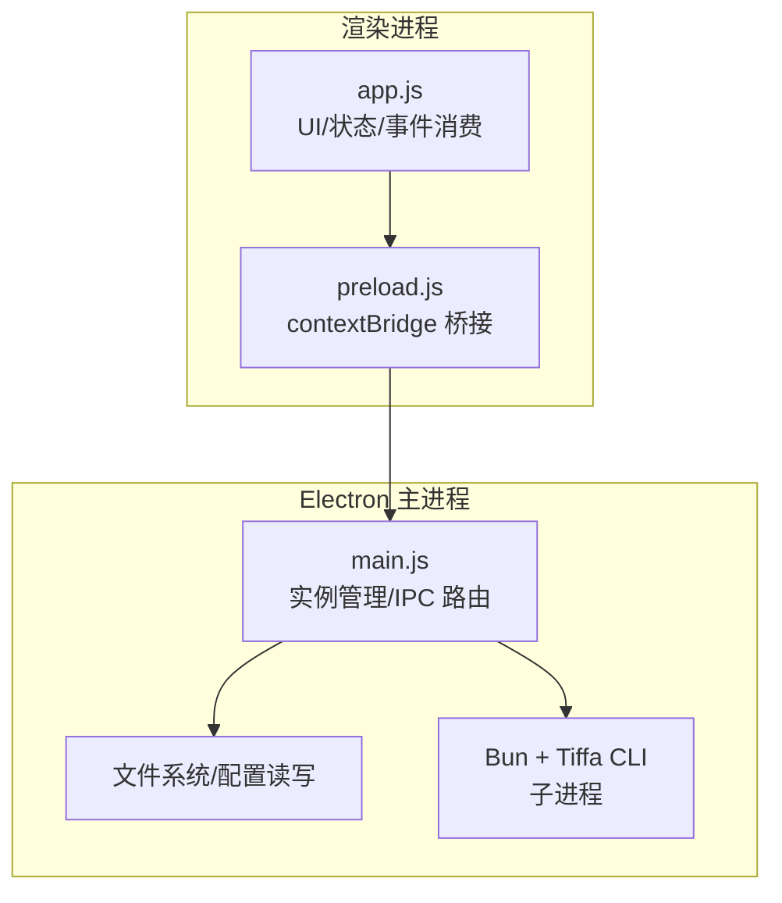
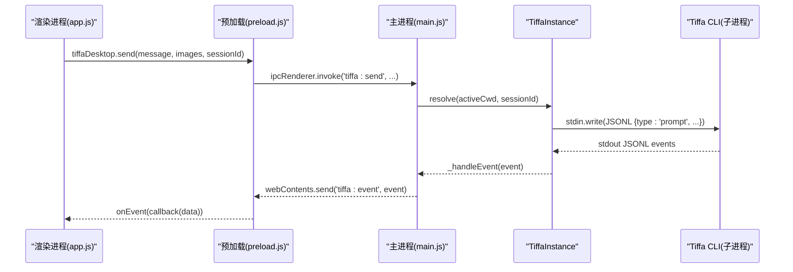
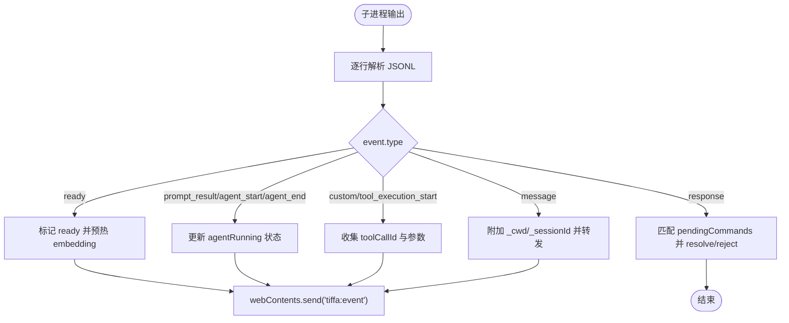
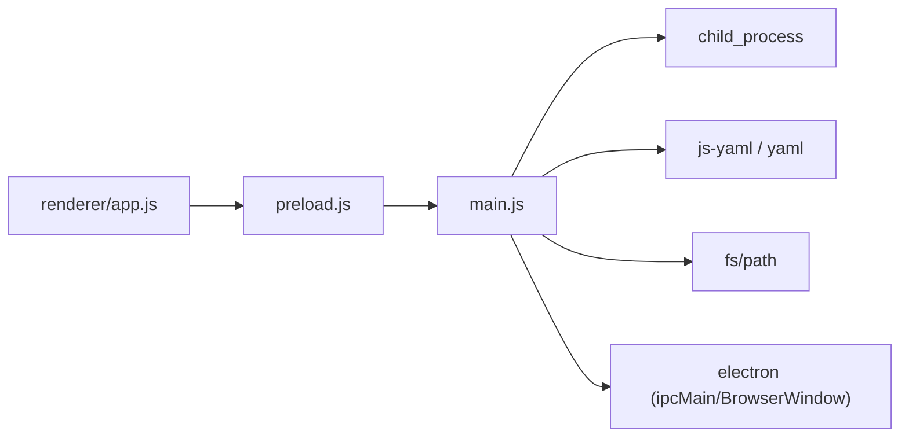

# API参考

<cite>
**本文引用的文件**   
- [electron/main.js](file://electron/main.js)
- [electron/preload.js](file://electron/preload.js)
- [electron/renderer/app.js](file://electron/renderer/app.js)
- [README.md](file://README.md)
- [data/agent/rules/no-xml-toolcall.md](file://data/agent/rules/no-xml-toolcall.md)
</cite>

## 目录
1. [简介](#简介)
2. [项目结构](#项目结构)
3. [核心组件](#核心组件)
4. [架构总览](#架构总览)
5. [详细组件分析](#详细组件分析)
6. [依赖分析](#依赖分析)
7. [性能考虑](#性能考虑)
8. [故障排查指南](#故障排查指南)
9. [结论](#结论)
10. [附录：JSONL over stdin/stdout 协议与事件类型](#附录jsonl-over-stdinstdout-协议与事件类型)

## 简介
本参考文档面向 Tiffa 桌面版的 IPC 扩展与集成开发者，系统化梳理 Electron 主进程暴露的 IPC 接口、渲染进程桥接 API、以及 JSONL over stdin/stdout 通信协议。内容涵盖方法签名、参数说明、返回值格式、错误处理、事件类型定义、消息传递机制、扩展 Hook 调用时机与参数说明，并提供使用示例、最佳实践与调试技巧。

## 项目结构
Tiffa 桌面版由三部分组成：
- Electron 主进程（electron/main.js）：管理子进程生命周期、IPC 路由、文件系统与配置操作。
- 预加载脚本（electron/preload.js）：通过 contextBridge 向渲染进程暴露受控 API。
- 渲染进程（electron/renderer/app.js）：UI 逻辑与事件消费。

**图表来源** 
- [electron/main.js:1-120](file://electron/main.js#L1-L120)
- [electron/preload.js:1-133](file://electron/preload.js#L1-L133)
- [electron/renderer/app.js:1-200](file://electron/renderer/app.js#L1-L200)

**章节来源**
- [electron/main.js:1-120](file://electron/main.js#L1-L120)
- [electron/preload.js:1-133](file://electron/preload.js#L1-L133)
- [electron/renderer/app.js:1-200](file://electron/renderer/app.js#L1-L200)

## 核心组件
- TiffaInstanceManager：多实例管理器，负责按工作区与对话维度激活、复用、淘汰与关闭 Tiffa 子进程。
- TiffaInstance：单个 Tiffa 子进程的生命周期与通信封装，包含启动、发送命令、事件解析、自动重启等。
- IPC 处理器：将渲染进程的请求转发到对应实例或系统能力（文件系统、Shell、模型配置等）。
- 预加载桥接：将主进程能力安全暴露给渲染进程。

关键职责与交互：
- 渲染进程通过 preload 暴露的 tiffaDesktop.* 调用主进程 IPC。
- 主进程根据 activeCwd 与 sessionId 路由到具体实例。
- 实例通过 JSONL over stdin/stdout 与 Tiffa CLI 子进程通信。

**章节来源**
- [electron/main.js:72-120](file://electron/main.js#L72-L120)
- [electron/main.js:207-319](file://electron/main.js#L207-L319)
- [electron/preload.js:24-105](file://electron/preload.js#L24-L105)

## 架构总览
下图展示从渲染进程到 Tiffa CLI 的完整调用链与事件回传路径。

**图表来源** 
- [electron/main.js:627-708](file://electron/main.js#L627-L708)
- [electron/main.js:207-248](file://electron/main.js#L207-L248)
- [electron/main.js:252-303](file://electron/main.js#L252-L303)
- [electron/preload.js:24-45](file://electron/preload.js#L24-L45)

## 详细组件分析

### IPC 处理器清单（主进程）
以下列出所有在 electron/main.js 中注册的 IPC 处理器，包括方法名、参数、返回与错误处理要点。为便于查阅，每个条目给出“调用方式”、“参数说明”、“返回值”和“错误处理”。

- tiffa:send
  - 调用方式：ipcRenderer.invoke('tiffa:send', message, images?, sessionId?)
  - 参数：message(string)，images(array, 可选)，sessionId(string, 可选)
  - 行为：构造 {type:'prompt', message, images?} 并发送到当前活跃实例；支持 /omfg|/吐槽 拦截生成 TTSR 规则。
  - 返回：Promise<any>（子进程命令响应 data）
  - 错误：无活跃实例时抛错；子进程超时或失败时 Promise reject。
  - 参考路径：[electron/main.js:627-708](file://electron/main.js#L627-L708)

- tiffa:activateSession
  - 调用方式：ipcRenderer.invoke('tiffa:activateSession', cwd, sessionId)
  - 参数：cwd(string), sessionId(string)
  - 行为：显式设置 activeKey，确保项目注册，激活会话级实例。
  - 返回：{success:true, cwd, sessionId, ready:boolean} 或 {error:string}
  - 错误：路径无效或激活失败返回 error。
  - 参考路径：[electron/main.js:711-724](file://electron/main.js#L711-L724)

- tiffa:closeSession
  - 调用方式：ipcRenderer.invoke('tiffa:closeSession', cwd, sessionId)
  - 参数：cwd(string), sessionId(string)
  - 行为：按 key 关闭会话实例。
  - 返回：{success:true} 或 {error:string}
  - 参考路径：[electron/main.js:727-735](file://electron/main.js#L727-L735)

- tiffa:abort
  - 调用方式：ipcRenderer.invoke('tiffa:abort', sessionId?)
  - 参数：sessionId(string, 可选)
  - 行为：向目标实例发送 {type:'abort'}。
  - 返回：void
  - 参考路径：[electron/main.js:737-740](file://electron/main.js#L737-L740)

- tiffa:setModel
  - 调用方式：ipcRenderer.invoke('tiffa:setModel', provider, modelId, sessionId?)
  - 参数：provider(string), modelId(string), sessionId(string, 可选)
  - 行为：发送 {type:'set_model', provider, modelId}。
  - 返回：Promise<any>
  - 错误：无活跃实例抛错。
  - 参考路径：[electron/main.js:742-746](file://electron/main.js#L742-L746)

- tiffa:getModels
  - 调用方式：ipcRenderer.invoke('tiffa:getModels')
  - 行为：发送 {type:'get_available_models'}。
  - 返回：Promise<any>
  - 参考路径：[electron/main.js:748-750](file://electron/main.js#L748-L750)

- tiffa:isReady
  - 调用方式：ipcRenderer.invoke('tiffa:isReady')
  - 返回：boolean（是否就绪）
  - 参考路径：[electron/main.js:752-755](file://electron/main.js#L752-L755)

- tiffa:diagnostics
  - 调用方式：ipcRenderer.invoke('tiffa:diagnostics')
  - 返回：{ready, agentRunning, cwd, pid, stdinWritable, pendingCommands} 或 {error:string}
  - 参考路径：[electron/main.js:757-768](file://electron/main.js#L757-L768)

- tiffa:getState
  - 调用方式：ipcRenderer.invoke('tiffa:getState')
  - 行为：发送 {type:'get_state'}。
  - 返回：Promise<any>
  - 参考路径：[electron/main.js:770-772](file://electron/main.js#L770-L772)

- tiffa:steer
  - 调用方式：ipcRenderer.invoke('tiffa:steer', message, sessionId?)
  - 行为：发送 {type:'steer', message}。
  - 返回：void
  - 参考路径：[electron/main.js:774-778](file://electron/main.js#L774-L778)

- tiffa:followUp
  - 调用方式：ipcRenderer.invoke('tiffa:followUp', message, sessionId?)
  - 行为：发送 {type:'follow_up', message}。
  - 返回：void
  - 参考路径：[electron/main.js:780-784](file://electron/main.js#L780-L784)

- tiffa:extensionResponse
  - 调用方式：ipcRenderer.invoke('tiffa:extensionResponse', id, value)
  - 行为：构造 {type:'extension_ui_response', id, value/cancelled/confirmed} 并发送。
  - 返回：void
  - 参考路径：[electron/main.js:786-797](file://electron/main.js#L786-L797)

- tiffa:compact
  - 调用方式：ipcRenderer.invoke('tiffa:compact')
  - 行为：发送 {type:'compact'}。
  - 返回：Promise<any>
  - 参考路径：[electron/main.js:799-801](file://electron/main.js#L799-L801)

- tiffa:command
  - 调用方式：ipcRenderer.invoke('tiffa:command', type, payload)
  - 行为：组装 {type, ...payload} 并发送。
  - 返回：Promise<any>
  - 参考路径：[electron/main.js:803-806](file://electron/main.js#L803-L806)

- tiffa:activate
  - 调用方式：ipcRenderer.invoke('tiffa:activate', cwd)
  - 行为：激活项目级实例（懒启动/复用），更新 activeCwd。
  - 返回：{success:true, cwd, ready:boolean} 或 {error:string}
  - 参考路径：[electron/main.js:809-819](file://electron/main.js#L809-L819)

- tiffa:instances
  - 调用方式：ipcRenderer.invoke('tiffa:instances')
  - 行为：返回所有实例状态。
  - 返回：Array<{...}>
  - 参考路径：[electron/main.js:821-823](file://electron/main.js#L821-L823)

- fs:listDir
  - 调用方式：ipcRenderer.invoke('fs:listDir', dirPath)
  - 行为：读取目录，限制在 PORTABLE_ROOT 内。
  - 返回：Array<{name,path,isDirectory,isFile,size,ext}> 或 {error:string}
  - 参考路径：[electron/main.js:826-846](file://electron/main.js#L826-L846)

- fs:readFile
  - 调用方式：ipcRenderer.invoke('fs:readFile', filePath)
  - 行为：读取文件，限制大小 5MB。
  - 返回：{content,string; ext; path; size} 或 {error:string}
  - 参考路径：[electron/main.js:848-862](file://electron/main.js#L848-L862)

- fs:writeFile
  - 调用方式：ipcRenderer.invoke('fs:writeFile', filePath, content)
  - 行为：写入文件，限制在 PORTABLE_ROOT 内。
  - 返回：{success:true} 或 {error:string}
  - 参考路径：[electron/main.js:864-877](file://electron/main.js#L864-L877)

- fetch:providerModels
  - 调用方式：ipcRenderer.invoke('fetch:providerModels', baseUrl, apiKey?)
  - 行为：GET /models，支持 Authorization Bearer。
  - 返回：{models:[{id,name}]} 或 {error:string}
  - 参考路径：[electron/main.js:879-892](file://electron/main.js#L879-L892)

- fs:readImage
  - 调用方式：ipcRenderer.invoke('fs:readImage', filePath)
  - 行为：读取图片为 base64，推断 MIME。
  - 返回：{base64,mimeType,path,size} 或 {error:string}
  - 参考路径：[electron/main.js:894-910](file://electron/main.js#L894-L910)

- shell:openExternal
  - 调用方式：ipcRenderer.invoke('shell:openExternal', url)
  - 行为：打开外部链接。
  - 返回：void
  - 参考路径：[electron/main.js:913-915](file://electron/main.js#L913-L915)

- shell:openPath
  - 调用方式：ipcRenderer.invoke('shell:openPath', filePath)
  - 行为：打开系统路径。
  - 返回：void
  - 参考路径：[electron/main.js:917-919](file://electron/main.js#L917-L919)

- path:workspace / path:root
  - 调用方式：ipcRenderer.invoke('path:workspace'|'path:root')
  - 返回：string（工作区根或便携根）
  - 参考路径：[electron/main.js:922-923](file://electron/main.js#L922-L923)

- xml-translation:status / xml-translation:toggle
  - 调用方式：ipcRenderer.invoke('xml-translation:status'|'xml-translation:toggle', enabled?)
  - 行为：读写开关文件 data/agent/xml-translation-enabled。
  - 返回：{enabled:boolean} 或 {error:string}
  - 参考路径：[electron/main.js:926-948](file://electron/main.js#L926-L948)

- models:read / models:write / models:restart
  - 调用方式：ipcRenderer.invoke('models:read'|'models:write', yamlContent? | 'models:restart')
  - 行为：读取/写入 models.yml（保留注释），变更后可重启实例。
  - 返回：{data,raw} 或 {success:true} 或 {error:string}
  - 参考路径：[electron/main.js:954-998](file://electron/main.js#L954-L998)

- models:writeProvider / models:deleteProvider
  - 调用方式：ipcRenderer.invoke('models:writeProvider', providerId, cfg | 'models:deleteProvider', providerId)
  - 行为：原子修改 providers.<id> 子树，保留注释与其他字段。
  - 返回：{success:true} 或 {error:string}
  - 参考路径：[electron/main.js:1003-1049](file://electron/main.js#L1003-L1049)

- config:writeApprovalMode
  - 调用方式：ipcRenderer.invoke('config:writeApprovalMode', tiffaMode)
  - 行为：写入 tools.approvalMode（normal/auto/yolo → always-ask/write/yolo）。
  - 返回：{success:true, agentMode} 或 {error:string}
  - 参考路径：[electron/main.js:1052-1073](file://electron/main.js#L1052-L1073)

- workspace:openFolderDialog / workspace:change
  - 调用方式：ipcRenderer.invoke('workspace:openFolderDialog'|'workspace:change', newCwd?)
  - 行为：选择文件夹或切换工作区（自动创建缺失目录、注册 projects.json）。
  - 返回：{canceled,path} 或 {success:true,cwd} 或 {error:string}
  - 参考路径：[electron/main.js:1078-1124](file://electron/main.js#L1078-L1124)

- sessions:*（列表/归档/恢复/导出等）
  - 调用方式：ipcRenderer.invoke('sessions:*', ...)
  - 行为：会话与项目元数据管理（projects.json、sessions 目录、archive 等）。
  - 返回：各接口特定结构或 {error:string}
  - 参考路径：[electron/main.js:1127-1200](file://electron/main.js#L1127-L1200)

注意：以上“调用方式”均基于 electron/preload.js 暴露的 tiffaDesktop.* 映射。

**章节来源**
- [electron/main.js:614-1200](file://electron/main.js#L614-L1200)
- [electron/preload.js:24-105](file://electron/preload.js#L24-L105)

### 渲染进程桥接 API（preload）
- 代理命令：send/abort/setModel/getModels/getState/isReady/diagnostics/steer/followUp/extensionResponse/compact/command
- 事件监听：onEvent/onExited
- 文件系统：listDir/readFile/writeFile/readImage/fetchProviderModels
- Shell/路径：openExternal/openPath/getWorkspacePath/getRootPath
- 会话/项目：listProjects/listSessions/switchSession/newSession/loadSessionHistory/archive/delete/rename/exportHtml 等
- 模型配置：readModelsYml/writeModelsYml/restartTiffa/writeTiffaProvider/deleteTiffaProvider
- 配置写入：writeApprovalMode
- 工作区：openFolderDialog/change
- 多实例：activateInstance/activateSession/closeSession/getInstances
- XML 翻译：getXmlTranslationStatus/toggleXmlTranslation
- 渲染库：marked/markedNoHighlight/hljs
- 剪贴板/路径解析：clipboardWriteText/getPathForFile

这些方法直接映射到主进程 IPC 处理器，详见上节。

**章节来源**
- [electron/preload.js:24-133](file://electron/preload.js#L24-L133)

### 事件类型与消息传递机制
- 子进程 stdout 每行一个 JSON 对象（JSONL），主进程逐行解析并通过 webContents.send('tiffa:event', event) 转发至渲染进程。
- 事件携带 _cwd 与 _sessionId 标记用于路由。
- 命令响应通过 event.type === 'response' 且带 id 匹配 pendingCommands 队列。
- 典型事件类型（在主进程中可见）：
  - ready：子进程就绪，随后触发 embedding 预热（/memory rebuild）。
  - prompt_result/agent_start/agent_end：Agent 运行状态变化。
  - response：命令响应（success/data/error）。
  - custom/tool_execution_start：工具执行开始（用于历史导出关联参数）。
  - message：消息体（role/content/thinking/tool_use/tool_call/toolResult 等）。

**图表来源** 
- [electron/main.js:252-303](file://electron/main.js#L252-L303)
- [electron/main.js:280-290](file://electron/main.js#L280-L290)
- [electron/main.js:1770-1834](file://electron/main.js#L1770-L1834)

**章节来源**
- [electron/main.js:252-303](file://electron/main.js#L252-L303)
- [electron/main.js:1770-1834](file://electron/main.js#L1770-L1834)

### 扩展 API 与 Hook 调用时机
- extension_ui_response：当扩展需要 UI 交互时，主进程会等待渲染进程通过 tiffa:extensionResponse 返回结果（value/cancelled/confirmed）。
- steer/follow_up：用于引导 Agent 行为或排队后续消息。
- compact：压缩上下文。
- set_model/get_available_models/get_state：模型与状态管理。
- command：通用命令通道，可透传自定义类型与负载。

Hook 调用时机（由主进程驱动）：
- 子进程就绪后（ready）：进行 embedding 预热。
- Agent 运行期间（agent_start/agent_end）：维护运行态。
- 工具执行前（tool_execution_start）：记录工具参数以便历史导出。
- 扩展 UI 请求：等待 extension_ui_response 回调。

**章节来源**
- [electron/main.js:786-797](file://electron/main.js#L786-L797)
- [electron/main.js:774-784](file://electron/main.js#L774-L784)
- [electron/main.js:799-806](file://electron/main.js#L799-L806)
- [electron/main.js:742-750](file://electron/main.js#L742-L750)
- [electron/main.js:252-303](file://electron/main.js#L252-L303)
- [electron/main.js:1770-1834](file://electron/main.js#L1770-L1834)

## 依赖分析
- 主进程依赖 Electron（BrowserWindow/ipcMain/shell/dialog）、child_process（spawn/execSync）、yaml（js-yaml 与 yaml parseDocument）、fs/path。
- 预加载依赖 marked/highlight.js/webUtils/clipboard。
- 渲染进程依赖 state 管理与 DOM 操作，消费 tiffaDesktop.* 与事件。

**图表来源** 
- [electron/main.js:1-15](file://electron/main.js#L1-L15)
- [electron/preload.js:1-23](file://electron/preload.js#L1-L23)

**章节来源**
- [electron/main.js:1-15](file://electron/main.js#L1-L15)
- [electron/preload.js:1-23](file://electron/preload.js#L1-L23)

## 性能考虑
- 子进程自动重启：崩溃次数上限控制，避免无限重启。
- 命令超时：默认 5 分钟，防止 Promise 永久挂起。
- 事件过滤：embedding 预热期间过滤噪音事件，减少 UI 抖动。
- 文件读取限制：最大 5MB，避免内存压力。
- LRU 淘汰：实例数量上限（MAX_INSTANCES=8），释放资源。

**章节来源**
- [electron/main.js:144-179](file://electron/main.js#L144-L179)
- [electron/main.js:217-234](file://electron/main.js#L217-L234)
- [electron/main.js:295-298](file://electron/main.js#L295-L298)
- [electron/main.js:848-862](file://electron/main.js#L848-L862)
- [electron/main.js:416-418](file://electron/main.js#L416-L418)

## 故障排查指南
- 子进程未就绪：检查 isReady 与 diagnostics；确认 PATH 与 BUN_EXE/TIFFA_CLI 路径正确。
- 命令无响应：查看 pendingCommands 数量与超时；确认 stdin 可写。
- 事件丢失：检查 _cwd/_sessionId 是否正确；确认渲染进程已订阅 onEvent。
- 模型配置异常：校验 models.yml 语法；必要时使用 models:restart 重启实例。
- 权限问题：确保写入路径在 PORTABLE_ROOT 内。

**章节来源**
- [electron/main.js:752-768](file://electron/main.js#L752-L768)
- [electron/main.js:217-234](file://electron/main.js#L217-L234)
- [electron/main.js:864-877](file://electron/main.js#L864-L877)
- [electron/main.js:954-998](file://electron/main.js#L954-L998)

## 结论
Tiffa 桌面版通过 Electron 主进程集中管理子进程与系统能力，以 JSONL over stdin/stdout 与 Tiffa CLI 通信，并以 IPC 形式向渲染进程暴露稳定 API。开发者可通过 preload 暴露的 tiffaDesktop.* 完成消息发送、状态查询、文件与模型配置管理、会话与项目管理等。遵循本文档的协议与最佳实践，可实现高效、稳定的扩展集成。

## 附录：JSONL over stdin/stdout 协议与事件类型
- 协议规范：
  - 每行一个 JSON 对象，UTF-8 编码。
  - 主进程通过 readline 逐行解析，错误行将被忽略并打印警告。
- 常用事件类型（在主进程中可见）：
  - ready：子进程就绪。
  - prompt_result/agent_start/agent_end：Agent 运行状态。
  - response：命令响应（含 id/success/data/error）。
  - custom/tool_execution_start：工具执行开始（含 toolCallId/toolName/args）。
  - message：消息体（role/content/thinking/tool_use/tool_call/toolResult 等）。
- 消息体结构要点：
  - role：user/assistant/toolResult 等。
  - content：字符串或数组（text/thinking/tool_use/tool_call）。
  - toolCallId：用于关联工具执行与结果。
- 历史导出：
  - 两遍解析：先收集 tool_execution_start 的参数，再解析 message 并补全 toolResult 的参数。

**章节来源**
- [electron/main.js:122-135](file://electron/main.js#L122-L135)
- [electron/main.js:280-290](file://electron/main.js#L280-L290)
- [electron/main.js:1770-1834](file://electron/main.js#L1770-L1834)

## 使用示例与最佳实践

### 示例一：发送消息并接收事件
- 步骤：
  - 调用 tiffaDesktop.send(message, images?, sessionId?)。
  - 订阅 tiffaDesktop.onEvent(callback)。
  - 在回调中处理 message/agent_start/agent_end/response 等事件。
- 最佳实践：
  - 首次发送前调用 isReady 与 getModels，确保环境就绪。
  - 对长任务设置超时与重试策略。

**章节来源**
- [electron/preload.js:24-45](file://electron/preload.js#L24-L45)
- [electron/main.js:627-708](file://electron/main.js#L627-L708)

### 示例二：切换会话与工作区
- 步骤：
  - 调用 tiffaDesktop.activateSession(cwd, sessionId) 激活会话。
  - 调用 tiffaDesktop.changeWorkspace(newCwd) 切换工作区。
- 最佳实践：
  - 切换前保存当前会话状态（如模型映射）。
  - 处理可能的错误提示（路径不存在、权限不足）。

**章节来源**
- [electron/preload.js:92-105](file://electron/preload.js#L92-L105)
- [electron/main.js:711-724](file://electron/main.js#L711-L724)
- [electron/main.js:1100-1124](file://electron/main.js#L1100-L1124)

### 示例三：模型配置与重启
- 步骤：
  - 读取 models.yml（readModelsYml）。
  - 修改后写入（writeModelsYml），或原子更新 provider（writeTiffaProvider）。
  - 调用 restartTiffa 重启实例。
- 最佳实践：
  - 写入前校验 YAML 语法。
  - 变更后统一重启，避免状态不一致。

**章节来源**
- [electron/preload.js:82-91](file://electron/preload.js#L82-L91)
- [electron/main.js:954-998](file://electron/main.js#L954-L998)
- [electron/main.js:1003-1049](file://electron/main.js#L1003-L1049)

### 示例四：扩展 UI 交互
- 步骤：
  - 扩展发起 UI 请求（由主进程等待）。
  - 渲染进程通过 tiffaDesktop.extensionResponse(id, value) 返回结果。
- 最佳实践：
  - 明确 cancelled/value/confirmed 语义。
  - 处理用户取消场景。

**章节来源**
- [electron/preload.js:35-35](file://electron/preload.js#L35-L35)
- [electron/main.js:786-797](file://electron/main.js#L786-L797)

### 调试技巧
- 启用开发模式：命令行添加 --dev 或 --verbose，打开 DevTools。
- 查看诊断信息：调用 diagnostics 获取实例状态。
- 观察 stderr：主进程会打印子进程 stderr 日志。
- 历史导出：使用 sessions:exportHtml 导出会话 HTML 便于回溯。

**章节来源**
- [electron/main.js:608-611](file://electron/main.js#L608-L611)
- [electron/main.js:757-768](file://electron/main.js#L757-L768)
- [electron/main.js:137-142](file://electron/main.js#L137-L142)

## 相关规则与约束
- TTSR 规则：通过 /omfg|/吐槽 自动生成或修复规则文件，位于 data/agent/rules/*.md。
- XML 工具调用拦截：禁止使用 <function=xxx> 格式，需使用标准函数调用。

**章节来源**
- [electron/main.js:627-708](file://electron/main.js#L627-L708)
- [data/agent/rules/no-xml-toolcall.md:1-10](file://data/agent/rules/no-xml-toolcall.md#L1-L10)