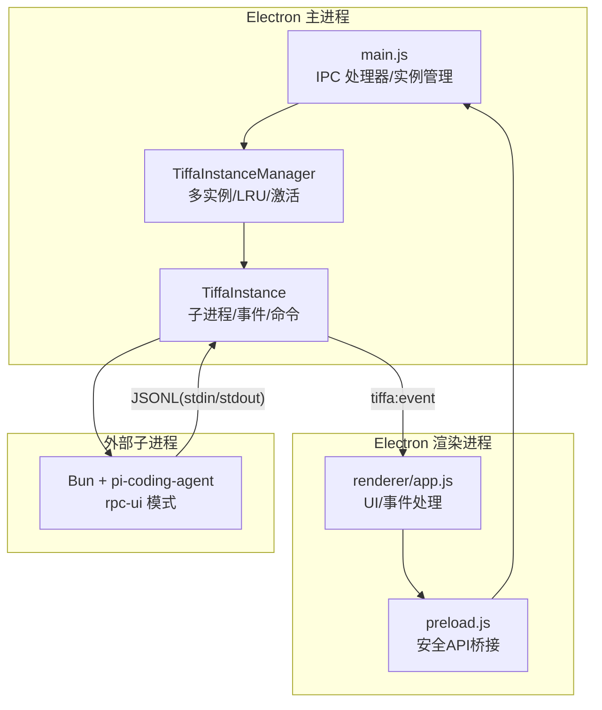
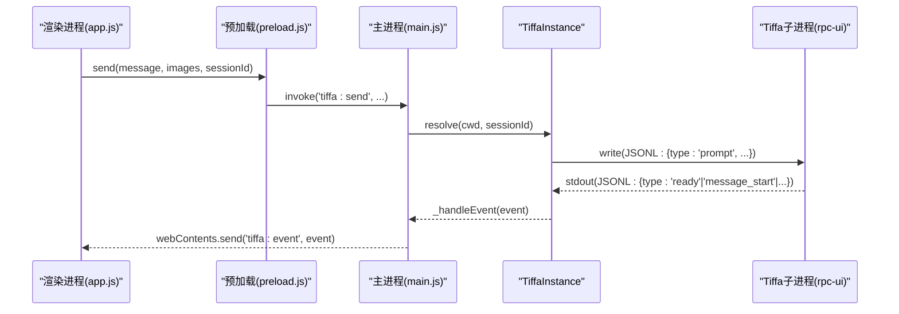
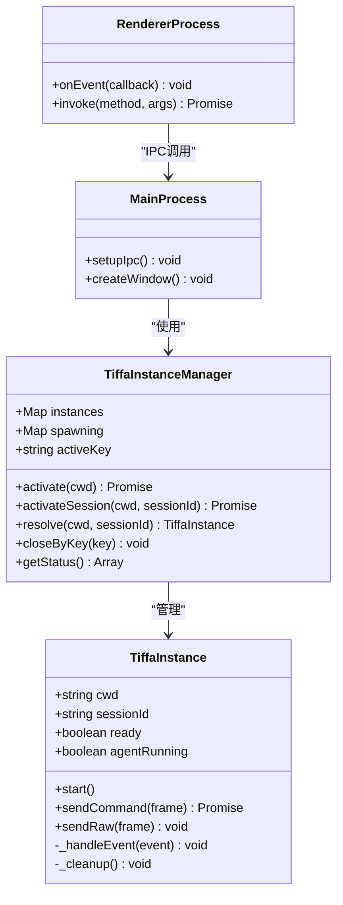

# IPC接口文档

<cite>
**本文引用的文件**   
- [electron/main.js](file://electron/main.js)
- [electron/preload.js](file://electron/preload.js)
- [electron/renderer/app.js](file://electron/renderer/app.js)
</cite>

## 目录
1. [简介](#简介)
2. [项目结构](#项目结构)
3. [核心组件](#核心组件)
4. [架构总览](#架构总览)
5. [详细组件分析](#详细组件分析)
6. [依赖关系分析](#依赖关系分析)
7. [性能考量](#性能考量)
8. [故障排查指南](#故障排查指南)
9. [结论](#结论)
10. [附录](#附录)

## 简介
本文件为 Tiffa 的 IPC 接口完整文档，覆盖 Electron 主进程与渲染进程之间的 37 个 IPC 处理器方法，以及 JSONL over stdin/stdout 通信协议、事件类型定义、消息传递机制与异步处理模式。文档面向不同技术背景的读者，提供从高层架构到代码级细节的系统化说明，并附带调用示例与最佳实践。

## 项目结构
Tiffa Desktop 采用 Electron 架构：
- 主进程（main.js）负责子进程生命周期管理、IPC 路由、JSONL 协议解析与转发。
- 预加载脚本（preload.js）暴露安全的 API 给渲染进程使用。
- 渲染进程（renderer/app.js）订阅事件、驱动 UI、发起 IPC 调用。

**图示来源** 
- [electron/main.js:76-319](file://electron/main.js#L76-L319)
- [electron/main.js:325-570](file://electron/main.js#L325-L570)
- [electron/preload.js:25-35](file://electron/preload.js#L25-L35)
- [electron/renderer/app.js:420-449](file://electron/renderer/app.js#L420-L449)

**章节来源**
- [electron/main.js:1-120](file://electron/main.js#L1-L120)
- [electron/preload.js:25-35](file://electron/preload.js#L25-L35)
- [electron/renderer/app.js:420-449](file://electron/renderer/app.js#L420-L449)

## 核心组件
- TiffaInstance：封装单个 Tiffa 子进程的启动、事件解析、命令发送与响应匹配、崩溃自动重启等。
- TiffaInstanceManager：维护多个 Tiffa 实例（项目级/对话级），实现懒启动、LRU 淘汰、活跃实例切换。
- IPC 处理器：将渲染进程的调用映射到具体实例操作，统一错误返回格式。
- 预加载桥接：向渲染进程暴露简洁 API，屏蔽底层 ipcRenderer.invoke 细节。

**章节来源**
- [electron/main.js:76-319](file://electron/main.js#L76-L319)
- [electron/main.js:325-570](file://electron/main.js#L325-L570)
- [electron/preload.js:25-35](file://electron/preload.js#L25-L35)

## 架构总览
下图展示一次典型的消息发送流程：渲染进程通过 preload 调用主进程 IPC，主进程选择目标实例，写入 JSONL 到子进程 stdin；子进程以 JSONL 输出事件，主进程解析后转发至渲染进程。

**图示来源** 
- [electron/main.js:626-724](file://electron/main.js#L626-L724)
- [electron/main.js:207-248](file://electron/main.js#L207-L248)
- [electron/main.js:250-303](file://electron/main.js#L250-L303)
- [electron/preload.js:25-35](file://electron/preload.js#L25-L35)
- [electron/renderer/app.js:420-449](file://electron/renderer/app.js#L420-L449)

## 详细组件分析

### JSONL over stdin/stdout 通信协议
- 传输格式：每行一个 JSON 对象，UTF-8 编码，换行符 \n 或 \r\n。
- 方向：
  - 主进程 -> 子进程：stdin 写入命令帧（如 prompt、abort、set_model 等）。
  - 子进程 -> 主进程：stdout 输出事件帧（如 ready、agent_start、message_* 等）。
- 命令-响应匹配：
  - 命令帧包含 id 字段（由主进程生成），子进程在 response 中回传相同 id。
  - 主进程通过 pendingCommands Map 关联 Promise 与超时控制。
- 错误处理：
  - 子进程退出时拒绝所有待定命令。
  - 命令超时（默认 5 分钟）返回错误。
  - 非 JSON 行被忽略并记录警告。

**章节来源**
- [electron/main.js:207-248](file://electron/main.js#L207-L248)
- [electron/main.js:250-303](file://electron/main.js#L250-L303)
- [electron/main.js:144-173](file://electron/main.js#L144-L173)

### 事件类型定义
- ready：子进程就绪，主进程设置 ready=true，并触发 embedding 预热。
- agent_start / agent_end：代理运行状态变化。
- prompt_result：提示词结果，可能携带 agentInvoked 标志。
- message_start / message_update / message_end：消息流式更新。
- tool_execution_start / tool_execution_update / tool_execution_end：工具执行生命周期。
- extension_ui_request：扩展 UI 请求，需通过 extensionResponse 回调。
- config_update / session_info_update / notice / set_todos / auto_retry_* / turn_end / session_switch：配置与会话相关事件。

**章节来源**
- [electron/main.js:250-303](file://electron/main.js#L250-L303)
- [electron/renderer/app.js:484-619](file://electron/renderer/app.js#L484-L619)

### 消息传递机制与异步处理模式
- 命令帧：sendCommand 生成唯一 id，注册 Promise，写入 stdin，等待 response。
- 事件帧：_handleEvent 解析事件，匹配 response 完成 Promise，否则转发到渲染进程。
- 预热机制：ready 后延迟发送 /memory rebuild 预热 embedding，期间过滤噪音事件。
- 多实例路由：根据 cwd 与 sessionId 解析目标实例，支持项目级与对话级隔离。

**章节来源**
- [electron/main.js:207-248](file://electron/main.js#L207-L248)
- [electron/main.js:250-303](file://electron/main.js#L250-L303)
- [electron/main.js:325-570](file://electron/main.js#L325-L570)

### IPC 处理器方法清单（37个）
以下为所有 tiffa:* 处理器方法，按功能分组列出签名、参数、返回值与行为说明。

#### 会话与实例管理
- tiffa:activateSession(cwd, sessionId)
  - 参数：cwd(字符串), sessionId(字符串|空)
  - 返回：{success, cwd, sessionId, ready}
  - 行为：激活对话级实例，返回就绪状态。
- tiffa:closeSession(cwd, sessionId)
  - 参数：cwd(字符串), sessionId(字符串)
  - 返回：{success}
  - 行为：关闭指定会话实例。
- tiffa:activate(cwd)
  - 参数：cwd(字符串)
  - 返回：{success, cwd, ready}
  - 行为：激活项目级实例。
- tiffa:instances()
  - 参数：无
  - 返回：实例列表（含 key, cwd, sessionId, active, ready, agentRunning, lastActiveTime）
  - 行为：获取所有实例状态。

**章节来源**
- [electron/main.js:710-724](file://electron/main.js#L710-L724)
- [electron/main.js:726-735](file://electron/main.js#L726-L735)
- [electron/main.js:808-823](file://electron/main.js#L808-L823)

#### 消息与交互
- tiffa:send(message, images, sessionId)
  - 参数：message(字符串|对象), images(数组|空), sessionId(字符串|空)
  - 返回：Promise 响应（可能包含错误）
  - 行为：发送用户消息，支持特殊命令拦截（如 /omfg 规则修复）。
- tiffa:steer(message, sessionId)
  - 参数：message(字符串), sessionId(字符串|空)
  - 返回：无（fire-and-forget）
  - 行为：引导代理继续当前任务。
- tiffa:followUp(message, sessionId)
  - 参数：message(字符串), sessionId(字符串|空)
  - 返回：无（fire-and-forget）
  - 行为：追加后续指令。
- tiffa:abort(sessionId)
  - 参数：sessionId(字符串|空)
  - 返回：无
  - 行为：中止当前代理执行。

**章节来源**
- [electron/main.js:626-724](file://electron/main.js#L626-L724)
- [electron/main.js:773-784](file://electron/main.js#L773-L784)
- [electron/main.js:736-740](file://electron/main.js#L736-L740)

#### 模型与状态
- tiffa:setModel(provider, modelId, sessionId)
  - 参数：provider(字符串), modelId(字符串), sessionId(字符串|空)
  - 返回：Promise 响应
  - 行为：设置当前模型。
- tiffa:getModels()
  - 参数：无
  - 返回：Promise 可用模型列表
  - 行为：获取支持的模型。
- tiffa:isReady()
  - 参数：无
  - 返回：布尔值
  - 行为：检查实例是否就绪。
- tiffa:getState()
  - 参数：无
  - 返回：Promise 状态对象
  - 行为：获取代理内部状态。

**章节来源**
- [electron/main.js:741-750](file://electron/main.js#L741-L750)
- [electron/main.js:751-755](file://electron/main.js#L751-L755)
- [electron/main.js:769-772](file://electron/main.js#L769-L772)

#### 诊断与扩展
- tiffa:diagnostics()
  - 参数：无
  - 返回：{ready, agentRunning, cwd, pid, stdinWritable, pendingCommands}
  - 行为：返回实例诊断信息。
- tiffa:extensionResponse(id, value)
  - 参数：id(字符串), value(对象|任意)
  - 返回：无
  - 行为：响应扩展 UI 请求，支持 cancelled/value/confirmed 语义。
- tiffa:compact()
  - 参数：无
  - 返回：Promise 响应
  - 行为：压缩上下文或清理资源。

**章节来源**
- [electron/main.js:756-768](file://electron/main.js#L756-L768)
- [electron/main.js:785-797](file://electron/main.js#L785-L797)
- [electron/main.js:798-801](file://electron/main.js#L798-L801)

#### 通用命令通道
- tiffa:command(type, payload)
  - 参数：type(字符串), payload(对象)
  - 返回：Promise 响应
  - 行为：通用命令通道，直接转发到子进程。

**章节来源**
- [electron/main.js:802-806](file://electron/main.js#L802-L806)

### 调用示例与最佳实践
- 发送消息：
  - 调用顺序：先 isReady() 检查，再 send() 发送消息。
  - 错误处理：捕获 Promise 拒绝，显示用户友好提示。
- 会话管理：
  - 每个对话独立 sessionId，避免状态污染。
  - 关闭会话时调用 closeSession() 释放资源。
- 模型切换：
  - 切换前确保实例就绪，失败时重试或降级。
- 扩展交互：
  - 收到 extension_ui_request 后，通过 extensionResponse() 回调。
- 性能优化：
  - 批量操作合并请求，减少 IPC 开销。
  - 监听 agent_start/agent_end 控制 UI 状态，避免重复渲染。

**章节来源**
- [electron/renderer/app.js:484-619](file://electron/renderer/app.js#L484-L619)
- [electron/preload.js:25-35](file://electron/preload.js#L25-L35)

## 依赖关系分析
- 主进程依赖：
  - child_process.spawn 启动子进程。
  - readline 解析 stdout 逐行 JSON。
  - fs/path 处理路径与文件。
- 渲染进程依赖：
  - ipcRenderer.invoke 调用主进程方法。
  - webContents.on 监听事件。
- 子进程依赖：
  - Bun 运行时执行 pi-coding-agent CLI。
  - 环境变量注入 UTF-8 支持。

**图示来源** 
- [electron/main.js:76-319](file://electron/main.js#L76-L319)
- [electron/main.js:325-570](file://electron/main.js#L325-L570)

**章节来源**
- [electron/main.js:1-120](file://electron/main.js#L1-L120)
- [electron/main.js:325-570](file://electron/main.js#L325-L570)

## 性能考量
- 子进程池：最多 8 个实例，LRU 淘汰最久未用实例。
- 命令超时：5 分钟超时防止 Promise 挂起。
- 事件过滤：embedding 预热期间过滤噪音事件，减少 UI 压力。
- 内存管理：会话结束时清理 pendingCommands 与资源。
- 网络优化：批量发送消息，减少 IPC 往返。

[本节为通用指导，无需特定文件引用]

## 故障排查指南
- 子进程退出：
  - 检查 stderr 日志，确认启动参数与环境变量。
  - 观察自动重启计数，超过上限需人工干预。
- 命令超时：
  - 增加超时时间或检查子进程负载。
  - 查看 pendingCommands 数量，排查阻塞点。
- 事件丢失：
  - 确认 JSONL 格式正确，无非法字符。
  - 检查渲染进程事件过滤器（如 sessionId 路由）。
- 中文乱码：
  - 验证 UTF-8 环境变量注入生效。
  - 检查终端与文件编码一致性。

**章节来源**
- [electron/main.js:144-173](file://electron/main.js#L144-L173)
- [electron/main.js:207-248](file://electron/main.js#L207-L248)
- [electron/main.js:250-303](file://electron/main.js#L250-L303)

## 结论
Tiffa 的 IPC 接口设计清晰、健壮，通过 JSONL 协议实现高效跨进程通信。主进程的多实例管理与事件路由确保了系统的可扩展性与稳定性。遵循本文档的规范与最佳实践，开发者可轻松集成与扩展 Tiffa 功能。

[本节为总结性内容，无需特定文件引用]

## 附录
- 环境变量：
  - PORTABLE_ROOT：可移植根目录。
  - PI_CODING_AGENT_DIR：Agent 数据目录。
  - PYTHONIOENCODING/PYTHONUTF8：Python UTF-8 支持。
- 调试技巧：
  - 启用 --dev/--verbose 打开 DevTools。
  - 监听 tiffa:exited 事件获取退出码。
  - 使用 diagnostics() 检查实例状态。

**章节来源**
- [electron/main.js:16-31](file://electron/main.js#L16-L31)
- [electron/main.js:577-612](file://electron/main.js#L577-L612)
- [electron/main.js:756-768](file://electron/main.js#L756-L768)