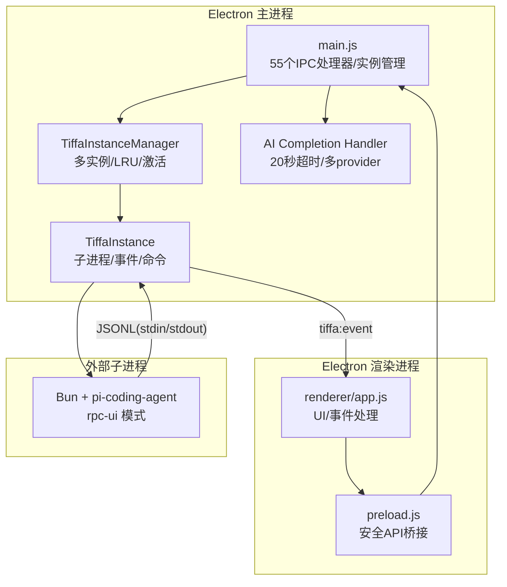
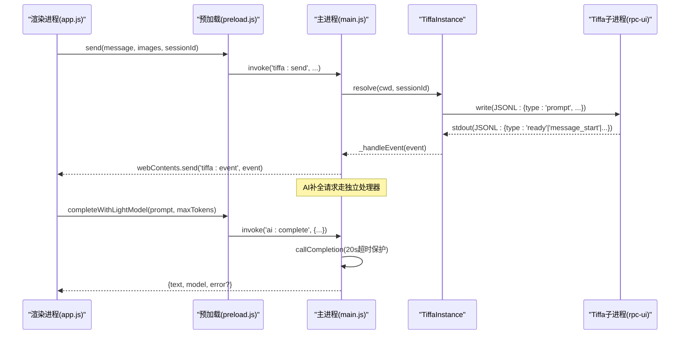
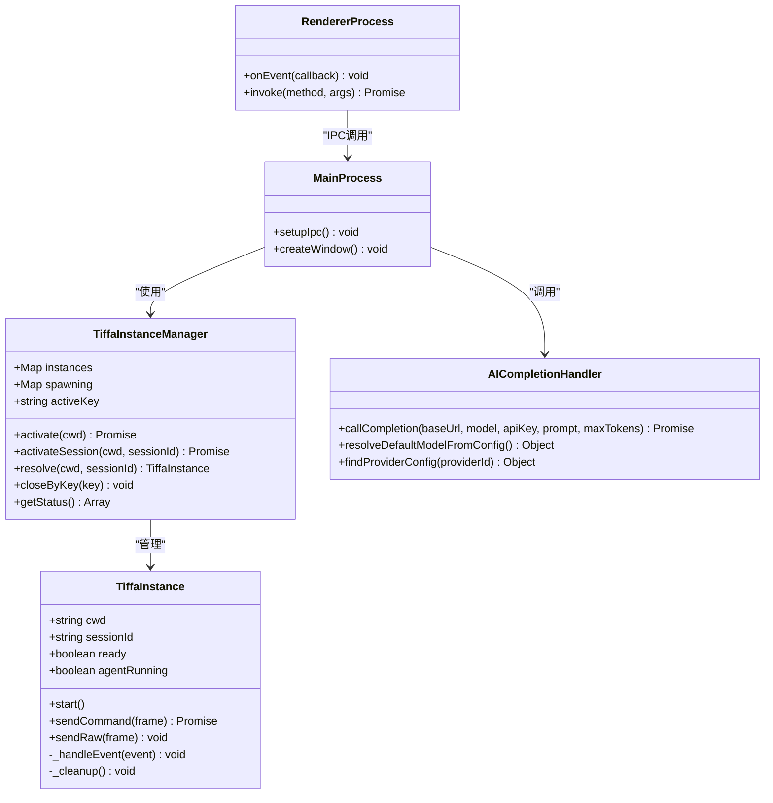

# IPC接口文档

<cite>
**本文引用的文件**   
- [electron/main.js](file://electron/main.js)
- [electron/preload.js](file://electron/preload.js)
- [electron/renderer/app.js](file://electron/renderer/app.js)
</cite>

## 更新摘要
**变更内容**   
- 新增AI完成处理器 `ai:complete`，提供轻量级AI补全功能（如会话重命名等小任务）
- 实现20秒超时保护机制，防止AI调用长时间阻塞
- 支持多provider配置降级链：主模型旁路 → 豆包 → models.yml其他provider
- 增强preload脚本，暴露`completeWithLightModel` API供渲染进程使用
- 完善的错误处理和异常恢复机制

## 目录
1. [简介](#简介)
2. [项目结构](#项目结构)
3. [核心组件](#核心组件)
4. [架构总览](#架构总览)
5. [详细组件分析](#详细组件分析)
6. [依赖关系分析](#依赖关系分析)
7. [性能考量](#性能考量)
8. [故障排查指南](#故障排查指南)
9. [结论](#结论)
10. [附录](#附录)

## 简介
本文件为 Tiffa 的 IPC 接口完整文档，覆盖 Electron 主进程与渲染进程之间的 **55个 IPC 处理器方法**，以及 JSONL over stdin/stdout 通信协议、事件类型定义、消息传递机制与异步处理模式。文档面向不同技术背景的读者，提供从高层架构到代码级细节的系统化说明，并附带调用示例与最佳实践。

## 项目结构
Tiffa Desktop 采用 Electron 架构：
- 主进程（main.js）负责子进程生命周期管理、IPC 路由、JSONL 协议解析与转发。
- 预加载脚本（preload.js）暴露安全的 API 给渲染进程使用。
- 渲染进程（renderer/app.js）订阅事件、驱动 UI、发起 IPC 调用。

**图示来源** 
- [electron/main.js:76-319](file://electron/main.js#L76-L319)
- [electron/main.js:325-570](file://electron/main.js#L325-L570)
- [electron/main.js:2813-2873](file://electron/main.js#L2813-L2873)
- [electron/preload.js:25-35](file://electron/preload.js#L25-L35)
- [electron/renderer/app.js:420-449](file://electron/renderer/app.js#L420-L449)

**章节来源**
- [electron/main.js:1-120](file://electron/main.js#L1-L120)
- [electron/preload.js:25-35](file://electron/preload.js#L25-L35)
- [electron/renderer/app.js:420-449](file://electron/renderer/app.js#L420-L449)

## 核心组件
- TiffaInstance：封装单个 Tiffa 子进程的启动、事件解析、命令发送与响应匹配、崩溃自动重启等。
- TiffaInstanceManager：维护多个 Tiffa 实例（项目级/对话级），实现懒启动、LRU 淘汰、活跃实例切换。
- AI Completion Handler：处理轻量级AI补全请求，支持多provider降级和超时保护。
- IPC 处理器：将渲染进程的调用映射到具体实例操作，统一错误返回格式。
- 预加载桥接：向渲染进程暴露简洁 API，屏蔽底层 ipcRenderer.invoke 细节。

**章节来源**
- [electron/main.js:76-319](file://electron/main.js#L76-L319)
- [electron/main.js:325-570](file://electron/main.js#L325-L570)
- [electron/main.js:2813-2873](file://electron/main.js#L2813-L2873)
- [electron/preload.js:25-35](file://electron/preload.js#L25-L35)

## 架构总览
下图展示一次典型的消息发送流程：渲染进程通过 preload 调用主进程 IPC，主进程选择目标实例，写入 JSONL 到子进程 stdin；子进程以 JSONL 输出事件，主进程解析后转发至渲染进程。

**图示来源** 
- [electron/main.js:626-724](file://electron/main.js#L626-L724)
- [electron/main.js:207-248](file://electron/main.js#L207-L248)
- [electron/main.js:250-303](file://electron/main.js#L250-L303)
- [electron/main.js:2813-2873](file://electron/main.js#L2813-L2873)
- [electron/preload.js:25-35](file://electron/preload.js#L25-L35)
- [electron/renderer/app.js:420-449](file://electron/renderer/app.js#L420-L449)

## 详细组件分析

### JSONL over stdin/stdout 通信协议
- 传输格式：每行一个 JSON 对象，UTF-8 编码，换行符 \n 或 \r\n。
- 方向：
  - 主进程 -> 子进程：stdin 写入命令帧（如 prompt、abort、set_model 等）。
  - 子进程 -> 主进程：stdout 输出事件帧（如 ready、agent_start、message_* 等）。
- 命令-响应匹配：
  - 命令帧包含 id 字段（由主进程生成），子进程在 response 中回传相同 id。
  - 主进程通过 pendingCommands Map 关联 Promise 与超时控制。
- 错误处理：
  - 子进程退出时拒绝所有待定命令。
  - 命令超时（默认 5 分钟）返回错误。
  - 非 JSON 行被忽略并记录警告。

**章节来源**
- [electron/main.js:207-248](file://electron/main.js#L207-L248)
- [electron/main.js:250-303](file://electron/main.js#L250-L303)
- [electron/main.js:144-173](file://electron/main.js#L144-L173)

### 事件类型定义
- ready：子进程就绪，主进程设置 ready=true，并触发 embedding 预热。
- agent_start / agent_end：代理运行状态变化。
- prompt_result：提示词结果，可能携带 agentInvoked 标志。
- message_start / message_update / message_end：消息流式更新。
- tool_execution_start / tool_execution_update / tool_execution_end：工具执行生命周期。
- extension_ui_request：扩展 UI 请求，需通过 extensionResponse 回调。
- config_update / session_info_update / notice / set_todos / auto_retry_* / turn_end / session_switch：配置与会话相关事件。

**章节来源**
- [electron/main.js:250-303](file://electron/main.js#L250-L303)
- [electron/renderer/app.js:484-619](file://electron/renderer/app.js#L484-L619)

### 消息传递机制与异步处理模式
- 命令帧：sendCommand 生成唯一 id，注册 Promise，写入 stdin，等待 response。
- 事件帧：_handleEvent 解析事件，匹配 response 完成 Promise，否则转发到渲染进程。
- 预热机制：ready 后延迟发送 /memory rebuild 预热 embedding，期间过滤噪音事件。
- 多实例路由：根据 cwd 与 sessionId 解析目标实例，支持项目级与对话级隔离。

**章节来源**
- [electron/main.js:207-248](file://electron/main.js#L207-L248)
- [electron/main.js:250-303](file://electron/main.js#L250-L303)
- [electron/main.js:325-570](file://electron/main.js#L325-L570)

### AI完成处理器（新增）
- **ai:complete**：轻量级AI补全处理器，用于会话重命名等小任务
- **降级链策略**：
  1. 主模型旁路：优先使用当前活跃模型的provider配置
  2. 豆包模型：从computer-use grounding.json读取配置
  3. models.yml兜底：遍历其他有apiKey的provider
- **超时保护**：20秒超时防止长时间阻塞
- **错误处理**：逐级尝试，记录最后错误信息

**章节来源**
- [electron/main.js:2813-2873](file://electron/main.js#L2813-L2873)
- [electron/preload.js:75](file://electron/preload.js#L75)

### IPC 处理器方法清单（55个）

#### Tiffa 代理命令（12个）
- tiffa:send(message, images, sessionId)
  - 参数：message(字符串|对象), images(数组|空), sessionId(字符串|空)
  - 返回：Promise 响应（可能包含错误）
  - 行为：发送用户消息，支持特殊命令拦截（如 /omfg 规则修复）。
- tiffa:abort(sessionId)
  - 参数：sessionId(字符串|空)
  - 返回：无
  - 行为：中止当前代理执行。
- tiffa:setModel(provider, modelId, sessionId)
  - 参数：provider(字符串), modelId(字符串), sessionId(字符串|空)
  - 返回：Promise 响应
  - 行为：设置当前模型。
- tiffa:getModels()
  - 参数：无
  - 返回：Promise 可用模型列表
  - 行为：获取支持的模型。
- tiffa:getState()
  - 参数：无
  - 返回：Promise 状态对象
  - 行为：获取代理内部状态。
- tiffa:isReady()
  - 参数：无
  - 返回：布尔值
  - 行为：检查实例是否就绪。
- tiffa:diagnostics()
  - 参数：无
  - 返回：{ready, agentRunning, cwd, pid, stdinWritable, pendingCommands}
  - 行为：返回实例诊断信息。
- tiffa:steer(message, sessionId)
  - 参数：message(字符串), sessionId(字符串|空)
  - 返回：无（fire-and-forget）
  - 行为：引导代理继续当前任务。
- tiffa:followUp(message, sessionId)
  - 参数：message(字符串), sessionId(字符串|空)
  - 返回：无（fire-and-forget）
  - 行为：追加后续指令。
- tiffa:extensionResponse(id, value, sessionId)
  - 参数：id(字符串), value(对象|任意), sessionId(字符串|空)
  - 返回：无
  - 行为：响应扩展 UI 请求，支持 cancelled/value/confirmed 语义。
- tiffa:compact()
  - 参数：无
  - 返回：Promise 响应
  - 行为：压缩上下文或清理资源。
- tiffa:command(type, payload)
  - 参数：type(字符串), payload(对象)
  - 返回：Promise 响应
  - 行为：通用命令通道，直接转发到子进程。

**章节来源**
- [electron/main.js:882-1110](file://electron/main.js#L882-L1110)
- [electron/preload.js:26-37](file://electron/preload.js#L26-L37)

#### AI补全功能（新增）
- ai:complete(prompt, maxTokens, providerHint, modelHint)
  - 参数：prompt(字符串), maxTokens(数字|空), providerHint(字符串|空), modelHint(字符串|空)
  - 返回：{text, model, modelId} 或 {error}
  - 行为：轻量级AI补全，支持多provider降级链和20秒超时保护
  - 降级顺序：主模型旁路 → 豆包 → models.yml其他provider

**章节来源**
- [electron/main.js:2813-2873](file://electron/main.js#L2813-L2873)
- [electron/preload.js:75](file://electron/preload.js#L75)

#### 文件系统操作（4个）
- fs:listDir(dirPath)
  - 参数：dirPath(字符串)
  - 返回：文件列表（含名称、路径、类型、大小、扩展名）
  - 行为：列出目录内容，按类型和字母排序。
- fs:readFile(filePath)
  - 参数：filePath(字符串)
  - 返回：{content, ext, path, size} 或 {error}
  - 行为：读取文件内容，限制5MB大小。
- fs:writeFile(filePath, content)
  - 参数：filePath(字符串), content(字符串)
  - 返回：{success} 或 {error}
  - 行为：写入文件，安全检查路径在PORTABLE_ROOT内。
- fs:readImage(filePath)
  - 参数：filePath(字符串)
  - 返回：{base64, mimeType, path, size} 或 {error}
  - 行为：读取图片文件，转换为base64格式。

**章节来源**
- [electron/main.js:1132-1216](file://electron/main.js#L1132-L1216)
- [electron/preload.js:47-50](file://electron/preload.js#L47-L50)

#### 外部调用（2个）
- shell:openExternal(url)
  - 参数：url(字符串)
  - 返回：无
  - 行为：用系统默认浏览器打开URL。
- shell:openPath(filePath)
  - 参数：filePath(字符串)
  - 返回：无
  - 行为：用系统默认程序打开文件路径。

**章节来源**
- [electron/main.js:1219-1225](file://electron/main.js#L1219-L1225)
- [electron/preload.js:54-55](file://electron/preload.js#L54-L55)

#### 路径工具（2个）
- path:workspace()
  - 参数：无
  - 返回：当前工作区路径
  - 行为：获取当前活动工作区目录。
- path:root()
  - 参数：无
  - 返回：PORTABLE_ROOT路径
  - 行为：获取便携包根目录。

**章节来源**
- [electron/main.js:1228-1229](file://electron/main.js#L1228-L1229)
- [electron/preload.js:58-59](file://electron/preload.js#L58-L59)

#### 会话/项目管理（16个）
- sessions:listProjects()
  - 参数：无
  - 返回：项目列表（含dirName、cwd、displayName、sessionCount等）
  - 行为：列出所有项目，按最近会话活动时间排序。
- sessions:listSessions(projectDirName)
  - 参数：projectDirName(字符串)
  - 返回：会话列表（按时间正序）
  - 行为：列出指定项目的会话文件。
- sessions:switch(sessionPath)
  - 参数：sessionPath(字符串)
  - 返回：Promise 响应
  - 行为：切换到指定会话。
- sessions:new()
  - 参数：无
  - 返回：Promise 响应
  - 行为：创建新会话。
- sessions:loadHistory(sessionPath)
  - 参数：sessionPath(字符串)
  - 返回：{messages, total} 或 {error}
  - 行为：加载会话历史，支持大文件优化。
- sessions:archiveProject(dirName, cwd)
  - 参数：dirName(字符串), cwd(字符串|空)
  - 返回：{success} 或 {error}
  - 行为：归档项目，移动会话文件到归档目录。
- sessions:deleteProject(dirName, cwd)
  - 参数：dirName(字符串), cwd(字符串|空)
  - 返回：{success} 或 {error}
  - 行为：删除项目及其会话数据，带重试机制。
- sessions:listArchived()
  - 参数：无
  - 返回：已归档项目列表
  - 行为：列出所有已归档的项目。
- sessions:restoreProject(dirName)
  - 参数：dirName(字符串)
  - 返回：{success} 或 {error}
  - 行为：恢复已归档项目。
- sessions:archiveSession(sessionPath)
  - 参数：sessionPath(字符串)
  - 返回：{success} 或 {error}
  - 行为：归档单个会话文件。
- sessions:deleteSession(sessionPath)
  - 参数：sessionPath(字符串)
  - 返回：{success} 或 {error}
  - 行为：删除单个会话文件（幂等操作）。
- sessions:rename(sessionPath, newTitle)
  - 参数：sessionPath(字符串), newTitle(字符串)
  - 返回：{success} 或 {error}
  - 行为：重命名会话标题。
- sessions:listArchivedSessions(projectDirName)
  - 参数：projectDirName(字符串)
  - 返回：归档会话列表
  - 行为：列出指定项目的归档会话。
- sessions:restoreSession(sessionPath)
  - 参数：sessionPath(字符串)
  - 返回：{success, restoredPath} 或 {error}
  - 行为：恢复归档会话到活动目录。
- sessions:getUserEntries(sessionPath)
  - 参数：sessionPath(字符串)
  - 返回：{entries} 或 {error}
  - 行为：提取用户消息用于分支功能。
- sessions:exportHtml(sessionPath)
  - 参数：sessionPath(字符串)
  - 返回：{success, path} 或 {error}
  - 行为：导出会话为HTML文件到桌面。

**章节来源**
- [electron/main.js:2130-2792](file://electron/main.js#L2130-L2792)
- [electron/preload.js:62-77](file://electron/preload.js#L62-L77)

#### 模型配置（5个）
- models:read()
  - 参数：无
  - 返回：{data, raw} 或 {error}
  - 行为：读取models.yml配置文件。
- models:write(yamlContent)
  - 参数：yamlContent(字符串)
  - 返回：{success} 或 {error}
  - 行为：写入models.yml，自动备份原文件。
- models:restart()
  - 参数：无
  - 返回：{success} 或 {error}
  - 行为：重启所有Tiffa实例。
- models:writeProvider(providerId, cfg)
  - 参数：providerId(字符串), cfg(对象)
  - 返回：{success} 或 {error}
  - 行为：写入特定provider配置，保留注释。
- models:deleteProvider(providerId)
  - 参数：providerId(字符串)
  - 返回：{success} 或 {error}
  - 行为：删除指定provider配置。

**章节来源**
- [electron/main.js:1260-1355](file://electron/main.js#L1260-L1355)
- [electron/preload.js:84-88](file://electron/preload.js#L84-L88)

#### 配置写入（1个）
- config:writeApprovalMode(tiffaMode)
  - 参数：tiffaMode(字符串: 'normal'|'auto'|'yolo')
  - 返回：{success, agentMode} 或 {error}
  - 行为：写入approvalMode配置到config.yml。

**章节来源**
- [electron/main.js:1362-1379](file://electron/main.js#L1362-L1379)
- [electron/preload.js:91](file://electron/preload.js#L91)

#### 工作区/项目管理（2个）
- workspace:openFolderDialog()
  - 参数：无
  - 返回：{canceled, path} 或 {error}
  - 行为：打开文件夹选择对话框。
- workspace:change(newCwd)
  - 参数：newCwd(字符串)
  - 返回：{success, cwd} 或 {error}
  - 行为：切换工作区，自动创建不存在的项目目录。

**章节来源**
- [electron/main.js:1384-1432](file://electron/main.js#L1384-L1432)
- [electron/preload.js:94-95](file://electron/preload.js#L94-L95)

#### 多实例管理（4个）
- tiffa:activate(cwd)
  - 参数：cwd(字符串)
  - 返回：{success, cwd, ready} 或 {error}
  - 行为：激活项目级实例。
- tiffa:activateSession(cwd, sessionId)
  - 参数：cwd(字符串), sessionId(字符串)
  - 返回：{success, cwd, sessionId, ready} 或 {error}
  - 行为：激活对话级实例，显式设置activeKey。
- tiffa:closeSession(cwd, sessionId)
  - 参数：cwd(字符串), sessionId(字符串)
  - 返回：{success} 或 {error}
  - 行为：关闭指定会话实例。
- tiffa:instances()
  - 参数：无
  - 返回：实例状态列表
  - 行为：获取所有实例的详细信息。

**章节来源**
- [electron/main.js:1113-1129](file://electron/main.js#L1113-L1129)
- [electron/preload.js:98-101](file://electron/preload.js#L98-L101)

#### XML翻译开关（2个）
- xml-translation:status()
  - 参数：无
  - 返回：{enabled} 或 {error}
  - 行为：查询XML翻译功能状态。
- xml-translation:toggle(enabled)
  - 参数：enabled(布尔值)
  - 返回：{enabled} 或 {error}
  - 行为：切换XML翻译功能开关。

**章节来源**
- [electron/main.js:1234-1254](file://electron/main.js#L1234-L1254)
- [electron/preload.js:104-105](file://electron/preload.js#L104-L105)

#### 记忆召回（1个）
- memory:recall(query)
  - 参数：query(字符串)
  - 返回：{results, error?}
  - 行为：直接查询mnemopi SQLite FTS数据库。

**章节来源**
- [electron/main.js:2812-2887](file://electron/main.js#L2812-L2887)
- [electron/preload.js:78](file://electron/preload.js#L78)

#### 其他功能（3个）
- fetch:providerModels(baseUrl, apiKey)
  - 参数：baseUrl(字符串), apiKey(字符串|空)
  - 返回：{models} 或 {error}
  - 行为：从远程API获取可用模型列表。
- clipboardWriteText(text)
  - 参数：text(字符串)
  - 返回：无
  - 行为：写入文本到系统剪贴板。
- getPathForFile(file)
  - 参数：file(File对象)
  - 返回：文件路径字符串
  - 行为：获取文件的绝对路径（兼容Electron 32+）。

**章节来源**
- [electron/main.js:1185-1198](file://electron/main.js#L1185-L1198)
- [electron/preload.js:51, 130-132](file://electron/preload.js#L51)

### 调用示例与最佳实践
- 发送消息：
  - 调用顺序：先 isReady() 检查，再 send() 发送消息。
  - 错误处理：捕获 Promise 拒绝，显示用户友好提示。
- 会话管理：
  - 每个对话独立 sessionId，避免状态污染。
  - 关闭会话时调用 closeSession() 释放资源。
- 模型切换：
  - 切换前确保实例就绪，失败时重试或降级。
- 扩展交互：
  - 收到 extension_ui_request 后，通过 extensionResponse() 回调。
- 轻量AI补全：
  - 使用 completeWithLightModel() 进行会话重命名等小任务。
  - 支持多级降级，自动选择最优provider。
- 性能优化：
  - 批量操作合并请求，减少 IPC 开销。
  - 监听 agent_start/agent_end 控制 UI 状态，避免重复渲染。

**章节来源**
- [electron/renderer/app.js:484-619](file://electron/renderer/app.js#L484-L619)
- [electron/preload.js:25-35](file://electron/preload.js#L25-L35)

## 依赖关系分析
- 主进程依赖：
  - child_process.spawn 启动子进程。
  - readline 解析 stdout 逐行 JSON。
  - fs/path 处理路径与文件。
  - AbortController 实现超时控制。
- 渲染进程依赖：
  - ipcRenderer.invoke 调用主进程方法。
  - webContents.on 监听事件。
- 子进程依赖：
  - Bun 运行时执行 pi-coding-agent CLI。
  - 环境变量注入 UTF-8 支持。

**图示来源** 
- [electron/main.js:76-319](file://electron/main.js#L76-L319)
- [electron/main.js:325-570](file://electron/main.js#L325-L570)
- [electron/main.js:2813-2873](file://electron/main.js#L2813-L2873)

**章节来源**
- [electron/main.js:1-120](file://electron/main.js#L1-L120)
- [electron/main.js:325-570](file://electron/main.js#L325-L570)

## 性能考量
- 子进程池：最多 8 个实例，LRU 淘汰最久未用实例。
- 命令超时：5 分钟超时防止 Promise 挂起。
- AI补全超时：20秒超时防止长时间阻塞。
- 事件过滤：embedding 预热期间过滤噪音事件，减少 UI 压力。
- 内存管理：会话结束时清理 pendingCommands 与资源。
- 网络优化：批量发送消息，减少 IPC 往返。
- 文件操作：大文件读取限制（5MB文件，20MB会话文件优化）。
- 数据库查询：记忆召回使用SQLite FTS索引，提升搜索性能。
- Provider降级：AI补全支持多级降级，提高成功率。

[本节为通用指导，无需特定文件引用]

## 故障排查指南
- 子进程退出：
  - 检查 stderr 日志，确认启动参数与环境变量。
  - 观察自动重启计数，超过上限需人工干预。
- 命令超时：
  - 增加超时时间或检查子进程负载。
  - 查看 pendingCommands 数量，排查阻塞点。
- AI补全失败：
  - 检查各provider配置是否正确。
  - 验证网络连接和API密钥有效性。
  - 查看降级链日志，确定失败环节。
- 事件丢失：
  - 确认 JSONL 格式正确，无非法字符。
  - 检查渲染进程事件过滤器（如 sessionId 路由）。
- 中文乱码：
  - 验证 UTF-8 环境变量注入生效。
  - 检查终端与文件编码一致性。
- 文件权限：
  - 检查PORTABLE_ROOT路径权限。
  - 确认Windows文件句柄释放（EBUSY错误）。
- 会话损坏：
  - 使用sessions:loadHistory验证JSONL格式。
  - 检查会话文件头部完整性。

**章节来源**
- [electron/main.js:144-173](file://electron/main.js#L144-L173)
- [electron/main.js:207-248](file://electron/main.js#L207-L248)
- [electron/main.js:250-303](file://electron/main.js#L250-L303)

## 结论
Tiffa 的 IPC 接口设计清晰、健壮，通过 JSONL 协议实现高效跨进程通信。主进程的多实例管理与事件路由确保了系统的可扩展性与稳定性。**新增的55个IPC处理器方法**提供了完整的会话生命周期管理、文件系统操作、配置管理和高级功能，使Tiffa成为一个功能完备的AI助手桌面应用。**新增的AI补全处理器**进一步增强了系统的智能化能力，支持轻量级AI任务和智能降级策略。遵循本文档的规范与最佳实践，开发者可轻松集成与扩展 Tiffa 功能。

[本节为总结性内容，无需特定文件引用]

## 附录
- 环境变量：
  - PORTABLE_ROOT：可移植根目录。
  - PI_CODING_AGENT_DIR：Agent 数据目录。
  - PYTHONIOENCODING/PYTHONUTF8：Python UTF-8 支持。
- 调试技巧：
  - 启用 --dev/--verbose 打开 DevTools。
  - 监听 tiffa:exited 事件获取退出码。
  - 使用 diagnostics() 检查实例状态。
- 错误代码：
  - EBUSY/EPERM：Windows文件锁冲突，使用rimrafWithRetry重试。
  - timeout：命令超时，检查子进程状态。
  - not found：文件或路径不存在，验证输入参数。
- 性能指标：
  - 最大实例数：8个
  - 命令超时：5分钟
  - AI补全超时：20秒
  - 文件大小限制：5MB（普通文件），20MB（会话文件）
  - 内存回收：LRU策略，基于lastActiveTime
- AI补全降级链：
  1. 主模型旁路（当前活跃模型）
  2. 豆包模型（grounding.json配置）
  3. models.yml其他provider（兜底）

**章节来源**
- [electron/main.js:16-31](file://electron/main.js#L16-L31)
- [electron/main.js:577-612](file://electron/main.js#L577-L612)
- [electron/main.js:756-768](file://electron/main.js#L756-L768)
- [electron/main.js:2813-2873](file://electron/main.js#L2813-L2873)