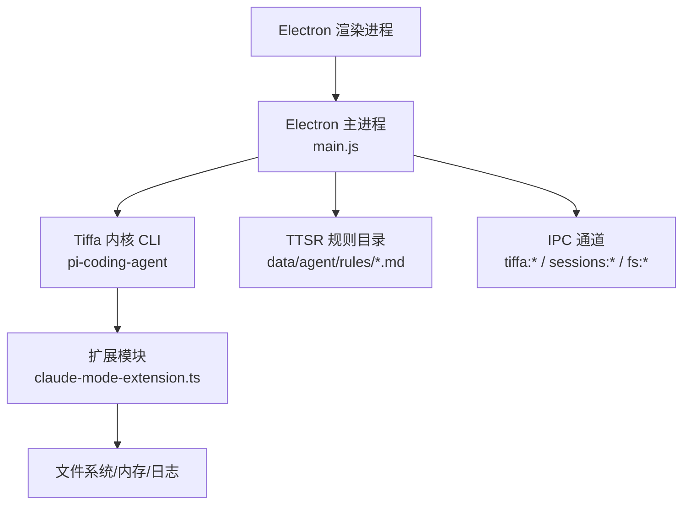
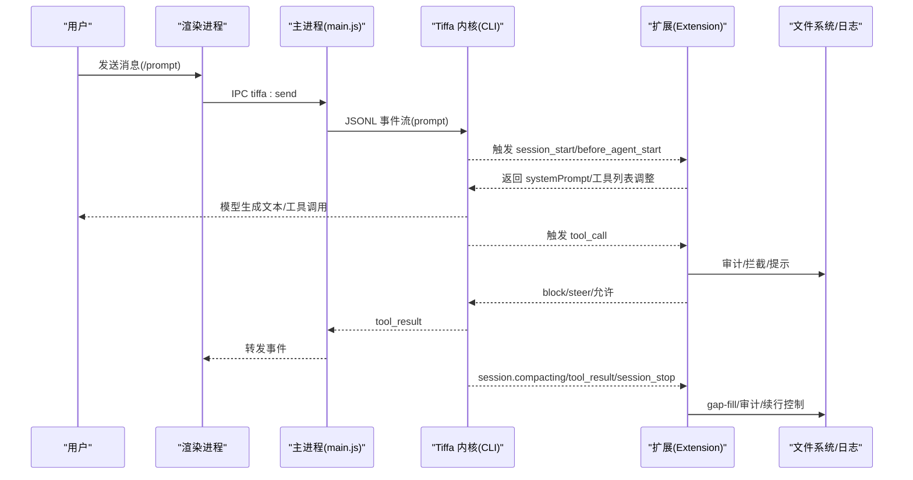
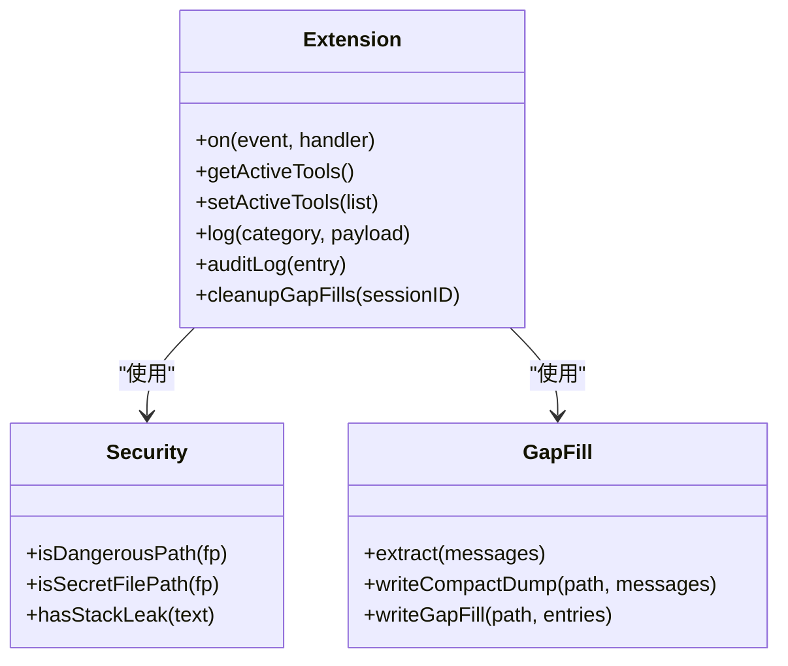
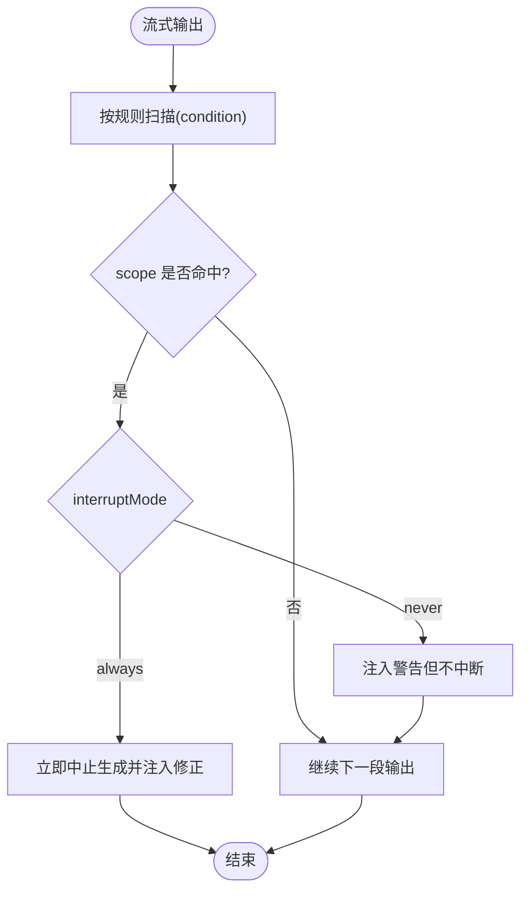
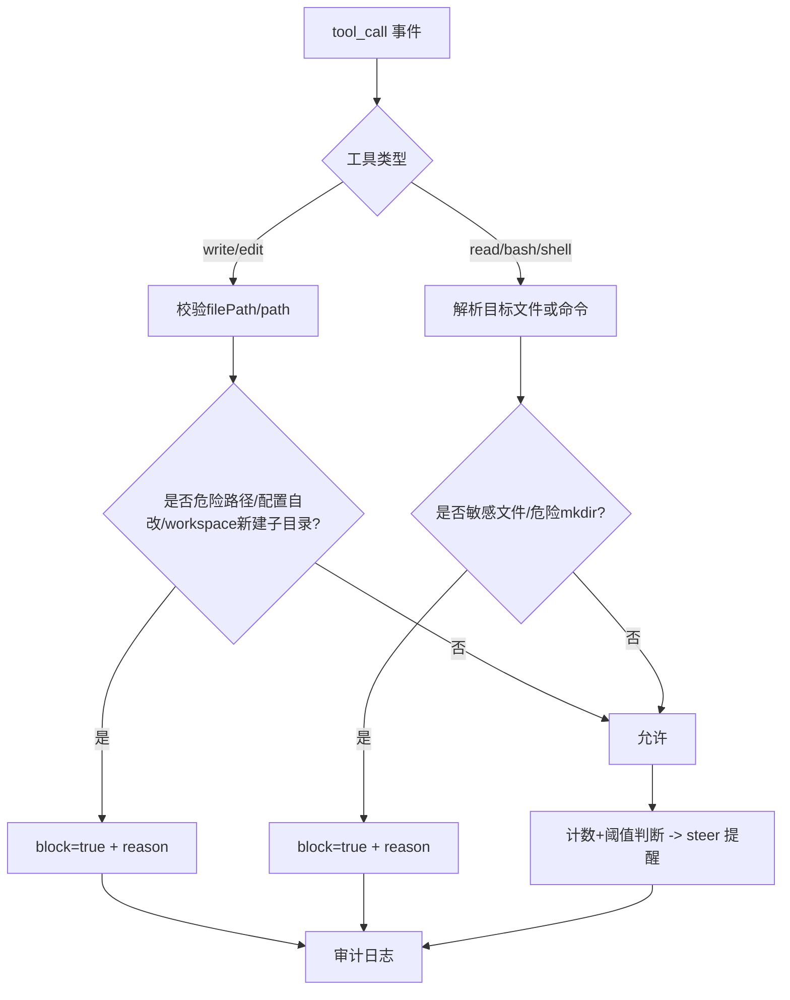
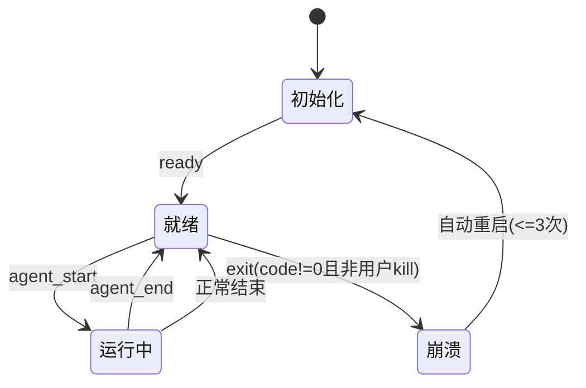
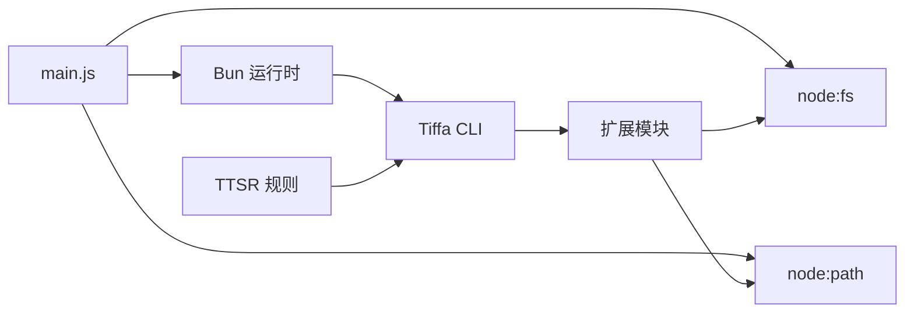

# 扩展API文档

<cite>
**本文引用的文件**
- [electron/main.js](file://electron/main.js)
- [plugins/claude-mode-extension.ts](file://plugins/claude-mode-extension.ts)
- [data/agent/rules/no-xml-toolcall.md](file://data/agent/rules/no-xml-toolcall.md)
- [README.md](file://README.md)
- [AGENTS.md](file://AGENTS.md)
</cite>

## 目录
1. [简介](#简介)
2. [项目结构](#项目结构)
3. [核心组件](#核心组件)
4. [架构总览](#架构总览)
5. [详细组件分析](#详细组件分析)
6. [依赖关系分析](#依赖关系分析)
7. [性能考量](#性能考量)
8. [故障排查指南](#故障排查指南)
9. [结论](#结论)
10. [附录](#附录)

## 简介
本文件为 Tiffa 扩展系统的完整 API 文档，聚焦于扩展机制、Hook 事件、TTSR 规则系统、工具调用拦截、生命周期管理、安全策略与沙箱机制，并提供开发最佳实践、调试技巧与性能优化建议。读者可据此从零开始编写扩展，或基于现有能力进行二次开发与集成。

## 项目结构
Tiffa 的扩展体系由三部分构成：
- Electron 主进程：负责子进程（Tiffa 内核）生命周期、IPC 通信、命令拦截（如 /omfg）。
- 扩展模块：通过 -e 参数加载，实现 Hook 事件监听、行为约束、审计日志、gap-fill 断片补救等。
- TTSR 规则系统：以 Markdown + YAML frontmatter 形式定义流式匹配规则，零上下文成本实时拦截。

图示来源
- [electron/main.js:1-2248](file://electron/main.js#L1-L2248)
- [plugins/claude-mode-extension.ts:1-546](file://plugins/claude-mode-extension.ts#L1-L546)
- [data/agent/rules/no-xml-toolcall.md:1-10](file://data/agent/rules/no-xml-toolcall.md#L1-L10)

章节来源
- [README.md:1-214](file://README.md#L1-L214)
- [AGENTS.md:1-310](file://AGENTS.md#L1-L310)

## 核心组件
- 扩展入口与事件总线
  - 扩展通过默认导出函数注册到内核，使用 pi.on(...) 订阅事件，返回控制结果（block/steer/context/systemPrompt/continue 等）。
  - 关键事件：session_start、before_agent_start、tool_call、session_stop、session.compacting、tool_result。
- 工具清理与记忆工具可见性
  - 在 session_start 与 before_agent_start 中确保 eval/hub 被移除，并显式启用 recall/retain/reflect/memory_edit 等记忆工具。
- 行为约束注入
  - before_agent_start 读取 constraints-inject.md 与 PROJECT.md，合并后作为 systemPrompt 前缀注入。
- 工具调用拦截
  - tool_call 中对 write/edit/read/bash/shell 等进行路径与命令级安全检查，阻止危险路径、配置文件自改、workspace 根目录新建子目录、敏感文件读取等。
- 断片补救（gap-fill）
  - session.compacting 时提取改动文件、关键命令、决策要点，落盘 compact/gap-fill 文件，并立即返回 context 注入。
- 错误续行
  - session_stop 对 error 场景进行一次制 5 秒延迟续行，避免中断导致任务失败。
- 审计日志与泄露防护
  - tool_result 记录审计日志，并对错误输出中的堆栈/路径泄露进行清洗。

章节来源
- [plugins/claude-mode-extension.ts:1-546](file://plugins/claude-mode-extension.ts#L1-L546)
- [AGENTS.md:113-156](file://AGENTS.md#L113-L156)

## 架构总览
下图展示从用户输入到扩展拦截、规则匹配、工具执行与审计的全链路流程。

图示来源
- [electron/main.js:1-2248](file://electron/main.js#L1-L2248)
- [plugins/claude-mode-extension.ts:1-546](file://plugins/claude-mode-extension.ts#L1-L546)

## 详细组件分析

### 扩展 Hook 事件与 API
- 事件与回调签名
  - pi.on("session_start", async () => { ... })
  - pi.on("before_agent_start", async (event) => { return { systemPrompt: [...] } })
  - pi.on("tool_call", async (event) => { return { block?: boolean, reason?: string, steer?: string } })
  - pi.on("session_stop", async (event) => { return { continue?: boolean, additionalContext?: string } })
  - pi.on("session.compacting", async (event, ctx?) => { return { context?: string[] } })
  - pi.on("tool_result", async (event) => { return { content?, isError? } })
- 返回值约定
  - block/reason：阻止工具调用并给出原因
  - steer：向模型发出引导提示
  - systemPrompt：注入系统提示（before_agent_start）
  - continue/additionalContext：会话停止后的续行控制（session_stop）
  - context：压缩阶段注入上下文（session.compacting）
  - content/isError：工具结果清洗（tool_result）

章节来源
- [plugins/claude-mode-extension.ts:132-546](file://plugins/claude-mode-extension.ts#L132-L546)

#### 对象关系图（扩展内部结构与依赖）

图示来源
- [plugins/claude-mode-extension.ts:65-127](file://plugins/claude-mode-extension.ts#L65-L127)
- [plugins/claude-mode-extension.ts:351-464](file://plugins/claude-mode-extension.ts#L351-L464)

### TTSR 规则系统
- 规则文件格式
  - Markdown + YAML frontmatter，字段包括 description、condition、scope、interruptMode、repeatMode（可选）。
- 条件匹配语法
  - condition：JavaScript 正则表达式或数组；支持 text/thinking/tool 三类流；支持 tool:<name>(<glob>) 限定工具与作用域。
- 作用域设置
  - scope：逗号分隔的 allowlist，如 "text"、"thinking"、"tool"、"tool:write(*.ts)" 等。
- 行为模式
  - interruptMode：always（立即中止）、never（仅注入警告不中断）。
  - repeatMode：once（每会话一次）、after-gap（间隔 N 条消息后重触发）。
- 典型规则示例
  - no-xml-toolcall.md：禁止 XML 格式工具调用，匹配 <function=...> 并在 text/thinking 中拦截。

图示来源
- [data/agent/rules/no-xml-toolcall.md:1-10](file://data/agent/rules/no-xml-toolcall.md#L1-L10)
- [electron/main.js:644-687](file://electron/main.js#L644-L687)

章节来源
- [data/agent/rules/no-xml-toolcall.md:1-10](file://data/agent/rules/no-xml-toolcall.md#L1-L10)
- [AGENTS.md:79-111](file://AGENTS.md#L79-L111)
- [electron/main.js:644-687](file://electron/main.js#L644-L687)

### 工具调用拦截系统
- 拦截范围
  - write/edit：检查 filePath/path，阻止 System32/Windows/Program Files、config.yml/models.yml/扩展自身、workspace 根目录下新建一级子目录。
  - read/bash/shell：拦截 .env/证书/密钥类文件读取；bash/shell 中检测 mkdir 新建 workspace 子目录。
- 静默工具调用检测
  - 连续多次无文字说明的工具调用（阈值≥3），触发 steer 提醒先说明进展再继续。
- 审计日志
  - tool_result 写入 JSONL 日志，包含时间戳、工具名、是否错误等。

图示来源
- [plugins/claude-mode-extension.ts:259-349](file://plugins/claude-mode-extension.ts#L259-L349)

章节来源
- [plugins/claude-mode-extension.ts:259-349](file://plugins/claude-mode-extension.ts#L259-L349)

### 生命周期管理与事件监听
- 启动与就绪
  - 主进程通过 spawn(BUN_EXE, args) 启动 Tiffa 内核，args 包含 --mode rpc-ui -e EXTENSION_PATH。
  - 就绪检测：100ms 轮询，最多 15 秒；embedding 预热期间过滤噪音事件。
- 实例管理
  - LRU 淘汰、stall 检测（3 分钟无事件 → abort + steer；再 30 秒未恢复 → forceKill）、崩溃自动重启（非用户 kill、非零退出码、上限 3 次）。
- 会话激活与关闭
  - 每对话独立进程，activateSession/closeSession 精确控制实例生命周期。

图示来源
- [electron/main.js:76-179](file://electron/main.js#L76-L179)
- [electron/main.js:424-570](file://electron/main.js#L424-L570)

章节来源
- [electron/main.js:76-179](file://electron/main.js#L76-L179)
- [electron/main.js:424-570](file://electron/main.js#L424-L570)

### 扩展开发最佳实践
- 精简职责：遵循“搭车”原则，只保留内核不覆盖的能力（安全拦截、审计、gap-fill、error 续行等）。
- 最小化上下文：优先使用 TTSR 规则进行零 Context 成本约束，减少 systemPrompt 体积。
- 精准作用域：TTSR scope 尽量窄，避免误伤；tool_call 拦截条件明确具体工具与路径。
- 可观测性：完善审计日志与插件日志，便于问题定位。
- 健壮性：异常捕获与降级处理，避免扩展影响内核稳定性。

章节来源
- [AGENTS.md:113-156](file://AGENTS.md#L113-L156)
- [plugins/claude-mode-extension.ts:1-28](file://plugins/claude-mode-extension.ts#L1-L28)

### 调试技巧
- 插件日志：扩展内 log() 写入 claude-mode.log，审计日志写入 data/log/*.jsonl。
- 主进程日志：stderr 输出与 console.log，便于 Electron 控制台查看。
- 事件追踪：通过 IPC 转发的事件观察扩展触发时机与返回值。
- 规则验证：使用 /omfg 命令生成或修复 TTSR 规则，即时生效。

章节来源
- [plugins/claude-mode-extension.ts:44-63](file://plugins/claude-mode-extension.ts#L44-L63)
- [electron/main.js:137-142](file://electron/main.js#L137-L142)
- [electron/main.js:644-687](file://electron/main.js#L644-L687)

### 性能优化建议
- 规则先行：用 TTSR 替代冗长 systemPrompt，降低 token 消耗。
- 批量操作：gap-fill 提取限制条目数（≤60），compact dump 仅保留最近 50 条。
- 异步与超时：embedding 预热期间过滤噪音，避免首次冷加载阻塞。
- 资源清理：gap-fill 文件 60 分钟后自动清理，防止磁盘膨胀。

章节来源
- [plugins/claude-mode-extension.ts:351-464](file://plugins/claude-mode-extension.ts#L351-L464)
- [electron/main.js:255-269](file://electron/main.js#L255-L269)

### 安全策略与权限控制
- 路径白名单：禁止 System32/Windows/Program Files 等系统目录。
- 配置保护：禁止 AI 修改 config.yml/models.yml/扩展自身。
- 敏感文件：拦截 .env/证书/密钥类文件读取。
- 工作区隔离：禁止在 workspace 根目录下新建一级子目录。
- 输出清洗：错误结果中的堆栈/路径泄露自动过滤。

章节来源
- [plugins/claude-mode-extension.ts:65-97](file://plugins/claude-mode-extension.ts#L65-L97)
- [plugins/claude-mode-extension.ts:275-349](file://plugins/claude-mode-extension.ts#L275-L349)
- [plugins/claude-mode-extension.ts:510-542](file://plugins/claude-mode-extension.ts#L510-L542)

### 完整的扩展开发示例
- 简单行为控制
  - 在 before_agent_start 中注入 constraints-inject.md 与 PROJECT.md，形成系统提示前缀。
- 复杂工具拦截
  - 在 tool_call 中针对 write/edit/read/bash/shell 进行路径与命令级检查，返回 block/steer。
- 断片补救
  - 在 session.compacting 中提取关键信息，落盘并立即注入 context。
- 错误续行
  - 在 session_stop 中识别 error 场景，延迟 5 秒后返回 continue 与 additionalContext。

章节来源
- [plugins/claude-mode-extension.ts:175-257](file://plugins/claude-mode-extension.ts#L175-L257)
- [plugins/claude-mode-extension.ts:259-349](file://plugins/claude-mode-extension.ts#L259-L349)
- [plugins/claude-mode-extension.ts:351-464](file://plugins/claude-mode-extension.ts#L351-L464)
- [plugins/claude-mode-extension.ts:468-508](file://plugins/claude-mode-extension.ts#L468-L508)

## 依赖关系分析
- 主进程依赖
  - electron、child_process、yaml、path、fs 等。
  - 通过 spawn 启动 BUN 运行时与 Tiffa CLI，传递 -e 扩展路径。
- 扩展依赖
  - node:fs、node:path，用于文件读写、路径解析、审计日志与 gap-fill 管理。
- 规则系统
  - 数据驱动（Markdown + YAML），无需代码变更即可生效。

图示来源
- [electron/main.js:1-120](file://electron/main.js#L1-L120)
- [plugins/claude-mode-extension.ts:29-41](file://plugins/claude-mode-extension.ts#L29-L41)

章节来源
- [electron/main.js:1-120](file://electron/main.js#L1-L120)
- [plugins/claude-mode-extension.ts:29-41](file://plugins/claude-mode-extension.ts#L29-L41)

## 性能考量
- 零 Context 规则：TTSR 在流式输出阶段匹配，不占用模型上下文。
- 事件过滤：embedding 预热期间过滤噪音，避免无效事件传播。
- 资源清理：gap-fill 与 compact dump 定期清理，控制磁盘占用。
- 异步处理：扩展内文件 IO 采用同步写入但包裹 try/catch，避免阻塞主流程。

章节来源
- [electron/main.js:255-269](file://electron/main.js#L255-L269)
- [plugins/claude-mode-extension.ts:99-127](file://plugins/claude-mode-extension.ts#L99-L127)

## 故障排查指南
- 常见问题
  - 扩展未加载：检查 -e 参数与 EXTENSION_PATH 是否正确。
  - 规则不生效：确认 condition/scope/interruptMode 配置无误。
  - 工具被拦截：查看 tool_call 拦截日志与 reason。
  - 会话卡住：检查 stall 检测与 autoRestart 逻辑。
- 日志位置
  - 插件日志：plugins/claude-mode.log
  - 审计日志：data/log/*.jsonl
  - 主进程 stderr：Electron 控制台输出

章节来源
- [plugins/claude-mode-extension.ts:44-63](file://plugins/claude-mode-extension.ts#L44-L63)
- [electron/main.js:137-142](file://electron/main.js#L137-L142)

## 结论
Tiffa 扩展系统以轻量、安全、可观测为核心设计目标，通过 Hook 事件、TTSR 规则与工具拦截构建起强大的行为控制与安全保障。开发者可基于此快速实现从简单行为约束到复杂工具拦截的多样化扩展，同时享受完善的调试与性能优化支持。

## 附录
- 环境变量
  - PI_CODING_AGENT_DIR：Agent 数据目录
  - HOME/USERPROFILE：重定向至便携包内
  - PORTABLE_ROOT：便携包根目录
- 启动方式
  - 桌面启动器、VBS 启动器、批处理脚本、TUI/WebUI 模式

章节来源
- [AGENTS.md:256-265](file://AGENTS.md#L256-L265)
- [README.md:198-208](file://README.md#L198-L208)