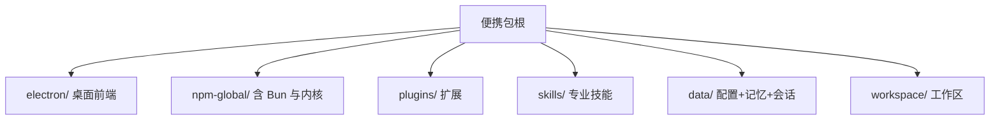
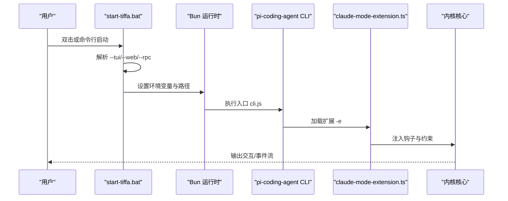
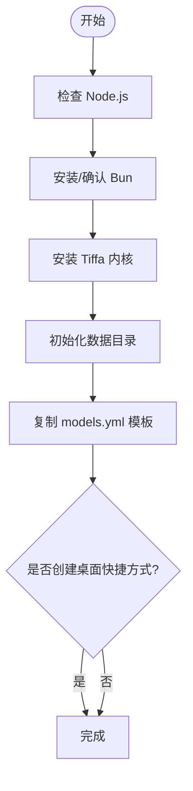
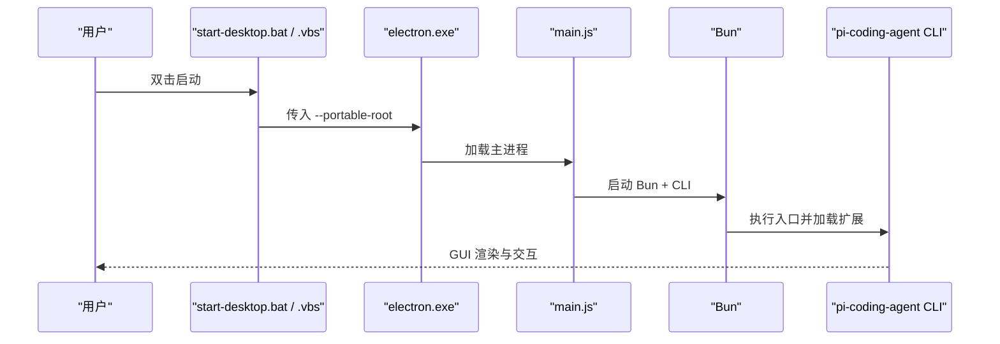
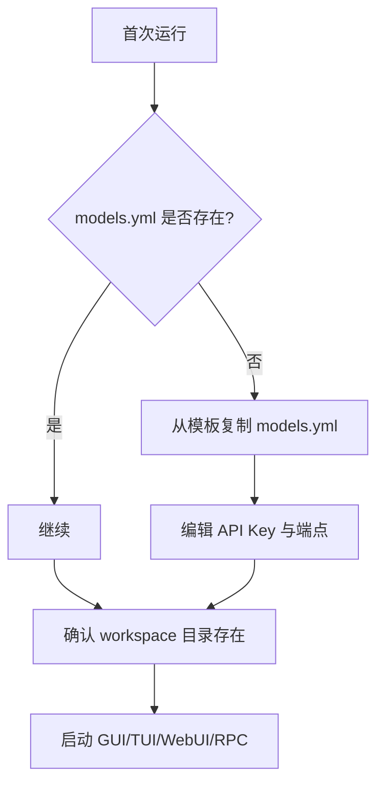
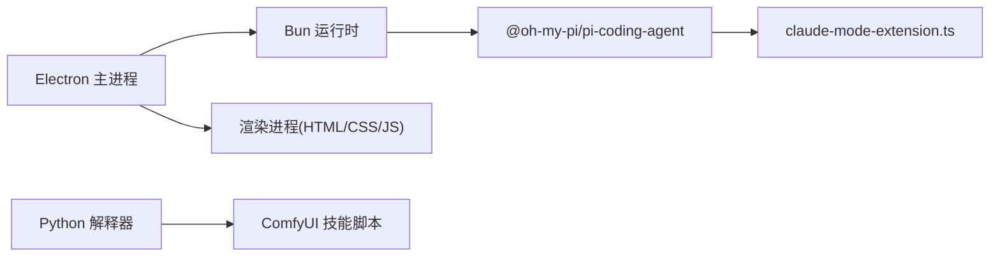

# 快速开始

<cite>
**本文引用的文件**   
- [README.md](file://README.md)
- [AGENTS.md](file://AGENTS.md)
- [install.bat](file://install.bat)
- [install.ps1](file://install.ps1)
- [start-desktop.bat](file://start-desktop.bat)
- [start-tiffa.bat](file://start-tiffa.bat)
- [tiffa-desktop.vbs](file://tiffa-desktop.vbs)
- [electron/main.js](file://electron/main.js)
- [data/agent/config.yml](file://data/agent/config.yml)
- [data/agent/models.yml](file://data/agent/models.yml)
- [data/agent/models.yml.example](file://data/agent/models.yml.example)
- [skills/comfyui-image-gen/comfy.py](file://skills/comfyui-image-gen/comfy.py)
</cite>

## 目录
1. [简介](#简介)
2. [项目结构](#项目结构)
3. [核心组件](#核心组件)
4. [架构总览](#架构总览)
5. [详细组件分析](#详细组件分析)
6. [依赖关系分析](#依赖关系分析)
7. [性能注意事项](#性能注意事项)
8. [故障排除指南](#故障排除指南)
9. [结论](#结论)
10. [附录](#附录)

## 简介
Tiffa 是一个便携型 AI 编程助手，基于 @oh-my-pi/pi-coding-agent v17.0.7 并套上 Electron 桌面壳。它强调“本地优先、弱模型可用、记忆永续”，支持桌面 GUI、终端 TUI、WebUI（RPC-UI）与 RPC 模式，开箱即用且可离线运行。

## 项目结构
- 根目录即便携包根，包含 Electron 前端、Bun 运行时、内核、插件、技能与数据目录等。
- 安装脚本提供一键初始化：设置国内镜像源、检测 Node/Bun、安装内核、创建必要目录与默认配置。
- 启动脚本覆盖桌面版与三种终端模式（TUI/WebUI/RPC）。

图表来源
- [README.md:176-186](file://README.md#L176-L186)
- [AGENTS.md:9-24](file://AGENTS.md#L9-L24)

章节来源
- [README.md:176-186](file://README.md#L176-L186)
- [AGENTS.md:9-24](file://AGENTS.md#L9-L24)

## 核心组件
- 运行时与环境
  - Bun 运行时：用于执行 Tiffa 内核与扩展。
  - Node.js：Electron 构建与运行依赖（优先使用便携包内 node.exe，回退系统 node）。
  - Python：部分技能（如 ComfyUI 生图）需要 Python 解释器。
- 内核与扩展
  - 内核：@oh-my-pi/pi-coding-agent（v17.0.7），通过 Bun 执行。
  - 扩展：plugins/claude-mode-extension.ts，通过 -e 参数加载。
- 前端
  - Electron 主进程管理多实例、IPC、窗口生命周期与 UTF-8 编码注入。
- 配置
  - data/agent/config.yml：模型角色、记忆后端与工具策略。
  - data/agent/models.yml：各云/本地模型提供者与密钥。

章节来源
- [AGENTS.md:9-24](file://AGENTS.md#L9-L24)
- [AGENTS.md:254-262](file://AGENTS.md#L254-L262)
- [data/agent/config.yml:1-30](file://data/agent/config.yml#L1-L30)
- [data/agent/models.yml:1-242](file://data/agent/models.yml#L1-L242)

## 架构总览
Tiffa 的启动路径分为桌面与终端两类；桌面由 Electron 主进程拉起内核子进程并通过 JSONL 通信，终端模式直接通过 Bun 调用内核 CLI。

图表来源
- [start-tiffa.bat:79-148](file://start-tiffa.bat#L79-L148)
- [electron/main.js:16-31](file://electron/main.js#L16-L31)

章节来源
- [README.md:198-207](file://README.md#L198-L207)
- [AGENTS.md:26-35](file://AGENTS.md#L26-L35)

## 详细组件分析

### 环境要求与安装（Windows）
- 环境要求
  - Windows 10/11（推荐）
  - Node.js（可选，若未内置便携包内的 node.exe）
  - Bun 运行时（安装脚本自动安装到 npm-global）
  - Python（可选，仅在使用 ComfyUI 等 Python 技能时需要）
- 安装步骤
  - 双击 install.bat，内部调用 install.ps1。
  - 脚本会：
    - 设置 npm/Electron 国内镜像
    - 检测 Node.js（便携优先，系统次之）
    - 安装 Bun 到 npm-global
    - 安装 Tiffa 内核（@oh-my-pi/pi-coding-agent）
    - 初始化 data 目录结构与默认配置文件（config.yml、models.yml）
    - 可选创建桌面快捷方式
- 首次运行提示
  - 若 models.yml 不存在，会从模板复制并提示编辑 API Key。

图表来源
- [install.ps1:28-186](file://install.ps1#L28-L186)

章节来源
- [install.bat:1-11](file://install.bat#L1-L11)
- [install.ps1:28-186](file://install.ps1#L28-L186)

### 启动方式
- 桌面应用
  - 双击 tiffa-desktop.exe 或 tiffa-desktop.vbs（无控制台窗口）
  - 或通过 start-desktop.bat 带 --portable-root 启动
- 终端模式
  - TUI：start-tiffa.bat --tui（默认）
  - WebUI：start-tiffa.bat --web（RPC-UI，JSON 事件流）
  - RPC：start-tiffa.bat --rpc（纯 JSON-RPC，便于集成）

图表来源
- [start-desktop.bat:1-25](file://start-desktop.bat#L1-L25)
- [tiffa-desktop.vbs:1-23](file://tiffa-desktop.vbs#L1-L23)
- [electron/main.js:16-31](file://electron/main.js#L16-L31)

章节来源
- [README.md:198-207](file://README.md#L198-L207)
- [AGENTS.md:26-35](file://AGENTS.md#L26-L35)

### 首次配置指导
- 模型设置
  - 编辑 data/agent/models.yml，填入各 Provider 的 baseUrl 与 apiKey。
  - 示例模板位于 data/agent/models.yml.example，涵盖本地 llama.cpp、Kimi、阿里云百炼、硅基流动等。
- 工作区初始化
  - 确保 workspace 目录存在（脚本已创建）。
  - 在 Electron GUI 中打开文件夹即可切换工作区。
- 记忆与规则
  - config.yml 中 memory.backend=mnemopi，启用语义记忆与断片恢复。
  - rules 目录下的 TTSR 规则即时生效，零 Context 成本。

图表来源
- [start-tiffa.bat:49-60](file://start-tiffa.bat#L49-L60)
- [data/agent/models.yml.example:1-86](file://data/agent/models.yml.example#L1-L86)
- [data/agent/config.yml:18-27](file://data/agent/config.yml#L18-L27)

章节来源
- [data/agent/models.yml.example:1-86](file://data/agent/models.yml.example#L1-L86)
- [data/agent/config.yml:1-30](file://data/agent/config.yml#L1-L30)

### 桌面应用（Electron）
- 主进程负责：
  - 多实例管理与 LRU 淘汰
  - IPC 桥接（37 个处理器）
  - 窗口生命周期与 /omfg 命令拦截
  - UTF-8 环境变量注入，避免中文乱码
- 渲染进程功能：
  - 主题系统（7 套预设 × light/dark/system）
  - 会话/项目管理、Diff 视图、Todo 面板、文件树预览

章节来源
- [AGENTS.md:156-206](file://AGENTS.md#L156-L206)
- [electron/main.js:1-60](file://electron/main.js#L1-L60)

### 终端模式（TUI/WebUI/RPC）
- 参数解析：--tui/--web/--rpc
- 环境变量注入：PI_CODING_AGENT_DIR、HOME、USERPROFILE、PORTABLE_ROOT
- 启动内核：通过 Bun 执行 pi-coding-agent CLI，并加载扩展

章节来源
- [start-tiffa.bat:15-26](file://start-tiffa.bat#L15-L26)
- [start-tiffa.bat:79-148](file://start-tiffa.bat#L79-L148)

### Python 技能（ComfyUI 生图）
- 依赖 Python 解释器
- 通过 comfy.py 调用 ComfyUI 服务（可通过 COMFY_URL 环境变量覆盖）
- 输出目录通过 COMFY_OUT 环境变量控制

章节来源
- [skills/comfyui-image-gen/comfy.py:1-34](file://skills/comfyui-image-gen/comfy.py#L1-L34)

## 依赖关系分析
- 运行时依赖
  - Bun：执行内核与扩展
  - Node.js：Electron 运行（便携包自带 node.exe）
  - Python：可选，用于特定技能
- 内核与扩展
  - 内核：@oh-my-pi/pi-coding-agent
  - 扩展：claude-mode-extension.ts
- 前端依赖
  - Electron 主进程与渲染进程

图表来源
- [AGENTS.md:9-24](file://AGENTS.md#L9-L24)
- [electron/main.js:16-31](file://electron/main.js#L16-L31)

章节来源
- [AGENTS.md:9-24](file://AGENTS.md#L9-L24)
- [electron/main.js:16-31](file://electron/main.js#L16-L31)

## 性能注意事项
- 弱模型增强机制（TTSR 规则、废话开头拦截、XML 工具调用拦截、Tool Call Loop 保护等）显著降低上下文占用与错误率。
- Mnemopi 语义记忆采用 autoRetain 与 recallLimit 控制注入 token 上限，避免上下文爆炸。
- Electron 主进程具备 stall 检测与崩溃自动重启，提升稳定性。

章节来源
- [README.md:146-159](file://README.md#L146-L159)
- [AGENTS.md:61-77](file://AGENTS.md#L61-L77)
- [AGENTS.md:176-186](file://AGENTS.md#L176-L186)

## 故障排除指南
- 未找到 Electron
  - 现象：start-desktop.bat 报错未找到 electron.exe
  - 处理：确认 electron 目录完整，或重新运行 install.ps1
- 未找到 Bun 或内核
  - 现象：start-tiffa.bat 提示缺失 Bun 或内核
  - 处理：运行 install.ps1 安装依赖
- 中文乱码
  - 现象：终端或子进程输出中文乱码
  - 处理：Electron 主进程已注入 UTF-8 环境变量；确保终端代码页为 UTF-8
- 模型不可用
  - 现象：调用云端模型失败
  - 处理：检查 models.yml 中的 baseUrl 与 apiKey；网络连通性；代理设置
- ComfyUI 生图失败
  - 现象：调用 comfy.py 报 HTTP 错误或连接失败
  - 处理：确认 ComfyUI 服务地址（COMFY_URL）与端口可达；输出目录权限

章节来源
- [start-desktop.bat:12-18](file://start-desktop.bat#L12-L18)
- [start-tiffa.bat:35-47](file://start-tiffa.bat#L35-L47)
- [electron/main.js:50-60](file://electron/main.js#L50-L60)
- [skills/comfyui-image-gen/comfy.py:16-34](file://skills/comfyui-image-gen/comfy.py#L16-L34)

## 结论
Tiffa 以“便携包”形态提供开箱即用的 AI 编程助手体验，覆盖桌面 GUI、终端 TUI、WebUI 与 RPC 多种交互方式。通过 Bun 运行时、Electron 前端与内核扩展协同，配合强约束与记忆系统，使弱模型也能稳定完成任务。按本指南完成安装与首次配置后，即可快速上手。

## 附录
- 常用启动命令
  - 桌面：双击 tiffa-desktop.exe 或 tiffa-desktop.vbs
  - 终端：start-tiffa.bat --tui/--web/--rpc
- 关键配置位置
  - 模型：data/agent/models.yml
  - 行为与记忆：data/agent/config.yml
  - 规则：data/agent/rules/*.md

章节来源
- [README.md:198-207](file://README.md#L198-L207)
- [data/agent/models.yml:1-242](file://data/agent/models.yml#L1-L242)
- [data/agent/config.yml:1-30](file://data/agent/config.yml#L1-L30)