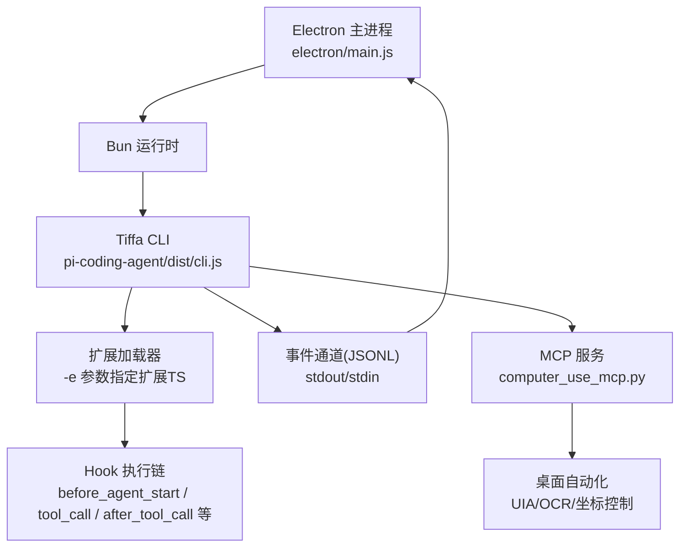
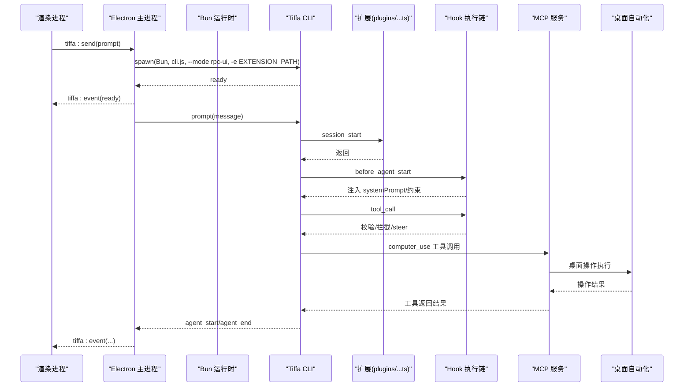
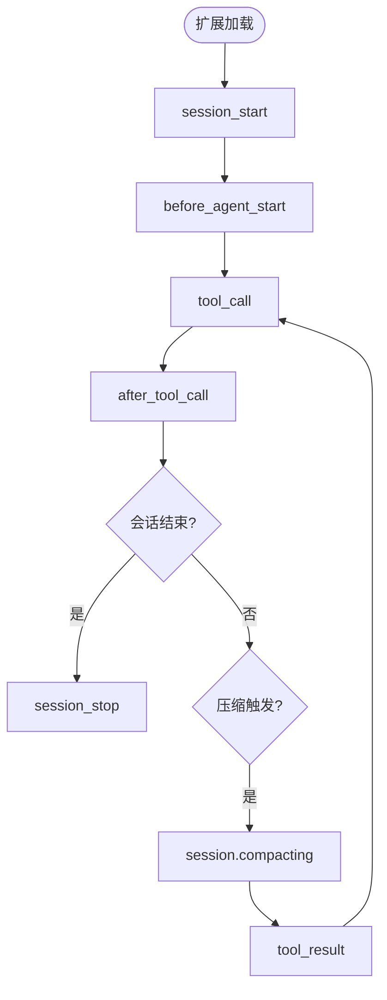
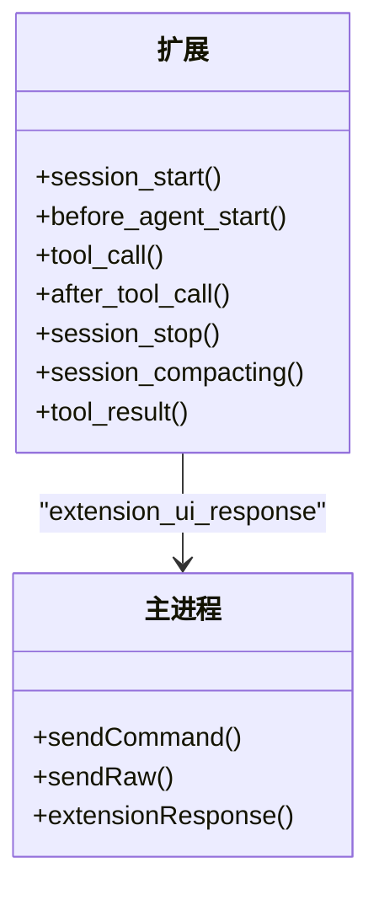
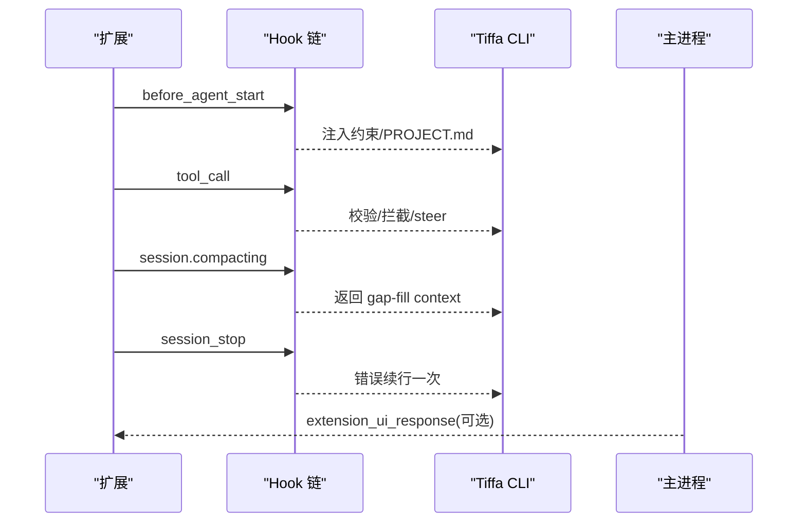
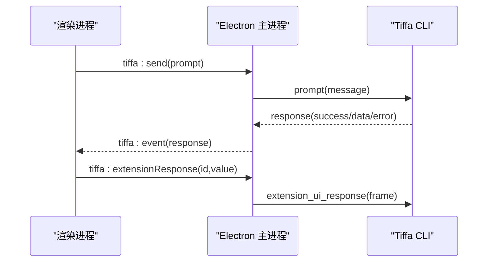
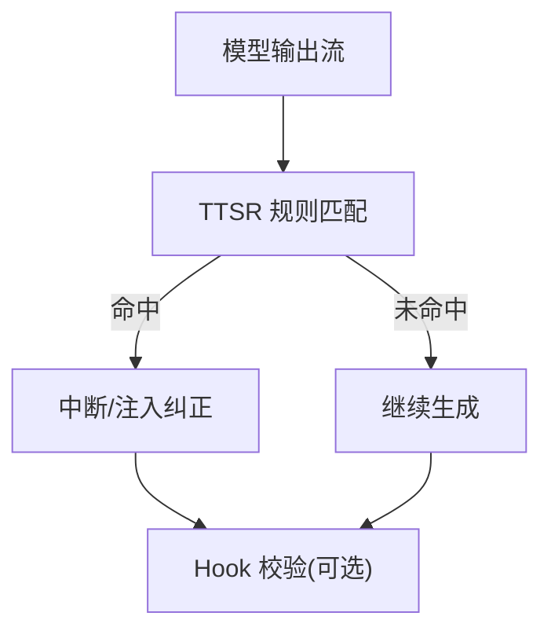
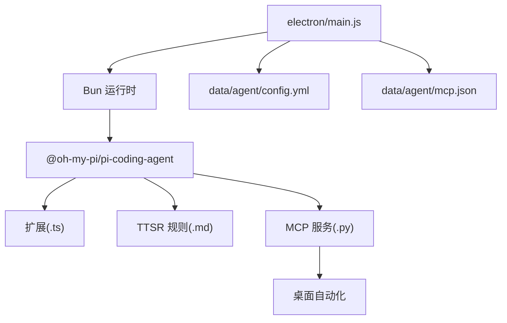

# 扩展开发

<cite>
**本文引用的文件**   
- [README.md](file://README.md)
- [AGENTS.md](file://AGENTS.md)
- [electron/main.js](file://electron/main.js)
- [data/agent/config.yml](file://data/agent/config.yml)
- [data/agent/rules/no-xml-toolcall.md](file://data/agent/rules/no-xml-toolcall.md)
- [plugins/computer-use-extension.ts](file://plugins/computer-use-extension.ts)
- [data/agent/mcp.json](file://data/agent/mcp.json)
- [skills/computer-use/computer_use_mcp.py](file://skills/computer-use/computer_use_mcp.py)
</cite>

## 更新摘要
**变更内容**   
- 新增计算机使用扩展(computer-use-extension.ts)的详细实现说明
- 补充tool_call拦截机制的安全策略和实现细节
- 增加MCP服务集成方式的完整指南
- 更新Hook机制的实际应用示例

## 目录
1. [简介](#简介)
2. [项目结构](#项目结构)
3. [核心组件](#核心组件)
4. [架构总览](#架构总览)
5. [详细组件分析](#详细组件分析)
6. [依赖分析](#依赖分析)
7. [性能考虑](#性能考虑)
8. [故障排查指南](#故障排查指南)
9. [结论](#结论)
10. [附录](#附录)

## 简介
本指南面向希望在 Tiffa 中开发扩展的工程师，系统阐述扩展系统架构、Hook 机制与插件规范，并给出 Claude 模式扩展的完整示例与实践建议。Tiffa 基于 @oh-my-pi/pi-coding-agent v17.0.7 构建，通过 Electron 桌面壳提供多实例管理、事件转发与 IPC 能力；扩展以 TypeScript 文件形式加载，借助内核 Hook（如 before_agent_start、tool_call、after_tool_call 等）实现行为控制与安全约束。

**最新更新**：新增了计算机使用扩展的完整实现，展示了如何通过 tool_call 拦截机制实现桌面操作安全控制，以及与 MCP 服务的深度集成。

## 项目结构
- 根目录包含 Electron 前端、便携包配置、技能与规则、以及扩展入口约定路径。
- 扩展默认位于 plugins/claude-mode-extension.ts，由主进程通过命令行参数 -e 注入到内核。
- **新增**：计算机使用扩展位于 `plugins/computer-use-extension.ts`，专门处理桌面自动化安全控制。
- 数据与规则：
  - data/agent/config.yml：模型角色、记忆后端与工具审批模式等。
  - data/agent/rules/*.md：TTSR 流式规则，零上下文成本拦截违规输出。
  - **新增**：data/agent/mcp.json：MCP 服务器配置，定义 computer-use 服务连接信息。
- 启动与运行：
  - electron/main.js 负责启动 Bun + Tiffa CLI 子进程，建立 JSONL 事件通道，处理就绪、代理生命周期、命令响应与 UI 事件转发。



**图表来源** 
- [electron/main.js:94-120](file://electron/main.js#L94-L120)
- [electron/main.js:110-111](file://electron/main.js#L110-L111)
- [data/agent/mcp.json:1-16](file://data/agent/mcp.json#L1-L16)

**章节来源**
- [README.md:25-42](file://README.md#L25-L42)
- [AGENTS.md:9-24](file://AGENTS.md#L9-L24)
- [electron/main.js:94-120](file://electron/main.js#L94-L120)

## 核心组件
- 扩展加载与注入
  - 主进程在启动 Tiffa CLI 时通过 -e 参数传入扩展路径，使内核加载扩展模块。
- Hook 机制
  - 内核暴露多个 Hook 点，扩展可注册回调参与 Agent 生命周期与工具调用流程。
  - 典型 Hook：session_start、before_agent_start、tool_call、after_tool_call、session_stop、session.compacting、tool_result 等。
- 事件与 IPC
  - 主进程与 Tiffa 子进程通过 JSONL 协议通信；渲染层通过 IPC 发送命令、接收事件。
- 规则与约束
  - TTSR 规则用于流式拦截；Hook 用于语义级约束与危险操作拦截。
- **新增**：MCP 服务集成
  - 通过 stdio 协议与 Python MCP 服务器通信，提供桌面自动化工具集。

**章节来源**
- [electron/main.js:110-111](file://electron/main.js#L110-L111)
- [AGENTS.md:113-156](file://AGENTS.md#L113-L156)
- [README.md:76-96](file://README.md#L76-L96)

## 架构总览
下图展示从 Electron 主进程到 Tiffa 内核及扩展 Hook 的整体交互，包括新增的 MCP 服务集成。



**图表来源** 
- [electron/main.js:94-120](file://electron/main.js#L94-L120)
- [electron/main.js:255-303](file://electron/main.js#L255-L303)
- [AGENTS.md:113-156](file://AGENTS.md#L113-L156)
- [data/agent/mcp.json:1-16](file://data/agent/mcp.json#L1-L16)

## 详细组件分析

### 扩展系统与 Hook 机制
- 扩展加载
  - 主进程构造启动参数，将 -e 指向扩展 TS 文件，Bun 执行 Tiffa CLI，内核发现并加载扩展。
- Hook 类型与作用域
  - session_start：会话初始化，可用于移除不需要的工具或设置初始状态。
  - before_agent_start：在 Agent 开始生成前注入系统提示或约束，适合行为策略与规则前置。
  - tool_call：工具调用前拦截，可实现危险路径、配置文件自改、工作区新建目录等安全限制。
  - after_tool_call：工具调用后处理，可用于审计日志、结果增强或副作用清理。
  - session_stop：会话结束时的收尾逻辑，例如错误续行一次、资源释放。
  - session.compacting：压缩阶段触发，适合 gap-fill 提取与立即注入上下文。
  - tool_result：工具结果回传，适合审计记录与统计。
- 事件与 UI 交互
  - 扩展可通过 extension_ui_response 与主进程交互，支持取消、确认或返回值传递。



**图表来源** 
- [AGENTS.md:123-156](file://AGENTS.md#L123-L156)

**章节来源**
- [electron/main.js:110-111](file://electron/main.js#L110-L111)
- [AGENTS.md:123-156](file://AGENTS.md#L123-L156)

### 计算机使用扩展详解（新增）

#### 扩展架构设计
computer-use-extension.ts 是一个专门处理桌面自动化安全的扩展，主要职责包括：

1. **工具调用拦截**：阻止直接调用 pyautogui/mss/PIL 等桌面控制库
2. **系统提示词注入**：引导模型使用标准的 MCP 电脑控制工具集
3. **危险操作防护**：拦截格式化、关机、注册表修改等危险命令

#### tool_call 拦截机制实现

```typescript
// 核心拦截逻辑
pi.on("tool_call", async (event: any) => {
  const tool = event.tool
  const input = event.input || event.arguments || {}

  if (tool === "bash" || tool === "shell") {
    const cmd = String(input.command || input.content || "")

    // 1. 检测内联桌面控制库
    const desktopLibPattern = /\b(pyautogui|import\s+mss|from\s+mss|from\s+PIL|import\s+PIL)\b/
    if (desktopLibPattern.test(cmd) && !cmd.includes("computer_use")) {
      return {
        block: true,
        reason: "检测到 bash 中内联使用 pyautogui/mss/PIL 操控桌面。禁止自己写 Python 操控桌面代码，请使用 MCP 电脑控制工具集。"
      }
    }

    // 2. 检测危险命令
    const dangerousPattern = /\b(format\s|shutdown|regedit|taskkill.*\/f.*\/im\s+(explorer|dwm|csrss|lsass|services))\b/i
    if (dangerousPattern.test(cmd)) {
      return {
        block: true,
        reason: "检测到危险命令，已拦截。禁止执行格式化、关机、注册表、杀系统进程等操作。"
      }
    }
  }
})
```

#### 安全策略分类

| 策略类型 | 检测模式 | 处理方式 | 示例 |
|---------|----------|----------|------|
| 桌面控制库拦截 | 正则匹配 pyautogui/mss/PIL | 阻止执行 + 提示使用 MCP | `import pyautogui` |
| 危险命令拦截 | 正则匹配系统破坏命令 | 阻止执行 + 安全警告 | `format c:`, `shutdown /s` |
| 进程终止保护 | 特定进程名白名单 | 阻止关键系统进程 | `taskkill /f /im csrss` |
| 注册表保护 | regedit 命令拦截 | 阻止注册表修改 | `regedit` |

#### MCP 服务集成方式

**MCP 配置结构**：
```json
{
  "mcpServers": {
    "computer-use": {
      "type": "stdio",
      "command": "G:/Tiffa/python/python.exe",
      "args": ["-u", "G:/Tiffa/skills/computer-use/computer_use_mcp.py"],
      "env": {
        "PYTHONIOENCODING": "utf-8",
        "PYTHONUNBUFFERED": "1"
      },
      "enabled": true,
      "timeout": 300000
    }
  }
}
```

**支持的 MCP 工具**：
- `ui_inspect`：枚举窗口控件树
- `ui_act`：按编号或名称操作元素
- `ui_screenshot`：截图验证
- `ui_find_text`：OCR 文本查找
- `ui_click_text`：OCR 文字点击
- `ui_ocr`：OCR 识别
- `desktop_input`：归一化坐标输入
- `computer_use`：简单任务便利入口

#### 三阶段强制流程

扩展通过 before_agent_start 注入详细的操作流程指导：

1. **应用探测阶段**：必须先确定目标应用的 UI 框架和可用接口
2. **策略选择阶段**：根据应用特性选择最佳控制方案
3. **分步执行阶段**：每步操作后验证，失败则重新探测

**Section sources**
- [plugins/computer-use-extension.ts:28-59](file://plugins/computer-use-extension.ts#L28-L59)
- [plugins/computer-use-extension.ts:62-127](file://plugins/computer-use-extension.ts#L62-L127)
- [data/agent/mcp.json:1-16](file://data/agent/mcp.json#L1-L16)

### 关键 Hook 编写指南（6个扩展点）
- before_agent_start
  - 用途：注入系统提示、行为约束、项目级规范（PROJECT.md）等。
  - 实践要点：避免过长文本导致上下文膨胀；优先使用确定性注入与精简约束。
- tool_call
  - 用途：危险路径拦截、配置文件自改拦截、工作区新建目录拦截、静默工具调用检测（连续多次无文字说明 → steer）。
  - 实践要点：精确匹配路径与文件名；对误报进行白名单处理；结合 TTSR 规则减少重复拦截。
- after_tool_call
  - 用途：审计日志、结果摘要、副作用清理。
  - 实践要点：避免阻塞主流程；异步落盘或缓冲写入。
- session_start
  - 用途：移除不需要的工具、初始化计数器等。
- session_stop
  - 用途：错误续行一次（延迟）、资源释放、统计上报。
- session.compacting
  - 用途：gap-fill 提取（改动文件、关键命令、决策要点），compact dump 落盘，立即返回 context 注入。
- tool_result
  - 用途：审计日志（JSONL）、指标收集。



**图表来源** 
- [electron/main.js:786-797](file://electron/main.js#L786-L797)
- [AGENTS.md:123-156](file://AGENTS.md#L123-L156)

**章节来源**
- [AGENTS.md:123-156](file://AGENTS.md#L123-L156)
- [electron/main.js:786-797](file://electron/main.js#L786-L797)

### Claude 模式扩展示例（行为控制与安全约束）
- 目标
  - 在 Agent 开始前注入行为约束（读文件规范、任务计划、失败重试策略、skill 铁律、沟通风格、安全铁律）。
  - 在工具调用时实施安全拦截（危险路径、配置文件自改、workspace 根目录新建一级子目录）。
  - 在压缩阶段进行 gap-fill 提取并立即注入上下文。
  - 在会话结束时进行错误续行一次（最多一次，5秒延迟）。
- 实现要点
  - 使用 before_agent_start 注入系统提示与 PROJECT.md 脚手架。
  - 使用 tool_call 进行路径与文件名白名单校验，必要时 steer 提醒。
  - 使用 session.compacting 提取关键信息并返回 context。
  - 使用 session_stop 进行一次性错误续行。
- 与 TTSR 规则协同
  - 对于输出格式与常见错误，优先使用 TTSR 规则（零上下文成本）；对于复杂语义与运行时策略，使用 Hook。



**图表来源** 
- [AGENTS.md:113-156](file://AGENTS.md#L113-L156)
- [electron/main.js:786-797](file://electron/main.js#L786-L797)

**章节来源**
- [AGENTS.md:113-156](file://AGENTS.md#L113-L156)

### 事件与 IPC 集成
- 主进程通过 JSONL 与 Tiffa 子进程通信，事件包括 ready、prompt_result、agent_start/end、response 等。
- 渲染层通过 IPC 发送命令（如 tiffa:send、tiffa:abort、tiffa:setModel、tiffa:steer、tiffa:followUp、tiffa:extensionResponse）。
- 扩展可通过 extension_ui_response 与主进程交互，支持取消、确认或返回值传递。



**图表来源** 
- [electron/main.js:255-303](file://electron/main.js#L255-L303)
- [electron/main.js:786-797](file://electron/main.js#L786-L797)

**章节来源**
- [electron/main.js:255-303](file://electron/main.js#L255-L303)
- [electron/main.js:786-797](file://electron/main.js#L786-L797)

### 规则与约束（TTSR）
- TTSR 规则以 .md 文件存放于 data/agent/rules/，通过 YAML frontmatter 描述条件、作用域与中断模式。
- 示例：禁止 XML 格式工具调用，scope 为 text/thinking，interruptMode 为 always。
- 与 Hook 的关系：TTSR 用于输出层快速拦截；Hook 用于运行时策略与复杂逻辑。



**图表来源** 
- [data/agent/rules/no-xml-toolcall.md:1-10](file://data/agent/rules/no-xml-toolcall.md#L1-L10)
- [README.md:76-96](file://README.md#L76-L96)

**章节来源**
- [data/agent/rules/no-xml-toolcall.md:1-10](file://data/agent/rules/no-xml-toolcall.md#L1-L10)
- [README.md:76-96](file://README.md#L76-L96)

## 依赖分析
- 主进程依赖
  - Electron 主进程管理窗口、IPC、子进程生命周期。
  - 通过 spawn 启动 Bun + Tiffa CLI，注入 -e 扩展路径。
- 内核依赖
  - pi-coding-agent 提供扩展加载器、Hook 执行链、事件通道。
- 配置依赖
  - config.yml 定义模型角色、记忆后端、工具审批模式等。
- 外部依赖
  - Bun 作为 JS/TS 运行时；Python/Node 可能用于技能脚本。
- **新增**：MCP 服务依赖
  - Python MCP 服务器提供桌面自动化工具集
  - 通过 stdio 协议与主进程通信



**图表来源** 
- [electron/main.js:94-120](file://electron/main.js#L94-L120)
- [data/agent/config.yml:1-30](file://data/agent/config.yml#L1-L30)
- [data/agent/mcp.json:1-16](file://data/agent/mcp.json#L1-L16)

**章节来源**
- [electron/main.js:94-120](file://electron/main.js#L94-L120)
- [data/agent/config.yml:1-30](file://data/agent/config.yml#L1-L30)

## 性能考虑
- 事件通道优化
  - 使用 readline 逐行解析 stdout，避免大 buffer 与内存抖动。
  - embedding 预热期间过滤噪音事件，减少无效转发。
- 实例管理
  - LRU 淘汰与最大实例数限制，避免资源耗尽。
  - 崩溃自动重启与 stall 检测，提升稳定性。
- 上下文控制
  - TTSR 规则零上下文成本；Hook 注入尽量精简，避免撑爆上下文。
- I/O 编码
  - 统一 UTF-8 环境变量，避免中文乱码导致的额外开销与错误。
- **新增**：MCP 服务性能
  - MCP 服务器超时配置（默认 300 秒）防止长时间阻塞
  - 异步日志记录避免影响主流程性能

## 故障排查指南
- 常见问题
  - 子进程退出：检查 exit code 与 signal，确认是否用户主动 kill 或崩溃次数上限。
  - 事件未到达渲染层：检查 isPrewarming 标志与事件过滤逻辑。
  - 扩展未加载：确认 -e 参数路径正确且扩展文件存在。
  - 规则未生效：检查 TTSR 规则的 condition/scope/interruptMode 配置。
  - **新增**：MCP 服务连接失败：检查 mcp.json 配置中的命令路径和环境变量。
  - **新增**：桌面控制权限问题：确认 Python 环境已安装所需依赖（pywinauto, comtypes, mss 等）。
- 调试建议
  - 启用 dev 模式打开 DevTools。
  - 查看 stderr 输出与 pendingCommands 超时情况。
  - 使用 diagnostics 接口获取实例状态。
  - **新增**：检查扩展日志文件（plugins/computer-use.log）了解拦截详情。

**章节来源**
- [electron/main.js:144-173](file://electron/main.js#L144-L173)
- [electron/main.js:255-303](file://electron/main.js#L255-L303)
- [electron/main.js:757-768](file://electron/main.js#L757-L768)

## 结论
Tiffa 的扩展系统通过 Hook 机制与 TTSR 规则形成"运行时策略 + 输出层约束"的双重保障。开发者可在 before_agent_start、tool_call、after_tool_call 等关键点实现行为控制与安全约束，并结合 Electron 主进程的 IPC 与事件通道完成 UI 交互与状态同步。

**最新更新**：计算机使用扩展展示了如何通过 tool_call 拦截机制实现桌面操作安全控制，以及与 MCP 服务的深度集成。这种架构既保证了安全性，又提供了灵活的扩展能力。遵循本文档的实践建议，可高效构建稳定、可维护的扩展。

## 附录
- 最佳实践
  - 扩展命名与组织：按功能划分目录，保持单一职责。
  - 版本管理：使用语义化版本号，变更日志清晰标注破坏性更新。
  - 打包分发：将扩展 TS 文件与必要资源打包为可分发包，确保路径与环境一致。
  - 测试策略：覆盖 Hook 边界条件与异常路径，模拟工具调用失败与路径拦截场景。
  - 文档与示例：提供 SKILL.md 与示例用例，便于使用者快速上手。
  - **新增**：安全策略设计：区分不同风险级别的拦截策略，提供清晰的错误提示和替代方案。
  - **新增**：MCP 服务集成：使用标准化的配置格式，确保跨平台兼容性。

- **新增**：计算机使用扩展开发指南
  - 拦截规则设计：使用正则表达式精确匹配危险操作，避免误拦截
  - 安全提示文案：提供明确的错误原因和正确的使用方法
  - 日志记录：记录所有拦截事件，便于审计和问题排查
  - MCP 工具使用：引导模型使用标准的 ui_inspect/ui_act 等工具而非直接调用桌面库

[本节为通用指导，无需特定文件引用]