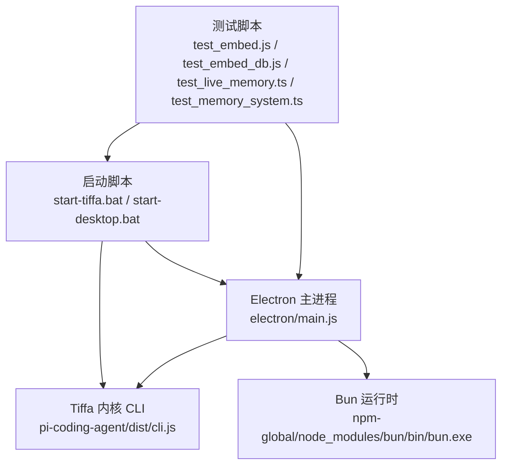
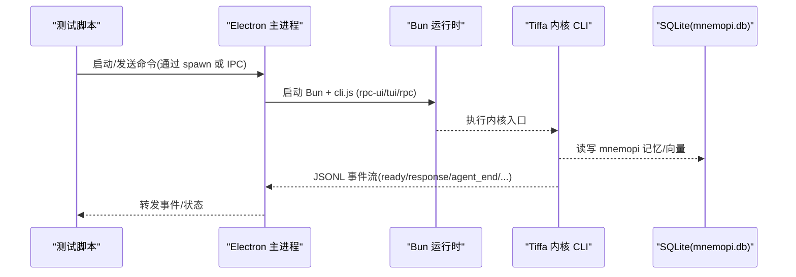
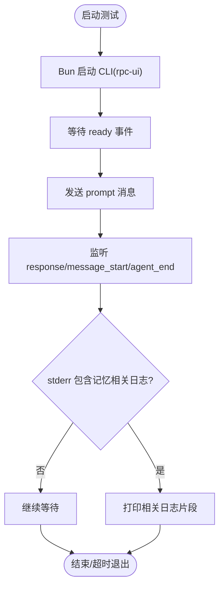
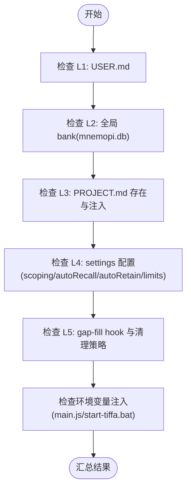
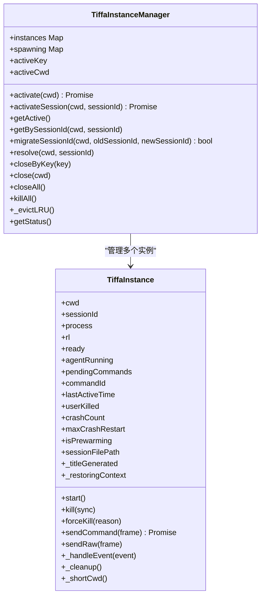
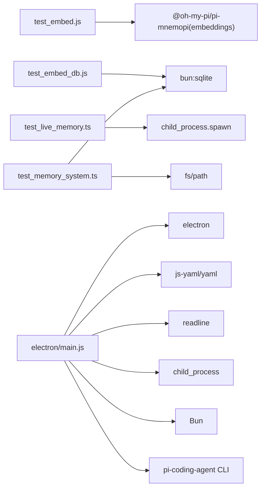

# 测试基础设施

<cite>
**本文引用的文件**   
- [README.md](file://README.md)
- [test_embed.js](file://test_embed.js)
- [test_embed_db.js](file://test_embed_db.js)
- [test_live_memory.ts](file://test_live_memory.ts)
- [test_memory_system.ts](file://test_memory_system.ts)
- [electron/main.js](file://electron/main.js)
- [start-tiffa.bat](file://start-tiffa.bat)
- [start-desktop.bat](file://start-desktop.bat)
- [开发文档.md](file://开发文档.md)
</cite>

## 目录
1. [简介](#简介)
2. [项目结构](#项目结构)
3. [核心组件](#核心组件)
4. [架构总览](#架构总览)
5. [详细组件分析](#详细组件分析)
6. [依赖关系分析](#依赖关系分析)
7. [性能考量](#性能考量)
8. [故障排查指南](#故障排查指南)
9. [结论](#结论)
10. [附录](#附录)

## 简介
本文件聚焦于 Tiffa 的“测试基础设施”，涵盖端到端验证脚本、Electron 主进程对子进程的启动与事件桥接、以及启动脚本的环境注入。目标是帮助开发者快速定位记忆系统（Mnemopi）与嵌入模型（embedding）的问题，并理解测试用例如何覆盖关键路径。

## 项目结构
测试相关的关键位置：
- 根目录测试脚本：test_embed.js、test_embed_db.js、test_live_memory.ts、test_memory_system.ts
- Electron 主进程：electron/main.js（负责启动内核 CLI、事件转发、会话恢复、环境变量注入）
- 启动脚本：start-tiffa.bat、start-desktop.bat（设置 PATH、HOME、MNEMOPI_EMBEDDING_MODEL 等）
- 配置与说明：README.md、开发文档.md（记录 Mnemopi 配置项与行为约定）

**图表来源** 
- [electron/main.js:142-178](file://electron/main.js#L142-L178)
- [start-tiffa.bat:16-29](file://start-tiffa.bat#L16-L29)
- [start-desktop.bat:10-22](file://start-desktop.bat#L10-L22)

**章节来源**
- [README.md:1-236](file://README.md#L1-L236)
- [electron/main.js:1-800](file://electron/main.js#L1-L800)
- [start-tiffa.bat:1-154](file://start-tiffa.bat#L1-L154)
- [start-desktop.bat:1-25](file://start-desktop.bat#L1-L25)

## 核心组件
- 嵌入诊断脚本（test_embed.js）
  - 校验 embedding 可用性、当前模型、是否走 API、向量维度与耗时，并打印环境变量与缓存目录信息。
- 数据库验证脚本（test_embed_db.js）
  - 直连 SQLite 检查 memory_embeddings 表行数、最新向量维度与模型名，辅助判断中文/英文模型是否正确落地。
- 端到端交互测试（test_live_memory.ts）
  - 通过 Bun 启动 Tiffa 内核 RPC-UI 模式，发送 prompt 并监听 ready/response/message_start/agent_end 事件，验证记忆注入日志。
- 五层记忆系统验证（test_memory_system.ts）
  - 检查 L1~L5 各层存在性与配置（USER.md、PROJECT.md、mnemopi settings、scoping/autoRecall/autoRetain/token 限制、gap-fill hook）。
- Electron 主进程（electron/main.js）
  - 管理 TiffaInstance/TiffaInstanceManager，负责子进程生命周期、事件解析、会话上下文恢复、embedding 预热、崩溃重启、LRU 淘汰。
- 启动脚本（start-tiffa.bat / start-desktop.bat）
  - 统一注入 HOME、USERPROFILE、MNEMOPI_EMBEDDING_MODEL、PATH，确保便携运行与中文模型生效。

**章节来源**
- [test_embed.js:1-74](file://test_embed.js#L1-L74)
- [test_embed_db.js:1-62](file://test_embed_db.js#L1-L62)
- [test_live_memory.ts:1-79](file://test_live_memory.ts#L1-L79)
- [test_memory_system.ts:1-95](file://test_memory_system.ts#L1-L95)
- [electron/main.js:121-437](file://electron/main.js#L121-L437)
- [start-tiffa.bat:16-29](file://start-tiffa.bat#L16-L29)
- [start-desktop.bat:10-22](file://start-desktop.bat#L10-L22)

## 架构总览
下图展示从测试脚本到内核 CLI 的调用链，以及 Electron 主进程在其中的协调作用。

**图表来源** 
- [electron/main.js:142-178](file://electron/main.js#L142-L178)
- [test_live_memory.ts:13-17](file://test_live_memory.ts#L13-L17)
- [test_embed_db.js:1-10](file://test_embed_db.js#L1-L10)

## 详细组件分析

### 嵌入诊断（test_embed.js）
- 功能要点
  - 读取当前 embedding 模型、是否禁用、是否为 API 模型。
  - 调用 available() 检测可用性与 embed() 生成向量，输出维度与耗时。
  - 打印环境变量（MNEMOPI_EMBEDDING_MODEL、API_KEY、VIA_API、NO_EMBEDDINGS）。
  - 扫描 fastembed 缓存目录，确认 ONNX 模型是否存在。
- 适用场景
  - 首次部署后验证 embedding 链路是否通畅；排查模型名称与环境变量问题。

**章节来源**
- [test_embed.js:1-74](file://test_embed.js#L1-L74)

### 数据库验证（test_embed_db.js）
- 功能要点
  - 只读打开 data/agent/memories/mnemopi/mnemopi.db。
  - 列出所有表，统计 memory_embeddings 行数，抽样最新条目。
  - 解析 embedding_json 向量长度，判定中文模型（512）或英文模型（384）。
  - 检查 episodic_memory 写入情况。
- 适用场景
  - 确认 autoRetain 是否成功落库；验证向量维度是否符合预期。

**章节来源**
- [test_embed_db.js:1-62](file://test_embed_db.js#L1-L62)

### 端到端交互（test_live_memory.ts）
- 功能要点
  - 使用 Bun 启动 Tiffa 内核 CLI（rpc-ui），传入扩展插件。
  - 监听 stdout 的 JSON 事件，捕获 ready/response/message_start/agent_end。
  - 过滤 stderr 中 mnemopi/retain/recall/inject 等关键词日志，便于定位记忆注入。
  - 超时保护与强制退出，避免卡死。
- 适用场景
  - 验证一次完整对话的生命周期与记忆注入是否正常。

**图表来源** 
- [test_live_memory.ts:13-17](file://test_live_memory.ts#L13-L17)
- [test_live_memory.ts:24-51](file://test_live_memory.ts#L24-L51)
- [test_live_memory.ts:53-62](file://test_live_memory.ts#L53-L62)

**章节来源**
- [test_live_memory.ts:1-79](file://test_live_memory.ts#L1-L79)

### 五层记忆系统验证（test_memory_system.ts）
- 功能要点
  - L1 USER.md：存在性、内容非空、扩展注入。
  - L2 全局 bank：mnemopi.db 存在、memory_embeddings/episodic_memory 行数、模型名。
  - L3 PROJECT.md：workspace 下项目是否存在 PROJECT.md，扩展注入与写入规则。
  - L4 per-project bank：settings 表中 scoping/autoRecall/autoRetain/retainEveryNTurns/recallLimit/injectionTokenLimit。
  - L5 gap-fill：session.compacting hook、gap-fill 提取逻辑、60 分钟清理。
  - 环境保障：main.js 与 start-tiffa.bat 是否注入 MNEMOPI_EMBEDDING_MODEL。
- 适用场景
  - 全链路自检，快速发现记忆系统配置缺失或错误。

**图表来源** 
- [test_memory_system.ts:17-88](file://test_memory_system.ts#L17-L88)

**章节来源**
- [test_memory_system.ts:1-95](file://test_memory_system.ts#L1-L95)

### Electron 主进程（electron/main.js）
- 职责概览
  - TiffaInstance：封装单个 CLI 子进程的生命周期、stdin/stdout 事件解析、命令队列与超时、崩溃自动重启、会话上下文恢复、embedding 预热。
  - TiffaInstanceManager：多实例管理（懒启动、LRU 淘汰）、按 cwd+sessionId 键值路由、迁移 sessionId、关闭/批量关闭。
  - 环境变量注入：HOME、USERPROFILE、PATH、MNEMOPI_EMBEDDING_MODEL、UTF-8 编码相关变量。
  - 事件转发：将 CLI 的 JSONL 事件转发给渲染进程，并在预热/恢复期间过滤噪音。
- 关键流程
  - 启动：spawn Bun + cli.js，绑定 readline 逐行解析 stdout。
  - 就绪：延迟触发 /memory rebuild 进行 embedding 预热，30 秒兜底解除过滤。
  - 会话恢复：根据 sessionPath 查找 JSONL 并通过 switch_session 恢复历史上下文。
  - 崩溃重启：非用户主动 kill 且未达上限则 3 秒后重启，通知前端。

**图表来源** 
- [electron/main.js:121-437](file://electron/main.js#L121-L437)
- [electron/main.js:443-770](file://electron/main.js#L443-L770)

**章节来源**
- [electron/main.js:1-800](file://electron/main.js#L1-L800)

### 启动脚本（start-tiffa.bat / start-desktop.bat）
- start-tiffa.bat
  - 设置 PI_CODING_AGENT_DIR、HOME、USERPROFILE、MNEMOPI_EMBEDDING_MODEL。
  - 前置便携 Python/Node/Bun 到 PATH，避免命中系统占位符。
  - 支持 --tui/--web/--rpc 三种模式，并注入扩展插件路径。
- start-desktop.bat
  - 设置 PORTABLE_ROOT，直接启动 electron.exe 并传递 --portable-root。

**章节来源**
- [start-tiffa.bat:16-29](file://start-tiffa.bat#L16-L29)
- [start-tiffa.bat:140-151](file://start-tiffa.bat#L140-L151)
- [start-desktop.bat:10-22](file://start-desktop.bat#L10-L22)

## 依赖关系分析
- 测试脚本依赖
  - test_embed.js：@oh-my-pi/pi-mnemopi 的 embeddings 模块（embed、available、currentEmbeddingModel、isApiModel、embeddingsDisabled）。
  - test_embed_db.js：bun:sqlite（只读访问 mnemopi.db）。
  - test_live_memory.ts：child_process.spawn（启动 Bun + CLI）。
  - test_memory_system.ts：bun:sqlite、fs、path（检查文件与 settings 表）。
- 主进程依赖
  - electron、js-yaml、yaml、readline、child_process（spawn/taskkill）。
  - 子进程依赖：Bun、pi-coding-agent CLI、fastembed（ONNX 模型缓存）。

**图表来源** 
- [test_embed.js:4-6](file://test_embed.js#L4-L6)
- [test_embed_db.js:1-2](file://test_embed_db.js#L1-L2)
- [test_live_memory.ts:2-3](file://test_live_memory.ts#L2-L3)
- [test_memory_system.ts:1-3](file://test_memory_system.ts#L1-L3)
- [electron/main.js:8-14](file://electron/main.js#L8-L14)

**章节来源**
- [test_embed.js:1-74](file://test_embed.js#L1-L74)
- [test_embed_db.js:1-62](file://test_embed_db.js#L1-L62)
- [test_live_memory.ts:1-79](file://test_live_memory.ts#L1-L79)
- [test_memory_system.ts:1-95](file://test_memory_system.ts#L1-L95)
- [electron/main.js:1-120](file://electron/main.js#L1-L120)

## 性能考量
- Embedding 冷加载
  - Electron 主进程在 ready 后延迟 3 秒触发 /memory rebuild，预热 fastembed ONNX 模型，避免首条消息卡顿。
  - 若 agent 正在运行，跳过预热，优先响应用户交互。
- 事件过滤
  - 预热期间过滤 /memory rebuild 产生的噪音事件；上下文恢复期间过滤重放的消息事件，避免前端重复渲染。
- 崩溃重启与 LRU
  - 非用户主动 kill 且未达上限时自动重启；超过实例上限时按 lastActiveTime 淘汰非活跃实例。
- 数据库与向量
  - 单次最多召回 10 条、注入上限 2000 token，防止上下文膨胀。

[本节为通用指导，不直接分析具体文件]

## 故障排查指南
- Embedding 不生效
  - 使用 test_embed.js 检查 currentEmbeddingModel、isApiModel、available、embed 返回与耗时。
  - 使用 test_embed_db.js 检查 memory_embeddings 行数与向量维度（中文应为 512）。
  - 确认环境变量 MNEMOPI_EMBEDDING_MODEL 已注入（start-tiffa.bat、electron/main.js）。
- 记忆注入异常
  - 使用 test_live_memory.ts 观察 stderr 中的 mnemopi/retain/recall/inject 日志。
  - 使用 test_memory_system.ts 逐项检查 L1~L5 配置与钩子注册。
- 会话上下文丢失
  - 检查 electron/main.js 的 session_switch 处理与 _findSessionFile 匹配逻辑。
  - 确认崩溃重启后是否通过 switch_session 恢复历史 JSONL。
- 首条消息延迟
  - 关注 embedding 预热与 on-demand 安装（如 fastembed 依赖缺失）导致的延迟。

**章节来源**
- [test_embed.js:1-74](file://test_embed.js#L1-L74)
- [test_embed_db.js:1-62](file://test_embed_db.js#L1-L62)
- [test_live_memory.ts:1-79](file://test_live_memory.ts#L1-L79)
- [test_memory_system.ts:1-95](file://test_memory_system.ts#L1-L95)
- [electron/main.js:325-421](file://electron/main.js#L325-L421)
- [start-tiffa.bat:16-29](file://start-tiffa.bat#L16-L29)

## 结论
该测试基础设施围绕 Mnemopi 记忆系统与 embedding 链路构建，覆盖了从环境注入、子进程启动、事件桥接到数据库验证的全流程。通过四类测试脚本与 Electron 主进程的协同，能够快速定位配置、依赖与运行时问题，确保弱模型也能稳定工作。

[本节为总结，不直接分析具体文件]

## 附录
- Mnemopi 配置参考（settings 数据库）
  - embeddingModel、scoping、autoRecall、autoRetain、retainEveryNTurns、recallLimit、injectionTokenLimit。
- 启动模式
  - TUI/WebUI/RPC 三种模式由 start-tiffa.bat 控制，Electron 通过 start-desktop.bat 启动桌面壳。

**章节来源**
- [开发文档.md:69-99](file://开发文档.md#L69-L99)
- [start-tiffa.bat:82-126](file://start-tiffa.bat#L82-L126)
- [start-desktop.bat:10-22](file://start-desktop.bat#L10-L22)