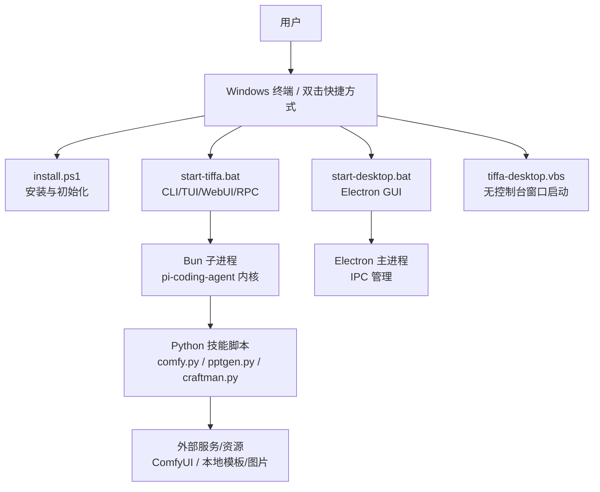
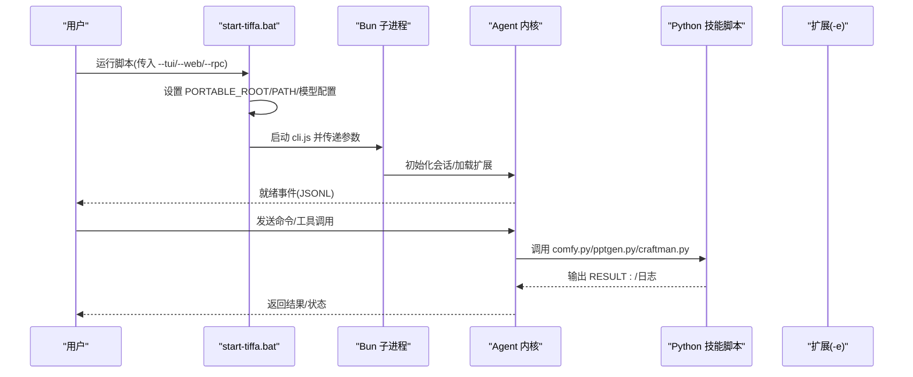
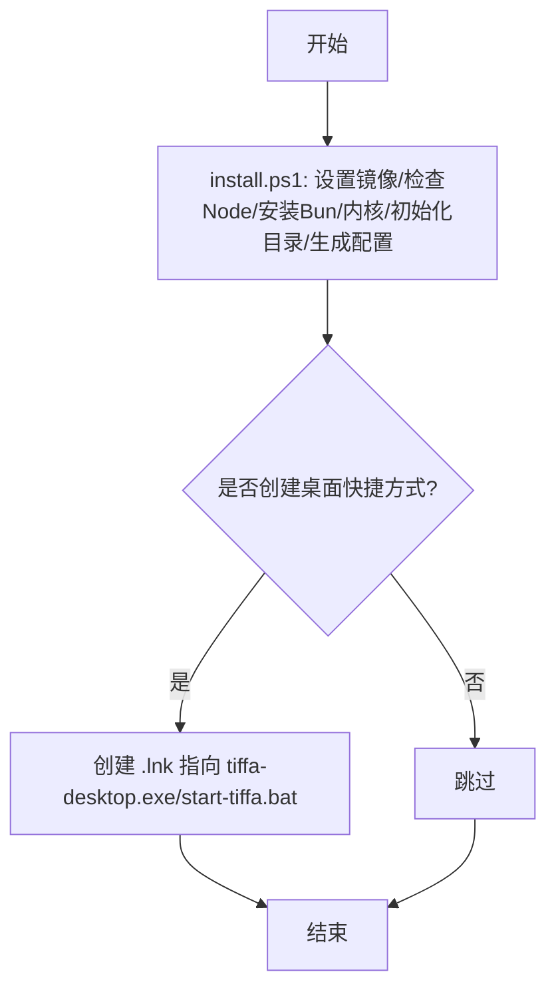
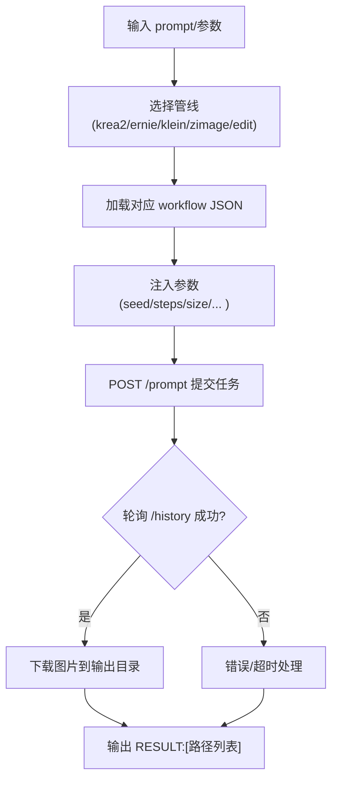
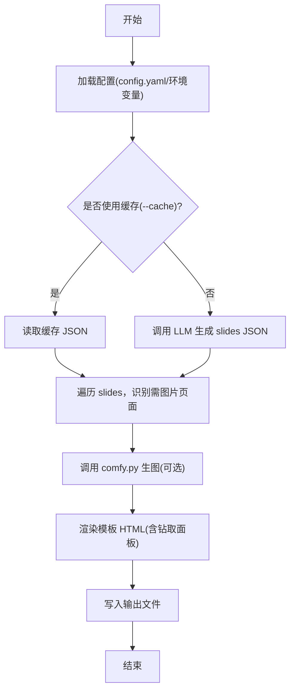
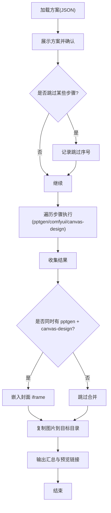
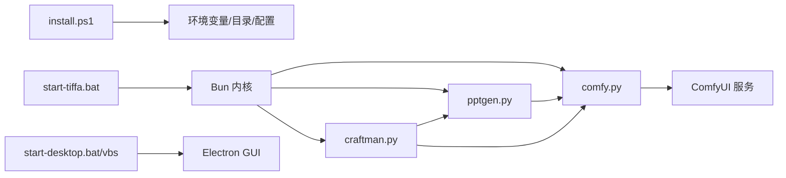

# Bash工具增强功能

<cite>
**本文档引用的文件**   
- [README.md](file://README.md)
- [AGENTS.md](file://AGENTS.md)
- [开发文档.md](file://开发文档.md)
- [start-tiffa.bat](file://start-tiffa.bat)
- [start-desktop.bat](file://start-desktop.bat)
- [install.ps1](file://install.ps1)
- [tiffa-desktop.vbs](file://tiffa-desktop.vbs)
- [comfy.py](file://skills/comfyui-image-gen/comfy.py)
- [craftman.py](file://skills/craftman/craftman.py)
- [pptgen.py](file://skills/pptgen/pptgen.py)
</cite>

## 目录
1. [简介](#简介)
2. [项目结构](#项目结构)
3. [核心组件](#核心组件)
4. [架构总览](#架构总览)
5. [详细组件分析](#详细组件分析)
6. [依赖关系分析](#依赖关系分析)
7. [性能考量](#性能考量)
8. [故障排查指南](#故障排查指南)
9. [结论](#结论)
10. [附录](#附录)

## 简介
本文件聚焦于 Tiffa 项目中与“Bash/Shell 工具增强”相关的启动脚本、工作流编排与技能调用机制，说明如何通过批处理与 PowerShell 脚本统一环境、注入配置、拉起内核子进程，并通过 Python 工具链（ComfyUI 生图、PPT 生成、多技能编排）实现可复用的命令行能力。内容兼顾初学者理解与进阶实践，提供架构图、流程图与排障要点。

## 项目结构
Tiffa 采用“Electron 桌面壳 + Bun 内核子进程 + JSONL 协议”的架构，Bash/PowerShell/Batch 脚本负责：
- 安装与环境初始化
- 环境变量与路径注入
- 启动 Electron GUI 或 CLI/TUI/WebUI/RPC 模式
- 调用 Python 技能脚本完成具体任务

图表来源
- [install.ps1:1-186](file://install.ps1#L1-L186)
- [start-tiffa.bat:1-154](file://start-tiffa.bat#L1-L154)
- [start-desktop.bat:1-25](file://start-desktop.bat#L1-L25)
- [tiffa-desktop.vbs:1-23](file://tiffa-desktop.vbs#L1-L23)
- [开发文档.md:1-198](file://开发文档.md#L1-L198)

章节来源
- [README.md:1-236](file://README.md#L1-L236)
- [AGENTS.md:1-310](file://AGENTS.md#L1-L310)
- [开发文档.md:1-198](file://开发文档.md#L1-L198)

## 核心组件
- 启动与安装脚本
  - install.ps1：国内镜像加速安装 Node/Bun/内核，创建目录与默认配置，可选创建桌面快捷方式
  - start-tiffa.bat：设置便携包环境变量，检测依赖，解析参数（tui/web/rpc），拉起 Bun 内核并加载扩展
  - start-desktop.bat：校验 Electron 存在后以 --portable-root 启动 GUI
  - tiffa-desktop.vbs：无控制台窗口启动 Electron
- 技能与工具链
  - comfy.py：ComfyUI 工作流封装，支持多管线（krea2/ernie/klein/zimage/edit）、批量提示词、结果下载与输出目录控制
  - pptgen.py：一句话生成本地交互式 HTML PPT，调用 LLM 生成结构化内容，按需调用 ComfyUI 配图，渲染多种模板
  - craftman.py：多技能编排器，按 AI 提供的方案执行步骤并合并输出（如 canvas-design + pptgen 封面嵌入）

章节来源
- [install.ps1:1-186](file://install.ps1#L1-L186)
- [start-tiffa.bat:1-154](file://start-tiffa.bat#L1-L154)
- [start-desktop.bat:1-25](file://start-desktop.bat#L1-L25)
- [tiffa-desktop.vbs:1-23](file://tiffa-desktop.vbs#L1-L23)
- [comfy.py:1-452](file://skills/comfyui-image-gen/comfy.py#L1-L452)
- [pptgen.py:1-618](file://skills/pptgen/pptgen.py#L1-L618)
- [craftman.py:1-381](file://skills/craftman/craftman.py#L1-L381)

## 架构总览
Tiffa 的“Bash 工具增强”体现在三层：
- 系统层：Batch/PowerShell/VBS 脚本统一入口，确保跨会话一致的环境与路径
- 内核层：Bun 子进程承载 Agent 内核，通过 JSONL 与前端通信，加载扩展与规则
- 工具层：Python 技能脚本对外暴露稳定 CLI，被内核或上层编排器调用

图表来源
- [start-tiffa.bat:1-154](file://start-tiffa.bat#L1-L154)
- [开发文档.md:1-198](file://开发文档.md#L1-L198)
- [comfy.py:1-452](file://skills/comfyui-image-gen/comfy.py#L1-L452)
- [pptgen.py:1-618](file://skills/pptgen/pptgen.py#L1-L618)
- [craftman.py:1-381](file://skills/craftman/craftman.py#L1-L381)

## 详细组件分析

### 启动脚本与环境注入
- install.ps1
  - 设置 npm/Electron 国内镜像
  - 检查 Node.js（优先便携版，其次系统）
  - 安装/验证 Bun 与 Tiffa 内核
  - 初始化 data/agent、data/memory、workspace、home 等目录
  - 首次运行复制 models.yml.example -> models.yml，生成默认 config.yml
  - 可选创建桌面快捷方式指向 tiffa-desktop.exe 或 start-tiffa.bat
- start-tiffa.bat
  - 设置 PI_CODING_AGENT_DIR/HOME/USERPROFILE/MNEMOPI_EMBEDDING_MODEL
  - 将 python/node/bun 加入 PATH，避免系统占位符干扰
  - 检测 Bun 与内核是否存在，不存在则提示安装
  - 若 models.yml 缺失则从模板复制并提示填写 API Key
  - 解析 --tui/--web/--rpc 参数，调用 Bun 启动内核并加载扩展
- start-desktop.bat / tiffa-desktop.vbs
  - 校验 Electron 二进制存在
  - 以 --portable-root 启动 Electron GUI，VBS 隐藏控制台窗口

图表来源
- [install.ps1:1-186](file://install.ps1#L1-L186)

章节来源
- [install.ps1:1-186](file://install.ps1#L1-L186)
- [start-tiffa.bat:1-154](file://start-tiffa.bat#L1-L154)
- [start-desktop.bat:1-25](file://start-desktop.bat#L1-L25)
- [tiffa-desktop.vbs:1-23](file://tiffa-desktop.vbs#L1-L23)

### ComfyUI 生图工具（comfy.py）
- 功能要点
  - 支持多管线：krea2（艺术/动画）、ernie（文字排版）、klein（写实场景）、zimage（人物肖像）、edit（图像编辑）
  - 支持多行提示词批量提交，逐行独立生成
  - 输出目录优先级：CLI 参数 > COMFY_OUT 环境变量 > 默认 workspace/comfyui_out
  - 提交工作流到 ComfyUI，轮询历史并下载图片至本地
- 关键流程
  - 解析子命令与参数
  - 加载对应 workflow JSON 并注入参数（seed/steps/size/negative/sampler 等）
  - 提交 /prompt，轮询 /history/{id}，成功则下载图片
  - 打印 RESULT:[路径列表] 供上层解析

图表来源
- [comfy.py:1-452](file://skills/comfyui-image-gen/comfy.py#L1-L452)

章节来源
- [comfy.py:1-452](file://skills/comfyui-image-gen/comfy.py#L1-L452)

### PPT 生成工具（pptgen.py）
- 功能要点
  - 调用本地 27B 模型生成结构化 PPT 内容（JSON）
  - 根据每页 image 字段决定是否调用 ComfyUI 生图
  - 渲染多种模板风格，支持钻取面板（表格/卡片/文本/柱状）
  - 支持缓存模式（--cache）跳过 LLM，直接读取已有 JSON
- 关键流程
  - 加载配置（LLM endpoint/model/api_key）
  - 调用 LLM 获取 slides 数据
  - 对需要图片的页面调用 comfy.py 生图
  - 渲染 HTML 并写入输出文件

图表来源
- [pptgen.py:1-618](file://skills/pptgen/pptgen.py#L1-L618)
- [comfy.py:1-452](file://skills/comfyui-image-gen/comfy.py#L1-L452)

章节来源
- [pptgen.py:1-618](file://skills/pptgen/pptgen.py#L1-L618)

### 多技能编排器（craftman.py）
- 功能要点
  - 接收 AI 生成的执行方案（JSON），仅做执行与合并
  - 支持技能：pptgen、comfyui、canvas-design
  - 自动合并：当同时产出 pptgen + canvas-design 时，尝试将 canvas 作为封面 iframe 嵌入
  - 输出汇总与本地预览链接（session_server 4097）
- 关键流程
  - 加载方案（--plan-file 或 --plan-json）
  - 展示方案并确认执行（支持跳过步骤）
  - 依次执行各步骤，收集结果
  - 合并输出（复制图片、嵌入封面、生成预览链接）

图表来源
- [craftman.py:1-381](file://skills/craftman/craftman.py#L1-L381)

章节来源
- [craftman.py:1-381](file://skills/craftman/craftman.py#L1-L381)

## 依赖关系分析
- 启动链路
  - install.ps1 → 安装 Bun/内核 → 生成配置 → 可选创建快捷方式
  - start-tiffa.bat → 设置 PATH/环境变量 → 检测依赖 → 拉起 Bun 内核 → 加载扩展
  - start-desktop.bat / tiffa-desktop.vbs → 校验 Electron → 启动 GUI
- 工具链依赖
  - comfy.py → ComfyUI HTTP API（COMFY_URL）
  - pptgen.py → LLM 端点（LLM_ENDPOINT/MODEL/API_KEY）+ comfy.py
  - craftman.py → 调用 pptgen.py 与 comfy.py，必要时与 canvas-design 产物合并

图表来源
- [install.ps1:1-186](file://install.ps1#L1-L186)
- [start-tiffa.bat:1-154](file://start-tiffa.bat#L1-L154)
- [start-desktop.bat:1-25](file://start-desktop.bat#L1-L25)
- [tiffa-desktop.vbs:1-23](file://tiffa-desktop.vbs#L1-L23)
- [comfy.py:1-452](file://skills/comfyui-image-gen/comfy.py#L1-L452)
- [pptgen.py:1-618](file://skills/pptgen/pptgen.py#L1-L618)
- [craftman.py:1-381](file://skills/craftman/craftman.py#L1-L381)

章节来源
- [AGENTS.md:1-310](file://AGENTS.md#L1-L310)
- [开发文档.md:1-198](file://开发文档.md#L1-L198)

## 性能考量
- 启动阶段
  - 双阶段等待：isReady() 轮询 + 固定预热（记忆系统加载），避免首条消息丢失
  - 实例管理：LRU 淘汰、stall 检测、崩溃自动重启，保障多会话稳定性
- 工具调用
  - comfy.py 批量提交与轮询，合理设置 timeout，避免阻塞
  - pptgen.py 缓存模式减少 LLM 调用次数
  - craftman.py 合并阶段尽量复用已生成资源，减少重复 IO

[本节为通用指导，不直接分析具体文件]

## 故障排查指南
- 未找到 Electron
  - 现象：start-desktop.bat 报错 Electron not found
  - 处理：确认 electron 目录完整，或重新运行 install.ps1
- 未找到 Bun/内核
  - 现象：start-tiffa.bat 提示未找到 Bun/内核
  - 处理：运行 install.ps1 安装依赖；检查 PATH 中 python/node/bun 顺序
- ComfyUI 不可用
  - 现象：comfy.py 提交失败或下载失败
  - 处理：检查 COMFY_URL 可达性；确认服务已启动；查看输出目录权限
- LLM 调用失败
  - 现象：pptgen.py 报 LLM call failed
  - 处理：检查 LLM_ENDPOINT/MODEL/API_KEY 配置；网络连通性
- 输出目录问题
  - 现象：图片未落盘或路径异常
  - 处理：确认 COMFY_OUT/PORTABLE_ROOT/workspace 存在且可写；检查 comfy.py 的 --output 参数

章节来源
- [start-desktop.bat:1-25](file://start-desktop.bat#L1-L25)
- [start-tiffa.bat:1-154](file://start-tiffa.bat#L1-L154)
- [comfy.py:1-452](file://skills/comfyui-image-gen/comfy.py#L1-L452)
- [pptgen.py:1-618](file://skills/pptgen/pptgen.py#L1-L618)

## 结论
Tiffa 的“Bash 工具增强”通过统一的脚本入口、稳定的环境变量注入与清晰的工具链边界，实现了从安装、启动到技能执行的端到端自动化。配合 ComfyUI 生图、PPT 生成与多技能编排，形成可复用、可扩展的命令行能力体系，既适合个人高效工作，也便于集成到更大系统中。

[本节为总结性内容，不直接分析具体文件]

## 附录
- 常用命令速查
  - 安装：双击 install.ps1
  - 终端模式：start-tiffa.bat --tui/--web/--rpc
  - 桌面模式：双击 tiffa-desktop.exe 或 start-desktop.bat
  - 无控制台启动：双击 tiffa-desktop.vbs
- 环境变量
  - PORTABLE_ROOT：便携包根目录
  - PI_CODING_AGENT_DIR：Agent 数据目录
  - HOME/USERPROFILE：重定向到便携包内 home
  - MNEMOPI_EMBEDDING_MODEL：中文 embedding 模型名
  - COMFY_URL/COMFY_OUT：ComfyUI 地址与输出目录
  - LLM_ENDPOINT/MODEL/API_KEY：LLM 端点与认证

章节来源
- [开发文档.md:1-198](file://开发文档.md#L1-L198)
- [AGENTS.md:1-310](file://AGENTS.md#L1-L310)