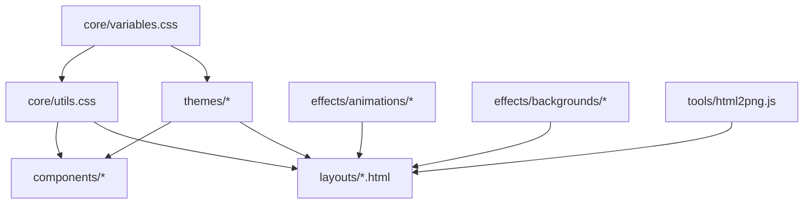
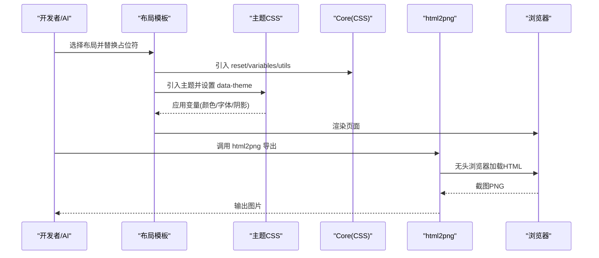
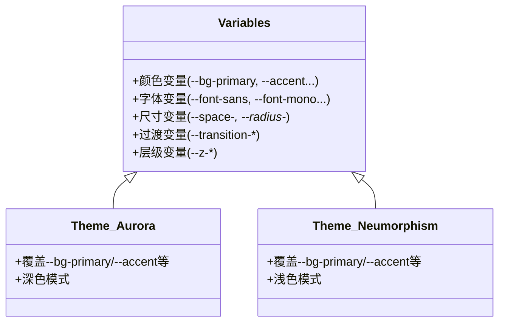
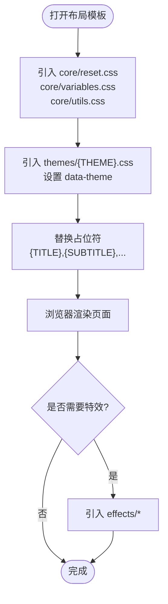
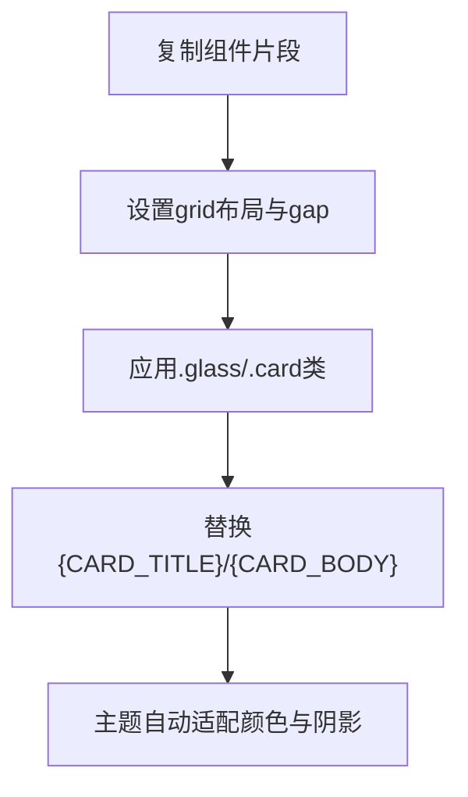
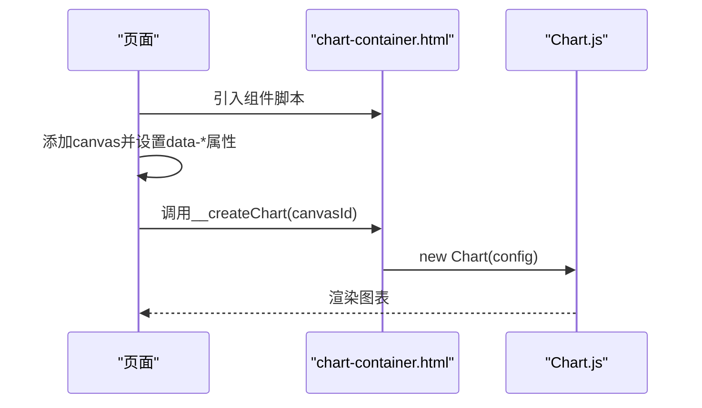
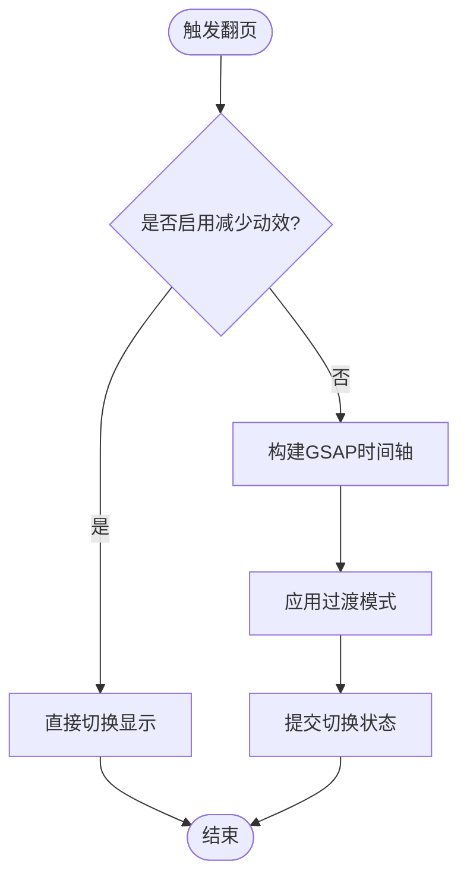
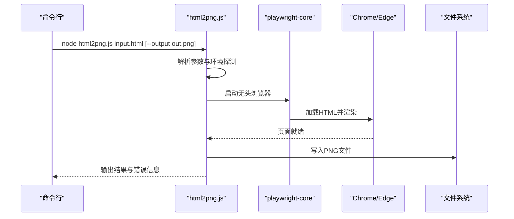
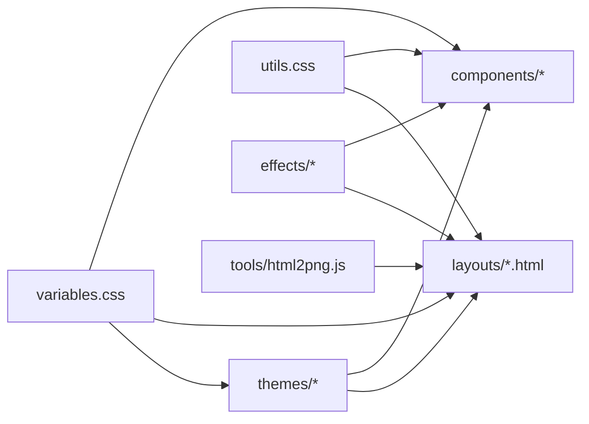

# 共享视觉组件系统

<cite>
**本文引用的文件**
- [SKILL.md](file://skills/shared-visual-components/SKILL.md)
- [registry.json](file://skills/shared-visual-components/registry.json)
- [variables.css](file://skills/shared-visual-components/core/variables.css)
- [reset.css](file://skills/shared-visual-components/core/reset.css)
- [utils.css](file://skills/shared-visual-components/core/utils.css)
- [aurora.css](file://skills/shared-visual-components/themes/aurora.css)
- [neumorphism.css](file://skills/shared-visual-components/themes/neumorphism.css)
- [landing-page.html](file://skills/shared-visual-components/layouts/landing-page.html)
- [dashboard.html](file://skills/shared-visual-components/layouts/dashboard.html)
- [glass-card.html](file://skills/shared-visual-components/components/card/glass-card.html)
- [chart-container.html](file://skills/shared-visual-components/components/data/chart-container.html)
- [mesh-gradient.html](file://skills/shared-visual-components/effects/backgrounds/mesh-gradient.html)
- [gsap-transitions.js](file://skills/shared-visual-components/effects/animations/gsap-transitions.js)
- [html2png.js](file://skills/shared-visual-components/tools/html2png.js)
</cite>

## 目录
1. [简介](#简介)
2. [项目结构](#项目结构)
3. [核心组件](#核心组件)
4. [架构总览](#架构总览)
5. [详细组件分析](#详细组件分析)
6. [依赖关系分析](#依赖关系分析)
7. [性能考量](#性能考量)
8. [故障排查指南](#故障排查指南)
9. [结论](#结论)
10. [附录](#附录)

## 简介
本仓库中的“共享视觉组件系统”是一套面向 AI 与前端协作的 HTML/CSS 组件与主题库，服务于 canvas-design、pptgen、craftman 等技能。其核心目标是：通过统一的变量体系、可插拔的主题、标准化的布局模板与可复用组件，让 AI 在生成海报、落地页、演示文稿、数据看板时“选 + 拼 + 调”，避免从零手写 CSS，从而保证视觉一致性与产出效率。

该系统的“AI 不写 CSS，只做选+拼+调”的原则体现在：
- 所有样式基于 CSS 变量，主题只需覆盖少量变量即可全局换肤
- 提供注册表 registry.json，集中描述可用主题、布局、组件与特效
- 提供多套布局模板（落地页、仪表盘、海报、演示文稿）和丰富组件（卡片、网格、封面、数据、导航、文本、页脚）
- 配套工具脚本支持将 HTML 导出为 PNG，便于分享与归档

## 项目结构
共享视觉组件系统采用分层组织方式：
- core：基础层，包含 reset、CSS 变量、通用工具类
- themes：主题层，按 data-theme 切换颜色、字体、强调色等
- components：组件层，以 HTML 片段形式提供可复用的 UI 块
- effects：特效层，包括动画、背景、交互效果
- layouts：布局模板，组合多个组件形成完整页面骨架
- tools：工具脚本，如 html2png 导出图片

图表来源
- [variables.css:1-107](file://skills/shared-visual-components/core/variables.css#L1-L107)
- [utils.css:1-156](file://skills/shared-visual-components/core/utils.css#L1-L156)
- [landing-page.html:1-155](file://skills/shared-visual-components/layouts/landing-page.html#L1-L155)
- [dashboard.html:1-167](file://skills/shared-visual-components/layouts/dashboard.html#L1-L167)
- [html2png.js:1-152](file://skills/shared-visual-components/tools/html2png.js#L1-L152)

章节来源
- [SKILL.md:1-115](file://skills/shared-visual-components/SKILL.md#L1-L115)
- [registry.json:1-115](file://skills/shared-visual-components/registry.json#L1-L115)

## 核心组件
共享视觉组件系统围绕“变量驱动 + 主题切换 + 组件拼装”展开，核心能力如下：
- 统一变量体系：颜色、阴影、圆角、间距、字号、字重、行高、过渡、层级等全部通过 CSS 变量定义，主题仅覆盖必要变量
- 主题系统：通过 body 或根元素设置 data-theme，自动应用对应主题的颜色与字体
- 组件化：每个组件是独立的 HTML 片段，可直接复制到布局中使用，并继承主题变量
- 布局模板：提供落地页、仪表盘、海报、演示文稿等模板，内置常用区块与响应式断点
- 特效库：动画、背景、交互效果可按需引入，增强视觉表现
- 工具链：html2png 支持将 HTML 渲染为 PNG，便于分享与归档

章节来源
- [variables.css:1-107](file://skills/shared-visual-components/core/variables.css#L1-L107)
- [registry.json:1-115](file://skills/shared-visual-components/registry.json#L1-L115)
- [SKILL.md:1-115](file://skills/shared-visual-components/SKILL.md#L1-L115)

## 架构总览
系统采用“基础层 → 主题层 → 组件/布局层 → 工具层”的分层架构：
- 基础层（core）：reset.css 统一浏览器差异；variables.css 定义全局变量；utils.css 提供通用工具类
- 主题层（themes）：通过 data-theme 选择器覆盖变量，实现一键换肤
- 组件/布局层（components/layouts）：HTML 片段与模板，引用 core 与主题，组合出完整页面
- 特效层（effects）：动画、背景、交互效果作为可选增强
- 工具层（tools）：html2png 将 HTML 渲染为图片，支持视口、缩放、选择器等参数

图表来源
- [landing-page.html:1-155](file://skills/shared-visual-components/layouts/landing-page.html#L1-L155)
- [dashboard.html:1-167](file://skills/shared-visual-components/layouts/dashboard.html#L1-L167)
- [variables.css:1-107](file://skills/shared-visual-components/core/variables.css#L1-L107)
- [html2png.js:1-152](file://skills/shared-visual-components/tools/html2png.js#L1-L152)

## 详细组件分析

### 变量与主题系统
- variables.css 定义了完整的变量体系，包括颜色、玻璃拟态、阴影、圆角、间距、字体、字号、字重、行高、过渡、层级等
- 主题通过 data-theme 选择器覆盖变量，例如 aurora 与 neumorphism 分别定义深色炫光与浅色拟态风格
- 主题切换简单：在 body 上设置 data-theme="主题id"，所有组件自动适配

图表来源
- [variables.css:1-107](file://skills/shared-visual-components/core/variables.css#L1-L107)
- [aurora.css:1-37](file://skills/shared-visual-components/themes/aurora.css#L1-L37)
- [neumorphism.css:1-37](file://skills/shared-visual-components/themes/neumorphism.css#L1-L37)

章节来源
- [variables.css:1-107](file://skills/shared-visual-components/core/variables.css#L1-L107)
- [aurora.css:1-37](file://skills/shared-visual-components/themes/aurora.css#L1-L37)
- [neumorphism.css:1-37](file://skills/shared-visual-components/themes/neumorphism.css#L1-L37)

### 布局模板
- landing-page.html：单页落地页，包含 Hero、特性区、数据区、CTA、页脚，内置滚动触发动画
- dashboard.html：数据仪表盘，包含统计卡片、图表区、列表区，集成 Chart.js 折线与环形图
- 两者均通过 {BASE}/{THEME} 占位符引入 core 与主题，并通过 data-theme 切换外观

图表来源
- [landing-page.html:1-155](file://skills/shared-visual-components/layouts/landing-page.html#L1-L155)
- [dashboard.html:1-167](file://skills/shared-visual-components/layouts/dashboard.html#L1-L167)

章节来源
- [landing-page.html:1-155](file://skills/shared-visual-components/layouts/landing-page.html#L1-L155)
- [dashboard.html:1-167](file://skills/shared-visual-components/layouts/dashboard.html#L1-L167)

### 组件：毛玻璃卡片
- glass-card.html 提供三列毛玻璃卡片布局，使用 .glass 与 .card 工具类，配合 CSS 变量实现半透明与模糊效果
- 适合内容块、特性展示，可通过 grid 与 gap 调整布局密度

图表来源
- [glass-card.html:1-27](file://skills/shared-visual-components/components/card/glass-card.html#L1-L27)
- [utils.css:100-119](file://skills/shared-visual-components/core/utils.css#L100-L119)

章节来源
- [glass-card.html:1-27](file://skills/shared-visual-components/components/card/glass-card.html#L1-L27)
- [utils.css:100-119](file://skills/shared-visual-components/core/utils.css#L100-L119)

### 组件：图表容器
- chart-container.html 封装 Chart.js 初始化逻辑，支持 line/bar/doughnut/radar 多种类型
- 通过 data-type、data-labels、data-series、data-options 配置图表，自动读取主题变量设置颜色
- 支持本地 vendor 离线与 CDN 回退，确保无网络也可用

图表来源
- [chart-container.html:1-108](file://skills/shared-visual-components/components/data/chart-container.html#L1-L108)

章节来源
- [chart-container.html:1-108](file://skills/shared-visual-components/components/data/chart-container.html#L1-L108)

### 特效：GSAP 翻页过渡
- gsap-transitions.js 提供圆形遮罩、像素扩散、切片滑动、视差层叠、淡入淡出五种过渡模式
- 通过 window.__transition(container, current, next, mode, direction) 调用，尊重 prefers-reduced-motion
- 适用于 presentation-gsap 布局的多页演示场景

图表来源
- [gsap-transitions.js:1-134](file://skills/shared-visual-components/effects/animations/gsap-transitions.js#L1-L134)

章节来源
- [gsap-transitions.js:1-134](file://skills/shared-visual-components/effects/animations/gsap-transitions.js#L1-L134)

### 工具：HTML 转 PNG
- html2png.js 使用 playwright-core 与系统 Chrome/Edge，将 HTML 渲染为 PNG
- 支持视口宽高、设备像素比、选择器截图、整页截图、等待渲染时间等参数
- 自动探测便携包环境与浏览器路径，提升跨平台可用性

图表来源
- [html2png.js:1-152](file://skills/shared-visual-components/tools/html2png.js#L1-L152)

章节来源
- [html2png.js:1-152](file://skills/shared-visual-components/tools/html2png.js#L1-L152)

## 依赖关系分析
- 主题依赖变量：所有主题通过覆盖 variables.css 中的变量实现换肤，耦合度低且扩展性强
- 布局依赖 core 与主题：布局模板必须引入 reset、variables、utils 以及一个主题，确保样式一致性
- 组件依赖 core 与主题：组件使用 utils 的工具类与变量的语义化命名，无需重复定义样式
- 特效可选：动画、背景、交互效果按需引入，不影响基础功能
- 工具独立：html2png 不依赖页面样式，仅依赖 playwright-core 与系统浏览器

图表来源
- [variables.css:1-107](file://skills/shared-visual-components/core/variables.css#L1-L107)
- [utils.css:1-156](file://skills/shared-visual-components/core/utils.css#L1-L156)
- [landing-page.html:1-155](file://skills/shared-visual-components/layouts/landing-page.html#L1-L155)
- [dashboard.html:1-167](file://skills/shared-visual-components/layouts/dashboard.html#L1-L167)
- [html2png.js:1-152](file://skills/shared-visual-components/tools/html2png.js#L1-L152)

章节来源
- [registry.json:1-115](file://skills/shared-visual-components/registry.json#L1-L115)
- [SKILL.md:1-115](file://skills/shared-visual-components/SKILL.md#L1-L115)

## 性能考量
- 减少重复样式：通过 core/utils.css 的工具类与 variables.css 的变量，避免在每个组件中重复定义样式，降低 CSS 体积
- 主题切换开销小：仅通过 data-theme 选择器覆盖变量，浏览器计算成本低
- 图表按需加载：chart-container.html 支持本地 vendor 与 CDN 回退，避免不必要的网络请求
- 动画降级：gsap-transitions.js 尊重 prefers-reduced-motion，在用户偏好减少动效时跳过复杂动画
- 导出优化：html2png.js 支持视口与缩放控制，合理设置 wait 时间确保图表与动画渲染完成

[本节为通用指导，不直接分析具体文件]

## 故障排查指南
- 主题未生效：确认 body 已设置 data-theme 且值与主题 id 匹配；检查主题文件是否正确引入
- 组件样式异常：确认已引入 core/reset.css、core/variables.css、core/utils.css；检查组件是否使用了正确的类名
- 图表不显示：确认 chart-container.html 已引入且 Chart.js 可用；检查 canvas 的 data-type、data-labels、data-series 格式是否正确
- GSAP 过渡无效：确认已引入 gsap.min.js 与 gsap-transitions.js；检查 __transition 调用参数是否正确
- html2png 失败：确认 playwright-core 与系统浏览器存在；检查输入文件路径与选择器；适当增加 wait 时间

章节来源
- [variables.css:1-107](file://skills/shared-visual-components/core/variables.css#L1-L107)
- [utils.css:1-156](file://skills/shared-visual-components/core/utils.css#L1-L156)
- [chart-container.html:1-108](file://skills/shared-visual-components/components/data/chart-container.html#L1-L108)
- [gsap-transitions.js:1-134](file://skills/shared-visual-components/effects/animations/gsap-transitions.js#L1-L134)
- [html2png.js:1-152](file://skills/shared-visual-components/tools/html2png.js#L1-L152)

## 结论
共享视觉组件系统通过统一的变量体系、灵活的主题切换、标准化的布局模板与可复用组件，显著提升了视觉产出的效率与一致性。AI 只需“选 + 拼 + 调”，即可快速生成高质量的海报、落地页、演示文稿与数据看板。配合工具链（html2png），可实现从设计到分享的闭环流程。建议在使用中优先遵循 registry.json 的选择流程，并在现有组件无法满足需求时才进行少量补充开发。

[本节为总结性内容，不直接分析具体文件]

## 附录
- 使用流程参考 SKILL.md 的三步拼装法：选布局 → 选主题 → 拼组件
- 组件清单与特效库详见 registry.json 的 components 与 effects 字段
- 主题选择建议根据场景与受众匹配，如科技发布会选 aurora，企业汇报选 neumorphism

章节来源
- [SKILL.md:1-115](file://skills/shared-visual-components/SKILL.md#L1-L115)
- [registry.json:1-115](file://skills/shared-visual-components/registry.json#L1-L115)