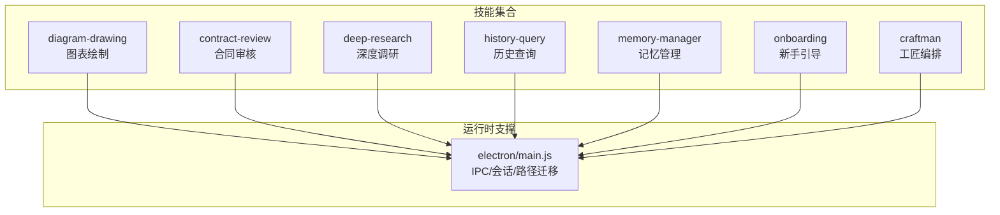
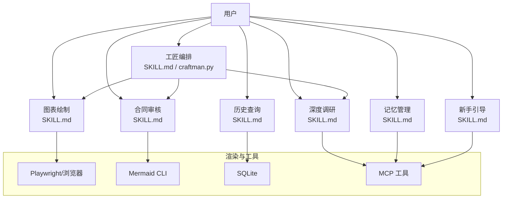
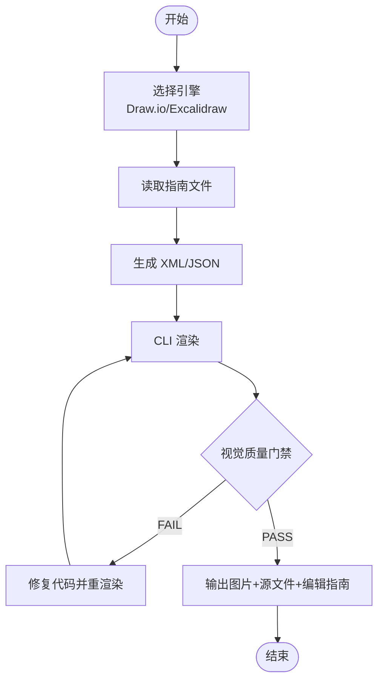
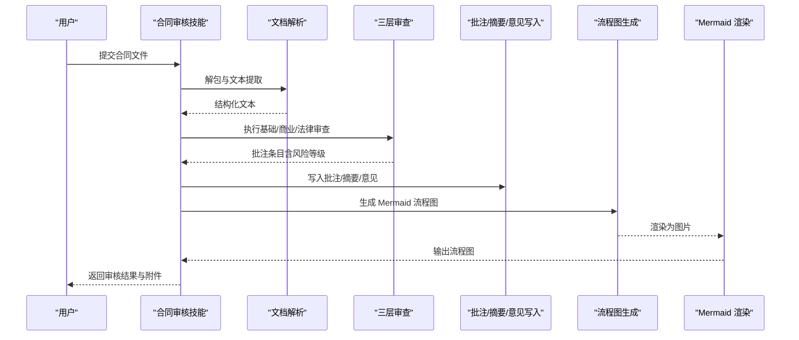
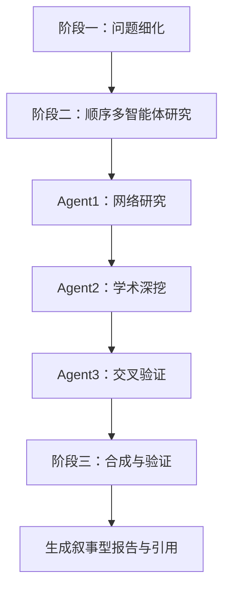
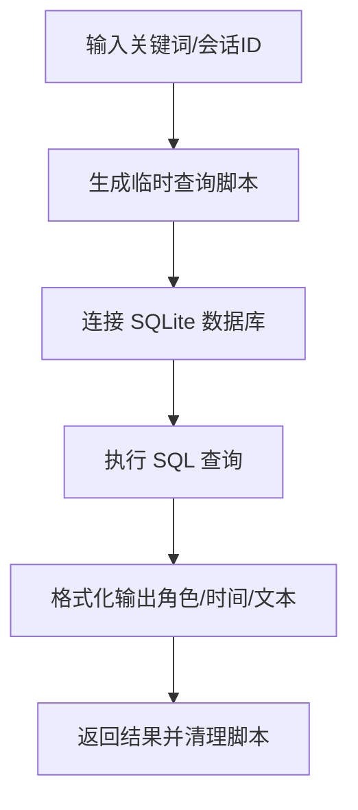
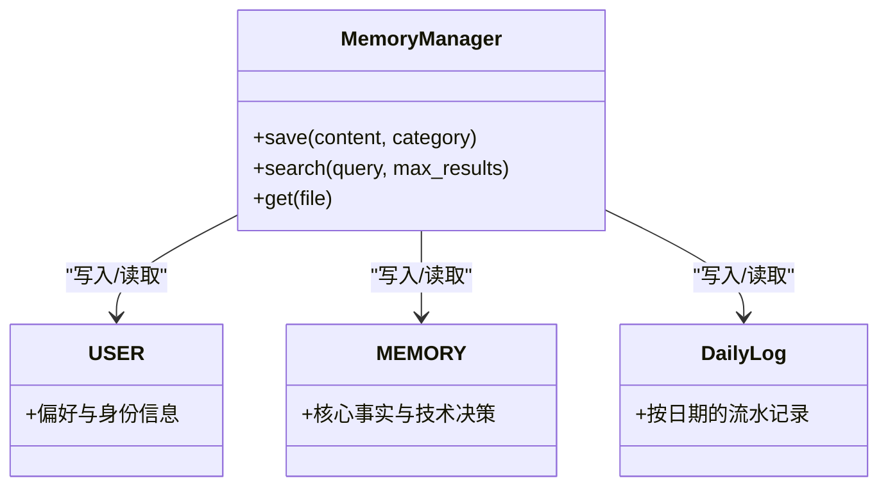
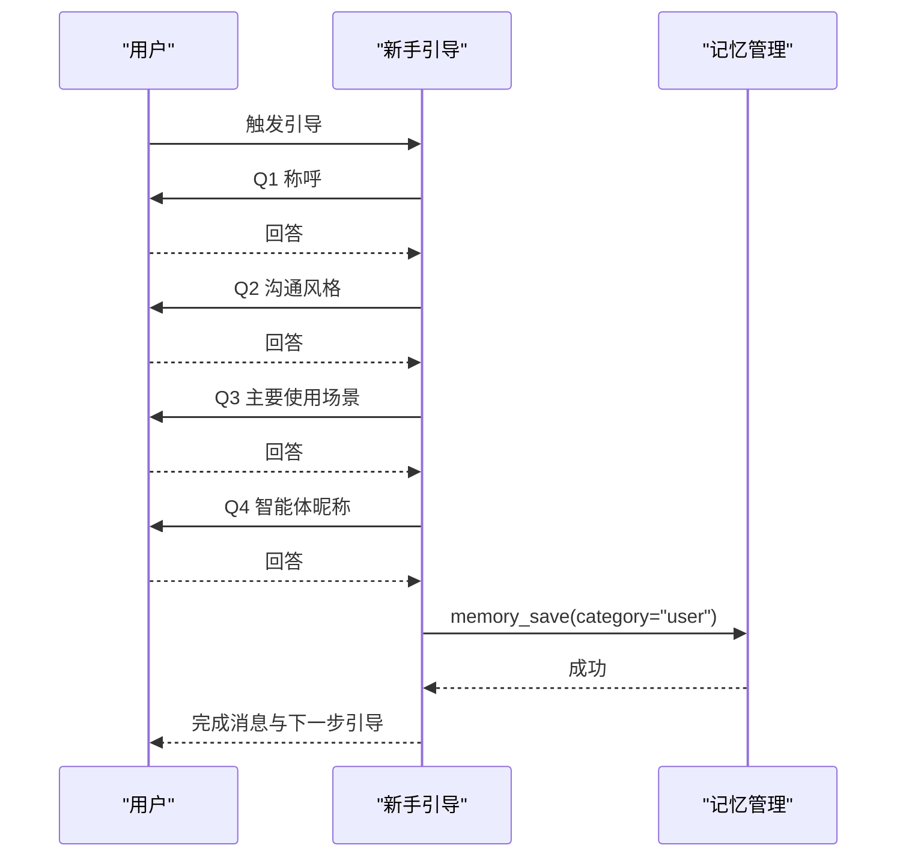
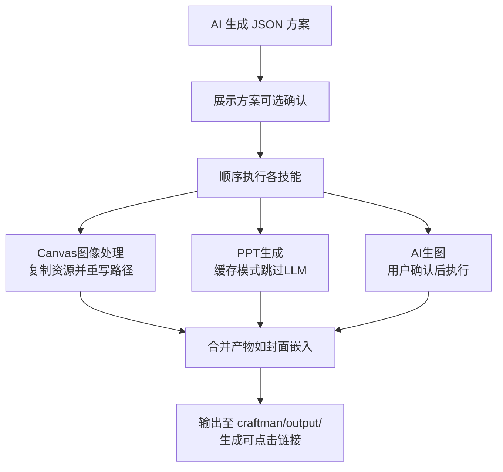
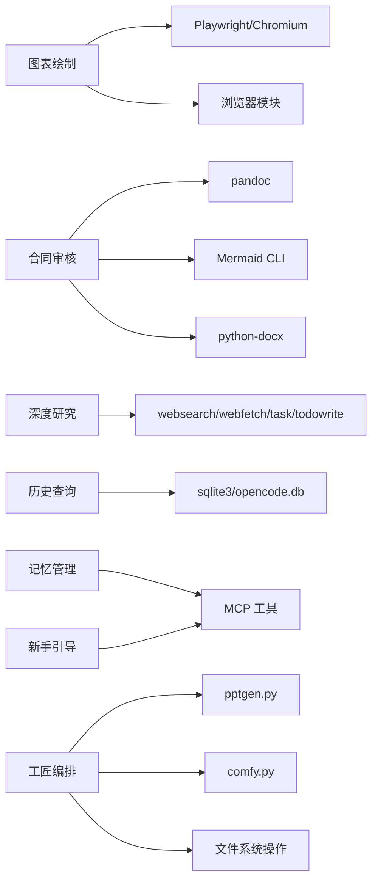

# 其他专业技能

<cite>
**本文引用的文件**
- [skills/diagram-drawing/SKILL.md](file://skills/diagram-drawing/SKILL.md)
- [skills/diagram-drawing/references/templates.md](file://skills/diagram-drawing/references/templates.md)
- [skills/diagram-drawing/references/drawio-guidelines.md](file://skills/diagram-drawing/references/drawio-guidelines.md)
- [skills/contract-review/SKILL.md](file://skills/contract-review/SKILL.md)
- [skills/contract-review/references/checklist.md](file://skills/contract-review/references/checklist.md)
- [skills/contract-review/references/examples.md](file://skills/contract-review/references/examples.md)
- [skills/deep-research/SKILL.md](file://skills/deep-research/SKILL.md)
- [skills/history-query/SKILL.md](file://skills/history-query/SKILL.md)
- [skills/memory-manager/SKILL.md](file://skills/memory-manager/SKILL.md)
- [skills/onboarding/SKILL.md](file://skills/onboarding/SKILL.md)
- [skills/craftman/SKILL.md](file://skills/craftman/SKILL.md)
- [skills/craftman/craftman.py](file://skills/craftman/craftman.py)
</cite>

## 更新摘要
**所做更改**
- 更新了工匠模式章节，反映新的弱模型友好食谱格式
- 增强了HTML Canvas图像处理功能，支持自动资源复制和路径重写
- 改进了输出目录管理，提供统一的输出结构和链接生成
- 优化了会话状态管理，支持步骤跳过和错误恢复
- 简化了执行流程说明，从复杂JSON示例改为分步执行指令
- 增强了AI代理的可访问性和易用性
- 保持了其他技能章节的完整性和准确性

## 目录
1. [引言](#引言)
2. [项目结构](#项目结构)
3. [核心组件](#核心组件)
4. [架构总览](#架构总览)
5. [详细组件分析](#详细组件分析)
6. [依赖关系分析](#依赖关系分析)
7. [性能考量](#性能考量)
8. [故障排查指南](#故障排查指南)
9. [结论](#结论)
10. [附录](#附录)

## 引言
本文件面向"其他专业技能"的体系化说明，覆盖以下技能：图表绘制（Draw.io、Excalidraw 集成与模板系统）、合同审查（法律分析、检查清单、流程图）、深度研究（信息收集、分析框架、报告生成）、历史查询（数据检索、时间线分析与可视化展示）、记忆管理器（知识组织、语义搜索与关联推荐）、新手引导（学习路径、进度跟踪与技能推荐）、工匠模式（项目规划、任务分解与执行监控）。文档以"从入门到进阶"的方式组织，既提供高层概览，也给出代码级流程与配置要点，帮助不同技术背景的读者快速上手并扩展能力。

**最新更新**：工匠模式已完全重写为弱模型友好的食谱格式，提供更直观的分步执行指令，降低AI代理的使用门槛。新增HTML Canvas图像处理功能和改进的输出目录管理。

## 项目结构
仓库采用"按功能域划分"的技能目录结构，每个技能以独立文件夹承载 SKILL.md（使用说明与约束）以及必要的参考文件与脚本。关键目录包括：
- skills/：各技能实现与说明
- data/agent/managed-skills/：托管技能资源（如字体、工作流定义等）
- electron/：桌面端主进程与渲染进程入口（会话管理、IPC 接口等）

**图示来源**
- [skills/diagram-drawing/SKILL.md:1-20](file://skills/diagram-drawing/SKILL.md#L1-L20)
- [skills/contract-review/SKILL.md:1-20](file://skills/contract-review/SKILL.md#L1-L20)
- [skills/deep-research/SKILL.md:1-20](file://skills/deep-research/SKILL.md#L1-L20)
- [skills/history-query/SKILL.md:1-20](file://skills/history-query/SKILL.md#L1-L20)
- [skills/memory-manager/SKILL.md:1-20](file://skills/memory-manager/SKILL.md#L1-L20)
- [skills/onboarding/SKILL.md:1-20](file://skills/onboarding/SKILL.md#L1-L20)
- [skills/craftman/SKILL.md:1-20](file://skills/craftman/SKILL.md#L1-L20)

**章节来源**
- [skills/diagram-drawing/SKILL.md:1-20](file://skills/diagram-drawing/SKILL.md#L1-L20)
- [skills/contract-review/SKILL.md:1-20](file://skills/contract-review/SKILL.md#L1-L20)
- [skills/deep-research/SKILL.md:1-20](file://skills/deep-research/SKILL.md#L1-L20)
- [skills/history-query/SKILL.md:1-20](file://skills/history-query/SKILL.md#L1-L20)
- [skills/memory-manager/SKILL.md:1-20](file://skills/memory-manager/SKILL.md#L1-L20)
- [skills/onboarding/SKILL.md:1-20](file://skills/onboarding/SKILL.md#L1-L20)
- [skills/craftman/SKILL.md:1-20](file://skills/craftman/SKILL.md#L1-L20)

## 核心组件
- 图表绘制：支持 Draw.io（结构化/正式）与 Excalidraw（手绘/随意）双引擎，内置模板与视觉质量门禁，CLI 渲染输出 PNG/SVG。
- 合同审查：三层审查（基础/商业/法律），仅添加批注不改动原文，输出摘要、综合意见与业务流程图（Mermaid + 渲染图）。
- 深度研究：三阶段工作流（问题细化→顺序多智能体研究→合成验证），强调叙事型报告与引用可追溯。
- 历史查询：直读 SQLite 数据库，支持关键词检索与会话浏览。
- 记忆管理：跨会话持久化（USER.md/MEMORY.md/daily-log），三类分类与正则搜索。
- 新手引导：四步对话式收集偏好与风格，写入 USER.md 作为长期记忆。
- **工匠编排**：AI 生成简单方案，按步骤调用 pptgen/comfyui/canvas-design，合并产物。**已更新为弱模型友好的食谱格式，增强HTML Canvas处理和输出管理**。

**章节来源**
- [skills/diagram-drawing/SKILL.md:1-20](file://skills/diagram-drawing/SKILL.md#L1-L20)
- [skills/contract-review/SKILL.md:1-20](file://skills/contract-review/SKILL.md#L1-L20)
- [skills/deep-research/SKILL.md:1-20](file://skills/deep-research/SKILL.md#L1-L20)
- [skills/history-query/SKILL.md:1-20](file://skills/history-query/SKILL.md#L1-L20)
- [skills/memory-manager/SKILL.md:1-20](file://skills/memory-manager/SKILL.md#L1-L20)
- [skills/onboarding/SKILL.md:1-20](file://skills/onboarding/SKILL.md#L1-L20)
- [skills/craftman/SKILL.md:1-20](file://skills/craftman/SKILL.md#L1-L20)

## 架构总览
下图展示了各技能在运行时的交互关系：用户通过自然语言触发相应技能；图表绘制与合同审查依赖外部渲染器（Playwright/浏览器、Mermaid CLI）；深度研究使用多智能体顺序执行；历史查询直接访问 SQLite；记忆管理与新手引导通过 MCP 工具读写文件；工匠编排协调多个子技能并合并输出。

**图示来源**
- [skills/diagram-drawing/SKILL.md:20-40](file://skills/diagram-drawing/SKILL.md#L20-L40)
- [skills/contract-review/SKILL.md:100-120](file://skills/contract-review/SKILL.md#L100-L120)
- [skills/deep-research/SKILL.md:120-160](file://skills/deep-research/SKILL.md#L120-L160)
- [skills/history-query/SKILL.md:10-25](file://skills/history-query/SKILL.md#L10-L25)
- [skills/memory-manager/SKILL.md:8-18](file://skills/memory-manager/SKILL.md#L8-L18)
- [skills/onboarding/SKILL.md:48-60](file://skills/onboarding/SKILL.md#L48-L60)
- [skills/craftman/SKILL.md:30-60](file://skills/craftman/SKILL.md#L30-L60)

## 详细组件分析

### 图表绘制（Draw.io / Excalidraw）
- 引擎选择规则：正式/精确/文档类优先 Draw.io；草图/头脑风暴优先 Excalidraw；模糊类型默认 Draw.io，除非明确"手绘"。
- 生成流程：选择引擎 → 读取对应指南 → 生成 XML/JSON → CLI 渲染 → 视觉质量门禁（PASS/FAIL 循环，最多重试 2 次）→ 解析输出。
- 模板系统：涵盖流程图、状态图、泳道图、时序图、甘特图、UML/ER、SWOT、鱼骨、矩阵、金字塔、漏斗、维恩、架构图、信息图等，并提供示例提示词。
- 输出处理：展示图片预览、源文件路径与编辑指南（分别针对 Draw.io 与 Excalidraw）。

**图示来源**
- [skills/diagram-drawing/SKILL.md:73-125](file://skills/diagram-drawing/SKILL.md#L73-L125)
- [skills/diagram-drawing/references/templates.md:1-40](file://skills/diagram-drawing/references/templates.md#L1-L40)

**章节来源**
- [skills/diagram-drawing/SKILL.md:35-72](file://skills/diagram-drawing/SKILL.md#L35-L72)
- [skills/diagram-drawing/references/drawio-guidelines.md:11-30](file://skills/diagram-drawing/references/drawio-guidelines.md#L11-L30)
- [skills/diagram-drawing/references/templates.md:15-50](file://skills/diagram-drawing/references/templates.md#L15-L50)

### 合同审查（三层审查与流程图）
- 工作流：解包 .docx → 提取文本 → 三层审查（基础/商业/法律）→ 添加批注（不改原文）→ 生成摘要与综合意见 → 生成 Mermaid 流程图并渲染 → 重新打包为 .docx。
- 批注原则：精准锚定条款、结构化内容（问题类型/风险原因/修订建议）、风险等级编码于审阅者名称。
- 输出命名：中文/英文两套命名规范，包含审核版、报告、摘要、意见与流程图文件。
- 依赖：Python、pandoc、defusedxml、Mermaid CLI、python-docx。

**图示来源**
- [skills/contract-review/SKILL.md:21-31](file://skills/contract-review/SKILL.md#L21-L31)
- [skills/contract-review/references/checklist.md:1-35](file://skills/contract-review/references/checklist.md#L1-L35)
- [skills/contract-review/references/examples.md:100-115](file://skills/contract-review/references/examples.md#L100-L115)

**章节来源**
- [skills/contract-review/SKILL.md:38-79](file://skills/contract-review/SKILL.md#L38-L79)
- [skills/contract-review/references/checklist.md:36-94](file://skills/contract-review/references/checklist.md#L36-L94)
- [skills/contract-review/references/checklist.md:97-166](file://skills/contract-review/references/checklist.md#L97-L166)
- [skills/contract-review/references/examples.md:116-186](file://skills/contract-review/references/examples.md#L116-L186)

### 深度研究（三阶段与多智能体）
- 阶段一：问题细化与范围界定，产出结构化研究提示词。
- 阶段二：顺序执行三个智能体（网络研究→学术深挖→交叉验证），每步保存结果并传递上下文。
- 阶段三：主题聚合、共识评估、矛盾解析，生成叙事型研究报告与完整引用。
- 质量要求：事实声明必须附带作者/日期/标题/URL/页码；平均来源质量≥B；矛盾需解释。

**图示来源**
- [skills/deep-research/SKILL.md:70-127](file://skills/deep-research/SKILL.md#L70-L127)
- [skills/deep-research/SKILL.md:128-177](file://skills/deep-research/SKILL.md#L128-L177)
- [skills/deep-research/SKILL.md:284-330](file://skills/deep-research/SKILL.md#L284-L330)

**章节来源**
- [skills/deep-research/SKILL.md:42-69](file://skills/deep-research/SKILL.md#L42-L69)
- [skills/deep-research/SKILL.md:178-283](file://skills/deep-research/SKILL.md#L178-L283)
- [skills/deep-research/SKILL.md:331-447](file://skills/deep-research/SKILL.md#L331-L447)

### 历史查询（数据检索与时间线）
- 数据库位置：opencode.db（SQLite）。
- 方法：临时 Python 脚本直连数据库，支持关键词搜索与会话浏览，按时间排序输出。
- 适用场景：跨会话回顾、定位特定讨论片段、构建时间线视图。

**图示来源**
- [skills/history-query/SKILL.md:14-45](file://skills/history-query/SKILL.md#L14-L45)
- [skills/history-query/SKILL.md:47-72](file://skills/history-query/SKILL.md#L47-L72)

**章节来源**
- [skills/history-query/SKILL.md:1-20](file://skills/history-query/SKILL.md#L1-L20)

### 记忆管理器（知识组织与语义搜索）
- 存储结构：USER.md（用户偏好）、MEMORY.md（核心事实）、daily-log/YYYY-MM-DD.md（每日日志）。
- 工具：memory_save（保存）、memory_search（搜索，支持正则）、memory_get（读取文件）。
- 使用场景：记住身份/习惯、记录技术决策、日常流水记录；对话开始时自动加载记忆。

**图示来源**
- [skills/memory-manager/SKILL.md:8-18](file://skills/memory-manager/SKILL.md#L8-L18)
- [skills/memory-manager/SKILL.md:21-29](file://skills/memory-manager/SKILL.md#L21-L29)
- [skills/memory-manager/SKILL.md:31-54](file://skills/memory-manager/SKILL.md#L31-54)

**章节来源**
- [skills/memory-manager/SKILL.md:57-60](file://skills/memory-manager/SKILL.md#L57-L60)
- [skills/memory-manager/SKILL.md:63-90](file://skills/memory-manager/SKILL.md#L63-90)

### 新手引导（学习路径与进度跟踪）
- 目标：通过四步对话收集称呼、沟通风格、主要使用场景、智能体昵称，写入 USER.md。
- 规则：每次只提一个问题，自然衔接；用户可随时跳过；完成后发送确认与下一步引导。
- 输出：USER.md 中结构化档案，后续对话自动加载。

**图示来源**
- [skills/onboarding/SKILL.md:10-19](file://skills/onboarding/SKILL.md#L10-L19)
- [skills/onboarding/SKILL.md:20-47](file://skills/onboarding/SKILL.md#L20-L47)
- [skills/onboarding/SKILL.md:48-72](file://skills/onboarding/SKILL.md#L48-L72)

**章节来源**
- [skills/onboarding/SKILL.md:1-20](file://skills/onboarding/SKILL.md#L1-L20)

### 工匠模式（项目规划、任务分解与执行监控）
**已更新**：工匠模式已完全重写为弱模型友好的食谱格式，提供更直观的执行指令，增强HTML Canvas图像处理功能和输出目录管理。

- **角色分工**：AI 负责规划 JSON 方案，craftman 负责执行与合并。
- **技能注册表**：pptgen（交互式 HTML 演示）、comfyui（AI 生图）、canvas-design（HTML/CSS/SVG 设计）。
- **执行流程**：展示方案 → 可选确认 → 顺序执行 → 合并输出（如将 canvas 封面嵌入网页演示首位）。
- **特殊处理**：pptgen 预生成内容 JSON 并使用 --cache 跳过 LLM；comfyui 必须先询问是否生图及风格/比例；canvas-design 由 AI 写 HTML 后由 craftman 复制合并。

**新执行食谱（弱模型友好）**：
1. **写内容文件**：用 Write 工具把 content.json / cover.html 写到 `<cwd>/.craftman/` 目录
2. **写方案文件**：用 Write 工具把 plan.json 写到 `<cwd>/.craftman/plan.json`
3. **执行**：`python "<craftman.py绝对路径>" --plan-file "<cwd>/.craftman/plan.json" --no-confirm`

**新增功能**：
- **HTML Canvas图像处理**：自动扫描HTML中的本地图片引用，复制到输出目录并重写路径，避免移动后图片404
- **统一输出管理**：所有输出自动保存到 `output/` 目录，生成可点击的本地服务链接
- **会话状态管理**：支持步骤跳过、错误恢复和优雅降级

**图示来源**
- [skills/craftman/SKILL.md:16-22](file://skills/craftman/SKILL.md#L16-L22)
- [skills/craftman/SKILL.md:23-30](file://skills/craftman/SKILL.md#L23-30)
- [skills/craftman/craftman.py:17-40](file://skills/craftman/craftman.py#L17-L40)
- [skills/craftman/craftman.py:92-106](file://skills/craftman/craftman.py#L92-L106)
- [skills/craftman/craftman.py:183-229](file://skills/craftman/craftman.py#L183-L229)
- [skills/craftman/craftman.py:234-296](file://skills/craftman/craftman.py#L234-L296)

**章节来源**
- [skills/craftman/SKILL.md:31-60](file://skills/craftman/SKILL.md#L31-L60)
- [skills/craftman/SKILL.md:77-99](file://skills/craftman/SKILL.md#L77-L99)
- [skills/craftman/SKILL.md:117-132](file://skills/craftman/SKILL.md#L117-L132)
- [skills/craftman/craftman.py:108-145](file://skills/craftman/craftman.py#L108-L145)
- [skills/craftman/craftman.py:147-181](file://skills/craftman/craftman.py#L147-L181)
- [skills/craftman/craftman.py:183-200](file://skills/craftman/craftman.py#L183-L200)
- [skills/craftman/craftman.py:234-296](file://skills/craftman/craftman.py#L234-L296)

## 依赖关系分析
- 图表绘制：依赖 Playwright/Chromium 与浏览器模块（Draw.io viewer、Excalidraw ES module），需要联网。
- 合同审查：依赖 pandoc、defusedxml、Mermaid CLI、python-docx。
- 深度研究：依赖 websearch/webfetch/task（多智能体）与 todowrite 进度追踪。
- 历史查询：依赖 sqlite3 与 opencode.db。
- 记忆管理与新手引导：依赖 MCP 工具（memory_save/search/get）。
- 工匠编排：依赖子技能 CLI（pptgen.py、comfy.py）与文件系统操作。

**图示来源**
- [skills/diagram-drawing/SKILL.md:27-34](file://skills/diagram-drawing/SKILL.md#L27-L34)
- [skills/contract-review/SKILL.md:112-119](file://skills/contract-review/SKILL.md#L112-119)
- [skills/deep-research/SKILL.md:470-498](file://skills/deep-research/SKILL.md#L470-L498)
- [skills/history-query/SKILL.md:14-45](file://skills/history-query/SKILL.md#L14-L45)
- [skills/memory-manager/SKILL.md:8-18](file://skills/memory-manager/SKILL.md#L8-L18)
- [skills/craftman/craftman.py:17-40](file://skills/craftman/craftman.py#L17-L40)

**章节来源**
- [skills/diagram-drawing/SKILL.md:27-34](file://skills/diagram-drawing/SKILL.md#L27-L34)
- [skills/contract-review/SKILL.md:112-119](file://skills/contract-review/SKILL.md#L112-119)
- [skills/deep-research/SKILL.md:470-498](file://skills/deep-research/SKILL.md#L470-L498)
- [skills/history-query/SKILL.md:14-45](file://skills/history-query/SKILL.md#L14-L45)
- [skills/memory-manager/SKILL.md:8-18](file://skills/memory-manager/SKILL.md#L8-L18)
- [skills/craftman/craftman.py:17-40](file://skills/craftman/craftman.py#L17-L40)

## 性能考量
- 图表绘制：渲染超时常见于 HTML 实体编码问题，需在嵌入前对 & 进行 HTML 编码；避免过多复杂样式与超大节点布局。
- 合同审查：批量批注与并行输出可提升效率；确保 mmdc 可用以避免流程图渲染失败。
- 深度研究：合理设置智能体数量（2 快/3 质），限制单次搜索时间与来源质量阈值，减少无效往返。
- 历史查询：SQL 查询应限制返回行数与字段，避免大结果集阻塞。
- 记忆管理：定期归档 daily-log，控制 MEMORY.md 规模，提高搜索命中率。
- 工匠编排：预生成内容 JSON 与缓存模式可显著降低 LLM 调用开销与失败率；HTML资源自动复制避免重复下载。

[本节为通用指导，无需具体文件引用]

## 故障排查指南
- 图表绘制渲染超时：检查 XML/JSON 合法性，捕获浏览器控制台错误，必要时降级最小 XML 测试。
- 合同审查批注缺失：验证 doc.verify_comments() 并重新保存；缩短查找文本以定位段落。
- 深度研究引用不完整：逐项核对事实声明是否包含作者/日期/标题/URL/页码；平均来源质量不低于 B。
- 历史查询无结果：确认数据库路径与权限，调整 LIKE 匹配策略或扩大搜索范围。
- 记忆管理搜索失败：检查 query 正则语法与文件路径；确认 memory_get 文件名正确。
- 工匠编排执行失败：检查子技能路径与参数（content_file/html_file），查看 stderr 输出定位错误；确认HTML资源路径正确。

**章节来源**
- [skills/diagram-drawing/SKILL.md:190-205](file://skills/diagram-drawing/SKILL.md#L190-L205)
- [skills/contract-review/SKILL.md:120-125](file://skills/contract-review/SKILL.md#L120-L125)
- [skills/deep-research/SKILL.md:431-447](file://skills/deep-research/SKILL.md#L431-L447)
- [skills/history-query/SKILL.md:14-45](file://skills/history-query/SKILL.md#L14-L45)
- [skills/memory-manager/SKILL.md:85-90](file://skills/memory-manager/SKILL.md#L85-L90)
- [skills/craftman/craftman.py:138-145](file://skills/craftman/craftman.py#L138-L145)

## 结论
本仓库以模块化技能为核心，围绕"图表绘制、合同审查、深度研究、历史查询、记忆管理、新手引导、工匠编排"七大能力形成完整工作流生态。通过清晰的职责边界、严格的输出契约与可复用的模板/指南，用户可在不同复杂度需求下快速组合与扩展。**最新改进**：工匠模式已完全重写为弱模型友好的食谱格式，大幅降低了AI代理的使用门槛，使更多技术背景的开发者能够轻松使用。新增的HTML Canvas图像处理功能和改进的输出目录管理进一步提升了系统的稳定性和用户体验。建议在实践中遵循"先规划后执行、先验证后交付"的原则，结合质量门禁与故障排查指南，持续提升产出稳定性与专业性。

[本节为总结性内容，无需具体文件引用]

## 附录
- 常用命令与路径：
  - 图表绘制渲染：python3 <skill_path>/scripts/render.py <drawio|excalidraw> -f <temp_file> -o <output_path>
  - 合同审查依赖：安装 pandoc、Mermaid CLI、python-docx
  - 历史查询脚本：python search.py 关键词 / python view_session.py ses_xxxxx
  - 工匠编排：python craftman.py --plan-json '{...}' --no-confirm 或 --plan-file plan.json --no-confirm
  - 列出可用技能：python craftman.py --list-skills

[本节为补充信息，无需具体文件引用]