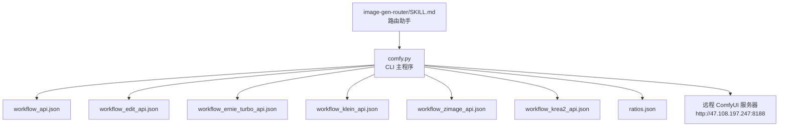
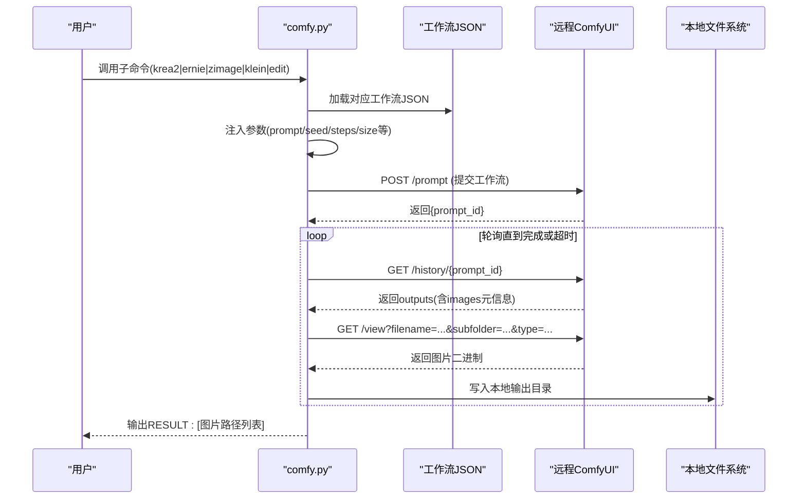
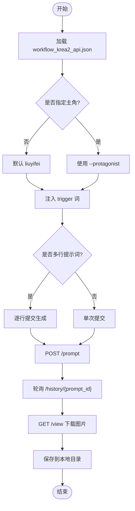
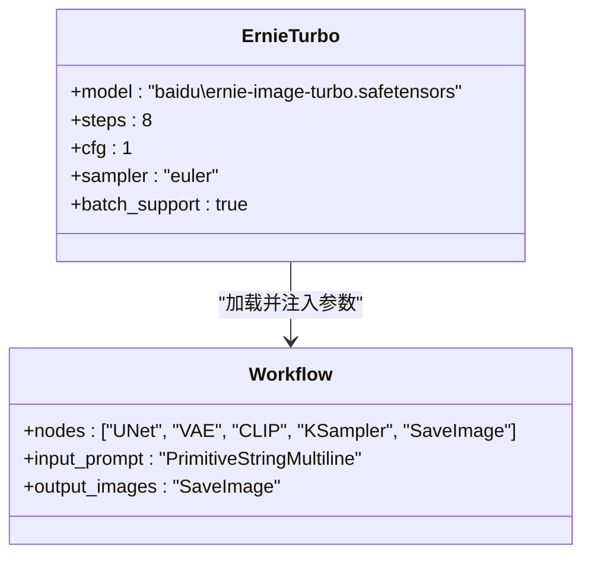
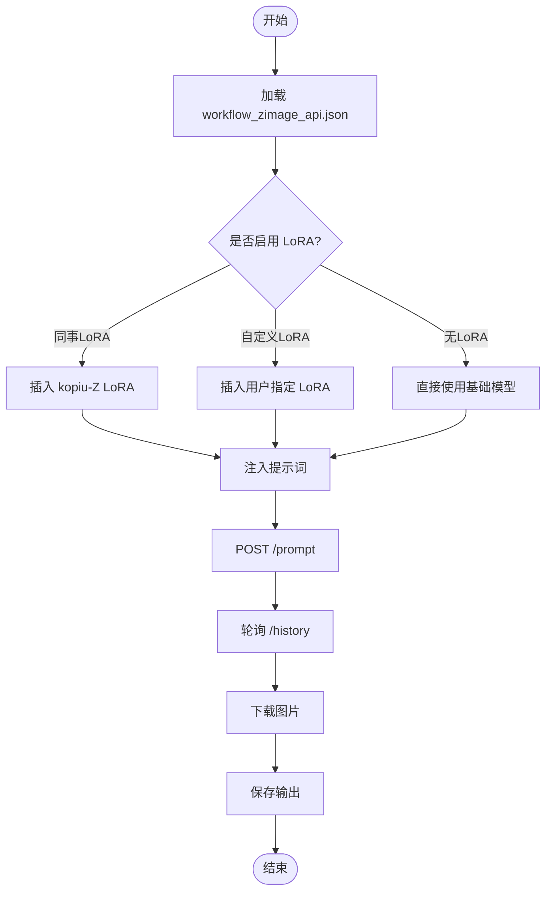
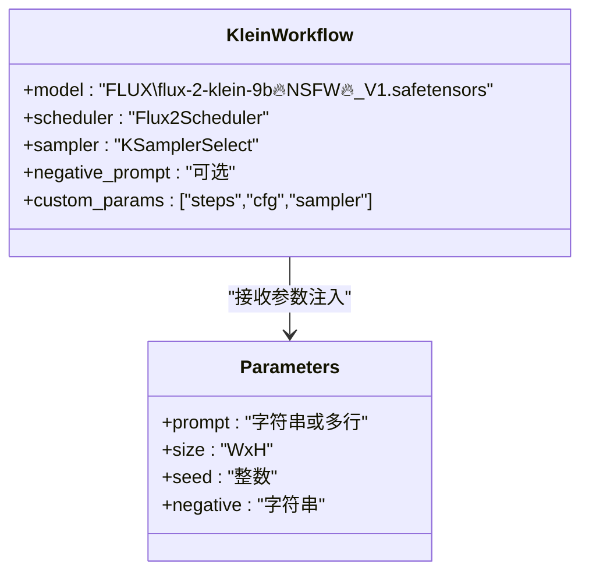
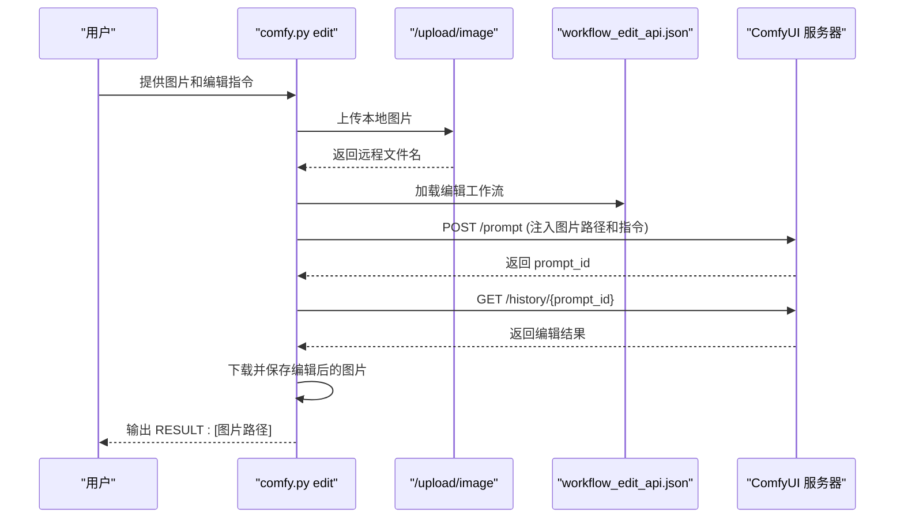
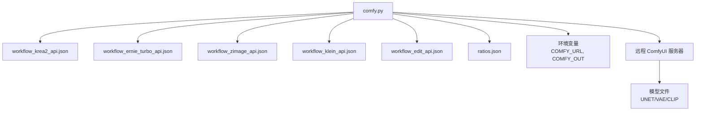

# ComfyUI 图像生成

<cite>
**本文引用的文件**   
- [skills/comfyui-image-gen/SKILL.md](file://skills/comfyui-image-gen/SKILL.md)
- [skills/comfyui-image-gen/comfy.py](file://skills/comfyui-image-gen/comfy.py)
- [skills/comfyui-image-gen/workflow_api.json](file://skills/comfyui-image-gen/workflow_api.json)
- [skills/comfyui-image-gen/workflow_edit_api.json](file://skills/comfyui-image-gen/workflow_edit_api.json)
- [skills/comfyui-image-gen/workflow_ernie_turbo_api.json](file://skills/comfyui-image-gen/workflow_ernie_turbo_api.json)
- [skills/comfyui-image-gen/workflow_klein_api.json](file://skills/comfyui-image-gen/workflow_klein_api.json)
- [skills/comfyui-image-gen/workflow_zimage_api.json](file://skills/comfyui-image-gen/workflow_zimage_api.json)
- [skills/comfyui-image-gen/workflow_krea2_api.json](file://skills/comfyui-image-gen/workflow_krea2_api.json)
- [skills/comfyui-image-gen/ratios.json](file://skills/comfyui-image-gen/ratios.json)
- [skills/image-gen-router/SKILL.md](file://skills/image-gen-router/SKILL.md)
</cite>

## 目录
1. [简介](#简介)
2. [项目结构](#项目结构)
3. [核心组件](#核心组件)
4. [架构总览](#架构总览)
5. [详细组件分析](#详细组件分析)
6. [依赖关系分析](#依赖关系分析)
7. [性能与资源管理](#性能与资源管理)
8. [故障排查指南](#故障排查指南)
9. [结论](#结论)
10. [附录：CLI 使用与示例](#附录cli-使用与示例)

## 简介
本技能提供基于远程 ComfyUI 的图像生成与编辑能力，统一通过 CLI 工具 comfy.py 驱动。系统内置五种工作流管道：Krea2、Ernie-Image-Turbo、Z-image、Klein、指令编辑（edit），并支持按用户意图自动路由到最佳管道。默认连接远程 ComfyUI 服务器，输出图片可配置本地目录，便于后续集成与批量处理。

## 项目结构
- 技能说明与入口
  - SKILL.md：技能描述、默认服务器地址、输出目录策略、路由规则摘要
  - comfy.py：CLI 主程序，包含五个子命令实现、HTTP 封装、工作流提交与结果下载
- 工作流定义
  - workflow_api.json：通用/混合节点定义（含 Z-image 与 Klein 相关节点）
  - workflow_edit_api.json：图编辑工作流（加载图片、参考潜变量、采样解码保存）
  - workflow_ernie_turbo_api.json：文生图（百度 Ernie-Image-Turbo）
  - workflow_klein_api.json：Flux2-Klein 独立流程（自由尺寸、高写实）
  - workflow_zimage_api.json：Z-image Turbo 流程（蒸馏模型、快速出图）
  - workflow_krea2_api.json：Krea2 Muse 流程（艺术/anime，双主角 LoRA）
- 辅助数据
  - ratios.json：常用画幅映射表（如 1:1、16:9、9:16 等）
- 路由助手
  - image-gen-router/SKILL.md：统一入口规范，强制先选择分支与画幅，再扩写提示词后调用 comfy.py



**图表来源** 
- [skills/comfyui-image-gen/comfy.py:1-397](file://skills/comfyui-image-gen/comfy.py#L1-L397)
- [skills/comfyui-image-gen/workflow_api.json:1-29](file://skills/comfyui-image-gen/workflow_api.json#L1-L29)
- [skills/comfyui-image-gen/workflow_edit_api.json:1-24](file://skills/comfyui-image-gen/workflow_edit_api.json#L1-L24)
- [skills/comfyui-image-gen/workflow_ernie_turbo_api.json:1-26](file://skills/comfyui-image-gen/workflow_ernie_turbo_api.json#L1-L26)
- [skills/comfyui-image-gen/workflow_klein_api.json:1-169](file://skills/comfyui-image-gen/workflow_klein_api.json#L1-L169)
- [skills/comfyui-image-gen/workflow_zimage_api.json:1-155](file://skills/comfyui-image-gen/workflow_zimage_api.json#L1-L155)
- [skills/comfyui-image-gen/workflow_krea2_api.json:1-158](file://skills/comfyui-image-gen/workflow_krea2_api.json#L1-L158)
- [skills/comfyui-image-gen/ratios.json:1-25](file://skills/comfyui-image-gen/ratios.json#L1-L25)
- [skills/image-gen-router/SKILL.md:1-98](file://skills/image-gen-router/SKILL.md#L1-L98)

**章节来源**
- [skills/comfyui-image-gen/SKILL.md:1-17](file://skills/comfyui-image-gen/SKILL.md#L1-L17)
- [skills/comfyui-image-gen/comfy.py:1-397](file://skills/comfyui-image-gen/comfy.py#L1-L397)
- [skills/image-gen-router/SKILL.md:1-98](file://skills/image-gen-router/SKILL.md#L1-L98)

## 核心组件
- CLI 主程序 comfy.py
  - 环境变量与默认值：COMFY_URL（远程服务器）、COMFY_OUT（输出目录）
  - HTTP 封装：_post/_get 用于提交 prompt、轮询历史、下载图片
  - 工作流加载与参数注入：load_wf、resolve_ratio、各子命令函数
  - 结果持久化：submit_and_wait 轮询 /history/{prompt_id} 并下载 images
- 工作流 JSON
  - 每个管道对应一个 workflow_*_api.json，定义节点类型、输入参数与连接关系
  - 关键节点包括 UNETLoader、VAELoader、CLIPTextEncode、KSampler、SaveImage 等
- 路由助手
  - image-gen-router/SKILL.md 规定“选路由 → 扩写 → 出图”三步流程，禁止跳过选择直接执行

**章节来源**
- [skills/comfyui-image-gen/comfy.py:1-397](file://skills/comfyui-image-gen/comfy.py#L1-L397)
- [skills/comfyui-image-gen/workflow_api.json:1-29](file://skills/comfyui-image-gen/workflow_api.json#L1-L29)
- [skills/comfyui-image-gen/workflow_edit_api.json:1-24](file://skills/comfyui-image-gen/workflow_edit_api.json#L1-L24)
- [skills/comfyui-image-gen/workflow_ernie_turbo_api.json:1-26](file://skills/comfyui-image-gen/workflow_ernie_turbo_api.json#L1-L26)
- [skills/comfyui-image-gen/workflow_klein_api.json:1-169](file://skills/comfyui-image-gen/workflow_klein_api.json#L1-L169)
- [skills/comfyui-image-gen/workflow_zimage_api.json:1-155](file://skills/comfyui-image-gen/workflow_zimage_api.json#L1-L155)
- [skills/comfyui-image-gen/workflow_krea2_api.json:1-158](file://skills/comfyui-image-gen/workflow_krea2_api.json#L1-L158)
- [skills/image-gen-router/SKILL.md:1-98](file://skills/image-gen-router/SKILL.md#L1-L98)

## 架构总览
整体架构由 CLI 层、工作流定义层、远程 ComfyUI 服务层组成。CLI 根据子命令加载对应工作流 JSON，注入参数后提交至远程服务器；服务端执行节点图并返回 prompt_id；CLI 轮询历史接口获取输出图片并保存到本地目录。



**图表来源** 
- [skills/comfyui-image-gen/comfy.py:65-106](file://skills/comfyui-image-gen/comfy.py#L65-L106)
- [skills/comfyui-image-gen/workflow_api.json:1-29](file://skills/comfyui-image-gen/workflow_api.json#L1-L29)
- [skills/comfyui-image-gen/workflow_edit_api.json:1-24](file://skills/comfyui-image-gen/workflow_edit_api.json#L1-L24)
- [skills/comfyui-image-gen/workflow_ernie_turbo_api.json:1-26](file://skills/comfyui-image-gen/workflow_ernie_turbo_api.json#L1-L26)
- [skills/comfyui-image-gen/workflow_klein_api.json:1-169](file://skills/comfyui-image-gen/workflow_klein_api.json#L1-L169)
- [skills/comfyui-image-gen/workflow_zimage_api.json:1-155](file://skills/comfyui-image-gen/workflow_zimage_api.json#L1-L155)
- [skills/comfyui-image-gen/workflow_krea2_api.json:1-158](file://skills/comfyui-image-gen/workflow_krea2_api.json#L1-L158)

## 详细组件分析

### Krea2 管道（艺术/anime，双主角 LoRA）
- 适用场景：艺术化人物、动漫风格、特定主角出图（liuyifei/kopiu）
- 技术要点：
  - 双主角 LoRA 开关：根据 protagonist 参数动态设置 strength_model，并在提示词前注入 trigger 词
  - 多行提示词批量生成：每行一张图，逐条提交，确保独立性
  - 种子控制：若指定 seed，每张图使用不同种子（+i）
- 关键节点：KSampler、VAEDecode、CLIPTextEncode、LoraLoaderModelOnly、EmptySD3LatentImage



**图表来源** 
- [skills/comfyui-image-gen/comfy.py:152-213](file://skills/comfyui-image-gen/comfy.py#L152-L213)
- [skills/comfyui-image-gen/workflow_krea2_api.json:1-158](file://skills/comfyui-image-gen/workflow_krea2_api.json#L1-L158)

**章节来源**
- [skills/comfyui-image-gen/comfy.py:152-213](file://skills/comfyui-image-gen/comfy.py#L152-L213)
- [skills/comfyui-image-gen/workflow_krea2_api.json:1-158](file://skills/comfyui-image-gen/workflow_krea2_api.json#L1-L158)

### Ernie-Image-Turbo 管道（真实感摄影 + 文字渲染）
- 适用场景：海报带文字、真实感偷拍、标题清晰
- 技术要点：
  - 使用 baidu/ernie-image-turbo.safetensors 模型
  - 支持多行提示词批量生成（CR Prompt List 节点）
  - 默认 steps=8，cfg=1，sampler=euler
- 关键节点：KSampler、VAEDecode、CLIPTextEncode、EmptyFlux2LatentImage



**图表来源** 
- [skills/comfyui-image-gen/workflow_ernie_turbo_api.json:1-26](file://skills/comfyui-image-gen/workflow_ernie_turbo_api.json#L1-L26)
- [skills/comfyui-image-gen/comfy.py:235-253](file://skills/comfyui-image-gen/comfy.py#L235-L253)

**章节来源**
- [skills/comfyui-image-gen/workflow_ernie_turbo_api.json:1-26](file://skills/comfyui-image-gen/workflow_ernie_turbo_api.json#L1-L26)
- [skills/comfyui-image-gen/comfy.py:235-253](file://skills/comfyui-image-gen/comfy.py#L235-L253)

### Z-image 管道（人物写真首选，蒸馏模型）
- 适用场景：人物肖像、角色气质、特定人物 LoRA
- 技术要点：
  - 使用 z_image_turbo_bf16_nsfw_v2.safetensors 模型
  - 默认 9 步，cfg=1，sampler=res_multistep
  - 支持同事 LoRA（--with-colleague）或自定义人物 LoRA（--lora-person）
  - 支持多行提示词批量生成
- 关键节点：KSampler、VAEDecode、CLIPTextEncode、EmptyLatentImage、LoraLoaderModelOnly



**图表来源** 
- [skills/comfyui-image-gen/workflow_zimage_api.json:1-155](file://skills/comfyui-image-gen/workflow_zimage_api.json#L1-L155)
- [skills/comfyui-image-gen/comfy.py:284-323](file://skills/comfyui-image-gen/comfy.py#L284-L323)

**章节来源**
- [skills/comfyui-image-gen/workflow_zimage_api.json:1-155](file://skills/comfyui-image-gen/workflow_zimage_api.json#L1-L155)
- [skills/comfyui-image-gen/comfy.py:284-323](file://skills/comfyui-image-gen/comfy.py#L284-L323)

### Klein 管道（全能但人物偏欧美气质）
- 适用场景：场景图、静物、风景、自由尺寸
- 技术要点：
  - 使用 flux-2-klein-9b🔥NSFW🔥_V1.safetensors 模型
  - 支持负向提示词（--negative）
  - 支持自定义 sampler、cfg、steps
  - 支持多行提示词批量生成
- 关键节点：Flux2Scheduler、KSamplerSelect、VAEDecode、CLIPTextEncode、EmptyFlux2LatentImage



**图表来源** 
- [skills/comfyui-image-gen/workflow_klein_api.json:1-169](file://skills/comfyui-image-gen/workflow_klein_api.json#L1-L169)
- [skills/comfyui-image-gen/comfy.py:256-281](file://skills/comfyui-image-gen/comfy.py#L256-L281)

**章节来源**
- [skills/comfyui-image-gen/workflow_klein_api.json:1-169](file://skills/comfyui-image-gen/workflow_klein_api.json#L1-L169)
- [skills/comfyui-image-gen/comfy.py:256-281](file://skills/comfyui-image-gen/comfy.py#L256-L281)

### 指令编辑管道（图编辑/P图）
- 适用场景：P图、换背景、换衣、修饰
- 技术要点：
  - 上传本地图片到 ComfyUI 服务器
  - 使用 ReferenceLatent 保持人物一致性
  - 支持步骤数、种子等参数调整
- 关键节点：LoadImage、VAEEncode、ReferenceLatent、VAEDecode、SaveImage



**图表来源** 
- [skills/comfyui-image-gen/workflow_edit_api.json:1-24](file://skills/comfyui-image-gen/workflow_edit_api.json#L1-L24)
- [skills/comfyui-image-gen/comfy.py:216-232](file://skills/comfyui-image-gen/comfy.py#L216-L232)

**章节来源**
- [skills/comfyui-image-gen/workflow_edit_api.json:1-24](file://skills/comfyui-image-gen/workflow_edit_api.json#L1-L24)
- [skills/comfyui-image-gen/comfy.py:216-232](file://skills/comfyui-image-gen/comfy.py#L216-L232)

### 意图路由机制
- 路由原则：根据用户需求自动选择最佳生成管道
- 选择规则：
  - 人物写真/角色肖像 → zimage
  - 真实感+文字清晰 → ernie
  - 场景/静物/风景/自由尺寸 → klein
  - 快速双模型对比 → t2i（并行调用 klein + zimage）
  - 艺术/anime/特定主角 → krea2
  - 改图/编辑 → edit
- 强制流程：必须先让用户选择路由与画幅，再扩写提示词，最后调用 comfy.py

**章节来源**
- [skills/image-gen-router/SKILL.md:1-98](file://skills/image-gen-router/SKILL.md#L1-L98)
- [skills/comfyui-image-gen/SKILL.md:1-17](file://skills/comfyui-image-gen/SKILL.md#L1-L17)

## 依赖关系分析
- CLI 依赖
  - 工作流 JSON 文件：每个子命令对应一个 workflow_*_api.json
  - 比率配置文件：ratios.json 用于画幅映射
  - 环境变量：COMFY_URL、COMFY_OUT
- 网络依赖
  - 远程 ComfyUI 服务器：http://47.108.197.247:8188
  - API 端点：/prompt、/history/{prompt_id}、/view、/upload/image
- 模型依赖
  - 各工作流使用的 UNET、VAE、CLIP 模型文件路径在 JSON 中定义



**图表来源** 
- [skills/comfyui-image-gen/comfy.py:1-397](file://skills/comfyui-image-gen/comfy.py#L1-L397)
- [skills/comfyui-image-gen/ratios.json:1-25](file://skills/comfyui-image-gen/ratios.json#L1-L25)

**章节来源**
- [skills/comfyui-image-gen/comfy.py:1-397](file://skills/comfyui-image-gen/comfy.py#L1-L397)
- [skills/comfyui-image-gen/ratios.json:1-25](file://skills/comfyui-image-gen/ratios.json#L1-L25)

## 性能与资源管理
- VRAM 释放策略：注释明确指出不要在每张生图后调 /free，批量生图时会让每张都重载模型，反而慢。VRAM 释放交给 llm-manager 在 ComfyUI 队列空 + 空闲 N 秒后统一 free
- 批量处理优化：多行提示词逐行提交，batch_size 始终为 1，确保每张图独立生成
- 超时控制：submit_and_wait 支持 timeout 参数，避免无限等待
- 错误处理：HTTP 错误捕获并输出详细信息，便于调试

**章节来源**
- [skills/comfyui-image-gen/comfy.py:100-106](file://skills/comfyui-image-gen/comfy.py#L100-L106)
- [skills/comfyui-image-gen/comfy.py:65-106](file://skills/comfyui-image-gen/comfy.py#L65-L106)

## 故障排查指南
- 网络连接问题
  - 检查 COMFY_URL 环境变量是否正确指向远程服务器
  - 确认防火墙允许访问 http://47.108.197.247:8188
- 工作流节点字段过期
  - 若返回 HTTP 400，说明 workflow API 节点字段过期，需重新探知 /object_info/<class_type>
- 图片上传失败
  - 检查本地图片路径是否存在
  - 确认 /upload/image 端点可用
- 输出目录权限
  - 确保 COMFY_OUT 指定的目录有写入权限
  - 默认目录为 E:\workspace\comfyui_out，可通过 --output 参数覆盖

**章节来源**
- [skills/image-gen-router/SKILL.md:96-98](file://skills/image-gen-router/SKILL.md#L96-L98)
- [skills/comfyui-image-gen/comfy.py:30-48](file://skills/comfyui-image-gen/comfy.py#L30-L48)
- [skills/comfyui-image-gen/comfy.py:51-62](file://skills/comfyui-image-gen/comfy.py#L51-L62)

## 结论
ComfyUI 图像生成技能提供了完整的五套工作流管道，支持文生图、图编辑等多种场景。通过统一的 CLI 接口和智能路由机制，用户可以根据需求自动选择最佳管道。系统具备良好的扩展性和容错性，适合大规模批量处理和自动化集成。

## 附录：CLI 使用与示例

### 环境变量配置
- COMFY_URL：远程 ComfyUI 服务器地址（默认 http://47.108.197.247:8188）
- COMFY_OUT：输出目录（默认 E:\workspace\comfyui_out）

### 基本用法
```powershell
$env:PYTHONIOENCODING="utf-8"
& "E:\Tiffa\python\python.exe" "E:\Tiffa\skills\comfyui-image-gen\comfy.py" <子命令> --prompt "提示词" [选项]
```

### 各子命令示例

#### Krea2 管道
```powershell
# 单张生成
comfy.py krea2 --prompt "美丽的少女在樱花树下" --size 1080x1920

# 批量生成（多行提示词）
echo "美丽的少女在樱花树下`n少年在海边奔跑" | comfy.py krea2 --prompt -

# 指定主角
comfy.py krea2 --prompt "动漫风格的英雄" --protagonist kopiu
```

#### Ernie-Image-Turbo 管道
```powershell
# 海报生成（横屏）
comfy.py ernie --prompt "科技发布会海报，标题清晰" --size 1920x1080

# 竖屏海报
comfy.py ernie --prompt "产品宣传海报" --size 768x1280
```

#### Z-image 管道
```powershell
# 人物写真
comfy.py zimage --prompt "专业人像摄影，自然光" --size 1080x1920

# 启用同事 LoRA
comfy.py zimage --prompt "办公室场景" --with-colleague

# 自定义人物 LoRA
comfy.py zimage --prompt "商务人士" --lora-person "path/to/person_lora.safetensors"
```

#### Klein 管道
```powershell
# 场景图
comfy.py klein --prompt "日落海滩风景" --size 1920x1080

# 静物摄影
comfy.py klein --prompt "精致的咖啡杯特写" --negative "模糊,低质量"

# 自定义参数
comfy.py klein --prompt "城市夜景" --steps 12 --cfg 7.5 --sampler dpmpp_2m
```

#### 指令编辑管道
```powershell
# 基础编辑
comfy.py edit "C:\images\photo.jpg" "去掉背景中的路人"

# 复杂编辑
comfy.py edit "C:\images\portrait.jpg" "更换衣服为红色西装"
```

### 高级参数
- --seed：随机种子（0 表示随机）
- --steps：采样步数（0 表示使用工作流默认值）
- --size：分辨率（格式 WxH，如 1920x1080）
- --timeout：超时时间（秒，默认 600）
- --output：输出目录（覆盖 COMFY_OUT 环境变量）

### 输出管理
- 输出格式：PNG 图片
- 文件命名：JOB_nodeId_filename.png
- 目录结构：按 JOB 分类存储，便于批量处理和管理

**章节来源**
- [skills/image-gen-router/SKILL.md:64-98](file://skills/image-gen-router/SKILL.md#L64-L98)
- [skills/comfyui-image-gen/comfy.py:326-397](file://skills/comfyui-image-gen/comfy.py#L326-L397)
- [skills/comfyui-image-gen/SKILL.md:12-17](file://skills/comfyui-image-gen/SKILL.md#L12-L17)