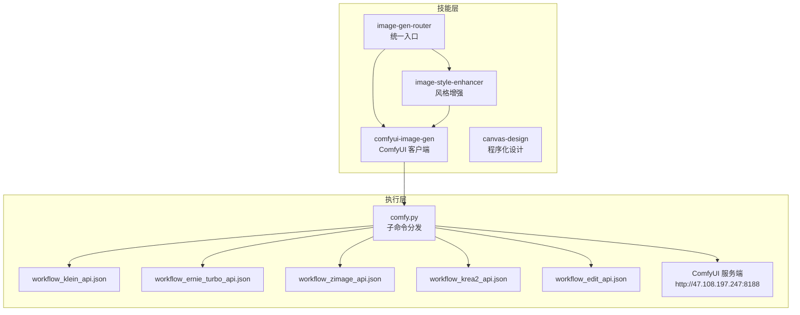
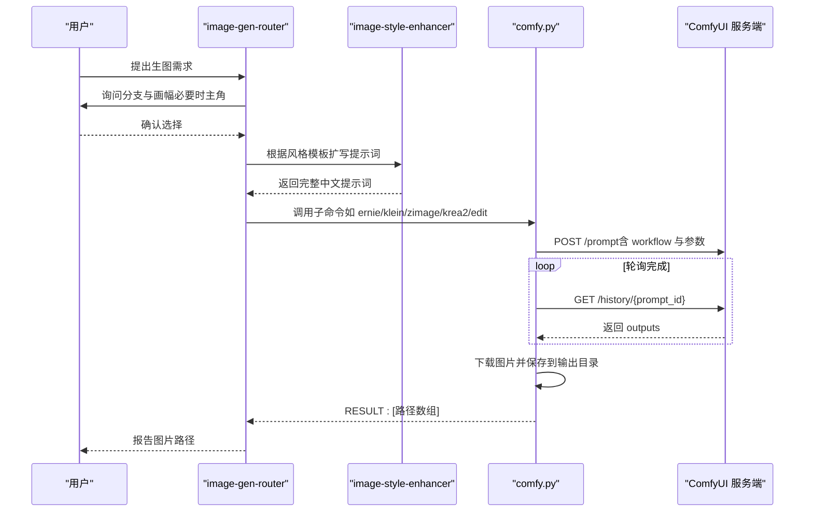
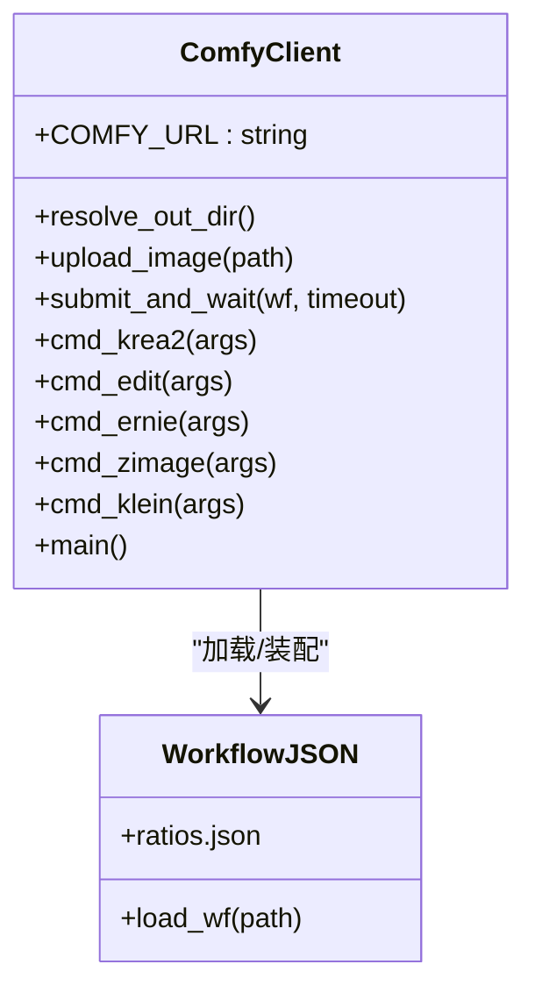
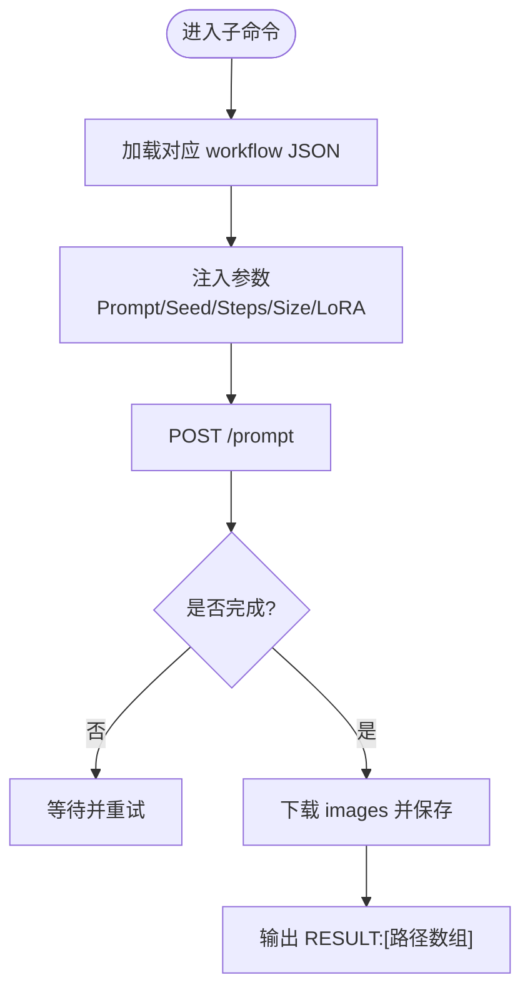
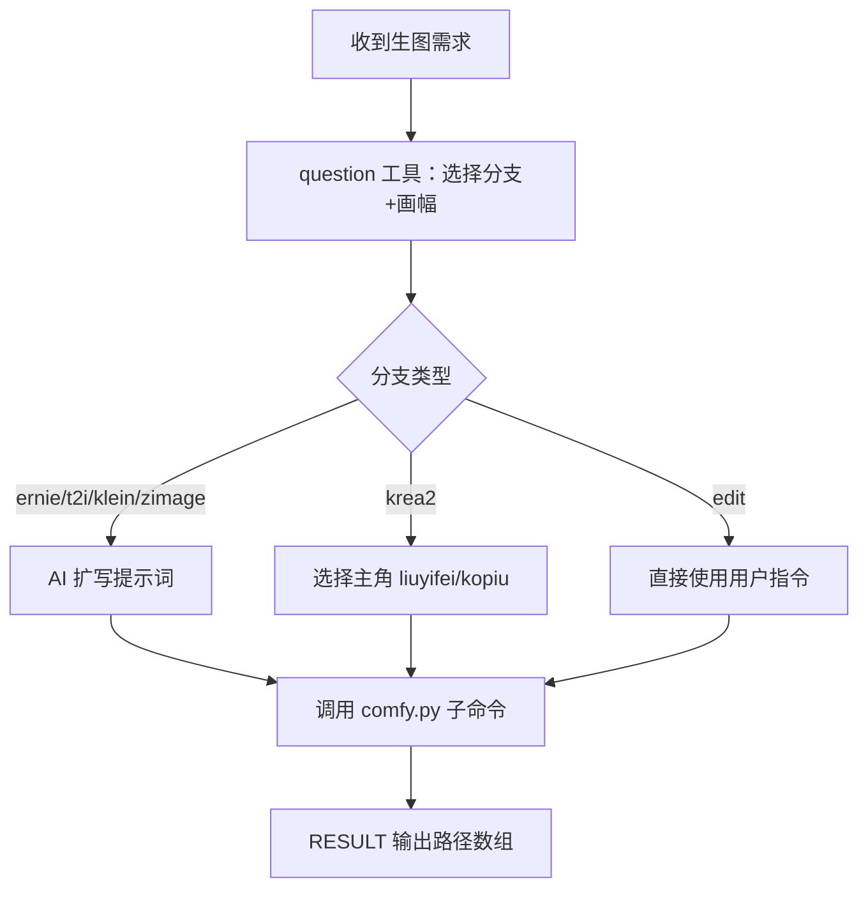
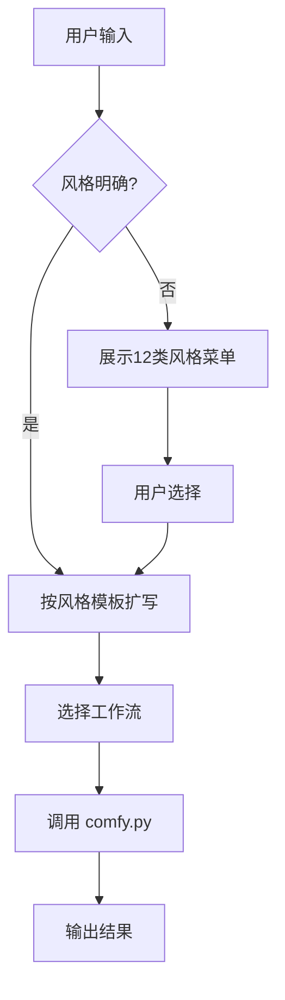
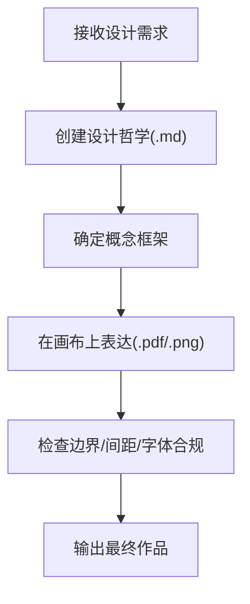
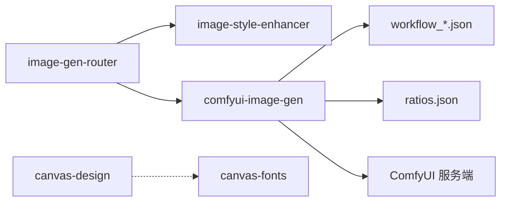

# 图像处理技能

<cite>
**本文引用的文件**
- [skills/comfyui-image-gen/SKILL.md](file://skills/comfyui-image-gen/SKILL.md)
- [skills/image-gen-router/SKILL.md](file://skills/image-gen-router/SKILL.md)
- [skills/image-style-enhancer/SKILL.md](file://skills/image-style-enhancer/SKILL.md)
- [skills/canvas-design/SKILL.md](file://skills/canvas-design/SKILL.md)
- [skills/comfyui-image-gen/comfy.py](file://skills/comfyui-image-gen/comfy.py)
- [skills/comfyui-image-gen/workflow_api.json](file://skills/comfyui-image-gen/workflow_api.json)
- [skills/comfyui-image-gen/workflow_edit_api.json](file://skills/comfyui-image-gen/workflow_edit_api.json)
- [skills/comfyui-image-gen/workflow_ernie_turbo_api.json](file://skills/comfyui-image-gen/workflow_ernie_turbo_api.json)
- [skills/comfyui-image-gen/workflow_klein_api.json](file://skills/comfyui-image-gen/workflow_klein_api.json)
- [skills/comfyui-image-gen/workflow_zimage_api.json](file://skills/comfyui-image-gen/workflow_zimage_api.json)
- [skills/comfyui-image-gen/ratios.json](file://skills/comfyui-image-gen/ratios.json)
- [README.md](file://README.md)
- [AGENTS.md](file://AGENTS.md)
</cite>

## 目录
1. [简介](#简介)
2. [项目结构](#项目结构)
3. [核心组件](#核心组件)
4. [架构总览](#架构总览)
5. [详细组件分析](#详细组件分析)
6. [依赖关系分析](#依赖关系分析)
7. [性能与并发优化](#性能与并发优化)
8. [故障排查指南](#故障排查指南)
9. [结论](#结论)
10. [附录：使用示例与扩展指南](#附录使用示例与扩展指南)

## 简介
本文件为“图像处理技能组”的权威文档，覆盖以下能力：
- ComfyUI 图像生成技能：工作流配置、模型管理、API 集成与批量处理。
- 图像风格增强技能：处理流程、效果参数、质量控制与提示词工程。
- 图像生成路由器：智能选择机制、负载均衡策略与工作流编排。
- 画布设计技能：字体管理、模板系统与设计工具（非 AI 生图，代码绘制）。
- 工作流编排、批量处理、性能优化与故障恢复机制。
- 丰富的使用示例与自定义扩展指南。

## 项目结构
图像处理相关技能位于 skills 目录下，核心包括：
- comfyui-image-gen：ComfyUI 远程调用与多工作流管线（klein/ernie/zimage/krea2/edit）。
- image-gen-router：统一入口，强制路由选择与提示词扩写。
- image-style-enhancer：风格菜单与提示词增强模板库。
- canvas-design：程序化视觉设计（PDF/PNG），内置字体资源与创作规范。

**图表来源**
- [skills/image-gen-router/SKILL.md](file://skills/image-gen-router/SKILL.md)
- [skills/image-style-enhancer/SKILL.md](file://skills/image-style-enhancer/SKILL.md)
- [skills/comfyui-image-gen/comfy.py](file://skills/comfyui-image-gen/comfy.py)
- [skills/comfyui-image-gen/workflow_klein_api.json](file://skills/comfyui-image-gen/workflow_klein_api.json)
- [skills/comfyui-image-gen/workflow_ernie_turbo_api.json](file://skills/comfyui-image-gen/workflow_ernie_turbo_api.json)
- [skills/comfyui-image-gen/workflow_zimage_api.json](file://skills/comfyui-image-gen/workflow_zimage_api.json)
- [skills/comfyui-image-gen/workflow_krea2_api.json](file://skills/comfyui-image-gen/workflow_krea2_api.json)
- [skills/comfyui-image-gen/workflow_edit_api.json](file://skills/comfyui-image-gen/workflow_edit_api.json)

**章节来源**
- [README.md](file://README.md)
- [AGENTS.md](file://AGENTS.md)

## 核心组件
- 图像生成路由器（image-gen-router）
  - 统一入口，强制用户先选分支与画幅，再扩写提示词，最后调用 comfy.py 出图。
  - 支持 t2i（并行 klein + zimage）、ernie、klein、zimage、krea2、edit 等分支。
- 风格增强器（image-style-enhancer）
  - 提供 12 类风格模板与“反AI完美”词库，输出连贯中文提示词，提升真实感与可控性。
- ComfyUI 客户端（comfyui-image-gen）
  - Python CLI 驱动远程 ComfyUI，按子命令加载对应 workflow JSON，提交 prompt 并轮询结果。
  - 支持批量提示词（每行一张图）、种子/步数/尺寸/CFG/sampler 等参数控制。
- 画布设计（canvas-design）
  - 基于代码绘制的海报/艺术图，内置字体目录与排版规范，输出 PDF/PNG。

**章节来源**
- [skills/image-gen-router/SKILL.md](file://skills/image-gen-router/SKILL.md)
- [skills/image-style-enhancer/SKILL.md](file://skills/image-style-enhancer/SKILL.md)
- [skills/comfyui-image-gen/SKILL.md](file://skills/comfyui-image-gen/SKILL.md)
- [skills/canvas-design/SKILL.md](file://skills/canvas-design/SKILL.md)

## 架构总览
整体数据流从“意图识别 → 路由选择 → 提示词增强 → 工作流装配 → 远程执行 → 结果落盘”。

**图表来源**
- [skills/image-gen-router/SKILL.md](file://skills/image-gen-router/SKILL.md)
- [skills/image-style-enhancer/SKILL.md](file://skills/image-style-enhancer/SKILL.md)
- [skills/comfyui-image-gen/comfy.py](file://skills/comfyui-image-gen/comfy.py)

## 详细组件分析

### ComfyUI 客户端（comfy.py）
- 功能要点
  - 通过环境变量 COMFY_URL 指定服务端地址；默认 http://47.108.197.247:8188。
  - 输出目录优先级：CLI --output > 环境变量 COMFY_OUT > 默认目录。
  - 子命令：krea2、edit、ernie、zimage、klein，分别加载对应 workflow JSON 并注入参数。
  - 批量提示词：对多行文本逐行提交，每张图独立生成。
  - 结果收集：轮询 /history/{prompt_id}，下载 images 并保存至输出目录，打印 RESULT 数组。
- 关键实现
  - HTTP 封装：POST/GET 请求与错误处理。
  - 图片上传：multipart/form-data 上传本地图片用于 edit。
  - 工作流装配：动态修改节点输入（如 Prompt、Seed、Steps、Size、LoRA 开关）。
  - LoRA 控制：krea2 双主角 strength 切换；zimage 同事 LoRA 或自定义人物 LoRA。
- 复杂度与性能
  - 串行提交与等待，单任务超时保护；批量逐行提交避免内存峰值。
  - 不频繁释放 VRAM，减少重复加载开销。

**图表来源**
- [skills/comfyui-image-gen/comfy.py](file://skills/comfyui-image-gen/comfy.py)
- [skills/comfyui-image-gen/ratios.json](file://skills/comfyui-image-gen/ratios.json)

**章节来源**
- [skills/comfyui-image-gen/comfy.py](file://skills/comfyui-image-gen/comfy.py)

#### 工作流装配与参数注入
- 各子命令将用户参数写入 workflow 节点：
  - ernie：设置 Prompt（支持多行）、Seed、Steps、Size。
  - klein：设置 Prompt、Negative、Size、Seed、Steps、CFG、Sampler。
  - zimage：设置 Prompt、Seed、Steps、LoRA（同事/自定义）、Size。
  - krea2：设置 Prompt、Seed、Steps、Size、主角 LoRA 强度与触发词。
  - edit：上传图片、设置指令、Seed、Steps。
- 比例映射：ratios.json 提供常见比例的 Dapao 预设字符串。

**图表来源**
- [skills/comfyui-image-gen/comfy.py](file://skills/comfyui-image-gen/comfy.py)
- [skills/comfyui-image-gen/workflow_ernie_turbo_api.json](file://skills/comfyui-image-gen/workflow_ernie_turbo_api.json)
- [skills/comfyui-image-gen/workflow_klein_api.json](file://skills/comfyui-image-gen/workflow_klein_api.json)
- [skills/comfyui-image-gen/workflow_zimage_api.json](file://skills/comfyui-image-gen/workflow_zimage_api.json)
- [skills/comfyui-image-gen/workflow_krea2_api.json](file://skills/comfyui-image-gen/workflow_krea2_api.json)
- [skills/comfyui-image-gen/workflow_edit_api.json](file://skills/comfyui-image-gen/workflow_edit_api.json)

**章节来源**
- [skills/comfyui-image-gen/comfy.py](file://skills/comfyui-image-gen/comfy.py)

### 图像生成路由器（image-gen-router）
- 职责
  - 强制用户选择分支与画幅（必要时主角），禁止跳过路由直接执行。
  - 根据分支特性推荐最佳选项（人物写真→zimage，文字清晰→ernie，场景→klein，快速对比→t2i，改图→edit）。
  - 调用 comfy.py 子命令，确保输出路径正确打印。
- 路由规则
  - t2i：并行 klein + zimage 各一次，分别用各自 size。
  - ernie：支持批量提示词，适合带文字的海报。
  - klein：自由尺寸，写实感强。
  - zimage：艺术质量高，默认 9 步，可挂同事 LoRA。
  - krea2：艺术/anime，双主角 LoRA，自动注入 trigger。
  - edit：基于指令编辑图片。

**图表来源**
- [skills/image-gen-router/SKILL.md](file://skills/image-gen-router/SKILL.md)
- [skills/comfyui-image-gen/comfy.py](file://skills/comfyui-image-gen/comfy.py)

**章节来源**
- [skills/image-gen-router/SKILL.md](file://skills/image-gen-router/SKILL.md)

### 图像风格增强器（image-style-enhancer）
- 流程
  - 判断风格明确性：若包含关键词则跳过选单，直接扩写。
  - 不明确时展示 12 类风格菜单供选择。
  - 收集用户需求后，按风格模板扩写为连贯中文提示词。
  - 让用户选择工作流（klein/ernie/zimage/krea2/t2i/edit）。
- 模板与质量控制
  - 真实感摄影模板强调“不完美要素”与“去塑料感三件套”。
  - 九步描述法适用于高精度/复杂场景。
  - “反AI完美”必加词库破坏 AI 默认完美感，提升真实度。

**图表来源**
- [skills/image-style-enhancer/SKILL.md](file://skills/image-style-enhancer/SKILL.md)

**章节来源**
- [skills/image-style-enhancer/SKILL.md](file://skills/image-style-enhancer/SKILL.md)

### 画布设计（canvas-design）
- 职责
  - 程序化视觉设计（非 AI 生图），输出 .png/.pdf。
  - 设计哲学先行，再以代码表达视觉理念。
  - 字体管理：内置 canvas-fonts 目录，中文仅允许 MiSans 系列。
- 创作流程
  - 第一步：创建设计哲学（.md）。
  - 第二步：在画布上表达（.pdf/.png）。
  - 强调极简文字、空间表达、专家级工艺。

**图表来源**
- [skills/canvas-design/SKILL.md](file://skills/canvas-design/SKILL.md)

**章节来源**
- [skills/canvas-design/SKILL.md](file://skills/canvas-design/SKILL.md)

## 依赖关系分析
- 组件耦合
  - image-gen-router 依赖 image-style-enhancer 进行提示词增强，再调用 comfyui-image-gen。
  - comfyui-image-gen 依赖多个 workflow JSON 与 ratios.json，通过 HTTP 与 ComfyUI 服务端交互。
  - canvas-design 独立于 AI 生图链路，专注代码绘制与字体管理。
- 外部依赖
  - ComfyUI 服务端地址可通过 COMFY_URL 覆盖。
  - Python 解释器与标准库（urllib/json/os/sys/time）。

**图表来源**
- [skills/image-gen-router/SKILL.md](file://skills/image-gen-router/SKILL.md)
- [skills/image-style-enhancer/SKILL.md](file://skills/image-style-enhancer/SKILL.md)
- [skills/comfyui-image-gen/comfy.py](file://skills/comfyui-image-gen/comfy.py)
- [skills/comfyui-image-gen/ratios.json](file://skills/comfyui-image-gen/ratios.json)

**章节来源**
- [skills/comfyui-image-gen/comfy.py](file://skills/comfyui-image-gen/comfy.py)

## 性能与并发优化
- 批量处理
  - 支持多行提示词，逐行提交，避免单次过大负载。
  - 每张图独立种子（可选），保证多样性。
- 内存与 VRAM
  - 不在每张生图后调用 /free，减少模型重载开销。
  - 输出目录集中管理，便于后续清理。
- 超时与重试
  - submit_and_wait 设置超时，防止阻塞。
  - HTTP 错误捕获并退出，便于上层重试。
- 并发建议
  - 可在上层对 t2i（klein+zimage）并行调度，但需注意服务端队列压力。
  - 合理设置 steps 与 cfg，平衡质量与速度。

[本节为通用指导，无需特定文件引用]

## 故障排查指南
- 常见问题
  - HTTP 400：workflow API 节点字段过期，需重新探测 /object_info/<class_type>。
  - 连接失败：检查 COMFY_URL 是否正确，服务端是否运行。
  - 输出为空：检查 workflow 中 SaveImage 节点与输出目录权限。
  - 中文乱码：确保 PYTHONIOENCODING=utf-8。
- 调试步骤
  - 查看 comfy.py 日志输出（[comfy] 前缀）。
  - 验证 workflow JSON 节点 ID 与输入键名。
  - 手动测试 /prompt 与 /history 接口。

**章节来源**
- [skills/image-gen-router/SKILL.md](file://skills/image-gen-router/SKILL.md)
- [skills/comfyui-image-gen/comfy.py](file://skills/comfyui-image-gen/comfy.py)

## 结论
本技能组以“路由 + 增强 + 客户端”三层架构，实现了从意图到图像的端到端流水线。通过严格的路由选择、丰富的风格模板与健壮的 ComfyUI 客户端，兼顾了易用性、质量与性能。画布设计作为补充，满足非 AI 的程序化设计需求。

[本节为总结，无需特定文件引用]

## 附录：使用示例与扩展指南

### 使用示例
- 人物写真（zimage）
  - 路由选择 zimage，竖屏 1080x1920，steps=9，可挂同事 LoRA。
- 海报带文字（ernie）
  - 路由选择 ernie，横屏 1920x1080，支持批量提示词。
- 艺术动漫（krea2）
  - 路由选择 krea2，选择主角 liuyifei 或 kopiu，自动注入 trigger。
- 改图编辑（edit）
  - 上传本地图片，输入编辑指令，支持 seed/steps。

**章节来源**
- [skills/image-gen-router/SKILL.md](file://skills/image-gen-router/SKILL.md)
- [skills/comfyui-image-gen/comfy.py](file://skills/comfyui-image-gen/comfy.py)

### 自定义扩展指南
- 新增工作流
  - 在 comfyui-image-gen 目录添加新的 workflow_xxx_api.json。
  - 在 comfy.py 中添加 cmd_xxx 函数与 argparse 子命令。
  - 更新 image-gen-router 路由说明。
- 新增风格模板
  - 在 image-style-enhancer 中添加新风格模板与关键词。
  - 更新风格菜单与扩写逻辑。
- 字体扩展
  - 在 canvas-design/canvas-fonts 中添加新字体文件。
  - 遵循中文仅 MiSans 系列的规范。

**章节来源**
- [skills/comfyui-image-gen/comfy.py](file://skills/comfyui-image-gen/comfy.py)
- [skills/image-style-enhancer/SKILL.md](file://skills/image-style-enhancer/SKILL.md)
- [skills/canvas-design/SKILL.md](file://skills/canvas-design/SKILL.md)