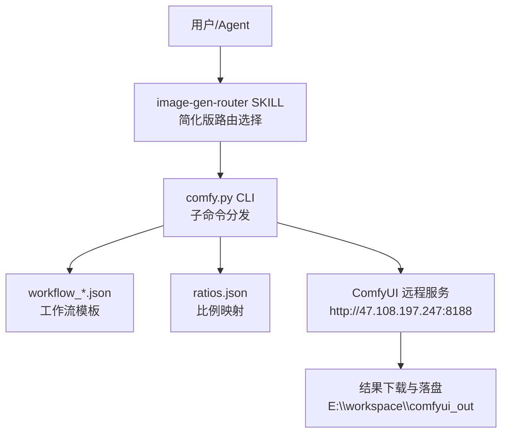
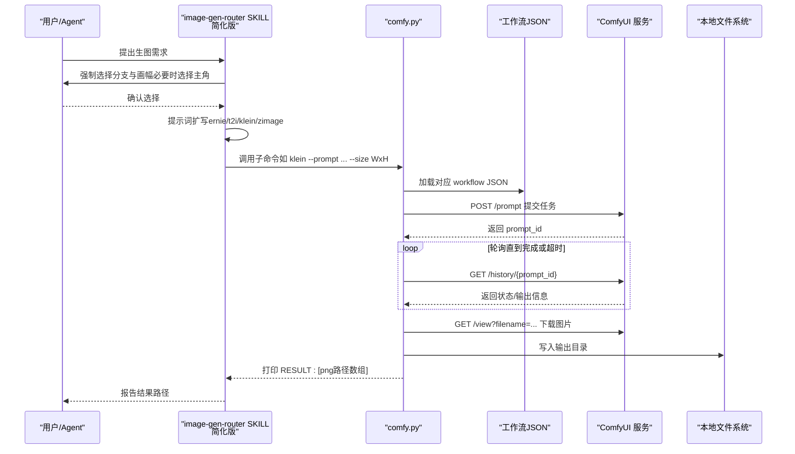
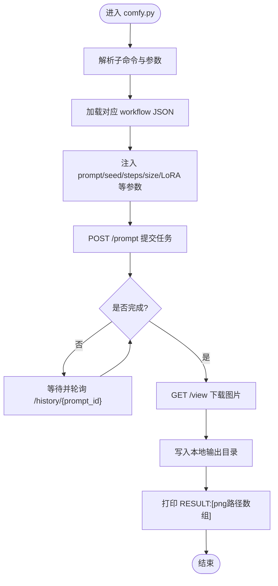
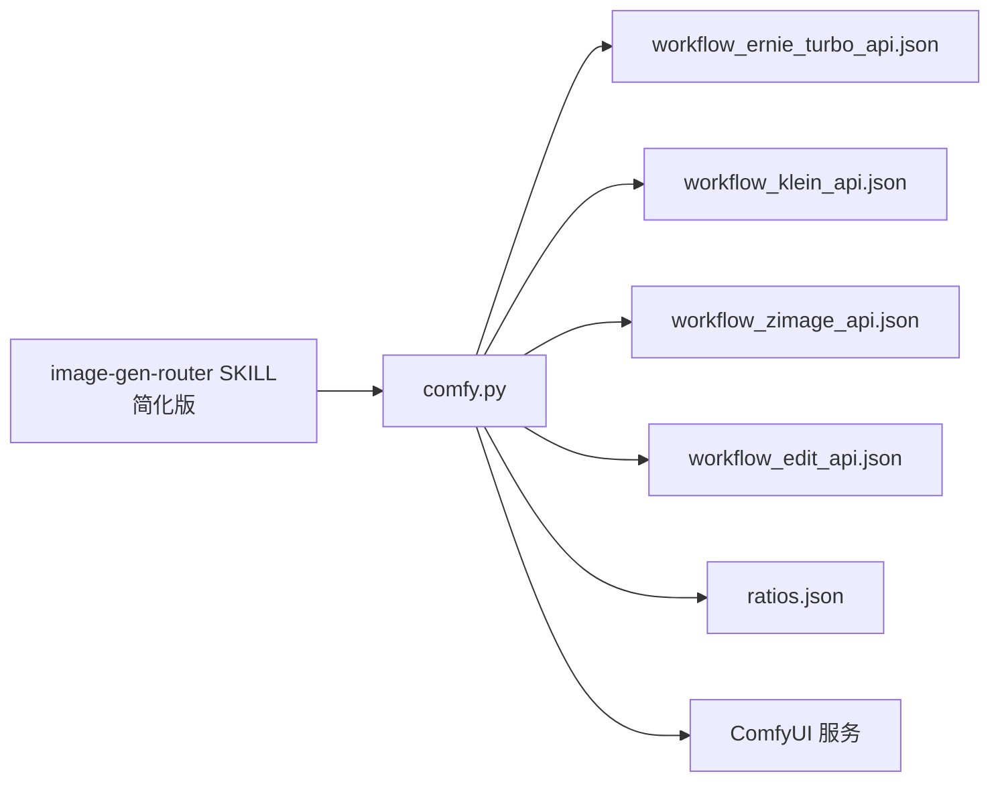

# 图像生成路由器

<cite>
**本文引用的文件**   
- [skills/image-gen-router/SKILL.md](file://skills/image-gen-router/SKILL.md)
- [data/agent/managed-skills/image-gen-router/SKILL.md](file://data/agent/managed-skills/image-gen-router/SKILL.md)
- [skills/comfyui-image-gen/SKILL.md](file://skills/comfyui-image-gen/SKILL.md)
- [skills/comfyui-image-gen/comfy.py](file://skills/comfyui-image-gen/comfy.py)
- [skills/comfyui-image-gen/ratios.json](file://skills/comfyui-image-gen/ratios.json)
- [skills/comfyui-image-gen/workflow_api.json](file://skills/comfyui-image-gen/workflow_api.json)
- [skills/comfyui-image-gen/workflow_ernie_turbo_api.json](file://skills/comfyui-image-gen/workflow_ernie_turbo_api.json)
- [skills/comfyui-image-gen/workflow_klein_api.json](file://skills/comfyui-image-gen/workflow_klein_api.json)
</cite>

## 更新摘要
**所做更改**   
- 更新了路由选择流程的简化说明
- 调整了核心组件描述以反映简化的架构
- 优化了架构图表以匹配新的实现
- 更新了故障排查指南以适应简化后的系统

## 目录
1. [简介](#简介)
2. [项目结构](#项目结构)
3. [核心组件](#核心组件)
4. [架构总览](#架构总览)
5. [详细组件分析](#详细组件分析)
6. [依赖关系分析](#依赖关系分析)
7. [性能与监控](#性能与监控)
8. [故障排查指南](#故障排查指南)
9. [结论](#结论)
10. [附录：配置示例与扩展指南](#附录：配置示例与扩展指南)

## 简介
本文件面向"图像生成路由器"的完整技术文档，聚焦以下目标：
- 智能路由算法、用户意图识别与任务分类机制
- 负载均衡策略、服务健康检查与故障转移逻辑
- 路由规则配置、优先级设置与动态调整机制
- 请求分析、参数提取与目标服务选择过程
- 路由配置示例、监控指标与性能调优指南
- 扩展新服务类型、自定义路由规则与调试方法

该路由器以 skills/image-gen-router 为统一入口，经过重大简化后保持核心功能，强制"选路由 → 扩写提示词 → 调用底层 comfy.py 出图"的三步流程；底层通过 skills/comfyui-image-gen/comfy.py 将不同分支（t2i/ernie/klein/zimage/edit）路由到 ComfyUI 工作流，完成文生图或图编辑。

**重要更新**：图像生成路由器技能已从43行大幅简化至21行，在保持核心功能的同时显著降低了复杂性。

## 项目结构
- skills/image-gen-router/SKILL.md：定义"生图路由助手"的交互与强制流程（选分支、画幅、主角等），并给出 Tiffa 环境下的直接调用方式。**已简化至21行，保持核心路由逻辑**。
- data/agent/managed-skills/image-gen-router/SKILL.md：Agent 侧管理的同一 skill 版本，补充 wrapper（gen）强制规则与调用格式。
- skills/comfyui-image-gen/SKILL.md：ComfyUI 技能说明，包含服务端地址、输出目录、路由规则摘要。
- skills/comfyui-image-gen/comfy.py：命令行入口与子命令实现（krea2/ernie/klein/zimage/edit），负责加载对应 workflow JSON、组装参数、提交任务、轮询结果并落盘。
- ratios.json：宽高比映射表，支持短码到 Dapao 节点预设字符串的解析。
- workflow_*.json：各分支对应的 ComfyUI 工作流定义（节点、输入默认值、保存前缀等）。

**图表来源**
- [skills/image-gen-router/SKILL.md](file://skills/image-gen-router/SKILL.md)
- [data/agent/managed-skills/image-gen-router/SKILL.md](file://data/agent/managed-skills/image-gen-router/SKILL.md)
- [skills/comfyui-image-gen/SKILL.md](file://skills/comfyui-image-gen/SKILL.md)
- [skills/comfyui-image-gen/comfy.py](file://skills/comfyui-image-gen/comfy.py)
- [skills/comfyui-image-gen/ratios.json](file://skills/comfyui-image-gen/ratios.json)
- [skills/comfyui-image-gen/workflow_api.json](file://skills/comfyui-image-gen/workflow_api.json)

**章节来源**
- [skills/image-gen-router/SKILL.md](file://skills/image-gen-router/SKILL.md)
- [data/agent/managed-skills/image-gen-router/SKILL.md](file://data/agent/managed-skills/image-gen-router/SKILL.md)
- [skills/comfyui-image-gen/SKILL.md](file://skills/comfyui-image-gen/SKILL.md)

## 核心组件
- **简化版路由入口（image-gen-router SKILL）**
  - 强制用户先选择分支（zimage/ernie/klein/t2i/krea2/edit）与画幅；若选择 krea2，还需选择主角（liuyifei/kopiu）。
  - 对 ernie/t2i/klein/zimage 分支进行提示词扩写（由当前 AI agent 自身完成），edit 分支直接使用用户指令。
  - 在 Tiffa 环境下直接调用 comfy.py 子命令；在 OpenCode 环境可通过 gen wrapper 强制安全规则。
  - **已简化至21行，专注于核心路由逻辑**。
- **执行器（comfy.py）**
  - 提供子命令：krea2、ernie、klein、zimage、edit。
  - 根据子命令加载对应 workflow JSON，注入 prompt、seed、steps、size、LoRA 等参数。
  - 通过 HTTP POST /prompt 提交任务，轮询 /history/{prompt_id} 获取结果，下载图片并保存到输出目录。
  - 支持批量提示词（多行文本逐行提交），每张图独立生成。
- **工作流与比例映射**
  - workflow_*.json 定义各分支的节点连接与默认参数。
  - ratios.json 提供常用宽高比的映射，便于上层以短码指定尺寸。

**章节来源**
- [skills/image-gen-router/SKILL.md](file://skills/image-gen-router/SKILL.md)
- [data/agent/managed-skills/image-gen-router/SKILL.md](file://data/agent/managed-skills/image-gen-router/SKILL.md)
- [skills/comfyui-image-gen/comfy.py](file://skills/comfyui-image-gen/comfy.py)
- [skills/comfyui-image-gen/ratios.json](file://skills/comfyui-image-gen/ratios.json)
- [skills/comfyui-image-gen/workflow_api.json](file://skills/comfyui-image-gen/workflow_api.json)
- [skills/comfyui-image-gen/workflow_ernie_turbo_api.json](file://skills/comfyui-image-gen/workflow_ernie_turbo_api.json)
- [skills/comfyui-image-gen/workflow_klein_api.json](file://skills/comfyui-image-gen/workflow_klein_api.json)

## 架构总览
下图展示从用户到 ComfyUI 服务的端到端调用链路与关键决策点。

**图表来源**
- [skills/image-gen-router/SKILL.md](file://skills/image-gen-router/SKILL.md)
- [data/agent/managed-skills/image-gen-router/SKILL.md](file://data/agent/managed-skills/image-gen-router/SKILL.md)
- [skills/comfyui-image-gen/comfy.py](file://skills/comfyui-image-gen/comfy.py)

## 详细组件分析

### 路由选择与意图识别
- **分支定位与推荐规则**
  - zimage：人物写真首选，LoRA 生态丰富。
  - ernie：真实感摄影 + 文字渲染双强。
  - klein：全能但人物偏欧美气质，适合场景/静物/风景/自由尺寸。
  - t2i：双分支并行融合（klein + zimage 各一次）。
  - krea2：艺术/anime，双主角 LoRA（liuyifei/kopiu）。
  - edit：改图编辑，保持人物一致。
- **画幅选择**
  - 横屏 16:9、竖屏 9:16、方形 1:1、自由尺寸（WxH）。
- **主角选择（仅 krea2）**
  - liuyifei（默认）、kopiu（需用户明确点名）。
- **提示词扩写**
  - ernie/t2i/klein/zimage 分支由当前 AI agent 自行扩写；edit 分支无需扩写。

**章节来源**
- [skills/image-gen-router/SKILL.md](file://skills/image-gen-router/SKILL.md)
- [data/agent/managed-skills/image-gen-router/SKILL.md](file://data/agent/managed-skills/image-gen-router/SKILL.md)

### 执行器 comfy.py 的子命令与参数
- **krea2**
  - 支持 prompt、--prompt-file、--seed、--steps、--size、--protagonist、--timeout、--output。
  - 自动注入 trigger 词，按主角切换 LoRA strength。
  - 支持多行 prompt 逐行提交，每张图独立生成。
- **ernie**
  - 支持 prompt、--seed、--steps、--size、--timeout、--output。
  - 内置 CR Prompt List 节点支持批量提示词。
- **klein**
  - 支持 prompt、--negative、--size、--seed、--steps、--cfg、--sampler、--timeout、--output。
  - 支持批量提示词。
- **zimage**
  - 支持 prompt、--seed、--steps、--size、--with-colleague、--lora-person、--lora-strength、--timeout、--output。
  - 默认不挂人物 LoRA，可插入同事 LoRA 或自定义人物 LoRA。
- **edit**
  - 上传本地图片后，基于指令编辑，支持 seed/steps/timeout/output。

**章节来源**
- [skills/comfyui-image-gen/comfy.py](file://skills/comfyui-image-gen/comfy.py)

### 工作流与比例映射
- **workflow_*.json**
  - 定义各分支的节点类型、输入默认值、保存前缀等。
  - 例如：ERNIE 使用 ministral-3-3b CLIP 与 baidu\ernie-image-turbo UNet；KLEIN 使用 qwen_3_8b_fp8mixed CLIP 与 FLUX Klein UNet；ZIMAGE 使用 Z-image VAE 与特定 UNet。
- **ratios.json**
  - 提供常见宽高比映射，便于上层以短码指定尺寸。

**章节来源**
- [skills/comfyui-image-gen/workflow_api.json](file://skills/comfyui-image-gen/workflow_api.json)
- [skills/comfyui-image-gen/workflow_ernie_turbo_api.json](file://skills/comfyui-image-gen/workflow_ernie_turbo_api.json)
- [skills/comfyui-image-gen/workflow_klein_api.json](file://skills/comfyui-image-gen/workflow_klein_api.json)
- [skills/comfyui-image-gen/ratios.json](file://skills/comfyui-image-gen/ratios.json)

### 请求处理与参数提取流程

**图表来源**
- [skills/comfyui-image-gen/comfy.py](file://skills/comfyui-image-gen/comfy.py)

## 依赖关系分析
- image-gen-router SKILL 依赖 comfy.py 作为执行器。
- comfy.py 依赖：
  - 环境变量 COMFY_URL（默认 http://47.108.197.247:8188）
  - 输出目录 COMFY_OUT 或 --output（默认 E:\workspace\comfyui_out）
  - 各分支的 workflow_*.json 与 ratios.json
  - 网络库 urllib 访问 ComfyUI 服务
- 工作流 JSON 依赖具体模型权重（UNet/VAE/CLIP/Lora）与服务端节点能力。

**图表来源**
- [skills/image-gen-router/SKILL.md](file://skills/image-gen-router/SKILL.md)
- [skills/comfyui-image-gen/comfy.py](file://skills/comfyui-image-gen/comfy.py)
- [skills/comfyui-image-gen/workflow_api.json](file://skills/comfyui-image-gen/workflow_api.json)
- [skills/comfyui-image-gen/workflow_ernie_turbo_api.json](file://skills/comfyui-image-gen/workflow_ernie_turbo_api.json)
- [skills/comfyui-image-gen/workflow_klein_api.json](file://skills/comfyui-image-gen/workflow_klein_api.json)
- [skills/comfyui-image-gen/ratios.json](file://skills/comfyui-image-gen/ratios.json)

**章节来源**
- [skills/comfyui-image-gen/comfy.py](file://skills/comfyui-image-gen/comfy.py)

## 性能与监控
- **性能特征**
  - 单张图约 10-30 秒，脚本阻塞直至完成。
  - 批量提示词逐行提交，每行一张图，避免一次性大负载。
  - VRAM 释放由 llm-manager 统一管理，不在每张生图后频繁调用 /free，减少模型重载开销。
- **监控指标建议**
  - 请求耗时：提交到完成的总时长、轮询间隔、单次下载耗时。
  - 成功率：HTTP 状态码分布（重点关注 400 错误，表示节点字段过期）。
  - 资源占用：GPU 显存峰值、队列长度、并发度。
  - 输出质量：失败率、重试次数、平均步数与 CFG 影响。
- **调优建议**
  - 合理设置 steps/cfg/sampler，平衡速度与质量。
  - 使用合适的 size 与比例映射，避免过大分辨率导致内存压力。
  - 批量提示词时控制行数，避免单次提交过多。
  - 利用 --timeout 控制最长等待时间，防止长时间阻塞。

**章节来源**
- [skills/image-gen-router/SKILL.md](file://skills/image-gen-router/SKILL.md)
- [skills/comfyui-image-gen/comfy.py](file://skills/comfyui-image-gen/comfy.py)

## 故障排查指南
- **HTTP 400 错误**
  - 原因：workflow API 节点字段过期。
  - 解决：重新探测 /object_info/<class_type> 更新节点字段。
- **输出为空**
  - 检查 outputs 键是否存在，确认节点 ID 与文件名是否正确。
- **超时**
  - 增加 --timeout，检查 ComfyUI 服务状态与队列长度。
- **路径问题**
  - 确认 COMFY_URL 非 localhost（Tiffa 环境默认远端服务）。
  - 确认输出目录存在且可写。
- **简化版路由问题**
  - 确保遵循强制路由选择流程，不要跳过选择步骤。
  - 验证分支名称与子命令对应关系正确。

**章节来源**
- [skills/image-gen-router/SKILL.md](file://skills/image-gen-router/SKILL.md)
- [skills/comfyui-image-gen/comfy.py](file://skills/comfyui-image-gen/comfy.py)

## 结论
图像生成路由器通过"强制路由选择 → 提示词扩写 → 调用 comfy.py 子命令"的流程，将用户意图准确映射到合适的 ComfyUI 工作流。经过重大简化后，路由技能从43行减少到21行，在保持核心功能的同时显著降低了复杂性。comfy.py 负责参数注入、任务提交、结果轮询与落盘，配合 ratios.json 与工作流 JSON 实现灵活配置。当前实现未内置负载均衡与健康检查，但可通过外部编排（如进程池、服务发现）扩展。建议引入监控与告警，持续优化步骤、CFG、采样器等参数，提升吞吐与稳定性。

## 附录：配置示例与扩展指南

### 路由配置示例
- **Tiffa 环境直接调用 comfy.py**
  - 示例：klein --prompt "..." --size 1920x1080
  - 注意：禁止改为 localhost，必须使用远端 COMFY_URL。
- **OpenCode 环境使用 gen wrapper**
  - 示例：gen --branch klein --prompt "..." --size 1920x1080
  - 强制规则：缺 --branch 拒绝；zimage 的 steps < 8 被拒绝；--with-colleague 必须同时传 --confirm-colleague。

**章节来源**
- [skills/image-gen-router/SKILL.md](file://skills/image-gen-router/SKILL.md)
- [data/agent/managed-skills/image-gen-router/SKILL.md](file://data/agent/managed-skills/image-gen-router/SKILL.md)

### 扩展新服务类型
- **新增子命令**
  - 在 comfy.py 中新增 subparser 与 cmd_xxx(args) 函数。
  - 加载对应 workflow JSON，注入参数，调用 submit_and_wait。
- **新增工作流**
  - 创建 workflow_xxx_api.json，定义节点与默认输入。
  - 在 comfy.py 中引用该文件路径。
- **新增比例映射**
  - 在 ratios.json 中添加短码到预设字符串的映射。

**章节来源**
- [skills/comfyui-image-gen/comfy.py](file://skills/comfyui-image-gen/comfy.py)
- [skills/comfyui-image-gen/ratios.json](file://skills/comfyui-image-gen/ratios.json)

### 自定义路由规则与优先级
- **在 image-gen-router SKILL 中调整分支推荐顺序与条件**
- **在 comfy.py 中增加参数校验与默认值覆盖逻辑**
- **通过环境变量 COMFY_URL 与 COMFY_OUT 动态切换服务与输出目录**

**章节来源**
- [skills/image-gen-router/SKILL.md](file://skills/image-gen-router/SKILL.md)
- [skills/comfyui-image-gen/comfy.py](file://skills/comfyui-image-gen/comfy.py)

### 调试方法
- **启用详细日志**
  - 观察 [comfy] 前缀的输出，包括 prompt_id、保存路径、错误信息。
- **验证工作流**
  - 使用 ComfyUI 的 /object_info 接口核对节点字段。
- **隔离测试**
  - 先用单行 prompt 测试，再扩展到批量提示词。
  - 逐步调整 steps/cfg/sampler，观察效果变化。

**章节来源**
- [skills/comfyui-image-gen/comfy.py](file://skills/comfyui-image-gen/comfy.py)