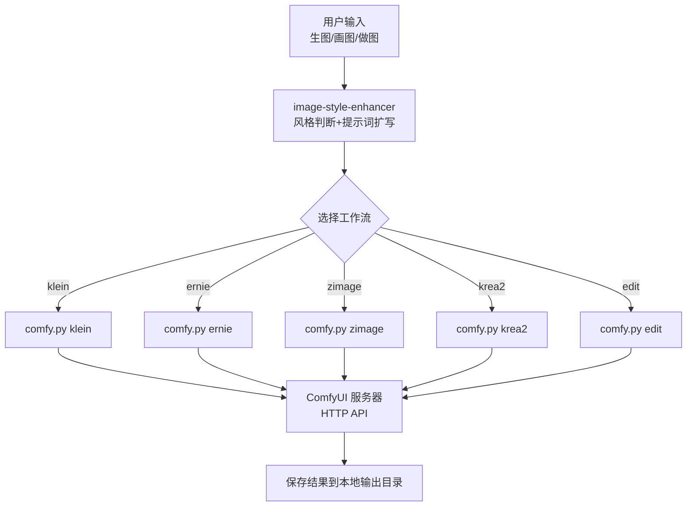
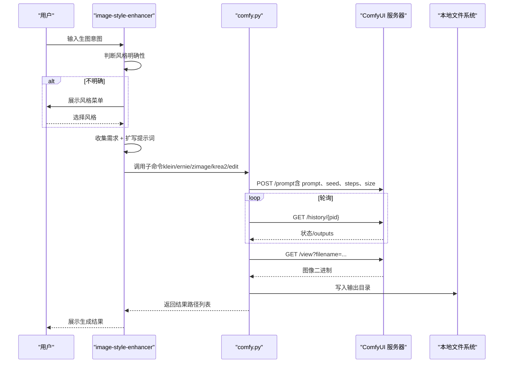
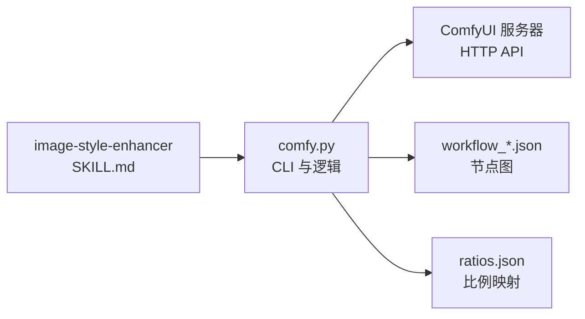

# 图像风格增强

<cite>
**本文引用的文件**
- [SKILL.md](file://skills/image-style-enhancer/SKILL.md)
- [comfy.py](file://skills/comfyui-image-gen/comfy.py)
- [SKILL.md](file://skills/comfyui-image-gen/SKILL.md)
- [workflow_api.json](file://skills/comfyui-image-gen/workflow_api.json)
- [ratios.json](file://skills/comfyui-image-gen/ratios.json)
</cite>

## 目录
1. [简介](#简介)
2. [项目结构](#项目结构)
3. [核心组件](#核心组件)
4. [架构总览](#架构总览)
5. [详细组件分析](#详细组件分析)
6. [依赖关系分析](#依赖关系分析)
7. [性能与质量优化](#性能与质量优化)
8. [故障排查指南](#故障排查指南)
9. [结论](#结论)
10. [附录：工作流与参数速查](#附录工作流与参数速查)

## 简介
本技能“图像风格增强”负责在用户表达生图意图时，先进行风格方向判断与提示词扩写，再将增强后的中文提示词路由到 ComfyUI 的多种工作流（klein、t2i、ernie、zimage、krea2、edit）完成出图。文档覆盖风格模板配置、自定义风格创建、批量处理流程、图像处理流水线、滤镜组合与效果叠加技术、预处理/后处理优化、输出格式支持、对比展示方法、参数调优建议与常见问题解决方案。

## 项目结构
- 风格增强入口位于 skills/image-style-enhancer/SKILL.md，定义了触发条件、五步流程、风格模板库、通用后缀、扩写策略与示例。
- 生成执行层位于 skills/comfyui-image-gen，包含 CLI 工具 comfy.py、各工作流 JSON 定义与比例映射 ratios.json。
- 工作流通过 HTTP API 调用远程 ComfyUI 服务，统一提交 prompt、轮询历史、下载结果并落盘。

图表来源
- [SKILL.md:1-120](file://skills/image-style-enhancer/SKILL.md#L1-L120)
- [comfy.py:326-396](file://skills/comfyui-image-gen/comfy.py#L326-L396)
- [SKILL.md:1-17](file://skills/comfyui-image-gen/SKILL.md#L1-L17)

章节来源
- [SKILL.md:1-120](file://skills/image-style-enhancer/SKILL.md#L1-L120)
- [SKILL.md:1-17](file://skills/comfyui-image-gen/SKILL.md#L1-L17)

## 核心组件
- 风格增强器（image-style-enhancer）
  - 触发规则：识别“生成图片/画图/做图”等意图，强制激活此 skill。
  - 五步流程：判断风格明确性 → 询问风格方向（可选）→ 收集需求 → 按风格模板扩写提示词 → 选择工作流并路由。
  - 风格模板库：真实感摄影、电影感、海报设计、插画手绘、日系二次元、3D渲染、像素艺术、赛博朋克/科幻、中国风、线稿/草图、奇幻/魔幻等，并提供变体与“反AI完美”必加词库。
  - 扩写策略：九步描述法、六步拟真法、手机快照模板、男友视角、CCD复古等；强调“不完美”要素与去塑料感三件套。
  - 路由推荐：根据场景推荐 klein/ernie/zimage/krea2/t2i/edit，但最终由用户决定。

- ComfyUI 执行器（comfyui-image-gen）
  - CLI 子命令：krea2、edit、ernie、zimage、klein，分别对应不同模型与工作流。
  - 工作流加载：从 workflow_*.json 读取节点图，注入 prompt、seed、steps、size、LoRA 等参数。
  - 提交与等待：POST /prompt，轮询 /history/{pid}，下载 /view?filename=... 并保存到输出目录。
  - 输出目录解析：CLI --output > COMFY_OUT 环境变量 > 默认路径。
  - 比例映射：ratios.json 将简写（如 3:4）映射为 Dapao 节点预设字符串。

章节来源
- [SKILL.md:1-120](file://skills/image-style-enhancer/SKILL.md#L1-L120)
- [comfy.py:1-120](file://skills/comfyui-image-gen/comfy.py#L1-L120)
- [comfy.py:326-396](file://skills/comfyui-image-gen/comfy.py#L326-L396)

## 架构总览
整体架构分为三层：
- 交互与编排层：image-style-enhancer 负责风格判断、提示词扩写、工作流选择。
- 执行控制层：comfy.py 作为统一 CLI，解析参数、加载工作流、注入参数、提交任务、轮询结果。
- 推理服务层：远程 ComfyUI 服务器执行具体节点图（采样、解码、保存），返回图像二进制数据。

图表来源
- [SKILL.md:1-120](file://skills/image-style-enhancer/SKILL.md#L1-L120)
- [comfy.py:65-106](file://skills/comfyui-image-gen/comfy.py#L65-L106)
- [comfy.py:326-396](file://skills/comfyui-image-gen/comfy.py#L326-L396)

## 详细组件分析

### 风格增强器（image-style-enhancer）
- 触发与流程
  - 触发关键词：生成图片、画图、做图、出图、封面、海报等。
  - 步骤 1：判断是否包含风格关键词或风格名，若明确则跳过选单。
  - 步骤 2：若不明确，展示 12 类风格菜单（可多选叠加）。
  - 步骤 3：收集主体、场景、氛围、用途等简短需求。
  - 步骤 4：按风格模板扩写为完整中文提示词，加入“不完美”要素与去塑料感三件套。
  - 步骤 5：让用户选择工作流（klein/ernie/zimage/krea2/edit），附带推荐但尊重用户选择。

- 风格模板库要点
  - 真实感摄影：强调“拍废片”思维、具体设备型号、光学瑕疵、材质细节、环境交互、光影氛围。
  - 电影感：镜头语言、色调沉浸、叙事感、颗粒质感、大师级构图。
  - 海报设计：视觉重心、排版布局、主色调、文字占位、商业印刷品质。
  - 插画手绘：笔触温度、材质纹理、留白透气、出版级品质。
  - 日系二次元：赛璐璐上色、干净线条、明亮色调、动画/游戏原画品质。
  - 3D渲染：PBR材质、全局光照、引擎质感、体积阴影、广告级水准。
  - 像素艺术：低分辨率高细节、硬边缘、CRT扫描线质感。
  - 赛博朋克/科幻：霓虹灯光、雨夜烟雾、反光表面、层次丰富。
  - 中国风：水墨写意/工笔重彩、留白意境、宣纸绢本质感。
  - 线稿/草图：钢笔/铅笔/炭笔线条、未上色纯线条表现、创作过程感。
  - 奇幻/魔幻：史诗场景、魔法特效、宏大叙事、概念艺术品质。

- 扩写策略与心法
  - 九步描述法：核心主体→外观细节→动作姿态→场景环境→光影系统→色彩体系→材质纹理→镜头构图→艺术风格。
  - 六步拟真法：媒介设备、主体状态、环境交互、光影氛围、光学瑕疵、特殊技巧。
  - “反AI完美”词库：光学不完美、材质不完美、拍摄不完美、人物不完美、色彩不完美、自拍/男友视角/技术缺陷美学。

章节来源
- [SKILL.md:1-120](file://skills/image-style-enhancer/SKILL.md#L1-L120)
- [SKILL.md:120-386](file://skills/image-style-enhancer/SKILL.md#L120-L386)
- [SKILL.md:388-559](file://skills/image-style-enhancer/SKILL.md#L388-L559)
- [SKILL.md:560-676](file://skills/image-style-enhancer/SKILL.md#L560-L676)

### ComfyUI 执行器（comfy.py）
- 子命令与参数
  - krea2：支持多行提示词批量、主角 LoRA 切换（liuyifei/kopiu）、seed/steps/size。
  - edit：上传图像 + 指令编辑，支持 seed/steps。
  - ernie：强文字渲染，支持多行提示词、seed/steps/size。
  - zimage：Turbo 蒸馏模型，支持内置 colleague LoRA 或自定义 person LoRA、seed/steps/size。
  - klein：Flux2-Klein 单分支，自由宽高、负向提示、CFG/sampler 覆盖、seed/steps。

- 工作流加载与参数注入
  - 从 workflow_*.json 读取节点图，将 prompt、negative、seed、steps、size、LoRA 等注入到对应节点 inputs。
  - 比例映射：ratios.json 将简写映射为 Dapao 节点预设字符串。

- 提交与等待
  - POST /prompt 提交任务，获取 prompt_id。
  - 轮询 /history/{pid}，当 outputs 存在时，遍历 images 字段，GET /view 下载二进制并保存到输出目录。
  - 批量处理：多行提示词逐行提交，每张图独立生成，确保结果一一对应。

- 输出目录与环境
  - 优先级：CLI --output > COMFY_OUT 环境变量 > 默认路径。
  - 文件名前缀：JOB（子命令名）+ node_id + 原始文件名。

章节来源
- [comfy.py:1-120](file://skills/comfyui-image-gen/comfy.py#L1-L120)
- [comfy.py:152-324](file://skills/comfyui-image-gen/comfy.py#L152-L324)
- [comfy.py:326-396](file://skills/comfyui-image-gen/comfy.py#L326-L396)
- [workflow_api.json:1-29](file://skills/comfyui-image-gen/workflow_api.json#L1-L29)
- [ratios.json:1-25](file://skills/comfyui-image-gen/ratios.json#L1-L25)

### 工作流与节点图（workflow_api.json）
- 关键节点类型
  - KSamplerSelect、VAELoader、CFGGuider、EmptyLatentImage、CLIPLoader、LoraLoaderModelOnly、Flux2Scheduler、VAEDecode、Seed (rgthree)、PrimitiveStringMultiline、DapaoImageRatioLimitNode、CLIPTextEncode、RandomNoise、EmptyFlux2LatentImage、KSampler、SaveImage。
- 典型链路
  - Klein：FLUX2 UNET + VAE + Scheduler + Sampler + SaveImage。
  - Z-image：Z-image Turbo UNET + VAE + CLIP(qwen_image) + LoraLoader + KSampler + SaveImage。
  - Ernie/Krea2：基于各自文本编码器与调度器，注入 prompt 与种子。

章节来源
- [workflow_api.json:1-29](file://skills/comfyui-image-gen/workflow_api.json#L1-L29)

## 依赖关系分析
- image-style-enhancer 依赖 comfyui-image-gen 的 CLI 接口进行实际出图。
- comfy.py 依赖 ComfyUI 服务器的 HTTP API（/prompt、/history、/view、/upload/image）。
- 工作流 JSON 定义节点图与参数注入点，ratios.json 提供比例映射。

图表来源
- [SKILL.md:1-120](file://skills/image-style-enhancer/SKILL.md#L1-L120)
- [comfy.py:1-120](file://skills/comfyui-image-gen/comfy.py#L1-L120)
- [workflow_api.json:1-29](file://skills/comfyui-image-gen/workflow_api.json#L1-L29)
- [ratios.json:1-25](file://skills/comfyui-image-gen/ratios.json#L1-L25)

章节来源
- [comfy.py:1-120](file://skills/comfyui-image-gen/comfy.py#L1-L120)
- [workflow_api.json:1-29](file://skills/comfyui-image-gen/workflow_api.json#L1-L29)
- [ratios.json:1-25](file://skills/comfyui-image-gen/ratios.json#L1-L25)

## 性能与质量优化
- 批量处理
  - 多行提示词逐行提交，避免一次性过大负载；每张图独立生成，便于失败重试与结果对照。
  - 避免在每张生图后调用 /free，以免频繁重载模型导致整体变慢；统一释放交由上层管理器。

- 参数调优
  - steps：zimage 建议 1-4（1最快，4质量最高）；klein/ernie 可根据质量需求调整。
  - seed：固定 seed 保证可复现；批量时递增 seed 增加多样性。
  - size：遵循 ratios.json 映射，或使用 WxH 直接指定；注意整除倍数（如 64）与百万像素限制。
  - LoRA：krea2 双主角 LoRA strength 自动切换；zimage 支持内置 colleague LoRA 或自定义 person LoRA。

- 质量控制
  - 提示词中加入“不完美”要素与去塑料感三件套，提升真实感。
  - 使用具体设备型号与镜头参数替代抽象画质词，激活模型对特定成像风格的记忆。
  - 九步描述法与六步拟真法确保细节饱满、无元素矛盾。

- 输出与格式
  - 输出目录可通过 --output 或 COMFY_OUT 环境变量覆盖。
  - 文件名前缀包含 JOB（子命令名）、node_id、原始文件名，便于追踪与区分。

章节来源
- [comfy.py:65-106](file://skills/comfyui-image-gen/comfy.py#L65-L106)
- [comfy.py:152-324](file://skills/comfyui-image-gen/comfy.py#L152-L324)
- [SKILL.md:96-106](file://skills/image-style-enhancer/SKILL.md#L96-L106)
- [ratios.json:1-25](file://skills/comfyui-image-gen/ratios.json#L1-L25)

## 故障排查指南
- 网络超时
  - 现象：轮询 /history 超时。
  - 排查：检查 COMFY_URL 是否正确、网络连通性、服务器负载；适当增大 timeout。

- 无图像输出
  - 现象：finished but no images captured。
  - 排查：确认 workflow 中 SaveImage 节点配置、outputs.images 字段是否存在、/view 接口是否可达。

- 参数错误
  - 现象：--size 格式错误、--protagonist 值非法。
  - 排查：遵循 WxH 格式、choices 范围；参考 CLI 帮助信息。

- 输出目录权限
  - 现象：无法写入输出目录。
  - 排查：检查 --output 或 COMFY_OUT 指向的路径是否存在且可写。

章节来源
- [comfy.py:65-106](file://skills/comfyui-image-gen/comfy.py#L65-L106)
- [comfy.py:152-324](file://skills/comfyui-image-gen/comfy.py#L152-L324)

## 结论
图像风格增强技能通过“风格判断 + 提示词扩写 + 工作流路由”的三段式架构，实现了从用户需求到高质量图像的端到端处理。结合丰富的风格模板库、严谨的扩写心法与 ComfyUI 的多工作流支持，既能满足真实感摄影、电影感、海报设计等多样化需求，也能通过批量处理与参数调优实现高效稳定的生产流程。建议在复杂场景中优先采用九步描述法与六步拟真法，并结合“反AI完美”词库提升真实感；在生产环境中合理设置输出目录、timeout 与 LoRA 参数，以获得最佳质量与性能平衡。

## 附录：工作流与参数速查
- 工作流选择建议
  - 真实感/摄影/随拍 → klein
  - 海报/带文字/封面 → ernie
  - 插画/二次元/概念图 → zimage
  - 艺术化人物/动漫感/特定主角 → krea2
  - 快速出图/不看文字 → t2i（双分支并行）
  - 改图 → edit

- 常用参数
  - --seed：随机种子，固定可复现，批量递增增加多样性。
  - --steps：采样步数，zimage 建议 1-4，klein/ernie 按需调整。
  - --size：WxH 或 ratios.json 中的简写（如 3:4）。
  - --lora-person：zimage 自定义人物 LoRA 路径。
  - --protagonist：krea2 主角选择 liuyifei/kopiu。

章节来源
- [SKILL.md:72-106](file://skills/image-style-enhancer/SKILL.md#L72-L106)
- [comfy.py:326-396](file://skills/comfyui-image-gen/comfy.py#L326-L396)
- [ratios.json:1-25](file://skills/comfyui-image-gen/ratios.json#L1-L25)