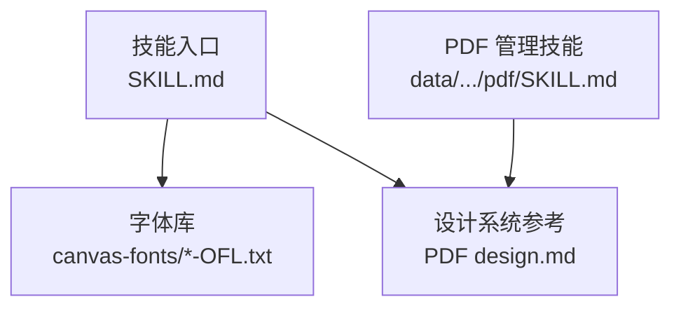
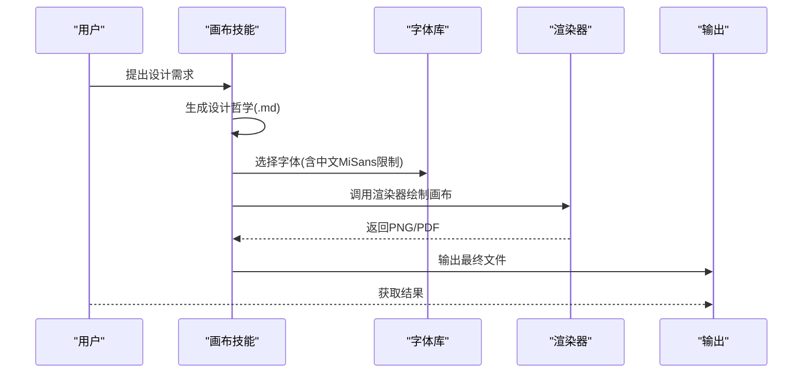
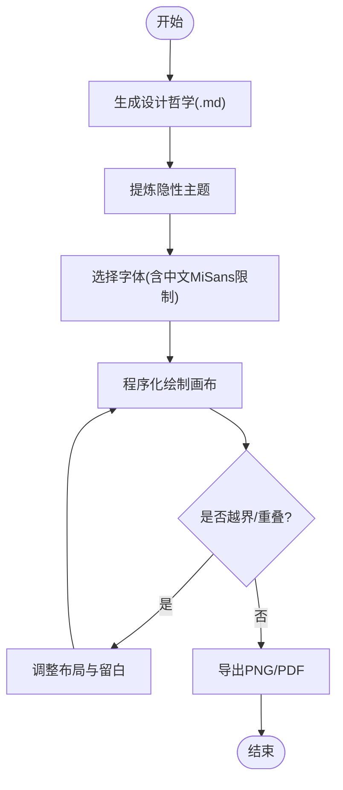
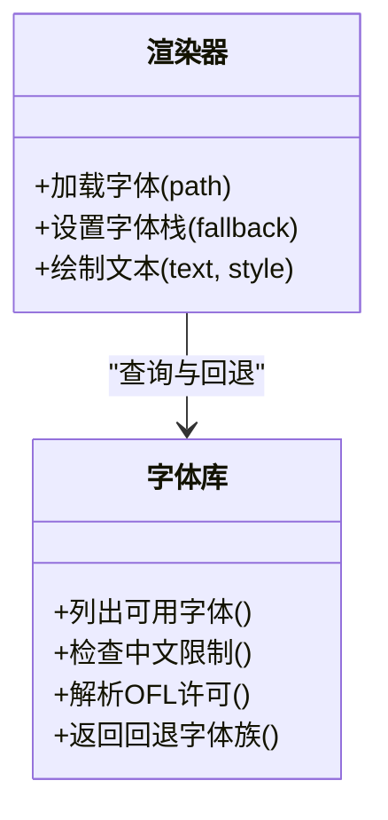
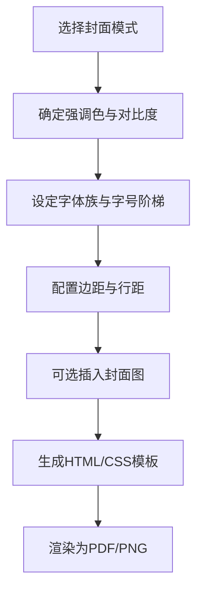
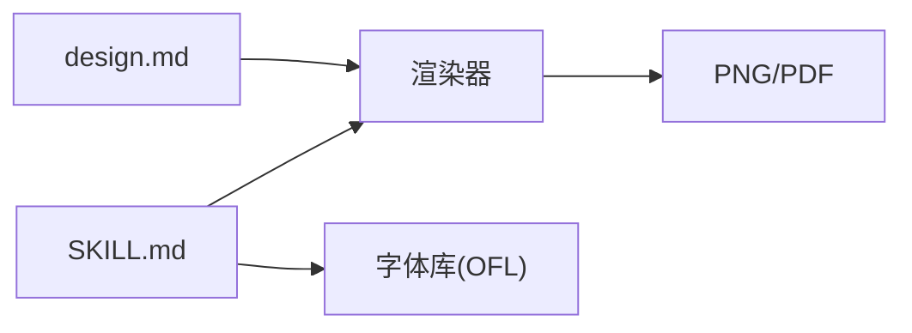

# 画布设计

<cite>
**本文引用的文件**   
- [SKILL.md](file://skills/canvas-design/SKILL.md)
- [LICENSE.txt](file://skills/canvas-design/LICENSE.txt)
- [ArsenalSC-OFL.txt](file://skills/canvas-design/canvas-fonts/ArsenalSC-OFL.txt)
- [WorkSans-OFL.txt](file://skills/canvas-design/canvas-fonts/WorkSans-OFL.txt)
- [design.md](file://skills/pdf/design/design.md)
- [SKILL.md](file://data/agent/managed-skills/pdf/SKILL.md)
</cite>

## 目录
1. [简介](#简介)
2. [项目结构](#项目结构)
3. [核心组件](#核心组件)
4. [架构总览](#架构总览)
5. [详细组件分析](#详细组件分析)
6. [依赖关系分析](#依赖关系分析)
7. [性能考量](#性能考量)
8. [故障排查指南](#故障排查指南)
9. [结论](#结论)
10. [附录](#附录)

## 简介
本文件面向“画布设计”技能，系统化说明其设计理念、渲染流程、字体管理与模板体系，并给出使用指南、最佳实践与优化建议。该技能聚焦于程序化视觉设计（几何图形、排版、抽象艺术海报等），输出为 PNG/PDF；当需要真实照片或人物时，应通过图像生成路由处理，本技能仅负责代码绘制的视觉表达。

## 项目结构
画布设计能力以“技能”形式组织，核心由以下部分组成：
- 技能规范与使用说明：定义创作流程、输出格式、字体选择策略与设计原则
- 内置字体库：包含多种开源字体的许可文本，用于合规引用与回退
- 设计系统参考：来自 PDF 设计系统的配色、排版、间距与封面模式，可借鉴到画布设计中

图表来源 
- [SKILL.md:1-132](file://skills/canvas-design/SKILL.md#L1-L132)
- [ArsenalSC-OFL.txt:1-94](file://skills/canvas-design/canvas-fonts/ArsenalSC-OFL.txt#L1-L94)
- [design.md:49-134](file://skills/pdf/design/design.md#L49-L134)
- [SKILL.md:19-38](file://data/agent/managed-skills/pdf/SKILL.md#L19-L38)

章节来源
- [SKILL.md:1-132](file://skills/canvas-design/SKILL.md#L1-L132)
- [design.md:49-134](file://skills/pdf/design/design.md#L49-L134)
- [SKILL.md:19-38](file://data/agent/managed-skills/pdf/SKILL.md#L19-L38)

## 核心组件
- 画布渲染引擎
  - 以程序化绘制为主，强调几何、排版与抽象构成，输出单页或多页的 PNG/PDF
  - 遵循严格边界与留白规则，避免元素重叠与越界
- 字体管理系统
  - 内置多套 OFL 字体许可文本，中文场景限定 MiSans 系列
  - 支持按需下载与嵌入，确保版权合规与跨平台一致性
- 设计模板库
  - 借鉴 PDF 设计系统的色彩、字号、行距与封面模式，形成可复用的视觉语言
  - 提供多种封面风格与版式策略，便于快速构建高质量页面

章节来源
- [SKILL.md:102-132](file://skills/canvas-design/SKILL.md#L102-L132)
- [design.md:84-134](file://skills/pdf/design/design.md#L84-L134)

## 架构总览
画布设计的整体工作流分为“理念创建—视觉表达—导出校验”三个阶段，贯穿设计哲学、字体选择与输出格式控制。

图表来源 
- [SKILL.md:1-132](file://skills/canvas-design/SKILL.md#L1-L132)
- [ArsenalSC-OFL.txt:1-94](file://skills/canvas-design/canvas-fonts/ArsenalSC-OFL.txt#L1-L94)

## 详细组件分析

### 画布渲染引擎
- 输入与约束
  - 设计哲学作为创作基础，强调空间、形态、色彩与构图
  - 文本极简且服务于视觉，禁止段落堆砌
  - 所有元素必须位于画布边界内，保持合理留白与层级
- 输出格式
  - 默认单页 PNG/PDF；可按需扩展为多页作品集
- 质量要求
  - 追求手工打磨质感，避免“AI感”痕迹
  - 反复精修现有内容而非盲目增加新元素

图表来源 
- [SKILL.md:102-132](file://skills/canvas-design/SKILL.md#L102-L132)

章节来源
- [SKILL.md:102-132](file://skills/canvas-design/SKILL.md#L102-L132)

### 字体管理系统
- 字体来源与许可
  - 内置多个 OFL 字体许可文本，确保使用合法
  - 中文文本限定使用 MiSans 系列字体
- 加载与回退
  - 优先使用本地可用字体；缺失时按策略回退至安全字体族
  - 渲染阶段动态加载，必要时嵌入以确保一致显示
- 版权管理
  - 遵循 OFL 条款，保留版权声明与许可信息
  - 不得单独售卖字体文件，允许随软件捆绑分发

图表来源 
- [WorkSans-OFL.txt:1-94](file://skills/canvas-design/canvas-fonts/WorkSans-OFL.txt#L1-L94)
- [ArsenalSC-OFL.txt:1-94](file://skills/canvas-design/canvas-fonts/ArsenalSC-OFL.txt#L1-L94)
- [SKILL.md:110-112](file://skills/canvas-design/SKILL.md#L110-L112)

章节来源
- [WorkSans-OFL.txt:1-94](file://skills/canvas-design/canvas-fonts/WorkSans-OFL.txt#L1-L94)
- [ArsenalSC-OFL.txt:1-94](file://skills/canvas-design/canvas-fonts/ArsenalSC-OFL.txt#L1-L94)
- [SKILL.md:110-112](file://skills/canvas-design/SKILL.md#L110-L112)

### 设计模板库
- 色彩与对比度
  - 单一强调色原则，确保与背景对比度达标
  - 避免常见滥用组合（如全黑背景、过多颜色）
- 排版系统
  - 最多两种字体族，标题与正文角色分明
  - 字号阶梯与行距统一，保证可读性与节奏
- 封面模式
  - 多种封面风格（杂志、暗房、终端、海报等）
  - 可选封面图片，渲染时自动适配布局

图表来源 
- [design.md:49-134](file://skills/pdf/design/design.md#L49-L134)
- [design.md:199-322](file://skills/pdf/design/design.md#L199-L322)

章节来源
- [design.md:49-134](file://skills/pdf/design/design.md#L49-L134)
- [design.md:199-322](file://skills/pdf/design/design.md#L199-L322)

### 工具使用指南与模板创建方法
- 使用步骤
  - 先产出设计哲学（.md），再基于哲学进行视觉表达（.png/.pdf）
  - 中文文本务必使用 MiSans 系列字体
  - 输出前检查边界、留白与层级，确保无重叠与越界
- 模板创建
  - 从 PDF 设计系统抽取配色、字号、行距与封面模式
  - 将模板固化为可复用资产，便于批量生成与版本管理

章节来源
- [SKILL.md:1-132](file://skills/canvas-design/SKILL.md#L1-L132)
- [design.md:84-134](file://skills/pdf/design/design.md#L84-L134)

### 导出格式支持与数据交换
- 导出格式
  - PNG：适合屏幕展示与分享
  - PDF：适合打印与归档
- 数据交换
  - 设计哲学以 .md 交付，便于协作与版本控制
  - 如需与外部设计工具集成，可将模板与字体清单作为交换载体

章节来源
- [SKILL.md:117-132](file://skills/canvas-design/SKILL.md#L117-L132)

## 依赖关系分析
- 内部依赖
  - 技能规范驱动渲染流程与字体策略
  - 设计系统参考影响配色、排版与封面模式
- 外部依赖
  - 字体许可文本确保合规
  - 渲染器可能依赖系统字体或运行时加载机制

图表来源 
- [SKILL.md:1-132](file://skills/canvas-design/SKILL.md#L1-L132)
- [design.md:49-134](file://skills/pdf/design/design.md#L49-L134)

章节来源
- [SKILL.md:1-132](file://skills/canvas-design/SKILL.md#L1-L132)
- [design.md:49-134](file://skills/pdf/design/design.md#L49-L134)

## 性能考量
- 渲染优化
  - 减少不必要的图层与复杂滤镜，提升渲染速度
  - 预加载常用字体，降低首次渲染延迟
- 资源管理
  - 缓存已验证的模板与字体映射，避免重复计算
  - 控制输出分辨率，平衡质量与文件大小
- 稳定性
  - 在缺少依赖时启用降级路径（如系统字体回退）
  - 对异常输入进行校验与容错处理

[本节为通用指导，不直接分析具体文件]

## 故障排查指南
- 常见问题
  - 字体缺失导致显示异常：检查本地字体安装与回退策略
  - 文本越界或重叠：重新评估边距、行距与元素层级
  - 输出尺寸不符：确认渲染器页面尺寸与 CSS 约束
- 解决步骤
  - 依据设计系统文档核对配色、字号与边距
  - 使用 PDF 管理技能的依赖与降级策略定位问题
  - 逐步缩小范围，隔离渲染器或字体相关因素

章节来源
- [design.md:239-261](file://skills/pdf/design/design.md#L239-L261)
- [SKILL.md:272-287](file://data/agent/managed-skills/pdf/SKILL.md#L272-L287)

## 结论
画布设计技能以“设计哲学—程序化绘制—合规字体—稳定导出”为核心闭环，结合 PDF 设计系统的成熟经验，能够在无需 AI 生图的前提下产出高质量视觉作品。通过严格的字体管理、模板化设计与性能优化，可实现团队协作、版本控制与部署配置的标准化落地。

[本节为总结性内容，不直接分析具体文件]

## 附录
- 许可证与合规
  - 技能本身采用 Apache 2.0 许可
  - 字体遵循 SIL Open Font License，遵守版权与分发条款
- 参考路径
  - 技能规范：skills/canvas-design/SKILL.md
  - 字体许可：skills/canvas-design/canvas-fonts/*-OFL.txt
  - 设计系统：skills/pdf/design/design.md
  - PDF 管理：data/agent/managed-skills/pdf/SKILL.md

章节来源
- [LICENSE.txt:1-202](file://skills/canvas-design/LICENSE.txt#L1-L202)
- [ArsenalSC-OFL.txt:1-94](file://skills/canvas-design/canvas-fonts/ArsenalSC-OFL.txt#L1-L94)
- [design.md:49-134](file://skills/pdf/design/design.md#L49-L134)
- [SKILL.md:19-38](file://data/agent/managed-skills/pdf/SKILL.md#L19-L38)