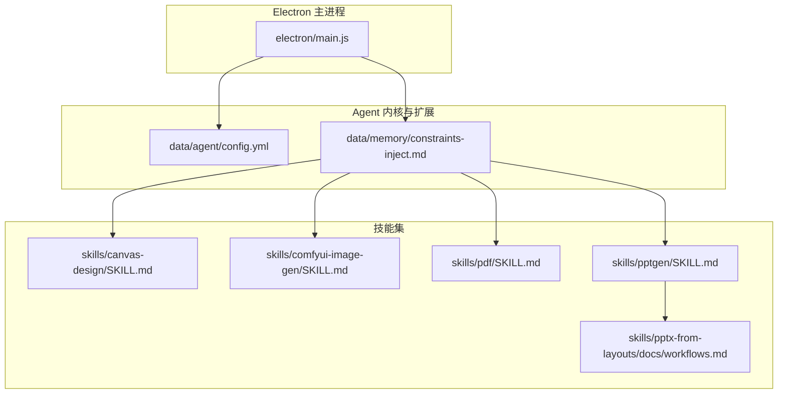
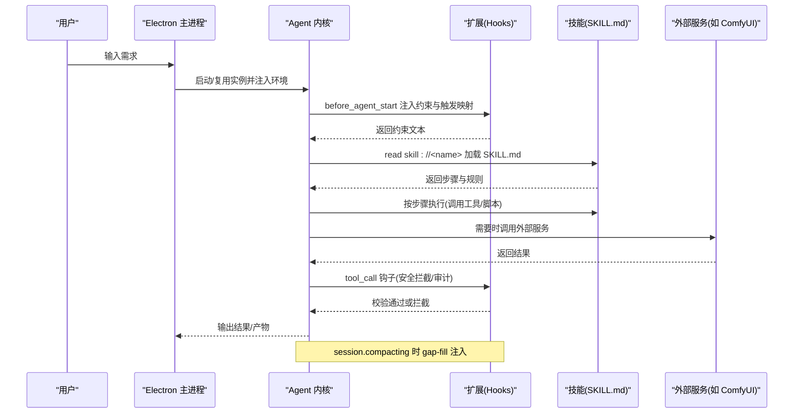
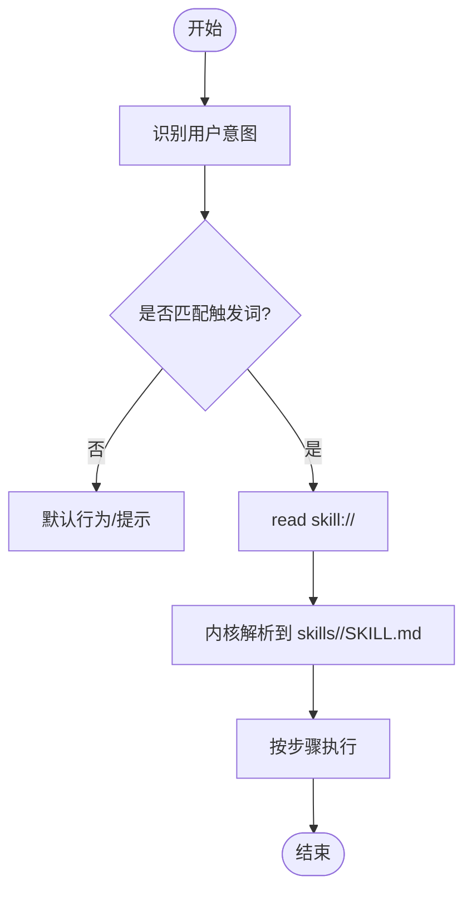
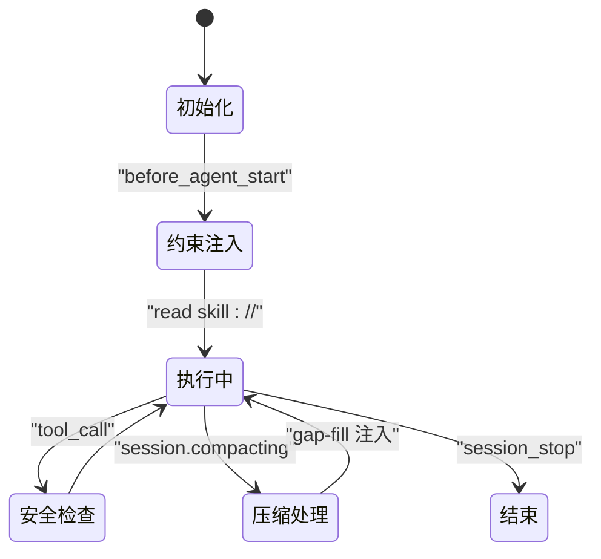
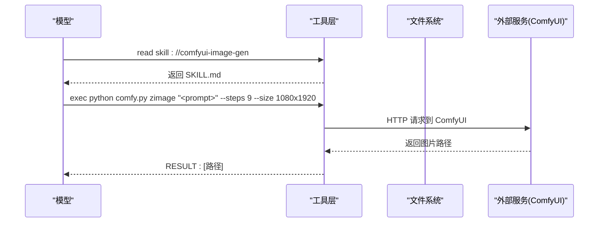
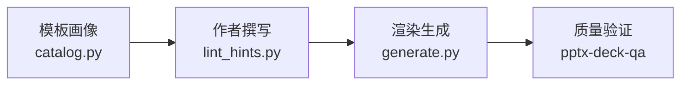
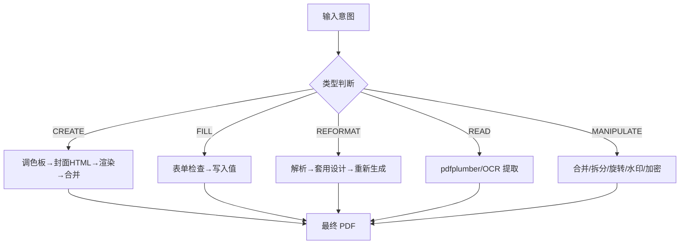
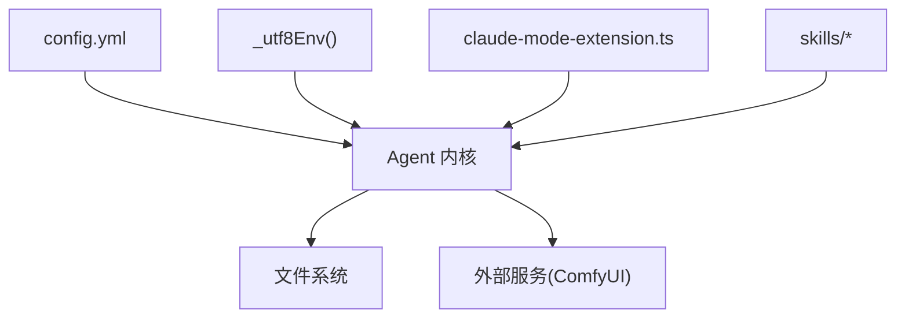

# 技能架构概览

<cite>
**本文引用的文件**   
- [README.md](file://README.md)
- [AGENTS.md](file://AGENTS.md)
- [data/agent/config.yml](file://data/agent/config.yml)
- [data/memory/constraints-inject.md](file://data/memory/constraints-inject.md)
- [skills/canvas-design/SKILL.md](file://skills/canvas-design/SKILL.md)
- [skills/comfyui-image-gen/SKILL.md](file://skills/comfyui-image-gen/SKILL.md)
- [skills/pdf/SKILL.md](file://skills/pdf/SKILL.md)
- [skills/pptgen/SKILL.md](file://skills/pptgen/SKILL.md)
- [skills/pptx-from-layouts/docs/workflows.md](file://skills/pptx-from-layouts/docs/workflows.md)
- [electron/main.js](file://electron/main.js)
</cite>

## 目录
1. [引言](#引言)
2. [项目结构](#项目结构)
3. [核心组件](#核心组件)
4. [架构总览](#架构总览)
5. [详细组件分析](#详细组件分析)
6. [依赖分析](#依赖分析)
7. [性能考虑](#性能考虑)
8. [故障排查指南](#故障排查指南)
9. [结论](#结论)
10. [附录](#附录)

## 引言
本文件系统化梳理 Tiffa 的“技能系统”（Skills）架构，覆盖技能的元数据定义格式（SKILL.md）、加载机制、执行流程与生命周期管理；说明技能目录结构规范、依赖管理与版本控制要点；阐述技能与 AI Agent 的集成方式、工具调用接口与参数传递机制；并提供开发最佳实践、性能优化策略与调试方法，以及完整示例与常见问题解决方案。

## 项目结构
Tiffa 的技能体系以“内核原生协议 + 扩展 Hook + 前端进程管理”的方式组织：
- 技能集合位于 skills/ 目录，每个技能一个子目录，包含 SKILL.md 及可选脚本、资源与参考文档。
- 行为约束与触发映射由 data/memory/constraints-inject.md 维护，驱动模型通过 read skill://<name> 加载对应 SKILL.md。
- Electron 主进程负责实例管理、IPC、命令拦截与环境注入，保障跨平台稳定运行。
- 配置集中在 data/agent/config.yml，定义模型角色、记忆系统与工具策略等。

图表来源 
- [electron/main.js](file://electron/main.js)
- [data/agent/config.yml](file://data/agent/config.yml)
- [data/memory/constraints-inject.md](file://data/memory/constraints-inject.md)
- [skills/canvas-design/SKILL.md](file://skills/canvas-design/SKILL.md)
- [skills/comfyui-image-gen/SKILL.md](file://skills/comfyui-image-gen/SKILL.md)
- [skills/pdf/SKILL.md](file://skills/pdf/SKILL.md)
- [skills/pptgen/SKILL.md](file://skills/pptgen/SKILL.md)
- [skills/pptx-from-layouts/docs/workflows.md](file://skills/pptx-from-layouts/docs/workflows.md)

章节来源
- [README.md:1-214](file://README.md#L1-L214)
- [AGENTS.md:1-310](file://AGENTS.md#L1-L310)

## 核心组件
- 技能元数据与步骤规范（SKILL.md）
  - 统一使用 YAML front-matter 描述 name、description、name_cn、license 等字段，部分技能提供 triggers 或 tools 等扩展字段。
  - 正文为可执行的步骤、路由表、依赖清单与注意事项，供 Agent 按步骤执行。
- 技能加载与触发
  - 通过 constraints-inject.md 将用户意图映射到 read skill://<name> 调用，内核解析到 skills/<name>/SKILL.md 并返回全文。
  - 技能目录通过 skills.customDirectories 指向 G:/Tiffa/skills。
- 执行与生命周期
  - 模型读取 SKILL.md 后严格按步骤执行；复杂任务支持子代理与工作流编排（如 pptx-from-layouts）。
  - 生命周期钩子（before_agent_start、tool_call、session.compacting 等）用于约束注入、危险操作拦截与断片补救。
- 配置与记忆
  - config.yml 定义模型角色、mnemopi 记忆系统与工具审批模式等。
  - memory/constraints-inject.md 作为 before_agent_start 注入的行为约束与技能触发映射。

章节来源
- [data/memory/constraints-inject.md:1-45](file://data/memory/constraints-inject.md#L1-L45)
- [AGENTS.md:144-156](file://AGENTS.md#L144-L156)
- [data/agent/config.yml:1-30](file://data/agent/config.yml#L1-L30)

## 架构总览
技能系统在 Tiffa 中的整体交互如下：
- 用户在 Electron GUI 输入需求。
- 主进程启动/复用 Agent 实例，注入环境变量与扩展。
- 扩展在 before_agent_start 注入行为约束与技能触发映射。
- 模型根据 constraints-inject.md 选择 read skill://<name> 加载 SKILL.md。
- 模型按 SKILL.md 的步骤调用工具（read/write/exec 等），必要时调用外部服务（如 ComfyUI）。
- tool_call 钩子在运行时进行安全拦截与审计日志记录。
- session.compacting 时进行 gap-fill 提取并立即注入上下文，提升弱模型稳定性。

图表来源 
- [electron/main.js](file://electron/main.js)
- [data/memory/constraints-inject.md](file://data/memory/constraints-inject.md)
- [AGENTS.md:123-156](file://AGENTS.md#L123-L156)

## 详细组件分析

### 技能元数据与目录规范（SKILL.md）
- 元数据字段
  - name：技能标识名
  - description/name_cn：英文/中文描述
  - license：许可证信息
  - triggers/tools（可选）：触发词与所需工具列表
- 目录建议
  - 根目录放置 SKILL.md
  - references/ 存放参考文档、模板与示例
  - scripts/ 或 *.py/*.js 等可执行脚本
  - templates/ 或 assets/ 存放模板与静态资源
  - output/ 用于生成产物（避免污染源码）
- 版本与变更
  - 建议在 SKILL.md 头部增加 version 字段（若需）
  - 重大变更通过 git tag 或分支管理，保持向后兼容

章节来源
- [skills/canvas-design/SKILL.md:1-132](file://skills/canvas-design/SKILL.md#L1-L132)
- [skills/pdf/SKILL.md:1-289](file://skills/pdf/SKILL.md#L1-L289)
- [skills/pptgen/SKILL.md:1-50](file://skills/pptgen/SKILL.md#L1-L50)

### 技能加载机制与触发映射
- 触发映射
  - constraints-inject.md 中维护“意图 -> read skill://<name>”的映射，确保模型先读再执行。
- 加载路径
  - 内核通过 read skill://<name> 解析到 skills/<name>/SKILL.md
  - skills.customDirectories 设置为 G:/Tiffa/skills
- 执行约束
  - 读完后必须严格按 SKILL.md 的步骤执行，不得跳步骤

图表来源 
- [data/memory/constraints-inject.md:1-45](file://data/memory/constraints-inject.md#L1-L45)
- [AGENTS.md:144-156](file://AGENTS.md#L144-L156)

章节来源
- [data/memory/constraints-inject.md:1-45](file://data/memory/constraints-inject.md#L1-L45)
- [AGENTS.md:144-156](file://AGENTS.md#L144-L156)

### 执行流程与生命周期管理
- 生命周期钩子
  - before_agent_start：注入行为约束与技能触发映射
  - tool_call：危险路径/配置文件自改/workspace mkdir 拦截；静默工具调用检测（≥3次 → steer）
  - session.compacting：gap-fill 提取（改动文件/命令/决策）+ compact dump + 立即返回 context 注入
  - session_stop：error 续行一次（最多一次，5秒延迟）
- 断片补救（gap-fill）
  - 压缩时提取关键信息，不等下轮直接注入，提升弱模型连续性

图表来源 
- [AGENTS.md:123-156](file://AGENTS.md#L123-L156)

章节来源
- [AGENTS.md:123-156](file://AGENTS.md#L123-L156)

### 技能与 Agent 集成、工具调用与参数传递
- 集成方式
  - 模型通过 read 工具读取 skill://<name> 获取 SKILL.md
  - 技能内部通过 exec/read/write 等工具与文件系统、外部服务交互
- 参数传递
  - CLI 参数通过命令行传入（如 pptgen.py、comfy.py）
  - 环境变量覆盖（如 COMFY_URL、COMFY_OUT）
  - JSON/YAML 配置文件（如 config.yaml、tokens.json）
- 外部服务
  - ComfyUI 远程服务（RTX5090），通过 comfy.py 统一入口调用不同管线

图表来源 
- [skills/comfyui-image-gen/SKILL.md:1-17](file://skills/comfyui-image-gen/SKILL.md#L1-L17)
- [AGENTS.md:234-254](file://AGENTS.md#L234-L254)

章节来源
- [skills/comfyui-image-gen/SKILL.md:1-17](file://skills/comfyui-image-gen/SKILL.md#L1-L17)
- [AGENTS.md:234-254](file://AGENTS.md#L234-L254)

### 典型工作流：PPTX 从布局生成
- 三阶段流水线：Profile → Author → Render
- 子代理分工：onboarder（模板画像）、architect（大纲生成）、QA（质量验证）
- 中间产物：catalog.md、config.json、slides.md（含 [HINT:] 标记）

图表来源 
- [skills/pptx-from-layouts/docs/workflows.md:1-100](file://skills/pptx-from-layouts/docs/workflows.md#L1-L100)

章节来源
- [skills/pptx-from-layouts/docs/workflows.md:1-100](file://skills/pptx-from-layouts/docs/workflows.md#L1-L100)

### 典型工作流：PDF 全谱处理
- 五大路线：CREATE、FILL、REFORMAT、READ、MANIPULATE
- 设计系统驱动：tokens.json 贯穿封面与正文渲染
- 依赖与回退：Playwright/Chromium 不可用时走 ReportLab Canvas 回退

图表来源 
- [skills/pdf/SKILL.md:1-289](file://skills/pdf/SKILL.md#L1-L289)

章节来源
- [skills/pdf/SKILL.md:1-289](file://skills/pdf/SKILL.md#L1-L289)

### 典型工作流：交互式网页演示（pptgen）
- 独立 CLI 工具，本地 LLM + ComfyUI 生图
- 风格模板内置，零 API 费用
- 通过 AI Agent 调用：询问风格/页数/配图 → 执行命令 → 返回 URL

章节来源
- [skills/pptgen/SKILL.md:1-50](file://skills/pptgen/SKILL.md#L1-L50)

### 典型工作流：创意海报设计（canvas-design）
- 两阶段：设计哲学（.md）→ 画布表达（.pdf/.png）
- 字体与排版严格规范，强调“大师级工艺”
- 多页选项与视觉一致性要求

章节来源
- [skills/canvas-design/SKILL.md:1-132](file://skills/canvas-design/SKILL.md#L1-L132)

## 依赖分析
- 运行时依赖
  - Python 解释器、Node.js（可选，Playwright/Chromium）
  - 第三方库：pypdf、pdfplumber、reportlab、Pillow、matplotlib 等（PDF 技能）
  - ComfyUI 服务端（HTTP 接口）
- 配置依赖
  - data/agent/config.yml：模型角色、mnemopi 记忆系统、工具审批模式
  - skills/*/config.yaml：各技能特定配置（如 LLM 端点、ComfyUI 路径）
- 进程与环境
  - electron/main.js 注入 UTF-8 环境变量，治理中文乱码
  - Windows 进程树杀杀（taskkill）保障实例清理

图表来源 
- [electron/main.js](file://electron/main.js)
- [data/agent/config.yml](file://data/agent/config.yml)

章节来源
- [electron/main.js:50-66](file://electron/main.js#L50-L66)
- [data/agent/config.yml:1-30](file://data/agent/config.yml#L1-L30)

## 性能考虑
- 弱模型增强
  - TTSR 规则拦截减少无效输出，节省 token
  - gap-fill 断片补救提升连续性，降低重复重试
  - Tool Call Loop 相同参数连续调工具拦截
- 资源与缓存
  - 合理设置 mnemopi.recallLimit 与 injectionTokenLimit，避免上下文膨胀
  - 外部服务（ComfyUI）输出目录与缓存策略优化
- 进程管理
  - LRU 淘汰与 stall 检测，崩溃自动重启，保障多实例稳定性

章节来源
- [AGENTS.md:134-142](file://AGENTS.md#L134-L142)
- [AGENTS.md:178-188](file://AGENTS.md#L178-L188)

## 故障排查指南
- 常见症状
  - 中文乱码：检查 _utf8Env() 注入的环境变量
  - 技能未加载：确认 constraints-inject.md 映射与 skills.customDirectories 设置
  - ComfyUI 失败：检查服务地址与输出目录，提醒用户先启动服务
  - 工具调用被拦截：查看 tool_call 钩子的安全规则
- 诊断步骤
  - 查看审计日志（tool_result 钩子 JSONL）
  - 检查 compact/gap-fill 文件是否存在
  - 复现实例状态与 LRU 淘汰情况

章节来源
- [electron/main.js:1770-1807](file://electron/main.js#L1770-L1807)
- [AGENTS.md:134-142](file://AGENTS.md#L134-L142)

## 结论
Tiffa 的技能系统以“标准化元数据 + 明确触发映射 + 强约束生命周期”为核心，结合 Electron 主进程的稳定管理与扩展 Hook 的安全拦截，实现了弱模型环境下的高可用智能体任务执行。通过清晰的目录规范、依赖管理与工作流编排，开发者可以快速构建、迭代与维护高质量技能。

## 附录
- 技能开发最佳实践
  - 明确职责边界：每个技能聚焦单一领域，提供清晰入口与退出点
  - 步骤化实现：SKILL.md 中分步描述，便于模型逐步执行与错误定位
  - 依赖声明：列出系统依赖与可选回退方案，确保跨平台可用性
  - 测试与示例：提供最小可运行示例与常见问题解答
- 版本控制与发布
  - 使用 git tag 标记重要版本，SKILL.md 头部增加 version 字段
  - 变更日志与兼容性说明，避免破坏性更新
- 调试方法
  - 启用 tool_call 审计日志，定位工具调用问题
  - 利用 gap-fill 文件分析上下文压缩效果
  - 通过 Electron IPC 查看实例状态与事件流