# 技能系统

<cite>
**本文引用的文件**   
- [README.md](file://README.md)
- [AGENTS.md](file://AGENTS.md)
- [config.yml](file://data/agent/config.yml)
- [skills/comfyui-image-gen/SKILL.md](file://skills/comfyui-image-gen/SKILL.md)
- [skills/dashiai-ppt/SKILL.md](file://skills/dashiai-ppt/SKILL.md)
- [skills/pptgen/SKILL.md](file://skills/pptgen/SKILL.md)
- [skills/docx/SKILL.md](file://skills/docx/SKILL.md)
- [skills/pdf/SKILL.md](file://skills/pdf/SKILL.md)
- [skills/xlsx/SKILL.md](file://skills/xlsx/SKILL.md)
- [skills/diagram-drawing/SKILL.md](file://skills/diagram-drawing/SKILL.md)
- [skills/image-gen-router/SKILL.md](file://skills/image-gen-router/SKILL.md)
- [skills/canvas-design/SKILL.md](file://skills/canvas-design/SKILL.md)
- [skills/contract-review/SKILL.md](file://skills/contract-review/SKILL.md)
- [skills/deep-research/SKILL.md](file://skills/deep-research/SKILL.md)
- [skills/memory-manager/SKILL.md](file://skills/memory-manager/SKILL.md)
</cite>

## 目录
1. [简介](#简介)
2. [项目结构](#项目结构)
3. [核心组件](#核心组件)
4. [架构总览](#架构总览)
5. [详细组件分析](#详细组件分析)
6. [依赖关系分析](#依赖关系分析)
7. [性能考量](#性能考量)
8. [故障排查指南](#故障排查指南)
9. [结论](#结论)
10. [附录](#附录)

## 简介
本文件系统化梳理 Tiffa 技能系统的整体架构、加载机制与执行流程，覆盖 18 个专业技能模块的设计要点与使用方式。重点包括文档处理（docx、pdf、xlsx）、图像生成（comfyui-image-gen、image-style-enhancer）、演示文稿制作（dashiai-ppt、pptgen）、图表绘制（diagram-drawing）等能力；并说明技能的元数据定义、参数配置、依赖管理与版本控制策略，提供自定义技能开发指南、最佳实践与性能优化建议。

## 项目结构
Tiffa 的技能体系以“每个技能一个目录 + SKILL.md 元数据”的方式组织，位于 skills/ 目录下。SKILL.md 统一描述技能名称、用途、触发词、依赖、工作流与约束，便于内核通过“skill”工具按需加载与执行。

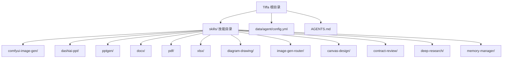

**图示来源** 
- [AGENTS.md:208-231](file://AGENTS.md#L208-L231)
- [config.yml:1-30](file://data/agent/config.yml#L1-L30)

**章节来源**
- [AGENTS.md:208-231](file://AGENTS.md#L208-L231)
- [config.yml:1-30](file://data/agent/config.yml#L1-L30)

## 核心组件
- 技能元数据与入口：每个技能目录包含 SKILL.md，定义 name、description/name_cn、triggers、license、metadata 等字段，作为内核识别与调度的依据。
- 技能加载与执行：通过扩展提供的 skill 工具，传入 name 加载指定技能，action="list" 可列出全部可用技能。
- 配置与记忆：config.yml 定义模型角色与 Mnemopi 记忆系统参数；AGENTS.md 记录启动方式、环境变量、Hook 与规则体系，以及技能列表与行为约束。

**章节来源**
- [AGENTS.md:144-154](file://AGENTS.md#L144-L154)
- [AGENTS.md:208-231](file://AGENTS.md#L208-L231)
- [config.yml:1-30](file://data/agent/config.yml#L1-L30)

## 架构总览
技能系统采用“声明式元数据 + 命令式工作流”的混合模式：
- 声明层：SKILL.md 描述能力边界、触发条件、依赖与环境要求。
- 执行层：根据用户意图匹配 triggers 或显式 name，调用对应 CLI/脚本完成具体任务。
- 编排层：部分技能之间协作（如 dashiai-ppt 调用 image-gen-router，后者再调用 comfy.py）。

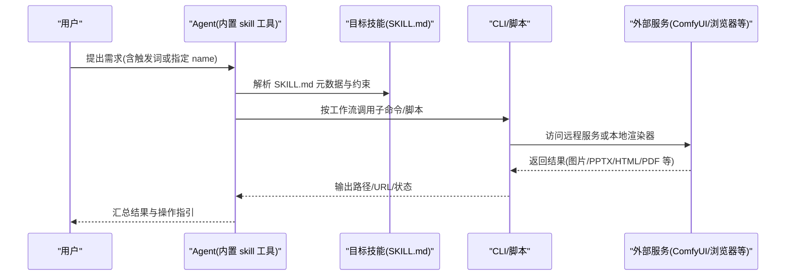

**图示来源** 
- [skills/image-gen-router/SKILL.md:1-98](file://skills/image-gen-router/SKILL.md#L1-L98)
- [skills/dashiai-ppt/SKILL.md:1-57](file://skills/dashiai-ppt/SKILL.md#L1-L57)
- [skills/comfyui-image-gen/SKILL.md:1-17](file://skills/comfyui-image-gen/SKILL.md#L1-L17)

## 详细组件分析

### 文档处理：docx（Word 文档助手）
- 功能特性：创建、编辑、审阅（修订批注）、文本提取、模板遵循、格式保留、目录与表格支持。
- 关键工作流：
  - 新建文档：基于 docx-js 构建文档对象，导出 .docx，必要时静态渲染目录。
  - 编辑现有文档：unpack → Python Document 库修改 → pack 打包；复杂场景直接操作 OOXML。
  - 审阅工作流：pandoc 转 markdown（保留修订），分批实施变更，最终验证与打包。
- 依赖管理：Python 包（defusedxml、python-docx、pymupdf、docx2pdf、mammoth）、npm 包（docx）、系统依赖（pandoc、LibreOffice、Poppler、git）。
- 降级策略：当系统依赖不可用时，回退到 fallback 脚本，明确限制与影响。

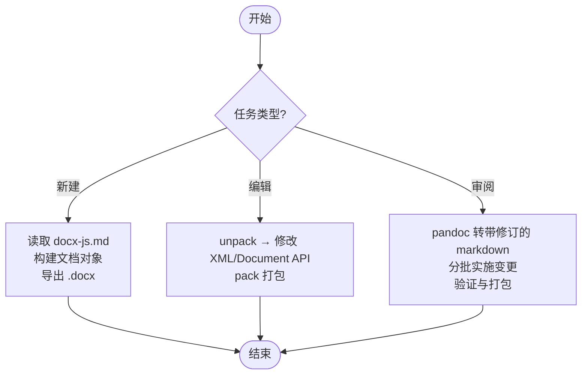

**图示来源** 
- [skills/docx/SKILL.md:1-266](file://skills/docx/SKILL.md#L1-L266)

**章节来源**
- [skills/docx/SKILL.md:1-266](file://skills/docx/SKILL.md#L1-L266)

### 文档处理：pdf（PDF 助手）
- 功能特性：高质量 PDF 生成（设计系统驱动）、读取/OCR、合并/拆分/旋转/水印/加密、表单填写、重排版。
- 路由表：CREATE/FILL/REFORMAT/READ/MANIPULATE 五类任务，分别由不同脚本/库实现。
- CREATE 管线：tokens.json → cover.html → Playwright 渲染封面 → ReportLab 生成正文 → 合并与 QA。
- READ 决策树：优先 pdfplumber，扫描/复杂文档走 paddleocr-doc-parsing。
- MANIPULATE：pypdf/qpdf 等工具链，提供 CLI 与 fallback 脚本。
- 依赖管理：Python 包（pypdf、pdfplumber、reportlab、Pillow、pypdfium2、matplotlib）、可选 Node.js（Playwright/Chromium）、系统工具（poppler-utils、qpdf、pdftk）。

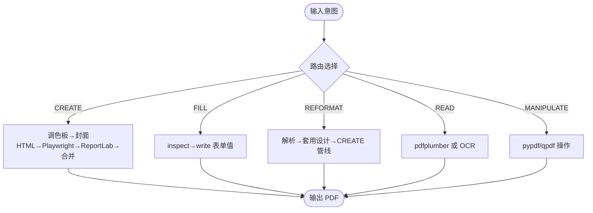

**图示来源** 
- [skills/pdf/SKILL.md:1-289](file://skills/pdf/SKILL.md#L1-L289)

**章节来源**
- [skills/pdf/SKILL.md:1-289](file://skills/pdf/SKILL.md#L1-L289)

### 文档处理：xlsx（Excel 表格助手）
- 功能特性：创建/编辑/分析电子表格，公式与格式化、数据清洗与可视化、公式重算。
- 关键原则：必须使用 Excel 公式而非硬编码计算；严格保护表头行；财务建模颜色与数字规范。
- 工作流：pandas 数据分析 → openpyxl 写入公式/样式 → recalc.py 调用 LibreOffice 重算 → 错误定位与修复。
- 依赖管理：Python 包（pandas、openpyxl）、系统依赖（LibreOffice 用于重算），失败时降级为脚本检查。

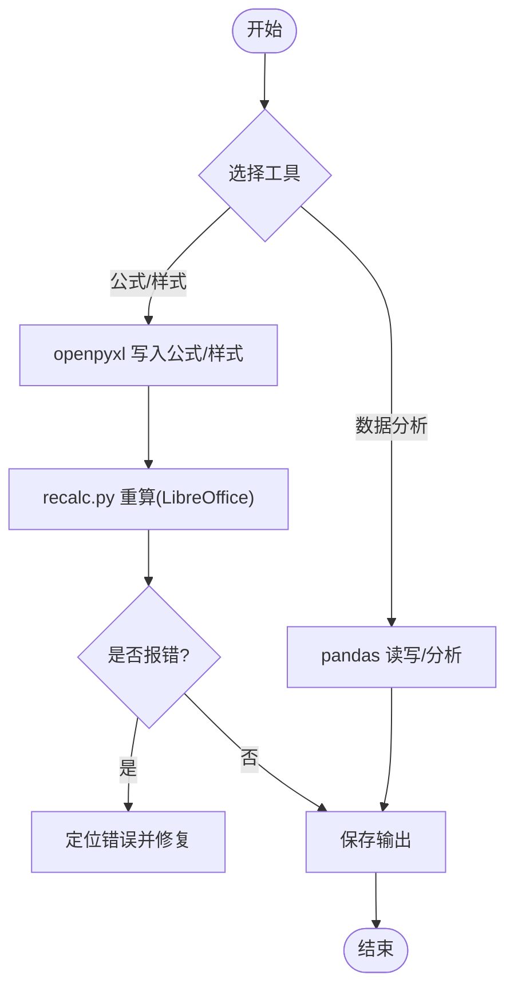

**图示来源** 
- [skills/xlsx/SKILL.md:1-314](file://skills/xlsx/SKILL.md#L1-L314)

**章节来源**
- [skills/xlsx/SKILL.md:1-314](file://skills/xlsx/SKILL.md#L1-L314)

### 图像生成：comfyui-image-gen（ComfyUI 文生图与图编辑）
- 功能特性：通过远程 ComfyUI（RTX5090）进行文生图与图编辑，支持 5 种管线（zimage、ernie、krea2、klein、edit）。
- 路由规则：按用户意图选择管线，默认输出目录与服务器地址可通过环境变量覆盖。
- 执行方式：统一 CLI comfy.py 子命令，打印 RESULT:[路径] 报告纯路径。

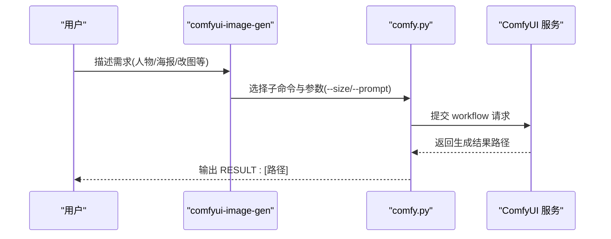

**图示来源** 
- [skills/comfyui-image-gen/SKILL.md:1-17](file://skills/comfyui-image-gen/SKILL.md#L1-L17)

**章节来源**
- [skills/comfyui-image-gen/SKILL.md:1-17](file://skills/comfyui-image-gen/SKILL.md#L1-L17)

### 图像生成：image-gen-router（生图路由助手）
- 功能特性：统一入口，强制“选路由 → 扩写提示词 → 出图”三步流程，避免跳过选择直接调用底层 comfy.py。
- 分支定位：zimage（人物写真）、ernie（真实感+文字）、klein（全能场景）、t2i（双分支并行融合）、krea2（艺术/anime）、edit（改图编辑）。
- 画幅选择：横屏/竖屏/方形/自由尺寸；krea2 需选择主角（liuyifei/kopiu）。
- 调用约定：直接调用 comfy.py 子命令，禁止使用 gen 包装器；默认连接远程 ComfyUI 地址。

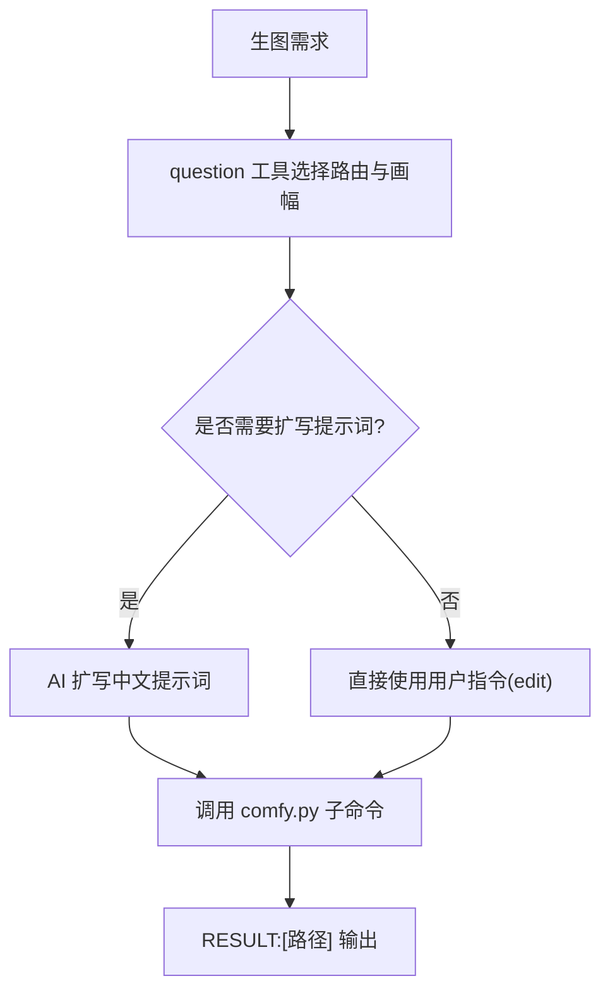

**图示来源** 
- [skills/image-gen-router/SKILL.md:1-98](file://skills/image-gen-router/SKILL.md#L1-L98)

**章节来源**
- [skills/image-gen-router/SKILL.md:1-98](file://skills/image-gen-router/SKILL.md#L1-L98)

### 演示文稿：dashiai-ppt（Dashi PPT 演示文稿生成）
- 功能特性：本地离线 PPT 生成，12 套视觉风格，HTML 预览后导出 PPTX/PDF。
- 行为约束：风格选择与配图来源必须先问用户；AI 生图必须走 image-gen-router；Windows 上 preview:start 不可用，改用 preview:https 或 Python HTTP 服务器。
- 输出目录：所有输出写到当前会话工作目录，避免写入 skill-root/project/output。

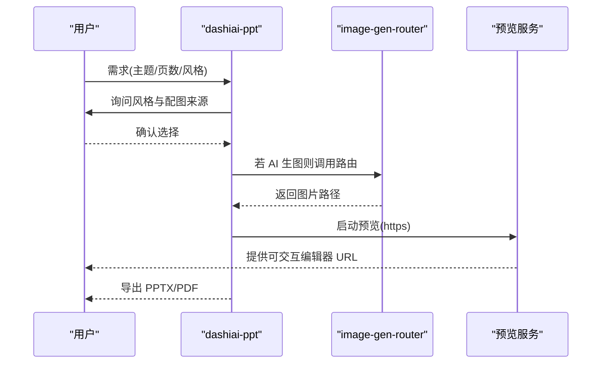

**图示来源** 
- [skills/dashiai-ppt/SKILL.md:1-57](file://skills/dashiai-ppt/SKILL.md#L1-L57)
- [skills/image-gen-router/SKILL.md:1-98](file://skills/image-gen-router/SKILL.md#L1-L98)

**章节来源**
- [skills/dashiai-ppt/SKILL.md:1-57](file://skills/dashiai-ppt/SKILL.md#L1-L57)

### 演示文稿：pptgen（交互式 HTML 网页生成器）
- 功能特性：独立 CLI 工具，一句话生成本地交互式 HTML 网页（非 PPTX），内置多套视觉模板，自动调用本地模型与 ComfyUI 生图。
- 使用方式：命令行参数支持 --style、--pages、--output、--no-image、--no-llm；AI Agent 使用时需在回复中给出输出文件的 URL。
- 风格列表：dark-tech、magazine、minimal、gradient 等。

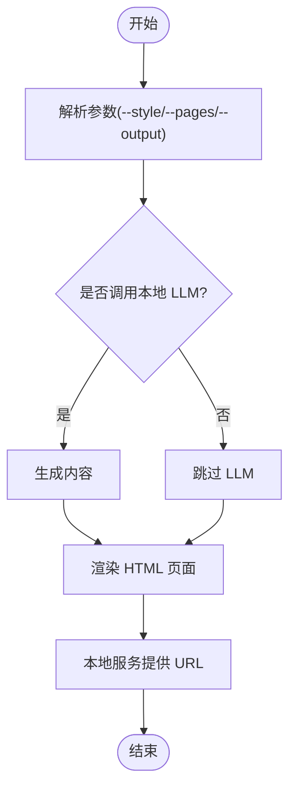

**图示来源** 
- [skills/pptgen/SKILL.md:1-50](file://skills/pptgen/SKILL.md#L1-L50)

**章节来源**
- [skills/pptgen/SKILL.md:1-50](file://skills/pptgen/SKILL.md#L1-L50)

### 图表绘制：diagram-drawing（图表绘制）
- 功能特性：自然语言生成专业图表，支持 Draw.io（正式/结构化）与 Excalidraw（手绘/草图）两类引擎，涵盖 23 种图表类型。
- 引擎选择：按用户意图与风格决定引擎；模糊类型需澄清。
- 生成工作流：选择引擎 → 阅读对应指南 → 生成 XML/JSON → CLI 渲染 → Visual QA Gate（质量门禁）→ 输出图片与源文件。
- 依赖管理：Python 3.10+、Playwright/Chromium、网络访问（在线资源）。

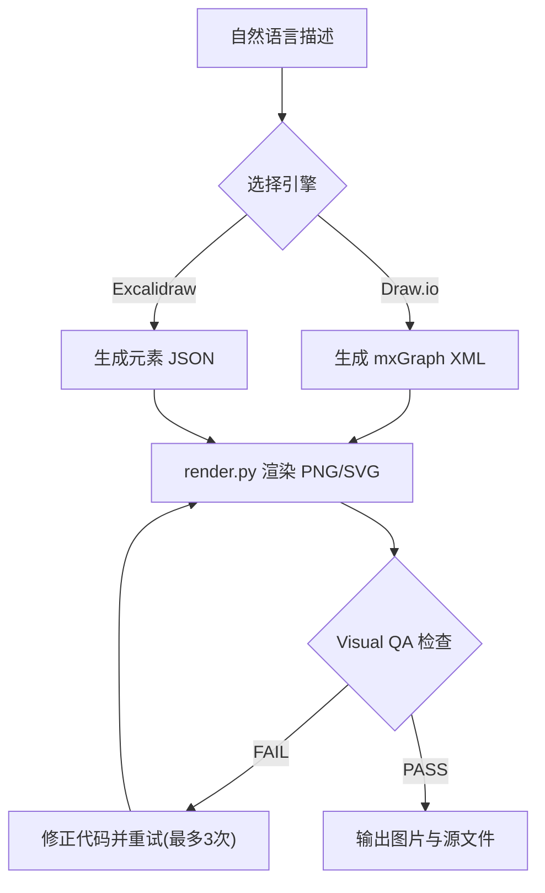

**图示来源** 
- [skills/diagram-drawing/SKILL.md:1-205](file://skills/diagram-drawing/SKILL.md#L1-L205)

**章节来源**
- [skills/diagram-drawing/SKILL.md:1-205](file://skills/diagram-drawing/SKILL.md#L1-L205)

### 创意海报：canvas-design（创意海报设计）
- 功能特性：程序化视觉设计（非 AI 生图），输出 .png/.pdf，强调设计哲学与极简文字，字体使用 canvas-fonts 目录中的 MiSans 系列（中文）。
- 工作流：先产出设计哲学（.md），再在画布上表达（.pdf/.png），确保无重叠、留白充足、排版专业。
- 适用场景：抽象/几何/排版类海报；真实感照片/人物/实景应走 image-gen-router。

**章节来源**
- [skills/canvas-design/SKILL.md:1-132](file://skills/canvas-design/SKILL.md#L1-L132)

### 合同审核：contract-review（合同审核）
- 功能特性：仅添加批注不改动原文，三层审查（基础/商业/法律），结构化批注（问题类型/风险原因/修订建议），生成摘要、综合意见与业务流程图（Mermaid + 渲染图）。
- 输出命名与语言：按合同主语言输出，文件名区分中英文。
- 依赖管理：Python、pandoc、defusedxml、Mermaid CLI、python-docx。

**章节来源**
- [skills/contract-review/SKILL.md:1-139](file://skills/contract-review/SKILL.md#L1-L139)

### 深度调研：deep-research（深度调研）
- 功能特性：三阶段研究流程（问题细化 → 顺序执行多代理 → 综合与验证），输出结构化研究报告，引用标注完整，强调叙事性写作。
- 执行优先级：每次执行必须先创建 todowrite 展示三阶段计划，然后进入 Phase 1 提问澄清。
- 代理策略：推荐 3 个代理顺序执行，每步保存结果并传递上下文，最终生成连贯文章与参考文献。

**章节来源**
- [skills/deep-research/SKILL.md:1-747](file://skills/deep-research/SKILL.md#L1-L747)

### 长期记忆：memory-manager（长期记忆管理）
- 功能特性：跨会话记忆管理，通过 MCP 工具 memory_save/memory_search/memory_get 实现；记忆分三层（USER.md、MEMORY.md、daily-log/YYYY-MM-DD.md）。
- 使用场景：记住偏好/事实、查询过往记录、回顾当日日志与核心事实。
- 注意事项：不在对话中暴露工具调用细节；USER.md 只放用户明确要求的内容；搜索支持正则。

**章节来源**
- [skills/memory-manager/SKILL.md:1-90](file://skills/memory-manager/SKILL.md#L1-L90)

## 依赖关系分析
- 技能间协作：
  - dashiai-ppt → image-gen-router → comfyui-image-gen（comfy.py）
  - diagram-drawing → render.py → Playwright/Chromium
  - pdf → Playwright/ReportLab/pypdf/qpdf
  - xlsx → recalc.py → LibreOffice
- 系统与运行时：
  - Python 环境（各技能脚本依赖）
  - Node.js/Playwright（PDF 封面渲染、图表渲染）
  - 系统工具（pandoc、LibreOffice、Poppler、qpdf、pdftk）
  - 远程服务（ComfyUI 服务器地址）

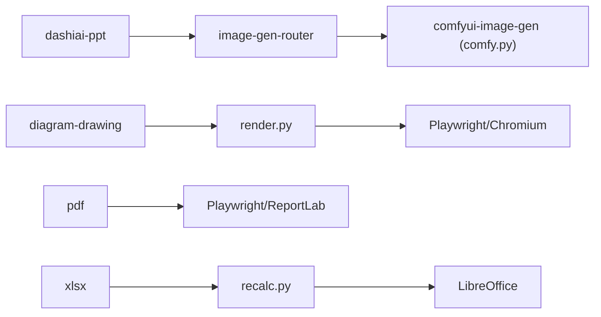

**图示来源** 
- [skills/dashiai-ppt/SKILL.md:1-57](file://skills/dashiai-ppt/SKILL.md#L1-L57)
- [skills/image-gen-router/SKILL.md:1-98](file://skills/image-gen-router/SKILL.md#L1-L98)
- [skills/diagram-drawing/SKILL.md:1-205](file://skills/diagram-drawing/SKILL.md#L1-L205)
- [skills/pdf/SKILL.md:1-289](file://skills/pdf/SKILL.md#L1-L289)
- [skills/xlsx/SKILL.md:1-314](file://skills/xlsx/SKILL.md#L1-L314)

**章节来源**
- [skills/dashiai-ppt/SKILL.md:1-57](file://skills/dashiai-ppt/SKILL.md#L1-L57)
- [skills/image-gen-router/SKILL.md:1-98](file://skills/image-gen-router/SKILL.md#L1-L98)
- [skills/diagram-drawing/SKILL.md:1-205](file://skills/diagram-drawing/SKILL.md#L1-L205)
- [skills/pdf/SKILL.md:1-289](file://skills/pdf/SKILL.md#L1-L289)
- [skills/xlsx/SKILL.md:1-314](file://skills/xlsx/SKILL.md#L1-L314)

## 性能考量
- 渲染与网络：
  - diagram-drawing 与 pdf 封面渲染依赖在线资源与浏览器渲染，需保证网络与 Playwright/Chromium 可用。
  - 超时与错误处理：drawio HTML 属性中 & 未转义导致 JSON 解析失败，已在 render.py 修复；遇到超时或 400 错误需重试或更新 workflow API。
- 公式重算与依赖：
  - xlsx 的 recalc.py 依赖 LibreOffice，失败时需降级为脚本检查并明确告知用户。
- 生图耗时：
  - comfy.py 阻塞等待生成（约 10-30s），应避免频繁重复调用；批量提示词可提升吞吐。
- 内存与上下文：
  - 记忆注入上限（2000 token）与 autoRetain 频率（每 2 轮）控制上下文膨胀；PROJECT.md 确定性注入减少随机召回开销。

[本节为通用指导，无需特定文件来源]

## 故障排查指南
- ComfyUI 服务不可用：
  - 症状：HTTP 400 或连接失败；提醒用户先启动 ComfyUI 服务，检查 COMFY_URL 环境变量。
  - 参考：skills/comfyui-image-gen/SKILL.md
- Playwright/Chromium 缺失：
  - 症状：PDF 封面渲染失败；安装 Playwright 与 Chromium，或使用 Canvas 回退。
  - 参考：skills/pdf/SKILL.md
- LibreOffice 缺失：
  - 症状：xlsx 公式重算失败；安装 LibreOffice 或降级为脚本检查。
  - 参考：skills/xlsx/SKILL.md
- pandoc/LibreOffice/Poppler 缺失：
  - 症状：docx 文本提取/转换失败；按平台安装或回退脚本。
  - 参考：skills/docx/SKILL.md
- 图表渲染超时：
  - 症状：drawio XML 中 value 属性含 &quot; 导致 JSON 解析失败；已修复 render.py 第 91 行。
  - 参考：skills/diagram-drawing/SKILL.md

**章节来源**
- [skills/comfyui-image-gen/SKILL.md:1-17](file://skills/comfyui-image-gen/SKILL.md#L1-L17)
- [skills/pdf/SKILL.md:1-289](file://skills/pdf/SKILL.md#L1-L289)
- [skills/xlsx/SKILL.md:1-314](file://skills/xlsx/SKILL.md#L1-L314)
- [skills/docx/SKILL.md:1-266](file://skills/docx/SKILL.md#L1-L266)
- [skills/diagram-drawing/SKILL.md:1-205](file://skills/diagram-drawing/SKILL.md#L1-L205)

## 结论
Tiffa 技能系统以 SKILL.md 为核心元数据载体，结合统一的 skill 工具与清晰的依赖管理，实现了从文档处理、图像生成到演示文稿与图表绘制的完整能力闭环。通过分层记忆、三重约束与 Hook 机制，系统在弱模型环境下仍保持稳定执行。建议在实际使用中遵循“先问后做”的行为约束、充分利用降级策略与质量门禁，并在自定义技能开发时保持元数据一致性与依赖最小化。

[本节为总结性内容，无需特定文件来源]

## 附录

### 技能元数据与参数配置
- 元数据字段：name、description/name_cn、triggers、license、metadata（category/phase/audience/complexity）等。
- 参数与环境变量：
  - ComfyUI：COMFY_URL、COMFY_OUT
  - 其他：PORTABLE_ROOT、PI_CODING_AGENT_DIR、HOME/USERPROFILE
- 配置位置：data/agent/config.yml（模型角色与 Mnemopi 参数）

**章节来源**
- [skills/comfyui-image-gen/SKILL.md:1-17](file://skills/comfyui-image-gen/SKILL.md#L1-L17)
- [skills/image-gen-router/SKILL.md:1-98](file://skills/image-gen-router/SKILL.md#L1-L98)
- [config.yml:1-30](file://data/agent/config.yml#L1-L30)
- [AGENTS.md:254-262](file://AGENTS.md#L254-L262)

### 版本控制与许可证
- 各技能目录通常包含 LICENSE.txt 或 MIT 协议说明；SKILL.md 中 license 字段明确许可条款。
- 建议在技能迭代时同步更新 SKILL.md 的版本与变更说明，保持依赖清单与降级策略一致。

**章节来源**
- [skills/docx/SKILL.md:1-266](file://skills/docx/SKILL.md#L1-L266)
- [skills/pdf/SKILL.md:1-289](file://skills/pdf/SKILL.md#L1-L289)
- [skills/xlsx/SKILL.md:1-314](file://skills/xlsx/SKILL.md#L1-L314)
- [skills/canvas-design/SKILL.md:1-132](file://skills/canvas-design/SKILL.md#L1-L132)

### 自定义技能开发指南与最佳实践
- 目录结构：每个技能一个目录，包含 SKILL.md（元数据与工作流）、references/（参考文档）、scripts/（可执行脚本）、assets/（资源）。
- 元数据规范：明确 name、description/name_cn、triggers、license、metadata；triggers 应覆盖常见用户用语。
- 依赖管理：优先声明 Python/npm/系统依赖，并提供 fallback 脚本与降级策略。
- 行为约束：遵循“先问后做”（如风格选择、配图来源、路由选择），避免默认行为引发歧义。
- 质量门禁：对渲染/生成结果进行自检（如 Visual QA Gate），失败时自动修复并重试。
- 性能优化：减少不必要的网络请求、缓存中间结果、批量处理提示词、合理设置超时与重试。

**章节来源**
- [skills/diagram-drawing/SKILL.md:1-205](file://skills/diagram-drawing/SKILL.md#L1-L205)
- [skills/dashiai-ppt/SKILL.md:1-57](file://skills/dashiai-ppt/SKILL.md#L1-L57)
- [skills/image-gen-router/SKILL.md:1-98](file://skills/image-gen-router/SKILL.md#L1-L98)
- [AGENTS.md:208-231](file://AGENTS.md#L208-L231)