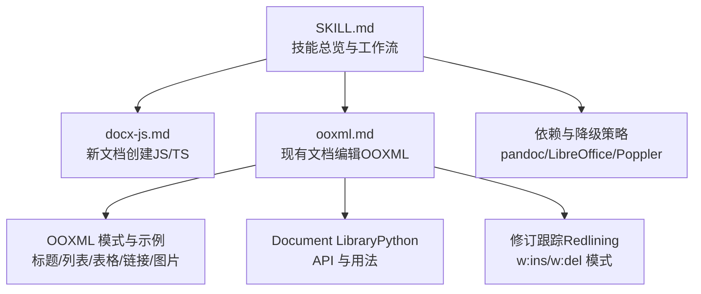
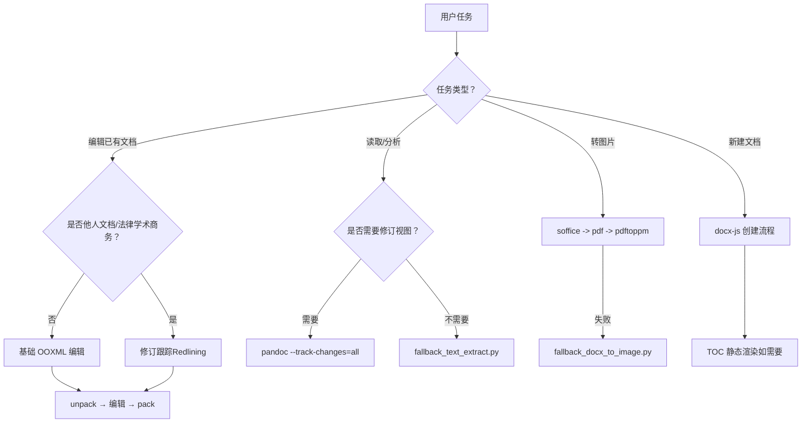
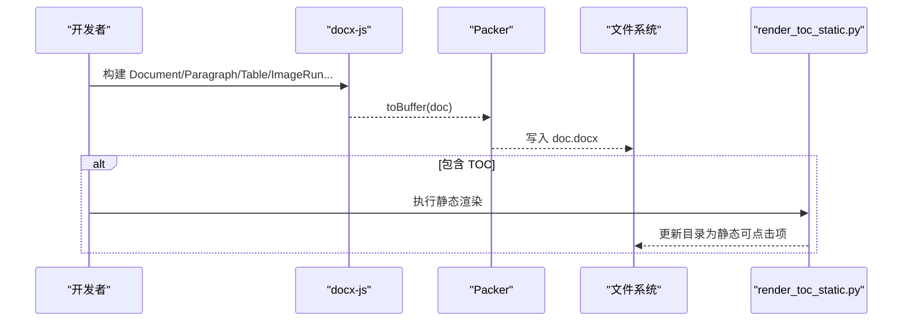
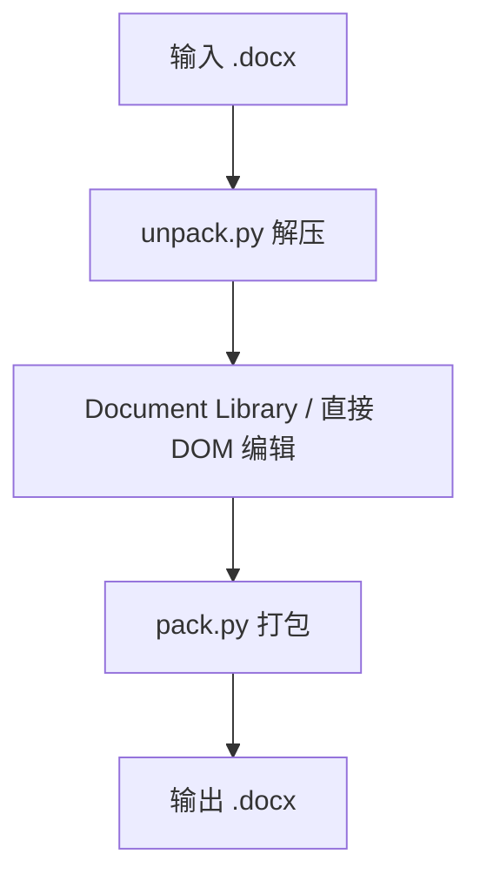
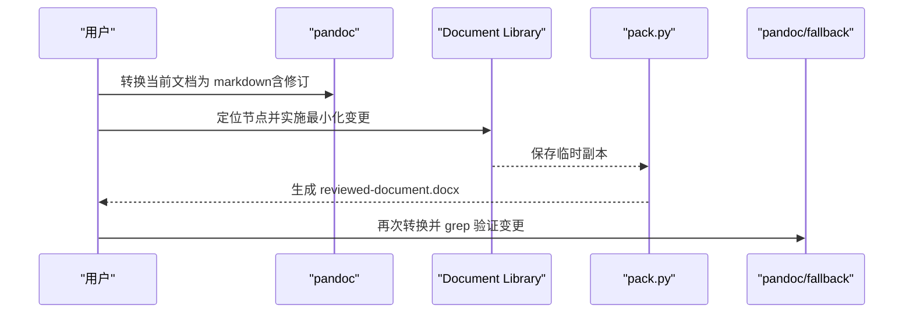
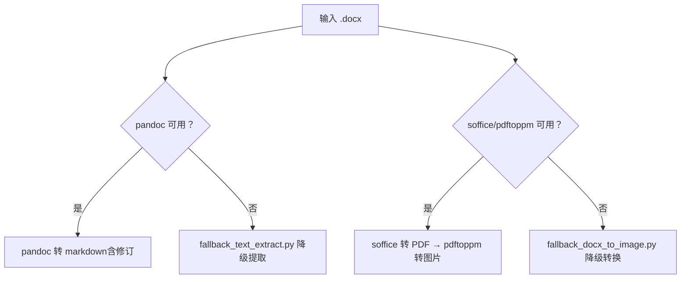
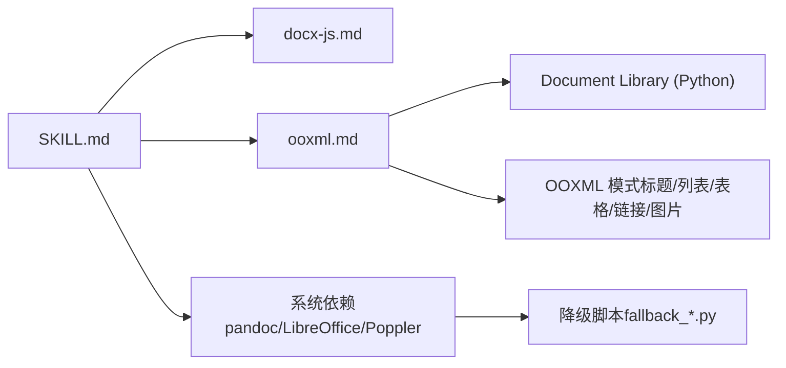

# DOCX 文档处理技能

<cite>
**本文引用的文件**
- [skills/docx/SKILL.md](file://skills/docx/SKILL.md)
- [skills/docx/docx-js.md](file://skills/docx/docx-js.md)
- [skills/docx/ooxml.md](file://skills/docx/ooxml.md)
- [skills/docx/LICENSE.txt](file://skills/docx/LICENSE.txt)
</cite>

## 目录
1. [简介](#简介)
2. [项目结构](#项目结构)
3. [核心组件](#核心组件)
4. [架构总览](#架构总览)
5. [详细组件分析](#详细组件分析)
6. [依赖关系分析](#依赖关系分析)
7. [性能与可扩展性](#性能与可扩展性)
8. [故障排除指南](#故障排除指南)
9. [结论](#结论)
10. [附录：最佳实践清单](#附录最佳实践清单)

## 简介
本技能提供完整的 Word（.docx）文档处理能力，覆盖新文档创建、现有文档编辑、修订跟踪（Redlining）、文本提取、格式转换、模板合规策略、依赖管理与降级模式。它基于两类工作流：
- 基于 docx-js 的新文档创建流程（JavaScript/TypeScript）
- 基于 OOXML 的现有文档编辑工作流（Python + Office Open XML）

同时提供系统级工具链（pandoc、LibreOffice、Poppler）及 Python 脚本作为主路径或降级路径，确保在不同平台与环境下均可稳定运行。

**章节来源**
- [skills/docx/SKILL.md:1-266](file://skills/docx/SKILL.md#L1-L266)

## 项目结构
该技能位于 skills/docx 目录下，包含：
- SKILL.md：技能说明、工作流决策树、依赖与降级策略
- docx-js.md：基于 JavaScript/TypeScript 的 .docx 生成教程与规范
- ooxml.md：OOXML 技术参考、Document Library 使用方式、修订跟踪模式
- LICENSE.txt：许可条款
- ooxml/schemas：OOXML 相关 XSD 参考（用于理解结构与约束）

**图表来源**
- [skills/docx/SKILL.md:1-266](file://skills/docx/SKILL.md#L1-L266)
- [skills/docx/docx-js.md:1-357](file://skills/docx/docx-js.md#L1-L357)
- [skills/docx/ooxml.md:1-610](file://skills/docx/ooxml.md#L1-L610)

**章节来源**
- [skills/docx/SKILL.md:1-266](file://skills/docx/SKILL.md#L1-L266)

## 核心组件
- 新文档创建（docx-js）
  - 通过 Document、Paragraph、TextRun、Table、ImageRun、TableOfContents 等构建结构化内容
  - 支持样式、编号、表格、超链接、页眉页脚、分页、图片等
  - 输出为 .docx 缓冲区并保存；若含 TOC，需执行静态渲染脚本以确保条目可点击
- 现有文档编辑（OOXML）
  - 解压 .docx → 使用 Document Library 进行节点查找与替换 → 打包回 .docx
  - 支持复杂场景的直接 DOM 操作（defusedxml.minidom）
- 修订跟踪（Redlining）
  - 以 w:ins/w:del 标记变更，保持最小化差异，保留未改动文本的 RSID
  - 支持批注、拒绝插入/删除、嵌套修改他人修订
- 文本提取与格式转换
  - 首选 pandoc 将 .docx 转为 markdown（支持修订视图）
  - 降级路径使用 Python fallback 脚本
  - 图像导出：soffice 转 PDF → pdftoppm 转 JPEG/PNG；不可用时走 fallback

**章节来源**
- [skills/docx/SKILL.md:31-228](file://skills/docx/SKILL.md#L31-L228)
- [skills/docx/docx-js.md:1-357](file://skills/docx/docx-js.md#L1-L357)
- [skills/docx/ooxml.md:266-610](file://skills/docx/ooxml.md#L266-L610)

## 架构总览
下图展示从用户任务到具体实现的工作流选择与调用关系。

**图表来源**
- [skills/docx/SKILL.md:31-228](file://skills/docx/SKILL.md#L31-L228)
- [skills/docx/docx-js.md:80-90](file://skills/docx/docx-js.md#L80-L90)
- [skills/docx/ooxml.md:92-106](file://skills/docx/ooxml.md#L92-L106)

## 详细组件分析

### 基于 docx-js 的新文档创建
- 关键对象与能力
  - Document/Section/Paragraph/TextRun：构建段落与文本，控制字体、颜色、大小、下划线、高亮、上下标等
  - Table/TableRow/TableCell：表格布局、边框、阴影、对齐、垂直对齐
  - ImageRun：嵌入图片，必须指定 type（png/jpg/jpeg/gif/bmp/svg），设置尺寸与 altText
  - TableOfContents：目录字段占位符，配合 HeadingLevel 使用；必要时执行静态渲染脚本
  - Header/Footer/PageNumber：页眉页脚与页码
  - ExternalHyperlink/InternalHyperlink：外部与内部超链接（书签锚点）
- 重要规范与陷阱
  - 禁止在 TextRun 中使用 \n 换行，应使用多个 Paragraph
  - 表格列宽需在 Table 层设置 columnWidths，并在每个 TableCell 上设置 width（DXA 单位）
  - 表格阴影必须使用 ShadingType.CLEAR，避免黑色背景
  - PageBreak 必须包裹在 Paragraph 内，否则产生无效 XML
  - 编号列表必须使用 LevelFormat.BULLET 常量与 numbering config，禁止用 Unicode 符号模拟
  - TOC 要求仅使用 HeadingLevel，不要对标题段落附加自定义样式
- 工作流程
  - 编写 JS/TS 脚本 → 构建 Document → Packer.toBuffer() 输出 .docx
  - 若包含 TableOfContents，执行 render_toc_static.py 生成静态可点击目录

**图表来源**
- [skills/docx/docx-js.md:11-22](file://skills/docx/docx-js.md#L11-L22)
- [skills/docx/docx-js.md:231-261](file://skills/docx/docx-js.md#L231-L261)
- [skills/docx/SKILL.md:76-90](file://skills/docx/SKILL.md#L76-L90)

**章节来源**
- [skills/docx/docx-js.md:1-357](file://skills/docx/docx-js.md#L1-L357)
- [skills/docx/SKILL.md:76-90](file://skills/docx/SKILL.md#L76-L90)

### 基于 OOXML 的现有文档编辑
- 工作流
  - 解压：python ooxml/scripts/unpack.py <office_file> <output_directory>
  - 编辑：使用 Document Library（scripts/document.py）进行节点查找与替换，或直接 DOM 操作
  - 打包：python ooxml/scripts/pack.py <input_directory> <office_file>
- 关键文件结构
  - word/document.xml：主体内容
  - word/comments.xml：批注
  - word/media/：媒体资源
  - word/_rels/document.xml.rels：关系映射
  - [Content_Types].xml：内容类型声明
- 常用模式
  - 标题/段落样式、列表（编号/项目符号）、表格、页眉页脚、超链接、图片嵌入
- 注意事项
  - 元素顺序与命名空间、Unicode 实体转义、RSID 八位十六进制
  - 图片尺寸计算以避免溢出并保持纵横比

**图表来源**
- [skills/docx/SKILL.md:92-106](file://skills/docx/SKILL.md#L92-L106)
- [skills/docx/ooxml.md:266-305](file://skills/docx/ooxml.md#L266-L305)

**章节来源**
- [skills/docx/SKILL.md:92-106](file://skills/docx/SKILL.md#L92-L106)
- [skills/docx/ooxml.md:22-214](file://skills/docx/ooxml.md#L22-L214)
- [skills/docx/ooxml.md:266-305](file://skills/docx/ooxml.md#L266-L305)

### 修订跟踪（Redlining）工作流
- 原则
  - 最小化差异：只标记实际变化的文本，未改动部分保留原 <w:r> 与 RSID
  - 批量化：按章节/类型/邻近性分组，每批 3-10 处变更便于调试
- 步骤
  - 获取带修订的 markdown：pandoc --track-changes=all
  - 定位目标文本（按章节号、段落标识、唯一上下文、结构位置）
  - 使用 Document Library 的 replace_node()/suggest_deletion()/revert_insertion()/revert_deletion()
  - 打包并验证：再次转换为 markdown 比对
- 关键 XML 模式
  - <w:ins>/<w:del> 在段落级别包含完整 <w:r>，不得嵌套在 <w:r> 内部
  - RSID 必须为 8 位十六进制；settings.xml 中 trackRevisions 放置位置
  - 拒绝他人插入/恢复他人删除时使用 revert_* 方法

**图表来源**
- [skills/docx/SKILL.md:109-195](file://skills/docx/SKILL.md#L109-L195)
- [skills/docx/ooxml.md:554-610](file://skills/docx/ooxml.md#L554-L610)

**章节来源**
- [skills/docx/SKILL.md:109-195](file://skills/docx/SKILL.md#L109-L195)
- [skills/docx/ooxml.md:554-610](file://skills/docx/ooxml.md#L554-L610)

### 文本提取与格式转换
- 文本提取
  - 首选：pandoc --track-changes=all path-to-file.docx -o output.md
  - 降级：python scripts/fallback_text_extract.py <path-to-file.docx> -o <output.md>
- 格式转换（DOCX → 图片）
  - 首选：soffice --headless --convert-to pdf document.docx；pdftoppm -jpeg -r 150 document.pdf page
  - 降级：python scripts/fallback_docx_to_image.py <document.docx> --outdir <outdir> [--dpi 150] [--format jpeg|png]

**图表来源**
- [skills/docx/SKILL.md:47-63](file://skills/docx/SKILL.md#L47-L63)
- [skills/docx/SKILL.md:197-228](file://skills/docx/SKILL.md#L197-L228)

**章节来源**
- [skills/docx/SKILL.md:47-63](file://skills/docx/SKILL.md#L47-L63)
- [skills/docx/SKILL.md:197-228](file://skills/docx/SKILL.md#L197-L228)

### 模板合规策略
- 严格遵循模板约定：样式、字体、页面布局（边距/尺寸/方向）、页眉页脚、章节结构、表格样式
- 不引入模板中不存在的元素；若需求与模板冲突，明确描述并征得同意后再做结构性调整
- 示例提示：“您的需求需要新增一种双栏布局，但模版中没有该版式。是否允许在模版基础上新增该版式？”

**章节来源**
- [skills/docx/SKILL.md:15-21](file://skills/docx/SKILL.md#L15-L21)

### 依赖管理（Python 包、npm 包、系统依赖）
- Python 包：defusedxml、python-docx、pymupdf、docx2pdf、mammoth
- npm 包：docx
- 系统依赖：
  - pandoc：文本提取（Linux/macOS 安装命令见文档）
  - LibreOffice：PDF 转换与文档校验
  - Poppler：PDF 转图片（pdftoppm）
  - git：修订 diff（缺失时自动降级至 difflib）
- Windows 安装建议：winget 安装 pandoc 与 LibreOffice

**章节来源**
- [skills/docx/SKILL.md:236-266](file://skills/docx/SKILL.md#L236-L266)

### 错误处理与降级模式
- 强制依赖策略：若必需依赖缺失且尚未尝试安装，必须先按“系统依赖”指引安装；失败则执行对应降级命令
- 降级限制说明：
  - fallback_text_extract.py 无法完全复现 pandoc 的修订差异视图（删除文本隐藏，插入视为已接受）
  - pack.py --force 跳过校验，可能因 XML 问题导致打包文件损坏
  - fallback_docx_to_image.py 在某些平台（如 Linux）可能退化为 HTML 导出而非图片

**章节来源**
- [skills/docx/SKILL.md:23-28](file://skills/docx/SKILL.md#L23-L28)
- [skills/docx/SKILL.md:58-63](file://skills/docx/SKILL.md#L58-L63)
- [skills/docx/SKILL.md:101-106](file://skills/docx/SKILL.md#L101-L106)
- [skills/docx/SKILL.md:224-228](file://skills/docx/SKILL.md#L224-L228)

## 依赖关系分析
- 组件耦合
  - SKILL.md 作为入口，决定使用 docx-js 还是 OOXML 工作流
  - docx-js.md 定义新文档创建的 API 与规范
  - ooxml.md 定义现有文档编辑的 XML 模式与 Document Library 用法
  - 系统工具（pandoc、LibreOffice、Poppler）与 Python 脚本构成主/降级路径
- 外部依赖
  - Node.js/npm：docx 库
  - Python：defusedxml、python-docx、pymupdf、docx2pdf、mammoth
  - 系统 CLI：pandoc、soffice、pdftoppm

**图表来源**
- [skills/docx/SKILL.md:1-266](file://skills/docx/SKILL.md#L1-L266)
- [skills/docx/docx-js.md:1-357](file://skills/docx/docx-js.md#L1-L357)
- [skills/docx/ooxml.md:1-610](file://skills/docx/ooxml.md#L1-L610)

**章节来源**
- [skills/docx/SKILL.md:236-266](file://skills/docx/SKILL.md#L236-L266)

## 性能与可扩展性
- 文本提取与转换
  - pandoc 与 soffice/pdftoppm 为高性能路径；fallback 脚本适用于受限环境
- 文档编辑
  - Document Library 自动处理基础设施（people.xml、RSIDs、settings.xml、comments、relationships、content types），减少重复代码
  - 直接 DOM 操作适用于复杂场景，但需谨慎维护 XML 一致性
- 可扩展点
  - 新增模板风格：在 docx-js 中扩展 styles.default 与 paragraphStyles/characterStyles
  - 新增 OOXML 模式：在 ooxml.md 中补充常见 XML 片段与约束
  - 新增降级路径：当系统工具不可用时，优先实现 Python fallback 脚本

[本节为通用指导，不直接分析具体文件]

## 故障排除指南
- 依赖缺失
  - 先尝试按系统依赖安装；失败后使用降级命令
  - Windows 建议使用 winget 安装 pandoc 与 LibreOffice
- 打包失败
  - pack.py 失败时可尝试 --force（跳过校验），但需检查 XML 问题
- 目录不可点击
  - 若使用 TableOfContents，执行 render_toc_static.py 生成静态可点击目录
- 图片溢出或变形
  - 计算 EMU 尺寸并保持纵横比；确保关系与内容类型正确注册
- 修订不一致
  - 确保 w:ins/w:del 在段落级别包含完整 <w:r>；RSID 为 8 位十六进制；settings.xml 中 trackRevisions 位置正确

**章节来源**
- [skills/docx/SKILL.md:58-63](file://skills/docx/SKILL.md#L58-L63)
- [skills/docx/SKILL.md:101-106](file://skills/docx/SKILL.md#L101-L106)
- [skills/docx/docx-js.md:257-261](file://skills/docx/docx-js.md#L257-L261)
- [skills/docx/ooxml.md:176-214](file://skills/docx/ooxml.md#L176-L214)
- [skills/docx/ooxml.md:554-610](file://skills/docx/ooxml.md#L554-L610)

## 结论
本技能提供了从新文档创建到现有文档编辑、修订跟踪、文本提取与格式转换的完整解决方案。通过明确的依赖管理与降级策略，能够在不同平台与环境稳定运行。遵循模板合规策略与最佳实践，可确保输出文档的专业性与一致性。

[本节为总结，不直接分析具体文件]

## 附录：最佳实践清单
- 新文档创建（docx-js）
  - 始终使用 Paragraph 换行，避免 \n
  - 表格列宽在 Table 层设置 columnWidths，并在每个 TableCell 设置 width（DXA）
  - 表格阴影使用 ShadingType.CLEAR
  - PageBreak 必须包裹在 Paragraph 内
  - 编号列表使用 LevelFormat.BULLET 与 numbering config，禁用 Unicode 符号
  - TOC 仅使用 HeadingLevel，不对标题段落附加自定义样式
- 现有文档编辑（OOXML）
  - 使用 Document Library 进行节点查找与替换，必要时直接 DOM 操作
  - 图片尺寸计算避免溢出并保持纵横比
  - 超链接需在 styles.xml 中定义 Hyperlink 样式
- 修订跟踪（Redlining）
  - 最小化差异，保留未改动文本的 RSID
  - 使用 revert_insertion/revert_deletion 处理他人修订
  - 批注与回复使用 add_comment/reply_to_comment
- 文本提取与转换
  - 首选 pandoc；不可用时使用 fallback_text_extract.py
  - 图片转换首选 soffice+pdftoppm；不可用时使用 fallback_docx_to_image.py

**章节来源**
- [skills/docx/docx-js.md:26-49](file://skills/docx/docx-js.md#L26-L49)
- [skills/docx/docx-js.md:109-156](file://skills/docx/docx-js.md#L109-L156)
- [skills/docx/docx-js.md:219-261](file://skills/docx/docx-js.md#L219-L261)
- [skills/docx/ooxml.md:216-264](file://skills/docx/ooxml.md#L216-L264)
- [skills/docx/ooxml.md:307-440](file://skills/docx/ooxml.md#L307-L440)
- [skills/docx/SKILL.md:47-63](file://skills/docx/SKILL.md#L47-L63)
- [skills/docx/SKILL.md:197-228](file://skills/docx/SKILL.md#L197-L228)