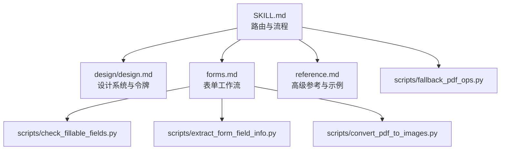
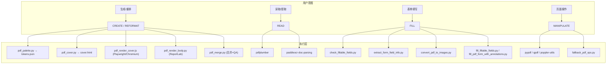
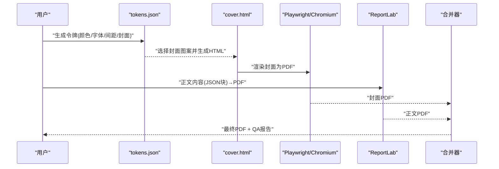
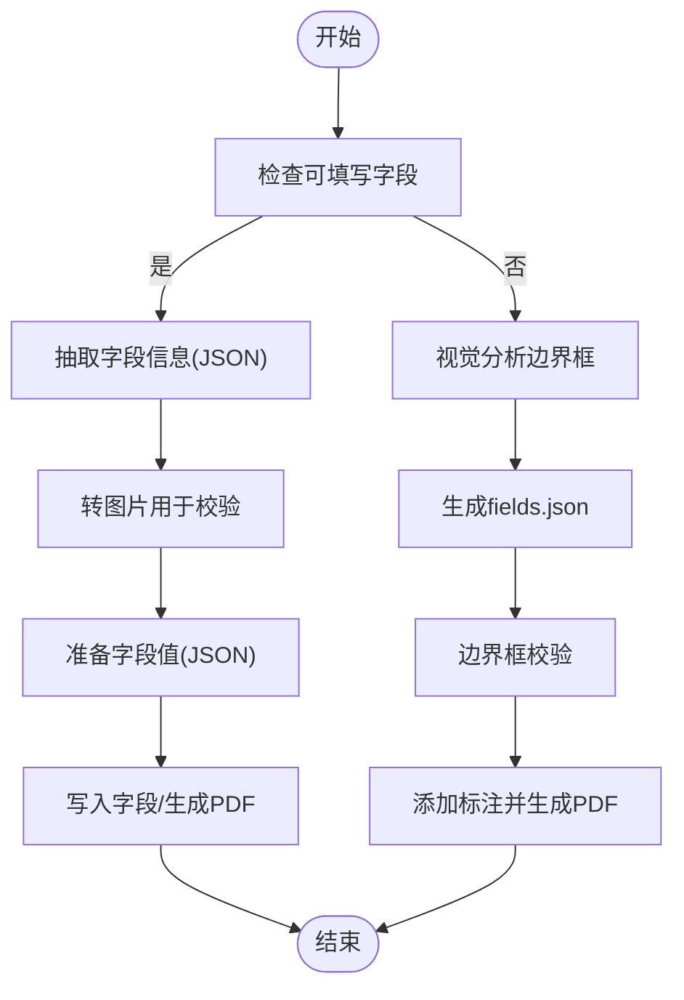
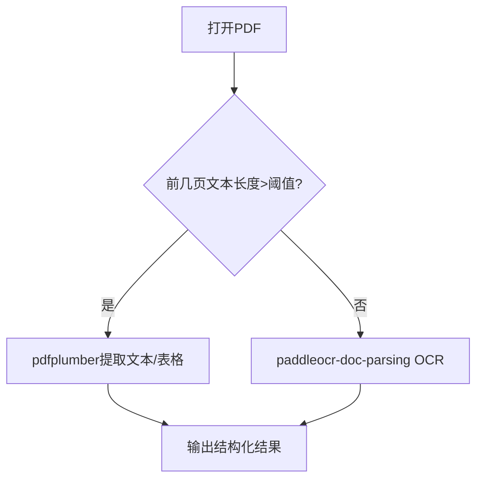
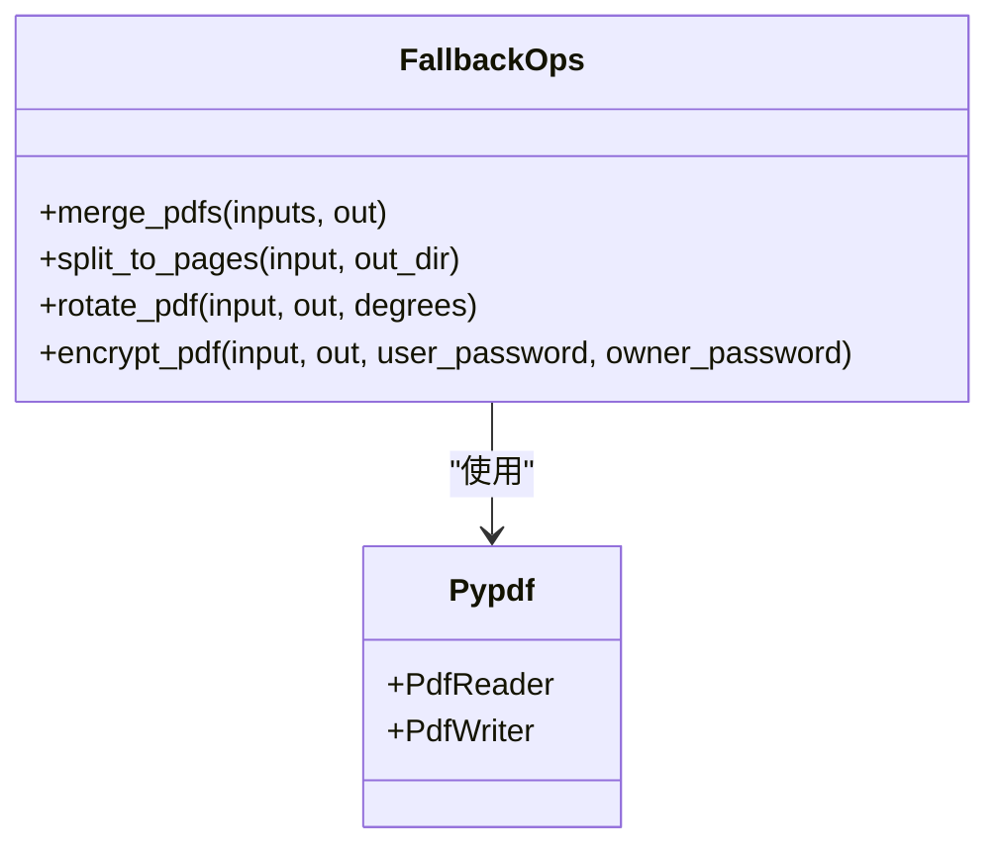
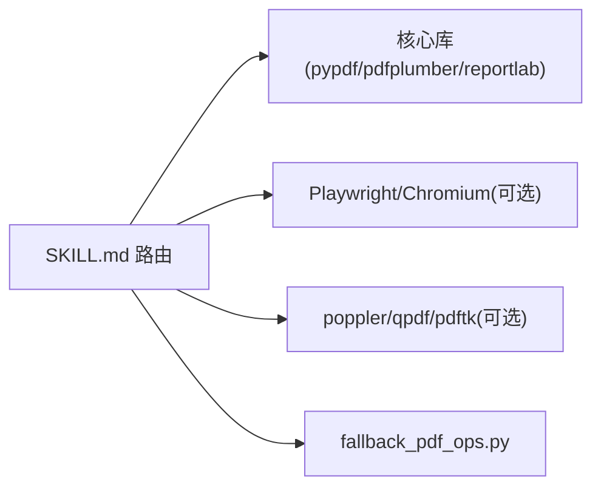

# PDF 文档处理技能

<cite>
**本文引用的文件**
- [SKILL.md](file://skills/pdf/SKILL.md)
- [forms.md](file://skills/pdf/forms.md)
- [reference.md](file://skills/pdf/reference.md)
- [design.md](file://skills/pdf/design/design.md)
- [check_fillable_fields.py](file://data/agent/managed-skills/pdf/scripts/check_fillable_fields.py)
- [convert_pdf_to_images.py](file://data/agent/managed-skills/pdf/scripts/convert_pdf_to_images.py)
- [extract_form_field_info.py](file://data/agent/managed-skills/pdf/scripts/extract_form_field_info.py)
- [fallback_pdf_ops.py](file://data/agent/managed-skills/pdf/scripts/fallback_pdf_ops.py)
</cite>

## 目录
1. [简介](#简介)
2. [项目结构](#项目结构)
3. [核心组件](#核心组件)
4. [架构总览](#架构总览)
5. [详细组件分析](#详细组件分析)
6. [依赖关系分析](#依赖关系分析)
7. [性能考虑](#性能考虑)
8. [故障排查指南](#故障排查指南)
9. [结论](#结论)
10. [附录](#附录)

## 简介
本技能提供端到端的 PDF 处理能力，覆盖生成、编辑、表单处理与设计模板四大方向：
- 生成与重排版：基于“令牌驱动”的设计系统，将内容描述转换为高质量封面与内页，支持多种文档类型与样式。
- 读取与提取：原生文本优先，扫描/复杂文档走 OCR；表格、坐标、元数据均可提取。
- 表单处理：可填写字段检测、字段信息抽取、值写入；无字段时通过标注（annotation）视觉填充。
- 操作与管理：合并、拆分、旋转、水印、加密、优化与修复等。

该技能强调“设计即内容”，所有样式由 tokens.json 驱动，确保一致性与可维护性。

**章节来源**
- [SKILL.md:1-289](file://skills/pdf/SKILL.md#L1-L289)

## 项目结构
PDF 技能以“说明文档 + 脚本工具”组织：
- 能力说明与流程：SKILL.md、forms.md、reference.md、design/design.md
- 表单相关脚本：check_fillable_fields.py、extract_form_field_info.py、convert_pdf_to_images.py
- 降级模式脚本：fallback_pdf_ops.py（纯 Python 实现基础操作）

**图表来源**
- [SKILL.md:1-289](file://skills/pdf/SKILL.md#L1-L289)
- [design.md:1-394](file://skills/pdf/design/design.md#L1-L394)
- [forms.md:1-206](file://skills/pdf/forms.md#L1-L206)
- [reference.md:1-660](file://skills/pdf/reference.md#L1-L660)
- [check_fillable_fields.py:1-13](file://data/agent/managed-skills/pdf/scripts/check_fillable_fields.py#L1-L13)
- [extract_form_field_info.py:1-153](file://data/agent/managed-skills/pdf/scripts/extract_form_field_info.py#L1-L153)
- [convert_pdf_to_images.py:1-135](file://data/agent/managed-skills/pdf/scripts/convert_pdf_to_images.py#L1-L135)
- [fallback_pdf_ops.py:1-167](file://data/agent/managed-skills/pdf/scripts/fallback_pdf_ops.py#L1-L167)

**章节来源**
- [SKILL.md:1-289](file://skills/pdf/SKILL.md#L1-L289)
- [forms.md:1-206](file://skills/pdf/forms.md#L1-L206)
- [reference.md:1-660](file://skills/pdf/reference.md#L1-L660)
- [design.md:1-394](file://skills/pdf/design/design.md#L1-L394)

## 核心组件
- 路由与流水线
  - CREATE：从内容到最终 PDF 的完整渲染管线（封面 HTML + Playwright 或 ReportLab Canvas 回退，ReportLab 生成正文，合并输出）。
  - REFORMAT：对已有文档应用设计系统重新排版。
  - READ：pdfplumber 优先，扫描/复杂文档使用 paddleocr-doc-parsing。
  - MANIPULATE：pypdf/qpdf/poppler-utils 组合完成合并、拆分、旋转、水印、加密等。
  - FILL：可填写字段检测 → 字段信息抽取 → 值写入；无字段则标注填充。
- 设计系统
  - 调色板、字体配对、间距、封面图案（13 种）、内页规则、块类型渲染规范。
- 表单工作流
  - 可填写字段判定、字段 JSON 导出、图像化校验、边界框验证、标注写入。

**章节来源**
- [SKILL.md:1-289](file://skills/pdf/SKILL.md#L1-L289)
- [design.md:1-394](file://skills/pdf/design/design.md#L1-L394)
- [forms.md:1-206](file://skills/pdf/forms.md#L1-L206)

## 架构总览
下图展示五大路由与关键脚本/库的交互关系。

**图表来源**
- [SKILL.md:1-289](file://skills/pdf/SKILL.md#L1-L289)
- [reference.md:1-660](file://skills/pdf/reference.md#L1-L660)
- [check_fillable_fields.py:1-13](file://data/agent/managed-skills/pdf/scripts/check_fillable_fields.py#L1-L13)
- [extract_form_field_info.py:1-153](file://data/agent/managed-skills/pdf/scripts/extract_form_field_info.py#L1-L153)
- [convert_pdf_to_images.py:1-135](file://data/agent/managed-skills/pdf/scripts/convert_pdf_to_images.py#L1-L135)
- [fallback_pdf_ops.py:1-167](file://data/agent/managed-skills/pdf/scripts/fallback_pdf_ops.py#L1-L167)

## 详细组件分析

### 组件A：创建与重排版（CREATE / REFORMAT）
- 输入：内容描述或 Markdown/JSON
- 处理：
  - 生成 tokens.json（颜色、字体、间距、封面图案）
  - 生成 cover.html（13 种图案之一），由 Playwright/Chromium 渲染为 cover.pdf
  - ReportLab 根据 tokens.json + content.json 生成 body.pdf
  - 合并封面与正文，输出 final.pdf 并生成 QA 报告
- 回退：若 Playwright 不可用，使用 ReportLab Canvas 模拟封面设计
- 设计约束：严格遵循 design/design.md 的配色、字体、间距与块渲染规则

**图表来源**
- [SKILL.md:1-289](file://skills/pdf/SKILL.md#L1-L289)
- [design.md:1-394](file://skills/pdf/design/design.md#L1-L394)

**章节来源**
- [SKILL.md:1-289](file://skills/pdf/SKILL.md#L1-L289)
- [design.md:1-394](file://skills/pdf/design/design.md#L1-L394)

### 组件B：表单处理（FILL）
- 可填写字段路径：
  - 检查是否含可填写字段（check_fillable_fields.py）
  - 抽取字段信息与边界框（extract_form_field_info.py）
  - 将 PDF 转为图片用于视觉校验（convert_pdf_to_images.py）
  - 准备 field_values.json 并调用填充脚本
- 非可填写字段路径：
  - 转换图片 → 人工标注 label/entry 边界框 → 生成 fields.json → 校验 → 添加标注
- 字段类型与值格式：text、checkbox、dropdown/radio、choice

**图表来源**
- [forms.md:1-206](file://skills/pdf/forms.md#L1-L206)
- [check_fillable_fields.py:1-13](file://data/agent/managed-skills/pdf/scripts/check_fillable_fields.py#L1-L13)
- [extract_form_field_info.py:1-153](file://data/agent/managed-skills/pdf/scripts/extract_form_field_info.py#L1-L153)
- [convert_pdf_to_images.py:1-135](file://data/agent/managed-skills/pdf/scripts/convert_pdf_to_images.py#L1-L135)

**章节来源**
- [forms.md:1-206](file://skills/pdf/forms.md#L1-L206)
- [check_fillable_fields.py:1-13](file://data/agent/managed-skills/pdf/scripts/check_fillable_fields.py#L1-L13)
- [extract_form_field_info.py:1-153](file://data/agent/managed-skills/pdf/scripts/extract_form_field_info.py#L1-L153)
- [convert_pdf_to_images.py:1-135](file://data/agent/managed-skills/pdf/scripts/convert_pdf_to_images.py#L1-L135)

### 组件C：读取与提取（READ）
- 决策树：
  - 先用 pdfplumber 尝试提取文本；若为空或乱码，切换至 paddleocr-doc-parsing
- 原生 PDF：
  - 文本提取、表格提取、字符级坐标
- 扫描/复杂文档：
  - 使用 OCR 能力进行结构化解析

**图表来源**
- [SKILL.md:1-289](file://skills/pdf/SKILL.md#L1-L289)
- [reference.md:1-660](file://skills/pdf/reference.md#L1-L660)

**章节来源**
- [SKILL.md:1-289](file://skills/pdf/SKILL.md#L1-L289)
- [reference.md:1-660](file://skills/pdf/reference.md#L1-L660)

### 组件D：页面操作与管理（MANIPULATE）
- 常用操作：合并、拆分、旋转、水印、加密、元数据读取
- 首选工具：pypdf、qpdf、poppler-utils
- 降级模式：fallback_pdf_ops.py（纯 pypdf 实现 merge/split/rotate/encrypt）

**图表来源**
- [fallback_pdf_ops.py:1-167](file://data/agent/managed-skills/pdf/scripts/fallback_pdf_ops.py#L1-L167)

**章节来源**
- [SKILL.md:1-289](file://skills/pdf/SKILL.md#L1-L289)
- [reference.md:1-660](file://skills/pdf/reference.md#L1-L660)
- [fallback_pdf_ops.py:1-167](file://data/agent/managed-skills/pdf/scripts/fallback_pdf_ops.py#L1-L167)

### 组件E：设计系统（Design System）
- 调色板逻辑：按内容语义选择背景、强调色、文字色
- 字体配对：最多两种字体，标题与正文字体分离
- 间距系统：外边距、段落间隔、行高
- 封面图案：13 种风格，CSS 要求严格（尺寸、溢出、定位）
- 内页规则：克制设计、强调色仅用于特定位置、表格/引用/代码块渲染规范

**章节来源**
- [design.md:1-394](file://skills/pdf/design/design.md#L1-L394)

## 依赖关系分析
- Python 包：pypdf、pdfplumber、reportlab、Pillow、pypdfium2、matplotlib
- Node.js（可选）：playwright + Chromium（封面渲染）
- 系统 CLI（可选）：poppler-utils、qpdf、pdftk
- 降级策略：当依赖缺失时，优先安装；失败则进入预定义降级脚本

**图表来源**
- [SKILL.md:1-289](file://skills/pdf/SKILL.md#L1-L289)
- [reference.md:1-660](file://skills/pdf/reference.md#L1-L660)
- [fallback_pdf_ops.py:1-167](file://data/agent/managed-skills/pdf/scripts/fallback_pdf_ops.py#L1-L167)

**章节来源**
- [SKILL.md:1-289](file://skills/pdf/SKILL.md#L1-L289)
- [reference.md:1-660](file://skills/pdf/reference.md#L1-L660)

## 性能考虑
- 大文件处理：分块处理、逐页渲染、避免一次性加载全部内存
- 文本提取：优先 pdftotext -bbox-layout；pdfplumber 适合结构化数据；避免对超大文档使用低效 API
- 图像提取：pdfimages 最快；预览用低分辨率，成品用高分辨率
- 表单填充：pdf-lib 保持表单结构更稳定；预处理字段校验
- 内存管理：按 chunk 处理 PDF，及时释放资源

[本节为通用指导，不直接分析具体文件]

## 故障排查指南
- 加密 PDF：先解密再处理；注意权限限制
- 损坏 PDF：使用 qpdf 检查与修复
- 文本提取异常：扫描/图像型 PDF 走 OCR；多栏/密集表格需特殊设置
- 依赖缺失：优先安装；失败则启用降级脚本（如 fallback_pdf_ops.py）
- 表单填充失败：核对字段 ID、值格式、边界框；使用校验脚本与可视化验证

**章节来源**
- [reference.md:1-660](file://skills/pdf/reference.md#L1-L660)
- [forms.md:1-206](file://skills/pdf/forms.md#L1-L206)
- [fallback_pdf_ops.py:1-167](file://data/agent/managed-skills/pdf/scripts/fallback_pdf_ops.py#L1-L167)

## 结论
本技能以“令牌驱动的设计系统”为核心，统一了 PDF 生成、重排版、读取提取、表单处理与页面操作的流程。通过明确的优先级与降级策略，在依赖缺失或环境受限情况下仍能保持稳定输出。建议在生产环境中优先安装推荐依赖以获得最佳质量与性能，并在关键路径上加入校验与日志记录。

[本节为总结性内容，不直接分析具体文件]

## 附录
- 快速参考
  - 生成高质量 PDF：使用 CREATE 流水线
  - 提取文本/表格：pdfplumber
  - 扫描文档 OCR：paddleocr-doc-parsing
  - 合并/拆分/旋转/加密：pypdf 或 qpdf
  - 表单填写：inspect → extract → fill
  - 重排版：REFORMAT 流水线
- 实用命令与脚本
  - 检查可填写字段：check_fillable_fields.py
  - 抽取字段信息：extract_form_field_info.py
  - PDF 转图片：convert_pdf_to_images.py
  - 降级操作：fallback_pdf_ops.py

**章节来源**
- [SKILL.md:1-289](file://skills/pdf/SKILL.md#L1-L289)
- [reference.md:1-660](file://skills/pdf/reference.md#L1-L660)
- [forms.md:1-206](file://skills/pdf/forms.md#L1-L206)