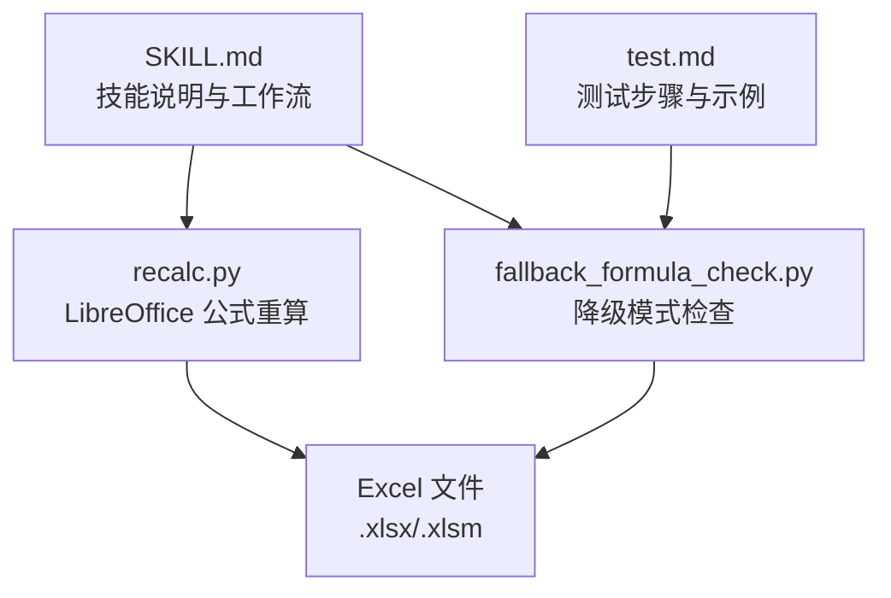
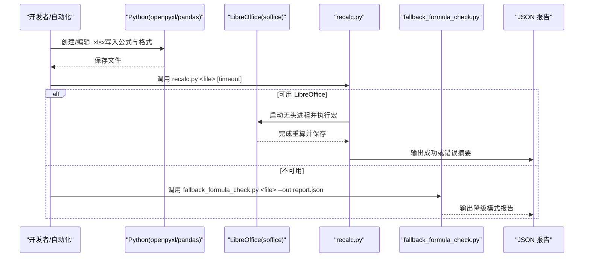
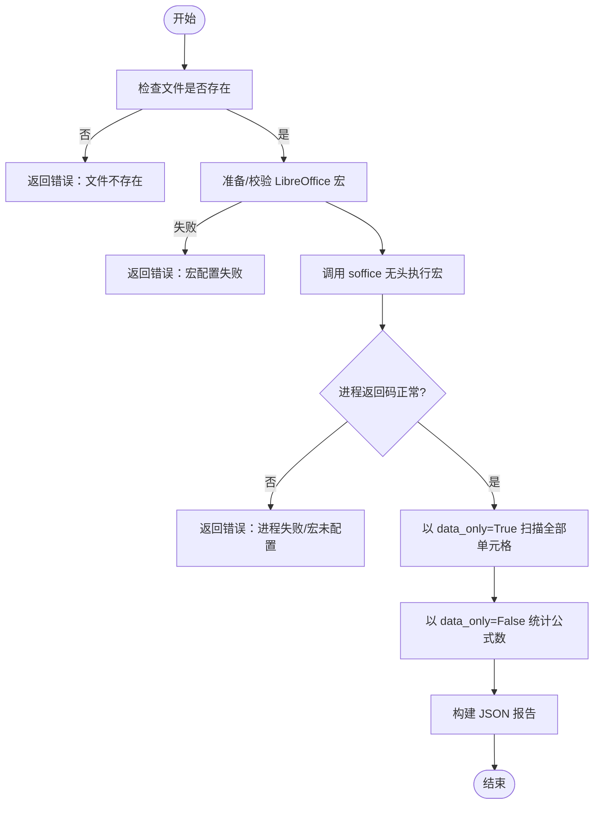
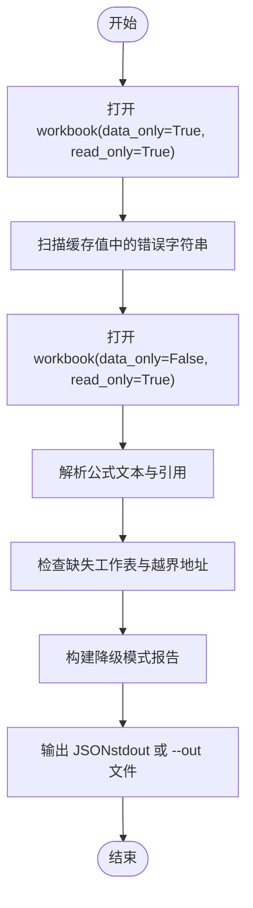
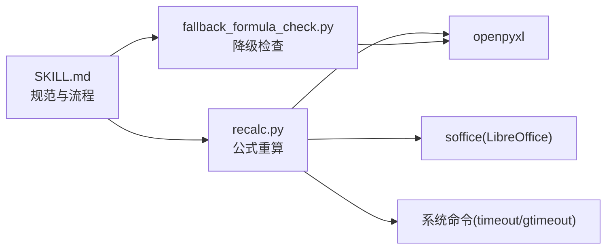

# XLSX 电子表格技能

<cite>
**本文引用的文件**   
- [skills/xlsx/SKILL.md](file://skills/xlsx/SKILL.md)
- [skills/xlsx/recalc.py](file://skills/xlsx/recalc.py)
- [data/agent/managed-skills/xlsx/recalc.py](file://data/agent/managed-skills/xlsx/recalc.py)
- [data/agent/managed-skills/xlsx/scripts/fallback_formula_check.py](file://data/agent/managed-skills/xlsx/scripts/fallback_formula_check.py)
- [data/agent/managed-skills/xlsx/scripts/test.md](file://data/agent/managed-skills/xlsx/scripts/test.md)
</cite>

## 目录
1. [简介](#简介)
2. [项目结构](#项目结构)
3. [核心组件](#核心组件)
4. [架构总览](#架构总览)
5. [详细组件分析](#详细组件分析)
6. [依赖关系分析](#依赖关系分析)
7. [性能与内存优化](#性能与内存优化)
8. [故障排查指南](#故障排查指南)
9. [结论](#结论)
10. [附录：API 参考与使用模式](#附录api-参考与使用模式)

## 简介
本技能提供完整的 Excel（.xlsx/.xlsm）与 CSV/TSV 等电子表格文件的创建、编辑、分析与公式计算能力。重点覆盖：
- 工作表操作、单元格格式化、图表生成与数据透视表处理
- 公式引擎集成与验证、数据验证与条件格式设置
- 批量数据处理、性能优化与内存管理策略
- 与其他数据格式的转换、错误处理与兼容性支持
- 数据清洗、报表生成与分析工具集成的最佳实践

## 项目结构
该技能位于 skills/xlsx 目录，包含使用说明文档与公式重算脚本；同时存在受管版本 data/agent/managed-skills/xlsx 下的相同脚本与测试说明。整体组织如下：
- SKILL.md：技能说明、工作流、最佳实践与代码风格要求
- recalc.py：通过 LibreOffice 对 Excel 公式进行重算并输出错误报告
- fallback_formula_check.py：在 LibreOffice 不可用时的降级检查脚本
- test.md：fallback 模式的测试步骤与预期输出

**图示来源**
- [skills/xlsx/SKILL.md:1-314](file://skills/xlsx/SKILL.md#L1-L314)
- [skills/xlsx/recalc.py:1-178](file://skills/xlsx/recalc.py#L1-L178)
- [data/agent/managed-skills/xlsx/scripts/fallback_formula_check.py:1-334](file://data/agent/managed-skills/xlsx/scripts/fallback_formula_check.py#L1-L334)
- [data/agent/managed-skills/xlsx/scripts/test.md:1-56](file://data/agent/managed-skills/xlsx/scripts/test.md#L1-L56)

**章节来源**
- [skills/xlsx/SKILL.md:1-314](file://skills/xlsx/SKILL.md#L1-L314)

## 核心组件
- 技能说明与规范（SKILL.md）
  - 定义“零公式错误”目标、模板合规、财务模型颜色与数字格式规范
  - 明确“优先使用 Excel 公式而非 Python 硬编码值”的原则
  - 推荐 pandas 用于数据分析与导出，openpyxl 用于复杂格式与公式
  - 规定必须使用 recalc.py 进行公式重算与错误扫描
- 公式重算脚本（recalc.py）
  - 自动配置 LibreOffice 宏，调用 soffice 无头模式执行 calculateAll()
  - 全表扫描缓存结果，统计各类 Excel 错误位置与数量
  - 输出 JSON 报告，包含状态、错误总数、公式总数与错误分类
- 降级检查脚本（fallback_formula_check.py）
  - 不依赖 LibreOffice，仅用 openpyxl 做静态检查与缓存值扫描
  - 检测缺失工作表引用、越界单元格地址等常见问题
  - 输出带“降级模式”标记的 JSON 报告，提示安装 LibreOffice 以获得权威结果
- 测试说明（test.md）
  - 提供 sample.xlsx 构造与 fallback 运行步骤
  - 指导如何解读 report.json 中的降级模式字段与错误摘要

**章节来源**
- [skills/xlsx/SKILL.md:1-314](file://skills/xlsx/SKILL.md#L1-L314)
- [skills/xlsx/recalc.py:1-178](file://skills/xlsx/recalc.py#L1-L178)
- [data/agent/managed-skills/xlsx/scripts/fallback_formula_check.py:1-334](file://data/agent/managed-skills/xlsx/scripts/fallback_formula_check.py#L1-L334)
- [data/agent/managed-skills/xlsx/scripts/test.md:1-56](file://data/agent/managed-skills/xlsx/scripts/test.md#L1-L56)

## 架构总览
下图展示从 Python 生成/修改 Excel 到公式重算与错误校验的整体流程，以及降级模式的分支路径。

**图示来源**
- [skills/xlsx/recalc.py:1-178](file://skills/xlsx/recalc.py#L1-L178)
- [data/agent/managed-skills/xlsx/scripts/fallback_formula_check.py:1-334](file://data/agent/managed-skills/xlsx/scripts/fallback_formula_check.py#L1-L334)

## 详细组件分析

### 组件一：公式重算与错误扫描（recalc.py）
- 功能要点
  - 自动准备 LibreOffice Basic 宏（Module1.xba），确保首次运行即可用
  - 通过命令行调用 soffice 无头模式，执行 calculateAll() 并重写文件
  - 以 data_only=True 打开文件，遍历所有工作表与单元格，匹配常见错误字符串
  - 统计公式总数（data_only=False 再次打开），汇总错误类型与位置（最多前 20 条）
  - 返回结构化 JSON，便于上层自动化处理与告警
- 关键实现细节
  - 跨平台超时控制（Linux 使用 timeout，macOS 尝试 gtimeout）
  - 错误集合包括 #VALUE!、#DIV/0!、#REF!、#NAME?、#NULL!、#NUM!、#N/A
  - 异常与错误信息区分（如宏未配置、子进程失败、文件不存在）
- 适用场景
  - 任何包含公式的 .xlsx/.xlsm 文件在生成或修改后必须执行
  - CI/CD 中作为质量门禁，保证交付文件零公式错误

**图示来源**
- [skills/xlsx/recalc.py:1-178](file://skills/xlsx/recalc.py#L1-L178)

**章节来源**
- [skills/xlsx/recalc.py:1-178](file://skills/xlsx/recalc.py#L1-L178)

### 组件二：降级模式检查（fallback_formula_check.py）
- 功能要点
  - 当 LibreOffice 不可用时，提供纯 Python + openpyxl 的最佳努力检查
  - 扫描缓存值中的错误字符串（data_only=True）
  - 解析公式文本，检测跨工作表引用是否缺失、单元格地址是否越界
  - 输出带“degraded_mode=true”的 JSON 报告，明确无法保证零错误
- 关键实现细节
  - 正则表达式解析 A1 样式地址与跨表引用
  - 限制扫描公式数量以避免性能问题（默认上限）
  - 结构化输出：缓存错误摘要、静态检查问题、注意事项与建议
- 适用场景
  - 开发环境快速自检
  - 无法安装 LibreOffice 时的临时替代方案

**图示来源**
- [data/agent/managed-skills/xlsx/scripts/fallback_formula_check.py:1-334](file://data/agent/managed-skills/xlsx/scripts/fallback_formula_check.py#L1-L334)

**章节来源**
- [data/agent/managed-skills/xlsx/scripts/fallback_formula_check.py:1-334](file://data/agent/managed-skills/xlsx/scripts/fallback_formula_check.py#L1-L334)

### 组件三：技能规范与工作流（SKILL.md）
- 核心原则
  - 零公式错误：交付前必须通过 recalc.py 验证
  - 模板合规：禁止擅自修改表头行，除非获得明确授权
  - 财务模型规范：颜色编码、数字格式、假设放置与公式构建规则
  - 优先使用 Excel 公式：避免在 Python 中硬编码计算结果
- 常用工作流
  - 选择工具：pandas 用于数据读写与分析，openpyxl 用于复杂格式与公式
  - 创建/加载：新建工作簿或加载现有文件
  - 修改：添加/编辑数据、公式与格式
  - 保存：写出文件
  - 重算：强制使用 recalc.py 重算并检查错误
  - 修复：根据 JSON 报告定位并修正错误，必要时重复重算
- 最佳实践
  - 大文件读取/写入使用 read_only/write_only 模式
  - 谨慎使用 data_only=True 打开并保存，以免丢失公式
  - 指定数据类型与列范围以提升性能与准确性

**章节来源**
- [skills/xlsx/SKILL.md:1-314](file://skills/xlsx/SKILL.md#L1-L314)

## 依赖关系分析
- 外部依赖
  - LibreOffice（soffice）：用于真实公式重算与错误检测
  - openpyxl：用于读写 .xlsx 与解析公式文本
  - pandas：用于数据分析与导出（可选）
- 内部依赖
  - recalc.py 依赖 openpyxl 与系统命令（timeout/gtimeout）
  - fallback_formula_check.py 依赖 openpyxl 与正则表达式
  - SKILL.md 为规范与流程指引，驱动脚本使用方式

**图示来源**
- [skills/xlsx/SKILL.md:1-314](file://skills/xlsx/SKILL.md#L1-L314)
- [skills/xlsx/recalc.py:1-178](file://skills/xlsx/recalc.py#L1-L178)
- [data/agent/managed-skills/xlsx/scripts/fallback_formula_check.py:1-334](file://data/agent/managed-skills/xlsx/scripts/fallback_formula_check.py#L1-L334)

**章节来源**
- [skills/xlsx/SKILL.md:1-314](file://skills/xlsx/SKILL.md#L1-L314)
- [skills/xlsx/recalc.py:1-178](file://skills/xlsx/recalc.py#L1-L178)
- [data/agent/managed-skills/xlsx/scripts/fallback_formula_check.py:1-334](file://data/agent/managed-skills/xlsx/scripts/fallback_formula_check.py#L1-L334)

## 性能与内存优化
- 大文件处理
  - 使用 openpyxl 的 read_only=True 与 write_only=True 降低内存占用
  - 使用 pandas 的 usecols 与 dtype 指定列与类型，减少不必要的数据加载与推断开销
- 公式重算
  - 合理设置 recalc.py 的超时参数，避免长时间阻塞
  - 在 CI 环境中缓存 LibreOffice 宏，避免重复初始化
- 降级检查
  - 限制扫描公式数量（max-formula-cells）防止性能退化
  - 仅扫描必要的错误类型与位置（max-locations）

[本节为通用指导，无需特定文件来源]

## 故障排查指南
- 常见问题与定位
  - 文件不存在：recalc.py 直接返回错误消息
  - LibreOffice 宏未配置：返回“宏未正确配置”的错误
  - 子进程失败：捕获 stderr 并返回具体错误信息
  - 公式错误：JSON 报告中按错误类型列出位置与计数
- 降级模式提示
  - 若未安装 LibreOffice，fallback 脚本会输出“降级模式”报告
  - 建议安装 LibreOffice 后重新运行 recalc.py 获取权威结果
- 测试与验证
  - 使用 test.md 提供的 sample.xlsx 构造方法，验证 fallback 行为
  - 检查 report.json 中的 degraded_mode、cached_error_summary 与 static_checks 字段

**章节来源**
- [skills/xlsx/recalc.py:1-178](file://skills/xlsx/recalc.py#L1-L178)
- [data/agent/managed-skills/xlsx/scripts/fallback_formula_check.py:1-334](file://data/agent/managed-skills/xlsx/scripts/fallback_formula_check.py#L1-L334)
- [data/agent/managed-skills/xlsx/scripts/test.md:1-56](file://data/agent/managed-skills/xlsx/scripts/test.md#L1-L56)

## 结论
本技能围绕“零公式错误”的目标，构建了从 Python 生成/编辑 Excel 到公式重算与错误校验的完整闭环。通过 recalc.py 与 fallback_formula_check.py 的双通道保障，既能在生产环境确保质量，也能在受限环境下提供可操作的诊断信息。配合 SKILL.md 的规范与最佳实践，可有效提升电子表格处理的可靠性与效率。

[本节为总结性内容，无需特定文件来源]

## 附录：API 参考与使用模式
- 命令行接口
  - recalc.py
    - 用法：python recalc.py <excel_file> [timeout_seconds]
    - 输出：JSON（status、total_errors、total_formulas、error_summary）
  - fallback_formula_check.py
    - 用法：python scripts/fallback_formula_check.py <excel_file> [--out report.json] [--max-locations N] [--max-formula-cells M]
    - 输出：JSON（degraded_mode、guarantee、cached_error_summary、static_checks）
- 使用模式
  - 创建新文件：使用 openpyxl 创建工作簿、写入数据与公式，保存后调用 recalc.py
  - 编辑现有文件：load_workbook 保留公式与格式，修改后保存并调用 recalc.py
  - 数据分析：pandas 读取/分析/导出，必要时结合 openpyxl 进行最终格式化
  - 批量处理：循环多个文件，统一重算与校验，收集 JSON 报告进行聚合分析
- 兼容性与转换
  - 支持 .xlsx/.xlsm 及 CSV/TSV（通过 pandas）
  - 与 LibreOffice 集成需确保 soffice 可用；否则回退至降级模式

**章节来源**
- [skills/xlsx/SKILL.md:1-314](file://skills/xlsx/SKILL.md#L1-L314)
- [skills/xlsx/recalc.py:1-178](file://skills/xlsx/recalc.py#L1-L178)
- [data/agent/managed-skills/xlsx/scripts/fallback_formula_check.py:1-334](file://data/agent/managed-skills/xlsx/scripts/fallback_formula_check.py#L1-L334)