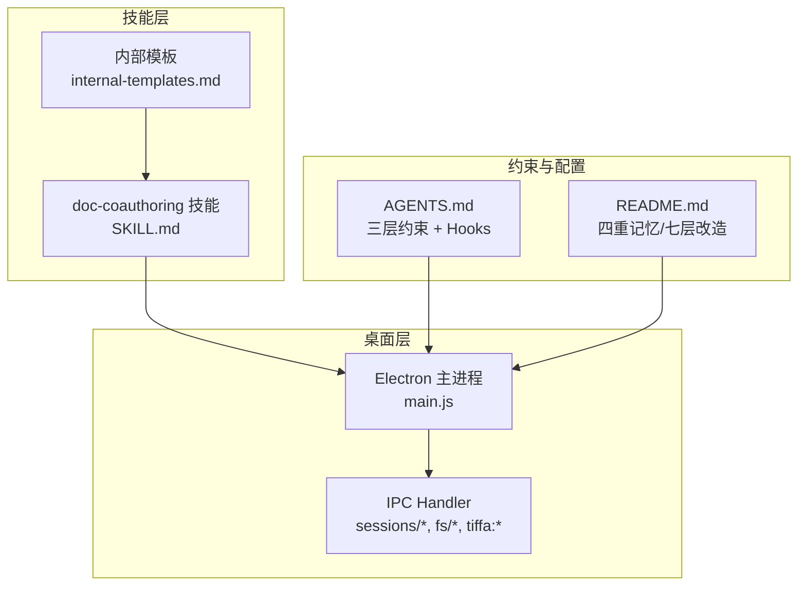
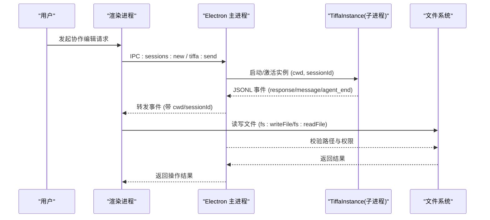
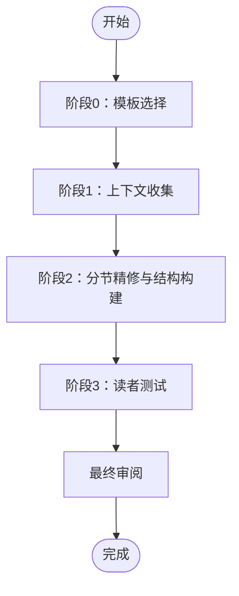
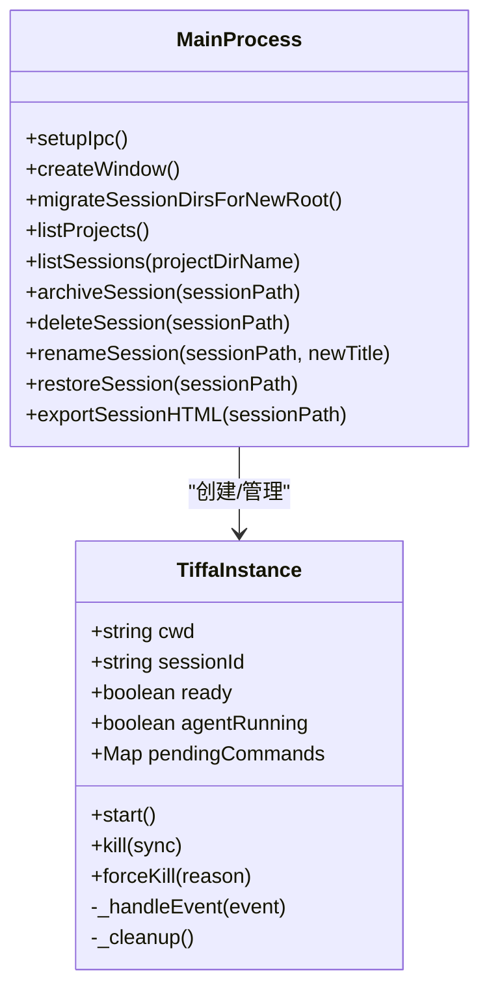
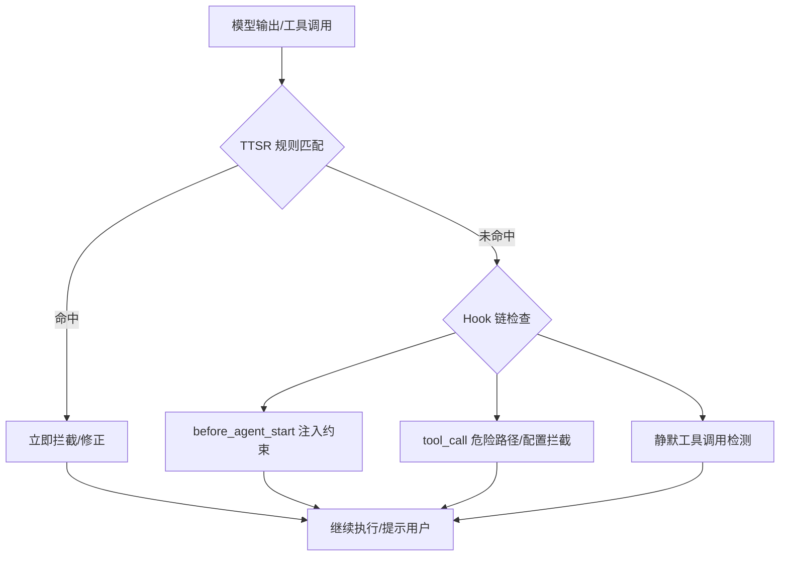
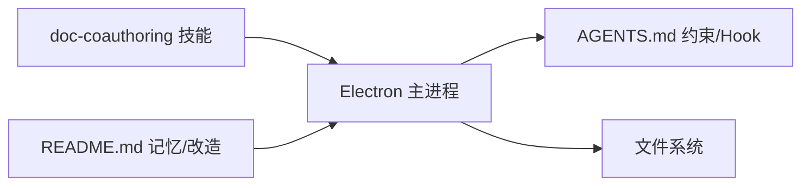

# 文档协作编辑技能

<cite>
**本文引用的文件**   
- [skills/doc-coauthoring/SKILL.md](file://skills/doc-coauthoring/SKILL.md)
- [skills/doc-coauthoring/references/internal-templates.md](file://skills/doc-coauthoring/references/internal-templates.md)
- [electron/main.js](file://electron/main.js)
- [AGENTS.md](file://AGENTS.md)
- [README.md](file://README.md)
</cite>

## 目录
1. [简介](#简介)
2. [项目结构](#项目结构)
3. [核心组件](#核心组件)
4. [架构总览](#架构总览)
5. [详细组件分析](#详细组件分析)
6. [依赖关系分析](#依赖关系分析)
7. [性能与实时体验优化](#性能与实时体验优化)
8. [故障排查指南](#故障排查指南)
9. [结论](#结论)
10. [附录：API 与扩展点](#附录api-与扩展点)

## 简介
本技能聚焦“文档协作编辑”的端到端能力，围绕多人协作、冲突解决、版本控制、同步策略、变更追踪与合并算法进行系统化说明。结合仓库中的“文档辅写（doc-coauthoring）”技能与 Electron 主进程会话管理，提供可落地的集成方案、API 接口与扩展点，并给出团队协作最佳实践与工作流设计指南。

## 项目结构
- 技能层：skills/doc-coauthoring 定义了结构化协作写作流程、模板选择与读者测试等阶段化工作流；references/internal-templates.md 提供内部模板映射与章节规范。
- 桌面层：electron/main.js 实现 Tiffa 实例管理、IPC 通信、会话/项目生命周期管理与事件转发，为协作编辑提供稳定的本地运行时基础。
- 规则与约束：AGENTS.md 描述三层约束体系（TTSR 规则、行为约束、工具调用拦截），保障协作过程中的安全与一致性。
- 产品概览：README.md 阐述四重记忆、七层改造、弱模型增强等底层能力，为协作编辑提供稳定可靠的运行环境。

**图表来源** 
- [skills/doc-coauthoring/SKILL.md](file://skills/doc-coauthoring/SKILL.md)
- [skills/doc-coauthoring/references/internal-templates.md](file://skills/doc-coauthoring/references/internal-templates.md)
- [electron/main.js](file://electron/main.js)
- [AGENTS.md](file://AGENTS.md)
- [README.md](file://README.md)

**章节来源**
- [skills/doc-coauthoring/SKILL.md](file://skills/doc-coauthoring/SKILL.md)
- [skills/doc-coauthoring/references/internal-templates.md](file://skills/doc-coauthoring/references/internal-templates.md)
- [electron/main.js](file://electron/main.js)
- [AGENTS.md](file://AGENTS.md)
- [README.md](file://README.md)

## 核心组件
- 文档协作工作流（doc-coauthoring）
  - 四阶段工作流：模板选择 → 上下文收集 → 分节精修与结构构建 → 读者测试
  - 内部模板优先：按国内/西方类型映射到标准小节结构，确保输出规范化
  - 迭代式创作：每节通过澄清问题、头脑风暴、筛选、草稿与精炼循环推进
- 会话与项目管理（Electron 主进程）
  - 多实例管理：每个项目/对话独立子进程，支持 LRU 淘汰、崩溃自动重启、stall 检测
  - 会话持久化：JSONL 存储会话历史，支持归档、恢复、删除、重命名与导出 HTML
  - IPC 通道：统一命令/事件协议，渲染进程与内核交互，附带 cwd/sessionId 标记
- 约束与权限（AGENTS.md）
  - TTSR 规则：零 Context 成本，流式匹配，违规即时拦截
  - Hook 链：before_agent_start/tool_call/session.compacting 等钩子注入行为与安全策略
  - 危险路径/配置文件自改拦截，静默工具调用检测

**章节来源**
- [skills/doc-coauthoring/SKILL.md](file://skills/doc-coauthoring/SKILL.md)
- [skills/doc-coauthoring/references/internal-templates.md](file://skills/doc-coauthoring/references/internal-templates.md)
- [electron/main.js](file://electron/main.js)
- [AGENTS.md](file://AGENTS.md)

## 架构总览
协作编辑在本地以“技能驱动 + 桌面运行时”的方式实现：技能定义协作流程与模板，主进程负责会话生命周期、事件转发与文件系统访问，约束系统保证安全与一致性。

**图表来源**
- [electron/main.js](file://electron/main.js)

**章节来源**
- [electron/main.js](file://electron/main.js)

## 详细组件分析

### 文档协作工作流（doc-coauthoring）
- 触发条件：用户提及写文档/提案/技术规格等任务时主动引导结构化协作
- 阶段 0：模板选择
  - 优先使用内部模板（国内常见类型与西方通用类型），若用户提供自定义模板则以其为准
- 阶段 1：上下文收集
  - 明确受众、目标、影响与约束；鼓励信息倾倒与多渠道引用
- 阶段 2：分节精修与结构构建
  - 按模板小节生成占位符，依据“工作逻辑”推荐填写顺序（如背景→方案→实施→风险）
  - 每节遵循“澄清问题 → 头脑风暴 → 筛选 → 草稿 → 精炼”的闭环
- 阶段 3：读者测试
  - 预测读者问题，用隔离实例或外部助手验证理解度与歧义性，修复盲点

**图表来源**
- [skills/doc-coauthoring/SKILL.md](file://skills/doc-coauthoring/SKILL.md)
- [skills/doc-coauthoring/references/internal-templates.md](file://skills/doc-coauthoring/references/internal-templates.md)

**章节来源**
- [skills/doc-coauthoring/SKILL.md](file://skills/doc-coauthoring/SKILL.md)
- [skills/doc-coauthoring/references/internal-templates.md](file://skills/doc-coauthoring/references/internal-templates.md)

### 会话与项目管理（Electron 主进程）
- 实例管理
  - 每个 TiffaInstance 对应一个项目/对话，维护进程、就绪状态、命令队列与活动计时
  - 崩溃自动重启（最多 N 次）、stall 检测与强制终止
- IPC 处理
  - 提供 sessions/*、fs/*、tiffa:* 等处理器，统一 JSONL 协议
  - 事件转发携带 cwd/sessionId，便于前端区分来源与会话
- 会话持久化
  - JSONL 格式存储会话头与消息，支持归档、恢复、删除、重命名与导出 HTML

**图表来源**
- [electron/main.js](file://electron/main.js)

**章节来源**
- [electron/main.js](file://electron/main.js)

### 约束与权限（AGENTS.md）
- 第一层：TTSR 规则（零 Context 成本）
  - 覆盖文本与工具调用场景，违规即时拦截，不占用 token
- 第二层：行为约束（before_agent_start 注入）
  - 读文件规范、失败重试策略、skill 铁律、沟通风格、安全铁律
- 第三层：工具调用拦截（tool_call hook）
  - 危险路径、配置文件自改、workspace 根目录新建一级子目录拦截
  - 静默工具调用检测（连续 3 次无文字说明 → steer 提醒）

**图表来源**
- [AGENTS.md](file://AGENTS.md)

**章节来源**
- [AGENTS.md](file://AGENTS.md)

## 依赖关系分析
- 技能层依赖 Electron 主进程提供的会话与文件系统能力，用于创建/编辑/导出文档
- 主进程依赖 AGENTS.md 定义的约束与 Hook 机制，确保协作过程的安全性与一致性
- 四重记忆与七层改造为协作编辑提供稳定运行环境与上下文管理能力

**图表来源**
- [skills/doc-coauthoring/SKILL.md](file://skills/doc-coauthoring/SKILL.md)
- [electron/main.js](file://electron/main.js)
- [AGENTS.md](file://AGENTS.md)
- [README.md](file://README.md)

**章节来源**
- [skills/doc-coauthoring/SKILL.md](file://skills/doc-coauthoring/SKILL.md)
- [electron/main.js](file://electron/main.js)
- [AGENTS.md](file://AGENTS.md)
- [README.md](file://README.md)

## 性能与实时体验优化
- 事件转发与过滤
  - 预热期间过滤噪音事件，避免渲染进程抖动
  - 逐行解析 JSONL，降低内存峰值与解析开销
- 实例生命周期
  - LRU 淘汰与 stall 检测，防止资源耗尽
  - 崩溃自动重启与强制终止，提升稳定性
- 文件 I/O
  - 写入前校验路径（PORTABLE_ROOT 内），减少非法操作
  - 会话导出批量拼接 HTML，减少多次 IO

[本节为通用指导，无需特定文件来源]

## 故障排查指南
- 会话无法列出/打开
  - 检查 sessions:listSessions 是否返回空数组或错误
  - 确认 session 文件存在且为 .jsonl 格式
- 会话归档/恢复失败
  - 检查目标目录是否存在，权限是否足够
  - 冲突文件名会自动加时间戳后缀，确认最终路径
- 导出 HTML 为空
  - 检查会话内容是否为空或仅包含非文本消息
  - 确认导出路径可写
- 子进程频繁退出
  - 查看 tiffa:exited 事件中的 code/signal/userKilled/crashCount
  - 根据 crashCount 判断是否需要调整最大重启次数

**章节来源**
- [electron/main.js](file://electron/main.js)

## 结论
本技能将“结构化协作工作流”与“稳定桌面运行时”相结合，提供从模板选择、上下文收集、分节精修到读者测试的完整链路。通过 Electron 主进程的会话管理与约束系统，确保协作编辑的安全性、一致性与可追溯性。未来可扩展实时同步、冲突检测与合并算法，进一步提升多人协作体验。

[本节为总结性内容，无需特定文件来源]

## 附录：API 与扩展点

### 会话管理 API（IPC）
- sessions:listProjects：列出项目（含会话数、最近活动时间）
- sessions:listSessions：列出某项目的会话（按时间正序）
- sessions:switch：切换活跃会话
- sessions:new：创建新会话
- sessions:loadHistory：加载会话历史
- sessions:archiveProject / sessions:deleteProject：归档/删除项目
- sessions:listArchived / sessions:restoreProject：列出归档项目/恢复项目
- sessions:archiveSession / sessions:deleteSession：归档/删除单会话
- sessions:rename：重命名会话标题
- sessions:getUserEntries：读取用户消息列表（用于分支功能）
- sessions:exportHTML：导出会话为 HTML

### 文件系统 API（IPC）
- fs:listDir：列出目录
- fs:readFile：读取文件（含图片）
- fs:writeFile：写入文件（限制 PORTABLE_ROOT 内）

### 协作编辑扩展点
- 模板扩展：在 internal-templates.md 中新增模板类型与章节映射
- 工作流扩展：在 SKILL.md 的阶段 2 中增加新的分节策略或质量检查步骤
- 约束扩展：在 AGENTS.md 中新增 TTSR 规则或 Hook 行为
- 实时同步扩展：在主进程中新增 WebSocket/Socket.IO 通道，实现多客户端增量同步与冲突检测

**章节来源**
- [electron/main.js](file://electron/main.js)
- [skills/doc-coauthoring/references/internal-templates.md](file://skills/doc-coauthoring/references/internal-templates.md)
- [skills/doc-coauthoring/SKILL.md](file://skills/doc-coauthoring/SKILL.md)
- [AGENTS.md](file://AGENTS.md)