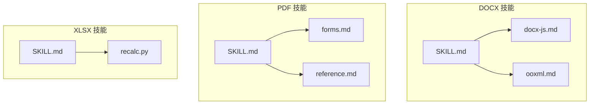
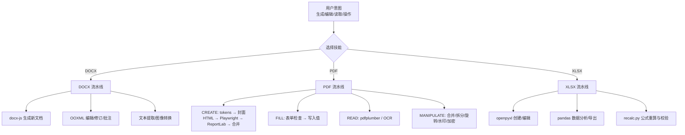
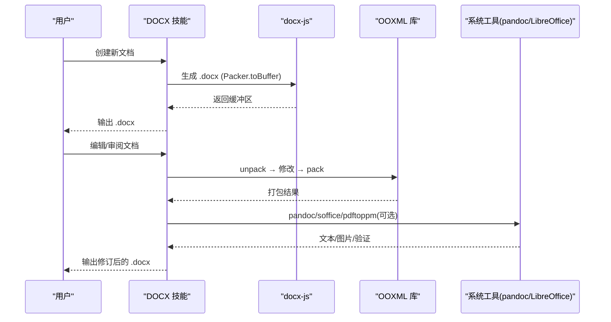
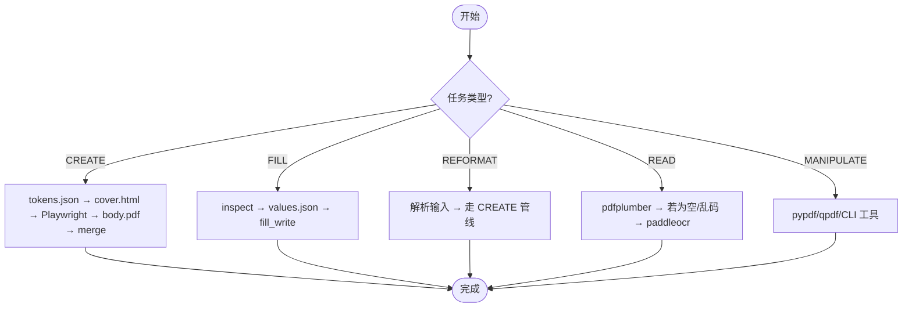
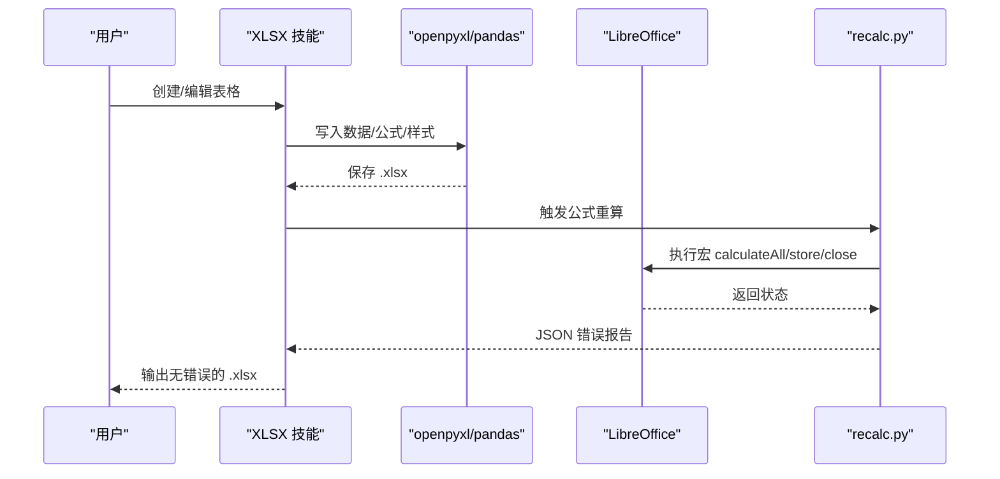
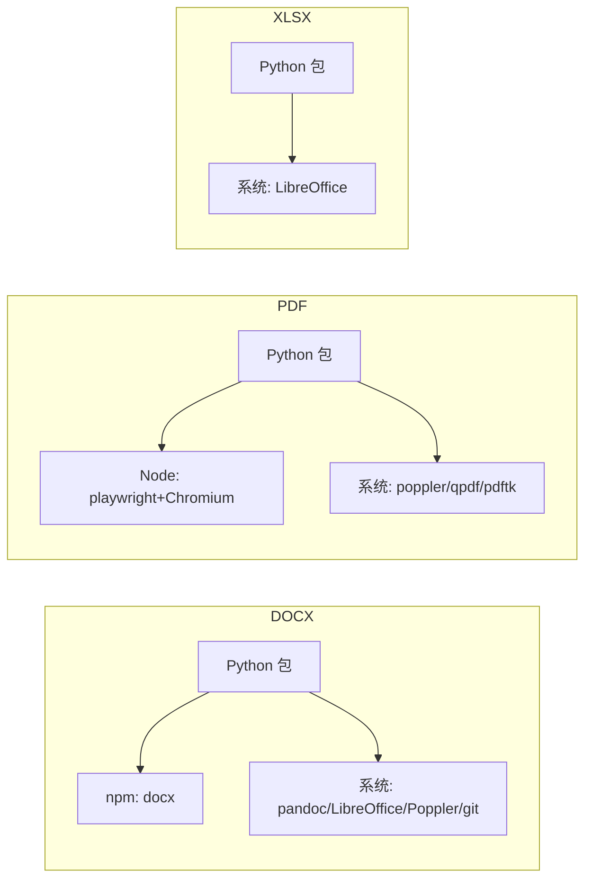

# 文档处理技能

<cite>
**本文引用的文件**   
- [skills/docx/SKILL.md](file://skills/docx/SKILL.md)
- [skills/docx/docx-js.md](file://skills/docx/docx-js.md)
- [skills/docx/ooxml.md](file://skills/docx/ooxml.md)
- [data/agent/managed-skills/docx/SKILL.md](file://data/agent/managed-skills/docx/SKILL.md)
- [skills/pdf/SKILL.md](file://skills/pdf/SKILL.md)
- [skills/pdf/forms.md](file://skills/pdf/forms.md)
- [skills/pdf/reference.md](file://skills/pdf/reference.md)
- [data/agent/managed-skills/pdf/SKILL.md](file://data/agent/managed-skills/pdf/SKILL.md)
- [skills/xlsx/SKILL.md](file://skills/xlsx/SKILL.md)
- [data/agent/managed-skills/xlsx/recalc.py](file://data/agent/managed-skills/xlsx/recalc.py)
- [skills/docx/LICENSE.txt](file://skills/docx/LICENSE.txt)
- [skills/pdf/LICENSE.txt](file://skills/pdf/LICENSE.txt)
- [skills/xlsx/LICENSE.txt](file://skills/xlsx/LICENSE.txt)
</cite>

## 目录
1. [简介](#简介)
2. [项目结构](#项目结构)
3. [核心组件](#核心组件)
4. [架构总览](#架构总览)
5. [详细组件分析](#详细组件分析)
6. [依赖关系分析](#依赖关系分析)
7. [性能与扩展性](#性能与扩展性)
8. [故障排查指南](#故障排查指南)
9. [结论](#结论)
10. [附录：API与配置速查](#附录api与配置速查)

## 简介
本文件为“文档处理技能组”的权威技术文档，覆盖三大技能：DOCX（Word 文档生成、OOXML 格式支持、样式模板）、PDF（PDF 生成、表单处理、设计模板）与 XLSX（Excel 文件操作、公式计算、数据导出）。文档从系统架构、组件职责、数据流、错误处理、批量处理到最佳实践进行系统化说明，帮助开发者快速上手并稳定落地。

## 项目结构
仓库中“文档处理技能”由三个独立技能目录构成，每个技能包含能力说明、工作流、参考实现与依赖清单：
- skills/docx：Word 文档创建/编辑/审阅（含 OOXML 规范与 docx-js 教程）
- skills/pdf：PDF 全链路处理（生成、表单、读取、合并拆分、加密水印等）
- skills/xlsx：Excel 表格创建/编辑/公式重算与数据导出

图表来源
- [skills/docx/SKILL.md](file://skills/docx/SKILL.md)
- [skills/docx/docx-js.md](file://skills/docx/docx-js.md)
- [skills/docx/ooxml.md](file://skills/docx/ooxml.md)
- [skills/pdf/SKILL.md](file://skills/pdf/SKILL.md)
- [skills/pdf/forms.md](file://skills/pdf/forms.md)
- [skills/pdf/reference.md](file://skills/pdf/reference.md)
- [skills/xlsx/SKILL.md](file://skills/xlsx/SKILL.md)
- [data/agent/managed-skills/xlsx/recalc.py](file://data/agent/managed-skills/xlsx/recalc.py)

章节来源
- [skills/docx/SKILL.md](file://skills/docx/SKILL.md)
- [skills/pdf/SKILL.md](file://skills/pdf/SKILL.md)
- [skills/xlsx/SKILL.md](file://skills/xlsx/SKILL.md)

## 核心组件
- DOCX 技能
  - 新文档生成：基于 docx-js（JS/TS），提供段落、文本、表格、图片、页眉页脚、目录等能力
  - 现有文档编辑：基于 Python OOXML 库（Document 类），支持修订、批注、复杂排版
  - 文本提取与审阅：pandoc 或降级脚本；红线条款式批注流程
- PDF 技能
  - 高质量生成：token 驱动的设计系统，封面 HTML/CSS + ReportLab 正文，Playwright 渲染封面
  - 表单填写：可填字段检测与写入；无字段时通过标注填充
  - 读取与 OCR：pdfplumber 原生文本/表格；扫描文档使用 paddleocr-doc-parsing
  - 操作：合并、拆分、旋转、水印、加密、元数据提取
- XLSX 技能
  - 创建/编辑：openpyxl 负责公式与格式；pandas 用于数据分析与导出
  - 公式重算：LibreOffice 宏驱动 recalc.py 自动重算并输出错误报告
  - 模板合规：表头保护、颜色编码、数字格式、公式构建规范

章节来源
- [skills/docx/SKILL.md](file://skills/docx/SKILL.md)
- [skills/docx/docx-js.md](file://skills/docx/docx-js.md)
- [skills/docx/ooxml.md](file://skills/docx/ooxml.md)
- [skills/pdf/SKILL.md](file://skills/pdf/SKILL.md)
- [skills/pdf/forms.md](file://skills/pdf/forms.md)
- [skills/pdf/reference.md](file://skills/pdf/reference.md)
- [skills/xlsx/SKILL.md](file://skills/xlsx/SKILL.md)
- [data/agent/managed-skills/xlsx/recalc.py](file://data/agent/managed-skills/xlsx/recalc.py)

## 架构总览
三大技能各自形成“输入→处理→输出”的流水线，并通过统一的设计与错误处理策略保证稳定性。

图表来源
- [skills/docx/SKILL.md](file://skills/docx/SKILL.md)
- [skills/docx/docx-js.md](file://skills/docx/docx-js.md)
- [skills/docx/ooxml.md](file://skills/docx/ooxml.md)
- [skills/pdf/SKILL.md](file://skills/pdf/SKILL.md)
- [skills/pdf/forms.md](file://skills/pdf/forms.md)
- [skills/pdf/reference.md](file://skills/pdf/reference.md)
- [skills/xlsx/SKILL.md](file://skills/xlsx/SKILL.md)
- [data/agent/managed-skills/xlsx/recalc.py](file://data/agent/managed-skills/xlsx/recalc.py)

## 详细组件分析

### DOCX 技能
- 功能特性
  - 新文档：段落、列表、表格、图片、页眉页脚、目录、超链接、分页
  - 编辑与审阅：修订（插入/删除）、批注、最小化变更、RSID 保留
  - 文本提取：pandoc 优先，降级 fallback；DOCX→PDF→图片
- API/工作流要点
  - 新建：按 docx-js.md 完整阅读后编写 JS/TS，Packer.toBuffer() 导出
  - 编辑：unpack → Document 库修改 → pack；必要时直接 DOM 操作
  - 审阅：Markdown 规划 → 分批实现 → 打包 → 验证
- 关键约束
  - 模板合规：严格遵循模板样式、字体、版式、页眉页脚、表格样式
  - 依赖缺失时的降级路径必须执行，不得自行发明替代方案
- 典型流程图

图表来源
- [skills/docx/SKILL.md](file://skills/docx/SKILL.md)
- [skills/docx/docx-js.md](file://skills/docx/docx-js.md)
- [skills/docx/ooxml.md](file://skills/docx/ooxml.md)

章节来源
- [skills/docx/SKILL.md](file://skills/docx/SKILL.md)
- [skills/docx/docx-js.md](file://skills/docx/docx-js.md)
- [skills/docx/ooxml.md](file://skills/docx/ooxml.md)
- [data/agent/managed-skills/docx/SKILL.md](file://data/agent/managed-skills/docx/SKILL.md)

### PDF 技能
- 功能特性
  - CREATE：token 驱动设计系统，15 种文档类型，封面 HTML/CSS + ReportLab 正文，Playwright 渲染封面
  - FILL：可填字段检测与写入；非可填字段通过标注方式填充
  - READ：pdfplumber 原生文本/表格；扫描/复杂文档用 paddleocr-doc-parsing
  - MANIPULATE：合并、拆分、旋转、水印、加密、元数据提取
- 工作流与参数
  - 生成：make.sh run，传入 title/type/author/date/accent/content.json → final.pdf
  - 表单：inspect → write，values JSON 指定字段值
  - 重排：reformat 支持 md/txt/pdf/json 输入
- 关键约束
  - 模板合规：尺寸、边距、字体、颜色、页眉页脚、章节布局需忠实还原
  - 依赖缺失时先尝试安装，失败则走降级脚本；禁止自创管线
- 典型流程图

图表来源
- [skills/pdf/SKILL.md](file://skills/pdf/SKILL.md)
- [skills/pdf/forms.md](file://skills/pdf/forms.md)
- [skills/pdf/reference.md](file://skills/pdf/reference.md)

章节来源
- [skills/pdf/SKILL.md](file://skills/pdf/SKILL.md)
- [skills/pdf/forms.md](file://skills/pdf/forms.md)
- [skills/pdf/reference.md](file://skills/pdf/reference.md)
- [data/agent/managed-skills/pdf/SKILL.md](file://data/agent/managed-skills/pdf/SKILL.md)

### XLSX 技能
- 功能特性
  - 创建/编辑：openpyxl 负责公式与格式；pandas 用于分析与导出
  - 公式重算：recalc.py 调用 LibreOffice 宏，自动重算并输出错误报告
  - 模板合规：表头保护、颜色编码、数字格式、假设单元格分离
- 工作流要点
  - 新建/编辑：openpyxl 写入公式与样式 → save
  - 重算：python recalc.py <excel_file> [timeout]
  - 校验：根据 JSON 报告修复 #REF!/#DIV/0!/#VALUE! 等错误
- 关键约束
  - 必须使用 Excel 公式而非在 Python 中硬编码计算结果
  - 打开 data_only=True 保存会丢失公式，需谨慎
- 典型流程图

图表来源
- [skills/xlsx/SKILL.md](file://skills/xlsx/SKILL.md)
- [data/agent/managed-skills/xlsx/recalc.py](file://data/agent/managed-skills/xlsx/recalc.py)

章节来源
- [skills/xlsx/SKILL.md](file://skills/xlsx/SKILL.md)
- [data/agent/managed-skills/xlsx/recalc.py](file://data/agent/managed-skills/xlsx/recalc.py)

## 依赖关系分析
- DOCX
  - Python：defusedxml、python-docx、pymupdf、docx2pdf、mammoth
  - npm：docx
  - 系统：pandoc、LibreOffice、Poppler、git（Windows 可用 winget）
- PDF
  - Python：pypdf、pdfplumber、reportlab、Pillow、pypdfium2、matplotlib
  - Node.js（可选）：playwright + Chromium
  - 系统 CLI：poppler-utils、qpdf、pdftk（Windows 可用 winget）
- XLSX
  - Python：openpyxl、pandas
  - 系统：LibreOffice（公式重算必需）

图表来源
- [skills/docx/SKILL.md](file://skills/docx/SKILL.md)
- [skills/pdf/SKILL.md](file://skills/pdf/SKILL.md)
- [skills/xlsx/SKILL.md](file://skills/xlsx/SKILL.md)

章节来源
- [skills/docx/SKILL.md](file://skills/docx/SKILL.md)
- [skills/pdf/SKILL.md](file://skills/pdf/SKILL.md)
- [skills/xlsx/SKILL.md](file://skills/xlsx/SKILL.md)

## 性能与扩展性
- DOCX
  - 文本提取优先 pandoc；不可用时回退至 Python 脚本
  - 图片转 PDF→图片两步法，分辨率可调；Linux 下可回退 HTML 导出
- PDF
  - 大文件建议分块处理与流式读写；文本提取优先 pdftotext/bbox-layout
  - 图像提取优先 pdfimages；渲染仅作为回退
  - 表单预校验字段，避免无效写入
- XLSX
  - 大文件使用 read_only/write_only 模式；列筛选减少 I/O
  - 公式重算超时控制；错误定位到具体单元格

[本节为通用指导，不直接分析具体文件]

## 故障排查指南
- DOCX
  - 依赖缺失：按平台安装命令执行；失败则运行降级脚本
  - 打包失败：pack.py --force 跳过验证（可能损坏，谨慎使用）
  - 目录失效：render_toc_static.py 将 TOC 转为静态可点击条目
- PDF
  - 封面渲染失败：回退 ReportLab Canvas 模拟设计 token
  - 文本为空/乱码：切换至 paddleocr-doc-parsing
  - 工具不可用：使用 scripts/fallback_*.py 系列脚本
- XLSX
  - 公式错误：查看 recalc.py 输出的 error_summary，逐类修复
  - 模板被破坏：严格遵守表头保护与颜色/数字格式规范
  - LibreOffice 不可用：降级为 fallback_formula_check.py，明确告知用户限制

章节来源
- [skills/docx/SKILL.md](file://skills/docx/SKILL.md)
- [skills/pdf/SKILL.md](file://skills/pdf/SKILL.md)
- [skills/pdf/reference.md](file://skills/pdf/reference.md)
- [skills/xlsx/SKILL.md](file://skills/xlsx/SKILL.md)
- [data/agent/managed-skills/xlsx/recalc.py](file://data/agent/managed-skills/xlsx/recalc.py)

## 结论
本技能组以“模板合规 + 依赖降级 + 标准化流水线”为核心原则，覆盖 Word/PDF/Excel 的全生命周期处理。通过清晰的职责划分、严格的错误处理与可复用的脚本化工具链，能够在多平台环境下稳定交付高质量文档。

[本节为总结性内容，不直接分析具体文件]

## 附录：API与配置速查
- DOCX
  - 新建：按 docx-js.md 编写 JS/TS，Packer.toBuffer() 导出
  - 编辑：unpack → Document 库 → pack；必要时直接 DOM
  - 审阅：Markdown 规划 → 分批实现 → pack → 验证
- PDF
  - 生成：bash scripts/make.sh run --title/--type/--author/--date/--accent/--content/--out
  - 表单：scripts/pdf_fill_inspect.py → scripts/pdf_fill_write.py --values
  - 重排：bash scripts/make.sh reformat --input/--title/--type/--out
  - 读取：pdfplumber 优先；扫描用 paddleocr-doc-parsing
  - 操作：pypdf/qpdf/CLI 工具（合并/拆分/旋转/水印/加密）
- XLSX
  - 创建/编辑：openpyxl 写入公式与样式
  - 重算：python recalc.py <excel_file> [timeout]
  - 校验：依据 JSON 报告修复错误

章节来源
- [skills/docx/docx-js.md](file://skills/docx/docx-js.md)
- [skills/docx/ooxml.md](file://skills/docx/ooxml.md)
- [skills/pdf/SKILL.md](file://skills/pdf/SKILL.md)
- [skills/pdf/forms.md](file://skills/pdf/forms.md)
- [skills/xlsx/SKILL.md](file://skills/xlsx/SKILL.md)
- [data/agent/managed-skills/xlsx/recalc.py](file://data/agent/managed-skills/xlsx/recalc.py)