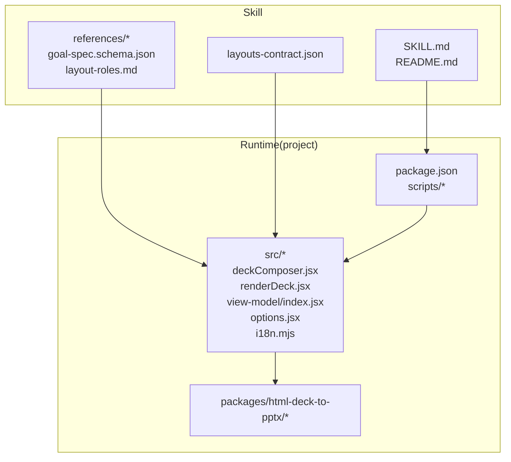
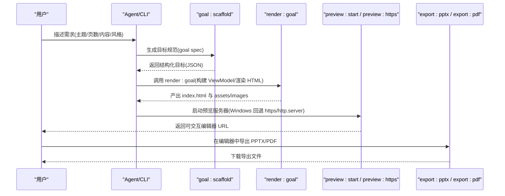
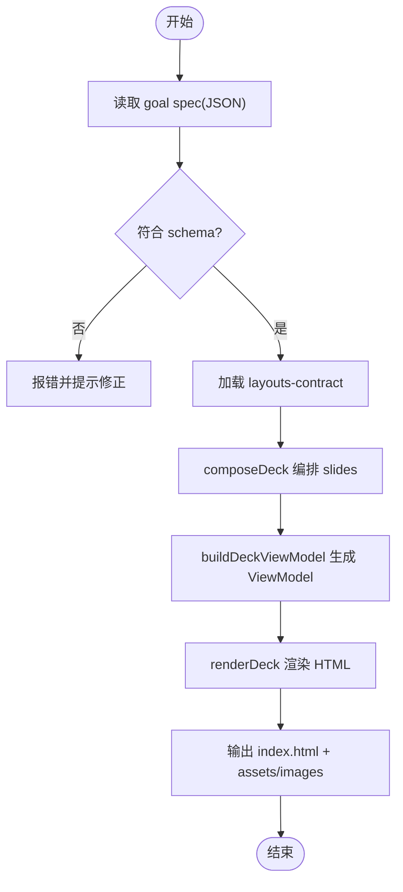
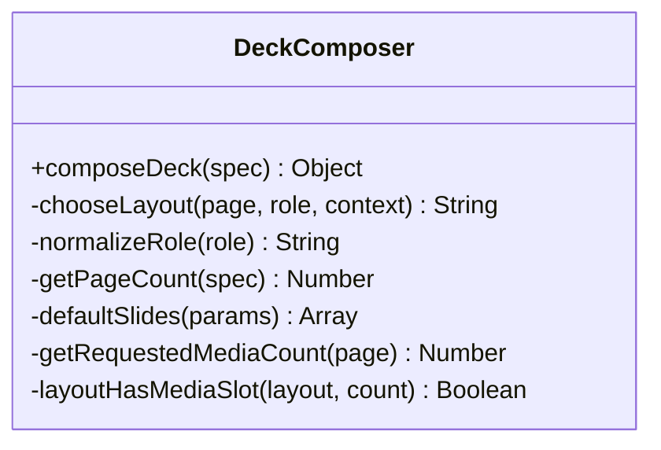
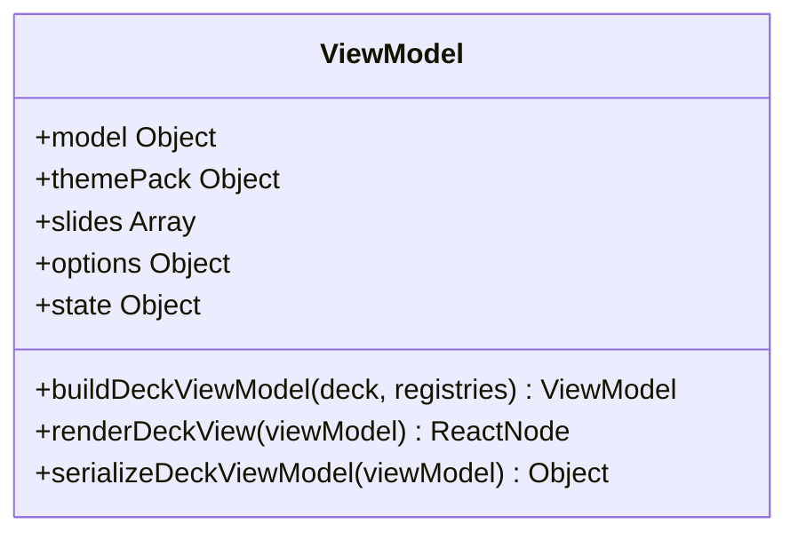
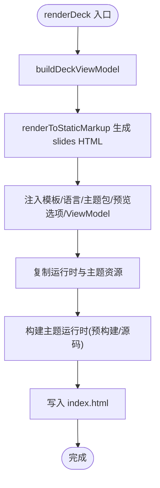
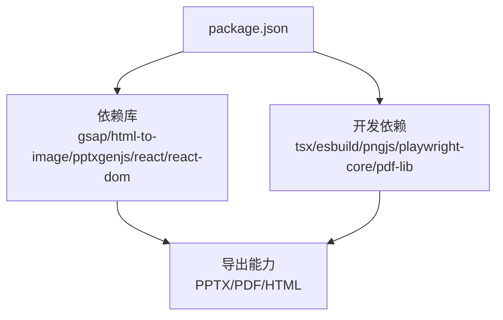

# DashIAI PPT 技能

<cite>
**本文引用的文件**
- [README.md](file://skills/dashiai-ppt/README.md)
- [SKILL.md](file://skills/dashiai-ppt/SKILL.md)
- [package.json](file://skills/dashiai-ppt/project/package.json)
- [goal-spec.schema.json](file://skills/dashiai-ppt/references/goal-spec.schema.json)
- [layouts-contract.json](file://skills/dashiai-ppt/layouts-contract.json)
- [deckComposer.jsx](file://skills/dashiai-ppt/project/src/deckComposer.jsx)
- [renderDeck.jsx](file://skills/dashiai-ppt/project/src/renderDeck.jsx)
- [options.jsx](file://skills/dashiai-ppt/project/src/options.jsx)
- [index.jsx（视图模型）](file://skills/dashiai-ppt/project/src/view-model/index.jsx)
- [i18n.mjs](file://skills/dashiai-ppt/project/src/i18n.mjs)
- [layout-roles.md](file://skills/dashiai-ppt/references/layout-roles.md)
</cite>

## 目录
1. [简介](#简介)
2. [项目结构](#项目结构)
3. [核心组件](#核心组件)
4. [架构总览](#架构总览)
5. [详细组件分析](#详细组件分析)
6. [依赖关系分析](#依赖关系分析)
7. [性能考量](#性能考量)
8. [故障排除指南](#故障排除指南)
9. [结论](#结论)
10. [附录：工具链与使用流程](#附录工具链与使用流程)

## 简介
DashIAI PPT 是一个本地离线演示文稿生成技能，支持 12 套视觉风格、HTML 预览编辑器以及导出为 PPTX/PDF。用户只需提供汇报目标、受众、页数和内容重点，即可生成可离线打开、可翻页、可编辑的 HTML PPT，并在浏览器中直接修改文字、替换图片/视频、调整页面属性，最终导出为 HTML、PDF 或 PPTX。所有输出保存在本机，便于归档、二次修改或交付。

## 项目结构
该技能以“Skill + Runtime”的方式组织：
- Skill 层：定义触发词、行为约束、工作流命令、参考文档与示例。
- Runtime 层：基于 Node.js/React 的运行时，负责主题注册、布局选择、渲染、预览服务与导出。

关键目录与职责：
- skills/dashiai-ppt：Skill 根目录，包含 README、SKILL、references、layouts-contract 等。
- project：运行时工程，包含 package.json、src（React 组件、视图模型、国际化）、packages/html-deck-to-pptx（导出库）。
- references：Schema、角色说明、示例 JSON 等。
- layouts-contract.json：布局契约，描述每页的字段、媒体槽、控件与文案预算。

图表来源
- [package.json:1-37](file://skills/dashiai-ppt/project/package.json#L1-L37)
- [SKILL.md:1-57](file://skills/dashiai-ppt/SKILL.md#L1-L57)
- [README.md:1-62](file://skills/dashiai-ppt/README.md#L1-L62)

章节来源
- [README.md:1-62](file://skills/dashiai-ppt/README.md#L1-L62)
- [SKILL.md:1-57](file://skills/dashiai-ppt/SKILL.md#L1-L57)
- [package.json:1-37](file://skills/dashiai-ppt/project/package.json#L1-L37)

## 核心组件
- 目标规范与校验：通过 goal-spec.schema.json 定义输入结构（标题、目标、受众、页数、主题包、文本、媒体、幻灯片数组等），确保生成管线数据一致性。
- 布局契约：layouts-contract.json 描述每个主题的页面布局、字段键、媒体槽、控件、文案长度限制与默认可见数量，驱动编辑器控件与渲染。
- 编排器（composeDeck）：根据 role/keywords 自动匹配可用 layout，处理媒体槽容量与去重，生成 slides 列表。
- 视图模型（buildDeckViewModel/serializeDeckViewModel）：将 deck 数据转换为可渲染的 ViewModel，合并默认 props、计算 text/media/state，并序列化供前端使用。
- 渲染器（renderDeck）：服务端静态渲染 React 到 HTML，注入模板、语言、主题包、预览选项与 ViewModel，拷贝必要资源与主题运行时。
- 国际化（i18n）：按实际使用的页面与主题包裁剪词典子集，减少体积并保持界面语言一致。
- 工具链脚本：通过 npm scripts 暴露 goal:scaffold、inspect:layout、props:safe、render:goal、preview:start、export:pptx 等命令。

章节来源
- [goal-spec.schema.json:1-120](file://skills/dashiai-ppt/references/goal-spec.schema.json#L1-L120)
- [layouts-contract.json:1-800](file://skills/dashiai-ppt/layouts-contract.json#L1-L800)
- [deckComposer.jsx:1-301](file://skills/dashiai-ppt/project/src/deckComposer.jsx#L1-L301)
- [index.jsx（视图模型）:1-369](file://skills/dashiai-ppt/project/src/view-model/index.jsx#L1-L369)
- [renderDeck.jsx:1-373](file://skills/dashiai-ppt/project/src/renderDeck.jsx#L1-L373)
- [i18n.mjs:1-40](file://skills/dashiai-ppt/project/src/i18n.mjs#L1-L40)
- [package.json:1-37](file://skills/dashiai-ppt/project/package.json#L1-L37)

## 架构总览
整体流程从“目标规范”到“HTML 预览”，再到“导出 PPTX/PDF”。

图表来源
- [package.json:1-37](file://skills/dashiai-ppt/project/package.json#L1-L37)
- [SKILL.md:1-57](file://skills/dashiai-ppt/SKILL.md#L1-L57)

## 详细组件分析

### 目标规范与布局契约
- 目标规范（goal-spec.schema.json）：限定 title、goal、audience、owner、randomSeed、pageCount、themePack、text、media、props、slides 等字段，其中 slides 数组每项需指定 layout，并可携带 props、copy、media、imageGen 等。
- 布局契约（layouts-contract.json）：对每个页面定义 label、slot、roles、copyKeys、copyBudgets、fieldContracts、fillPlan、arrayKeys、propShapes、mediaSlots、countBindings、controls 等，用于驱动编辑器控件与渲染逻辑。

图表来源
- [goal-spec.schema.json:1-120](file://skills/dashiai-ppt/references/goal-spec.schema.json#L1-L120)
- [layouts-contract.json:1-800](file://skills/dashiai-ppt/layouts-contract.json#L1-L800)
- [deckComposer.jsx:1-301](file://skills/dashiai-ppt/project/src/deckComposer.jsx#L1-L301)
- [index.jsx（视图模型）:1-369](file://skills/dashiai-ppt/project/src/view-model/index.jsx#L1-L369)
- [renderDeck.jsx:1-373](file://skills/dashiai-ppt/project/src/renderDeck.jsx#L1-L373)

章节来源
- [goal-spec.schema.json:1-120](file://skills/dashiai-ppt/references/goal-spec.schema.json#L1-L120)
- [layouts-contract.json:1-800](file://skills/dashiai-ppt/layouts-contract.json#L1-L800)

### 编排器（composeDeck）
- 作用：根据 role/keywords 自动选择 layout，处理媒体槽容量、去重与随机种子，生成 slides。
- 关键点：
  - ROLE_KEYWORDS/ROLE_ALIASES：映射语义角色到关键词与别名。
  - chooseLayout：优先满足 media slot 容量，避免重复使用 layout。
  - getPageCount：规范化页数范围（3-30）。
  - defaultSlides：未提供 slides 时自动生成封面+中间角色+结尾的结构。

图表来源
- [deckComposer.jsx:1-301](file://skills/dashiai-ppt/project/src/deckComposer.jsx#L1-L301)

章节来源
- [deckComposer.jsx:1-301](file://skills/dashiai-ppt/project/src/deckComposer.jsx#L1-L301)

### 视图模型（ViewModel）
- buildDeckViewModel：标准化 deck 模型，创建 slide keys，合并默认 props，计算 themePack、state（slideOrder/text/media/props）。
- renderDeckView：遍历 slides 渲染 React 组件，注入 SlideViewModelProvider。
- serializeDeckViewModel：将 ViewModel 序列化为 JSON，供前端水合与持久化。

图表来源
- [index.jsx（视图模型）:1-369](file://skills/dashiai-ppt/project/src/view-model/index.jsx#L1-L369)

章节来源
- [index.jsx（视图模型）:1-369](file://skills/dashiai-ppt/project/src/view-model/index.jsx#L1-L369)

### 渲染器（renderDeck）
- 功能：服务端渲染 React 到 HTML，注入模板、语言、主题包、预览选项与 ViewModel；复制运行时资产与主题资源；构建主题运行时（支持预构建与源码模式）。
- 关键点：
  - copyRuntimeAssets：复制 gsap/pptxgenjs/pdf-lib/html-to-image 等 vendor 库。
  - buildImportedThemeRuntime：根据 usedThemeKeys 决定使用预构建 bundle 或模块链接，或从源码构建。
  - copyImportedThemeAssets：仅复制用到的主题资源，减小产物体积。
  - injectPreviewOptions/injectDeckViewModel：将配置与数据注入 HTML。

图表来源
- [renderDeck.jsx:1-373](file://skills/dashiai-ppt/project/src/renderDeck.jsx#L1-L373)

章节来源
- [renderDeck.jsx:1-373](file://skills/dashiai-ppt/project/src/renderDeck.jsx#L1-L373)

### 选项与布局解析（options.jsx）
- 提供 DEFAULT_THEME_PACK、THEME_PACK_OPTIONS、LAYOUT_ALIASES、LAYOUT_OPTIONS。
- slide(layoutName, props)：解析 layout 名称并创建 slide 模型。
- resolveOption：统一选项解析与错误提示。

章节来源
- [options.jsx:1-43](file://skills/dashiai-ppt/project/src/options.jsx#L1-L43)

### 国际化（i18n.mjs）
- buildDeckI18nDict：按实际使用的页面与主题包裁剪词典子集，保证界面语言与展示文案一致。
- 与 i18n-core.mjs 协作，收集元数据字符串并加载字典。

章节来源
- [i18n.mjs:1-40](file://skills/dashiai-ppt/project/src/i18n.mjs#L1-L40)

### 布局角色说明（layout-roles.md）
- 定义 role 的用途与适用场景，指导 composeDeck 的角色到布局匹配策略。

章节来源
- [layout-roles.md:1-29](file://skills/dashiai-ppt/references/layout-roles.md#L1-L29)

## 依赖关系分析
- 运行时依赖（package.json）：
  - 运行时库：gsap、html-to-image、pptxgenjs、react、react-dom。
  - 开发依赖：tsx、esbuild、pngjs、playwright-core、pdf-lib。
- 导出能力：
  - PPTX：通过 pptxgenjs 在浏览器端导出。
  - PDF：通过 pdf-lib 在浏览器端导出。
  - HTML：静态渲染产物可直接打开。

图表来源
- [package.json:1-37](file://skills/dashiai-ppt/project/package.json#L1-L37)

章节来源
- [package.json:1-37](file://skills/dashiai-ppt/project/package.json#L1-L37)

## 性能考量
- 主题资源裁剪：仅复制实际使用的主题资源，减少产物体积。
- 主题运行时构建：单主题优先使用预构建自包含 bundle，多主题使用预构建模块链接，避免每次 esbuild 编译。
- 词典裁剪：按实际页面与主题包裁剪 i18n 字典，降低首屏负载。
- 媒体槽容量检查：提前校验 media slot 容量，避免无效渲染。
- 静态渲染：服务端一次性渲染 slides，减少客户端初始计算。

[本节为通用性能建议，不直接分析具体文件]

## 故障排除指南
- Windows 预览不可用：
  - 使用 preview:https 脚本替代 preview:start（内部依赖 Unix 特性）。
  - 若缺少 openssl，回退到 Python HTTP 服务器提供静态预览（导出功能不可用）。
- 导出失败：
  - 检查浏览器是否支持 html-to-image 与 pdf-lib。
  - 确认 assets/vendor 中的依赖已正确复制。
- 主题资源缺失：
  - 确认 buildImportedThemeRuntime 成功构建（预构建或源码模式）。
  - 检查 copyImportedThemeAssets 是否复制了所需主题资源。
- 布局选择异常：
  - 检查 role/keywords 与 layouts-contract 是否匹配。
  - 确认 media slot 容量满足需求。

章节来源
- [SKILL.md:1-57](file://skills/dashiai-ppt/SKILL.md#L1-L57)
- [renderDeck.jsx:1-373](file://skills/dashiai-ppt/project/src/renderDeck.jsx#L1-L373)
- [package.json:1-37](file://skills/dashiai-ppt/project/package.json#L1-L37)

## 结论
DashIAI PPT 技能通过“目标规范 + 布局契约 + 主题系统 + 交互式编辑器 + 导出能力”的完整链路，实现了本地离线、可编辑、多风格的演示文稿生成。其模块化架构与严格的契约校验确保了可扩展性与稳定性，同时针对 Windows 平台提供了完善的回退方案。

[本节为总结性内容，不直接分析具体文件]

## 附录：工具链与使用流程

### 工具链命令（npm scripts）
- goal:scaffold：生成目标规范（goal spec）。
- inspect:layout：检查布局契约与字段。
- props:safe：安全写入 props。
- render:goal：渲染 deck 为 HTML。
- preview:start：启动预览服务器（Unix）。
- preview:https：Windows 专用预览脚本。
- export:pptx：导出 PPTX。
- export:pdf：导出 PDF。

章节来源
- [package.json:1-37](file://skills/dashiai-ppt/project/package.json#L1-L37)

### 使用流程
1. 安装 Skill：将 dashiai-ppt 目录放入本机 Skill 目录，重新打开会话。
2. 描述需求：提供主题、目标、受众、页数、内容重点与偏好风格。
3. 选择风格：未指定风格时，Skill 会列出 12 套风格供选择。
4. 配图处理：先询问图片来源（下载或 AI 生图），AI 生图走 image-gen-router。
5. 生成预览：render 完成后提供可交互编辑器 URL。
6. 编辑与导出：在浏览器中修改文字、替换图片/视频，导出 PPTX/PDF。
7. 输出保存：所有输出保存在本机工作目录。

章节来源
- [README.md:1-62](file://skills/dashiai-ppt/README.md#L1-L62)
- [SKILL.md:1-57](file://skills/dashiai-ppt/SKILL.md#L1-L57)

### 12 套视觉风格
- theme01 轻拟态风（84 页）
- theme02 炫光紫绿风（74 页）
- theme03 深浅代码风（77 页）
- theme04 玻璃糖果风（74 页）
- theme05 色谱图表风（94 页）
- theme06 深色图谱风（83 页）
- theme07 冷白调研风（71 页）
- theme08 黑金实验风（84 页）
- theme09 深蓝杂志风（111 页）
- theme10 金色指数风（95 页）
- theme11 高能增长风（87 页）
- theme12 声波霓虹风（86 页）

章节来源
- [README.md:1-62](file://skills/dashiai-ppt/README.md#L1-L62)

### 交互式编辑器功能
- 文字修改：通过 text 键值对编辑各页文案。
- 图片替换：支持 image/video 媒体槽，可拖拽或上传替换。
- 实时预览：HTML 预览即编辑器，所见即所得。
- 导出功能：浏览器端导出 PPTX/PDF，无需后端。

章节来源
- [SKILL.md:1-57](file://skills/dashiai-ppt/SKILL.md#L1-L57)
- [package.json:1-37](file://skills/dashiai-ppt/project/package.json#L1-L37)

### Windows 特殊处理
- preview:https 脚本：后台启动 HTTPS 预览服务器。
- Python HTTP 服务器回退：当 openssl 缺失时使用 http.server 提供静态预览（导出功能不可用）。

章节来源
- [SKILL.md:1-57](file://skills/dashiai-ppt/SKILL.md#L1-L57)