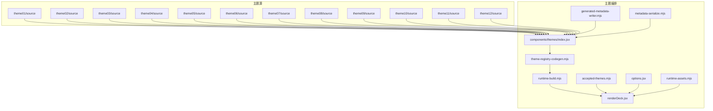
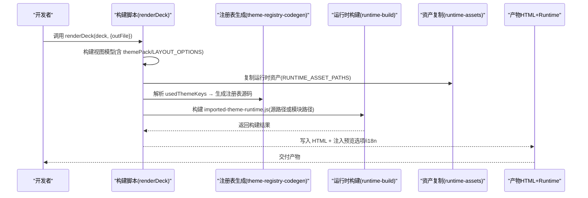
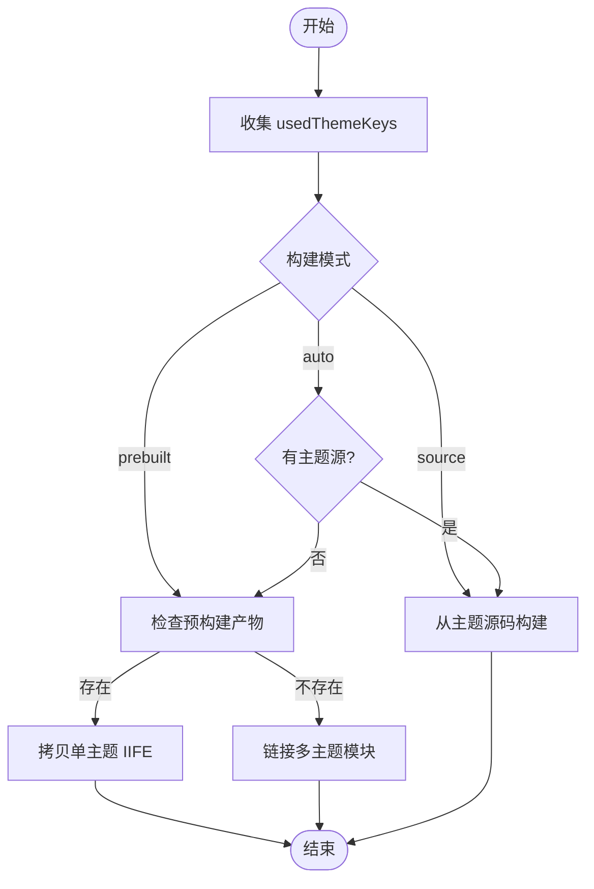
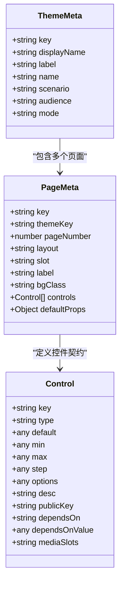
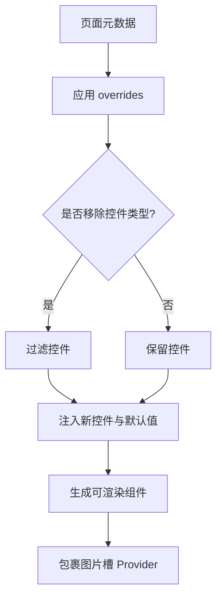
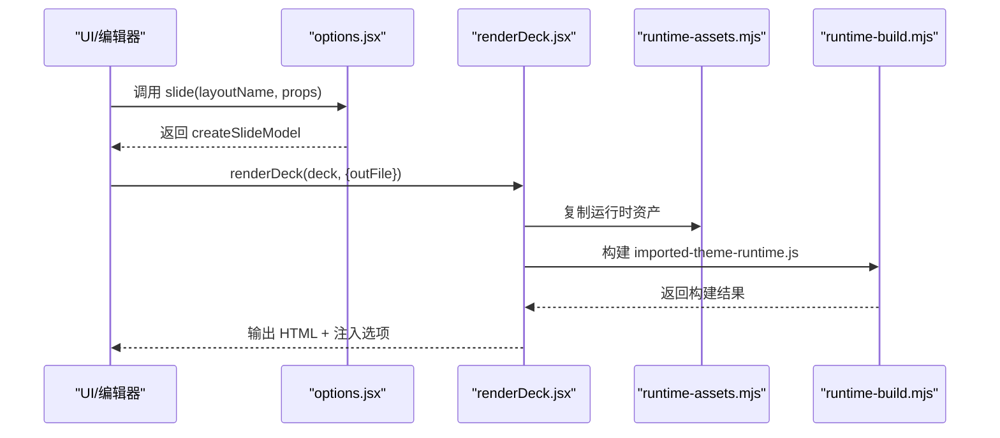
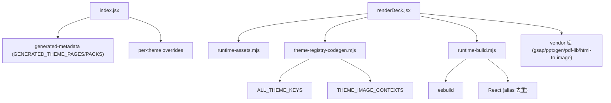

# 主题架构设计

<cite>
**本文引用的文件**   
- [accepted-themes.mjs](file://skills/dashiai-ppt/project/src/accepted-themes.mjs)
- [index.jsx](file://skills/dashiai-ppt/project/src/components/themes/index.jsx)
- [renderDeck.jsx](file://skills/dashiai-ppt/project/src/renderDeck.jsx)
- [runtime-assets.mjs](file://skills/dashiai-ppt/project/src/runtime-assets.mjs)
- [theme-registry-codegen.mjs](file://skills/dashiai-ppt/project/src/components/themes/theme-registry-codegen.mjs)
- [runtime-build.mjs](file://skills/dashiai-ppt/project/src/components/themes/runtime-build.mjs)
- [options.jsx](file://skills/dashiai-ppt/project/src/options.jsx)
- [metadata.js](file://skills/dashiai-ppt/project/src/components\themes\theme01\metadata.js)
- [metadata.js](file://skills/dashiai-ppt/project/src/components\themes\theme02\metadata.js)
- [overrides.js](file://skills/dashiai-ppt/project/src/components\themes\theme02\overrides.js)
- [overrides.js](file://skills/dashiai-ppt/project/src/components\themes\theme04\overrides.js)
- [generated-metadata-writer.mjs](file://skills/dashiai-ppt/project/src/generated-metadata-writer.mjs)
- [metadata-serialize.mjs](file://skills/dashiai-ppt/project/src/metadata-serialize.mjs)
</cite>

## 目录
1. [引言](#引言)
2. [项目结构](#项目结构)
3. [核心组件](#核心组件)
4. [架构总览](#架构总览)
5. [详细组件分析](#详细组件分析)
6. [依赖关系分析](#依赖关系分析)
7. [性能考量](#性能考量)
8. [故障排查指南](#故障排查指南)
9. [结论](#结论)
10. [附录](#附录)

## 引言
本文件系统化阐述 DashIAI PPT 的 12 套预设主题（theme01-theme12）的整体架构模式，覆盖主题目录结构、文件组织规范、模块依赖关系、主题注册机制与加载生命周期、主题元数据配置系统、主题继承与样式隔离策略、CSS 变量命名规范，以及主题开发最佳实践与性能优化建议。目标是帮助开发者快速理解并高效扩展主题体系。

## 项目结构
- 主题根目录位于 src/components/themes，包含 theme01 至 theme12 共 12 个主题目录。
- 每个主题目录通常包含：
  - metadata.js：由工具生成，描述主题元信息与页面控件契约。
  - source/：主题源码（React 组件、样式、资源等）。
  - runtime.jsx：主题运行时入口（供构建器打包为浏览器运行时）。
  - overrides.js（可选）：针对特定主题的控件特例与默认值注入。
- 全局主题编排与注册：
  - components/themes/index.jsx：聚合所有主题页、构建主题包选项、应用 per-theme 覆盖。
  - components/themes/theme-registry-codegen.mjs：主题注册表代码生成器，支持全主题或按 deck 裁剪。
  - components/themes/runtime-build.mjs：构建导入主题运行时（单主题自包含 bundle 或多主题模块链接）。
  - renderDeck.jsx：渲染流程，负责收集使用的主题键、复制运行时资产、构建主题运行时。
  - accepted-themes.mjs：基于生成的主题包集合，提供“已接受主题键”校验与过滤能力。
  - options.jsx：布局别名与默认主题包，将主题页映射为可渲染布局。
  - runtime-assets.mjs：声明运行时模板与必需资产清单。
  - generated-metadata-writer.mjs / metadata-serialize.mjs：主题元数据的序列化与写入。

**图表来源** 
- [index.jsx:1-172](file://skills/dashiai-ppt/project/src/components/themes/index.jsx#L1-L172)
- [theme-registry-codegen.mjs:1-116](file://skills/dashiai-ppt/project/src/components/themes/theme-registry-codegen.mjs#L1-L116)
- [runtime-build.mjs:1-162](file://skills/dashiai-ppt/project/src/components/themes/runtime-build.mjs#L1-L162)
- [accepted-themes.mjs:1-18](file://skills/dashiai-ppt/project/src/accepted-themes.mjs#L1-L18)
- [options.jsx:1-43](file://skills/dashiai-ppt/project/src/options.jsx#L1-L43)
- [runtime-assets.mjs:1-44](file://skills/dashiai-ppt/project/src/runtime-assets.mjs#L1-L44)
- [renderDeck.jsx:1-373](file://skills/dashiai-ppt/project/src/renderDeck.jsx#L1-L373)
- [generated-metadata-writer.mjs:1-14](file://skills/dashiai-ppt/project/src/generated-metadata-writer.mjs#L1-L14)
- [metadata-serialize.mjs:1-191](file://skills/dashiai-ppt/project/src/metadata-serialize.mjs#L1-L191)

**章节来源**
- [index.jsx:1-172](file://skills/dashiai-ppt/project/src/components/themes/index.jsx#L1-L172)
- [theme-registry-codegen.mjs:1-116](file://skills/dashiai-ppt/project/src/components/themes/theme-registry-codegen.mjs#L1-L116)
- [runtime-build.mjs:1-162](file://skills/dashiai-ppt/project/src/components/themes/runtime-build.mjs#L1-L162)
- [accepted-themes.mjs:1-18](file://skills/dashiai-ppt/project/src/accepted-themes.mjs#L1-L18)
- [options.jsx:1-43](file://skills/dashiai-ppt/project/src/options.jsx#L1-L43)
- [runtime-assets.mjs:1-44](file://skills/dashiai-ppt/project/src/runtime-assets.mjs#L1-L44)
- [renderDeck.jsx:1-373](file://skills/dashiai-ppt/project/src/renderDeck.jsx#L1-L373)
- [generated-metadata-writer.mjs:1-14](file://skills/dashiai-ppt/project/src/generated-metadata-writer.mjs#L1-L14)
- [metadata-serialize.mjs:1-191](file://skills/dashiai-ppt/project/src/metadata-serialize.mjs#L1-L191)

## 核心组件
- 主题注册与裁剪
  - theme-registry-codegen.mjs：维护 ALL_THEME_KEYS、THEME_IMAGE_CONTEXTS，生成注册表源码（全主题或按 usedThemeKeys 裁剪），并导出 wrapThemeImageProviders 以包裹图片槽 Provider。
  - runtime-build.mjs：根据环境选择“源路径”或“模块路径”，构建 client-runtime（单一 React 实例），支持单主题自包含 bundle 和多主题模块链接。
- 主题加载与渲染
  - index.jsx：从 GENERATED_THEME_PAGES 构建 THEME_PAGES，应用 per-theme overrides（移除/注入控件、默认值），并通过 makeImportedThemePage 生成可渲染组件。
  - options.jsx：将 THEME_PAGES 映射为 LAYOUT_OPTIONS，提供 slide() API 创建幻灯片模型。
  - renderDeck.jsx：构建视图模型、注入预览选项与语言、复制运行时资产、收集 usedThemeKeys 并构建 imported-theme-runtime.js。
- 主题白名单与过滤
  - accepted-themes.mjs：基于 GENERATED_THEME_PACKS 导出 ACCEPTED_THEME_KEYS，并提供 isAcceptedThemeKey、filterAcceptedThemePages、filterAcceptedThemePages。
- 元数据与序列化
  - metadata-serialize.mjs：统一序列化 page -> generated-metadata 记录，规范化控件、约束数量边界、处理 theme09 特例。
  - generated-metadata-writer.mjs：格式化主题元数据模块（theme + pages），输出 GENERATED_THEME_PACKS 与 GENERATED_THEME_PAGES。

**章节来源**
- [theme-registry-codegen.mjs:1-116](file://skills/dashiai-ppt/project/src/components/themes/theme-registry-codegen.mjs#L1-L116)
- [runtime-build.mjs:1-162](file://skills/dashiai-ppt/project/src/components/themes/runtime-build.mjs#L1-L162)
- [index.jsx:1-172](file://skills/dashiai-ppt/project/src/components/themes/index.jsx#L1-L172)
- [options.jsx:1-43](file://skills/dashiai-ppt/project/src/options.jsx#L1-L43)
- [renderDeck.jsx:1-373](file://skills/dashiai-ppt/project/src/renderDeck.jsx#L1-L373)
- [accepted-themes.mjs:1-18](file://skills/dashiai-ppt/project/src/accepted-themes.mjs#L1-L18)
- [metadata-serialize.mjs:1-191](file://skills/dashiai-ppt/project/src/metadata-serialize.mjs#L1-L191)
- [generated-metadata-writer.mjs:1-14](file://skills/dashiai-ppt/project/src/generated-metadata-writer.mjs#L1-L14)

## 架构总览
整体架构围绕“主题元数据驱动 + 运行时按需裁剪”的核心思想展开：
- 元数据层：metadata.js 定义主题与页面控件契约；metadata-serialize.mjs 将其序列化为 generated-metadata；generated-metadata-writer.mjs 输出统一的 GENERATED_THEME_PACKS/PAGES。
- 编排层：index.jsx 聚合主题页、应用 overrides、生成可渲染组件；options.jsx 暴露布局选项与 slide API。
- 注册与构建层：theme-registry-codegen.mjs 生成注册表源码；runtime-build.mjs 构建客户端运行时（单主题 IIFE 或多主题模块链接）。
- 渲染层：renderDeck.jsx 组装视图模型、注入选项与 i18n、复制运行时资产、产出最终 HTML 与 imported-theme-runtime.js。
- 白名单层：accepted-themes.mjs 确保仅允许已接入的主题键参与过滤与渲染。

**图表来源** 
- [renderDeck.jsx:1-373](file://skills/dashiai-ppt/project/src/renderDeck.jsx#L1-L373)
- [theme-registry-codegen.mjs:1-116](file://skills/dashiai-ppt/project/src/components/themes/theme-registry-codegen.mjs#L1-L116)
- [runtime-build.mjs:1-162](file://skills/dashiai-ppt/project/src/components/themes/runtime-build.mjs#L1-L162)
- [runtime-assets.mjs:1-44](file://skills/dashiai-ppt/project/src/runtime-assets.mjs#L1-L44)

## 详细组件分析

### 主题注册机制与生命周期管理
- 主题注册表生成
  - theme-registry-codegen.mjs 维护 ALL_THEME_KEYS 与 THEME_IMAGE_CONTEXTS，支持两种模式：
    - 源路径：直接 import 各主题 runtime.jsx 及 context 模块。
    - 模块路径：import 预构建的 <themeKey>.module.mjs（react external），安装版无需可读主题源。
  - 生成 wrapThemeImageProviders 函数，按顺序包裹图片槽 Provider（如 theme01、theme03、theme06 等）。
- 运行时构建
  - runtime-build.mjs 通过 esbuild 构建 client-runtime，强制 react 子路径指向 ROOT 的单一副本，避免多实例水合问题。
  - 单主题优先拷贝预构建 IIFE（imported-theme-runtime.<key>.js），多主题则使用模块链接方式生成运行时。
- 生命周期
  - renderDeck.jsx 在渲染前收集 usedThemeKeys，决定构建路径（auto/prebuilt/source），并在 finally 中清理临时注册表。

**图表来源** 
- [renderDeck.jsx:1-373](file://skills/dashiai-ppt/project/src/renderDeck.jsx#L1-L373)
- [runtime-build.mjs:1-162](file://skills/dashiai-ppt/project/src/components/themes/runtime-build.mjs#L1-L162)
- [theme-registry-codegen.mjs:1-116](file://skills/dashiai-ppt/project/src/components/themes/theme-registry-codegen.mjs#L1-L116)

**章节来源**
- [theme-registry-codegen.mjs:1-116](file://skills/dashiai-ppt/project/src/components/themes/theme-registry-codegen.mjs#L1-L116)
- [runtime-build.mjs:1-162](file://skills/dashiai-ppt/project/src/components/themes/runtime-build.mjs#L1-L162)
- [renderDeck.jsx:1-373](file://skills/dashiai-ppt/project/src/renderDeck.jsx#L1-L373)

### 主题元数据配置系统（metadata.js）
- 结构
  - theme：主题级元信息（key、displayName、label、name、scenario、audience、mode）。
  - pages：页面数组，每项包含 key、themeKey、pageNumber、layout、slot、label、bgClass、controls、defaultProps 等。
- 控件契约
  - controls 字段定义控件类型、默认值、范围、依赖关系、显示方式等，经 metadata-serialize.mjs 标准化与约束。
  - defaultProps 与 controls 联动，确保默认值与控件限制一致。
- 生成与序列化
  - generated-metadata-writer.mjs 输出 GENERATED_THEME_PACKS 与 GENERATED_THEME_PAGES。
  - metadata-serialize.mjs 统一序列化逻辑，处理 theme09 特例、长度绑定、数字边界等。

**图表来源** 
- [metadata.js:1-800](file://skills/dashiai-ppt/project/src/components\themes\theme01\metadata.js#L1-L800)
- [metadata.js:1-800](file://skills/dashiai-ppt/project/src/components\themes\theme02\metadata.js#L1-L800)
- [metadata-serialize.mjs:1-191](file://skills/dashiai-ppt/project/src/metadata-serialize.mjs#L1-L191)
- [generated-metadata-writer.mjs:1-14](file://skills/dashiai-ppt/project/src/generated-metadata-writer.mjs#L1-L14)

**章节来源**
- [metadata.js:1-800](file://skills/dashiai-ppt/project/src/components\themes\theme01\metadata.js#L1-L800)
- [metadata.js:1-800](file://skills/dashiai-ppt/project/src/components\themes\theme02\metadata.js#L1-L800)
- [metadata-serialize.mjs:1-191](file://skills/dashiai-ppt/project/src/metadata-serialize.mjs#L1-L191)
- [generated-metadata-writer.mjs:1-14](file://skills/dashiai-ppt/project/src/generated-metadata-writer.mjs#L1-L14)

### 主题继承机制与样式隔离策略
- 继承机制
  - index.jsx 中的 THEME_OVERRIDES 支持 per-theme 覆盖：
    - removeControlTypes：移除指定类型的控件。
    - injectControls：注入新控件与默认值。
    - swatchKeys：标记色板控件键，影响 display 推断。
  - overrides.js（如 theme02、theme04）集中描述这些特例。
- 样式隔离
  - 每个主题通过 data-theme-key、data-page-key 等属性隔离作用域。
  - 图片槽 Provider 通过 wrapThemeImageProviders 包裹，确保不同主题的图片上下文互不干扰。
  - CSS 变量命名建议遵循主题前缀（如 --theme01-accent-color），避免跨主题污染。

**图表来源** 
- [index.jsx:1-172](file://skills/dashiai-ppt/project/src/components/themes/index.jsx#L1-L172)
- [overrides.js:1-5](file://skills/dashiai-ppt/project/src/components\themes\theme02\overrides.js#L1-L5)
- [overrides.js:1-5](file://skills/dashiai-ppt/project/src/components\themes\theme04\overrides.js#L1-L5)
- [theme-registry-codegen.mjs:1-116](file://skills/dashiai-ppt/project/src/components/themes/theme-registry-codegen.mjs#L1-L116)

**章节来源**
- [index.jsx:1-172](file://skills/dashiai-ppt/project/src/components/themes/index.jsx#L1-L172)
- [overrides.js:1-5](file://skills/dashiai-ppt/project/src/components\themes\theme02\overrides.js#L1-L5)
- [overrides.js:1-5](file://skills/dashiai-ppt/project/src/components\themes\theme04\overrides.js#L1-L5)
- [theme-registry-codegen.mjs:1-116](file://skills/dashiai-ppt/project/src/components/themes/theme-registry-codegen.mjs#L1-L116)

### 主题加载流程与渲染管线
- 加载流程
  - options.jsx 将 THEME_PAGES 映射为 LAYOUT_OPTIONS，提供 slide() API。
  - renderDeck.jsx 构建视图模型，注入 themePack、i18n、预览选项。
  - copyImportedThemeAssets 仅复制 usedThemeKeys 对应的主题资源，减少体积。
- 渲染管线
  - renderToStaticMarkup 渲染 React 组件为静态 HTML。
  - insertSlides 将 slides 插入模板，替换标题与语言属性。
  - buildImportedThemeRuntime 根据环境选择构建路径，产出 imported-theme-runtime.js。

**图表来源** 
- [options.jsx:1-43](file://skills/dashiai-ppt/project/src/options.jsx#L1-L43)
- [renderDeck.jsx:1-373](file://skills/dashiai-ppt/project/src/renderDeck.jsx#L1-L373)
- [runtime-assets.mjs:1-44](file://skills/dashiai-ppt/project/src/runtime-assets.mjs#L1-L44)
- [runtime-build.mjs:1-162](file://skills/dashiai-ppt/project/src/components/themes/runtime-build.mjs#L1-L162)

**章节来源**
- [options.jsx:1-43](file://skills/dashiai-ppt/project/src/options.jsx#L1-L43)
- [renderDeck.jsx:1-373](file://skills/dashiai-ppt/project/src/renderDeck.jsx#L1-L373)
- [runtime-assets.mjs:1-44](file://skills/dashiai-ppt/project/src/runtime-assets.mjs#L1-L44)
- [runtime-build.mjs:1-162](file://skills/dashiai-ppt/project/src/components/themes/runtime-build.mjs#L1-L162)

### 主题白名单与过滤
- accepted-themes.mjs 基于 GENERATED_THEME_PACKS 导出 ACCEPTED_THEME_KEYS，提供：
  - isAcceptedThemeKey：校验主题键是否在白名单。
  - filterAcceptedThemePages：过滤页面列表。
  - filterAcceptedThemePacks：过滤主题包列表。
- 该机制确保只有已接入的主题参与渲染与预览。

**章节来源**
- [accepted-themes.mjs:1-18](file://skills/dashiai-ppt/project/src/accepted-themes.mjs#L1-L18)

## 依赖关系分析
- 模块耦合
  - index.jsx 依赖 generated-metadata（GENERATED_THEME_PAGES/PACKS）与 per-theme overrides。
  - renderDeck.jsx 依赖 runtime-assets、theme-registry-codegen、runtime-build。
  - theme-registry-codegen.mjs 依赖 ALL_THEME_KEYS 与 THEME_IMAGE_CONTEXTS。
- 外部依赖
  - esbuild：用于构建 client-runtime 与主题模块。
  - React：单一实例，通过 alias 强制去重。
  - 第三方库：gsap、pptxgenjs、pdf-lib、html-to-image 等作为 vendor 资产复制。

**图表来源** 
- [index.jsx:1-172](file://skills/dashiai-ppt/project/src/components/themes/index.jsx#L1-L172)
- [renderDeck.jsx:1-373](file://skills/dashiai-ppt/project/src/renderDeck.jsx#L1-L373)
- [theme-registry-codegen.mjs:1-116](file://skills/dashiai-ppt/project/src/components/themes/theme-registry-codegen.mjs#L1-L116)
- [runtime-build.mjs:1-162](file://skills/dashiai-ppt/project/src/components/themes/runtime-build.mjs#L1-L162)
- [runtime-assets.mjs:1-44](file://skills/dashiai-ppt/project/src/runtime-assets.mjs#L1-L44)

**章节来源**
- [index.jsx:1-172](file://skills/dashiai-ppt/project/src/components/themes/index.jsx#L1-L172)
- [renderDeck.jsx:1-373](file://skills/dashiai-ppt/project/src/renderDeck.jsx#L1-L373)
- [theme-registry-codegen.mjs:1-116](file://skills/dashiai-ppt/project/src/components/themes/theme-registry-codegen.mjs#L1-L116)
- [runtime-build.mjs:1-162](file://skills/dashiai-ppt/project/src/components/themes/runtime-build.mjs#L1-L162)
- [runtime-assets.mjs:1-44](file://skills/dashiai-ppt/project/src/runtime-assets.mjs#L1-L44)

## 性能考量
- 主题裁剪
  - 仅复制 usedThemeKeys 对应的主题资源，显著减小交付体积。
  - 单主题优先使用预构建 IIFE，避免 esbuild 编译开销。
- React 实例去重
  - 通过 alias 强制 react 子路径指向 ROOT 的单一副本，避免多实例导致的水合错误。
- 资产优化
  - RUNTIME_ASSET_PATHS 明确列出必需资产，避免冗余。
  - 用户媒体目录（assets/user-media、images/user-media）在构建前后保留与恢复，避免丢失。

[本节为通用性能指导，不直接分析具体文件]

## 故障排查指南
- 常见错误
  - “Unknown imported theme runtime available”：检查 usedThemeKeys 是否正确，确认预构建产物或主题源是否存在。
  - “Required vendor asset missing”：确保 node_modules 中依赖已安装，且 vendor 资产路径正确。
  - React 水合错误（useMemo null）：确认 react alias 配置生效，避免多实例。
- 调试建议
  - 设置 DASHI_PPT_THEME_RUNTIME=prebuilt/source 强制构建模式。
  - 检查临时注册表文件（node_modules/.cache/dashi-theme-registry）是否生成成功。
  - 验证 metadata-serialize.mjs 输出的控件契约是否符合预期。

**章节来源**
- [renderDeck.jsx:1-373](file://skills/dashiai-ppt/project/src/renderDeck.jsx#L1-L373)
- [runtime-build.mjs:1-162](file://skills/dashiai-ppt/project/src/components/themes/runtime-build.mjs#L1-L162)
- [metadata-serialize.mjs:1-191](file://skills/dashiai-ppt/project/src/metadata-serialize.mjs#L1-L191)

## 结论
DashIAI PPT 的主题架构以元数据驱动为核心，结合运行时按需裁剪与预构建优化，实现了高内聚、低耦合、可扩展的主题体系。通过严格的白名单机制、样式隔离策略与 CSS 变量命名规范，确保了主题间的独立性与一致性。开发者可基于此架构快速扩展新主题，同时保持高性能与可维护性。

[本节为总结性内容，不直接分析具体文件]

## 附录
- 主题开发最佳实践
  - 在 metadata.js 中清晰定义控件契约，确保 defaultProps 与 controls 一致。
  - 使用 overrides.js 集中管理 per-theme 特例，避免分散修改。
  - 遵循 CSS 变量命名规范（如 --themeXX-*），避免跨主题污染。
  - 利用 usedThemeKeys 裁剪机制，仅引入必要资源，提升性能。
- 性能优化建议
  - 优先使用预构建 IIFE（单主题）以减少构建时间。
  - 避免在主题源码中引入大型依赖，必要时通过 vendor 资产复用。
  - 定期运行 metadata:update，确保元数据与源码同步。

[本节为通用指导，不直接分析具体文件]