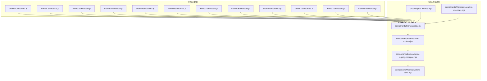
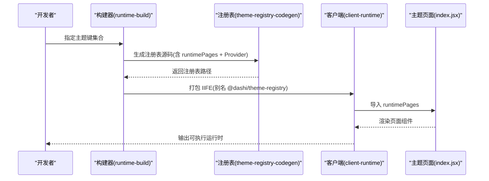
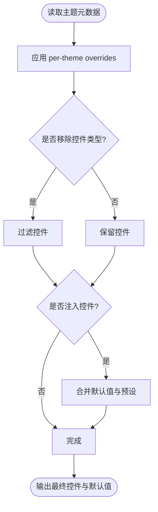
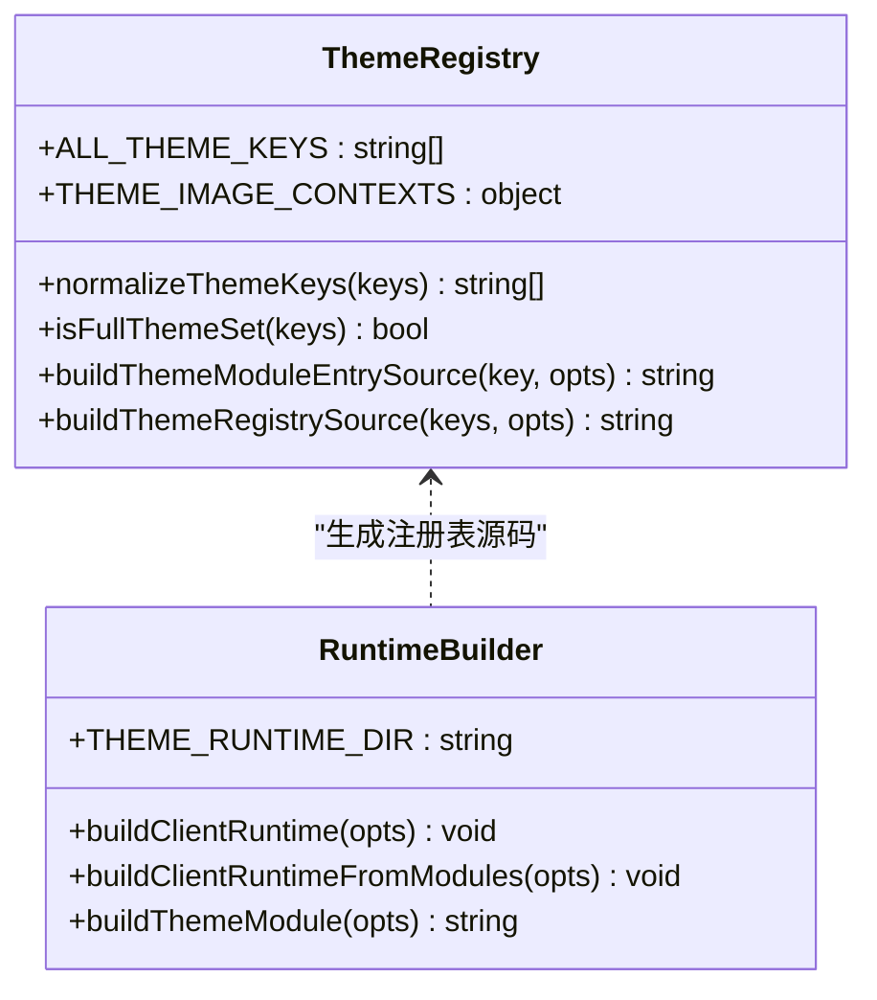
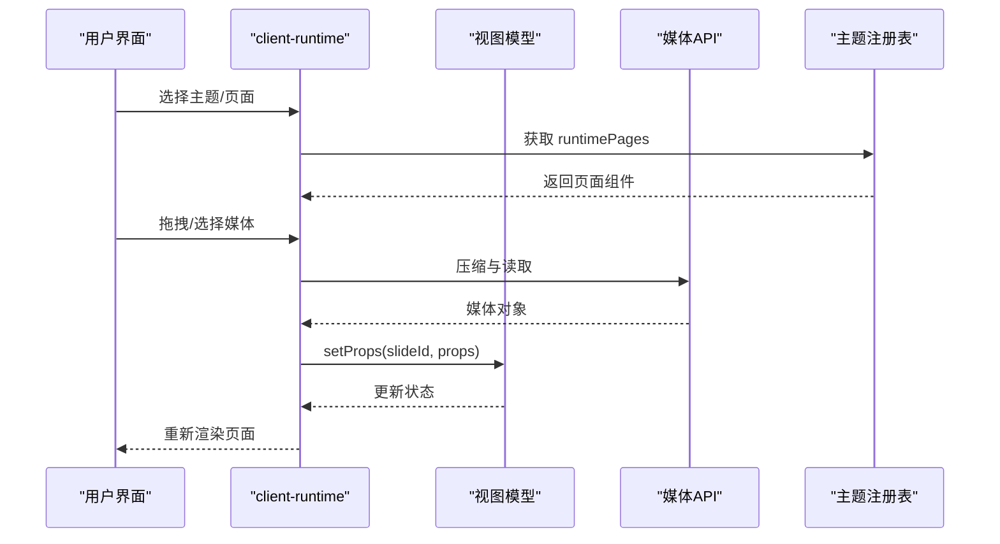
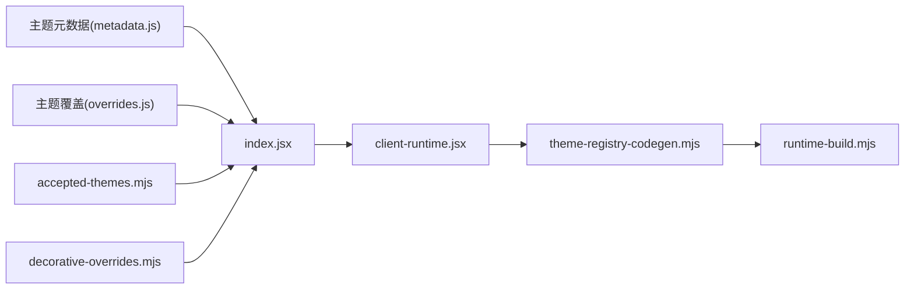

# 主题系统

<cite>
**本文引用的文件**
- [index.jsx](file://skills/dashiai-ppt/project/src/components/themes/index.jsx)
- [accepted-themes.mjs](file://skills/dashiai-ppt/project/src/accepted-themes.mjs)
- [theme-registry-codegen.mjs](file://skills/dashiai-ppt/project/src/components/themes/theme-registry-codegen.mjs)
- [runtime-build.mjs](file://skills/dashiai-ppt/project/src/components/themes/runtime-build.mjs)
- [client-runtime.jsx](file://skills/dashiai-ppt/project/src/components/themes/client-runtime.jsx)
- [decorative-overrides.mjs](file://skills/dashiai-ppt/project/src/components/themes/decorative-overrides.mjs)
- [theme01/metadata.js](file://skills/dashiai-ppt/project/src/components/themes/theme01/metadata.js)
- [theme02/metadata.js](file://skills/dashiai-ppt/project/src/components/themes/theme02/metadata.js)
- [theme03/metadata.js](file://skills/dashiai-ppt/project/src/components/themes/theme03/metadata.js)
- [theme04/metadata.js](file://skills/dashiai-ppt/project/src/components/themes/theme04/metadata.js)
- [theme02/overrides.js](file://skills/dashiai-ppt/project/src/components/themes/theme02/overrides.js)
- [theme03/overrides.js](file://skills/dashiai-ppt/project/src/components/themes/theme03/overrides.js)
- [theme04/overrides.js](file://skills/dashiai-ppt/project/src/components/themes/theme04/overrides.js)
</cite>

## 目录
1. [简介](#简介)
2. [项目结构](#项目结构)
3. [核心组件](#核心组件)
4. [架构总览](#架构总览)
5. [详细组件分析](#详细组件分析)
6. [依赖关系分析](#依赖关系分析)
7. [性能考量](#性能考量)
8. [故障排查指南](#故障排查指南)
9. [结论](#结论)
10. [附录](#附录)

## 简介
本文件系统化阐述 DashIAI PPT 主题系统的架构与实现，覆盖 12 套预设主题（theme01–theme12）的结构、样式与元数据配置，说明主题注册机制、运行时构建、主题切换逻辑、样式隔离与 CSS 变量体系，并提供自定义主题开发指南、预览与调试方法。文档面向不同技术背景的读者，既提供高层概览，也给出代码级细节与图示。

## 项目结构
主题系统围绕“元数据 + 运行时 + 构建工具”三层组织：
- 元数据层：每个主题目录包含 metadata.js，描述主题信息、页面布局、控件契约与默认值。
- 运行时层：统一的 client-runtime.jsx 负责渲染、媒体处理、属性校验与主题图片槽上下文注入；index.jsx 负责页面导入与控件归一化。
- 构建层：theme-registry-codegen.mjs 生成主题注册表；runtime-build.mjs 负责预构建单主题模块与 IIFE 运行时，确保单一 React 实例与最小体积。

**图表来源**
- [index.jsx:1-172](file://skills/dashiai-ppt/project/src/components/themes/index.jsx#L1-L172)
- [client-runtime.jsx:1-800](file://skills/dashiai-ppt/project/src/components/themes/client-runtime.jsx#L1-L800)
- [theme-registry-codegen.mjs:1-116](file://skills/dashiai-ppt/project/src/components/themes/theme-registry-codegen.mjs#L1-L116)
- [runtime-build.mjs:1-162](file://skills/dashiai-ppt/project/src/components/themes/runtime-build.mjs#L1-L162)
- [accepted-themes.mjs:1-18](file://skills/dashiai-ppt/project/src/accepted-themes.mjs#L1-L18)
- [decorative-overrides.mjs:1-17](file://skills/dashiai-ppt/project/src/components/themes/decorative-overrides.mjs#L1-L17)

**章节来源**
- [index.jsx:1-172](file://skills/dashiai-ppt/project/src/components/themes/index.jsx#L1-L172)
- [client-runtime.jsx:1-800](file://skills/dashiai-ppt/project/src/components/themes/client-runtime.jsx#L1-L800)
- [theme-registry-codegen.mjs:1-116](file://skills/dashiai-ppt/project/src/components/themes/theme-registry-codegen.mjs#L1-L116)
- [runtime-build.mjs:1-162](file://skills/dashiai-ppt/project/src/components/themes/runtime-build.mjs#L1-L162)
- [accepted-themes.mjs:1-18](file://skills/dashiai-ppt/project/src/accepted-themes.mjs#L1-L18)
- [decorative-overrides.mjs:1-17](file://skills/dashiai-ppt/project/src/components/themes/decorative-overrides.mjs#L1-L17)

## 核心组件
- 主题索引与页面导入：index.jsx 汇总所有主题页面，应用 per-theme overrides 对控件进行增删改，并导出 makeImportedThemePage 用于动态渲染。
- 主题注册表生成：theme-registry-codegen.mjs 定义 ALL_THEME_KEYS、THEME_IMAGE_CONTEXTS，并生成 runtimePages 与 wrapThemeImageProviders。
- 运行时构建：runtime-build.mjs 通过 esbuild 将主题源码或预构建模块打包为 IIFE，保证单一 React 实例与最小包体。
- 客户端运行时：client-runtime.jsx 负责媒体上传与压缩、属性契约校验、图片槽桥接、动画与视频生命周期管理。
- 主题白名单：accepted-themes.mjs 基于 generated-metadata 过滤可用主题键。
- 装饰槽标记：decorative-overrides.mjs 声明纯装饰字段，避免被 Agent 误填文案。

**章节来源**
- [index.jsx:1-172](file://skills/dashiai-ppt/project/src/components/themes/index.jsx#L1-L172)
- [theme-registry-codegen.mjs:1-116](file://skills/dashiai-ppt/project/src/components/themes/theme-registry-codegen.mjs#L1-L116)
- [runtime-build.mjs:1-162](file://skills/dashiai-ppt/project/src/components/themes/runtime-build.mjs#L1-L162)
- [client-runtime.jsx:1-800](file://skills/dashiai-ppt/project/src/components/themes/client-runtime.jsx#L1-L800)
- [accepted-themes.mjs:1-18](file://skills/dashiai-ppt/project/src/accepted-themes.mjs#L1-L18)
- [decorative-overrides.mjs:1-17](file://skills/dashiai-ppt/project/src/components/themes/decorative-overrides.mjs#L1-L17)

## 架构总览
主题系统采用“元数据驱动 + 运行时裁剪”的架构：
- 元数据驱动：metadata.js 描述主题、页面、控件与默认值，作为唯一事实来源。
- 运行时裁剪：根据 deck 实际使用的主题集合，生成仅包含必要主题的注册表与运行时，显著减小体积。
- 图片槽上下文：部分主题需要图片槽 Provider（如 theme01/03/06/08/09/10/11），由 wrapThemeImageProviders 按顺序包裹。

**图表来源**
- [runtime-build.mjs:1-162](file://skills/dashiai-ppt/project/src/components/themes/runtime-build.mjs#L1-L162)
- [theme-registry-codegen.mjs:1-116](file://skills/dashiai-ppt/project/src/components/themes/theme-registry-codegen.mjs#L1-L116)
- [client-runtime.jsx:1-800](file://skills/dashiai-ppt/project/src/components/themes/client-runtime.jsx#L1-L800)
- [index.jsx:1-172](file://skills/dashiai-ppt/project/src/components/themes/index.jsx#L1-L172)

## 详细组件分析

### 主题元数据与覆盖机制
- metadata.js：每个主题目录下包含 metadata.js，导出 theme 与 pages 数组，描述页面 key、layout、slot、controls 与 defaultProps。
- overrides.js：per-theme 覆盖文件，支持 removeControlTypes、injectControls、replaceKeys、injectDefaults、preset3dBySlot、swatchKeys 等能力。
- index.jsx 中的 applyThemePageDefaults 会合并 overrides，形成最终控件集与默认值。

**图表来源**
- [index.jsx:1-172](file://skills/dashiai-ppt/project/src/components/themes/index.jsx#L1-L172)
- [theme02/overrides.js:1-5](file://skills/dashiai-ppt/project/src/components/themes/theme02/overrides.js#L1-L5)
- [theme03/overrides.js:1-34](file://skills/dashiai-ppt/project/src/components/themes/theme03/overrides.js#L1-L34)
- [theme04/overrides.js:1-5](file://skills/dashiai-ppt/project/src/components/themes/theme04/overrides.js#L1-L5)

**章节来源**
- [theme01/metadata.js:1-800](file://skills/dashiai-ppt/project/src/components/themes/theme01/metadata.js#L1-L800)
- [theme02/metadata.js:1-800](file://skills/dashiai-ppt/project/src/components/themes/theme02/metadata.js#L1-L800)
- [theme03/metadata.js:1-800](file://skills/dashiai-ppt/project/src/components/themes/theme03/metadata.js#L1-L800)
- [theme04/metadata.js:1-800](file://skills/dashiai-ppt/project/src/components/themes/theme04/metadata.js#L1-L800)
- [index.jsx:1-172](file://skills/dashiai-ppt/project/src/components/themes/index.jsx#L1-L172)

### 主题注册与运行时构建
- theme-registry-codegen.mjs 维护 ALL_THEME_KEYS 与 THEME_IMAGE_CONTEXTS，生成 runtimePages 与 wrapThemeImageProviders。
- runtime-build.mjs 使用 esbuild 将主题源码或预构建模块打包为 IIFE，并通过别名 @dashi/theme-registry 注入注册表。
- 构建时强制 react 子路径指向同一副本，避免多实例导致的水合错误。

**图表来源**
- [theme-registry-codegen.mjs:1-116](file://skills/dashiai-ppt/project/src/components/themes/theme-registry-codegen.mjs#L1-L116)
- [runtime-build.mjs:1-162](file://skills/dashiai-ppt/project/src/components/themes/runtime-build.mjs#L1-L162)

**章节来源**
- [theme-registry-codegen.mjs:1-116](file://skills/dashiai-ppt/project/src/components/themes/theme-registry-codegen.mjs#L1-L116)
- [runtime-build.mjs:1-162](file://skills/dashiai-ppt/project/src/components/themes/runtime-build.mjs#L1-L162)

### 客户端运行时与主题切换
- client-runtime.jsx 负责：
  - 媒体上传与压缩（图片/视频），自动推断尺寸与比例。
  - 属性契约校验与回退策略，防止单个控件异常影响整页渲染。
  - 图片槽桥接（createKeyedImageBridge、createTheme11ImageBridge），统一主题间差异。
  - 视频元素生命周期管理，非活跃时释放资源。
- 主题切换逻辑：
  - 通过 runtimePages 动态选择页面组件。
  - wrapThemeImageProviders 按主题顺序包裹 Provider，确保图片槽上下文正确传递。
  - accepted-themes.mjs 过滤可用主题键，保障安全性。

**图表来源**
- [client-runtime.jsx:1-800](file://skills/dashiai-ppt/project/src/components/themes/client-runtime.jsx#L1-L800)
- [accepted-themes.mjs:1-18](file://skills/dashiai-ppt/project/src/accepted-themes.mjs#L1-L18)

**章节来源**
- [client-runtime.jsx:1-800](file://skills/dashiai-ppt/project/src/components/themes/client-runtime.jsx#L1-L800)
- [accepted-themes.mjs:1-18](file://skills/dashiai-ppt/project/src/accepted-themes.mjs#L1-L18)

### 样式隔离与 CSS 变量系统
- 样式隔离：
  - 每个主题页面通过 data-theme-key、data-page-key 等属性标识，便于 CSS 作用域限定。
  - index.jsx 生成的 imported-theme-root 容器可作为样式隔离锚点。
- CSS 变量：
  - 主题色、强调色等通过控件映射到 CSS 变量，在运行时注入到根节点。
  - decorative-overrides.mjs 标记纯装饰字段，避免样式污染。

[本节为概念性说明，不直接分析具体文件]

## 依赖关系分析
主题系统依赖关系清晰，模块化程度高：
- index.jsx 依赖各主题 metadata.js 与 overrides.js。
- client-runtime.jsx 依赖 theme-registry-codegen.mjs 生成的注册表。
- runtime-build.mjs 依赖 theme-registry-codegen.mjs 与 esbuild。
- accepted-themes.mjs 依赖 generated-metadata 过滤主题键。

**图表来源**
- [index.jsx:1-172](file://skills/dashiai-ppt/project/src/components/themes/index.jsx#L1-L172)
- [client-runtime.jsx:1-800](file://skills/dashiai-ppt/project/src/components/themes/client-runtime.jsx#L1-L800)
- [theme-registry-codegen.mjs:1-116](file://skills/dashiai-ppt/project/src/components/themes/theme-registry-codegen.mjs#L1-L116)
- [runtime-build.mjs:1-162](file://skills/dashiai-ppt/project/src/components/themes/runtime-build.mjs#L1-L162)
- [accepted-themes.mjs:1-18](file://skills/dashiai-ppt/project/src/accepted-themes.mjs#L1-L18)
- [decorative-overrides.mjs:1-17](file://skills/dashiai-ppt/project/src/components/themes/decorative-overrides.mjs#L1-L17)

**章节来源**
- [index.jsx:1-172](file://skills/dashiai-ppt/project/src/components/themes/index.jsx#L1-L172)
- [client-runtime.jsx:1-800](file://skills/dashiai-ppt/project/src/components/themes/client-runtime.jsx#L1-L800)
- [theme-registry-codegen.mjs:1-116](file://skills/dashiai-ppt/project/src/components/themes/theme-registry-codegen.mjs#L1-L116)
- [runtime-build.mjs:1-162](file://skills/dashiai-ppt/project/src/components/themes/runtime-build.mjs#L1-L162)
- [accepted-themes.mjs:1-18](file://skills/dashiai-ppt/project/src/accepted-themes.mjs#L1-L18)
- [decorative-overrides.mjs:1-17](file://skills/dashiai-ppt/project/src/components/themes/decorative-overrides.mjs#L1-L17)

## 性能考量
- 单主题运行时：通过 runtime-build.mjs 生成仅包含必要主题的 IIFE，显著减小包体。
- 单一 React 实例：强制 react 子路径指向同一副本，避免水合错误与重复加载。
- 媒体优化：图片压缩至 WebP，视频懒加载与非活跃时释放资源。
- 控件归一化：减少不必要的控件类型，提升渲染效率。

[本节为通用指导，不直接分析具体文件]

## 故障排查指南
- 常见错误：
  - 水合错误：检查 react 别名是否正确指向同一副本。
  - 媒体上传失败：确认浏览器支持 createImageBitmap 与 MIME 类型。
  - 控件校验失败：查看 safeNormalizeContractValues 的回退日志。
- 调试方法：
  - 使用 console.warn 输出无效属性丢弃信息。
  - 检查 data-theme-key、data-page-key 等属性是否正确设置。
  - 验证 overrides.js 中的 swatchKeys 是否与控件 key 一致。

**章节来源**
- [client-runtime.jsx:1-800](file://skills/dashiai-ppt/project/src/components/themes/client-runtime.jsx#L1-L800)
- [theme02/overrides.js:1-5](file://skills/dashiai-ppt/project/src/components/themes/theme02/overrides.js#L1-L5)
- [theme03/overrides.js:1-34](file://skills/dashiai-ppt/project/src/components/themes/theme03/overrides.js#L1-L34)
- [theme04/overrides.js:1-5](file://skills/dashiai-ppt/project/src/components/themes/theme04/overrides.js#L1-L5)

## 结论
DashIAI PPT 主题系统通过元数据驱动、运行时裁剪与严格契约校验，实现了高度可扩展、高性能的主题生态。12 套预设主题覆盖了多种业务场景，per-theme overrides 机制提供了灵活的定制能力。构建工具链确保了交付件的最小体积与一致性。遵循本文档的开发指南与最佳实践，可快速扩展新主题并集成到系统中。

[本节为总结性内容，不直接分析具体文件]

## 附录
- 自定义主题开发步骤：
  1. 创建主题目录（如 theme13），添加 metadata.js 描述主题与页面。
  2. 可选：添加 overrides.js 定义控件特例与默认值。
  3. 在 theme-registry-codegen.mjs 中注册主题键。
  4. 运行构建脚本生成运行时。
- 预览与调试：
  - 使用浏览器开发者工具检查 data-* 属性与 CSS 变量。
  - 通过 console 输出调试媒体上传与控件校验过程。
  - 验证 accepted-themes.mjs 是否包含新主题键。

[本节为补充信息，不直接分析具体文件]