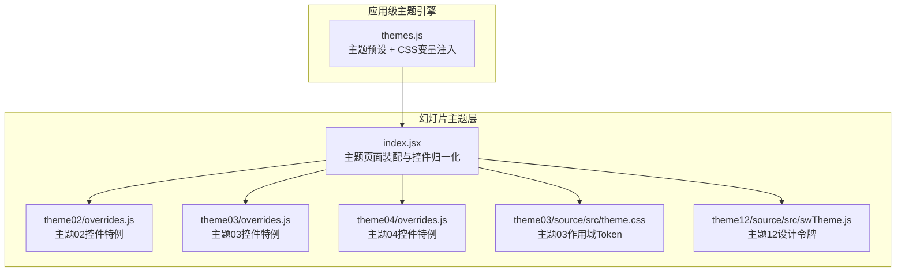
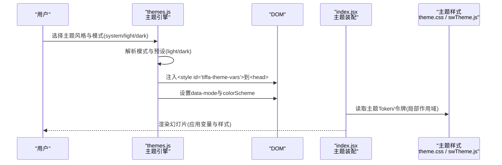
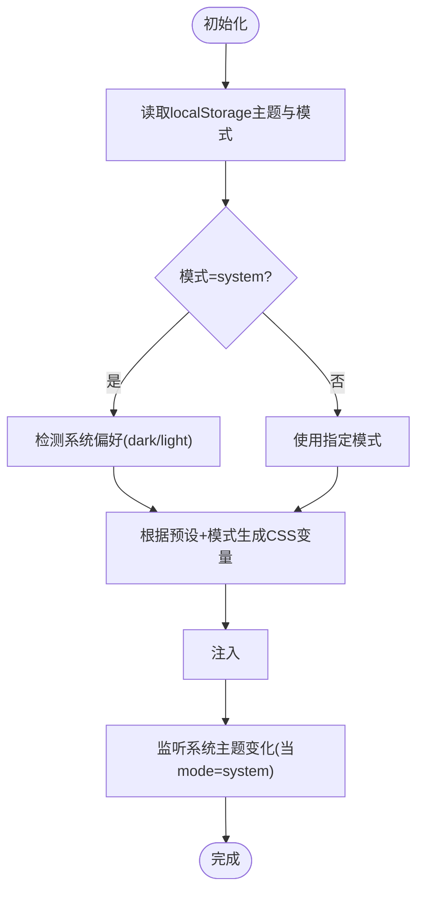
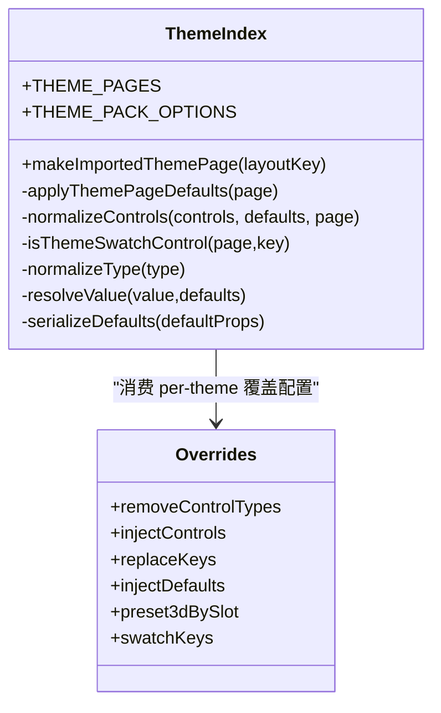
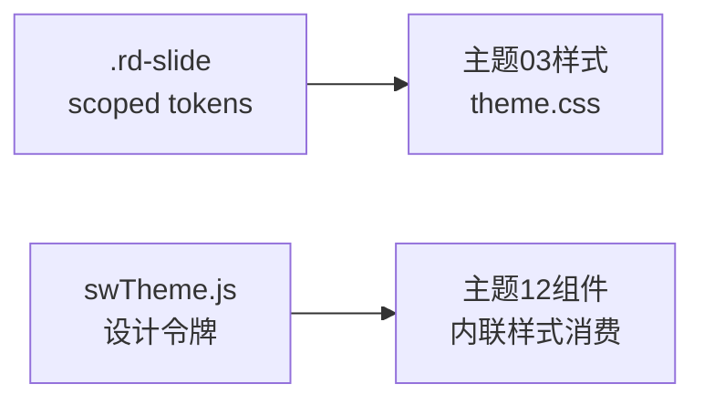
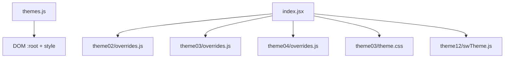

# 样式系统与CSS变量

<cite>
**本文引用的文件**   
- [themes.js](file://electron/renderer/themes.js)
- [index.jsx](file://skills/dashiai-ppt/project/src/components/themes/index.jsx)
- [overrides.js（theme02）](file://skills/dashiai-ppt/project/src/components/themes/theme02/overrides.js)
- [overrides.js（theme03）](file://skills/dashiai-ppt/project/src/components/themes/theme03/overrides.js)
- [overrides.js（theme04）](file://skills/dashiai-ppt/project/src/components/themes/theme04/overrides.js)
- [theme.css（theme03）](file://skills/dashiai-ppt/project/src/components/themes/theme03/source/src/theme.css)
- [swTheme.js（theme12）](file://skills/dashiai-ppt/project/src/components/themes/theme12/source/src/swTheme.js)
</cite>

## 目录
1. [简介](#简介)
2. [项目结构](#项目结构)
3. [核心组件](#核心组件)
4. [架构总览](#架构总览)
5. [详细组件分析](#详细组件分析)
6. [依赖关系分析](#依赖关系分析)
7. [性能考量](#性能考量)
8. [故障排查指南](#故障排查指南)
9. [结论](#结论)
10. [附录](#附录)

## 简介
本文件系统化梳理 DashIAI PPT 的样式系统与 CSS 变量体系，覆盖：
- 颜色、字体、间距与动画变量的定义规范
- 主题样式文件结构（theme.js、overrides.js）及样式覆盖机制与优先级
- 响应式设计与暗色模式适配
- 跨浏览器兼容性处理
- 样式调试工具使用与常见问题解决方案

该文档面向不同技术背景的读者，既提供高层概览，也给出代码级分析与图示。

## 项目结构
DashIAI PPT 的样式系统由两部分组成：
- 应用级主题引擎（Electron 渲染进程），负责全局 CSS 变量注入与日夜模式切换
- 幻灯片主题层（React 组件与样式），按主题包组织，支持局部作用域与控件覆盖

图表来源
- [themes.js:459-633](file://electron/renderer/themes.js#L459-L633)
- [index.jsx:1-172](file://skills/dashiai-ppt/project/src/components/themes/index.jsx#L1-L172)
- [overrides.js（theme02）:1-5](file://skills/dashiai-ppt/project/src/components/themes/theme02/overrides.js#L1-L5)
- [overrides.js（theme03）:1-34](file://skills/dashiai-ppt/project/src/components/themes/theme03/overrides.js#L1-L34)
- [overrides.js（theme04）:1-5](file://skills/dashiai-ppt/project/src/components/themes/theme04/overrides.js#L1-L5)
- [theme.css（theme03）:1-72](file://skills/dashiai-ppt/project/src/components/themes/theme03/source/src/theme.css#L1-L72)
- [swTheme.js（theme12）:1-52](file://skills/dashiai-ppt/project/src/components/themes/theme12/source/src/swTheme.js#L1-L52)

章节来源
- [themes.js:1-676](file://electron/renderer/themes.js#L1-L676)
- [index.jsx:1-172](file://skills/dashiai-ppt/project/src/components/themes/index.jsx#L1-L172)

## 核心组件
- 应用级主题引擎（themes.js）
  - 维护多套主题预设（含 light/dark 两套配色）
  - 将主题颜色映射为 CSS 变量并注入到 :root
  - 管理用户选择（主题风格 + 日夜模式 system/light/dark）
  - 兼容旧 hex 变量名，通过别名映射到新 HSL 变量
- 幻灯片主题装配（index.jsx）
  - 基于生成的主题元数据构建主题页面与主题包选项
  - 通过 overrides 对特定主题的控件进行增删改
  - 统一控件类型与显示策略（如 color/toggle/tab）
- 主题作用域 Token（theme.css / swTheme.js）
  - theme03 在 .rd-slide 上声明 scoped 设计令牌，避免泄漏到宿主
  - theme12 以纯数据对象暴露颜色、字体、字号、间距等令牌，供组件内联样式消费

章节来源
- [themes.js:459-633](file://electron/renderer/themes.js#L459-L633)
- [index.jsx:1-172](file://skills/dashiai-ppt/project/src/components/themes/index.jsx#L1-L172)
- [theme.css（theme03）:1-72](file://skills/dashiai-ppt/project/src/components/themes/theme03/source/src/theme.css#L1-L72)
- [swTheme.js（theme12）:1-52](file://skills/dashiai-ppt/project/src/components/themes/theme12/source/src/swTheme.js#L1-L52)

## 架构总览
整体流程：用户选择主题与模式 → 引擎生成 CSS 变量并注入 → 幻灯片主题读取本地 Token 或内联样式 → 最终渲染。

图表来源
- [themes.js:588-633](file://electron/renderer/themes.js#L588-L633)
- [index.jsx:72-101](file://skills/dashiai-ppt/project/src/components/themes/index.jsx#L72-L101)
- [theme.css（theme03）:17-72](file://skills/dashiai-ppt/project/src/components/themes/theme03/source/src/theme.css#L17-L72)
- [swTheme.js（theme12）:6-33](file://skills/dashiai-ppt/project/src/components/themes/theme12/source/src/swTheme.js#L6-L33)

## 详细组件分析

### 应用级主题引擎（themes.js）
- 设计理念
  - 每个主题风格包含 light/dark 两套配色，采用 HSL 字符串（不带 hsl() 包装）作为值
  - 运行时将主题颜色转换为 CSS 变量，注入到 :root，供全局样式消费
  - 保留旧 hex 变量名的别名映射，确保历史组件不破坏
- 关键实现要点
  - 预设注册与默认主题
  - 模式解析（system/light/dark）与监听系统主题变化
  - 注入 <style> 标签并设置 data-mode/colorScheme
  - localStorage 持久化主题与模式，支持从旧键迁移
- 变量体系
  - 背景、文本、强调、语义、边框、特殊变量
  - 旧变量别名（bg-primary/text-accent 等）指向新 HSL 变量

图表来源
- [themes.js:568-633](file://electron/renderer/themes.js#L568-L633)

章节来源
- [themes.js:1-676](file://electron/renderer/themes.js#L1-L676)

### 幻灯片主题装配（index.jsx）
- 功能概述
  - 基于 GENERATED_THEME_PAGES/GENERATED_THEME_PACKS 构建主题页面与主题包
  - 通过 THEME_OVERRIDES 对特定主题控件进行增删改（removeControlTypes、injectControls、replaceKeys、injectDefaults、preset3dBySlot、swatchKeys）
  - 统一控件类型与显示策略（select→color/tab、toggle、range 等）
- 覆盖机制与优先级
  - 先过滤 removeControlTypes 指定的控件类型
  - 再替换 replaceKeys 对应的控件 key，并追加 injectControls
  - defaultProps 合并顺序：原默认 → 注入默认 → 按槽位预设
- 导入主题页渲染
  - 输出带 data-* 属性的容器，便于调试与上层消费

图表来源
- [index.jsx:1-172](file://skills/dashiai-ppt/project/src/components/themes/index.jsx#L1-L172)
- [overrides.js（theme02）:1-5](file://skills/dashiai-ppt/project/src/components/themes/theme02/overrides.js#L1-L5)
- [overrides.js（theme03）:1-34](file://skills/dashiai-ppt/project/src/components/themes/theme03/overrides.js#L1-L34)
- [overrides.js（theme04）:1-5](file://skills/dashiai-ppt/project/src/components/themes/theme04/overrides.js#L1-L5)

章节来源
- [index.jsx:1-172](file://skills/dashiai-ppt/project/src/components/themes/index.jsx#L1-L172)
- [overrides.js（theme02）:1-5](file://skills/dashiai-ppt/project/src/components/themes/theme02/overrides.js#L1-L5)
- [overrides.js（theme03）:1-34](file://skills/dashiai-ppt/project/src/components/themes/theme03/overrides.js#L1-L34)
- [overrides.js（theme04）:1-5](file://skills/dashiai-ppt/project/src/components/themes/theme04/overrides.js#L1-L5)

### 主题作用域与令牌（theme.css / swTheme.js）
- theme03（theme.css）
  - 所有自定义属性定义在 .rd-slide 根节点，避免泄漏到宿主
  - 类名前缀 .rd- 防止命名冲突
  - 提供 dark 修饰符（.rd-dark）仅翻转当前 slide 的 token
  - 定义调色板、字体族、字号刻度、节奏（padding/gap）
- theme12（swTheme.js）
  - 纯数据对象暴露颜色、字体、字号、间距、圆角等令牌
  - 组件直接消费这些令牌用于内联样式，不写全局变量
  - 提供精选强调色集合与系列色表，保证稳定顺序

图表来源
- [theme.css（theme03）:1-72](file://skills/dashiai-ppt/project/src/components/themes/theme03/source/src/theme.css#L1-L72)
- [swTheme.js（theme12）:1-52](file://skills/dashiai-ppt/project/src/components/themes/theme12/source/src/swTheme.js#L1-L52)

章节来源
- [theme.css（theme03）:1-72](file://skills/dashiai-ppt/project/src/components/themes/theme03/source/src/theme.css#L1-L72)
- [swTheme.js（theme12）:1-52](file://skills/dashiai-ppt/project/src/components/themes/theme12/source/src/swTheme.js#L1-L52)

## 依赖关系分析
- 应用级主题引擎与幻灯片主题解耦
  - themes.js 负责全局 CSS 变量注入与模式管理
  - index.jsx 负责主题页面装配与控件覆盖，不直接依赖全局变量
- 各主题通过 overrides 声明自身控件特例，集中且可插拔
- 主题样式以作用域或纯数据形式存在，避免全局污染

图表来源
- [themes.js:459-633](file://electron/renderer/themes.js#L459-L633)
- [index.jsx:1-172](file://skills/dashiai-ppt/project/src/components/themes/index.jsx#L1-L172)
- [overrides.js（theme02）:1-5](file://skills/dashiai-ppt/project/src/components/themes/theme02/overrides.js#L1-L5)
- [overrides.js（theme03）:1-34](file://skills/dashiai-ppt/project/src/components/themes/theme03/overrides.js#L1-L34)
- [overrides.js（theme04）:1-5](file://skills/dashiai-ppt/project/src/components/themes/theme04/overrides.js#L1-L5)
- [theme.css（theme03）:1-72](file://skills/dashiai-ppt/project/src/components/themes/theme03/source/src/theme.css#L1-L72)
- [swTheme.js（theme12）:1-52](file://skills/dashiai-ppt/project/src/components/themes/theme12/source/src/swTheme.js#L1-L52)

章节来源
- [themes.js:1-676](file://electron/renderer/themes.js#L1-L676)
- [index.jsx:1-172](file://skills/dashiai-ppt/project/src/components/themes/index.jsx#L1-L172)

## 性能考量
- 变量注入策略
  - 仅在必要时创建/更新 <style> 标签，避免频繁重排
  - 使用 data-mode 与 colorScheme 控制原生控件主题，减少额外样式计算
- 主题切换开销
  - 切换主题时仅重写 CSS 变量，组件无需重新渲染
  - 系统主题监听仅在 mode=system 时生效
- 作用域隔离
  - 主题03使用 scoped tokens，避免全局变量竞争与样式冲突
  - 主题12使用纯数据令牌，组件按需内联样式，降低样式树复杂度

[本节为通用指导，不直接分析具体文件]

## 故障排查指南
- 主题未生效
  - 检查 <style id="tiffa-theme-vars"> 是否已注入
  - 确认 data-mode 与 colorScheme 是否正确设置
  - 查看 localStorage 中 tiffa-theme 与 tiffa-theme-mode 的值
- 旧变量失效
  - 确认别名映射是否存在（如 --bg-primary 等）
  - 若组件仍使用旧 hex 变量，需逐步迁移至新 HSL 变量
- 主题覆盖无效
  - 核对 overrides 中的 removeControlTypes、replaceKeys、injectControls 配置
  - 确认 defaultProps 合并顺序是否符合预期
- 暗色模式异常
  - 检查 prefers-color-scheme 监听是否触发
  - 确认主题预设的 dark 配色是否完整
- 作用域冲突
  - 主题03应使用 .rd-slide 下的 scoped tokens
  - 避免在全局 :root 上覆盖主题03的变量

章节来源
- [themes.js:568-633](file://electron/renderer/themes.js#L568-L633)
- [index.jsx:43-70](file://skills/dashiai-ppt/project/src/components/themes/index.jsx#L43-L70)
- [theme.css（theme03）:17-72](file://skills/dashiai-ppt/project/src/components/themes/theme03/source/src/theme.css#L17-L72)

## 结论
DashIAI PPT 的样式系统通过“应用级主题引擎 + 幻灯片主题层”的双层架构，实现了：
- 统一的 CSS 变量体系与主题切换能力
- 灵活的 per-theme 控件覆盖机制
- 作用域隔离与跨浏览器兼容
- 良好的性能与可维护性

建议后续扩展：
- 新增主题时遵循 HSL 变量命名与层级约定
- 使用 overrides 集中管理控件特例，保持 index.jsx 稳定
- 优先采用 scoped tokens 或纯数据令牌，避免全局污染

[本节为总结性内容，不直接分析具体文件]

## 附录

### CSS 变量定义规范
- 颜色变量
  - 背景：--bg-000 ~ --bg-400
  - 文本：--text-000 ~ --text-600
  - 强调：--accent-brand/main000/main100/main200/secondary100
  - 语义：success/warning/danger/info 系列
  - 边框：--border-100/200/300
  - 特殊：--always-black/--always-white/--oncolor-100
  - 旧别名：--bg-primary/--text-primary/--accent 等
- 字体变量
  - 主题03：--rd-sans/--rd-mono
  - 主题12：swTheme.font.sans/mono
- 间距变量
  - 主题03：--rd-pad-x/--rd-pad-y/--rd-gap
  - 主题12：swTheme.pad.x/t/b
- 动画变量
  - 主题03：Aurora 文本渐变动画与呼吸效果（受 prefers-reduced-motion 控制）

章节来源
- [themes.js:484-562](file://electron/renderer/themes.js#L484-L562)
- [theme.css（theme03）:17-72](file://skills/dashiai-ppt/project/src/components/themes/theme03/source/src/theme.css#L17-L72)
- [swTheme.js（theme12）:6-33](file://skills/dashiai-ppt/project/src/components/themes/theme12/source/src/swTheme.js#L6-L33)

### 主题样式文件结构与覆盖机制
- 主题文件结构
  - theme.js：主题预设与变量注入（应用级）
  - overrides.js：per-theme 控件特例（主题层）
- 覆盖优先级
  - 移除控件类型（removeControlTypes）
  - 替换控件 key（replaceKeys）
  - 注入控件（injectControls）
  - 默认值合并（defaultProps → injectDefaults → preset3dBySlot）

章节来源
- [index.jsx:43-70](file://skills/dashiai-ppt/project/src/components/themes/index.jsx#L43-L70)
- [overrides.js（theme02）:1-5](file://skills/dashiai-ppt/project/src/components/themes/theme02/overrides.js#L1-L5)
- [overrides.js（theme03）:1-34](file://skills/dashiai-ppt/project/src/components/themes/theme03/overrides.js#L1-L34)
- [overrides.js（theme04）:1-5](file://skills/dashiai-ppt/project/src/components/themes/theme04/overrides.js#L1-L5)

### 响应式设计与暗色模式适配
- 响应式
  - 主题03通过 scoped tokens 与相对单位适配不同画布尺寸
  - 主题12通过 swTheme.type/pad/radius 控制字号与间距
- 暗色模式
  - 应用级：themes.js 支持 system/light/dark，自动跟随系统
  - 主题层：theme03 提供 .rd-dark 修饰符；主题12 通过令牌切换明暗

章节来源
- [themes.js:568-633](file://electron/renderer/themes.js#L568-L633)
- [theme.css（theme03）:63-72](file://skills/dashiai-ppt/project/src/components/themes/theme03/source/src/theme.css#L63-L72)
- [swTheme.js（theme12）:6-33](file://skills/dashiai-ppt/project/src/components/themes/theme12/source/src/swTheme.js#L6-L33)

### 跨浏览器兼容性处理
- 使用 prefers-color-scheme 与 colorScheme 提升原生控件主题一致性
- 使用 -webkit-background-clip 与 background-clip 兼容渐变文字
- 尊重 prefers-reduced-motion，禁用非必要动画

章节来源
- [themes.js:568-633](file://electron/renderer/themes.js#L568-L633)
- [theme.css（theme03）:1-72](file://skills/dashiai-ppt/project/src/components/themes/theme03/source/src/theme.css#L1-L72)

### 样式调试工具使用方法
- 检查注入的 <style id="tiffa-theme-vars"> 内容与变量值
- 查看 data-mode 与 colorScheme 属性
- 在控制台读取 getCurrentTheme() 获取当前主题信息
- 检查 localStorage 中 tiffa-theme 与 tiffa-theme-mode 的值
- 针对主题03，检查 .rd-slide 上的 scoped tokens 是否生效

章节来源
- [themes.js:671-676](file://electron/renderer/themes.js#L671-L676)
- [theme.css（theme03）:17-72](file://skills/dashiai-ppt/project/src/components/themes/theme03/source/src/theme.css#L17-L72)