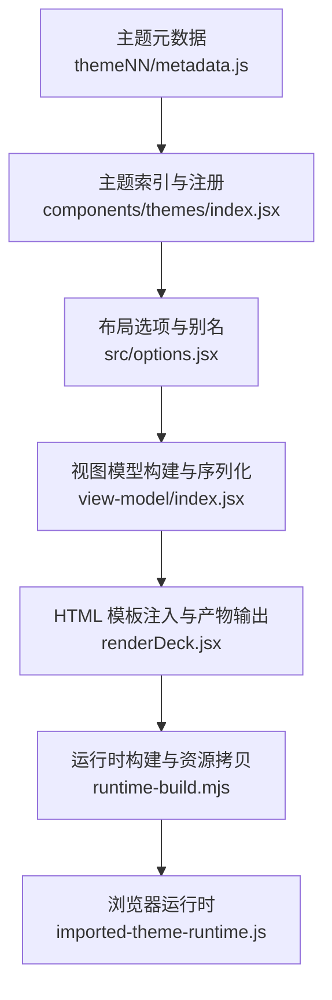
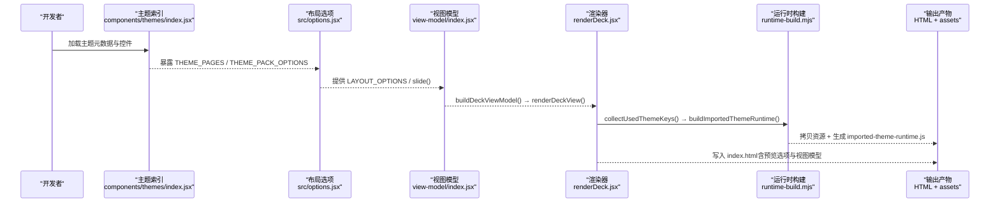
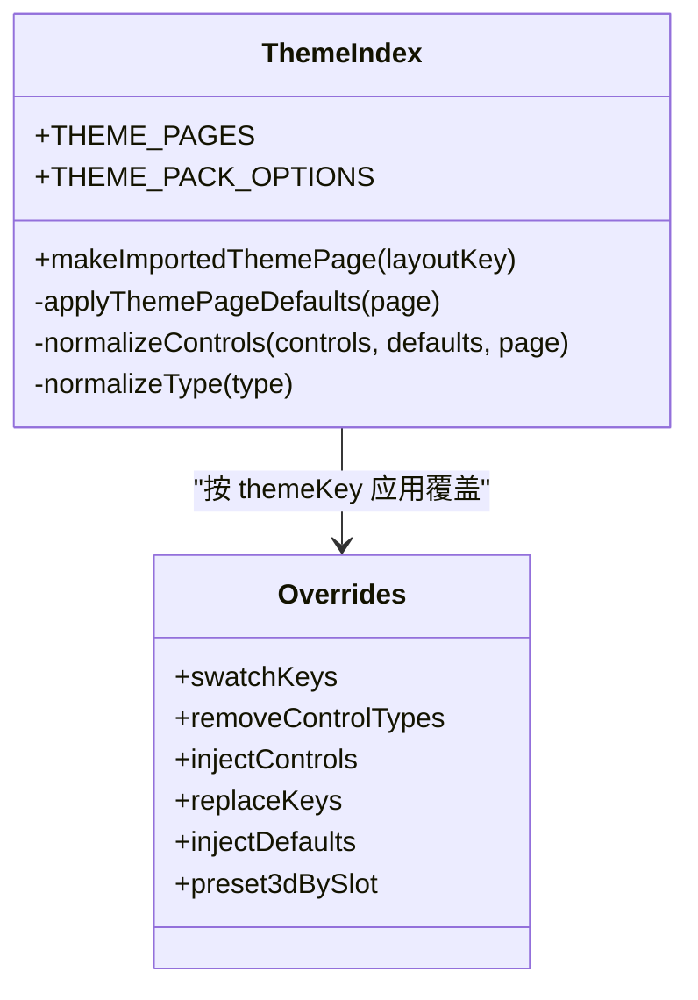
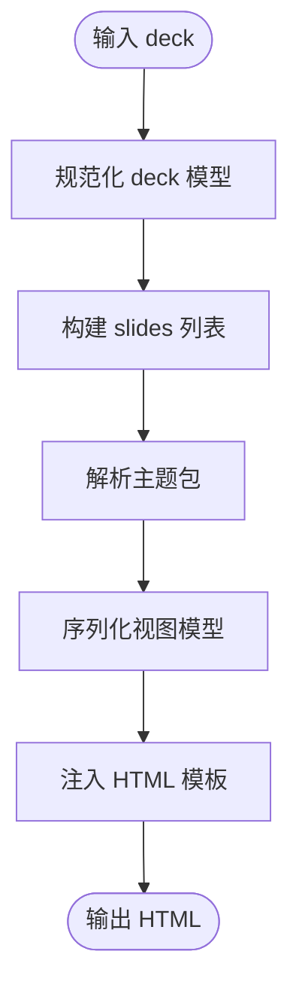
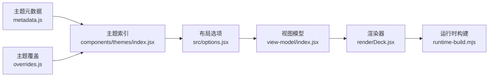
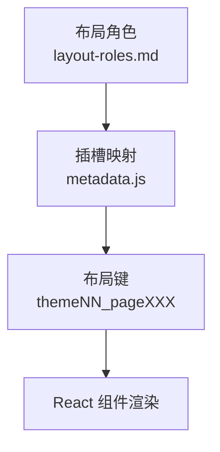
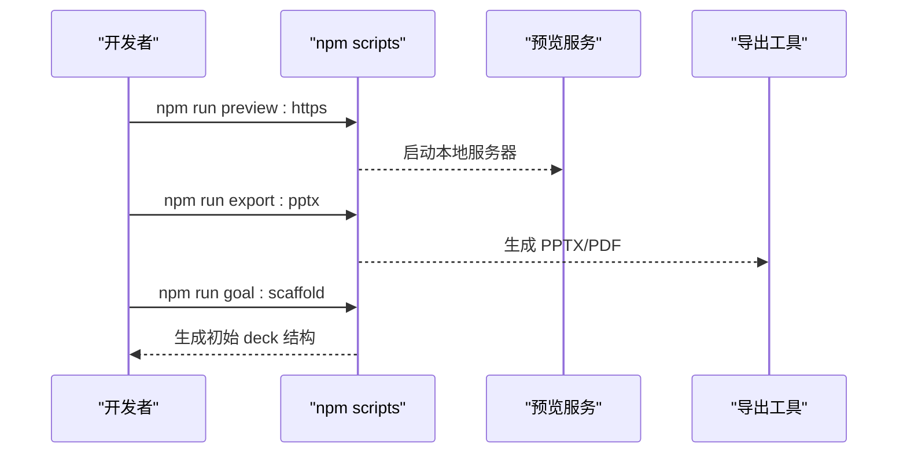

# 自定义主题开发

<cite>
**本文引用的文件**   
- [README.md](file://skills/dashiai-ppt/README.md)
- [SKILL.md](file://skills/dashiai-ppt/SKILL.md)
- [layout-roles.md](file://skills/dashiai-ppt/references/layout-roles.md)
- [index.jsx](file://skills/dashiai-ppt/project/src/components/themes/index.jsx)
- [metadata.js](file://skills/dashiai-ppt/project/src/components/themes/theme01/metadata.js)
- [overrides.js](file://skills/dashiai-ppt/project/src/components/themes/theme02/overrides.js)
- [renderDeck.jsx](file://skills/dashiai-ppt/project/src/renderDeck.jsx)
- [options.jsx](file://skills/dashiai-ppt/project/src/options.jsx)
- [index.jsx（视图模型）](file://skills/dashiai-ppt/project/src/view-model/index.jsx)
- [runtime-build.mjs](file://skills/dashiai-ppt/project/src/components/themes/runtime-build.mjs)
- [package.json](file://skills/dashiai-ppt/project/package.json)
- [annual-review.json](file://skills/dashiai-ppt/references/examples/annual-review.json)
</cite>

## 目录
1. [引言](#引言)
2. [项目结构](#项目结构)
3. [核心组件](#核心组件)
4. [架构总览](#架构总览)
5. [详细组件分析](#详细组件分析)
6. [依赖关系分析](#依赖关系分析)
7. [性能与构建特性](#性能与构建特性)
8. [主题开发与样式规范](#主题开发与样式规范)
9. [布局角色与插槽机制](#布局角色与插槽机制)
10. [预览、测试与发布流程](#预览测试与发布流程)
11. [常见问题与排错](#常见问题与排错)
12. [结论](#结论)

## 引言
本指南面向希望在 DashIAI PPT 中从零开始创建完整自定义主题的开发者。内容涵盖：项目初始化与目录结构、主题元数据与控件契约、样式编写规范、组件集成方式、布局角色定义与图像插槽处理、动态内容渲染、预览与测试方法，以及打包发布流程。文档同时提供可视化架构图与流程图，帮助不同技术背景的读者快速上手。

## 项目结构
DashIAI PPT 的主题系统位于 skills/dashiai-ppt 目录下，核心由“主题元数据 + 运行时渲染 + 构建工具链”三部分组成：
- 主题元数据：每个主题包含 metadata.js（页面键、槽位、控件、默认值等），以及可选的 overrides.js（主题级控件特例）。
- 运行时渲染：通过 React 组件将主题页渲染为 HTML，支持交互编辑与导出。
- 构建工具链：根据 deck 实际使用的主题集合，生成浏览器运行时 bundle，并拷贝必要资源。

**图表来源** 
- [index.jsx:1-172](file://skills/dashiai-ppt/project/src/components/themes/index.jsx#L1-L172)
- [options.jsx:1-43](file://skills/dashiai-ppt/project/src/options.jsx#L1-L43)
- [index.jsx（视图模型）:1-369](file://skills/dashiai-ppt/project/src/view-model/index.jsx#L1-L369)
- [renderDeck.jsx:1-373](file://skills/dashiai-ppt/project/src/renderDeck.jsx#L1-L373)
- [runtime-build.mjs:1-162](file://skills/dashiai-ppt/project/src/components/themes/runtime-build.mjs#L1-L162)

**章节来源**
- [README.md:1-62](file://skills/dashiai-ppt/README.md#L1-L62)
- [SKILL.md:1-57](file://skills/dashiai-ppt/SKILL.md#L1-L57)

## 核心组件
- 主题索引与页面注册：集中管理主题页键、控件归一化、默认值合并与主题覆盖。
- 布局选项与别名：将主题页映射为可选择的布局项，并提供 slide() API 创建幻灯片模型。
- 视图模型：将 deck 数据转换为可渲染的 slides 列表，并序列化到 HTML。
- 渲染器：读取模板、注入预览选项与视图模型、复制运行时资源、生成最终 HTML。
- 运行时构建：根据使用到的主题集合，选择源码或预构建模块路径，生成浏览器端运行时。

**章节来源**
- [index.jsx:1-172](file://skills/dashiai-ppt/project/src/components/themes/index.jsx#L1-L172)
- [options.jsx:1-43](file://skills/dashiai-ppt/project/src/options.jsx#L1-L43)
- [index.jsx（视图模型）:1-369](file://skills/dashiai-ppt/project/src/view-model/index.jsx#L1-L369)
- [renderDeck.jsx:1-373](file://skills/dashiai-ppt/project/src/renderDeck.jsx#L1-L373)
- [runtime-build.mjs:1-162](file://skills/dashiai-ppt/project/src/components/themes/runtime-build.mjs#L1-L162)

## 架构总览
下图展示了从主题元数据到最终 HTML 产物的关键调用链与数据流。

**图表来源** 
- [index.jsx:1-172](file://skills/dashiai-ppt/project/src/components/themes/index.jsx#L1-L172)
- [options.jsx:1-43](file://skills/dashiai-ppt/project/src/options.jsx#L1-L43)
- [index.jsx（视图模型）:1-369](file://skills/dashiai-ppt/project/src/view-model/index.jsx#L1-L369)
- [renderDeck.jsx:1-373](file://skills/dashiai-ppt/project/src/renderDeck.jsx#L1-L373)
- [runtime-build.mjs:1-162](file://skills/dashiai-ppt/project/src/components/themes/runtime-build.mjs#L1-L162)

## 详细组件分析

### 主题索引与控件归一化
- 主题页清单：从生成的元数据中收集所有主题页，应用主题级覆盖（移除控件类型、注入新控件、预设默认值）。
- 控件归一化：统一控件类型（如 slider/number→range；enum/select→select；toggle/boolean→toggle），自动推断显示样式（颜色选择器、标签页等）。
- 导入主题页组件：makeImportedThemePage 返回一个 React 组件，绑定 data-* 属性与 ViewModel 上下文，便于交互编辑。

**图表来源** 
- [index.jsx:1-172](file://skills/dashiai-ppt/project/src/components/themes/index.jsx#L1-L172)
- [overrides.js:1-5](file://skills/dashiai-ppt/project/src/components/themes/theme02/overrides.js#L1-L5)

**章节来源**
- [index.jsx:1-172](file://skills/dashiai-ppt/project/src/components/themes/index.jsx#L1-L172)
- [overrides.js:1-5](file://skills/dashiai-ppt/project/src/components/themes/theme02/overrides.js#L1-L5)

### 布局选项与 slide API
- 布局选项：将主题页映射为布局项，包含 label、dataLayout、component。
- 别名解析：支持以 slot 命名的别名（如 cover-editorial）指向具体 layout key。
- slide()：创建幻灯片模型，校验布局名称并返回标准结构。

**章节来源**
- [options.jsx:1-43](file://skills/dashiai-ppt/project/src/options.jsx#L1-L43)

### 视图模型与序列化
- 构建视图模型：规范化 deck 数据，生成 slides、state、options，并确定当前主题包。
- 渲染视图：遍历 slides，为每个幻灯片提供 SlideViewModelProvider 上下文。
- 序列化：将视图模型序列化为 JSON，嵌入 HTML 供浏览器水合。

**图表来源** 
- [index.jsx（视图模型）:1-369](file://skills/dashiai-ppt/project/src/view-model/index.jsx#L1-L369)
- [renderDeck.jsx:1-373](file://skills/dashiai-ppt/project/src/renderDeck.jsx#L1-L373)

**章节来源**
- [index.jsx（视图模型）:1-369](file://skills/dashiai-ppt/project/src/view-model/index.jsx#L1-L369)

### 渲染器与资源拷贝
- 模板注入：在模板中插入 slides 标记、标题、预览选项与视图模型。
- 资源拷贝：复制必需 vendor 库与运行时资产，按使用的主题裁剪资源。
- 运行时构建：根据环境变量与可用产物，选择源码或预构建模块路径生成 imported-theme-runtime.js。

**章节来源**
- [renderDeck.jsx:1-373](file://skills/dashiai-ppt/project/src/renderDeck.jsx#L1-L373)
- [runtime-build.mjs:1-162](file://skills/dashiai-ppt/project/src/components/themes/runtime-build.mjs#L1-L162)

### 主题元数据示例
- 每个主题页包含 key、pageNumber、layout、slot、label、bgClass、controls、defaultProps 等字段。
- controls 描述用户可调节的控件（范围、开关、颜色、选择等），defaultProps 提供默认值。

**章节来源**
- [metadata.js:1-800](file://skills/dashiai-ppt/project/src/components/themes/theme01/metadata.js#L1-L800)

## 依赖关系分析
- 主题索引依赖主题元数据与覆盖配置。
- 布局选项依赖主题索引暴露的 THEME_PAGES 与 THEME_PACK_OPTIONS。
- 视图模型依赖布局选项与合约校验。
- 渲染器依赖视图模型与运行时构建。
- 运行时构建依赖 esbuild 与主题源或预构建模块。

**图表来源** 
- [metadata.js:1-800](file://skills/dashiai-ppt/project/src/components/themes/theme01/metadata.js#L1-L800)
- [overrides.js:1-5](file://skills/dashiai-ppt/project/src/components/themes/theme02/overrides.js#L1-L5)
- [index.jsx:1-172](file://skills/dashiai-ppt/project/src/components/themes/index.jsx#L1-L172)
- [options.jsx:1-43](file://skills/dashiai-ppt/project/src/options.jsx#L1-L43)
- [index.jsx（视图模型）:1-369](file://skills/dashiai-ppt/project/src/view-model/index.jsx#L1-L369)
- [renderDeck.jsx:1-373](file://skills/dashiai-ppt/project/src/renderDeck.jsx#L1-L373)
- [runtime-build.mjs:1-162](file://skills/dashiai-ppt/project/src/components/themes/runtime-build.mjs#L1-L162)

**章节来源**
- [package.json:1-37](file://skills/dashiai-ppt/project/package.json#L1-L37)

## 性能与构建特性
- 按需构建：仅打包 deck 实际使用的主题，减少产物体积。
- 双路径构建：开发环境使用主题源码，安装版使用预构建模块，确保一致的水合行为。
- React 去重：通过绝对路径别名强制 react 子路径指向同一份副本，避免多实例导致的水合错误。
- 资源裁剪：仅拷贝所需主题的资源，避免泄露其他主题素材。

**章节来源**
- [renderDeck.jsx:1-373](file://skills/dashiai-ppt/project/src/renderDeck.jsx#L1-L373)
- [runtime-build.mjs:1-162](file://skills/dashiai-ppt/project/src/components/themes/runtime-build.mjs#L1-L162)

## 主题开发与样式规范
- 主题元数据结构：遵循 metadata.js 中的字段约定（key、layout、slot、controls、defaultProps）。
- 控件命名与类型：使用统一的控件类型映射，确保 UI 一致性。
- 默认值与约束：在 defaultProps 中提供合理默认值，并在 controls 中设置 min/max/step 等约束。
- 主题覆盖：通过 overrides.js 指定 swatchKeys、removeControlTypes、injectControls 等特例。
- 样式组织：建议将 CSS 与主题源码分离，通过构建阶段内联与压缩。

**章节来源**
- [metadata.js:1-800](file://skills/dashiai-ppt/project/src/components/themes/theme01/metadata.js#L1-L800)
- [overrides.js:1-5](file://skills/dashiai-ppt/project/src/components/themes/theme02/overrides.js#L1-L5)
- [index.jsx:1-172](file://skills/dashiai-ppt/project/src/components/themes/index.jsx#L1-L172)

## 布局角色与插槽机制
- 布局角色：用于草稿阶段理解页面功能（cover、statement、breakdown、transition 等），交付前需替换为具体 layout。
- 插槽（slot）：描述页面的视觉区域（如 cover-editorial、pf-gallery、rounds），与布局 key 对应。
- 媒体插槽：支持图片与视频插槽，定义数量、可见数、接受类型等。

**图表来源** 
- [layout-roles.md:1-29](file://skills/dashiai-ppt/references/layout-roles.md#L1-L29)
- [metadata.js:1-800](file://skills/dashiai-ppt/project/src/components/themes/theme01/metadata.js#L1-L800)

**章节来源**
- [layout-roles.md:1-29](file://skills/dashiai-ppt/references/layout-roles.md#L1-L29)

## 预览、测试与发布流程
- 预览启动：使用 npm scripts 启动本地预览服务器，支持 HTTPS 回退方案。
- 目标脚手架：通过 goal:scaffold 生成初始 deck 结构。
- 导出：支持导出 PPTX 与 PDF。
- 发布：确保主题元数据与覆盖配置正确，运行构建脚本生成运行时与资源。

**图表来源** 
- [package.json:1-37](file://skills/dashiai-ppt/project/package.json#L1-L37)
- [SKILL.md:1-57](file://skills/dashiai-ppt/SKILL.md#L1-L57)

**章节来源**
- [package.json:1-37](file://skills/dashiai-ppt/project/package.json#L1-L37)
- [SKILL.md:1-57](file://skills/dashiai-ppt/SKILL.md#L1-L57)

## 常见问题与排错
- 未知布局名称：检查 layout 是否匹配 THEME_PAGES 中的 key。
- 控件类型不识别：确认控件类型映射是否正确（如 slider→range）。
- 运行时缺失：确保主题源或预构建模块存在，环境变量 DASHI_PPT_THEME_RUNTIME 设置正确。
- React 多实例：检查别名配置，确保 react 子路径指向同一副本。
- 资源冲突：避免主题资源输出路径重复。

**章节来源**
- [options.jsx:1-43](file://skills/dashiai-ppt/project/src/options.jsx#L1-L43)
- [index.jsx:1-172](file://skills/dashiai-ppt/project/src/components/themes/index.jsx#L1-L172)
- [renderDeck.jsx:1-373](file://skills/dashiai-ppt/project/src/renderDeck.jsx#L1-L373)
- [runtime-build.mjs:1-162](file://skills/dashiai-ppt/project/src/components/themes/runtime-build.mjs#L1-L162)

## 结论
通过本指南，开发者可以系统地掌握 DashIAI PPT 自定义主题的开发方法，包括元数据定义、控件契约、样式规范、组件集成与构建发布。结合可视化架构图与流程图，读者可以快速定位问题并优化主题实现。建议在开发过程中严格遵循控件命名与默认值约定，确保主题的一致性与可维护性。