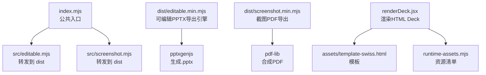
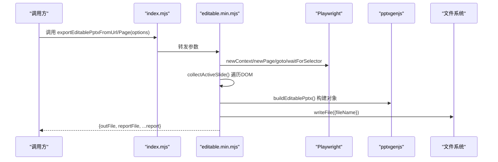
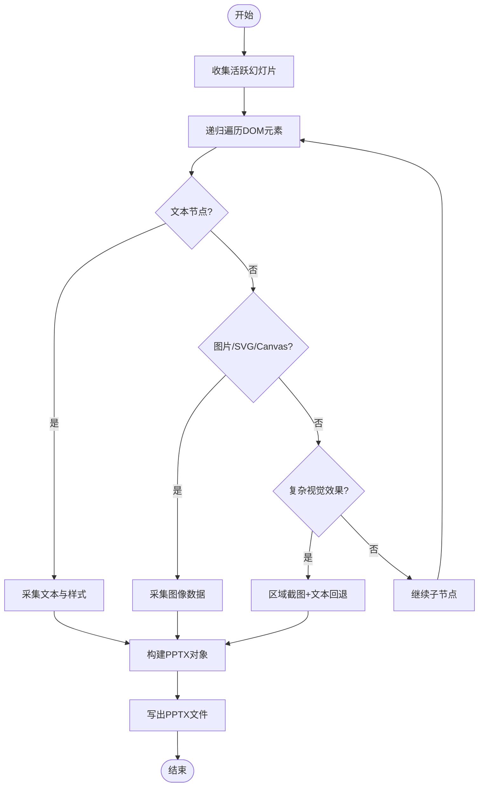
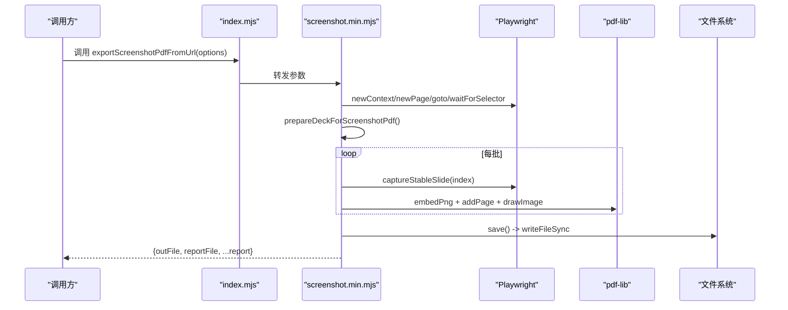
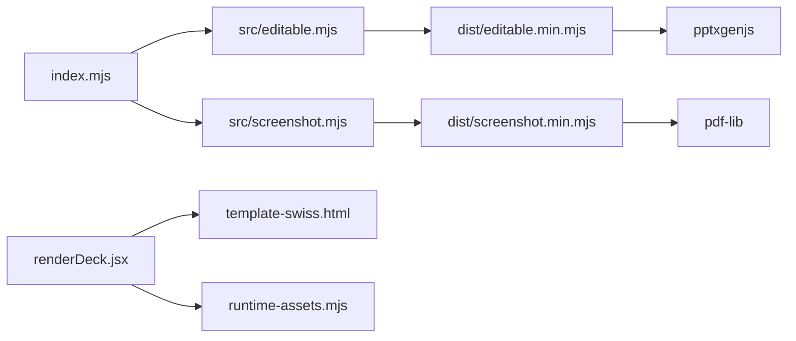

# 交互编辑器

<cite>
**本文引用的文件**   
- [index.mjs](file://skills/dashiai-ppt/project/packages/html-deck-to-pptx/index.mjs)
- [package.json](file://skills/dashiai-ppt/project/packages/html-deck-to-pptx/package.json)
- [editable.mjs](file://skills/dashiai-ppt/project/packages/html-deck-to-pptx/src/editable.mjs)
- [screenshot.mjs](file://skills/dashiai-ppt/project/packages/html-deck-to-pptx/src/screenshot.mjs)
- [editable.min.mjs](file://skills/dashiai-ppt/project/packages/html-deck-to-pptx/dist/editable.min.mjs)
- [screenshot.min.mjs](file://skills/dashiai-ppt/project/packages/html-deck-to-pptx/dist/screenshot.min.mjs)
- [renderDeck.jsx](file://skills/dashiai-ppt/project/src/renderDeck.jsx)
- [runtime-assets.mjs](file://skills/dashiai-ppt/project/src/runtime-assets.mjs)
- [template-swiss.html](file://skills/dashiai-ppt/project/assets/template-swiss.html)
</cite>

## 目录
1. [简介](#简介)
2. [项目结构](#项目结构)
3. [核心组件](#核心组件)
4. [架构总览](#架构总览)
5. [详细组件分析](#详细组件分析)
6. [依赖分析](#依赖分析)
7. [性能考量](#性能考量)
8. [故障排查指南](#故障排查指南)
9. [结论](#结论)
10. [附录：API 参考与集成示例](#附录api-参考与集成示例)

## 简介
本文件面向 DashIAI PPT 交互编辑器的“可编辑幻灯片”能力，聚焦以下目标：
- 文字修改、图片替换、实时预览与状态同步机制
- 导出引擎（可编辑 .pptx）与截图式 PDF 导出的实现要点
- editable.mjs 的编辑能力与变更检测思路
- screenshot.mjs 的页面捕获流程
- 编辑器扩展点（自定义工具栏、快捷键、撤销重做）
- API 参考与集成示例

说明：
- 包内 src/editable.mjs 与 src/screenshot.mjs 为公开入口，实际实现位于 dist/*.min.mjs。
- 运行时模板与资源由 renderDeck.jsx 与 runtime-assets.mjs 管理，最终产物为可交互的 HTML Deck，再由导出引擎生成可编辑 PPTX 或截图 PDF。

## 项目结构
- 包入口 index.mjs 暴露三类导出函数：
  - exportEditablePptxFromUrl / exportEditablePptxFromPage：从 URL 或 Page 生成可编辑 .pptx
  - exportScreenshotPdfFromUrl：截图式 PDF 导出
- 源码入口 editable.mjs 与 screenshot.mjs 仅转发到 dist 下的构建产物
- 运行时渲染由 renderDeck.jsx 负责，将 React 视图注入 template-swiss.html，并拷贝必要 vendor 资源
- runtime-assets.mjs 声明运行时所需资产清单（含字体、主题运行时、第三方库等）

图表来源
- [index.mjs:1-16](file://skills/dashiai-ppt/project/packages/html-deck-to-pptx/index.mjs#L1-L16)
- [editable.mjs:1-3](file://skills/dashiai-ppt/project/packages/html-deck-to-pptx/src/editable.mjs#L1-L3)
- [screenshot.mjs:1-3](file://skills/dashiai-ppt/project/packages/html-deck-to-pptx/src/screenshot.mjs#L1-L3)
- [renderDeck.jsx:41-63](file://skills/dashiai-ppt/project/src/renderDeck.jsx#L41-L63)
- [runtime-assets.mjs:1-44](file://skills/dashiai-ppt/project/src/runtime-assets.mjs#L1-L44)

章节来源
- [index.mjs:1-16](file://skills/dashiai-ppt/project/packages/html-deck-to-pptx/index.mjs#L1-L16)
- [package.json:1-37](file://skills/dashiai-ppt/project/packages/html-deck-to-pptx/package.json#L1-L37)
- [renderDeck.jsx:41-63](file://skills/dashiai-ppt/project/src/renderDeck.jsx#L41-L63)
- [runtime-assets.mjs:1-44](file://skills/dashiai-ppt/project/src/runtime-assets.mjs#L1-L44)

## 核心组件
- 可编辑 PPTX 导出引擎（editable.min.mjs）
  - 基于 Playwright 打开/控制浏览器页，遍历当前激活幻灯片 DOM，采集文本、图片、SVG、Canvas、背景渐变/遮罩/混合模式等视觉信息
  - 通过 pptxgenjs 重建形状、文本、图片对象，尽量保持可编辑性（非纯位图），对复杂效果采用“区域截图 + 文本回退”策略
  - 支持进度回调、报告输出、字体映射、透明度/阴影/边框/圆角近似处理
- 截图 PDF 导出（screenshot.min.mjs）
  - 使用 pdf-lib 创建 PDF，按批次截取每页稳定帧，自动禁用动画、等待字体与媒体加载、稳定性校验后写入 PNG
  - 支持批量大小、超时、进度回调、报告输出
- 运行时渲染（renderDeck.jsx）
  - 构建 ViewModel，渲染 React 视图，注入模板，复制 vendor 与主题资源，生成可交互 HTML Deck
  - 提供导入主题运行时、按需裁剪主题资产的能力

章节来源
- [editable.min.mjs:1-114](file://skills/dashiai-ppt/project/packages/html-deck-to-pptx/dist/editable.min.mjs#L1-L114)
- [screenshot.min.mjs:1-4](file://skills/dashiai-ppt/project/packages/html-deck-to-pptx/dist/screenshot.min.mjs#L1-L4)
- [renderDeck.jsx:41-63](file://skills/dashiai-ppt/project/src/renderDeck.jsx#L41-L63)

## 架构总览
整体流程分为两条主线：
- 可编辑 PPTX 导出：Playwright 控制页面 → 采集 DOM 树 → 构建 PPTX 对象 → 写出文件
- 截图 PDF 导出：Playwright 控制页面 → 稳定帧截图 → 嵌入 PDF → 写出文件

图表来源
- [index.mjs:1-16](file://skills/dashiai-ppt/project/packages/html-deck-to-pptx/index.mjs#L1-L16)
- [editable.min.mjs:1-114](file://skills/dashiai-ppt/project/packages/html-deck-to-pptx/dist/editable.min.mjs#L1-L114)

章节来源
- [index.mjs:1-16](file://skills/dashiai-ppt/project/packages/html-deck-to-pptx/index.mjs#L1-L16)
- [editable.min.mjs:1-114](file://skills/dashiai-ppt/project/packages/html-deck-to-pptx/dist/editable.min.mjs#L1-L114)

## 详细组件分析

### 可编辑 PPTX 导出引擎（editable.min.mjs）
- 关键流程
  - 收集活跃幻灯片：选择 #deck > .slide.active 或 data-deck-active 节点，计算可视矩形
  - 递归采集元素：文本节点、图片、SVG、Canvas、伪元素、背景渐变/图案、遮罩/混合模式等
  - 视觉回退：对复杂 CSS 效果（渐变、遮罩、混合、圆角组合）进行区域截图，同时提取文本作为回退
  - 重建 PPTX：使用 pptxgenjs 添加形状、文本、图片；近似处理边框、阴影、圆角、旋转、透明度
  - 进度与报告：onProgress 回调、warnings 汇总、slideSummaries 统计
- 编辑能力与状态同步
  - 通过 data-editable-id、data-syncText 等属性标记可编辑文本节点
  - applyEditablePptxSnapshot 可将快照中的 text/props/state 同步回 DOM，驱动 UI 更新
  - 支持画布快照（canvasSnapshots）以保留 Canvas 内容
- 字体与颜色
  - 内置 PPTX 安全字体映射表，CJK/英文字体自动映射
  - 解析 CSS 颜色、渐变、透明度，转换为 pptxgenjs 可用格式

图表来源
- [editable.min.mjs:1-114](file://skills/dashiai-ppt/project/packages/html-deck-to-pptx/dist/editable.min.mjs#L1-L114)

章节来源
- [editable.min.mjs:1-114](file://skills/dashiai-ppt/project/packages/html-deck-to-pptx/dist/editable.min.mjs#L1-L114)

### 截图 PDF 导出（screenshot.min.mjs）
- 关键流程
  - 打开页面并等待激活幻灯片出现
  - 可选应用 deck 快照（applyDeckSnapshot）恢复文本/主题/顺序等状态
  - 准备截图环境：禁用动画、移除半径、同步页码、布局
  - 逐页截图：多次尝试确保稳定性（contentAreaRatio、唯一颜色数、空白检测）
  - 嵌入 PDF：使用 pdf-lib 创建页面并绘制 PNG
  - 输出报告：包含批次、页数、稳定性指标、字节数等
- 稳定性与性能
  - 分批处理（默认 8 页/批），可调 batchSize
  - 超时与重试策略，避免阻塞
  - 像素级分析（stdDev、uniqueColors、nonBackgroundRatio）判断是否空页

图表来源
- [index.mjs:1-16](file://skills/dashiai-ppt/project/packages/html-deck-to-pptx/index.mjs#L1-L16)
- [screenshot.min.mjs:1-4](file://skills/dashiai-ppt/project/packages/html-deck-to-pptx/dist/screenshot.min.mjs#L1-L4)

章节来源
- [screenshot.min.mjs:1-4](file://skills/dashiai-ppt/project/packages/html-deck-to-pptx/dist/screenshot.min.mjs#L1-L4)

### 运行时渲染（renderDeck.jsx）
- 功能要点
  - 构建 ViewModel，渲染 React 视图，注入模板
  - 注入 preview-options 与 deck-view-model JSON
  - 复制 vendor 资源（gsap、pptxgenjs、pdf-lib、html-to-image）与主题运行时
  - 根据使用的主题键集合裁剪主题资源，减少体积
- 模板与资源
  - 模板 assets/template-swiss.html 包含自托管字体与基础样式
  - runtime-assets.mjs 声明必需资产路径与生成产物

章节来源
- [renderDeck.jsx:41-63](file://skills/dashiai-ppt/project/src/renderDeck.jsx#L41-L63)
- [runtime-assets.mjs:1-44](file://skills/dashiai-ppt/project/src/runtime-assets.mjs#L1-L44)
- [template-swiss.html:1-200](file://skills/dashiai-ppt/project/assets/template-swiss.html#L1-L200)

## 依赖分析
- 外部依赖
  - pptxgenjs：生成可编辑 .pptx
  - pdf-lib：合成 PDF
  - pngjs：PNG 像素分析
  - playwright-core：无头浏览器控制
- 内部模块关系
  - index.mjs 统一对外暴露 API
  - src/editable.mjs 与 src/screenshot.mjs 转发至 dist 构建产物
  - renderDeck.jsx 负责运行时资源与模板装配

图表来源
- [index.mjs:1-16](file://skills/dashiai-ppt/project/packages/html-deck-to-pptx/index.mjs#L1-L16)
- [editable.mjs:1-3](file://skills/dashiai-ppt/project/packages/html-deck-to-pptx/src/editable.mjs#L1-L3)
- [screenshot.mjs:1-3](file://skills/dashiai-ppt/project/packages/html-deck-to-pptx/src/screenshot.mjs#L1-L3)
- [renderDeck.jsx:41-63](file://skills/dashiai-ppt/project/src/renderDeck.jsx#L41-L63)
- [runtime-assets.mjs:1-44](file://skills/dashiai-ppt/project/src/runtime-assets.mjs#L1-L44)

章节来源
- [package.json:1-37](file://skills/dashiai-ppt/project/packages/html-deck-to-pptx/package.json#L1-L37)
- [index.mjs:1-16](file://skills/dashiai-ppt/project/packages/html-deck-to-pptx/index.mjs#L1-L16)

## 性能考量
- 可编辑 PPTX 导出
  - DOM 遍历复杂度与幻灯片规模线性相关；复杂 CSS 效果会触发截图回退，增加 CPU/内存开销
  - 建议限制单页元素数量，避免过深的嵌套层级
  - 合理使用 onProgress 反馈，避免长时间无响应
- 截图 PDF 导出
  - 分批处理降低峰值内存；batchSize 可根据设备调整
  - 稳定性检测（contentAreaRatio、唯一颜色数）避免无效页
  - 超时与重试策略防止卡死
- 运行时渲染
  - 按需裁剪主题资源，减少交付体积
  - 预构建主题运行时可降低 esbuild 编译时间

[本节为通用指导，不直接分析具体文件]

## 故障排查指南
- 常见问题
  - 未找到活跃幻灯片：检查 activeSlideSelector 是否正确匹配 #deck > .slide.active 或 data-deck-active
  - 图片不可读：确认图片源为 data URL 或可访问的 URL；跨域需 omit credentials
  - SVG 栅格化失败：检查 SVG 尺寸与文本节点，必要时启用 stripText
  - Canvas 被污染：toDataURL 抛错时跳过该节点
  - 渐变/遮罩/混合模式丢失：引擎已做回退截图，但文本可能缺失，需检查 warnings
- 调试建议
  - 启用 reportFile 查看 slideSummaries 与 warnings
  - 使用 onProgress 观察阶段耗时
  - 在浏览器中手动验证 DOM 结构与样式

章节来源
- [editable.min.mjs:1-114](file://skills/dashiai-ppt/project/packages/html-deck-to-pptx/dist/editable.min.mjs#L1-L114)
- [screenshot.min.mjs:1-4](file://skills/dashiai-ppt/project/packages/html-deck-to-pptx/dist/screenshot.min.mjs#L1-L4)

## 结论
DashIAI PPT 交互编辑器的导出引擎在“可编辑性优先”的原则下，通过 DOM 采集与视觉回退策略，尽可能保留文本与形状的可编辑性；截图 PDF 导出则以稳定性为核心，确保输出一致性与可靠性。运行时渲染与资源管理保证了交付物的完整性与体积优化。结合提供的 API 与扩展点，可在不侵入核心代码的前提下定制工具栏、快捷键与撤销重做等行为。

[本节为总结，不直接分析具体文件]

## 附录：API 参考与集成示例

### 公共 API
- exportEditablePptxFromUrl(browser, url, options)
  - 输入：Playwright browser 实例、Deck URL、options（title、activeSlideSelector、timeout、onProgress、outFile、reportFile）
  - 输出：{ outFile, reportFile, captureMode, slideCount, textObjects, shapeObjects, imageObjects, slideSummaries, warnings }
- exportEditablePptxFromPage(page, options)
  - 输入：已打开的 Playwright page 实例、options
  - 输出：同上
- exportScreenshotPdfFromUrl(browser, url, options)
  - 输入：Playwright browser 实例、Deck URL、options（title、batchSize、timeout、onProgress、outFile、reportFile）
  - 输出：{ outFile, reportFile, screenshot, pages, batches, slideReports, bytes }

章节来源
- [index.mjs:1-16](file://skills/dashiai-ppt/project/packages/html-deck-to-pptx/index.mjs#L1-L16)

### 集成示例（概念流程）
- 可编辑 PPTX 导出
  - 启动 Playwright 浏览器
  - 打开 Deck URL，等待 #deck > .slide.active 出现
  - 调用 exportEditablePptxFromUrl 或 exportEditablePptxFromPage
  - 监听 onProgress，获取 reportFile 用于诊断
  - 保存 outFile 为最终产物
- 截图 PDF 导出
  - 启动 Playwright 浏览器
  - 打开 Deck URL，等待激活幻灯片
  - 调用 exportScreenshotPdfFromUrl
  - 监听 onProgress，获取 reportFile 用于诊断
  - 保存 outFile 为最终产物

章节来源
- [editable.min.mjs:1-114](file://skills/dashiai-ppt/project/packages/html-deck-to-pptx/dist/editable.min.mjs#L1-L114)
- [screenshot.min.mjs:1-4](file://skills/dashiai-ppt/project/packages/html-deck-to-pptx/dist/screenshot.min.mjs#L1-L4)

### 编辑器扩展点
- 自定义工具栏
  - 在运行时注入自定义按钮，触发 deckViewModel.setTextState/setProps 等方法
  - 通过 data-editable-id 与 data-syncText 绑定文本节点
- 快捷键
  - 在页面层注册键盘事件，调用 __syncDeckViewModelFromDom 与 __layoutDeck 刷新
- 撤销重做
  - 维护 history 栈，记录 state.text/props 快照，支持回滚与重放
  - 利用 applyEditablePptxSnapshot 恢复状态

章节来源
- [editable.min.mjs:1-114](file://skills/dashiai-ppt/project/packages/html-deck-to-pptx/dist/editable.min.mjs#L1-L114)
- [renderDeck.jsx:41-63](file://skills/dashiai-ppt/project/src/renderDeck.jsx#L41-L63)