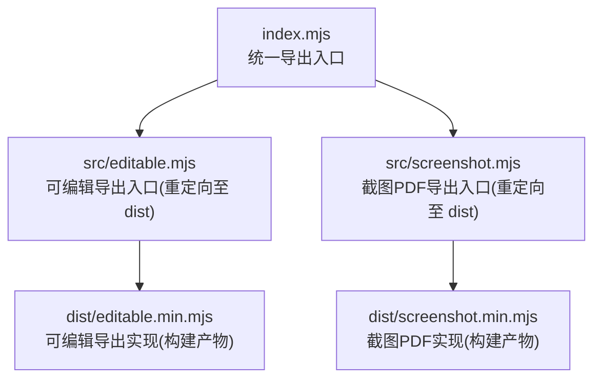
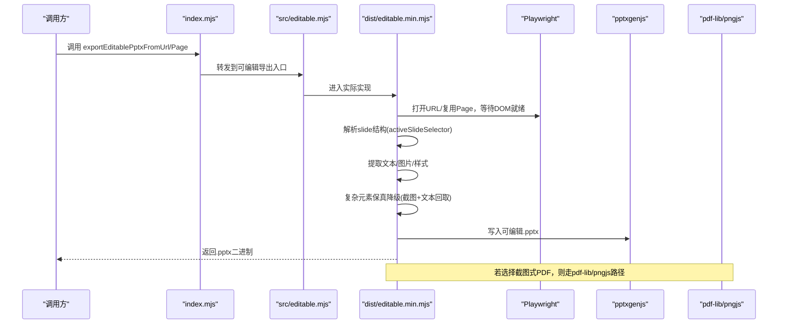
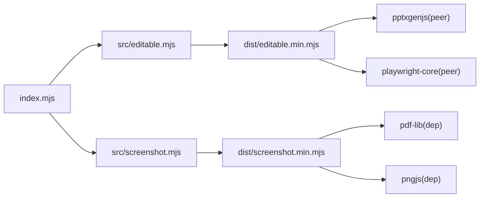
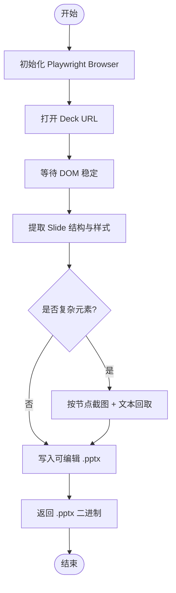

# 可编辑功能

<cite>
**本文引用的文件**   
- [index.mjs](file://skills/dashiai-ppt/project/packages/html-deck-to-pptx/index.mjs)
- [editable.mjs](file://skills/dashiai-ppt/project/packages/html-deck-to-pptx/src/editable.mjs)
- [screenshot.mjs](file://skills/dashiai-ppt/project/packages/html-deck-to-pptx/src/screenshot.mjs)
- [package.json](file://skills/dashiai-ppt/project/packages/html-deck-to-pptx/package.json)
</cite>

## 目录
1. [简介](#简介)
2. [项目结构](#项目结构)
3. [核心组件](#核心组件)
4. [架构总览](#架构总览)
5. [详细组件分析](#详细组件分析)
6. [依赖关系分析](#依赖关系分析)
7. [性能考量](#性能考量)
8. [故障排查指南](#故障排查指南)
9. [结论](#结论)
10. [附录：API 参考与使用示例](#附录api-参考与使用示例)

## 简介
本文件聚焦 DashIAI PPT 的“可编辑导出”能力，围绕 html-deck-to-pptx 包的可编辑 .pptx 生成流程进行说明。该能力通过 Playwright 渲染 HTML 幻灯片，解析 DOM 结构与样式，将内容以“可编辑”的形式写入 PowerPoint（.pptx），并在复杂场景下采用“逐区域截图 + 文本回取”的保真降级策略，确保渐变、SVG、复杂背景等元素在 PPTX 中仍可编辑。

需要特别说明的是：当前仓库中的 editable.mjs 为公共入口重定向，实际实现位于构建产物 dist/editable.min.mjs；同理 screenshot.mjs 指向 dist/screenshot.min.mjs。因此，本文基于现有源码与包描述进行架构与行为分析，并给出扩展点与集成建议。

## 项目结构
html-deck-to-pptx 包提供统一的导出入口，暴露两类 API：
- 可编辑 .pptx 导出：exportEditablePptxFromUrl / exportEditablePptxFromPage
- 截图式 PDF 导出：exportScreenshotPdfFromUrl

图表来源 
- [index.mjs:1-16](file://skills/dashiai-ppt/project/packages/html-deck-to-pptx/index.mjs#L1-L16)
- [editable.mjs:1-3](file://skills/dashiai-ppt/project/packages/html-deck-to-pptx/src/editable.mjs#L1-L3)
- [screenshot.mjs:1-3](file://skills/dashiai-ppt/project/packages/html-deck-to-pptx/src/screenshot.mjs#L1-L3)

章节来源
- [index.mjs:1-16](file://skills/dashiai-ppt/project/packages/html-deck-to-pptx/index.mjs#L1-L16)
- [package.json:1-37](file://skills/dashiai-ppt/project/packages/html-deck-to-pptx/package.json#L1-L37)

## 核心组件
- 统一入口 index.mjs：对外暴露三类导出函数，屏蔽内部模块差异，便于上层调用。
- 可编辑导出 src/editable.mjs：作为可编辑导出的入口，实际逻辑由 dist/editable.min.mjs 提供。
- 截图PDF导出 src/screenshot.mjs：作为截图式PDF导出的入口，实际逻辑由 dist/screenshot.min.mjs 提供。
- 包元数据 package.json：声明类型、依赖（pptxgenjs、playwright-core、pdf-lib、pngjs）与 Node 版本要求。

章节来源
- [index.mjs:1-16](file://skills/dashiai-ppt/project/packages/html-deck-to-pptx/index.mjs#L1-L16)
- [editable.mjs:1-3](file://skills/dashiai-ppt/project/packages/html-deck-to-pptx/src/editable.mjs#L1-L3)
- [screenshot.mjs:1-3](file://skills/dashiai-ppt/project/packages/html-deck-to-pptx/src/screenshot.mjs#L1-L3)
- [package.json:1-37](file://skills/dashiai-ppt/project/packages/html-deck-to-pptx/package.json#L1-L37)

## 架构总览
可编辑导出的整体流程如下：
- 输入：Playwright Browser/ Page 或 URL
- 渲染与解析：通过 Playwright 打开页面，等待 DOM 稳定后读取 slide 结构与样式
- 内容提取：遍历 #deck > .slide 结构（可通过 activeSlideSelector 覆盖），提取文本、图片、样式信息
- 保真降级：对复杂元素（渐变、SVG、复杂背景）按节点级保真链处理，必要时对该区域截图，同时从 DOM 回取文本以保证可编辑性
- 输出：生成可编辑 .pptx（pptxgenjs）或截图式 PDF（pdf-lib）

图表来源 
- [index.mjs:1-16](file://skills/dashiai-ppt/project/packages/html-deck-to-pptx/index.mjs#L1-L16)
- [editable.mjs:1-3](file://skills/dashiai-ppt/project/packages/html-deck-to-pptx/src/editable.mjs#L1-L3)
- [screenshot.mjs:1-3](file://skills/dashiai-ppt/project/packages/html-deck-to-pptx/src/screenshot.mjs#L1-L3)
- [package.json:1-37](file://skills/dashiai-ppt/project/packages/html-deck-to-pptx/package.json#L1-L37)

## 详细组件分析

### 可编辑导出入口（src/editable.mjs）
- 作用：对外暴露可编辑导出能力，实际实现位于 dist/editable.min.mjs
- 关键点：
  - 通过 export * from '../dist/editable.min.mjs' 将实现导出
  - 上层无需关心实现细节，仅依赖 index.mjs 的统一API

章节来源
- [editable.mjs:1-3](file://skills/dashiai-ppt/project/packages/html-deck-to-pptx/src/editable.mjs#L1-L3)

### 截图PDF导出入口（src/screenshot.mjs）
- 作用：对外暴露截图式PDF导出能力，实际实现位于 dist/screenshot.min.mjs
- 关键点：
  - 通过 export * from '../dist/screenshot.min.mjs' 将实现导出
  - 适用于不需要保留可编辑性的纯视觉导出场景

章节来源
- [screenshot.mjs:1-3](file://skills/dashiai-ppt/project/packages/html-deck-to-pptx/src/screenshot.mjs#L1-L3)

### 统一入口（index.mjs）
- 作用：集中导出三类函数，屏蔽内部模块差异
- 关键点：
  - exportEditablePptxFromUrl(browser, url, options)
  - exportEditablePptxFromPage(page, options)
  - exportScreenshotPdfFromUrl(browser, url, options)
  - options.activeSlideSelector 可覆盖默认 DOM 契约（#deck > .slide）

章节来源
- [index.mjs:1-16](file://skills/dashiai-ppt/project/packages/html-deck-to-pptx/index.mjs#L1-L16)

### 包元数据（package.json）
- 作用：定义包名、版本、类型、主入口、导出、依赖与引擎要求
- 关键点：
  - peerDependencies：pptxgenjs、playwright-core
  - dependencies：pdf-lib、pngjs
  - engines.node >= 20

章节来源
- [package.json:1-37](file://skills/dashiai-ppt/project/packages/html-deck-to-pptx/package.json#L1-L37)

## 依赖关系分析
- 运行时依赖：
  - pptxgenjs：用于生成可编辑 .pptx
  - playwright-core：用于HTML渲染与DOM访问
  - pdf-lib：用于PDF生成（截图式PDF）
  - pngjs：用于PNG图像处理（截图式PDF流程）
- 外部契约：
  - DOM 契约：默认匹配 #deck > .slide 结构，可通过 activeSlideSelector 覆盖
  - 浏览器环境：需传入 Playwright browser/page 实例

图表来源 
- [index.mjs:1-16](file://skills/dashiai-ppt/project/packages/html-deck-to-pptx/index.mjs#L1-L16)
- [package.json:1-37](file://skills/dashiai-ppt/project/packages/html-deck-to-pptx/package.json#L1-L37)

章节来源
- [package.json:1-37](file://skills/dashiai-ppt/project/packages/html-deck-to-pptx/package.json#L1-L37)

## 性能考量
- 渲染与解析阶段：
  - 使用 Playwright 打开页面并等待 DOM 稳定，避免过早读取导致内容缺失
  - 合理设置超时与重试策略，提升稳定性
- 内容提取阶段：
  - 优先使用结构化提取（文本、图片、样式），减少不必要的截图
  - 仅在复杂元素（渐变、SVG、复杂背景）触发保真降级
- 保真降级阶段：
  - 按节点粒度截图，控制截图范围，避免整页截图带来的性能损耗
  - 结合文本回取，保证可编辑性与视觉一致性
- 输出阶段：
  - 使用 pptxgenjs 增量写入，避免重复构造大对象
  - 对截图式PDF，按需压缩图像尺寸与质量

[本节为通用指导，不直接分析具体文件]

## 故障排查指南
- 无法找到 Slide 结构：
  - 检查页面是否加载完成，确认 activeSlideSelector 是否正确覆盖默认 #deck > .slide
- 导出失败或内存溢出：
  - 检查 Playwright 配置（并发、超时、内存限制）
  - 减少截图数量与分辨率，优化图片资源大小
- 可编辑性异常：
  - 确认复杂元素是否触发了保真降级，检查文本回取是否成功
  - 验证 pptxgenjs 写入是否完整，避免被其他进程占用
- 截图式PDF质量不佳：
  - 调整图像压缩参数与DPI，平衡清晰度与体积

[本节为通用指导，不直接分析具体文件]

## 结论
html-deck-to-pptx 包通过清晰的入口设计与模块化组织，提供了稳定的可编辑 .pptx 导出能力。其“结构化提取 + 保真降级”的策略在保证可编辑性的同时兼顾了复杂元素的视觉还原。尽管当前源码仅包含入口重定向，但通过统一API与明确的依赖契约，上层应用可以便捷地集成第三方编辑器与自定义编辑逻辑，并在此基础上扩展工具栏、快捷键与内容验证规则。

[本节为总结性内容，不直接分析具体文件]

## 附录：API 参考与使用示例

### API 列表
- exportEditablePptxFromUrl(browser, url, options)
  - 输入：Playwright browser 实例、目标 deck URL、options
  - 输出：可编辑 .pptx 二进制
- exportEditablePptxFromPage(page, options)
  - 输入：已打开的 Playwright page 实例、options
  - 输出：可编辑 .pptx 二进制
- exportScreenshotPdfFromUrl(browser, url, options)
  - 输入：Playwright browser 实例、目标 deck URL、options
  - 输出：截图式 PDF 二进制

选项说明：
- options.activeSlideSelector：覆盖默认 DOM 契约（#deck > .slide），用于指定 slide 选择器

章节来源
- [index.mjs:1-16](file://skills/dashiai-ppt/project/packages/html-deck-to-pptx/index.mjs#L1-L16)

### 使用示例（概念流程）

[本图为概念流程图，不映射具体源码文件]

### 集成第三方编辑器与自定义逻辑
- 工具栏扩展：
  - 在 Deck 页面注入自定义工具栏，监听用户操作并通过 postMessage 或自定义事件通知导出流程
- 快捷键绑定：
  - 在页面层注册快捷键，触发保存/导出动作，调用 index.mjs 暴露的 API
- 内容验证规则：
  - 在导出前对 DOM 内容进行校验（如必填字段、格式规范），失败时阻止导出并提示用户

[本节为通用指导，不直接分析具体文件]