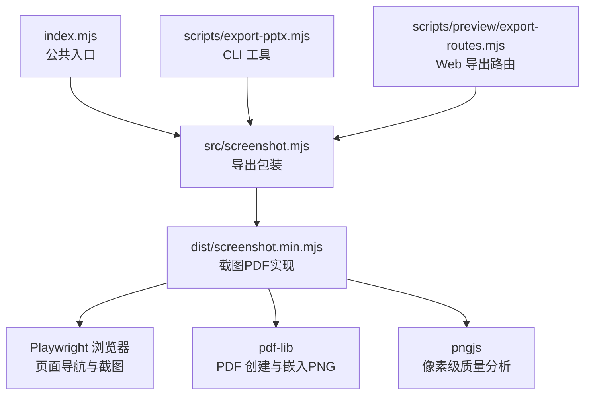
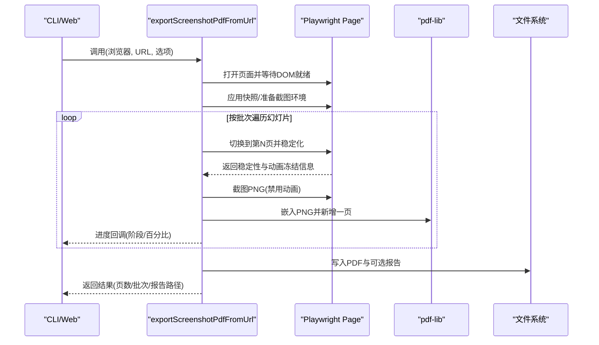
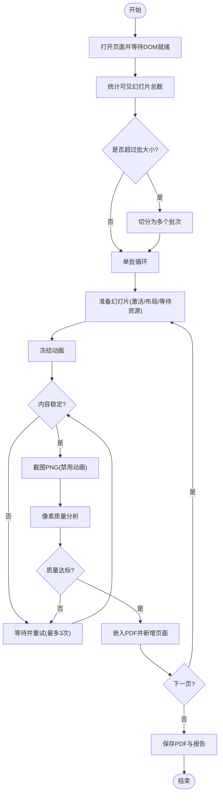
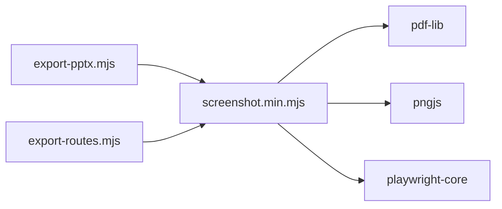

# 截图导出功能

<cite>
**本文引用的文件**   
- [index.mjs](file://skills/dashiai-ppt/project/packages/html-deck-to-pptx/index.mjs)
- [screenshot.mjs](file://skills/dashiai-ppt/project/packages/html-deck-to-pptx/src/screenshot.mjs)
- [screenshot.min.mjs](file://skills/dashiai-ppt/project/packages/html-deck-to-pptx/dist/screenshot.min.mjs)
- [package.json](file://skills/dashiai-ppt/project/packages/html-deck-to-pptx/package.json)
- [README.md](file://skills/dashiai-ppt/project/packages/html-deck-to-pptx/README.md)
- [export-pptx.mjs](file://skills/dashiai-ppt/project/scripts/export-pptx.mjs)
- [export-routes.mjs](file://data/agent/managed-skills/dashiai-ppt/project/scripts/preview/export-routes.mjs)
</cite>

## 目录
1. [简介](#简介)
2. [项目结构](#项目结构)
3. [核心组件](#核心组件)
4. [架构总览](#架构总览)
5. [详细组件分析](#详细组件分析)
6. [依赖关系分析](#依赖关系分析)
7. [性能与优化](#性能与优化)
8. [故障排查指南](#故障排查指南)
9. [结论](#结论)
10. [附录：API 参考与批量导出示例](#附录api-参考与批量导出示例)

## 简介
本文件聚焦 DashIAI PPT 的“截图式 PDF 导出”能力，围绕 screenshot.mjs 及其构建产物 screenshot.min.mjs 的实现进行系统化说明。该能力通过 Playwright 驱动浏览器渲染 HTML 幻灯片，逐页稳定捕获为 PNG，再使用 pdf-lib 合成高分辨率 PDF；支持批处理、进度回调、报告输出、动画冻结与内容稳定性检测等关键特性，适用于大型演示文稿的高保真导出。

## 项目结构
- 包入口 index.mjs 统一暴露可编辑 PPTX 与截图 PDF 两类导出 API。
- src/screenshot.mjs 是对外导出的轻量包装，实际实现位于 dist/screenshot.min.mjs（构建产物）。
- package.json 声明了 peerDependencies（playwright-core、pptxgenjs）与运行时依赖（pdf-lib、pngjs），并限定 Node 版本。
- scripts/export-pptx.mjs 提供命令行工具，可直接调用截图 PDF 导出。
- scripts/preview/export-routes.mjs 提供 Web 端导出路由，集成进度上报与下载链路。

图表来源 
- [index.mjs:1-16](file://skills/dashiai-ppt/project/packages/html-deck-to-pptx/index.mjs#L1-L16)
- [screenshot.mjs:1-3](file://skills/dashiai-ppt/project/packages/html-deck-to-pptx/src/screenshot.mjs#L1-L3)
- [screenshot.min.mjs:1-4](file://skills/dashiai-ppt/project/packages/html-deck-to-pptx/dist/screenshot.min.mjs#L1-L4)
- [export-pptx.mjs:24-90](file://skills/dashiai-ppt/project/scripts/export-pptx.mjs#L24-L90)
- [export-routes.mjs:150-200](file://data/agent/managed-skills/dashiai-ppt/project/scripts/preview/export-routes.mjs#L150-L200)

章节来源
- [index.mjs:1-16](file://skills/dashiai-ppt/project/packages/html-deck-to-pptx/index.mjs#L1-L16)
- [package.json:1-37](file://skills/dashiai-ppt/project/packages/html-deck-to-pptx/package.json#L1-L37)
- [README.md:1-44](file://skills/dashiai-ppt/project/packages/html-deck-to-pptx/README.md#L1-L44)

## 核心组件
- 导出入口函数 exportScreenshotPdfFromUrl(browser, url, options)
  - 负责创建 PDF、计算批大小、打开并准备页面、分批逐页截图、嵌入图片、写入文件、生成报告与进度回调。
- 页面准备 openPreparedPage(browser, url, options)
  - 创建浏览器上下文与页面，设置视口与超时，等待 DOMContentLoaded 与活动幻灯片选择器，可选应用快照，执行截图前布局与样式清理。
- 快照应用 applyDeckSnapshot(page, snapshot)
  - 在页面内恢复主题、幻灯片顺序、文本状态、属性与画布快照，确保导出内容与用户当前视图一致。
- 截图前准备 prepareDeckForScreenshotPdf(page)
  - 锁定导出模式、进入演示模式、移除圆角与预览面板、同步页码与可编辑文本状态、触发布局。
- 稳定截图 captureStableSlide(page, index, options)
  - 多次尝试（最多3次）切换至目标幻灯片、禁用动画、截图 PNG、像素质量分析、稳定性判定，返回最终截图与元数据。
- 幻灯片准备 prepareSlideForScreenshot(page, index)
  - 在页面内定位目标幻灯片，激活并标记 active/data-deck-active，确保运行时渲染、恢复效果 iframe、同步页码、初始化场景、等待字体与媒体加载、冻结动画、计算稳定性签名。
- 像素分析 analyzePng(buffer)
  - 基于 pngjs 采样四角背景色、统计唯一颜色数、亮度方差与非背景比例，判断空白页与质量是否达标。
- 进度与报告 emitProgress/onProgress
  - 安全调用 onProgress 回调，上报阶段、详情与百分比；可选将完整报告写入 reportFile。

章节来源
- [screenshot.min.mjs:1-4](file://skills/dashiai-ppt/project/packages/html-deck-to-pptx/dist/screenshot.min.mjs#L1-L4)

## 架构总览
截图 PDF 导出采用“浏览器渲染 + 逐页截图 + 服务端合成”的流水线：
- 控制面：index.mjs 暴露 API；CLI 或 Web 路由调用 exportScreenshotPdfFromUrl。
- 执行面：Playwright 打开页面，按批次遍历幻灯片，每页完成稳定化后截图 PNG。
- 合成面：pdf-lib 创建 PDF，嵌入 PNG，设置标题/作者/主题，落盘并生成报告。

图表来源 
- [screenshot.min.mjs:1-4](file://skills/dashiai-ppt/project/packages/html-deck-to-pptx/dist/screenshot.min.mjs#L1-L4)
- [export-pptx.mjs:80-90](file://skills/dashiai-ppt/project/scripts/export-pptx.mjs#L80-L90)
- [export-routes.mjs:168-197](file://data/agent/managed-skills/dashiai-ppt/project/scripts/preview/export-routes.mjs#L168-L197)

## 详细组件分析

### 页面捕获与导出流程
- 打开页面与计数：创建 Context/Page，设置视口（默认 1920x1080）、deviceScaleFactor=1，等待 #deck > .slide.active 或 data-deck-active，统计可见幻灯片数量。
- 批处理策略：根据 totalSlides 与 batchSize（默认 8，限制 1~20）切分批次，逐批打开新页面或复用首张页面，降低内存占用。
- 逐页稳定化：
  - 切换目标幻灯片并强制激活，确保运行时渲染与布局。
  - 等待字体 ready 与可见媒体加载（img/video），必要时等待第三方帧（如 unicorn frames）就绪。
  - 冻结页面动画（Web Animations/GSAP），避免动态闪烁影响截图。
  - 多帧采集内容签名，判定内容区域占比与边界框稳定，达到阈值即认为稳定。
- 截图与质量校验：
  - 使用 page.locator("#deck > .slide.active").screenshot(type:"png", animations:"disabled") 获取 PNG。
  - 通过 analyzePng 判断空白页、颜色丰富度与标准差，不达标则重试（最多3次）。
- 合成与落盘：
  - 使用 pdf-lib 创建 PDF，设置标题/作者/主题，嵌入 PNG 并绘制到固定尺寸页面（默认 1152x648）。
  - 写入 outFile，可选写入 reportFile（JSON 报告含批次、每页元数据与字节数）。

图表来源 
- [screenshot.min.mjs:1-4](file://skills/dashiai-ppt/project/packages/html-deck-to-pptx/dist/screenshot.min.mjs#L1-L4)

章节来源
- [screenshot.min.mjs:1-4](file://skills/dashiai-ppt/project/packages/html-deck-to-pptx/dist/screenshot.min.mjs#L1-L4)

### 配置选项与行为
- 基础选项
  - outFile: 输出 PDF 路径（默认 deck.pdf）
  - reportFile: 可选 JSON 报告路径
  - title: PDF 标题（默认 Deck PDF Export）
  - timeout: 页面默认超时（毫秒，默认 9e4）
  - batchSize: 批大小（默认 8，范围 1~20）
  - onProgress: 进度回调函数
  - snapshot: 可选快照对象，用于恢复主题、顺序、文本与画布快照
  - screenshotTimeout: 单次截图超时（毫秒，默认 9e4）
- 分辨率与格式
  - 视口宽度/高度：SOURCE_W=1920, SOURCE_H=1080
  - PDF 页面尺寸：PDF_W=1152, PDF_H=648
  - 图像格式：PNG（嵌入 PDF）
- 透明度与背景
  - 未提供透明背景开关；背景由页面渲染决定，可通过 CSS 控制（例如移除圆角、隐藏预览面板）。
- 其他
  - ignoreHTTPSErrors: true（允许自签名证书）
  - deviceScaleFactor: 1（保持原始像素密度）

章节来源
- [screenshot.min.mjs:1-4](file://skills/dashiai-ppt/project/packages/html-deck-to-pptx/dist/screenshot.min.mjs#L1-L4)

### 异步处理机制与错误处理
- 异步流程
  - 使用 async/await 组织页面导航、资源等待、截图与 PDF 合成。
  - 通过 Promise.race 对字体与媒体加载设置超时保护，避免无限等待。
- 错误处理
  - 页面关闭与上下文释放使用 try/finally 确保资源回收。
  - 进度回调包裹 try/catch，防止异常中断主流程。
  - 报告写入与目录创建失败时，仍继续导出但可能缺失报告。
  - 外部服务（如 preview 路由）对异常进行公开消息封装与 HTTP 响应。

章节来源
- [export-routes.mjs:198-207](file://data/agent/managed-skills/dashiai-ppt/project/scripts/preview/export-routes.mjs#L198-L207)
- [export-pptx.mjs:35-38](file://skills/dashiai-ppt/project/scripts/export-pptx.mjs#L35-L38)

### 进度反馈系统
- 阶段定义
  - capturing：正在截图（批次与单页级别）
  - saving：合成 PDF
  - ready：准备下载
- 百分比计算
  - progressPercent(index, total, start, range) 线性映射，批次与单页分别占不同区间。
- 回调接口
  - onProgress(update) 接收 {stage, detail, percent}，可在 UI 中显示进度条与状态。

章节来源
- [screenshot.min.mjs:1-4](file://skills/dashiai-ppt/project/packages/html-deck-to-pptx/dist/screenshot.min.mjs#L1-L4)

## 依赖关系分析
- 运行时依赖
  - pdf-lib：创建 PDF、嵌入 PNG/JPEG、设置元数据
  - pngjs：读取 PNG 缓冲，进行像素级分析
- 外部依赖（peer）
  - playwright-core：驱动 Chromium/Firefox/WebKit，执行页面导航与截图
  - pptxgenjs：可编辑 PPTX 导出（与本截图模块解耦）
- 版本与环境
  - Node >= 20
  - pdf-lib ^1.17.1
  - pngjs ^7.0.0
  - playwright-core ^1.60.0

图表来源 
- [package.json:25-36](file://skills/dashiai-ppt/project/packages/html-deck-to-pptx/package.json#L25-L36)
- [screenshot.min.mjs:1-4](file://skills/dashiai-ppt/project/packages/html-deck-to-pptx/dist/screenshot.min.mjs#L1-L4)

章节来源
- [package.json:1-37](file://skills/dashiai-ppt/project/packages/html-deck-to-pptx/package.json#L1-L37)

## 性能与优化
- 批处理与内存控制
  - 默认 batch=8，上限 20，减少同时持有的页面与图片内存。
  - 每批结束后关闭页面与上下文，避免泄漏。
- 资源预加载
  - 等待字体 ready 与 img/video 加载完成，避免二次重绘导致的重复截图。
  - 针对第三方帧（unicorn frames）设置最长等待时间，避免阻塞。
- 动画与稳定性
  - 禁用动画并冻结 GSAP/Web Animations，提升截图一致性。
  - 多帧内容签名对比，确保内容稳定后再截图，减少无效重试。
- 像素质量分析
  - 采样四角背景色，统计唯一颜色数与标准差，过滤空白页与低质量截图。
- 高分辨率输出
  - 视口 1920x1080，PDF 页面 1152x648，适合高清打印与展示。
  - 如需更高清晰度，可调整视口与设备缩放因子（需评估内存与耗时）。

[本节为通用指导，不直接分析具体文件]

## 故障排查指南
- 常见问题
  - 页面未就绪：检查 waitUntil 与选择器是否正确，确认 DOMContentLoaded 与活动幻灯片存在。
  - 动画未冻结：确认页面是否包含 Web Animations 或 GSAP，并确保 finish/pause 逻辑生效。
  - 媒体未加载：检查 img/video 的 load/loadeddata 事件与超时保护。
  - 空白页或低质量：查看 analyzePng 指标（uniqueColors、stdDev、nonBackgroundRatio），必要时增加重试次数或调整超时。
  - 内存不足：减小 batchSize，或拆分大演示文稿为多个任务。
- 调试建议
  - 启用 onProgress 回调，观察阶段与百分比变化。
  - 输出 reportFile，检查 slideReports 中的 attempts、stability、pixel 字段。
  - 在 preview 路由中检查 HTTP 响应与错误消息。

章节来源
- [export-routes.mjs:198-207](file://data/agent/managed-skills/dashiai-ppt/project/scripts/preview/export-routes.mjs#L198-L207)
- [export-pptx.mjs:35-38](file://skills/dashiai-ppt/project/scripts/export-pptx.mjs#L35-L38)

## 结论
截图 PDF 导出通过稳定的页面准备、严格的稳定性检测与高效的批处理策略，实现了高质量、可复现的演示文稿导出。结合进度回调与报告输出，便于在生产环境中监控与诊断。对于大型演示文稿，建议合理设置批大小与超时，并结合资源预加载与内存控制策略，以获得最佳性能与稳定性。

[本节为总结性内容，不直接分析具体文件]

## 附录：API 参考与批量导出示例

### API 参考
- exportScreenshotPdfFromUrl(browser, url, options)
  - 参数
    - browser: Playwright 浏览器实例
    - url: 已渲染的幻灯片页面地址
    - options: 见“配置选项与行为”
  - 返回值
    - {outFile, reportFile?, pages, generationMode, batchSize, batches, slideReports, bytes}
  - 用途
    - 从 URL 启动浏览器，逐页截图并合成 PDF，返回导出结果与可选报告。

章节来源
- [index.mjs:13-15](file://skills/dashiai-ppt/project/packages/html-deck-to-pptx/index.mjs#L13-L15)
- [screenshot.min.mjs:1-4](file://skills/dashiai-ppt/project/packages/html-deck-to-pptx/dist/screenshot.min.mjs#L1-L4)

### 批量导出示例（CLI）
- 使用 npm 脚本或 node 命令直接导出 PDF：
  - node scripts/export-pptx.mjs <deck-ppt-dir> --pdf [--title <text>]
- 内部流程
  - 启动本地预览服务器（仅用于静态资源服务）
  - 启动 Chromium 浏览器
  - 调用 exportScreenshotPdfFromUrl 完成截图 PDF 导出
  - 输出日志与结果路径

章节来源
- [export-pptx.mjs:85-90](file://skills/dashiai-ppt/project/scripts/export-pptx.mjs#L85-L90)

### 批量导出示例（Web 路由）
- 前端发起 POST /api/export-pdf，携带 fileName、sourcePath、snapshot、batchSize、progressId
- 服务端
  - 启动浏览器与导出引擎
  - 调用 exportScreenshotPdfFromUrl，传入 onProgress 回调
  - 返回下载链接与报告路径
  - 提供 /api/export-pdf-download 与 /api/export-pdf-progress 接口

章节来源
- [export-routes.mjs:168-197](file://data/agent/managed-skills/dashiai-ppt/project/scripts/preview/export-routes.mjs#L168-L197)