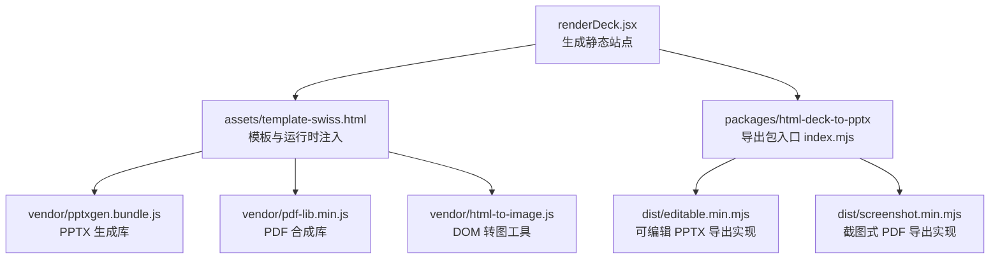
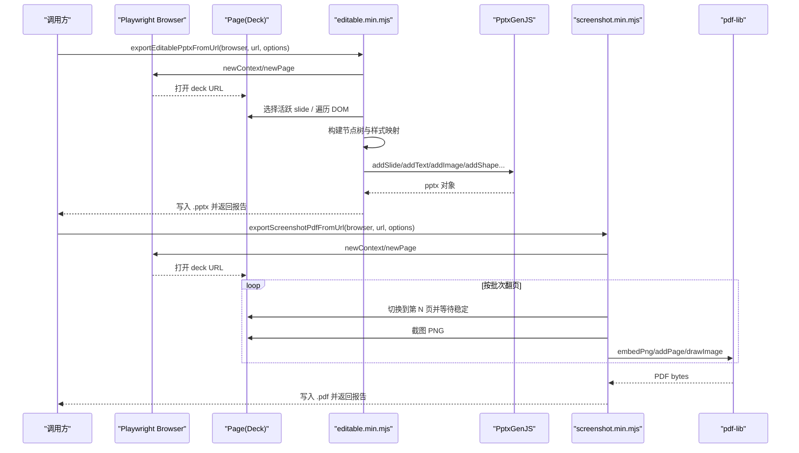
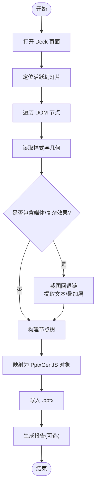
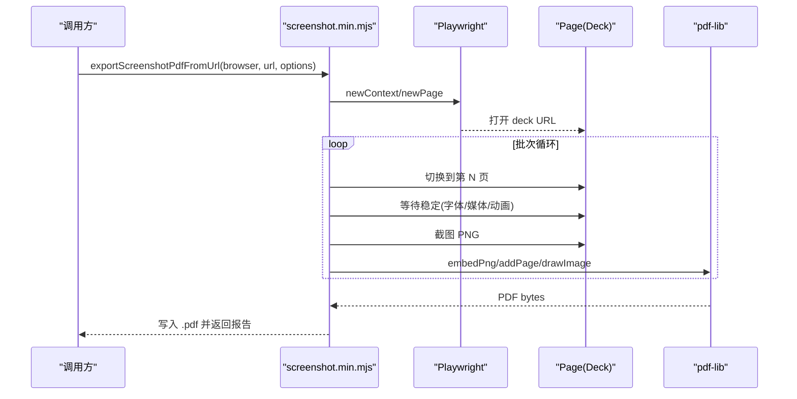
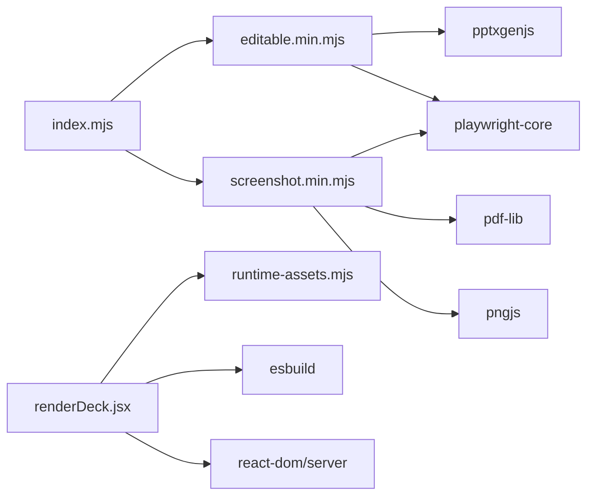

# 导出功能

<cite>
**本文引用的文件**   
- [index.mjs](file://skills/dashiai-ppt/project/packages/html-deck-to-pptx/index.mjs)
- [editable.min.mjs](file://skills/dashiai-ppt/project/packages/html-deck-to-pptx/dist/editable.min.mjs)
- [screenshot.min.mjs](file://skills/dashiai-ppt/project/packages/html-deck-to-pptx/dist/screenshot.min.mjs)
- [package.json](file://skills/dashiai-ppt/project/packages/html-deck-to-pptx/package.json)
- [renderDeck.jsx](file://skills/dashiai-ppt/project/src/renderDeck.jsx)
- [runtime-assets.mjs](file://skills/dashiai-ppt/project/src/runtime-assets.mjs)
- [options.jsx](file://skills/dashiai-ppt/project/src/options.jsx)
- [SKILL.md](file://skills/dashiai-ppt/SKILL.md)
- [README.md](file://skills/dashiai-ppt/README.md)
</cite>

## 目录
1. [简介](#简介)
2. [项目结构](#项目结构)
3. [核心组件](#核心组件)
4. [架构总览](#架构总览)
5. [详细组件分析](#详细组件分析)
6. [依赖关系分析](#依赖关系分析)
7. [性能考量](#性能考量)
8. [故障排查指南](#故障排查指南)
9. [结论](#结论)
10. [附录](#附录)

## 简介
本文件系统性阐述 DashIAI PPT 的导出能力，重点覆盖 HTML 到 PPTX 的可编辑转换引擎、样式保留策略（字体、颜色、布局与动画）、PDF 截图式导出及其他格式扩展。文档从 DOM 解析到 PowerPoint 文档生成的完整流程出发，解释关键算法与优化点，并提供配置选项、错误处理与性能建议，帮助开发者与使用者高效使用并扩展该导出子系统。

## 项目结构
导出子系统由“构建期产物 + 运行时库”两部分组成：
- 构建期产物：将 React 渲染的 HTML Deck 输出为可离线打开的静态站点，包含主题资源、运行时脚本与必要的 vendor 库。
- 运行时库：提供两类导出入口
  - 可编辑 PPTX 导出：基于 Playwright 驱动浏览器，采集 DOM 树与样式，映射为 PptxGenJS 对象模型，生成可编辑 .pptx。
  - 截图式 PDF 导出：基于 Playwright 逐页截图，使用 pdf-lib 合成 PDF。

图表来源
- [renderDeck.jsx:41-63](file://skills/dashiai-ppt/project/src/renderDeck.jsx#L41-L63)
- [runtime-assets.mjs:1-44](file://skills/dashiai-ppt/project/src/runtime-assets.mjs#L1-L44)
- [index.mjs:1-16](file://skills/dashiai-ppt/project/packages/html-deck-to-pptx/index.mjs#L1-L16)

章节来源
- [renderDeck.jsx:41-63](file://skills/dashiai-ppt/project/src/renderDeck.jsx#L41-L63)
- [runtime-assets.mjs:1-44](file://skills/dashiai-ppt/project/src/runtime-assets.mjs#L1-L44)
- [index.mjs:1-16](file://skills/dashiai-ppt/project/packages/html-deck-to-pptx/index.mjs#L1-L16)

## 核心组件
- 可编辑 PPTX 导出（editable）
  - 通过 Playwright 打开已渲染的 Deck 页面，遍历活跃幻灯片 DOM，收集元素几何、样式与媒体内容，构建节点树；随后用 PptxGenJS 重建文本、形状、图片与背景，尽量保持可编辑性。
- 截图式 PDF 导出（screenshot）
  - 通过 Playwright 切换幻灯片并等待稳定后截图 PNG，再用 pdf-lib 将每页 PNG 嵌入 PDF，支持批处理与进度回调。
- 构建期资源装配（renderDeck）
  - 将 React 渲染的 slides 注入模板，复制必要 vendor 库与主题资源，生成可离线运行的静态站点，供后续导出使用。

章节来源
- [index.mjs:1-16](file://skills/dashiai-ppt/project/packages/html-deck-to-pptx/index.mjs#L1-L16)
- [package.json:1-37](file://skills/dashiai-ppt/project/packages/html-deck-to-pptx/package.json#L1-L37)
- [renderDeck.jsx:134-159](file://skills/dashiai-ppt/project/src/renderDeck.jsx#L134-L159)

## 架构总览
整体导出链路如下：
- 输入：已渲染的 HTML Deck（含主题与运行时），或一个 Playwright Page/Browser 实例。
- 可编辑 PPTX：DOM 采集 → 节点树构建 → PptxGenJS 对象建模 → 写入 .pptx。
- 截图 PDF：Playwright 切换幻灯片 → 截图 PNG → pdf-lib 合成 PDF。

图表来源
- [editable.min.mjs:1-114](file://skills/dashiai-ppt/project/packages/html-deck-to-pptx/dist/editable.min.mjs#L1-L114)
- [screenshot.min.mjs:1-4](file://skills/dashiai-ppt/project/packages/html-deck-to-pptx/dist/screenshot.min.mjs#L1-L4)

## 详细组件分析

### 可编辑 PPTX 导出（editable）
- 入口 API
  - exportEditablePptxFromUrl(browser, url, options)
  - exportEditablePptxFromPage(page, options)
- 关键流程
  - 创建浏览器上下文与页面，加载 Deck URL，等待 DOM 就绪。
  - 定位活跃幻灯片，递归遍历 DOM，收集可见元素、样式、媒体与伪元素。
  - 对复杂视觉（渐变、遮罩、混合模式、阴影等）采用“截图回退链”，在必要时截取区域图像，同时尝试提取文本以保留可编辑性。
  - 将节点树转换为 PptxGenJS 对象模型（文本框、形状、图片、背景、边框、圆角、旋转、透明度等）。
  - 写入 .pptx，并可选输出报告文件（统计与警告）。
- 样式保留策略
  - 字体：内置安全字体映射表，优先选择跨平台字体（如微软雅黑、宋体、Arial 等），CJK 文本自动适配。
  - 颜色：解析 CSS 颜色、rgba/hex/color()，支持透明通道与渐变近似色。
  - 布局：坐标与尺寸归一化到 PPT 单位（英寸/pt），考虑旋转、缩放与裁剪。
  - 动画：导出前冻结动画状态，避免动态效果影响静态导出。
- 错误处理
  - 对不可读图片、被污染的 canvas、SVG 光栅化失败等情况记录警告而非中断。
  - 渐进式降级：当某些 CSS 特性无法原生表达时，回退为截图片段，但尽力保留文本。
- 性能优化
  - 批量与并发控制：在 PDF 导出中采用批处理；PPTX 导出中对大页面进行分步渲染与进度回调。
  - 资源复用：共享浏览器上下文，减少启动开销。
  - 采样与阈值：对截图稳定性检测与像素分析，避免重复无效截图。

图表来源
- [editable.min.mjs:1-114](file://skills/dashiai-ppt/project/packages/html-deck-to-pptx/dist/editable.min.mjs#L1-L114)

章节来源
- [index.mjs:1-16](file://skills/dashiai-ppt/project/packages/html-deck-to-pptx/index.mjs#L1-L16)
- [editable.min.mjs:1-114](file://skills/dashiai-ppt/project/packages/html-deck-to-pptx/dist/editable.min.mjs#L1-L114)

### 截图式 PDF 导出（screenshot）
- 入口 API
  - exportScreenshotPdfFromUrl(browser, url, options)
- 关键流程
  - 创建浏览器上下文与页面，加载 Deck URL，等待选择器就绪。
  - 计算总页数，分批处理（默认批大小可调），逐页切换并等待稳定。
  - 截图 PNG，分析稳定性（空白、颜色分布、内容区域比例），必要时重试。
  - 使用 pdf-lib 嵌入 PNG 并添加页面，最终保存 PDF。
- 稳定性与质量
  - 多次尝试截图，确保动画与字体加载完成。
  - 对 Unicorn 场景与外部媒体进行等待与恢复，保证截图一致性。
- 性能优化
  - 批处理降低内存峰值与 I/O 压力。
  - 超时与容错机制避免阻塞。

图表来源
- [screenshot.min.mjs:1-4](file://skills/dashiai-ppt/project/packages/html-deck-to-pptx/dist/screenshot.min.mjs#L1-L4)

章节来源
- [screenshot.min.mjs:1-4](file://skills/dashiai-ppt/project/packages/html-deck-to-pptx/dist/screenshot.min.mjs#L1-L4)

### 构建期资源装配（renderDeck）
- 职责
  - 将 React 渲染的 slides 注入模板，设置语言与主题包信息。
  - 复制必要 vendor 库（pptxgenjs、pdf-lib、html-to-image 等）与主题资源。
  - 根据实际使用的主题集合生成运行时 bundle（单主题直接拷贝预构建产物，多主题链接模块）。
- 关键点
  - 必需资产校验：缺失则立即失败，防止产出残缺站点。
  - 用户媒体保护：临时备份与恢复用户上传的资源目录。
  - 主题运行时构建：支持 auto/prebuilt/source 三种模式，确保安装版与开发版行为一致。

章节来源
- [renderDeck.jsx:41-63](file://skills/dashiai-ppt/project/src/renderDeck.jsx#L41-L63)
- [renderDeck.jsx:134-159](file://skills/dashiai-ppt/project/src/renderDeck.jsx#L134-L159)
- [renderDeck.jsx:204-236](file://skills/dashiai-ppt/project/src/renderDeck.jsx#L204-L236)
- [runtime-assets.mjs:1-44](file://skills/dashiai-ppt/project/src/runtime-assets.mjs#L1-L44)

## 依赖关系分析
- 运行时依赖
  - pptxgenjs：用于构建可编辑 PPTX 对象模型。
  - playwright-core：用于无头浏览器操作与 DOM 采集。
  - pdf-lib：用于 PDF 合成。
  - pngjs：用于 PNG 像素分析（PDF 导出稳定性判断）。
- 构建期依赖
  - esbuild：用于主题运行时构建与模块打包。
  - react-dom/server：用于服务端渲染 HTML。
- 耦合与内聚
  - 导出包对外暴露简洁 API，内部实现集中在 dist/*.min.mjs，便于分发与维护。
  - renderDeck 与 runtime-assets 强耦合于资源路径与模板结构，需保持一致。

图表来源
- [package.json:25-32](file://skills/dashiai-ppt/project/packages/html-deck-to-pptx/package.json#L25-L32)
- [runtime-assets.mjs:31-37](file://skills/dashiai-ppt/project/src/runtime-assets.mjs#L31-L37)

章节来源
- [package.json:25-32](file://skills/dashiai-ppt/project/packages/html-deck-to-pptx/package.json#L25-L32)
- [runtime-assets.mjs:31-37](file://skills/dashiai-ppt/project/src/runtime-assets.mjs#L31-L37)

## 性能考量
- 浏览器上下文复用：避免频繁创建/销毁 context 与 page，减少启动开销。
- 批处理与限流：PDF 导出按批次处理，限制并发与超时，避免内存溢出。
- 采样与阈值：对截图稳定性进行像素级分析，跳过空白或低质量帧。
- 资源裁剪：仅复制实际使用的主题资源，减小交付体积。
- 预构建产物：单主题直接拷贝预构建 bundle，零构建成本；多主题使用预构建模块链接。
- 进度回调：导出过程提供 onProgress 回调，便于前端展示进度与取消。

[本节为通用指导，不直接分析具体文件]

## 故障排查指南
- 常见错误与处理
  - 必需 vendor 缺失：构建期会抛出错误，检查 node_modules 与 assets/vendor 目录。
  - 图片不可读或被污染：记录警告并跳过，检查图片路径与跨域策略。
  - SVG 光栅化失败：回退为原始 dataURL 或跳过，检查 SVG 内容与尺寸。
  - Canvas 被污染：跳过绘制，检查同源策略与第三方脚本。
  - 动画未冻结：导出前冻结动画，确保静态结果一致。
- 调试建议
  - 启用 reportFile 输出，查看 warnings 与统计信息。
  - 逐步缩小问题范围：先验证单页导出，再扩展到整份 deck。
  - 检查字体与媒体加载：确保 fonts.ready 与媒体事件触发。
  - 调整超时与批大小：针对大 deck 或慢网络环境调优。

章节来源
- [renderDeck.jsx:350-357](file://skills/dashiai-ppt/project/src/renderDeck.jsx#L350-L357)
- [editable.min.mjs:1-114](file://skills/dashiai-ppt/project/packages/html-deck-to-pptx/dist/editable.min.mjs#L1-L114)
- [screenshot.min.mjs:1-4](file://skills/dashiai-ppt/project/packages/html-deck-to-pptx/dist/screenshot.min.mjs#L1-L4)

## 结论
DashIAI PPT 的导出子系统通过“DOM 采集 + 样式映射 + 回退链”实现了高保真、可编辑的 PPTX 输出，并以截图方式提供稳定的 PDF 导出。其架构清晰、依赖明确、性能优化到位，适合在生产环境中大规模使用。未来可扩展更多格式（如 DOCX、EPUB）与更丰富的样式支持（如数学公式、表格增强）。

[本节为总结，不直接分析具体文件]

## 附录
- 导出配置选项（示例）
  - outFile：输出文件路径（默认 editable-export.pptx 或 deck.pdf）。
  - reportFile：可选的报告文件路径，包含统计与警告。
  - title：演示文稿标题。
  - activeSlideSelector：覆盖活跃滑片的 DOM 选择器（默认 #deck > .slide）。
  - timeout：页面加载与截图超时（毫秒）。
  - batchSize：PDF 导出的批大小（默认 8，最大 20）。
  - onProgress：进度回调函数，接收 stage/detail/percent 字段。
- 其他格式扩展
  - 当前支持 PPTX（可编辑）与 PDF（截图式）。
  - 可通过引入新库（如 docx-js、epub-gen）扩展至 DOCX 与 EPUB。
  - 建议在现有导出框架上增加新的适配器与渲染管线。

章节来源
- [index.mjs:1-16](file://skills/dashiai-ppt/project/packages/html-deck-to-pptx/index.mjs#L1-L16)
- [package.json:1-37](file://skills/dashiai-ppt/project/packages/html-deck-to-pptx/package.json#L1-L37)
- [SKILL.md:1-57](file://skills/dashiai-ppt/SKILL.md#L1-L57)
- [README.md:1-62](file://skills/dashiai-ppt/README.md#L1-L62)