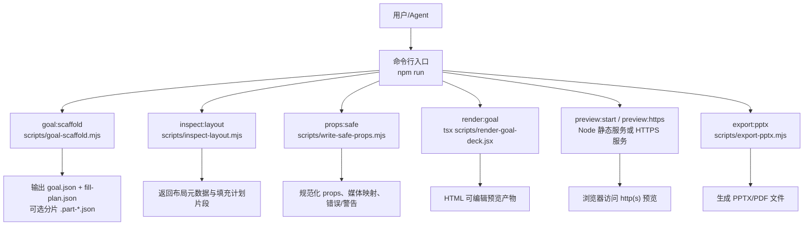
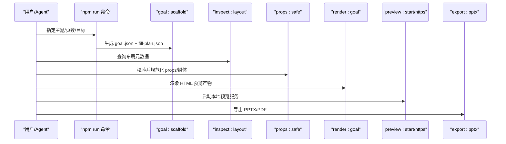
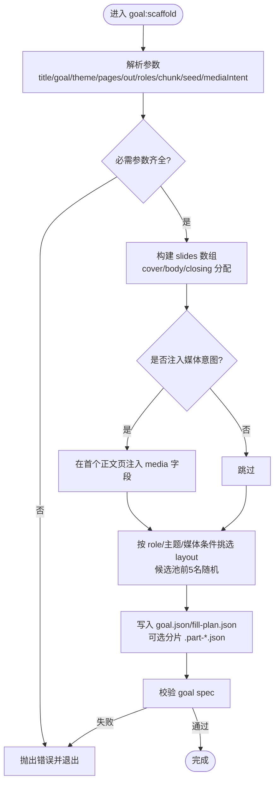
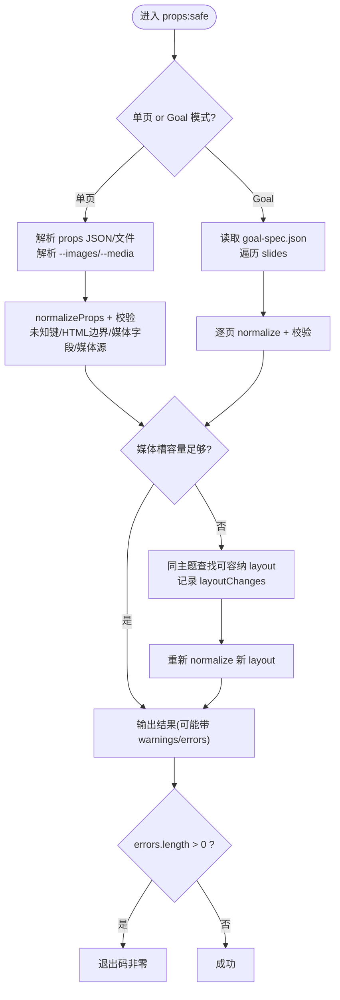
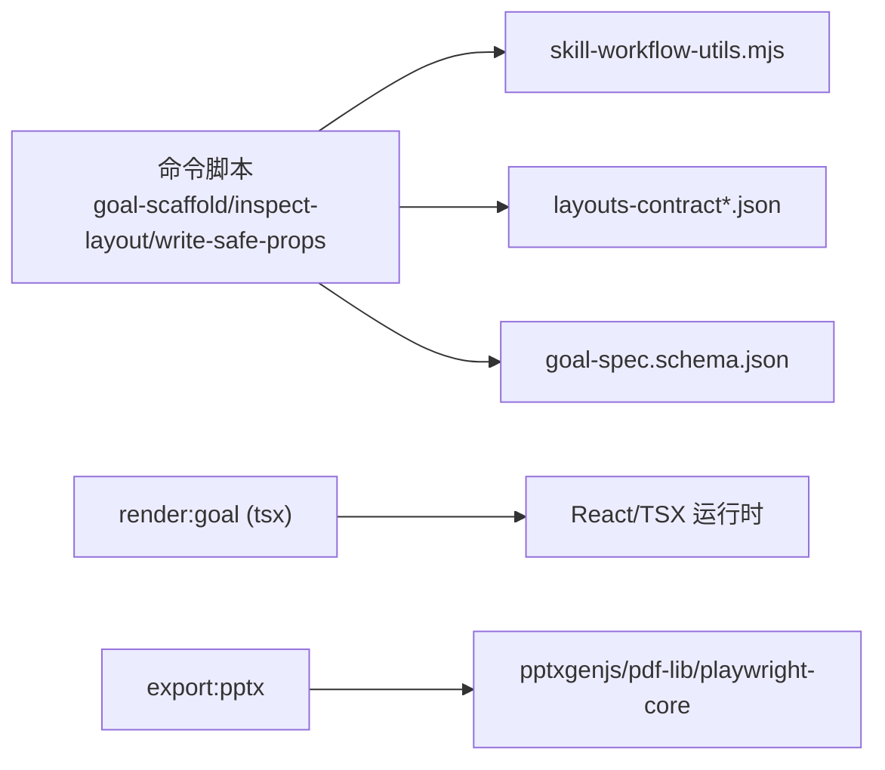

# 工作流与命令

<cite>
**本文引用的文件**   
- [SKILL.md](file://skills/dashiai-ppt/SKILL.md)
- [README.md](file://skills/dashiai-ppt/README.md)
- [goal-spec.schema.json](file://skills/dashiai-ppt/references/goal-spec.schema.json)
- [layout-roles.md](file://skills/dashiai-ppt/references/layout-roles.md)
- [layouts-contract.json](file://skills/dashiai-ppt/layouts-contract.json)
- [layouts-contract-output.json](file://skills/dashiai-ppt/layouts-contract-output.json)
- [package.json](file://skills/dashiai-ppt/project/package.json)
- [goal-scaffold.mjs](file://skills/dashiai-ppt/project/scripts/goal-scaffold.mjs)
- [inspect-layout.mjs](file://skills/dashiai-ppt/project/scripts/inspect-layout.mjs)
- [write-safe-props.mjs](file://skills/dashiai-ppt/project/scripts/write-safe-props.mjs)
</cite>

## 目录
1. [简介](#简介)
2. [项目结构](#项目结构)
3. [核心组件](#核心组件)
4. [架构总览](#架构总览)
5. [详细组件分析](#详细组件分析)
6. [依赖关系分析](#依赖关系分析)
7. [性能考量](#性能考量)
8. [故障排除指南](#故障排除指南)
9. [结论](#结论)
10. [附录](#附录)

## 简介
本文件系统化梳理 DashIAI PPT 的完整工作流与命令体系，覆盖从需求分析、骨架生成、布局检查、属性校验、内容渲染、预览到最终导出（PPTX/PDF）的全链路。重点说明以下命令：
- goal:scaffold（项目初始化/骨架生成）
- inspect:layout（布局检查）
- props:safe（属性安全校验与自动修复）
- render:goal（内容渲染）
- preview:start / preview:https（预览启动，含 Windows 回退）
- export:pptx（PPTX 导出）

同时给出 Windows 平台的特殊处理策略（preview:https 脚本与 Python HTTP 服务器回退），并提供使用示例与常见问题排查方法。

## 项目结构
DashIAI PPT 以“Skill”形式组织，核心位于 skills/dashiai-ppt 目录，包含：
- SKILL.md：行为约束与使用说明（风格选择、配图流程、Windows 预览回退等）
- README.md：功能定位、适用场景、风格列表与安装说明
- references：目标规范 schema、布局角色定义等参考文档
- layouts-contract*.json：主题与页面布局契约（字段、槽位、控件、填充计划等）
- project：运行时工程，包含 npm scripts 与各命令脚本

图表来源
- [package.json:6-21](file://skills/dashiai-ppt/project/package.json#L6-L21)
- [goal-scaffold.mjs:1-241](file://skills/dashiai-ppt/project/scripts/goal-scaffold.mjs#L1-L241)
- [inspect-layout.mjs:1-77](file://skills/dashiai-ppt/project/scripts/inspect-layout.mjs#L1-L77)
- [write-safe-props.mjs:1-324](file://skills/dashiai-ppt/project/scripts/write-safe-props.mjs#L1-L324)

章节来源
- [SKILL.md:1-57](file://skills/dashiai-ppt/SKILL.md#L1-L57)
- [README.md:1-62](file://skills/dashiai-ppt/README.md#L1-L62)
- [package.json:1-37](file://skills/dashiai-ppt/project/package.json#L1-L37)

## 核心组件
- 目标规范（Goal Spec）：描述演示文稿的目标、受众、页数、主题包、每页 layout 与 props 等，由 JSON Schema 约束。
- 布局契约（Layout Contract）：为每个 theme 下的具体 layout 定义字段、槽位、控件、填充计划、媒体槽位等。
- 命令脚本：通过 npm scripts 暴露 goal:scaffold、inspect:layout、props:safe、render:goal、preview:*、export:pptx 等能力。
- 预览与导出：基于 Node 静态服务提供 HTML 预览；导出阶段将 HTML 转为 PPTX/PDF。

章节来源
- [goal-spec.schema.json:1-120](file://skills/dashiai-ppt/references/goal-spec.schema.json#L1-L120)
- [layouts-contract.json:1-800](file://skills/dashiai-ppt/layouts-contract.json#L1-L800)
- [layouts-contract-output.json:1-800](file://skills/dashiai-ppt/layouts-contract-output.json#L1-L800)
- [package.json:6-21](file://skills/dashiai-ppt/project/package.json#L6-L21)

## 架构总览
下图展示从输入目标到最终导出的端到端流程，以及各命令的职责与交互。

图表来源
- [package.json:6-21](file://skills/dashiai-ppt/project/package.json#L6-L21)
- [goal-scaffold.mjs:1-241](file://skills/dashiai-ppt/project/scripts/goal-scaffold.mjs#L1-L241)
- [inspect-layout.mjs:1-77](file://skills/dashiai-ppt/project/scripts/inspect-layout.mjs#L1-L77)
- [write-safe-props.mjs:1-324](file://skills/dashiai-ppt/project/scripts/write-safe-props.mjs#L1-L324)

## 详细组件分析

### goal:scaffold（项目初始化/骨架生成）
- 作用：根据主题包、页数、角色序列与媒体意图，自动生成 goal.json、fill-plan.json，并可按 chunk-size 拆分多份 .part-*.json。
- 关键参数：--title、--goal、--theme/themePack、--pages/pageCount、--out、--roles、--chunk-size、--seed、--planned-images/--image-gen/--needs-visual。
- 输出：goal.json（含 slides 数组）、fill-plan.json（每页 layout 的填充计划）、可选分片文件。
- 设计要点：
  - 首尾页固定为 cover/closing，中间页按 roles 循环分配。
  - 若存在媒体意图（如 plannedImages/imageGen/needsVisual），会在首个可用正文页插入对应字段。
  - 布局选择采用候选池+种子随机，避免不同用户/多次生成的骨架完全一致。
  - 生成后执行 goal spec 校验，失败则直接报错。

图表来源
- [goal-scaffold.mjs:1-241](file://skills/dashiai-ppt/project/scripts/goal-scaffold.mjs#L1-L241)

章节来源
- [goal-scaffold.mjs:1-241](file://skills/dashiai-ppt/project/scripts/goal-scaffold.mjs#L1-L241)

### inspect:layout（布局检查）
- 作用：查询一个或多个 layout 的元数据（label、roles、fillPlan、propShapes、mediaSlots、controls 等）。
- 用法：支持 --compact、--layout 或直接传入 layout 名称；未知 layout 会报错退出。
- 输出：单条记录或多条记录的 compact JSON。

章节来源
- [inspect-layout.mjs:1-77](file://skills/dashiai-ppt/project/scripts/inspect-layout.mjs#L1-L77)

### props:safe（属性验证与安全化）
- 作用：对单个 layout 的 props 或整个 goal.spec 进行规范化与校验，包括：
  - 未知键过滤
  - HTML 字符串边界校验
  - 媒体项字段白名单校验
  - 媒体源路径安全校验（仅允许 deck 内相对路径）
  - 当媒体数组长度超出当前 layout 所有媒体槽容量时，自动替换为同主题能容纳的 layout，并记录 from/to/reason
- 模式：
  - 单页模式：node scripts/write-safe-props.mjs <layout> <props-json-or-file> [--images|--media ...]
  - Goal 模式：node scripts/write-safe-props.mjs --goal <goal-spec.json> [--write]
- 输出：标准化后的 props/publicProps、warnings/errors、mediaIntent/mediaMapping、layoutChanges（仅在自动换页时出现）。

图表来源
- [write-safe-props.mjs:1-324](file://skills/dashiai-ppt/project/scripts/write-safe-props.mjs#L1-L324)

章节来源
- [write-safe-props.mjs:1-324](file://skills/dashiai-ppt/project/scripts/write-safe-props.mjs#L1-L324)

### render:goal（内容渲染）
- 作用：基于 goal.json 渲染出可编辑的 HTML 预览产物（React/TSX 驱动）。
- 运行方式：tsx scripts/render-goal-deck.jsx
- 产物：HTML/CSS/JS 资源，供预览服务提供交互式编辑器。

章节来源
- [package.json:6-21](file://skills/dashiai-ppt/project/package.json#L6-L21)

### preview:start / preview:https（预览启动）
- preview:start：Node 脚本启动本地预览服务（Unix 特性依赖 ps/SIGTERM）。
- preview:https：Node 脚本提供 HTTPS 预览服务（需要 openssl）。
- Windows 回退：若 preview:https 不可用，回退至 Python 内置 HTTP 服务器（仅提供静态预览，无导出功能）。

章节来源
- [SKILL.md:37-53](file://skills/dashiai-ppt/SKILL.md#L37-L53)
- [package.json:14-15](file://skills/dashiai-ppt/project/package.json#L14-L15)

### export:pptx（PPTX 导出）
- 作用：将渲染产物转换为 PPTX（或 PDF）文件。
- 运行方式：node scripts/export-pptx.mjs（PDF 可通过 --pdf 参数切换）。

章节来源
- [package.json:19-20](file://skills/dashiai-ppt/project/package.json#L19-L20)

## 依赖关系分析
- 命令层：npm scripts 统一入口，调用各 Node/TSX 脚本。
- 数据契约层：goal-spec.schema.json 约束目标规范；layouts-contract*.json 约束布局字段、槽位、控件与填充计划。
- 工具函数层：skill-workflow-utils.mjs（被多个脚本引用，提供 listLayouts、inspectLayout、normalizeProps、validateGoalSpec 等能力）。
- 运行时层：React/TSX 渲染引擎、Playwright/PDF-lib/pptxgenjs 等用于导出。

图表来源
- [package.json:22-35](file://skills/dashiai-ppt/project/package.json#L22-L35)
- [goal-spec.schema.json:1-120](file://skills/dashiai-ppt/references/goal-spec.schema.json#L1-L120)
- [layouts-contract.json:1-800](file://skills/dashiai-ppt/layouts-contract.json#L1-L800)

章节来源
- [package.json:22-35](file://skills/dashiai-ppt/project/package.json#L22-L35)

## 性能考量
- 骨架生成：候选布局筛选与随机采样在前 5 名内进行，兼顾多样性与相关性，避免全量排序开销。
- 属性校验：normalizeProps 与 validateGoalSpec 在单页/Goal 模式下批量处理，减少重复计算。
- 预览服务：静态资源直出，避免服务端渲染开销；HTTPS 预览需 OpenSSL，否则回退 Python 服务。
- 导出阶段：依赖 Playwright/PDF-lib/pptxgenjs，建议确保系统环境稳定，必要时增加超时与重试。

[本节为通用指导，不直接分析具体文件]

## 故障排除指南
- 缺少必要参数：goal:scaffold 要求 --theme、--pages、--out；inspect:layout 需提供至少一个 layout；props:safe 需提供 layout 与 props 或 --goal。
- 未知 layout：inspect:layout 会报错退出，请核对 layouts-contract*.json 中的 layout 名称。
- 媒体源路径非法：props:safe 仅接受 deck 内的相对路径，禁止绝对路径、file://、http(s)、data: 等。
- 媒体槽容量不足：props:safe 会自动尝试同主题下可容纳的 layout 并记录 layoutChanges；若不认可，请手动调整 layout 或媒体数量。
- Windows 预览问题：
  - preview:start 依赖 Unix 特性，不可用时改用 preview:https。
  - 若缺少 openssl，再回退到 Python 静态服务器（仅预览，无导出）。
- 导出失败：确认已正确渲染 HTML 预览产物，并确保导出依赖（pptxgenjs/pdf-lib/playwright-core）可用。

章节来源
- [SKILL.md:37-53](file://skills/dashiai-ppt/SKILL.md#L37-L53)
- [inspect-layout.mjs:1-77](file://skills/dashiai-ppt/project/scripts/inspect-layout.mjs#L1-L77)
- [write-safe-props.mjs:1-324](file://skills/dashiai-ppt/project/scripts/write-safe-props.mjs#L1-L324)

## 结论
DashIAI PPT 通过“目标规范 + 布局契约 + 命令脚本”的分层设计，实现了从需求到产物的闭环自动化。命令体系清晰、校验严格、容错完善，并在 Windows 平台提供了稳健的预览回退方案。遵循本文档的工作流与最佳实践，可高效产出高质量、可编辑、可导出的演示文稿。

[本节为总结性内容，不直接分析具体文件]

## 附录

### 常用命令速查
- 初始化骨架：npm run goal:scaffold -- --title "<标题>" --goal "<目标>" --theme "<themeXX>" --pages <n> --out "<输出路径>/goal.json" [--roles statement,metrics,...] [--chunk-size 5]
- 布局检查：npm run inspect:layout -- [--compact] [--layout <layout>] <layout...>
- 属性校验：npm run props:safe -- <layout> <props-json-or-file> [--images|--media ...]
- 属性校验（Goal 模式）：npm run props:safe -- --goal <goal-spec.json> [--write]
- 渲染预览：npm run render:goal
- 启动预览（Unix）：npm run preview:start
- 启动预览（HTTPS）：npm run preview:https
- 导出 PPTX：npm run export:pptx
- 导出 PDF：npm run export:pdf -- --pdf

章节来源
- [package.json:6-21](file://skills/dashiai-ppt/project/package.json#L6-L21)
- [goal-scaffold.mjs:238-241](file://skills/dashiai-ppt/project/scripts/goal-scaffold.mjs#L238-L241)
- [inspect-layout.mjs:71-76](file://skills/dashiai-ppt/project/scripts/inspect-layout.mjs#L71-L76)
- [write-safe-props.mjs:250-254](file://skills/dashiai-ppt/project/scripts/write-safe-props.mjs#L250-L254)

### 布局角色与用途
- 角色用于草稿阶段理解页面功能，交付前需替换为具体 layout（如 theme01_page001）。
- 常见角色：cover、statement、breakdown、transition、context、metrics、trend、comparison、distribution、relationship、case、image、process、risks、observation、ambient、actions、result、team、closing。

章节来源
- [layout-roles.md:1-29](file://skills/dashiai-ppt/references/layout-roles.md#L1-L29)

### 目标规范（Goal Spec）关键字段
- title、goal、audience、owner、randomSeed、pageCount、themePack、text、props、slides[]（每项含 layout、props、media、copy、needsVisual、imageGen、needsImageGen、plannedImages、providedImages 等）

章节来源
- [goal-spec.schema.json:1-120](file://skills/dashiai-ppt/references/goal-spec.schema.json#L1-L120)

### 布局契约（Layout Contract）关键字段
- layout、theme、themeDisplayName、themeScenario、themeAudience、pageNumber、label、slot、roles、copyKeys、copyBudgets、copyRoles、fieldContracts、fillPlan（text/arrays/media）、arrayKeys、arrayMeta、lengthBindings、propShapes、mediaSlots、countBindings、controls、defaultVisibleCounts

章节来源
- [layouts-contract.json:1-800](file://skills/dashiai-ppt/layouts-contract.json#L1-L800)
- [layouts-contract-output.json:1-800](file://skills/dashiai-ppt/layouts-contract-output.json#L1-L800)

### Windows 平台预览回退步骤
- 首选：npm --prefix <skill-root>/project run preview:https -- <完整输出目录> <端口>
- 回退：Set-Location "<输出目录>"; Start-Process -NoNewWindow -FilePath python -ArgumentList "-m http.server 4178"
- 访问 URL：http://127.0.0.1:<端口>/

章节来源
- [SKILL.md:37-53](file://skills/dashiai-ppt/SKILL.md#L37-L53)