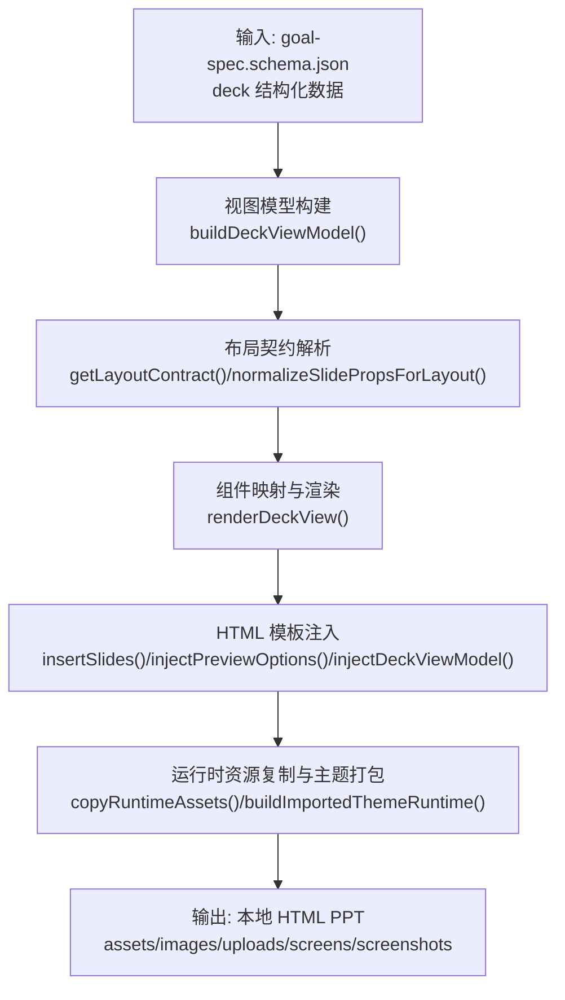
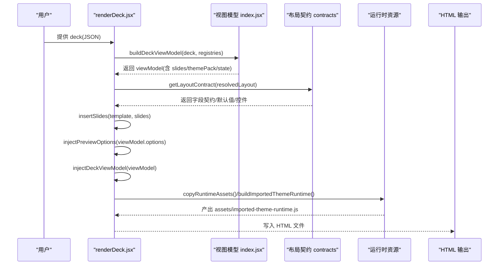
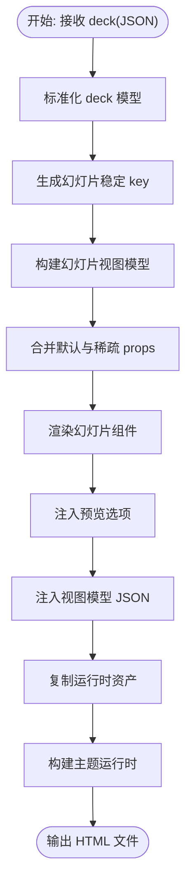
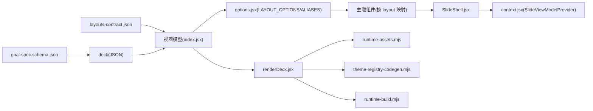

# 布局模板

<cite>
**本文引用的文件**   
- [goal-spec.schema.json](file://skills/dashiai-ppt/references/goal-spec.schema.json)
- [layouts-contract.json](file://skills/dashiai-ppt/layouts-contract.json)
- [layouts-contract-output.json](file://skills/dashiai-ppt/layouts-contract-output.json)
- [layout-roles.md](file://skills/dashiai-ppt/references/layout-roles.md)
- [README.md](file://skills/dashiai-ppt/README.md)
- [renderDeck.jsx](file://skills/dashiai-ppt/project/src/renderDeck.jsx)
- [index.jsx（视图模型）](file://skills/dashiai-ppt/project/src/view-model/index.jsx)
- [context.jsx（上下文）](file://skills/dashiai-ppt/project/src/view-model/context.jsx)
- [SlideShell.jsx](file://skills/dashiai-ppt/project/src/components/shell/SlideShell.jsx)
- [options.jsx](file://skills/dashiai-ppt/project/src/options.jsx)
- [annual-review.json](file://skills/dashiai-ppt/references/examples/annual-review.json)
- [portfolio.json](file://skills/dashiai-ppt/references/examples/portfolio.json)
</cite>

## 目录
1. [简介](#简介)
2. [项目结构](#项目结构)
3. [核心组件](#核心组件)
4. [架构总览](#架构总览)
5. [详细组件分析](#详细组件分析)
6. [依赖关系分析](#依赖关系分析)
7. [性能考量](#性能考量)
8. [故障排查指南](#故障排查指南)
9. [结论](#结论)
10. [附录](#附录)

## 简介
本文件系统化阐述 DashIAI PPT 的“布局模板系统”，覆盖以下关键主题：
- 布局规范定义与数据结构约束：基于 goal-spec.schema.json 的输入校验规则。
- 布局契约与内容区域：基于 layouts-contract.json 的角色、字段、媒体槽、控件与响应式适配约定。
- 从结构化数据到 HTML 渲染的生成流程：包括视图模型构建、页面组件映射、运行时资源注入与最终 HTML 输出。
- 自定义布局开发指南：布局协议、组件映射、样式绑定与调试方法。
- 测试工具与调试方法：预览选项、语言切换、主题切换开关、图片槽状态等。

## 项目结构
DashIAI PPT 的布局模板系统由“规范定义 + 契约描述 + 渲染引擎”三部分构成：
- 规范定义：goal-spec.schema.json 定义了 deck 的结构化输入（标题、目标、受众、页数、主题包、文本、媒体、幻灯片列表等）。
- 契约描述：layouts-contract.json 描述了每个 layout 的数据契约，包括角色、字段预算、填充计划、数组元信息、长度绑定、属性形状、媒体槽、计数绑定与控件等。
- 渲染引擎：通过 renderDeck.jsx 将结构化 deck 转换为可交互的 HTML PPT，并注入运行时资源与主题产物。

**图表来源** 
- [renderDeck.jsx:41-63](file://skills/dashiai-ppt/project/src/renderDeck.jsx#L41-L63)
- [index.jsx（视图模型）:23-61](file://skills/dashiai-ppt/project/src/view-model/index.jsx#L23-L61)

**章节来源**
- [README.md:1-62](file://skills/dashiai-ppt/README.md#L1-L62)

## 核心组件
- 输入规范（goal-spec.schema.json）
  - 顶层必填字段：title、goal；可选字段包括 audience、owner、randomSeed、pageCount、themePack、text、media、props、slides。
  - slides 数组每项必须包含 layout，并可携带 id、key、slideKey、logicalIndex、props、media、copy、needsVisual、imageGen、needsImageGen、plannedImages、providedImages 等扩展字段。
  - themePack 限定为 theme01~theme12 之一。
- 布局契约（layouts-contract.json / layouts-contract-output.json）
  - 每个 layout 条目包含：layout、theme、themeDisplayName、themeScenario、themeAudience、pageNumber、label、slot、roles、copyKeys、copyBudgets、copyRoles、fieldContracts、fillPlan、arrayKeys、arrayMeta、lengthBindings、propShapes、mediaSlots、countBindings、controls、defaultVisibleCounts 等。
  - roles 用于草稿阶段理解页面功能，交付前需替换为具体 layout key（如 theme01_page001）。
- 视图模型与渲染（view-model/index.jsx、renderDeck.jsx）
  - buildDeckViewModel：规范化 deck 模型、创建 slide keys、构建 slides 视图模型、确定主题包与选项。
  - renderDeckView：遍历 slides 并通过 SlideViewModelProvider 注入上下文后渲染组件。
  - serializeDeckViewModel：序列化视图模型为 JSON，供浏览器端使用。
  - renderDeck：读取模板、插入幻灯片、注入预览选项与视图模型、复制运行时资产、构建主题运行时。

**章节来源**
- [goal-spec.schema.json:1-120](file://skills/dashiai-ppt/references/goal-spec.schema.json#L1-L120)
- [layouts-contract.json:1-800](file://skills/dashiai-ppt/layouts-contract.json#L1-L800)
- [layouts-contract-output.json:1-800](file://skills/dashiai-ppt/layouts-contract-output.json#L1-L800)
- [layout-roles.md:1-29](file://skills/dashiai-ppt/references/layout-roles.md#L1-L29)
- [index.jsx（视图模型）:23-61](file://skills/dashiai-ppt/project/src/view-model/index.jsx#L23-L61)
- [renderDeck.jsx:41-63](file://skills/dashiai-ppt/project/src/renderDeck.jsx#L41-L63)

## 架构总览
整体架构围绕“结构化输入 → 视图模型 → 组件映射 → HTML 渲染 → 资源注入”展开：

**图表来源** 
- [renderDeck.jsx:41-63](file://skills/dashiai-ppt/project/src/renderDeck.jsx#L41-L63)
- [index.jsx（视图模型）:23-61](file://skills/dashiai-ppt/project/src/view-model/index.jsx#L23-L61)

## 详细组件分析

### 输入规范与验证（goal-spec.schema.json）
- 顶层对象约束：
  - title、goal 为必填字符串。
  - themePack 限定枚举 theme01~theme12。
  - text 为键值对字符串映射，用于全局文本占位。
  - media 当前禁用（false），预留扩展。
  - props 为任意对象，用于页面级属性。
- slides 数组约束：
  - 每项必须包含 layout（字符串）。
  - 支持 id/key/slideKey/logicalIndex 标识与排序。
  - props 为对象，承载页面字段。
  - media 禁用（false），预留扩展。
  - copy/imageGen/plannedImages/providedImages 等控制图像生成与提供策略。
- 验证策略：
  - 使用 JSON Schema draft 2020-12 进行类型与必填校验。
  - 扩展字段允许 additionalProperties=true，便于未来演进。

**章节来源**
- [goal-spec.schema.json:1-120](file://skills/dashiai-ppt/references/goal-spec.schema.json#L1-L120)

### 布局契约与内容区域（layouts-contract.json）
- 角色与用途：
  - roles 数组描述页面功能（cover、statement、breakdown、transition、context、metrics、trend、comparison、distribution、relationship、case、image、process、risks、observation、ambient、actions、result、team、closing）。
  - 交付前需将 role 替换为具体 layout key（如 theme09_page003）。
- 字段与预算：
  - copyKeys 列出所有可填充字段路径（支持数组项如 fields[].k）。
  - copyBudgets 为各字段设置 maxChars 限制，确保排版稳定。
  - copyRoles 将字段映射到视觉角色（eyebrow/title/body/paragraph 等）。
- 填充计划（fillPlan）：
  - text：单字段填充计划（key、role、type、maxChars）。
  - arrays：数组字段填充计划（visibleCount/maxCount/countKey/itemShape/itemFields）。
  - media：媒体槽填充计划（key/write/visibleCount/maxCount/countKey/accepts/itemShape）。
- 数组元信息（arrayMeta）：
  - 记录数组字段的默认数量、可见数量、最小/最大数量、maxCount 等。
- 长度绑定（lengthBindings）：
  - 用于将数组长度与 UI 控件联动（例如根据数组长度动态调整滑块范围）。
- 属性形状（propShapes）：
  - 声明字段类型（string/number/array/object），便于前端校验与提示。
- 媒体槽（mediaSlots）：
  - 定义媒体字段与 props 路径映射（field/fieldPath/writableProp）。
  - 支持 countKey/publicCountKey/defaultCount/defaultVisibleCount/max/maxCount。
  - accepts/acceptedKinds/acceptedKindsSource 控制接受类型（image/video）。
  - itemShape/valueShape 描述单项与整体值的结构。
  - initialSrcSupported/canPresetMedia/presetProp/emptySlotBehavior 控制初始源、预设与空槽行为。
- 计数绑定（countBindings）：
  - 将数组字段与公开计数键关联（publicKey），用于 UI 控件与渲染逻辑。
- 控件（controls）：
  - 定义 range/toggle 等控件（key/publicKey/label/type/default/min/max/displayOffset/maxFromKey/maxFromKeyOffset）。
  - defaultVisibleCounts 指定默认可见数量。

**章节来源**
- [layouts-contract.json:1-800](file://skills/dashiai-ppt/layouts-contract.json#L1-L800)
- [layouts-contract-output.json:1-800](file://skills/dashiai-ppt/layouts-contract-output.json#L1-L800)
- [layout-roles.md:1-29](file://skills/dashiai-ppt/references/layout-roles.md#L1-L29)

### 视图模型与渲染流程（view-model/index.jsx、renderDeck.jsx）
- 视图模型构建：
  - normalizeDeckModel：标准化 deck 模型（title/themePack/text/media/props/slides）。
  - createSlideKeys：为每张幻灯片生成稳定 key（考虑别名与重复）。
  - buildSlideViewModel：解析 layout 别名、查找组件、合并默认与稀疏 props、计算 label、themePack、context。
  - mergeSparsePropsForRender：按字段类型智能合并默认值与用户值（数组/对象深度合并）。
  - filterThemePacksForSlides：仅保留实际使用的主题包。
- 渲染视图：
  - renderDeckView：遍历 slides，通过 SlideViewModelProvider 注入上下文，渲染对应组件。
  - serializeDeckViewModel：序列化 viewModel 为 JSON，供浏览器端使用。
- HTML 生成：
  - renderDeck：构建 viewModel、读取模板、插入幻灯片、注入预览选项与视图模型、复制运行时资产、构建主题运行时。
  - insertSlides：在模板中定位 
 与 
，插入生成的幻灯片 HTML。
  - injectPreviewOptions：注入语言、主题包切换器、i18n 词典等预览选项。
  - injectDeckViewModel：注入序列化后的 viewModel。
  - copyRuntimeAssets：复制必需 vendor 库与运行时资源，按需拷贝主题资产，构建 imported-theme-runtime.js。
  - buildImportedThemeRuntime：根据 usedThemeKeys 选择预构建 bundle 或模块链接，或从源码构建。

**图表来源** 
- [index.jsx（视图模型）:23-61](file://skills/dashiai-ppt/project/src/view-model/index.jsx#L23-L61)
- [renderDeck.jsx:41-63](file://skills/dashiai-ppt/project/src/renderDeck.jsx#L41-L63)

**章节来源**
- [index.jsx（视图模型）:118-211](file://skills/dashiai-ppt/project/src/view-model/index.jsx#L118-L211)
- [renderDeck.jsx:41-63](file://skills/dashiai-ppt/project/src/renderDeck.jsx#L41-L63)

### 组件映射与 Shell（SlideShell.jsx、context.jsx、options.jsx）
- SlideShell.jsx：
  - 为每张幻灯片提供统一外壳，注入 data-* 属性（layout/animate/slide-id/key/layout/index/theme-pack/logical-slide）。
  - 支持 tone/hero/animate/class 等外观与行为参数。
- context.jsx：
  - 提供 SlideViewModelProvider/useSlideViewModel 上下文，使子组件可访问 slide 的 id/key/index/layout/label/dataLayout/themePack/logicalIndex/media/textKeyPrefix。
- options.jsx：
  - LAYOUT_ALIASES：将别名（如 theme09_page003_coverdossier）映射到真实 layout key。
  - LAYOUT_OPTIONS：注册所有可用 layout 的标签、dataLayout、组件。
  - resolveLayoutName/slide：辅助函数用于解析布局名与创建幻灯片模型。
  - resolveOption：统一解析主题包选项，抛出未知选项错误。

**章节来源**
- [SlideShell.jsx:1-23](file://skills/dashiai-ppt/project/src/components/shell/SlideShell.jsx#L1-L23)
- [context.jsx（上下文）:1-16](file://skills/dashiai-ppt/project/src/view-model/context.jsx#L1-L16)
- [options.jsx:1-43](file://skills/dashiai-ppt/project/src/options.jsx#L1-L43)

### 示例与使用（annual-review.json、portfolio.json）
- annual-review.json：展示封面、摘要、指标、案例等典型页面的 props 填写方式。
- portfolio.json：展示产品组合策略相关页面的 props 填写方式。
- 两者均遵循 goal-spec.schema.json 的结构，slides 中的 layout 指向具体 themeX_pageYYY。

**章节来源**
- [annual-review.json:1-62](file://skills/dashiai-ppt/references/examples/annual-review.json#L1-L62)
- [portfolio.json:1-47](file://skills/dashiai-ppt/references/examples/portfolio.json#L1-L47)

## 依赖关系分析
- 输入层：goal-spec.schema.json 约束 deck 结构。
- 契约层：layouts-contract.json 描述 layout 的数据契约与 UI 控件。
- 渲染层：renderDeck.jsx 驱动视图模型构建与 HTML 生成。
- 组件层：options.jsx 注册 layout 选项与别名；SlideShell.jsx 提供统一外壳；context.jsx 提供上下文。
- 运行时层：runtime-assets.mjs 定义必需资源路径；theme-registry-codegen.mjs 生成主题注册表；runtime-build.mjs 构建主题运行时。

**图表来源** 
- [goal-spec.schema.json:1-120](file://skills/dashiai-ppt/references/goal-spec.schema.json#L1-L120)
- [layouts-contract.json:1-800](file://skills/dashiai-ppt/layouts-contract.json#L1-L800)
- [index.jsx（视图模型）:23-61](file://skills/dashiai-ppt/project/src/view-model/index.jsx#L23-L61)
- [options.jsx:1-43](file://skills/dashiai-ppt/project/src/options.jsx#L1-L43)
- [renderDeck.jsx:41-63](file://skills/dashiai-ppt/project/src/renderDeck.jsx#L41-L63)

**章节来源**
- [index.jsx（视图模型）:23-61](file://skills/dashiai-ppt/project/src/view-model/index.jsx#L23-L61)
- [options.jsx:1-43](file://skills/dashiai-ppt/project/src/options.jsx#L1-L43)
- [renderDeck.jsx:41-63](file://skills/dashiai-ppt/project/src/renderDeck.jsx#L41-L63)

## 性能考量
- 主题运行时构建：
  - 单主题优先使用预构建自包含 bundle，零 esbuild 开销。
  - 多主题使用预构建 minified 模块链接，避免全量编译。
  - 有主题源码时走源码构建，保证开发与安装版一致性。
- 资源裁剪：
  - 仅拷贝实际使用的主题资产，减少输出体积与隐私泄露风险。
- 序列化优化：
  - createJsonSerializer 使用 WeakSet 避免循环引用，过滤函数与 React 元素。
- 模板注入：
  - insertSlides 通过正则定位标记位，避免全文扫描。

[本节为通用指导，不直接分析具体文件]

## 故障排查指南
- 未知布局错误：
  - 现象：resolveLayoutName 或 buildSlideViewModel 抛出“Unknown layout”。
  - 排查：检查 LAYOUT_ALIASES 与 LAYOUT_OPTIONS 是否包含该 layout；确认 goal.spec.slides[].layout 是否正确。
- 未知主题包错误：
  - 现象：resolveOption 抛出“Unknown theme pack”。
  - 排查：确认 themePack 是否为 theme01~theme12；检查 THEME_PACK_OPTIONS。
- 运行时资产缺失：
  - 现象：copyRequiredFile 抛出“Required vendor asset missing”。
  - 排查：确保 node_modules 已安装 gsap/pptxgenjs/pdf-lib/html-to-image；重新安装依赖。
- 主题运行时不可用：
  - 现象：buildImportedThemeRuntime 抛出“No imported theme runtime available”。
  - 排查：检查 DASHI_PPT_THEME_RUNTIME 环境变量；确认主题源码或预构建产物存在；必要时运行构建脚本。
- 预览选项未生效：
  - 现象：语言/主题切换无效。
  - 排查：确认 injectPreviewOptions 与 injectDeckViewModel 已正确替换模板中的占位符；检查浏览器控制台是否有 JSON 解析错误。

**章节来源**
- [renderDeck.jsx:134-159](file://skills/dashiai-ppt/project/src/renderDeck.jsx#L134-L159)
- [index.jsx（视图模型）:173-177](file://skills/dashiai-ppt/project/src/view-model/index.jsx#L173-L177)
- [options.jsx:35-42](file://skills/dashiai-ppt/project/src/options.jsx#L35-L42)

## 结论
DashIAI PPT 的布局模板系统以“规范 + 契约 + 渲染”为核心，实现了从结构化数据到可交互 HTML PPT 的完整流水线。通过 goal-spec.schema.json 严格约束输入，layouts-contract.json 精细描述布局契约，renderDeck.jsx 驱动视图模型与渲染，系统具备高可扩展性与良好性能。开发者可基于此体系快速定制新布局与主题，配合预览选项与调试工具提升迭代效率。

[本节为总结性内容，不直接分析具体文件]

## 附录

### 自定义布局开发指南
- 布局协议：
  - 在 layouts-contract.json 中新增 layout 条目，定义 roles/copyKeys/copyBudgets/copyRoles/fieldContracts/fillPlan/arrayKeys/arrayMeta/lengthBindings/propShapes/mediaSlots/countBindings/controls/defaultVisibleCounts。
  - 确保 fieldContracts 与 fillPlan 一致，明确数组字段的 visibleCount/maxCount/countKey。
- 组件映射：
  - 在 options.jsx 的 LAYOUT_OPTIONS 中注册 layout 的 component（来自 themes/index.jsx 的 makeImportedThemePage）。
  - 若使用别名，需在 LAYOUT_ALIASES 中映射。
- 样式绑定：
  - 通过 propShapes 声明字段类型，结合 controls 定义 UI 控件（range/toggle）。
  - mediaSlots 中设置 writableProp 与 writeMode，确保媒体数据写入 props.images 等路径。
- 调试方法：
  - 启用 includeThemeSwitcher=true 以在预览中切换主题。
  - 检查 .image-slots.state.json 与 assets/user-media/images/user-media 目录，确认媒体状态与上传。
  - 使用浏览器开发者工具查看 data-* 属性与 ViewModel JSON，验证上下文与 props。

**章节来源**
- [layouts-contract.json:1-800](file://skills/dashiai-ppt/layouts-contract.json#L1-L800)
- [options.jsx:1-43](file://skills/dashiai-ppt/project/src/options.jsx#L1-L43)
- [renderDeck.jsx:107-132](file://skills/dashiai-ppt/project/src/renderDeck.jsx#L107-L132)