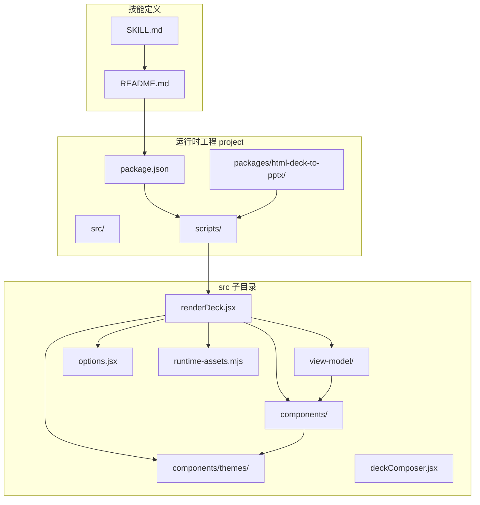
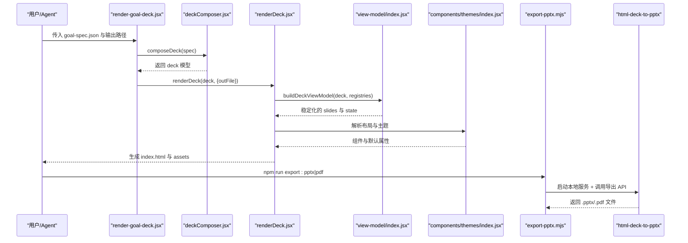
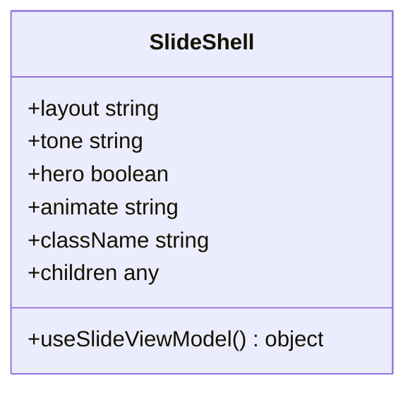
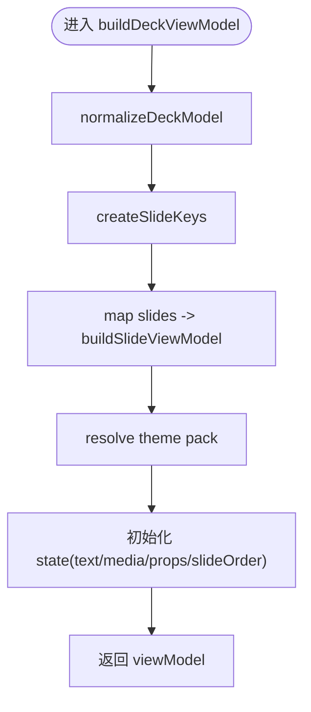
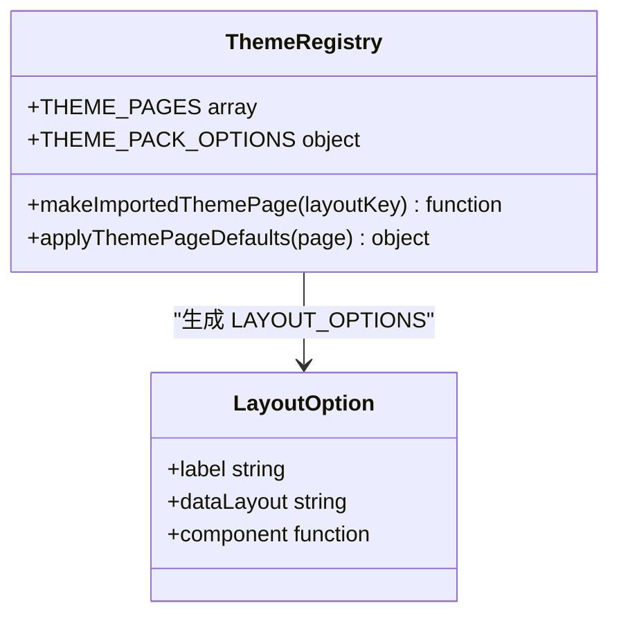
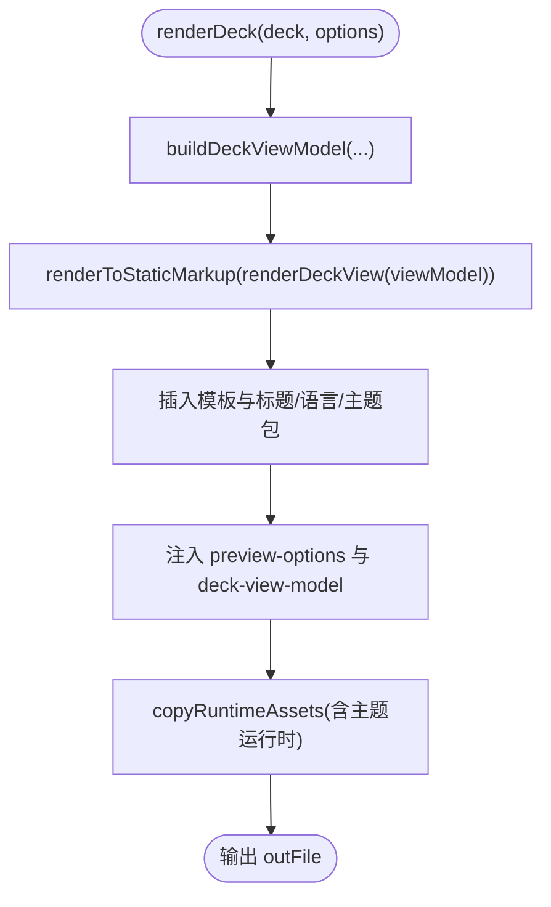
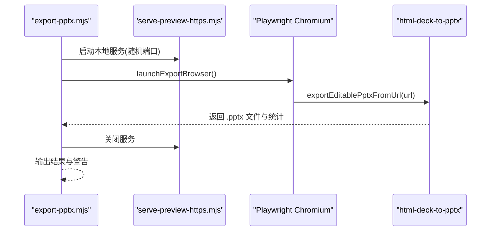
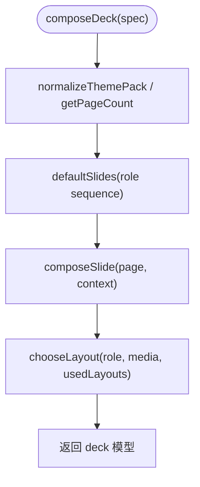
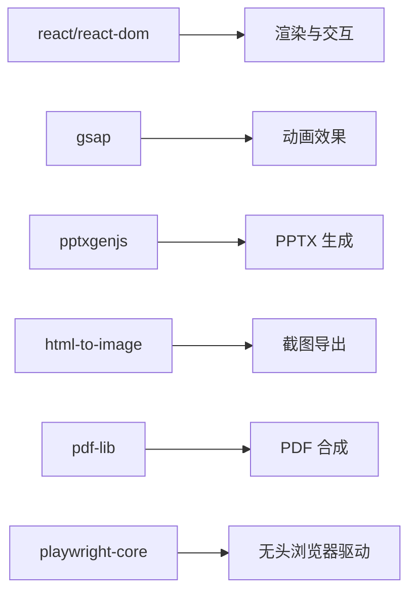

# 核心架构

<cite>
**本文引用的文件**   
- [README.md](file://skills/dashiai-ppt/README.md)
- [SKILL.md](file://skills/dashiai-ppt/SKILL.md)
- [package.json](file://skills/dashiai-ppt/project/package.json)
- [index.jsx](file://skills/dashiai-ppt/project/src/components/shell/index.jsx)
- [SlideShell.jsx](file://skills/dashiai-ppt/project/src/components/shell/SlideShell.jsx)
- [context.jsx](file://skills/dashiai-ppt/project/src/view-model/context.jsx)
- [index.jsx](file://skills/dashiai-ppt/project/src/view-model/index.jsx)
- [renderDeck.jsx](file://skills/dashiai-ppt/project/src/renderDeck.jsx)
- [deckComposer.jsx](file://skills/dashiai-ppt/project/src/deckComposer.jsx)
- [options.jsx](file://skills/dashiai-ppt/project/src/options.jsx)
- [runtime-assets.mjs](file://skills/dashiai-ppt/project/src/runtime-assets.mjs)
- [index.jsx](file://skills/dashiai-ppt/project/src/components/themes/index.jsx)
- [index.mjs](file://skills/dashiai-ppt/project/packages/html-deck-to-pptx/index.mjs)
- [editable.mjs](file://skills/dashiai-ppt/project/packages/html-deck-to-pptx/src/editable.mjs)
- [export-pptx.mjs](file://skills/dashiai-ppt/project/scripts/export-pptx.mjs)
- [render-goal-deck.jsx](file://skills/dashiai-ppt/project/scripts/render-goal-deck.jsx)
</cite>

## 目录
1. [简介](#简介)
2. [项目结构](#项目结构)
3. [核心组件](#核心组件)
4. [架构总览](#架构总览)
5. [详细组件分析](#详细组件分析)
6. [依赖分析](#依赖分析)
7. [性能考虑](#性能考虑)
8. [故障排查指南](#故障排查指南)
9. [结论](#结论)
10. [附录](#附录)

## 简介
本文件系统性阐述 DashIAI PPT 技能的核心架构，围绕基于 React 的组件化设计、ViewModel 层与渲染引擎的工作原理展开。重点说明：
- Shell 组件如何承载单页结构与上下文信息
- ViewModel 层如何规范化、序列化并驱动页面渲染
- 渲染引擎如何将 Deck 模型转换为可离线打开的 HTML，并支持导出 PPTX/PDF
- 项目结构职责划分（src/components、src/view-model、packages/html-deck-to-pptx 等）
- 数据流从用户输入到最终导出的完整链路
- 构建系统配置、依赖管理与开发环境搭建要点

## 项目结构
整体采用“技能包 + 运行时工程”的组织方式：
- skills/dashiai-ppt：技能定义、使用说明与示例
- skills/dashiai-ppt/project：运行时工程，包含 React 组件、ViewModel、渲染脚本与导出工具
- skills/dashiai-ppt/project/packages/html-deck-to-pptx：PPTX/PDF 导出引擎包（浏览器端与无头浏览器驱动）

图表来源
- [package.json:1-37](file://skills/dashiai-ppt/project/package.json#L1-L37)
- [renderDeck.jsx:1-63](file://skills/dashiai-ppt/project/src/renderDeck.jsx#L1-L63)
- [runtime-assets.mjs:1-44](file://skills/dashiai-ppt/project/src/runtime-assets.mjs#L1-L44)

章节来源
- [README.md:1-62](file://skills/dashiai-ppt/README.md#L1-L62)
- [SKILL.md:1-57](file://skills/dashiai-ppt/SKILL.md#L1-L57)
- [package.json:1-37](file://skills/dashiai-ppt/project/package.json#L1-L37)

## 核心组件
- Shell 组件（SlideShell）：为每页幻灯片提供统一的容器与数据属性标记，便于预览编辑器与导出器识别当前页上下文。
- ViewModel 层：负责将原始 Deck 规范标准化为稳定的视图模型，生成唯一键、合并默认属性、维护文本与媒体状态，并提供序列化能力。
- 主题与布局注册：通过主题索引与布局选项，将页面角色映射到具体布局组件，支持多主题包与按需裁剪。
- 渲染引擎（renderDeck）：将 ViewModel 渲染为静态 HTML，注入运行时资源、语言与预览选项，输出可离线的演示文稿。
- 导出引擎（html-deck-to-pptx）：通过 Playwright 驱动浏览器，将 HTML 页面导出为可编辑 PPTX 或截图式 PDF。

章节来源
- [SlideShell.jsx:1-23](file://skills/dashiai-ppt/project/src/components/shell/SlideShell.jsx#L1-L23)
- [index.jsx:1-100](file://skills/dashiai-ppt/project/src/view-model/index.jsx#L1-L100)
- [index.jsx:1-172](file://skills/dashiai-ppt/project/src/components/themes/index.jsx#L1-L172)
- [renderDeck.jsx:1-63](file://skills/dashiai-ppt/project/src/renderDeck.jsx#L1-L63)
- [index.mjs:1-16](file://skills/dashiai-ppt/project/packages/html-deck-to-pptx/index.mjs#L1-L16)

## 架构总览
下图展示从“目标规格”到“HTML 交付件”再到“PPTX/PDF 导出”的整体流程。

图表来源
- [render-goal-deck.jsx:1-54](file://skills/dashiai-ppt/project/scripts/render-goal-deck.jsx#L1-L54)
- [deckComposer.jsx:1-101](file://skills/dashiai-ppt/project/src/deckComposer.jsx#L1-L101)
- [renderDeck.jsx:1-63](file://skills/dashiai-ppt/project/src/renderDeck.jsx#L1-L63)
- [index.jsx:1-100](file://skills/dashiai-ppt/project/src/view-model/index.jsx#L1-L100)
- [index.jsx:1-172](file://skills/dashiai-ppt/project/src/components/themes/index.jsx#L1-L172)
- [export-pptx.mjs:1-100](file://skills/dashiai-ppt/project/scripts/export-pptx.mjs#L1-L100)
- [index.mjs:1-16](file://skills/dashiai-ppt/project/packages/html-deck-to-pptx/index.mjs#L1-L16)

## 详细组件分析

### Shell 组件（SlideShell）
- 作用：作为每页幻灯片的根节点，注入 data-* 属性以标识 layout、themePack、逻辑序号、VM 上下文等，供编辑器与导出器使用。
- 关键点：
  - 通过 useSlideViewModel 获取当前页上下文
  - 统一 class 命名与动画标记（tone、hero、animate）
  - 保持最小职责，仅做容器与元数据标注

图表来源
- [SlideShell.jsx:1-23](file://skills/dashiai-ppt/project/src/components/shell/SlideShell.jsx#L1-L23)
- [context.jsx:1-16](file://skills/dashiai-ppt/project/src/view-model/context.jsx#L1-L16)

章节来源
- [index.jsx:1-2](file://skills/dashiai-ppt/project/src/components/shell/index.jsx#L1-L2)
- [SlideShell.jsx:1-23](file://skills/dashiai-ppt/project/src/components/shell/SlideShell.jsx#L1-L23)
- [context.jsx:1-16](file://skills/dashiai-ppt/project/src/view-model/context.jsx#L1-L16)

### ViewModel 层
- 作用：将原始 deck 规范标准化为稳定、可序列化的视图模型；管理 slide 顺序、文本与媒体状态；合并默认属性与稀疏覆盖值。
- 关键函数：
  - createSlideModel / isSlideModel：创建与识别页模型
  - buildDeckViewModel：构建全局视图模型（slides、state、options、themePack）
  - renderDeckView：将 viewModel.slides 渲染为 React 元素树
  - serializeDeckViewModel：将视图模型序列化为 JSON，用于持久化与传输
- 复杂度与优化：
  - 文本键归一化（normalizeTextState）确保跨版本/别名迁移兼容
  - 稀疏属性合并（mergeSparsePropsForRender）避免全量覆盖，提升增量更新效率
  - 主题包过滤（filterThemePacksForSlides）减少运行时体积

图表来源
- [index.jsx:1-100](file://skills/dashiai-ppt/project/src/view-model/index.jsx#L1-L100)
- [index.jsx:100-200](file://skills/dashiai-ppt/project/src/view-model/index.jsx#L100-L200)
- [index.jsx:200-369](file://skills/dashiai-ppt/project/src/view-model/index.jsx#L200-L369)

章节来源
- [index.jsx:1-369](file://skills/dashiai-ppt/project/src/view-model/index.jsx#L1-L369)

### 主题与布局注册
- 作用：集中管理主题包与页面布局，提供 makeImportedThemePage 包装器，将布局页与控件、默认值、显示策略规范化。
- 关键点：
  - THEME_PAGES 与 THEME_PACK_OPTIONS 由生成的元数据构建
  - 通过 overrides 机制对特定主题进行控件注入与默认值覆盖
  - 支持按主题裁剪运行时资产，减小交付体积

图表来源
- [index.jsx:1-172](file://skills/dashiai-ppt/project/src/components/themes/index.jsx#L1-L172)
- [options.jsx:1-43](file://skills/dashiai-ppt/project/src/options.jsx#L1-L43)

章节来源
- [index.jsx:1-172](file://skills/dashiai-ppt/project/src/components/themes/index.jsx#L1-L172)
- [options.jsx:1-43](file://skills/dashiai-ppt/project/src/options.jsx#L1-L43)

### 渲染引擎（renderDeck）
- 作用：将 ViewModel 渲染为静态 HTML，注入模板、语言、预览选项与 ViewModel JSON，复制运行时资源，生成可离线打开的演示文稿。
- 关键点：
  - 使用 React 服务端渲染（renderToStaticMarkup）生成 slides 片段
  - 模板替换与标题、语言、主题包注入
  - 资源拷贝与主题运行时构建（支持预构建与源码两种模式）
  - 用户媒体目录保护与恢复，避免重复构建污染

图表来源
- [renderDeck.jsx:1-63](file://skills/dashiai-ppt/project/src/renderDeck.jsx#L1-L63)
- [runtime-assets.mjs:1-44](file://skills/dashiai-ppt/project/src/runtime-assets.mjs#L1-L44)

章节来源
- [renderDeck.jsx:1-373](file://skills/dashiai-ppt/project/src/renderDeck.jsx#L1-L373)
- [runtime-assets.mjs:1-44](file://skills/dashiai-ppt/project/src/runtime-assets.mjs#L1-L44)

### 导出引擎（html-deck-to-pptx）
- 作用：提供可编辑 PPTX 与截图式 PDF 的导出能力，通过 Playwright 驱动浏览器访问本地静态站点，调用导出 API。
- 关键点：
  - 公共入口 index.mjs 暴露 exportEditablePptxFromUrl/exportScreenshotPdfFromUrl
  - 导出脚本 export-pptx.mjs 自动启动临时 HTTP 服务器，等待就绪后驱动浏览器导出
  - 支持 --pdf 模式与自定义标题

图表来源
- [index.mjs:1-16](file://skills/dashiai-ppt/project/packages/html-deck-to-pptx/index.mjs#L1-L16)
- [editable.mjs:1-3](file://skills/dashiai-ppt/project/packages/html-deck-to-pptx/src/editable.mjs#L1-L3)
- [export-pptx.mjs:1-100](file://skills/dashiai-ppt/project/scripts/export-pptx.mjs#L1-L100)

章节来源
- [index.mjs:1-16](file://skills/dashiai-ppt/project/packages/html-deck-to-pptx/index.mjs#L1-L16)
- [editable.mjs:1-3](file://skills/dashiai-ppt/project/packages/html-deck-to-pptx/src/editable.mjs#L1-L3)
- [export-pptx.mjs:1-171](file://skills/dashiai-ppt/project/scripts/export-pptx.mjs#L1-L171)

### 目标规格到 Deck 的组装（deckComposer）
- 作用：根据目标规格（goal/spec）自动生成默认页序列、选择合适布局、处理媒体槽位容量与角色关键词匹配。
- 关键点：
  - ROLE_KEYWORDS 与 ROLE_ALIASES 实现语义到布局池的映射
  - chooseLayout 依据媒体需求与已用布局去重选择
  - 支持随机种子保证可复现性

图表来源
- [deckComposer.jsx:1-101](file://skills/dashiai-ppt/project/src/deckComposer.jsx#L1-L101)
- [deckComposer.jsx:101-200](file://skills/dashiai-ppt/project/src/deckComposer.jsx#L101-L200)
- [deckComposer.jsx:200-301](file://skills/dashiai-ppt/project/src/deckComposer.jsx#L200-L301)

章节来源
- [deckComposer.jsx:1-301](file://skills/dashiai-ppt/project/src/deckComposer.jsx#L1-L301)

## 依赖分析
- 运行时依赖：React、React-DOM、GSAP、pptxgenjs、html-to-image、pdf-lib
- 开发依赖：tsx、esbuild、pngjs、playwright-core
- 脚本命令：render:goal、preview:start、export:pptx、export:pdf 等

图表来源
- [package.json:22-35](file://skills/dashiai-ppt/project/package.json#L22-L35)

章节来源
- [package.json:1-37](file://skills/dashiai-ppt/project/package.json#L1-L37)

## 性能考虑
- 主题运行时按需构建：根据实际使用的主题键集合生成最小化运行时，避免全量打包
- 资源裁剪：仅复制被使用的主题源资源，减少交付体积与外链依赖
- 文本键归一化与稀疏合并：降低序列化与渲染开销，提升增量更新效率
- 预构建产物优先：在无主题源环境下使用预构建 bundle/module，跳过 esbuild 编译阶段
- 用户媒体目录保护：避免重复构建时污染用户数据，提升稳定性

[本节为通用指导，不直接分析具体文件]

## 故障排查指南
- 模板缺失错误：当模板缺少 
 或 
 标记时会抛出异常，需检查模板完整性
- 未知布局错误：若指定了未注册的 layout，会抛出错误提示可用布局列表
- 未知主题包错误：若指定了未注册的 themePack，会抛出错误提示可用主题包列表
- 导出失败：检查本地服务是否就绪、Playwright 是否安装成功、端口占用情况
- 资源缺失：必需 vendor 资源缺失会导致构建失败，需确认 node_modules 安装完整

章节来源
- [renderDeck.jsx:74-105](file://skills/dashiai-ppt/project/src/renderDeck.jsx#L74-L105)
- [options.jsx:22-43](file://skills/dashiai-ppt/project/src/options.jsx#L22-L43)
- [export-pptx.mjs:118-163](file://skills/dashiai-ppt/project/scripts/export-pptx.mjs#L118-L163)

## 结论
DashIAI PPT 技能通过清晰的组件化架构与 ViewModel 层实现了高内聚、低耦合的设计：Shell 组件负责页面容器与上下文，ViewModel 层负责数据标准化与状态管理，渲染引擎负责 HTML 生成与资源装配，导出引擎负责 PPTX/PDF 输出。该架构具备良好的可扩展性与可维护性，适合快速迭代主题与布局，同时保障离线可用与高质量导出。

[本节为总结性内容，不直接分析具体文件]

## 附录
- 构建与运行命令
  - 渲染目标规格：npm run render:goal -- <goal-spec.json> <output/ppt/index.html>
  - 预览本地站点：npm run preview:start 或 npm run preview:https
  - 导出 PPTX：npm run export:pptx -- <deck-ppt-dir> [out-file.pptx]
  - 导出 PDF：npm run export:pdf -- <deck-ppt-dir> [out-file.pdf]
- 环境变量
  - DASHI_PPT_THEME_RUNTIME：控制主题运行时构建模式（auto/prebuilt/source）

章节来源
- [package.json:6-21](file://skills/dashiai-ppt/project/package.json#L6-L21)
- [render-goal-deck.jsx:1-54](file://skills/dashiai-ppt/project/scripts/render-goal-deck.jsx#L1-L54)
- [export-pptx.mjs:1-100](file://skills/dashiai-ppt/project/scripts/export-pptx.mjs#L1-L100)