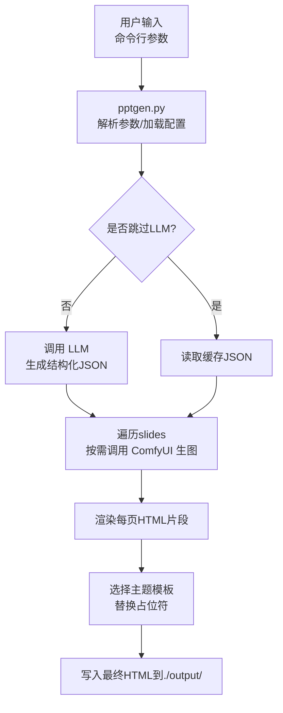
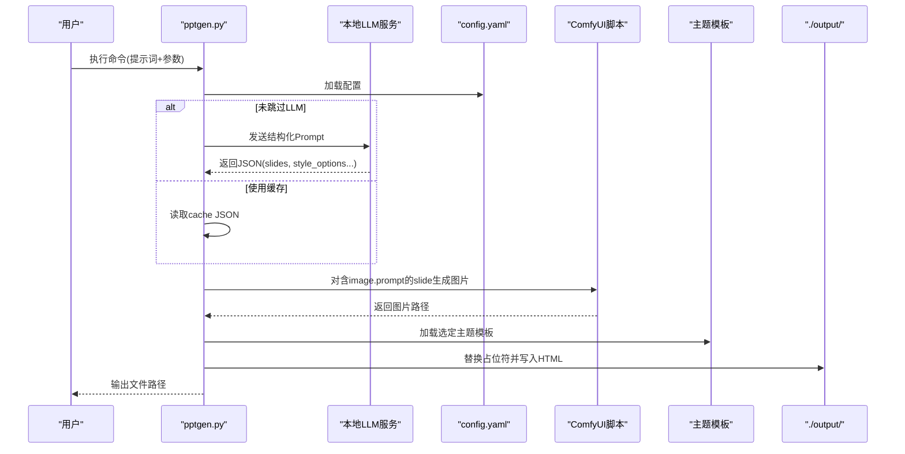
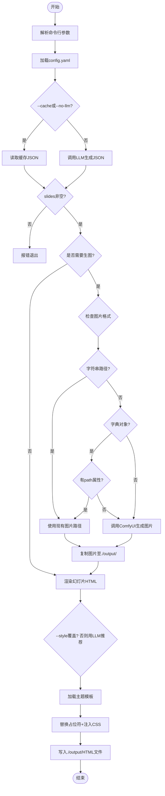
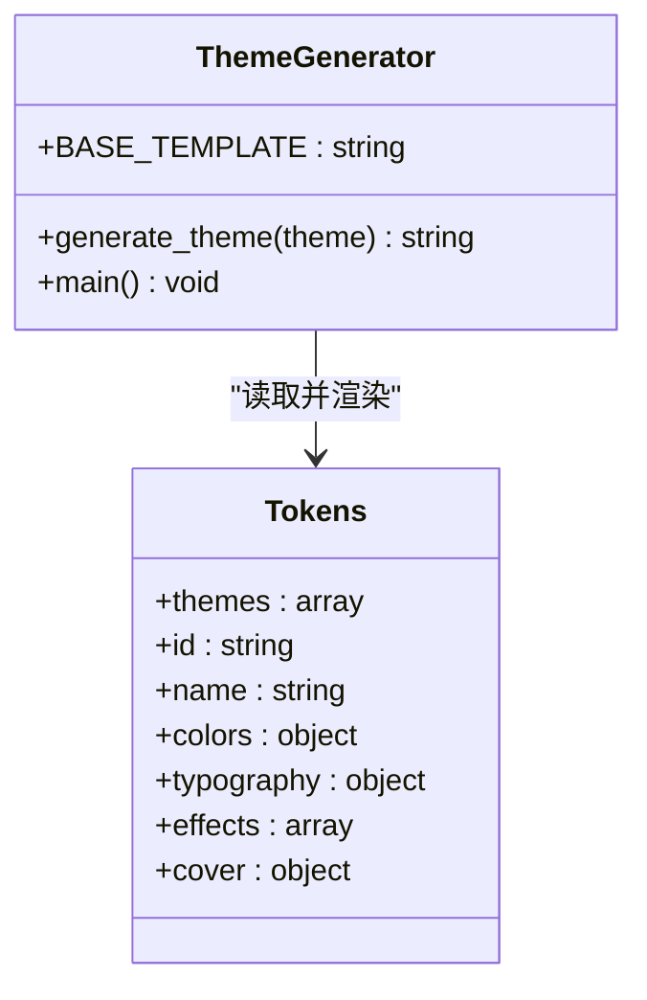
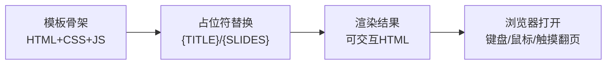
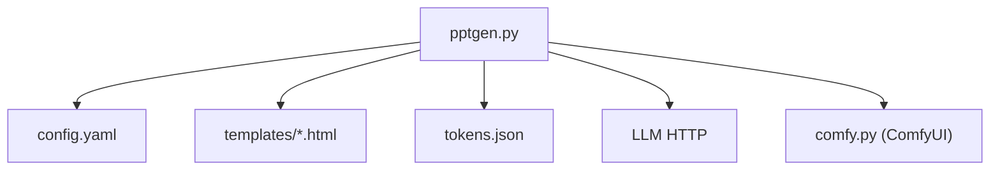

# PPTGen 技能

<cite>
**本文引用的文件**   
- [SKILL.md](file://skills/pptgen/SKILL.md)
- [config.yaml](file://skills/pptgen/config.yaml)
- [pptgen.py](file://skills/pptgen/pptgen.py)
- [gen_themes.py](file://skills/pptgen/gen_themes.py)
- [tokens.json](file://skills/pptgen/tokens.json)
- [aurora.html](file://skills/pptgen/templates/aurora.html)
- [dark-tech.html](file://skills/pptgen/templates/dark-tech.html)
- [minimal.html](file://skills/pptgen/templates/minimal.html)
- [test_aurora.html](file://skills/pptgen/test_aurora.html)
- [test_code.html](file://skills/pptgen/test_code.html)
- [test_dark_tech.html](file://skills/pptgen/test_dark_tech.html)
</cite>

## 更新摘要
**已进行的更改**   
- 修复了输出目录配置，将默认输出路径从技能安装目录改为用户当前工作目录（`os.getcwd()/output`）
- 修复了内容布局渲染问题，正确包裹card结构的inner div容器
- 新增缓存模式支持现有图片路径，图像处理逻辑现在同时支持prompt生成和直接路径引用
- 包含对不同输入格式（包括带path属性的字典对象）的正确回退机制
- 更新了相关文档说明，确保用户了解生成的演示文稿保存位置

## 目录
1. [简介](#简介)
2. [项目结构](#项目结构)
3. [核心组件](#核心组件)
4. [架构总览](#架构总览)
5. [详细组件分析](#详细组件分析)
6. [依赖关系分析](#依赖关系分析)
7. [性能与扩展性](#性能与扩展性)
8. [故障排查指南](#故障排查指南)
9. [结论](#结论)
10. [附录：模板与样式定制指南](#附录模板与样式定制指南)

## 简介
PPTGen 是一个基于 HTML/CSS 模板的演示文稿生成引擎。它通过 Python CLI 工具将自然语言需求转化为交互式 HTML 演示，支持本地 LLM 内容生成、ComfyUI 图片生成、以及多套视觉主题模板渲染。输出为可直接在浏览器打开的 HTML 文件，具备键盘翻页、全屏、进度指示等交互能力。该技能强调"零 API 费用"的本地化工作流，适合快速产出高质量、可定制的网页式演示。

**重要更新**：输出目录已优化为默认保存到当前项目目录（`./output/`），而非技能安装目录，便于用户管理和访问生成的演示文稿。同时增强了图像处理逻辑，支持多种输入格式和缓存模式。

## 项目结构
- 入口脚本：pptgen.py（CLI 主程序）
- 主题生成器：gen_themes.py（从 tokens.json 生成主题 HTML 模板）
- 配置：config.yaml（LLM、ComfyUI、输出路径等）
- 设计令牌：tokens.json（颜色、字体、效果、封面尺寸等）
- 模板目录：templates/*.html（各风格完整 HTML 模板）
- 测试样例：test_*.html（不同风格的示例输出）

图表来源 
- [pptgen.py:448-591](file://skills/pptgen/pptgen.py#L448-L591)
- [gen_themes.py:242-264](file://skills/pptgen/gen_themes.py#L242-L264)
- [tokens.json:1-425](file://skills/pptgen/tokens.json#L1-L425)

章节来源
- [SKILL.md:1-50](file://skills/pptgen/SKILL.md#L1-L50)
- [config.yaml:1-13](file://skills/pptgen/config.yaml#L1-L13)

## 核心组件
- CLI 主程序（pptgen.py）
  - 参数解析、配置加载、LLM 调用、图片生成、幻灯片渲染、模板注入、输出写入
- 主题生成器（gen_themes.py）
  - 读取 tokens.json，按主题生成完整的 HTML 模板文件
- 设计令牌（tokens.json）
  - 定义主题 ID、名称、配色、字体、效果、封面字号等
- 模板系统（templates/*.html）
  - 每个主题一个完整 HTML，包含 CSS 与内联 JS 翻页逻辑
- 配置文件（config.yaml）
  - LLM 端点/模型、ComfyUI 脚本路径与输出目录、默认输出目录

章节来源
- [pptgen.py:1-618](file://skills/pptgen/pptgen.py#L1-L618)
- [gen_themes.py:1-265](file://skills/pptgen/gen_themes.py#L1-L265)
- [tokens.json:1-425](file://skills/pptgen/tokens.json#L1-L425)
- [config.yaml:1-13](file://skills/pptgen/config.yaml#L1-L13)

## 架构总览
整体流程分为四个阶段：
1) 内容生成：根据用户需求调用本地 LLM，返回结构化 JSON（标题、副标题、作者、日期、推荐风格、slides 数组）。
2) 图片生成：对需要配图的页面，调用 ComfyUI 脚本生成图片并复制到输出目录。
3) 幻灯片渲染：将 slides 数据转换为 HTML 片段，支持多种布局（封面、章节、正文、左右分栏、双栏、引用、数据、全屏图）。
4) 模板装配：选择主题模板，替换占位符（{TITLE}/{SUBTITLE}/{AUTHOR}/{STYLE_NAME}/{SLIDES}），注入钻取面板 CSS，输出最终 HTML。

图表来源 
- [pptgen.py:102-171](file://skills/pptgen/pptgen.py#L102-L171)
- [pptgen.py:176-202](file://skills/pptgen/pptgen.py#L176-L202)
- [pptgen.py:415-443](file://skills/pptgen/pptgen.py#L415-L443)
- [pptgen.py:448-591](file://skills/pptgen/pptgen.py#L448-L591)

## 详细组件分析

### CLI 主程序（pptgen.py）
- 参数与行为
  - 支持 --style 指定主题（覆盖 LLM 推荐）、--pages 控制页数、--output 指定输出路径、--no-image 跳过生图、--no-llm 跳过 LLM、--cache 从缓存读取、--config 指定配置文件。
- 配置加载
  - 优先尝试 yaml.safe_load；若缺失库则回退为简易解析；同时支持环境变量覆盖 LLM_ENDPOINT/LLM_MODEL。
- LLM 调用
  - 构造系统提示，要求返回严格 JSON（title/subtitle/author/date/style_options/slides...），并对 layout/image/detail 字段进行约束。
  - 失败时打印错误并退出。
- 图片生成
  - 遍历 slides 中 image.prompt，根据 style/style_options 选择 ComfyUI 风格，必要时交互式选择；生成后复制到输出目录并重命名为 slide_NN.ext。
- 幻灯片渲染
  - 将 content/items 转为 HTML；支持列表、段落、换行；detail 支持 table/card/text/bar 四种钻取类型。
  - 布局包括 cover/section/content/content-left/content-right/two-column/quote/data/image-full。
- 模板装配
  - 加载 templates/{style}.html，替换 {TITLE}/{SUBTITLE}/{AUTHOR}/{STYLE_NAME}/{SLIDES}，并在 </head> 前注入钻取面板 CSS。
- 输出
  - **已更新**：自动创建 `./output/` 目录（当前项目目录），文件名基于 title 安全化处理。

**重大更新**：输出目录配置已修复，现在默认保存到当前工作目录的 `./output/` 文件夹，而不是技能安装目录。同时增强了图像处理逻辑，支持多种输入格式：
- 字符串路径：直接使用现有图片路径
- 字典对象：支持 `{"path": "..."}` 格式的现有图片引用
- Prompt生成：传统的 `{"prompt": "...", "style": "..."}` 格式
- 智能回退：当图片生成失败时，自动回退到现有图片路径

图表来源 
- [pptgen.py:448-591](file://skills/pptgen/pptgen.py#L448-L591)
- [pptgen.py:102-171](file://skills/pptgen/pptgen.py#L102-L171)
- [pptgen.py:176-202](file://skills/pptgen/pptgen.py#L176-L202)
- [pptgen.py:415-443](file://skills/pptgen/pptgen.py#L415-L443)

章节来源
- [pptgen.py:1-618](file://skills/pptgen/pptgen.py#L1-L618)

### 主题生成器（gen_themes.py）
- 功能
  - 读取 tokens.json，遍历 themes，为每个主题生成完整 HTML 模板文件到 templates 目录。
  - 根据主题属性（colors/typography/effects/cover）动态生成 CSS 变量与样式片段。
  - 内置 BASE_TEMPLATE 作为骨架，填充占位符并输出。
- 关键逻辑
  - 判断玻璃拟态/深色/浅色模式，生成不同的卡片、箭头、进度条、遮罩等样式。
  - 支持渐变标题、阴影、边框、背景色等效果组合。
  - 生成完成后打印主题 ID 列表，便于同步更新 STYLES 常量。

图表来源 
- [gen_themes.py:11-131](file://skills/pptgen/gen_themes.py#L11-L131)
- [gen_themes.py:134-239](file://skills/pptgen/gen_themes.py#L134-L239)
- [tokens.json:1-425](file://skills/pptgen/tokens.json#L1-L425)

章节来源
- [gen_themes.py:1-265](file://skills/pptgen/gen_themes.py#L1-L265)
- [tokens.json:1-425](file://skills/pptgen/tokens.json#L1-L425)

### 模板系统（templates/*.html）
- 统一结构
  - 每个主题模板包含完整 HTML，内嵌 CSS 与 JS 翻页逻辑，支持键盘方向键、点击箭头、底部进度点、全屏切换、触摸滑动。
- 占位符
  - {TITLE}、{SLIDES} 由 pptgen.py 替换；其他样式由主题自身 CSS 决定。
- 常见布局类名
  - .slide-cover/.slide-section/.slide-content/.slide-side/.slide-2col/.slide-quote/.slide-data/.slide-image-full
- 交互脚本
  - 维护当前索引 c，切换 active 类实现淡入淡出；构建进度点；监听键盘事件；支持全屏。

**布局渲染修复**：现在所有布局都正确包裹在 `.inner` div 容器中，确保内容布局和样式的一致性。特别是 card 结构的 inner div 容器修复，提升了渲染质量。

图表来源 
- [aurora.html:1-129](file://skills/pptgen/templates/aurora.html#L1-L129)
- [dark-tech.html:1-143](file://skills/pptgen/templates/dark-tech.html#L1-L143)
- [minimal.html:1-118](file://skills/pptgen/templates/minimal.html#L1-L118)

章节来源
- [aurora.html:1-129](file://skills/pptgen/templates/aurora.html#L1-L129)
- [dark-tech.html:1-143](file://skills/pptgen/templates/dark-tech.html#L1-L143)
- [minimal.html:1-118](file://skills/pptgen/templates/minimal.html#L1-L118)

### 设计令牌（tokens.json）
- 主题元信息
  - id/name/nameEn/scenario/audience/style
- 颜色体系
  - bg/bgAlt/fg/fgMuted/accent/accentAlt/accentWarm/accentHot/accentCool/cardBg/cardBorder/glassBlur/accentGradient
- 字体排版
  - sans/mono/display/headingWeight/bodyWeight
- 视觉效果
  - effects 数组（如 glassmorphism/neon-glow/aurora-gradient 等）
- 封面设置
  - cover.titleSize/cover.subtitleSize

章节来源
- [tokens.json:1-425](file://skills/pptgen/tokens.json#L1-L425)

### 配置文件（config.yaml）
- llm.endpoint/model/api_key
- comfyui.script/output_dir
- output.dir

章节来源
- [config.yaml:1-13](file://skills/pptgen/config.yaml#L1-L13)

## 依赖关系分析
- 外部依赖
  - LLM 服务（HTTP 接口，JSON 请求/响应）
  - ComfyUI 脚本（Python 子进程调用）
  - YAML 解析（可选，回退为正则解析）
- 内部模块耦合
  - pptgen.py 依赖 gen_themes.py 生成的模板文件
  - pptgen.py 依赖 tokens.json 的主题 ID 列表（用于校验 --style）
  - 模板文件之间相互独立，仅通过占位符与主程序耦合

图表来源 
- [pptgen.py:30-50](file://skills/pptgen/pptgen.py#L30-L50)
- [pptgen.py:415-443](file://skills/pptgen/pptgen.py#L415-L443)
- [pptgen.py:176-202](file://skills/pptgen/pptgen.py#L176-L202)

章节来源
- [pptgen.py:1-618](file://skills/pptgen/pptgen.py#L1-L618)

## 性能与扩展性
- 性能特征
  - LLM 调用耗时取决于网络与模型大小；ComfyUI 生图受 GPU 与模型影响较大；HTML 渲染在浏览器端完成，基本无服务端压力。
- 优化建议
  - 批量生成：通过循环调用 CLI 或使用 --cache 避免重复 LLM 调用。
  - 图片缓存：复用已生成的图片路径，减少重复生图。
  - 模板预编译：提前运行 gen_themes.py 生成模板，避免运行时开销。
- 扩展性
  - 新增主题：在 tokens.json 添加主题定义，运行 gen_themes.py 生成模板，然后在 STYLES 列表中注册。
  - 新增布局：在 render_slide 中添加新 layout 分支，并在模板 CSS 中补充样式。
  - 自定义细节：detail 支持 table/card/text/bar，可扩展更多类型。

## 故障排查指南
- LLM 未配置或返回空
  - 检查 config.yaml 的 llm.endpoint 与 model，或设置环境变量 LLM_ENDPOINT/LLM_MODEL。
  - 确认返回 JSON 结构符合 SYSTEM_PROMPT 要求。
- ComfyUI 生图失败
  - 检查 comfy.py 路径是否正确，输出目录是否存在且可写。
  - 查看子进程 stderr 日志定位问题。
- 模板未找到
  - 确保 templates 目录下存在对应主题的 HTML 文件；未知 --style 会回退到 magazine。
- 输出为空或损坏
  - 检查 slides 是否为空；确认输出目录权限；确认占位符替换成功。
- **输出目录问题（已修复）**
  - **更新**：默认输出目录现在是 `./output/`（当前项目目录），而不是技能安装目录。
  - 如果遇到问题，检查当前工作目录是否有写入权限。
  - 可以使用 `--output` 参数指定自定义输出路径。
- **图像处理问题（已增强）**
  - **更新**：现在支持多种图片输入格式：
    - 字符串路径：直接使用现有图片
    - 字典对象：`{"path": "..."}` 格式的现有图片引用
    - Prompt生成：传统的 `{"prompt": "...", "style": "..."}` 格式
  - 当图片生成失败时，会自动回退到现有图片路径。
  - 检查缓存模式下图片路径的正确性。

章节来源
- [pptgen.py:102-171](file://skills/pptgen/pptgen.py#L102-L171)
- [pptgen.py:176-202](file://skills/pptgen/pptgen.py#L176-L202)
- [pptgen.py:415-443](file://skills/pptgen/pptgen.py#L415-L443)
- [pptgen.py:448-591](file://skills/pptgen/pptgen.py#L448-L591)

## 结论
PPTGen 以"本地 LLM + ComfyUI + HTML 模板"为核心，提供从零到一的交互式演示生成能力。其模块化设计使得主题扩展、布局增强、内容注入均具备良好可维护性。配合 tokens.json 的设计令牌与 gen_themes.py 的代码生成，能够快速迭代视觉风格，满足多样化场景需求。

**重要改进**：输出目录配置已优化，现在默认保存到用户当前工作目录的 `./output/` 文件夹，大大提升了用户体验和文件管理便利性。同时增强了图像处理逻辑，支持多种输入格式和智能回退机制，提高了系统的健壮性和易用性。

## 附录：模板与样式定制指南

### 14 套预设模板概览与使用方法
- 模板列表（来自 STYLES 常量与 tokens.json）
  - neumorphism、aurora、code、glass-candy、chromatic、dark-atlas、research-white、black-gold、navy-magazine、gold-index、growth、sonic-neon、dark-tech、magazine、minimal、gradient
- 使用方法
  - 命令行：python pptgen.py "需求描述" --style <主题ID> --pages N --output ./output/xxx.html
  - 通过 AI Agent：先询问风格、页数、配图需求，再执行 CLI 命令，最后返回本地 URL。

章节来源
- [SKILL.md:20-50](file://skills/pptgen/SKILL.md#L20-L50)
- [pptgen.py:24-26](file://skills/pptgen/pptgen.py#L24-L26)
- [tokens.json:1-425](file://skills/pptgen/tokens.json#L1-L425)

### 主题令牌与样式定制
- 颜色方案
  - 修改 colors.* 字段（bg/fg/accent 等）即可改变整体配色。
- 字体设置
  - 调整 typography.sans/mono/display 与权重，适配不同风格。
- 效果与装饰
  - 通过 effects 数组启用玻璃拟态、霓虹光晕、渐变标题等。
- 封面尺寸
  - cover.titleSize/cover.subtitleSize 控制封面标题与副标题字号。

章节来源
- [tokens.json:1-425](file://skills/pptgen/tokens.json#L1-L425)
- [gen_themes.py:134-239](file://skills/pptgen/gen_themes.py#L134-L239)

### 批量生成与动态内容注入
- 批量生成
  - 循环调用 CLI，或使用 --cache 传入上次生成的 JSON，避免重复 LLM 调用。
- 动态内容注入
  - 通过 detail 字段注入表格、卡片、文本、条形图等，增强页面层次与交互。
- 响应式设计
  - 模板内联 JS 支持键盘、鼠标、触摸操作；CSS 使用相对单位与弹性布局，适配不同屏幕。

章节来源
- [pptgen.py:448-591](file://skills/pptgen/pptgen.py#L448-L591)
- [aurora.html:102-129](file://skills/pptgen/templates/aurora.html#L102-L129)
- [dark-tech.html:98-143](file://skills/pptgen/templates/dark-tech.html#L98-L143)
- [minimal.html:90-118](file://skills/pptgen/templates/minimal.html#L90-L118)

### 开发最佳实践
- 保持 prompts 结构化，确保 LLM 返回稳定 JSON。
- 为每张配图提供清晰的 prompt，并在 style_options 中给出理由，提升生成质量。
- 新增布局时，同步完善模板 CSS 与渲染逻辑，保证一致性。
- 使用 tokens.json 管理主题，避免硬编码样式。
- **输出目录管理**：生成的演示文稿默认保存在 `./output/` 目录，确保该目录有写入权限。
- **文件组织**：建议在项目根目录创建 `output/` 文件夹来统一管理所有生成的演示文稿。
- **图片处理**：充分利用新的图片处理功能，支持现有图片路径引用和智能回退机制。

[本节为通用指导，不直接分析具体文件]