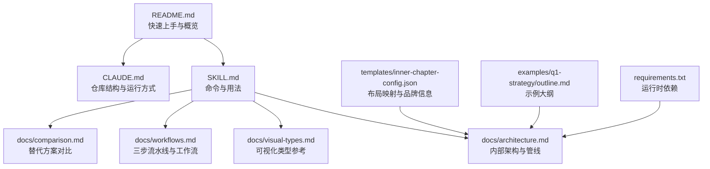
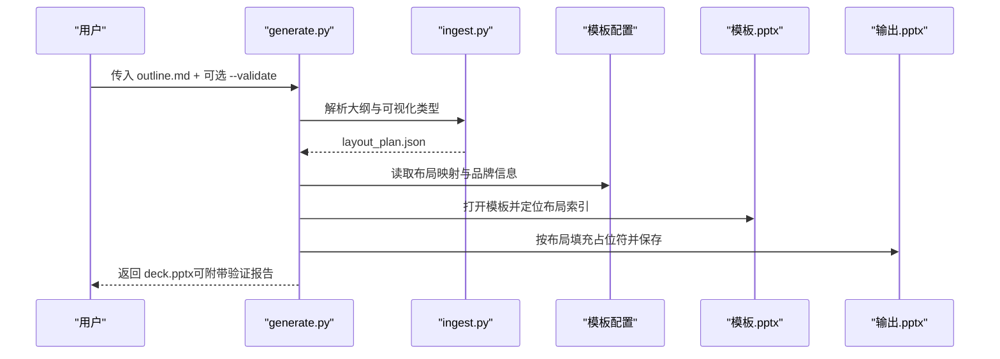
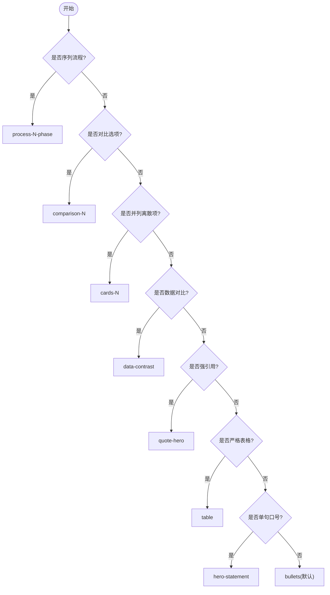
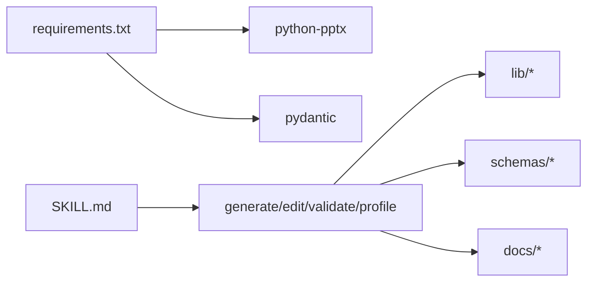

# 基于布局的 PPTX 生成

<cite>
**本文引用的文件**   
- [README.md](file://skills/pptx-from-layouts/README.md)
- [SKILL.md](file://skills/pptx-from-layouts/SKILL.md)
- [architecture.md](file://skills/pptx-from-layouts/docs/architecture.md)
- [visual-types.md](file://skills/pptx-from-layouts/docs/visual-types.md)
- [workflows.md](file://skills/pptx-from-layouts/docs/workflows.md)
- [comparison.md](file://skills/pptx-from-layouts/docs/comparison.md)
- [requirements.txt](file://skills/pptx-from-layouts/requirements.txt)
- [inner-chapter-config.json](file://skills/pptx-from-layouts/templates/inner-chapter-config.json)
- [outline.md](file://skills/pptx-from-layouts/examples/q1-strategy/outline.md)
- [CLAUDE.md](file://skills/pptx-from-layouts/CLAUDE.md)
</cite>

## 目录
1. [引言](#引言)
2. [项目结构](#项目结构)
3. [核心组件](#核心组件)
4. [架构总览](#架构总览)
5. [详细组件分析](#详细组件分析)
6. [依赖关系分析](#依赖关系分析)
7. [性能与可扩展性](#性能与可扩展性)
8. [故障排查指南](#故障排查指南)
9. [结论](#结论)
10. [附录：示例与开发指南](#附录示例与开发指南)

## 引言
本技能提供“基于布局”的演示文稿生成模式：以声明式大纲（Markdown）为输入，通过可视化类型系统选择模板的真实幻灯片母版布局，将内容精准填入占位符，最终输出符合品牌规范的 PPTX。相比常见的“文本覆盖/替换”方案，该模式尊重模板的设计意图，避免破坏背景、水印与装饰元素，从而获得更专业的呈现效果。

## 项目结构
- 顶层说明与快速上手：README、SKILL、CLAUDE
- 文档：架构、可视化类型、工作流、对比分析
- 模板与配置：内置模板及布局映射配置
- 示例：季度策略演示文稿的大纲与产物
- 依赖：python-pptx、pydantic

图表来源 
- [README.md:1-120](file://skills/pptx-from-layouts/README.md#L1-L120)
- [SKILL.md:1-165](file://skills/pptx-from-layouts/SKILL.md#L1-L165)
- [CLAUDE.md:1-134](file://skills/pptx-from-layouts/CLAUDE.md#L1-L134)
- [architecture.md:1-197](file://skills/pptx-from-layouts/docs/architecture.md#L1-L197)
- [visual-types.md:1-106](file://skills/pptx-from-layouts/docs/visual-types.md#L1-L106)
- [workflows.md:1-114](file://skills/pptx-from-layouts/docs/workflows.md#L1-L114)
- [comparison.md:1-149](file://skills/pptx-from-layouts/docs/comparison.md#L1-L149)
- [inner-chapter-config.json:1-135](file://skills/pptx-from-layouts/templates/inner-chapter-config.json#L1-L135)
- [outline.md:1-75](file://skills/pptx-from-layouts/examples/q1-strategy/outline.md#L1-L75)
- [requirements.txt:1-5](file://skills/pptx-from-layouts/requirements.txt#L1-L5)

章节来源
- [README.md:1-120](file://skills/pptx-from-layouts/README.md#L1-L120)
- [SKILL.md:1-165](file://skills/pptx-from-layouts/SKILL.md#L1-L165)
- [CLAUDE.md:1-134](file://skills/pptx-from-layouts/CLAUDE.md#L1-L134)

## 核心组件
- 三步流水线
  - 步骤1·画像（Profile）：对模板进行扫描，产出布局目录与配置映射
  - 步骤2·作者（Author）：依据布局目录编写带可视化类型的 Markdown 大纲
  - 步骤3·渲染（Render）：根据大纲与配置，填充模板真实布局并输出 PPTX
- 可视化类型系统：在大纲中标注如 hero-statement、process-N-phase、table 等，驱动布局选择
- 编辑模式：对已有 PPTX 进行局部文本替换或重排，适用于小改动场景
- 验证与质量检查：结构完整性、内容溢出、可读性与品牌一致性校验

章节来源
- [workflows.md:1-114](file://skills/pptx-from-layouts/docs/workflows.md#L1-L114)
- [README.md:1-120](file://skills/pptx-from-layouts/README.md#L1-L120)
- [SKILL.md:1-165](file://skills/pptx-from-layouts/SKILL.md#L1-L165)

## 架构总览
整体采用“大纲→布局计划→PPTX”的管道化设计，配合模板画像配置完成语义到布局的映射。

图表来源 
- [architecture.md:1-197](file://skills/pptx-from-layouts/docs/architecture.md#L1-L197)
- [CLAUDE.md:1-134](file://skills/pptx-from-layouts/CLAUDE.md#L1-L134)

章节来源
- [architecture.md:1-197](file://skills/pptx-from-layouts/docs/architecture.md#L1-L197)
- [CLAUDE.md:1-134](file://skills/pptx-from-layouts/CLAUDE.md#L1-L134)

## 详细组件分析

### 可视化类型系统与布局契约
- 决策顺序：序列 → 对比 → 并列项 → 数据对比 → 引用 → 表格 → 英雄语句 → 默认项目符号
- 常见类型：process-N-phase、comparison-N、cards-N、data-contrast、quote-hero、timeline-horizontal、table、bullets 等
- 长度限制：不同视觉类型对字符数与行数有约束，超限需拆分或换型
- 布局契约：模板配置文件将“可视化类型/内容路由”映射到具体布局索引与名称

图表来源 
- [visual-types.md:1-106](file://skills/pptx-from-layouts/docs/visual-types.md#L1-L106)

章节来源
- [visual-types.md:1-106](file://skills/pptx-from-layouts/docs/visual-types.md#L1-L106)
- [inner-chapter-config.json:1-135](file://skills/pptx-from-layouts/templates/inner-chapter-config.json#L1-L135)

### 模板画像与配置
- 画像目标：枚举模板母版布局，建立“可视化类型/内容路由 → 布局索引/名称”的映射
- 配置字段：品牌色、字体、布局映射、是否需要品牌页、回退布局等
- 使用方式：首次对模板执行画像，生成 JSON；后续生成时直接引用

章节来源
- [architecture.md:1-197](file://skills/pptx-from-layouts/docs/architecture.md#L1-L197)
- [inner-chapter-config.json:1-135](file://skills/pptx-from-layouts/templates/inner-chapter-config.json#L1-L135)

### 渲染管道与占位符填充
- 输入：layout_plan.json（由大纲解析得到）+ 模板配置 + 模板文件
- 处理：按可视化类型查找布局索引，创建新幻灯片并填充占位符
- 清理：移除模板原始幻灯片，保存输出
- 容错：缺失字体回退、内容溢出拆分、未知类型回退默认

章节来源
- [architecture.md:1-197](file://skills/pptx-from-layouts/docs/architecture.md#L1-L197)

### 编辑模式（轻量修改）
- 适用场景：少量文本替换或重排序（<30% 幻灯片）
- 流程：导出库存 → 编辑段落文本 → 应用替换 → 输出新文件
- 注意：布局变更应重新生成而非编辑

章节来源
- [workflows.md:1-114](file://skills/pptx-from-layouts/docs/workflows.md#L1-L114)
- [SKILL.md:1-165](file://skills/pptx-from-layouts/SKILL.md#L1-L165)

### 验证与质量检查
- 维度：结构有效性、内容放置完整、可读性与间距、品牌一致性
- 触发：生成后可选自动验证，或独立运行验证脚本

章节来源
- [architecture.md:1-197](file://skills/pptx-from-layouts/docs/architecture.md#L1-L197)
- [SKILL.md:1-165](file://skills/pptx-from-layouts/SKILL.md#L1-L165)

## 依赖关系分析
- 运行时依赖：python-pptx（PPTX 读写）、pydantic（数据模型校验）
- 模块职责：scripts 负责入口与编排，lib 提供通用能力，schemas 定义校验模型，rules/references 指导大纲撰写

图表来源 
- [requirements.txt:1-5](file://skills/pptx-from-layouts/requirements.txt#L1-L5)
- [SKILL.md:1-165](file://skills/pptx-from-layouts/SKILL.md#L1-L165)

章节来源
- [requirements.txt:1-5](file://skills/pptx-from-layouts/requirements.txt#L1-L5)
- [SKILL.md:1-165](file://skills/pptx-from-layouts/SKILL.md#L1-L165)

## 性能与可扩展性
- 性能特征
  - 生成阶段主要开销在于模板打开、布局查找与占位符填充
  - 长内容会触发拆分与回退逻辑，可能增加计算量
- 可扩展点
  - 新增可视化类型：在规则与配置中扩展映射
  - 自定义模板：画像后更新配置即可复用
  - 第三方集成：通过子代理（architect/onboarder/QA）解耦职责，便于编排

[本节为通用建议，不直接分析具体文件]

## 故障排查指南
- 常见问题
  - 缺少依赖导致导入失败：确保安装 python-pptx 与 pydantic
  - 模板无文本占位符：改用“基于布局”的方式，避免文本覆盖
  - 内容溢出：缩短文案或更换更大空间的视觉类型
  - 字体缺失：启用回退字体策略
- 诊断手段
  - 使用验证脚本检查结构与内容
  - 使用编辑模式导出库存，定位问题段落
  - 查看布局映射配置是否正确

章节来源
- [architecture.md:1-197](file://skills/pptx-from-layouts/docs/architecture.md#L1-L197)
- [SKILL.md:1-165](file://skills/pptx-from-layouts/SKILL.md#L1-L165)

## 结论
“基于布局”的 PPTX 生成以模板母版为核心，通过可视化类型系统将语义内容映射到真实布局，既保留专业模板的设计意图，又提供稳定的自动化工作流。相较“文本覆盖/替换”方案，它在兼容性、一致性与可维护性上具备显著优势。

[本节为总结性内容，不直接分析具体文件]

## 附录：示例与开发指南

### 示例项目：季度策略演示文稿
- 输入：examples/q1-strategy/outline.md（含可视化类型标注）
- 输出：对应 PPTX（可通过 generate.py 复现）
- 要点：正确使用 hero-statement、cards-3、table、process-3-phase、comparison-2 等类型

章节来源
- [outline.md:1-75](file://skills/pptx-from-layouts/examples/q1-strategy/outline.md#L1-L75)
- [README.md:1-120](file://skills/pptx-from-layouts/README.md#L1-L120)

### 开发指南
- 自定义布局
  - 准备模板 → 运行画像 → 更新 inner-chapter-config.json 中的布局映射
  - 在 rules/visual-types.md 中补充类型说明与长度限制
- 扩展可视化类型
  - 在配置中添加路由映射，并在渲染逻辑中实现占位符填充策略
- 集成第三方工具
  - 通过子代理（architect/onboarder/QA）将大纲生成、模板上线与质量检查解耦
  - 在 CLAUDE.md 中了解仓库结构与命令约定，保持 scripts/lib/schemas 的职责边界清晰

章节来源
- [workflows.md:1-114](file://skills/pptx-from-layouts/docs/workflows.md#L1-L114)
- [CLAUDE.md:1-134](file://skills/pptx-from-layouts/CLAUDE.md#L1-L134)
- [inner-chapter-config.json:1-135](file://skills/pptx-from-layouts/templates/inner-chapter-config.json#L1-L135)

### 与替代方案的比较分析
- 主流替代方案多采用“模板清单/文本替换”路径，遇到无文本占位符的专业模板时易失败
- 本方案以“母版布局”为中心，天然兼容高质量模板，避免覆盖与错位
- 典型对比对象：python-pptx、anthropics-pptx、pptx-jjuidev、elite-powerpoint-designer 等

章节来源
- [comparison.md:1-149](file://skills/pptx-from-layouts/docs/comparison.md#L1-L149)
- [README.md:1-120](file://skills/pptx-from-layouts/README.md#L1-L120)