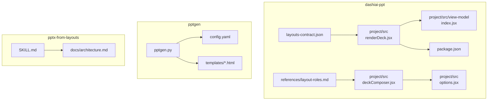
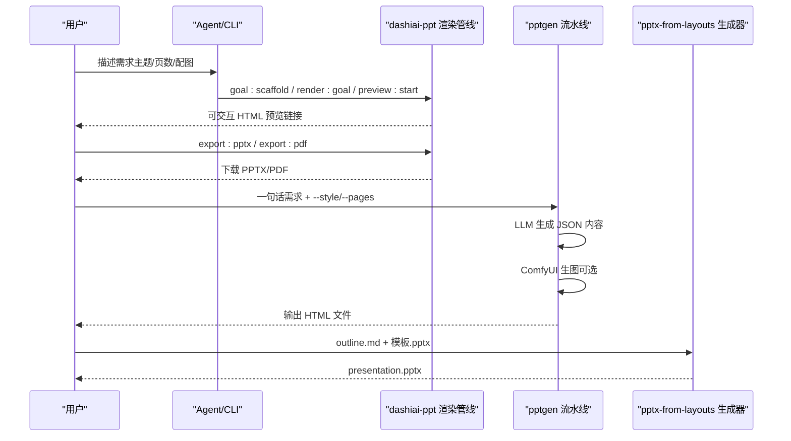
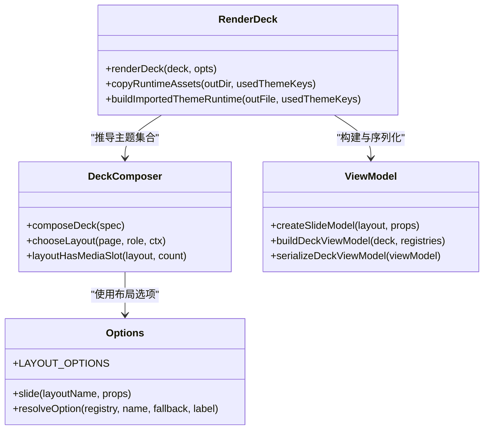
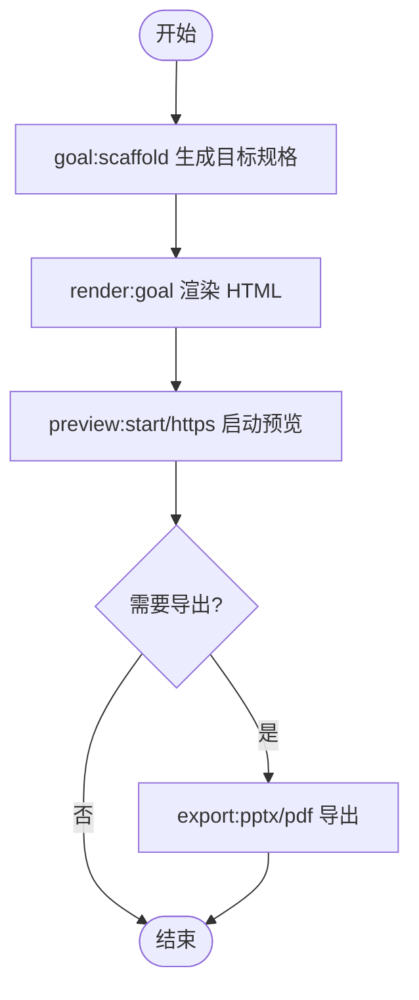
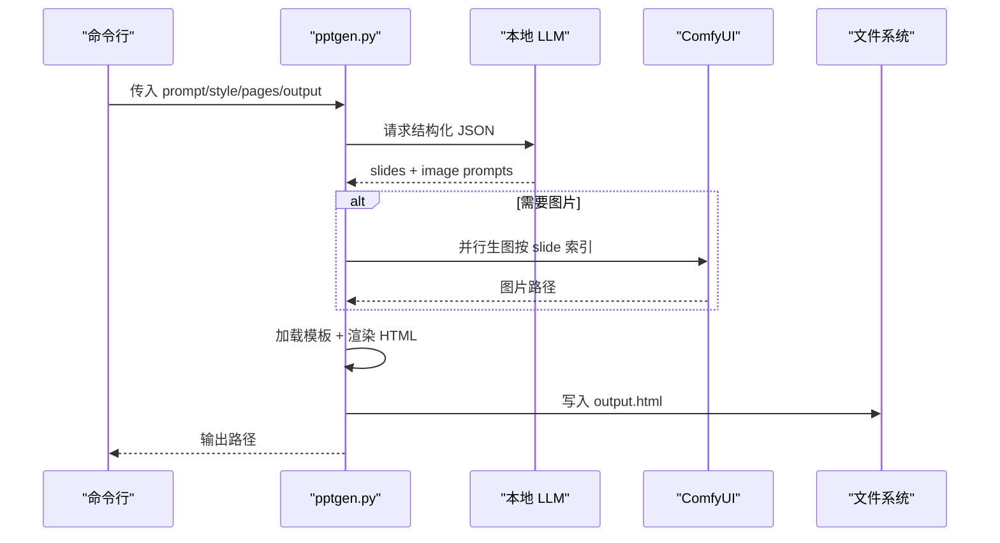
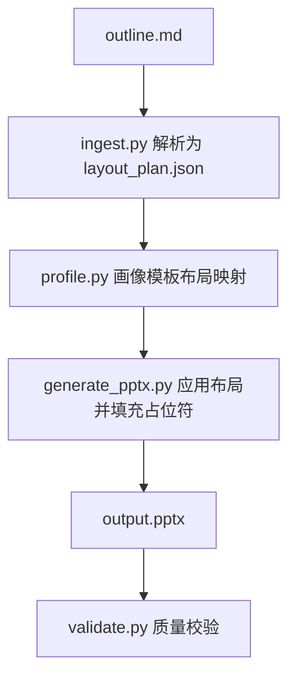
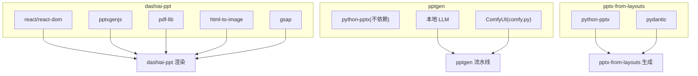

# 演示文稿技能

<cite>
**本文引用的文件**   
- [skills/dashiai-ppt/SKILL.md](file://skills/dashiai-ppt/SKILL.md)
- [skills/dashiai-ppt/README.md](file://skills/dashiai-ppt/README.md)
- [skills/dashiai-ppt/project/package.json](file://skills/dashiai-ppt/project/package.json)
- [skills/dashiai-ppt/layouts-contract.json](file://skills/dashiai-ppt/layouts-contract.json)
- [skills/dashiai-ppt/references/layout-roles.md](file://skills/dashiai-ppt/references/layout-roles.md)
- [skills/dashiai-ppt/project/src/renderDeck.jsx](file://skills/dashiai-ppt/project/src/renderDeck.jsx)
- [skills/dashiai-ppt/project/src/deckComposer.jsx](file://skills/dashiai-ppt/project/src/deckComposer.jsx)
- [skills/dashiai-ppt/project/src/options.jsx](file://skills/dashiai-ppt/project/src/options.jsx)
- [skills/dashiai-ppt/project/src/view-model/index.jsx](file://skills/dashiai-ppt/project/src/view-model/index.jsx)
- [skills/pptgen/SKILL.md](file://skills/pptgen/SKILL.md)
- [skills/pptgen/config.yaml](file://skills/pptgen/config.yaml)
- [skills/pptgen/pptgen.py](file://skills/pptgen/pptgen.py)
- [skills/pptx-from-layouts/SKILL.md](file://skills/pptx-from-layouts/SKILL.md)
- [skills/pptx-from-layouts/docs/architecture.md](file://skills/pptx-from-layouts/docs/architecture.md)
</cite>

## 目录
1. [简介](#简介)
2. [项目结构](#项目结构)
3. [核心组件](#核心组件)
4. [架构总览](#架构总览)
5. [详细组件分析](#详细组件分析)
6. [依赖关系分析](#依赖关系分析)
7. [性能考量](#性能考量)
8. [故障排查指南](#故障排查指南)
9. [结论](#结论)
10. [附录](#附录)

## 简介
本文件系统化梳理“演示文稿技能组”的三大能力：
- dashiai-ppt：本地离线 PPT 生成，12 套视觉风格，HTML 预览后导出 PPTX/PDF。
- pptgen：交互式 HTML 网页（非 PPTX）生成器，内置多套模板，支持本地 LLM + ComfyUI 生图。
- pptx-from-layouts：基于布局的 PPTX 生成技能，使用母版与占位符正确填充内容，避免覆盖式文本替换。

文档涵盖主题系统、布局模板、国际化、模板引擎、样式定制、批量生成、动画效果、图表集成、导出格式、主题开发、协作编辑等，并提供完整的使用案例与开发指南。

## 项目结构
- skills/dashiai-ppt：主技能，包含运行时工程（Node/React）、主题注册表、渲染管线、预览与导出脚本、布局契约与角色说明。
- skills/pptgen：独立 CLI，Python 实现，读取配置调用本地 LLM 与 ComfyUI，按模板渲染 HTML。
- skills/pptx-from-layouts：基于 python-pptx 的 PPTX 生成工具链，提供大纲解析、模板画像、生成与校验脚本。

**图示来源**
- [skills/dashiai-ppt/project/src/renderDeck.jsx:1-373](file://skills/dashiai-ppt/project/src/renderDeck.jsx#L1-L373)
- [skills/dashiai-ppt/project/src/deckComposer.jsx:1-301](file://skills/dashiai-ppt/project/src/deckComposer.jsx#L1-L301)
- [skills/dashiai-ppt/project/src/options.jsx:1-43](file://skills/dashiai-ppt/project/src/options.jsx#L1-L43)
- [skills/dashiai-ppt/project/src/view-model/index.jsx:1-369](file://skills/dashiai-ppt/project/src/view-model/index.jsx#L1-L369)
- [skills/dashiai-ppt/layouts-contract.json:1-800](file://skills/dashiai-ppt/layouts-contract.json#L1-L800)
- [skills/dashiai-ppt/references/layout-roles.md:1-29](file://skills/dashiai-ppt/references/layout-roles.md#L1-L29)
- [skills/dashiai-ppt/project/package.json:1-37](file://skills/dashiai-ppt/project/package.json#L1-L37)
- [skills/pptgen/pptgen.py:1-592](file://skills/pptgen/pptgen.py#L1-L592)
- [skills/pptgen/config.yaml:1-13](file://skills/pptgen/config.yaml#L1-L13)
- [skills/pptx-from-layouts/SKILL.md:1-165](file://skills/pptx-from-layouts/SKILL.md#L1-L165)
- [skills/pptx-from-layouts/docs/architecture.md:1-197](file://skills/pptx-from-layouts/docs/architecture.md#L1-L197)

**章节来源**
- [skills/dashiai-ppt/README.md:1-62](file://skills/dashiai-ppt/README.md#L1-L62)
- [skills/dashiai-ppt/SKILL.md:1-57](file://skills/dashiai-ppt/SKILL.md#L1-L57)
- [skills/pptgen/SKILL.md:1-50](file://skills/pptgen/SKILL.md#L1-L50)
- [skills/pptx-from-layouts/SKILL.md:1-165](file://skills/pptx-from-layouts/SKILL.md#L1-L165)

## 核心组件
- dashiai-ppt 渲染与编排
  - renderDeck.jsx：构建视图模型、注入语言与主题包、复制运行时资产、生成最终 HTML。
  - deckComposer.jsx：根据角色关键词与页面池选择布局，处理媒体槽容量与默认页序列。
  - options.jsx：布局别名、选项解析、slide 工厂函数。
  - view-model/index.jsx：幻灯片模型创建、视图模型序列化、文本状态归一化。
  - layouts-contract.json：每个主题的页面契约（字段、数组、媒体槽、控件、可见数量）。
  - references/layout-roles.md：页面角色定义与用途说明。
  - package.json：脚本入口（goal:scaffold、inspect:layout、props:safe、render:goal、preview:start、export:pptx/pdf 等）。

- pptgen 模板引擎与流水线
  - pptgen.py：命令行入口、LLM 调用、ComfyUI 生图、模板加载与 HTML 渲染、输出写入。
  - config.yaml：LLM 端点、ComfyUI 路径、输出目录。
  - templates/*.html：多套视觉模板（magazine、dark-tech、minimal、gradient 等）。

- pptx-from-layouts 基于布局的 PPTX 生成
  - SKILL.md：命令、大纲格式、视觉类型、排版标记、决策指南与反模式。
  - docs/architecture.md：内部架构、流水线、脚本参考、库结构与错误处理。

**章节来源**
- [skills/dashiai-ppt/project/src/renderDeck.jsx:1-373](file://skills/dashiai-ppt/project/src/renderDeck.jsx#L1-L373)
- [skills/dashiai-ppt/project/src/deckComposer.jsx:1-301](file://skills/dashiai-ppt/project/src/deckComposer.jsx#L1-L301)
- [skills/dashiai-ppt/project/src/options.jsx:1-43](file://skills/dashiai-ppt/project/src/options.jsx#L1-L43)
- [skills/dashiai-ppt/project/src/view-model/index.jsx:1-369](file://skills/dashiai-ppt/project/src/view-model/index.jsx#L1-L369)
- [skills/dashiai-ppt/layouts-contract.json:1-800](file://skills/dashiai-ppt/layouts-contract.json#L1-L800)
- [skills/dashiai-ppt/references/layout-roles.md:1-29](file://skills/dashiai-ppt/references/layout-roles.md#L1-L29)
- [skills/dashiai-ppt/project/package.json:1-37](file://skills/dashiai-ppt/project/package.json#L1-L37)
- [skills/pptgen/pptgen.py:1-592](file://skills/pptgen/pptgen.py#L1-L592)
- [skills/pptgen/config.yaml:1-13](file://skills/pptgen/config.yaml#L1-L13)
- [skills/pptx-from-layouts/SKILL.md:1-165](file://skills/pptx-from-layouts/SKILL.md#L1-L165)
- [skills/pptx-from-layouts/docs/architecture.md:1-197](file://skills/pptx-from-layouts/docs/architecture.md#L1-L197)

## 架构总览
整体流程分为三条主线：
- dashiai-ppt：目标规格 → 视图模型 → React 静态渲染 → 注入运行时与主题 → 导出 PPTX/PDF。
- pptgen：一句话需求 → LLM 结构化 JSON → ComfyUI 生图 → 模板渲染 → HTML 输出。
- pptx-from-layouts：Markdown 大纲 → 布局计划 → 模板画像 → 基于占位符生成 PPTX。

**图示来源**
- [skills/dashiai-ppt/project/package.json:1-37](file://skills/dashiai-ppt/project/package.json#L1-L37)
- [skills/dashiai-ppt/project/src/renderDeck.jsx:1-373](file://skills/dashiai-ppt/project/src/renderDeck.jsx#L1-L373)
- [skills/pptgen/pptgen.py:1-592](file://skills/pptgen/pptgen.py#L1-L592)
- [skills/pptx-from-layouts/SKILL.md:1-165](file://skills/pptx-from-layouts/SKILL.md#L1-L165)

## 详细组件分析

### dashiai-ppt 渲染与主题系统
- 视图模型与序列化
  - createSlideModel/buildDeckViewModel/serializeDeckViewModel 负责将输入 deck 转换为可渲染的视图模型，并序列化用于持久化与预览。
- 布局选择与角色映射
  - deckComposer 通过 ROLE_KEYWORDS 与 THEME_ROLE_LAYOUT_POOLS 将语义角色映射到具体 layout key，考虑媒体槽容量与已用布局去重。
- 主题与运行时打包
  - renderDeck 收集实际使用的主题键，按需拷贝 vendor 资源与主题源资产，构建导入主题运行时（支持预构建或源码模式），注入 i18n 字典与预览选项。
- 布局契约与字段控制
  - layouts-contract.json 定义每页 slot、copyKeys、fieldContracts、fillPlan、mediaSlots、controls、countBindings 等，确保数据与 UI 强约束一致。
- 国际化
  - 通过 normalizeDeckLanguage 与 buildDeckI18nDict 注入语言与词典子集，支持 zh-CN/en 切换。

**图示来源**
- [skills/dashiai-ppt/project/src/deckComposer.jsx:1-301](file://skills/dashiai-ppt/project/src/deckComposer.jsx#L1-L301)
- [skills/dashiai-ppt/project/src/view-model/index.jsx:1-369](file://skills/dashiai-ppt/project/src/view-model/index.jsx#L1-L369)
- [skills/dashiai-ppt/project/src/renderDeck.jsx:1-373](file://skills/dashiai-ppt/project/src/renderDeck.jsx#L1-L373)
- [skills/dashiai-ppt/project/src/options.jsx:1-43](file://skills/dashiai-ppt/project/src/options.jsx#L1-L43)

**章节来源**
- [skills/dashiai-ppt/project/src/renderDeck.jsx:1-373](file://skills/dashiai-ppt/project/src/renderDeck.jsx#L1-L373)
- [skills/dashiai-ppt/project/src/deckComposer.jsx:1-301](file://skills/dashiai-ppt/project/src/deckComposer.jsx#L1-L301)
- [skills/dashiai-ppt/project/src/options.jsx:1-43](file://skills/dashiai-ppt/project/src/options.jsx#L1-L43)
- [skills/dashiai-ppt/project/src/view-model/index.jsx:1-369](file://skills/dashiai-ppt/project/src/view-model/index.jsx#L1-L369)
- [skills/dashiai-ppt/layouts-contract.json:1-800](file://skills/dashiai-ppt/layouts-contract.json#L1-L800)
- [skills/dashiai-ppt/references/layout-roles.md:1-29](file://skills/dashiai-ppt/references/layout-roles.md#L1-L29)

### dashiai-ppt 自动化流程与导出
- 脚本入口
  - package.json 定义了 goal:scaffold、inspect:layout、props:safe、render:goal、preview:start、export:pptx/pdf 等脚本，驱动从目标到预览再到导出的全链路。
- 预览与导出
  - preview:start/https 启动本地服务器；export:pptx/pdf 调用 pptxgenjs/pdf-lib 进行导出。
- 主题运行时
  - 根据实际使用的主题键构建运行时，支持 auto/prebuilt/source 三种模式，保证交付件最小化且可运行。

**图示来源**
- [skills/dashiai-ppt/project/package.json:1-37](file://skills/dashiai-ppt/project/package.json#L1-L37)
- [skills/dashiai-ppt/project/src/renderDeck.jsx:1-373](file://skills/dashiai-ppt/project/src/renderDeck.jsx#L1-L373)

**章节来源**
- [skills/dashiai-ppt/project/package.json:1-37](file://skills/dashiai-ppt/project/package.json#L1-L37)
- [skills/dashiai-ppt/SKILL.md:1-57](file://skills/dashiai-ppt/SKILL.md#L1-L57)

### pptgen 模板引擎与批量生成
- 流水线步骤
  - 调用本地 LLM 生成结构化 JSON（标题、副标题、作者、日期、slides 数组、image 提示词与风格推荐）。
  - 可选调用 ComfyUI 生图，支持多种风格（krea2/ernie/klein/zimage）与尺寸策略。
  - 加载模板（magazine/dark-tech/minimal/gradient 等），替换占位符，注入钻取面板 CSS，输出 HTML。
- 参数与配置
  - 命令行参数支持 style/pages/output/no-image/no-llm/cache/config。
  - config.yaml 配置 LLM 端点、ComfyUI 脚本路径与输出目录。
- 批量与缓存
  - 支持从 cache JSON 直接渲染，便于批量处理与重复生成。

**图示来源**
- [skills/pptgen/pptgen.py:1-592](file://skills/pptgen/pptgen.py#L1-L592)
- [skills/pptgen/config.yaml:1-13](file://skills/pptgen/config.yaml#L1-L13)

**章节来源**
- [skills/pptgen/SKILL.md:1-50](file://skills/pptgen/SKILL.md#L1-L50)
- [skills/pptgen/pptgen.py:1-592](file://skills/pptgen/pptgen.py#L1-L592)
- [skills/pptgen/config.yaml:1-13](file://skills/pptgen/config.yaml#L1-L13)

### pptx-from-layouts 基于布局的 PPTX 生成
- 核心理念
  - 使用 PowerPoint 母版与占位符，而非在 Slide 层覆盖文本框，保持专业设计一致性。
- 流水线
  - outline.md → ingest.py → layout_plan.json → generate_pptx.py → output.pptx。
  - 模板画像 profile.py 生成 visual type → layout index 映射。
- 编辑与校验
  - edit.py 支持替换文本、重排幻灯片；validate.py 进行质量校验。
- 视觉类型与排版标记
  - hero-statement/process-N-phase/comparison-N/cards-N/data-contrast/quote-hero/timeline-horizontal/table/bullets 等；支持内联与段落格式化标记。

**图示来源**
- [skills/pptx-from-layouts/docs/architecture.md:1-197](file://skills/pptx-from-layouts/docs/architecture.md#L1-L197)
- [skills/pptx-from-layouts/SKILL.md:1-165](file://skills/pptx-from-layouts/SKILL.md#L1-L165)

**章节来源**
- [skills/pptx-from-layouts/SKILL.md:1-165](file://skills/pptx-from-layouts/SKILL.md#L1-L165)
- [skills/pptx-from-layouts/docs/architecture.md:1-197](file://skills/pptx-from-layouts/docs/architecture.md#L1-L197)

## 依赖关系分析
- dashiai-ppt
  - 运行时依赖：gsap、html-to-image、pptxgenjs、react/react-dom。
  - 开发依赖：tsx、esbuild、pngjs、playwright-core、pdf-lib。
  - 脚本依赖：node/npm，首次生成自动准备依赖。
- pptgen
  - Python 环境，可选 yaml 解析（无则回退正则解析）。
  - 外部依赖：本地 LLM 服务、ComfyUI（comfy.py）。
- pptx-from-layouts
  - python-pptx>=0.6.21、pydantic>=2.0。

**图示来源**
- [skills/dashiai-ppt/project/package.json:1-37](file://skills/dashiai-ppt/project/package.json#L1-L37)
- [skills/pptgen/pptgen.py:1-592](file://skills/pptgen/pptgen.py#L1-L592)
- [skills/pptx-from-layouts/requirements.txt:1-5](file://skills/pptx-from-layouts/requirements.txt#L1-L5)

**章节来源**
- [skills/dashiai-ppt/project/package.json:1-37](file://skills/dashiai-ppt/project/package.json#L1-L37)
- [skills/pptgen/pptgen.py:1-592](file://skills/pptgen/pptgen.py#L1-L592)
- [skills/pptx-from-layouts/requirements.txt:1-5](file://skills/pptx-from-layouts/requirements.txt#L1-L5)

## 性能考量
- 主题运行时裁剪
  - 仅拷贝实际使用的主题资产与运行时，减少交付体积与泄露风险。
- 并行生图
  - pptgen 对需要图片的 slide 并行调用 ComfyUI，提升生成速度。
- 静态渲染与资源复制
  - renderDeck 使用 React 服务端渲染，避免客户端开销；vendor 资源一次性复制，避免重复 IO。
- 模板选择与降级
  - 未知风格回退至 magazine，保障鲁棒性。

[本节为通用指导，无需特定文件引用]

## 故障排查指南
- dashiai-ppt
  - 预览不可用（Windows）：使用 preview:https 脚本或回退到 Python HTTP 服务器。
  - 导出失败：检查 node_modules 中 pptxgenjs/pdf-lib/html-to-image 是否缺失。
  - 主题运行时缺失：确认 DASHI_PPT_THEME_RUNTIME 环境变量与预构建产物可用性。
- pptgen
  - LLM 未配置：设置 LLM_ENDPOINT/LLM_MODEL 或修改 config.yaml。
  - ComfyUI 超时或失败：检查 comfy.py 路径与输出目录权限。
  - 模板不存在：回退到 magazine，确保 templates 目录存在。
- pptx-from-layouts
  - 模板画像失败：重新执行 profile.py 生成映射配置。
  - 内容溢出：使用 content_splitter/content_recovery 逻辑拆分或恢复。
  - 字体缺失：font_fallback 模块自动回退相似字体。

**章节来源**
- [skills/dashiai-ppt/SKILL.md:1-57](file://skills/dashiai-ppt/SKILL.md#L1-L57)
- [skills/pptgen/pptgen.py:1-592](file://skills/pptgen/pptgen.py#L1-L592)
- [skills/pptx-from-layouts/docs/architecture.md:1-197](file://skills/pptx-from-layouts/docs/architecture.md#L1-L197)

## 结论
演示文稿技能组提供了从内容生成、视觉呈现到导出的完整闭环：
- dashiai-ppt 以主题与布局契约为核心，结合 React 渲染与运行时裁剪，实现高质量、可编辑、可导出的本地 PPT 工作流。
- pptgen 以 CLI 与模板引擎为主，打通 LLM 与 ComfyUI，快速产出交互式 HTML 演示。
- pptx-from-layouts 强调基于母版与占位符的专业级 PPTX 生成，适合企业模板与团队协作。

三者互补，覆盖不同场景与交付形态，满足从创意展示到正式汇报的全链路需求。

[本节为总结性内容，无需特定文件引用]

## 附录
- 使用案例
  - 行业研究/融资复盘：dashiai-ppt 选择 theme05/06/10，导出 PPTX/PDF。
  - 技术汇报：pptgen 使用 dark-tech 模板，配合 ComfyUI 生成技术插图。
  - 企业模板：pptx-from-layouts 使用 inner-chapter.pptx，基于大纲生成标准 PPTX。
- 开发指南
  - 新增主题：在 dashiai-ppt 的 themes 目录下添加 metadata.js/overrides.js 与 source 资源，更新 registry。
  - 新增模板：在 pptgen/templates 下新增 HTML 模板，并在 STYLES 列表中添加名称。
  - 新增布局：在 layouts-contract.json 中扩展 fieldContracts/mediaSlots/controls，确保契约与 UI 一致。

[本节为补充信息，无需特定文件引用]