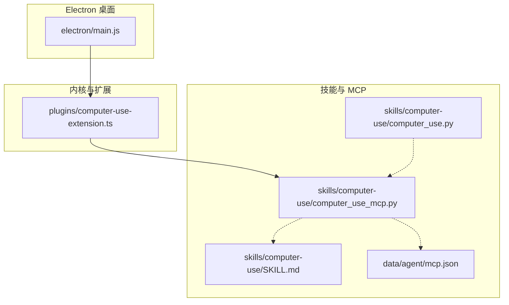
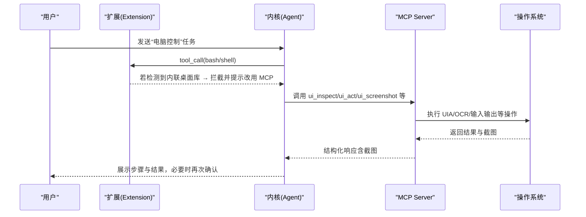
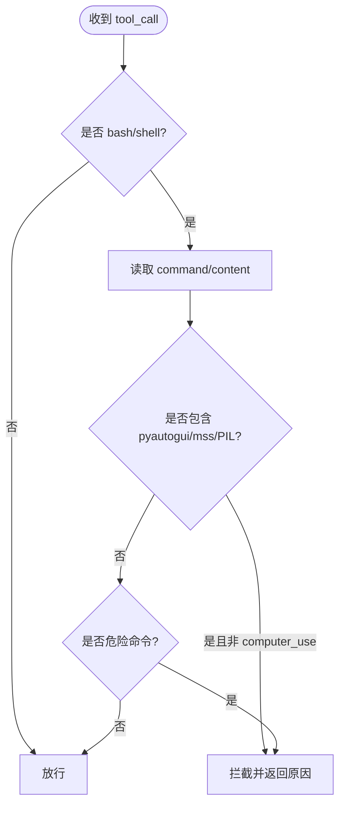
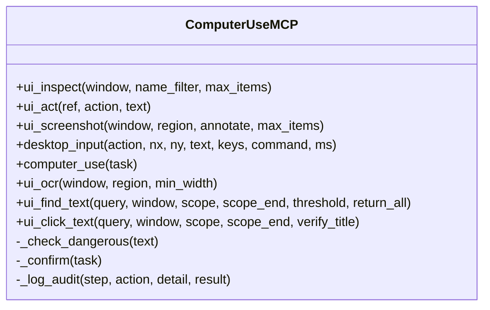
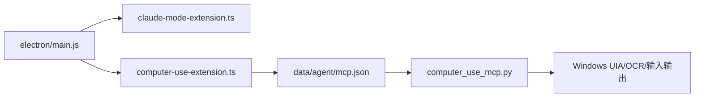

# 计算机使用技能

<cite>
**本文引用的文件**   
- [README.md](file://README.md)
- [AGENTS.md](file://AGENTS.md)
- [开发文档.md](file://开发文档.md)
- [plugins/computer-use-extension.ts](file://plugins\computer-use-extension.ts)
- [skills/computer-use/SKILL.md](file://skills\computer-use\Skill.md)
- [skills/computer-use/computer_use.py](file://skills\computer-use\computer_use.py)
- [skills/computer-use/computer_use_mcp.py](file://skills\computer-use\computer_use_mcp.py)
- [data/agent/mcp.json](file://data\agent\mcp.json)
- [electron/main.js](file://electron\main.js)
- [start-tiffa.bat](file://start-tiffa.bat)
- [install.bat](file://install.bat)
</cite>

## 目录
1. [简介](#简介)
2. [项目结构](#项目结构)
3. [核心组件](#核心组件)
4. [架构总览](#架构总览)
5. [详细组件分析](#详细组件分析)
6. [依赖关系分析](#依赖关系分析)
7. [性能与稳定性考量](#性能与稳定性考量)
8. [故障排查指南](#故障排查指南)
9. [结论](#结论)
10. [附录：快速上手与命令速查](#附录快速上手与命令速查)

## 简介
本文件聚焦“计算机使用技能”（Computer Use）在 Tiffa 中的实现与使用方式。该技能通过 MCP（Model Context Protocol）暴露一组原子化桌面控制工具，结合扩展注入的系统提示词与安全拦截机制，使模型能够安全、可控地操作 Windows 桌面。整体方案强调 UIA 优先、四级降级链、截图回传验证与强制用户确认，确保弱模型也能稳定完成自动化任务。

## 项目结构
围绕 Computer Use 的关键目录与文件如下：
- 插件与扩展
  - plugins/computer-use-extension.ts：扩展加载、tool_call 拦截、before_agent_start 注入系统提示词
- 技能说明
  - skills/computer-use/SKILL.md：技能定义、工作流、安全规则、工具清单
- MCP 服务与脚本
  - skills/computer-use/computer_use_mcp.py：MCP Server，暴露 8 个原子工具
  - skills/computer-use/computer_use.py：独立运行脚本（v1 风格），用于演示或离线场景
  - data/agent/mcp.json：MCP 服务器注册配置（stdio 模式）
- 前端与启动
  - electron/main.js：主进程管理实例、注入扩展路径、环境变量
  - start-tiffa.bat / install.bat：启动与安装引导

图表来源
- [electron/main.js:1-200](file://electron\main.js#L1-L200)
- [plugins/computer-use-extension.ts:1-100](file://plugins\computer-use-extension.ts#L1-L100)
- [skills/computer-use/SKILL.md:1-170](file://skills\computer-use\Skill.md#L1-L170)
- [skills/computer-use/computer_use_mcp.py:1-200](file://skills\computer-use\computer_use_mcp.py#L1-L200)
- [skills/computer-use/computer_use.py:1-120](file://skills\computer-use\computer_use.py#L1-L120)
- [data/agent/mcp.json:1-15](file://data\agent\mcp.json#L1-L15)

章节来源
- [README.md:1-236](file://README.md#L1-L236)
- [AGENTS.md:1-319](file://AGENTS.md#L1-L319)
- [开发文档.md:1-198](file://开发文档.md#L1-L198)

## 核心组件
- 电脑控制扩展（TypeScript）
  - 监听 tool_call 事件，拦截 bash/shell 中内联 pyautogui/mss/PIL 的桌面操控代码，强制走 MCP 工具集
  - 在 before_agent_start 注入“电脑控制工具 v2”使用说明，规范工作流与安全策略
- MCP 服务器（Python）
  - 暴露 8 个原子工具：ui_inspect、ui_act、ui_screenshot、desktop_input、computer_use、ui_ocr、ui_find_text、ui_click_text
  - 内置危险命令与关键词拦截、Windows 二次确认、ESC 中断、审计日志
- 技能文档（SKILL.md）
  - 明确铁律、安全流程、禁止操作、标准工作流与四级降级链
- 独立运行脚本（Python）
  - 提供 run/screenshot/version 子命令，便于调试与离线演示
- Electron 主进程
  - 启动时注入扩展路径与环境变量，确保 MCP 可用、编码统一、路径正确

章节来源
- [plugins/computer-use-extension.ts:1-100](file://plugins\computer-use-extension.ts#L1-L100)
- [skills/computer-use/computer_use_mcp.py:1-200](file://skills\computer-use\computer_use_mcp.py#L1-L200)
- [skills/computer-use/SKILL.md:1-170](file://skills\computer-use\Skill.md#L1-L170)
- [skills/computer-use/computer_use.py:1-120](file://skills\computer-use\computer_use.py#L1-L120)
- [electron/main.js:1-200](file://electron\main.js#L1-L200)

## 架构总览
Computer Use 的工作流由“扩展 + MCP + 技能文档”共同驱动，遵循“UIA 优先、截图验证、用户确认”的安全原则。

图表来源
- [plugins/computer-use-extension.ts:24-59](file://plugins\computer-use-extension.ts#L24-L59)
- [skills/computer-use/computer_use_mcp.py:150-220](file://skills\computer-use\computer_use_mcp.py#L150-L220)
- [skills/computer-use/SKILL.md:10-90](file://skills\computer-use\Skill.md#L10-L90)

## 详细组件分析

### 电脑控制扩展（TypeScript）
- 职责
  - 拦截 bash/shell 中内联 pyautogui/mss/PIL 的桌面操控代码，阻止直接写脚本
  - 在会话开始前注入“电脑控制工具 v2”的使用说明，规范工作流
- 关键行为
  - tool_call 拦截：匹配 pyautogui/mss/PIL 关键字，非 computer_use 则 block
  - dangerous 命令拦截：格式化、关机、注册表、杀系统进程等
  - before_agent_start 注入：将工具用法与工作流写入 systemPrompt

图表来源
- [plugins/computer-use-extension.ts:28-59](file://plugins\computer-use-extension.ts#L28-L59)
- [plugins/computer-use-extension.ts:62-96](file://plugins\computer-use-extension.ts#L62-L96)

章节来源
- [plugins/computer-use-extension.ts:1-100](file://plugins\computer-use-extension.ts#L1-L100)

### MCP 服务器（Python）
- 职责
  - 暴露 8 个原子工具，支持 UIA Pattern 直调、精确坐标点击、SoM 标注截图、归一化坐标兜底、OCR 文本识别与定位
  - 内置安全拦截、二次确认、审计日志、超时与 ESC 中断
- 工具概览
  - ui_inspect：枚举控件，返回编号+名称+坐标+可用操作
  - ui_act：按编号/名称执行操作，自动附带截图回传
  - ui_screenshot：全屏或窗口截图，可选 SoM 标注
  - desktop_input：归一化坐标兜底（click/type/key/launch/scroll/wait）
  - computer_use：简单任务快捷入口
  - ui_ocr：窗口/区域 OCR 文字识别
  - ui_find_text：OCR 模糊匹配定位
  - ui_click_text：OCR 找字并点击，支持 verify_title 校验
- 安全机制
  - FORBIDDEN/DANGEROUS 列表拦截
  - MessageBox 二次确认（可 --force 跳过）
  - ESC 全局中断、Failsafe 保护

图表来源
- [skills/computer-use/computer_use_mcp.py:150-220](file://skills\computer-use\computer_use_mcp.py#L150-L220)
- [skills/computer-use/computer_use_mcp.py:320-360](file://skills\computer-use\computer_use_mcp.py#L320-L360)

章节来源
- [skills/computer-use/computer_use_mcp.py:1-200](file://skills\computer-use\computer_use_mcp.py#L1-L200)

### 技能文档（SKILL.md）
- 内容要点
  - 铁律：禁止在 bash 中内联 Python 操控桌面，必须走 MCP 工具集
  - 安全流程：ask 确认 → 展示计划 → 用户确认 → 执行 → 截图验证
  - 禁止操作：格式化、关机重启、注册表、杀系统进程等
  - 标准工作流：inspect → act → screenshot → verify
  - 四级降级链：UIA Pattern → UIA 坐标 → SoM 编号 → 归一化坐标 → OCR 兜底

章节来源
- [skills/computer-use/SKILL.md:1-170](file://skills\computer-use\Skill.md#L1-L170)

### 独立运行脚本（Python）
- 功能
  - run：完整任务循环（截屏→LLM→解析工具调用→执行→验证）
  - screenshot：单次截图保存
  - version：版本信息
- 安全与体验
  - 危险命令与关键词拦截
  - Windows MessageBox 二次确认（--force 跳过）
  - ESC 中断、Failsafe、超时控制、审计日志

章节来源
- [skills/computer-use/computer_use.py:1-120](file://skills\computer-use\computer_use.py#L1-L120)
- [skills/computer-use/computer_use.py:513-629](file://skills\computer-use\computer_use.py#L513-L629)

### Electron 主进程集成
- 启动参数
  - 注入扩展路径：claude-mode-extension.ts 与 computer-use-extension.ts
  - 设置环境变量：PI_CODING_AGENT_DIR、HOME、MNEMOPI_EMBEDDING_MODEL、PATH 等
- 多实例管理
  - 最大实例数、LRU 淘汰、崩溃自动重启、stall 检测

章节来源
- [electron/main.js:1-200](file://electron\main.js#L1-L200)

## 依赖关系分析
- 运行时依赖
  - Bun 作为内核运行时，Node/Python 环境前置到 PATH
  - MCP Server 通过 stdio 与内核通信
- 配置依赖
  - mcp.json 声明 MCP 服务器命令与参数
  - AGENTS.md/README.md/开发文档.md 描述启动方式与环境变量

图表来源
- [electron/main.js:1-200](file://electron\main.js#L1-L200)
- [data/agent/mcp.json:1-15](file://data\agent\mcp.json#L1-L15)
- [skills/computer-use/computer_use_mcp.py:1-200](file://skills\computer-use\computer_use_mcp.py#L1-L200)

章节来源
- [AGENTS.md:1-319](file://AGENTS.md#L1-L319)
- [开发文档.md:1-198](file://开发文档.md#L1-L198)

## 性能与稳定性考量
- 视觉与定位
  - 截图统一缩放至 1280px 宽，减少 4K 外推误差
  - UIA 优先避免视觉模型偏差，提升速度与精度
- 资源与上下文
  - 每次操作后附带截图回传，避免重复思考；限制标注数量与 token 上限
- 稳定性
  - 多实例 LRU 淘汰与崩溃自动重启
  - stall 检测与强制终止，防止卡死
- 安全与用户体验
  - 二次确认与 ESC 中断，保障用户控制权

[本节为通用指导，不直接分析具体文件]

## 故障排查指南
- 常见问题
  - MCP 未启动：检查 mcp.json 命令路径与 Python 环境
  - 中文乱码：确认环境变量 PYTHONIOENCODING、PYTHONUTF8、LANG 等设置为 UTF-8
  - 权限不足：以管理员权限运行或调整目标应用权限
  - 无法识别控件：尝试 SoM 标注或 OCR 定位
- 诊断步骤
  - 查看 computer-use.log 与审计日志
  - 使用 standalone 脚本进行单步测试（run/screenshot）
  - 通过 Electron 主进程日志观察实例状态与事件

章节来源
- [skills/computer-use/computer_use_mcp.py:88-102](file://skills\computer-use\computer_use_mcp.py#L88-L102)
- [skills/computer-use/computer_use.py:210-222](file://skills\computer-use\computer_use.py#L210-L222)
- [electron/main.js:120-140](file://electron\main.js#L120-L140)

## 结论
Computer Use 技能通过“扩展拦截 + MCP 原子工具 + 技能文档约束”的组合，实现了安全、可控、可验证的桌面自动化。其 UIA 优先与四级降级链兼顾了准确性与鲁棒性，配合二次确认与审计日志，适合在弱模型环境下稳定落地。建议在实际使用中严格遵循 SKILL.md 的安全流程，并结合 Electron 主进程的多实例管理与日志系统进行运维。

[本节为总结性内容，不直接分析具体文件]

## 附录：快速上手与命令速查
- 启动方式
  - 双击 tiffa-desktop.exe 或运行 start-desktop.bat
  - 终端模式：start-tiffa.bat --tui/--web/--rpc
- 安装与初始化
  - 运行 install.bat 进入安装向导
- 常用命令（standalone 脚本）
  - python computer_use.py run "打开记事本输入你好"
  - python computer_use.py screenshot --output ss.png
  - python computer_use.py version

章节来源
- [start-tiffa.bat:1-154](file://start-tiffa.bat#L1-L154)
- [install.bat:1-11](file://install.bat#L1-L11)
- [skills/computer-use/computer_use.py:595-629](file://skills\computer-use\computer_use.py#L595-L629)