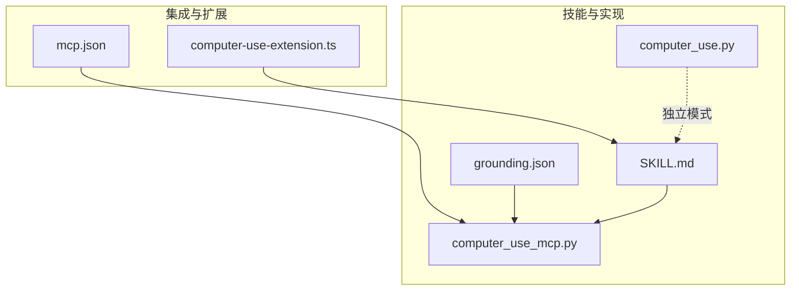
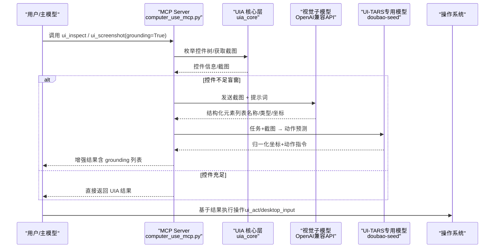
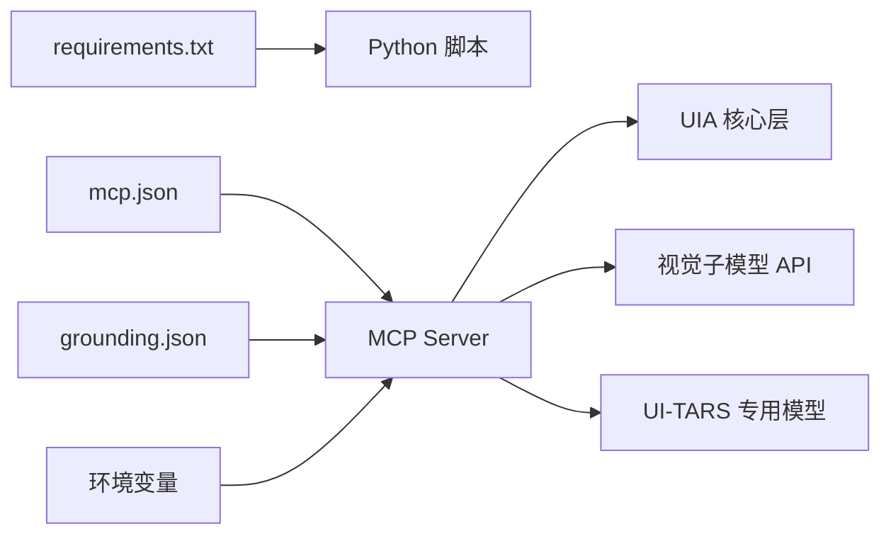

# 视觉定位配置

<cite>
**本文引用的文件**   
- [skills/computer-use/SKILL.md](file://skills/computer-use/SKILL.md)
- [skills/computer-use/computer_use_mcp.py](file://skills/computer-use/computer_use_mcp.py)
- [skills/computer-use/grounding.json](file://skills/computer-use/grounding.json)
- [data/agent/mcp.json](file://data/agent/mcp.json)
- [plugins/computer-use-extension.ts](file://plugins/computer-use-extension.ts)
- [skills/computer-use/computer_use.py](file://skills/computer-use/computer_use.py)
</cite>

## 更新摘要
**所做更改**   
- 新增 UI-TARS 专用定位模型配置和使用说明
- 更新 grounding.json 配置以反映新的视觉模型设置
- 增强配置加载机制，支持从配置文件自动解析模型参数
- 扩展 MCP 工具集，新增 ui_tars 工具用于语义化视觉定位
- 更新五阶段降级链，包含新的视觉定位能力

## 目录
1. [简介](#简介)
2. [项目结构](#项目结构)
3. [核心组件](#核心组件)
4. [架构总览](#架构总览)
5. [详细组件分析](#详细组件分析)
6. [依赖关系分析](#依赖关系分析)
7. [性能与稳定性](#性能与稳定性)
8. [故障排查指南](#故障排查指南)
9. [结论](#结论)
10. [附录：配置清单与环境变量](#附录配置清单与环境变量)

## 简介
本文件聚焦"视觉定位配置"，即 Tiffa 在桌面自动化场景中的视觉识别与元素定位能力，特别是 Visual Grounding（视觉子模型）和 UI-TARS（专用定位模型）的启用、参数与行为。该能力用于在 UIA 控件树不可用或信息不足时，通过轻量视觉模型对截图进行分析，返回结构化元素列表（名称、类型、坐标），从而辅助主模型进行点击、输入等操作。

## 项目结构
与视觉定位相关的代码与配置主要分布在以下位置：
- skills/computer-use：技能定义、MCP 服务器实现、可选 grounding 配置文件
- data/agent/mcp.json：MCP 服务注册与启动参数
- plugins/computer-use-extension.ts：扩展注入工具说明与工作流约束
- skills/computer-use/computer_use.py：便携版 Agent（独立运行模式，非 MCP）

**图表来源**
- [skills/computer-use/SKILL.md](file://skills/computer-use/SKILL.md)
- [skills/computer-use/computer_use_mcp.py](file://skills/computer-use/computer_use_mcp.py)
- [skills/computer-use/grounding.json](file://skills/computer-use/grounding.json)
- [data/agent/mcp.json](file://data/agent/mcp.json)
- [plugins/computer-use-extension.ts](file://plugins/computer-use-extension.ts)
- [skills/computer-use/computer_use.py](file://skills/computer-use/computer_use.py)

**章节来源**
- [skills/computer-use/SKILL.md](file://skills/computer-use/SKILL.md)
- [skills/computer-use/computer_use_mcp.py](file://skills/computer-use/computer_use_mcp.py)
- [skills/computer-use/grounding.json](file://skills/computer-use/grounding.json)
- [data/agent/mcp.json](file://data/agent/mcp.json)
- [plugins/computer-use-extension.ts](file://plugins/computer-use-extension.ts)
- [skills/computer-use/computer_use.py](file://skills/computer-use/computer_use.py)

## 核心组件
- 技能文档（SKILL.md）：定义五级降级链与 Visual Grounding 的行为规则、触发条件与输出格式。
- MCP 服务器（computer_use_mcp.py）：实现原子工具集与 Visual Grounding 调用逻辑，包含配置加载优先级与盲窗判定阈值。
- grounding.json：可选的本地配置，指定 role、enabled、api_base、model、api_key 等。
- mcp.json：注册 MCP 服务，指定 Python 解释器与脚本路径。
- 扩展（computer-use-extension.ts）：向主模型注入工具使用说明与工作流约束。
- 便携 Agent（computer_use.py）：独立运行的桌面自动化 Agent（不依赖 MCP）。

**章节来源**
- [skills/computer-use/SKILL.md](file://skills/computer-use/SKILL.md)
- [skills/computer-use/computer_use_mcp.py](file://skills/computer-use/computer_use_mcp.py)
- [skills/computer-use/grounding.json](file://skills/computer-use/grounding.json)
- [data/agent/mcp.json](file://data/agent/mcp.json)
- [plugins/computer-use-extension.ts](file://plugins/computer-use-extension.ts)
- [skills/computer-use/computer_use.py](file://skills/computer-use/computer_use.py)

## 架构总览
Visual Grounding 作为"兜底增强"嵌入到 MCP 服务器的工具调用流程中，当 UIA 无法提供足够控件信息时自动触发，将截图交给轻量 VLM 分析，返回结构化元素列表供主模型使用。新增的 UI-TARS 专用定位模型提供更精确的语义化定位能力。

**图表来源**
- [skills/computer-use/computer_use_mcp.py](file://skills/computer-use/computer_use_mcp.py)
- [skills/computer-use/SKILL.md](file://skills/computer-use/SKILL.md)

## 详细组件分析

### Visual Grounding 配置加载与优先级
- 配置来源优先级：环境变量 > grounding.json 直写值 > role 联动解析值（从 config.yml 的 modelRoles 与 models.yml 的 providers 解析）。
- 关键变量：
  - GROUNDING_API_BASE：OpenAI 兼容 API 地址
  - GROUNDING_MODEL：模型名（默认 xiaomi/mimo-v2-flash）
  - GROUNDING_API_KEY：API Key（本地 llama.cpp 可留空）
  - GROUNDING_ENABLED：开关（"1" 启用；未配置时若存在 API_BASE 则默认启用）
- 盲窗阈值：BLIND_THRESHOLD = 5（UIA 返回有名称元素 < 5 个时触发 grounding）

**更新** 新增了从配置文件自动解析模型参数的功能，支持通过 role 字段关联 config.yml 和 models.yml 中的模型配置。

**章节来源**
- [skills/computer-use/computer_use_mcp.py:160-197](file://skills/computer-use/computer_use_mcp.py#L160-L197)
- [skills/computer-use/grounding.json](file://skills/computer-use/grounding.json)

### UI-TARS 专用定位模型
- 专用视觉模型：使用 doubao-seed-2-1-turbo-260628 模型进行语义化定位
- 功能特点：给定截图+任务直接输出"该点哪里"的坐标（0~1000 归一化）
- 适用场景：区分语义相近的元素（如微信搜索里的真群聊 vs 历史/网页链接）
- 工作流程：截图 → UI-TARS 分析 → 解析动作 → 执行点击/输入

**新增** UI-TARS 是专用的定位模型，比通用视觉模型更适合处理复杂的界面语义理解任务。

**章节来源**
- [skills/computer-use/computer_use_mcp.py:290-402](file://skills/computer-use/computer_use_mcp.py#L290-L402)
- [skills/computer-use/grounding.json:2-4](file://skills/computer-use/grounding.json#L2-L4)

### 触发条件与行为规则
- 自动触发：ui_inspect 检测到有名称元素 < BLIND_THRESHOLD（默认 5）时，自动调用 grounding。
- 显式触发：ui_screenshot(grounding=True) 强制触发 grounding。
- 失败降级：API 超时/报错 → 返回空列表，不影响主流程。
- 支持范围：任何 OpenAI 兼容 API（本地 llama.cpp、kimi、minimax、xiaomi 等）。

**章节来源**
- [skills/computer-use/SKILL.md](file://skills/computer-use/SKILL.md)
- [skills/computer-use/computer_use_mcp.py](file://skills/computer-use/computer_use_mcp.py)

### 输出格式与使用方式
- 增强返回示例：包含 UIA 控件树信息与 grounding 识别到的可交互元素列表（编号、类型、名称、中心坐标）。
- 使用建议：主模型根据 grounding 返回的坐标，使用 desktop_input(action="click", nx=..., ny=...) 进行点击。
- UI-TARS 输出：返回动作指令（click/double_click/type/hotkey/scroll/finish）和对应的归一化坐标。

**章节来源**
- [skills/computer-use/SKILL.md](file://skills/computer-use/SKILL.md)

### MCP 服务注册与启动
- mcp.json 中注册 computer-use 服务，指定 Python 解释器与脚本路径，设置编码与超时。
- 启动后由 MCP 框架管理进程生命周期与通信。

**章节来源**
- [data/agent/mcp.json](file://data/agent/mcp.json)

### 扩展注入的工作流约束
- 扩展向主模型注入工具使用说明与三阶段强制流程（探测→策略选择→分步执行+验证）。
- 强调禁止跳过探测、禁止一视同仁、优先后台通道等原则。
- 新增 ui_tars 工具的使用指导，用于处理语义化定位难题。

**章节来源**
- [plugins/computer-use-extension.ts](file://plugins/computer-use-extension.ts)

### 便携版 Agent（独立模式）
- 独立于 MCP 的 Python 脚本，提供 run/screenshot/version 子命令。
- 内置安全机制（危险命令拦截、ESC 中断、MessageBox 确认）、审计日志与截图存档。
- 适合无需 MCP 的快速测试或离线环境。

**章节来源**
- [skills/computer-use/computer_use.py](file://skills/computer-use/computer_use.py)

## 依赖关系分析
- 运行时依赖：Python 解释器、mss、Pillow、pyautogui（requirements.txt 列出）
- MCP 依赖：pywinauto、comtypes、winrt-Windows.Media.Ocr（已在实现注释中声明）
- 外部服务：OpenAI 兼容 API（可选，用于 grounding）

**图表来源**
- [skills/computer-use/requirements.txt](file://skills/computer-use/requirements.txt)
- [data/agent/mcp.json](file://data/agent/mcp.json)
- [skills/computer-use/grounding.json](file://skills/computer-use/grounding.json)
- [skills/computer-use/computer_use_mcp.py](file://skills/computer-use/computer_use_mcp.py)

**章节来源**
- [skills/computer-use/requirements.txt](file://skills/computer-use/requirements.txt)
- [data/agent/mcp.json](file://data/agent/mcp.json)
- [skills/computer-use/grounding.json](file://skills/computer-use/grounding.json)
- [skills/computer-use/computer_use_mcp.py](file://skills/computer-use/computer_use_mcp.py)

## 性能与稳定性
- 截图缩放：统一缩放到 1280px 宽，减少 4K 外推误差。
- DPI 感知：进程启动即设置 Per-Monitor-V2 DPI 感知，避免坐标偏差。
- 降级链：UIA → SoM → 归一化坐标 → OCR → Visual Grounding → UI-TARS，逐级兜底提升鲁棒性。
- 超时与中断：支持任务超时控制与 ESC 全局中断，保障安全性。

**更新** 新增了 UI-TARS 作为第六级降级选项，专门处理复杂语义定位问题。

**章节来源**
- [skills/computer-use/computer_use_mcp.py](file://skills/computer-use/computer_use_mcp.py)
- [skills/computer-use/computer_use.py](file://skills/computer-use/computer_use.py)

## 故障排查指南
- 问题：Grounding 未触发
  - 检查环境变量是否配置正确（GROUNDING_API_BASE、GROUNDING_ENABLED）
  - 检查 grounding.json 中 enabled 是否为 "1"
  - 确认 UIA 返回的有名称元素数量是否小于阈值（默认 5）
- 问题：Grounding 调用失败
  - 检查 API 地址与 Key 是否正确
  - 查看网络连通性与超时设置
  - 确认返回为空列表属于静默降级，不影响主流程
- 问题：UI-TARS 定位不准确
  - 确认任务描述足够具体明确
  - 检查窗口参数是否正确指定
  - 尝试使用 execute=false 先查看预测坐标
- 问题：坐标不准确
  - 确认 DPI 感知已启用
  - 尝试使用 SoM 标注截图让主模型选择编号
  - 使用归一化坐标（0~1000）解耦分辨率

**更新** 新增了 UI-TARS 相关的故障排查指导。

**章节来源**
- [skills/computer-use/computer_use_mcp.py](file://skills/computer-use/computer_use_mcp.py)
- [skills/computer-use/SKILL.md](file://skills/computer-use/SKILL.md)

## 结论
Visual Grounding 为 Tiffa 的桌面自动化提供了强大的兜底能力，尤其在 UIA 不可用的场景中。通过灵活的环境变量与配置文件，用户可以轻松启用和定制视觉子模型。新增的 UI-TARS 专用定位模型进一步增强了语义化定位能力，使系统在处理复杂界面时更加精准可靠。结合六级降级链与安全机制，系统在稳定性与可用性之间取得了良好平衡。

## 附录：配置清单与环境变量
- 环境变量
  - GROUNDING_API_BASE：OpenAI 兼容 API 地址
  - GROUNDING_MODEL：模型名（默认 xiaomi/mimo-v2-flash）
  - GROUNDING_API_KEY：API Key（本地 llama.cpp 可留空）
  - GROUNDING_ENABLED：开关（"1" 启用 / "0" 禁用）
- grounding.json 字段
  - role：角色名（用于联动解析 config.yml 与 models.yml）
  - enabled：是否启用（"1" 或 "0"）
  - api_base：API 地址（覆盖环境变量）
  - model：模型名（覆盖环境变量）
  - api_key：API Key（覆盖环境变量）
- mcp.json 关键字段
  - command：Python 解释器路径
  - args：MCP 脚本路径
  - env：环境变量（如 PYTHONIOENCODING、PYTHONUNBUFFERED）
  - timeout：超时毫秒数

**更新** grounding.json 现在配置了 doubao-seed-2-1-turbo-260628 模型用于 UI-TARS 专用定位。

**章节来源**
- [skills/computer-use/computer_use_mcp.py](file://skills/computer-use/computer_use_mcp.py)
- [skills/computer-use/grounding.json](file://skills/computer-use/grounding.json)
- [data/agent/mcp.json](file://data/agent/mcp.json)