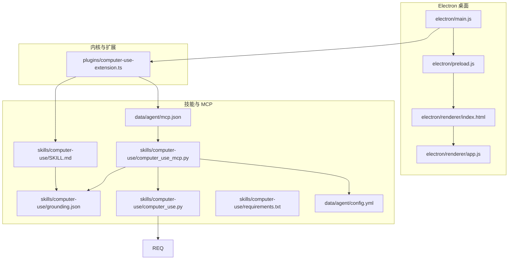
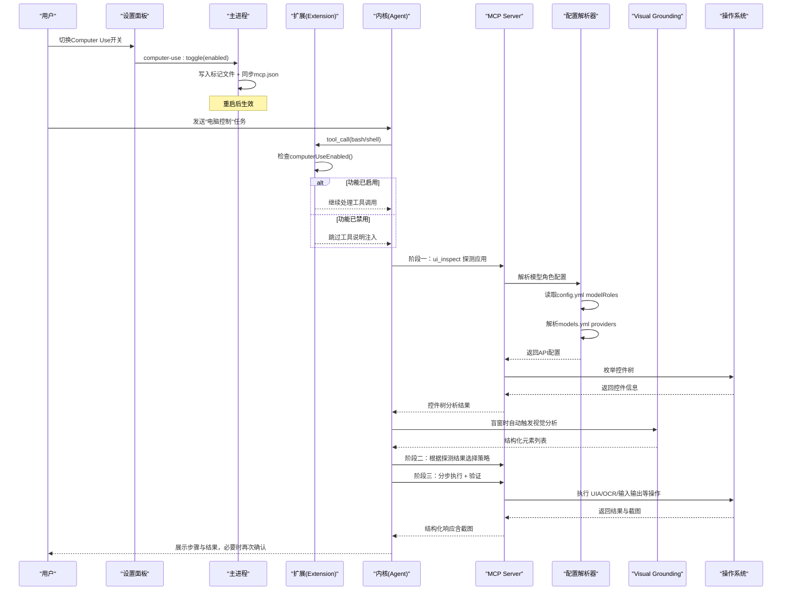
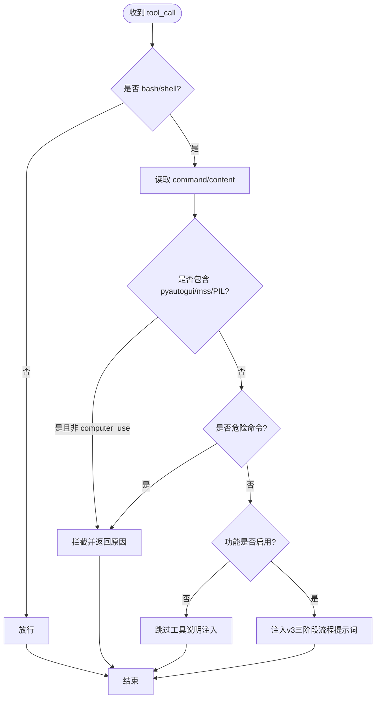
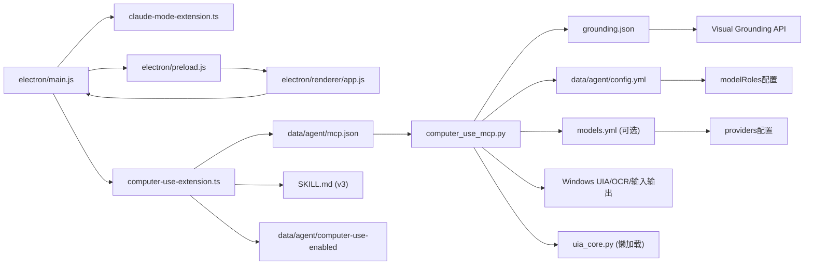

# 计算机使用技能

<cite>
**本文引用的文件**   
- [README.md](file://README.md)
- [AGENTS.md](file://AGENTS.md)
- [开发文档.md](file://开发文档.md)
- [plugins/computer-use-extension.ts](file://plugins\computer-use-extension.ts)
- [skills/computer-use/SKILL.md](file://skills\computer-use\SKILL.md)
- [skills/computer-use/computer_use.py](file://skills\computer-use\computer_use.py)
- [skills/computer-use/computer_use_mcp.py](file://skills\computer-use\computer_use_mcp.py)
- [data/agent/mcp.json](file://data\agent\mcp.json)
- [data/agent/config.yml](file://data\agent\config.yml)
- [skills/computer-use/grounding.json](file://skills\computer-use/grounding.json)
- [electron/main.js](file://electron\main.js)
- [electron/preload.js](file://electron\preload.js)
- [electron/renderer/index.html](file://electron\renderer\index.html)
- [electron/renderer/app.js](file://electron/renderer/app.js)
- [start-tiffa.bat](file://start-tiffa.bat)
- [install.bat](file://install.bat)
- [skills/computer-use/requirements.txt](file://skills\computer-use\requirements.txt)
</cite>

## 更新摘要
**变更内容**   
- **增强视觉Grounding能力**：改进Visual Grounding子模型的配置解析，支持从models.yml和config.yml文件中自动解析模型角色配置
- **优化模型角色解析**：新增_resolve_model_role函数，能够从config.yml的modelRoles和models.yml的providers中自动解析API配置
- **改进配置优先级**：实现环境变量 > grounding.json直写值 > role联动解析值的三级配置优先级机制
- **增强UI-TARS支持**：改进UI-TARS专用定位模型的解析逻辑，支持多种坐标格式（方框格式、点格式）

## 目录
1. [简介](#简介)
2. [项目结构](#项目结构)
3. [核心组件](#核心组件)
4. [架构总览](#架构总览)
5. [详细组件分析](#详细组件分析)
6. [依赖关系分析](#依赖关系分析)
7. [性能与稳定性考量](#性能与稳定性考量)
8. [故障排查指南](#故障排查指南)
9. [结论](#结论)
10. [附录：快速上手与命令速查](#附录快速上手与命令速查)

## 简介
本文件聚焦"计算机使用技能"（Computer Use）在 Tiffa 中的实现与使用方式。该技能通过 MCP（Model Context Protocol）暴露一组原子化桌面控制工具，结合扩展注入的系统提示词与安全拦截机制，使模型能够安全、可控地操作 Windows 桌面。**v3版本引入了根本性的架构改进**，强制采用三阶段工作流程（应用探测→策略选择→分步执行），并集成了Visual Grounding视觉子模型，确保弱模型也能稳定完成复杂的桌面自动化任务。

**最新更新**：增强了Visual Grounding能力，改进了从models.yml和config.yml文件中解析模型角色的功能，实现了更智能的配置管理和更好的模型角色解析机制。

## 项目结构
围绕 Computer Use v3 的关键目录与文件如下：
- 插件与扩展
  - plugins/computer-use-extension.ts：扩展加载、tool_call 拦截、before_agent_start 注入v3系统提示词，支持开关检测
- 技能说明
  - skills/computer-use/SKILL.md：v3技能定义、三阶段工作流、20+应用特性表、Visual Grounding配置
- MCP 服务与脚本
  - skills/computer-use/computer_use_mcp.py：MCP服务器实现，提供8个原子工具，支持UIA依赖懒加载和增强的模型角色解析
  - skills/computer-use/computer_use.py：独立运行脚本（v1风格），用于演示或离线场景
  - data/agent/mcp.json：MCP 服务器注册配置（stdio 模式），包含enabled字段控制
  - data/agent/config.yml：主配置文件，包含modelRoles定义和各种模型角色映射
  - skills/computer-use/grounding.json：Visual Grounding子模型配置，支持role联动
- 前端与启动
  - electron/main.js：主进程管理实例、注入扩展路径、环境变量、处理IPC开关通信
  - electron/preload.js：预加载脚本，暴露getComputerUseStatus/toggleComputerUse API
  - electron/renderer/index.html：设置面板中新增Computer Use开关UI
  - electron/renderer/app.js：开关状态管理与UI交互逻辑
  - start-tiffa.bat / install.bat：启动与安装引导

**图表来源**
- [electron/main.js:1256-1296](file://electron\main.js#L1256-L1296)
- [plugins/computer-use-extension.ts:24-34](file://plugins\computer-use-extension.ts#L24-L34)
- [skills/computer-use/computer_use_mcp.py:58-156](file://skills\computer-use\computer_use_mcp.py#L58-L156)
- [data/agent/config.yml:4-11](file://data\agent\config.yml#L4-L11)
- [skills/computer-use/grounding.json:1-6](file://skills\computer-use\grounding.json#L1-L6)

章节来源
- [README.md:1-236](file://README.md#L1-L236)
- [AGENTS.md:1-319](file://AGENTS.md#L1-L319)
- [开发文档.md:1-198](file://开发文档.md#L1-L198)

## 核心组件
- 电脑控制扩展（TypeScript）
  - 监听 tool_call 事件，拦截 bash/shell 中内联 pyautogui/mss/PIL 的桌面操控代码，强制走 MCP 工具集
  - 在 before_agent_start 注入"电脑控制工具 v3"使用说明，强制三阶段工作流程和安全策略
  - computerUseEnabled()函数检查标记文件，根据开关状态决定是否注入工具说明
- MCP 服务器（Python）
  - 暴露 8 个原子工具：ui_inspect、ui_act、ui_screenshot、desktop_input、computer_use、ui_ocr、ui_find_text、ui_click_text
  - 内置危险命令与关键词拦截、Windows 二次确认、ESC 中断、审计日志
  - **增强**：Visual Grounding子模型集成，支持从models.yml和config.yml自动解析模型角色配置
  - **新增**：_resolve_model_role函数，实现三级配置优先级（环境变量 > grounding.json > role联动）
  - **改进**：UI-TARS专用定位模型支持多种坐标格式解析
  - UIA依赖懒加载，首次工具调用时才加载uia_core模块，避免启动时拖慢
- 技能文档（SKILL.md）
  - 明确三阶段强制流程、20+应用交互特性表、五级降级链、Visual Grounding配置
  - 铁律：禁止跳过探测阶段、禁止对所有应用一视同仁、必须分类施策
- 独立运行脚本（Python）
  - 提供 run/screenshot/version 子命令，便于调试与离线演示
- Electron 主进程
  - 启动时注入扩展路径与环境变量，确保 MCP 可用、编码统一、路径正确
  - 处理computer-use:status和computer-use:toggle IPC通信，同步开关状态到mcp.json
- 前端界面
  - 设置面板中Computer Use开关，支持UI操作和状态显示

章节来源
- [plugins/computer-use-extension.ts:24-34](file://plugins\computer-use-extension.ts#L24-L34)
- [skills/computer-use/computer_use_mcp.py:58-156](file://skills\computer-use\computer_use_mcp.py#L58-L156)
- [skills/computer-use/computer_use_mcp.py:159-193](file://skills\computer-use\computer_use_mcp.py#L159-L193)
- [data/agent/config.yml:4-11](file://data\agent\config.yml#L4-L11)

## 架构总览
Computer Use v3 的工作流由"扩展 + MCP + 技能文档"共同驱动，**强制遵循三阶段流程**："应用探测→策略选择→分步执行"，配合"UIA 优先、截图验证、用户确认"的安全原则。**增强的Visual Grounding能力**允许从多个配置源智能解析模型角色，提供更灵活的配置管理。

**图表来源**
- [plugins/computer-use-extension.ts:24-34](file://plugins\computer-use-extension.ts#L24-L34)
- [skills/computer-use/computer_use_mcp.py:58-156](file://skills\computer-use\computer_use_mcp.py#L58-L156)
- [data/agent/config.yml:4-11](file://data\agent\config.yml#L4-L11)

## 详细组件分析

### 增强的模型角色解析（新增）
- **_resolve_model_role函数**
  - 位置：computer_use_mcp.py第58-156行
  - 功能：从config.yml的modelRoles和models.yml的providers中解析模型配置
  - 支持格式：provider/model_id（如"kimi/kimi-k3"）
  - 返回值：{"api_base": ..., "model": ..., "api_key": ...}
- **配置解析流程**
  1. 读取data/agent/config.yml获取role对应的provider/model
  2. 解析models.yml中的providers区块找到目标provider
  3. 提取baseUrl和apiKey配置
  4. 失败时返回空字典，不影响主流程
- **错误处理**
  - 文件不存在时静默跳过
  - YAML解析异常时捕获并记录日志
  - 配置格式错误时返回空结果

**Section sources**
- [skills/computer-use/computer_use_mcp.py:58-156](file://skills\computer-use\computer_use_mcp.py#L58-L156)
- [data/agent/config.yml:4-11](file://data\agent\config.yml#L4-L11)

### Visual Grounding配置增强（改进）
- **三级配置优先级**
  - 第一优先级：环境变量（GROUNDING_API_BASE、GROUNDING_MODEL等）
  - 第二优先级：grounding.json直写值
  - 第三优先级：role联动解析值（从models.yml和config.yml）
- **role联动机制**
  - grounding.json中可配置"role"字段
  - 自动从config.yml的modelRoles中找到对应角色
  - 从models.yml的providers中解析API配置
- **默认值处理**
  - 未配置时默认使用"xiaomi/mimo-v2-flash"模型
  - API Key默认为"sk-no-key"
  - 启用状态根据是否有API_BASE自动判断

**Section sources**
- [skills/computer-use/computer_use_mcp.py:159-193](file://skills\computer-use\computer_use_mcp.py#L159-L193)
- [skills/computer-use/grounding.json:1-6](file://skills\computer-use\grounding.json#L1-L6)

### UI-TARS专用定位模型（改进）
- **多格式坐标支持**
  - 方框格式：click(start_box='(x1,y1,x2,y2)')
  - 点格式：click(start_box='<point>x y</point>')
  - 归一化坐标：0~1000相对屏幕坐标
- **解析逻辑增强**
  - 支持多种输入动作格式：type(content='...')、input(text='...')
  - 自动计算中心坐标并转换为物理像素
  - 兼容doubao-seed和其他OpenAI兼容API的输出格式
- **错误处理**
  - 解析失败时返回原始文本供调试
  - 坐标转换异常时保持None值

**Section sources**
- [skills/computer-use/computer_use_mcp.py:290-349](file://skills\computer-use\computer_use_mcp.py#L290-L349)

### 后台切换系统
- **标记文件机制**
  - 位置：`data/agent/computer-use-enabled`
  - 内容：`true` 或 `false`，默认为 `false`（功能禁用）
  - 作用：控制Computer Use功能的启用状态
- **主进程集成**
  - `isComputerUseEnabled()`：读取标记文件判断功能状态
  - `syncComputerUseMcp()`：将开关状态同步到 `mcp.json` 的 `computer-use.enabled` 字段
  - IPC接口：`computer-use:status` 查询状态，`computer-use:toggle` 切换状态
- **启动时同步**
  - 程序启动时自动同步标记文件状态到 `mcp.json`
  - 如果功能禁用，则不会拉起MCP服务器，加速启动过程

**Section sources**
- [electron/main.js:1256-1296](file://electron\main.js#L1256-L1296)
- [data/agent/mcp.json:14](file://data\agent\mcp.json#L14)

### 电脑控制扩展（TypeScript）
- 职责
  - 拦截 bash/shell 中内联 pyautogui/mss/PIL 的桌面操控代码，阻止直接写脚本
  - 在会话开始前注入"电脑控制工具 v3"的使用说明，强制三阶段工作流程
- 关键行为
  - `computerUseEnabled()` 函数检查标记文件，根据开关状态决定是否注入工具说明
  - tool_call 拦截：匹配 pyautogui/mss/PIL 关键字，非 computer_use 则 block
  - dangerous 命令拦截：格式化、关机、注册表、杀系统进程等
  - before_agent_start 注入：仅在功能启用时注入v3工具用法、三阶段流程与应用特性表

**图表来源**
- [plugins/computer-use-extension.ts:24-34](file://plugins\computer-use-extension.ts#L24-L34)
- [plugins/computer-use-extension.ts:74-79](file://plugins\computer-use-extension.ts#L74-L79)

章节来源
- [plugins/computer-use-extension.ts:1-147](file://plugins\computer-use-extension.ts#L1-L147)

### MCP 服务器（Python）
- 职责
  - 暴露 8 个原子工具，支持 UIA Pattern 直调、精确坐标点击、SoM 标注截图、归一化坐标兜底、OCR 文本识别与定位
  - 内置安全拦截、二次确认、审计日志、超时与 ESC 中断
  - **增强**：Visual Grounding子模型自动触发，为盲窗场景提供结构化元素识别
  - **改进**：增强的模型角色解析，支持从多个配置源智能获取API配置
- 工具概览
  - ui_inspect：枚举控件，返回编号+名称+坐标+可用操作
  - ui_act：按编号/名称执行操作，自动附带截图回传
  - ui_screenshot：全屏或窗口截图，可选 SoM 标注
  - desktop_input：归一化坐标兜底（click/type/key/launch/scroll/wait）
  - computer_use：简单任务快捷入口
  - ui_ocr：窗口/区域 OCR 文字识别
  - ui_find_text：OCR 模糊匹配定位
  - ui_click_text：OCR 找字并点击，支持 verify_title 校验
- 安全机制
  - FORBIDDEN/DANGEROUS 列表拦截
  - MessageBox 二次确认（可 --force 跳过）
  - ESC 全局中断、Failsafe 保护
- **改进**：UIA依赖懒加载机制
  - 模块级 `U = None` 初始化
  - `_ensure_uia()` 函数在首次工具调用时才 import uia_core
  - 避免MCP进程启动时加载pywinauto/comtypes/win32com等重依赖

章节来源
- [skills/computer-use/computer_use_mcp.py:33-42](file://skills\computer-use/computer_use_mcp.py#L33-L42)
- [skills/computer-use/computer_use_mcp.py:1230-1231](file://skills/computer-use/computer_use_mcp.py#L1230-L1231)

### 前端界面
- **设置面板集成**
  - HTML结构：在"主题风格"与"约束规则"之间新增"Computer Use（电脑控制）"section
  - 样式复用：使用 `.model-toggle` 开关样式，保持一致的UI体验
  - 状态显示：标签显示"已开启（重启 Tiffa 后生效）"或"已关闭"
- **交互逻辑**
  - `setupComputerUse()`：初始化时读取当前状态并恢复勾选
  - `refreshComputerUseToggle()`：打开设置时重新读取状态，防止外部修改导致UI落后
  - change事件：调用 `toggleComputerUse()` 写入标记文件并更新标签文本
- **IPC通信**
  - preload.js暴露 `getComputerUseStatus` 和 `toggleComputerUse` API
  - main.js处理对应的IPC请求，读写标记文件并同步到mcp.json

章节来源
- [electron/renderer/index.html:241-249](file://electron/renderer/index.html#L241-L249)
- [electron/renderer/app.js:4533-4562](file://electron/renderer/app.js#L4533-L4562)
- [electron/preload.js:107-109](file://electron/preload.js#L107-L109)

### Visual Grounding 子模型（增强）
- **功能特性**
  - 当 UIA 返回的有名称元素 < 5 个（盲窗）时，自动调用轻量视觉模型分析截图
  - 返回结构化元素列表（名称+类型+坐标），主模型不需要自己"看"截图猜坐标
  - 支持任何 OpenAI 兼容 API：本地 llama.cpp、kimi、minimax、xiaomi 都行
- **配置方式（增强）**
  - 环境变量：GROUNDING_API_BASE、GROUNDING_MODEL、GROUNDING_API_KEY、GROUNDING_ENABLED
  - 配置文件：grounding.json（role: vision, enabled: 1）
  - **新增**：从config.yml的modelRoles和models.yml的providers自动解析配置
- **行为规则**
  - 不配置 = 零影响：完全走原有 UIA/OCR 路径
  - 盲窗自动触发：ui_inspect 发现有名称元素 <5 个 → 自动调 grounding
  - 显式请求：ui_screenshot(grounding=True) 强制触发
  - 失败静默降级：API 超时/报错 → 返回空列表，不影响主流程

章节来源
- [skills/computer-use/SKILL.md:237-273](file://skills\computer-use/SKILL.md#L237-L273)
- [skills/computer-use/grounding.json:1-6](file://skills\computer-use\grounding.json#L1-L6)
- [skills/computer-use/computer_use_mcp.py:159-193](file://skills\computer-use\computer_use_mcp.py#L159-L193)

### 独立运行脚本（Python）
- 功能
  - run：完整任务循环（截屏→LLM→解析工具调用→执行→验证）
  - screenshot：单次截图保存
  - version：版本信息
- 安全与体验
  - 危险命令与关键词拦截
  - Windows MessageBox 二次确认（--force 跳过）
  - ESC 中断、Failsafe、超时控制、审计日志

章节来源
- [skills/computer-use/computer_use.py:1-629](file://skills\computer-use/computer_use.py#L1-L629)

### Electron 主进程集成
- 启动参数
  - 注入扩展路径：claude-mode-extension.ts 与 computer-use-extension.ts
  - 设置环境变量：PI_CODING_AGENT_DIR、HOME、MNEMOPI_EMBEDDING_MODEL、PATH 等
- 多实例管理
  - 最大实例数、LRU 淘汰、崩溃自动重启、stall 检测
- **后台切换系统**
  - 标记文件读写：`data/agent/computer-use-enabled`
  - mcp.json同步：启动时同步开关状态到 `computer-use.enabled` 字段
  - IPC接口：处理 `computer-use:status` 和 `computer-use:toggle` 请求

章节来源
- [electron/main.js:1256-1296](file://electron\main.js#L1256-L1296)

## 依赖关系分析
- 运行时依赖
  - Bun 作为内核运行时，Node/Python 环境前置到 PATH
  - MCP Server 通过 stdio 与内核通信
  - **增强**：Visual Grounding子模型依赖OpenAI兼容API，支持从多个配置源解析
  - **改进**：UIA依赖懒加载，避免启动时加载pywinauto/comtypes/win32com
- 配置依赖
  - mcp.json 声明 MCP 服务器命令与参数，包含 `enabled` 字段控制
  - AGENTS.md/README.md/开发文档.md 描述启动方式与环境变量
  - **增强**：grounding.json 配置视觉子模型开关，支持role联动
  - **新增**：config.yml中的modelRoles定义各种模型角色映射
  - **新增**：`data/agent/computer-use-enabled` 标记文件控制功能开关

**图表来源**
- [electron/main.js:1256-1296](file://electron\main.js#L1256-L1296)
- [plugins/computer-use-extension.ts:24-34](file://plugins\computer-use-extension.ts#L24-L34)
- [skills/computer-use/computer_use_mcp.py:58-156](file://skills\computer-use\computer_use_mcp.py#L58-L156)
- [data/agent/config.yml:4-11](file://data\agent\config.yml#L4-L11)
- [skills/computer-use/grounding.json:1-6](file://skills\computer-use\grounding.json#L1-L6)

章节来源
- [AGENTS.md:1-319](file://AGENTS.md#L1-L319)
- [开发文档.md:1-198](file://开发文档.md#L1-L198)

## 性能与稳定性考量
- 视觉与定位
  - 截图统一缩放至 1280px 宽，减少 4K 外推误差
  - UIA 优先避免视觉模型偏差，提升速度与精度
  - **增强**：Visual Grounding仅在盲窗时触发，避免不必要的API调用
  - **改进**：模型角色解析失败时静默降级，不影响主流程
- 资源与上下文
  - 每次操作后附带截图回传，避免重复思考；限制标注数量与 token 上限
  - **优化**：三阶段流程减少无效尝试，提高整体效率
  - **改进**：UIA依赖懒加载，避免MCP进程启动时加载重依赖库
  - **增强**：多级配置优先级确保配置灵活性
- 稳定性
  - 多实例 LRU 淘汰与崩溃自动重启
  - stall 检测与强制终止，防止卡死
  - **增强**：Visual Grounding失败静默降级，不影响主流程
  - **改进**：后台切换系统，默认禁用功能以优化启动性能
  - **新增**：配置解析异常时返回空结果，保证系统稳定性
- 安全与用户体验
  - 二次确认与 ESC 中断，保障用户控制权
  - **强化**：强制探测阶段，避免盲目操作
  - **改进**：开关状态持久化，重启后保持用户设置
  - **增强**：模型配置解析失败时不影响功能可用性

## 故障排查指南
- 常见问题
  - MCP 未启动：检查 mcp.json 命令路径与 Python 环境
  - 中文乱码：确认环境变量 PYTHONIOENCODING、PYTHONUTF8、LANG 等设置为 UTF-8
  - 权限不足：以管理员权限运行或调整目标应用权限
  - 无法识别控件：尝试 SoM 标注或 OCR 定位
  - **增强**：Visual Grounding不工作：检查GROUNDING_API_BASE、GROUNDING_MODEL、GROUNDING_API_KEY环境变量
  - **新增**：模型角色解析失败：检查config.yml中modelRoles配置和models.yml中providers配置
  - **新增**：grounding.json role联动失效：确认role字段指向正确的modelRoles键
  - **新增**：Computer Use功能不生效：检查 `data/agent/computer-use-enabled` 标记文件是否为 `true`
- 诊断步骤
  - 查看 computer-use.log 与审计日志
  - 使用 standalone 脚本进行单步测试（run/screenshot）
  - 通过 Electron 主进程日志观察实例状态与事件
  - **增强**：检查grounding.json配置是否正确，role字段是否有效
  - **新增**：验证config.yml中modelRoles配置格式
  - **新增**：检查models.yml中providers配置是否存在
  - **新增**：验证设置面板开关状态与标记文件一致性

章节来源
- [skills/computer-use/computer_use.py:210-222](file://skills\computer-use/computer_use.py#L210-L222)
- [electron/main.js:1256-1296](file://electron\main.js#L1256-L1296)
- [skills/computer-use/SKILL.md:240-256](file://skills\computer-use/SKILL.md#L240-L256)
- [skills/computer-use/computer_use_mcp.py:58-156](file://skills\computer-use\computer_use_mcp.py#L58-L156)

## 结论
Computer Use v3 技能通过"扩展拦截 + MCP 原子工具 + 技能文档约束 + Visual Grounding增强"的组合，实现了更安全、更智能、更可靠的桌面自动化。其**强制三阶段工作流程**确保了操作的有序性和可预测性，**20+应用特性表**提供了丰富的应用识别指导，**增强的Visual Grounding子模型**解决了盲窗场景的难题，**改进的模型角色解析机制**提供了更灵活的配置管理。**后台切换系统**进一步优化了启动性能，默认禁用功能避免不必要的依赖加载，同时提供灵活的启用机制。相比v2版本，v3在架构设计上更加成熟，适合在弱模型环境下稳定落地复杂的多应用自动化任务。建议在实际使用中严格遵循 SKILL.md 的安全流程，并结合 Electron 主进程的多实例管理与日志系统进行运维。

## 附录：快速上手与命令速查
- 启动方式
  - 双击 tiffa-desktop.exe 或运行 start-desktop.bat
  - 终端模式：start-tiffa.bat --tui/--web/--rpc
- 安装与初始化
  - 运行 install.bat 进入安装向导
- 常用命令（standalone 脚本）
  - python computer_use.py run "打开记事本输入你好"
  - python computer_use.py screenshot --output ss.png
  - python computer_use.py version
- **增强配置**
  - 配置Visual Grounding：设置环境变量 GROUNDING_API_BASE、GROUNDING_MODEL、GROUNDING_API_KEY
  - 启用视觉子模型：设置 GROUNDING_ENABLED=1 或修改 grounding.json
  - **新增**：配置模型角色：在config.yml的modelRoles中添加角色映射
  - **新增**：配置providers：在models.yml中添加provider的baseUrl和apiKey
- **新增**：启用Computer Use功能
  - 方法1：编辑 `data/agent/computer-use-enabled` 文件，写入 `true`
  - 方法2：在设置面板中勾选"Computer Use（电脑控制）"开关
  - 注意：修改后需重启 Tiffa 才能生效
  - 验证：重启后检查 mcp.json 中 `computer-use.enabled` 字段是否为 `true`
- **故障排查**
  - 检查config.yml中modelRoles配置格式
  - 验证models.yml中providers配置存在
  - 确认grounding.json中role字段指向有效的modelRoles键
  - 查看computer-use.log中的解析错误日志

章节来源
- [start-tiffa.bat:1-154](file://start-tiffa.bat#L1-L154)
- [install.bat:1-11](file://install.bat#L1-L11)
- [skills/computer-use/computer_use.py:595-629](file://skills\computer-use/computer_use.py#L595-L629)
- [skills/computer-use/SKILL.md:240-256](file://skills\computer-use/SKILL.md#L240-L256)
- [electron/main.js:1256-1296](file://electron\main.js#L1256-L1296)
- [electron/renderer/app.js:4533-4562](file://electron/renderer/app.js#L4533-L4562)
- [data/agent/config.yml:4-11](file://data\agent\config.yml#L4-L11)
- [skills/computer-use/computer_use_mcp.py:58-156](file://skills\computer-use\computer_use_mcp.py#L58-L156)