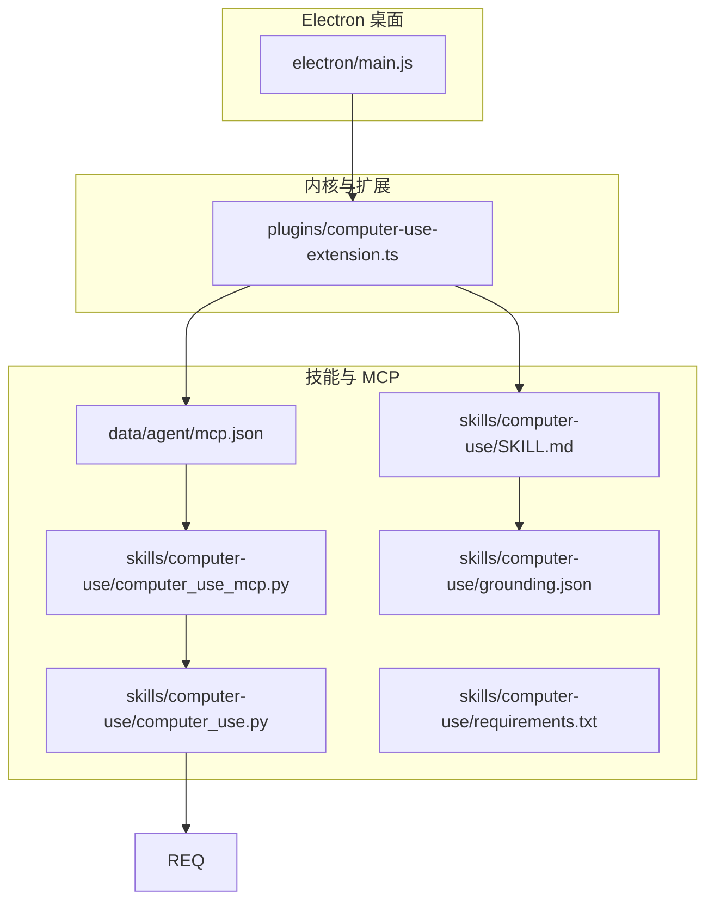
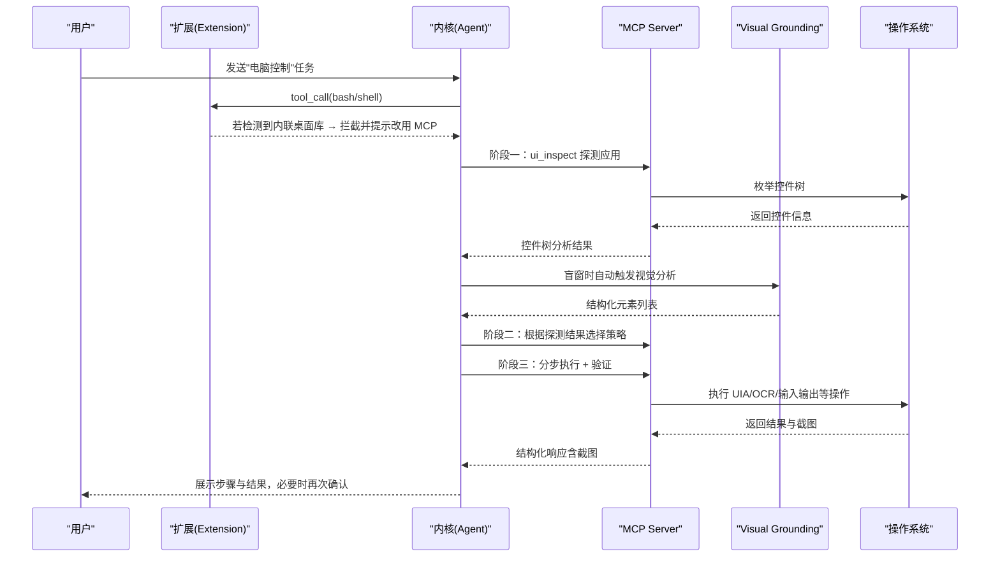
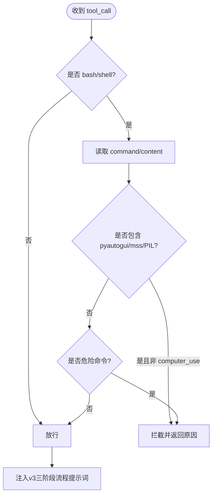
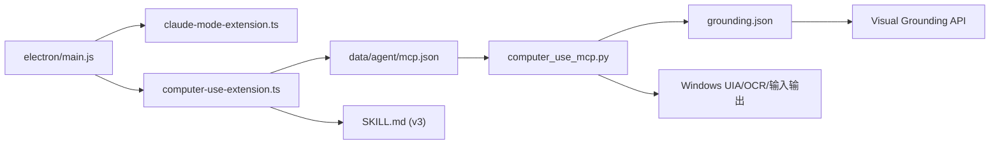

# 计算机使用技能

<cite>
**本文引用的文件**   
- [README.md](file://README.md)
- [AGENTS.md](file://AGENTS.md)
- [开发文档.md](file://开发文档.md)
- [plugins/computer-use-extension.ts](file://plugins\computer-use-extension.ts)
- [skills/computer-use/SKILL.md](file://skills\computer-use\SKILL.md)
- [skills/computer-use/computer_use.py](file://skills\computer-use\computer_use.py)
- [skills/computer-use/computer_use_mcp.py](file://skills\computer-use\computer_use_mcp.py)
- [data/agent/mcp.json](file://data\agent\mcp.json)
- [electron/main.js](file://electron\main.js)
- [start-tiffa.bat](file://start-tiffa.bat)
- [install.bat](file://install.bat)
- [skills/computer-use/requirements.txt](file://skills\computer-use\requirements.txt)
- [skills/computer-use/grounding.json](file://skills\computer-use\grounding.json)
</cite>

## 更新摘要
**变更内容**   
- 将Computer Use技能从v2升级到v3，引入强制三阶段工作流程（应用探测→策略选择→分步执行）
- 新增应用探测阶段，要求先识别目标应用的UI框架和自动化通道
- 增强应用智能，包含20+常见应用程序的交互特性表
- 集成Visual Grounding视觉子模型，支持盲窗场景的结构化元素识别
- 全面重构文档，强调结构化方法而非直接操作
- 更新系统提示词注入机制，强制遵循探测优先策略
- 新增五级降级策略：UIA Pattern → UIA坐标 → SoM编号 → 归一化坐标 → OCR兜底 → Visual Grounding

## 目录
1. [简介](#简介)
2. [项目结构](#项目结构)
3. [核心组件](#核心组件)
4. [架构总览](#架构总览)
5. [详细组件分析](#详细组件分析)
6. [依赖关系分析](#依赖关系分析)
7. [性能与稳定性考量](#性能与稳定性考量)
8. [故障排查指南](#故障排查指南)
9. [结论](#结论)
10. [附录：快速上手与命令速查](#附录快速上手与命令速查)

## 简介
本文件聚焦"计算机使用技能"（Computer Use）在 Tiffa 中的实现与使用方式。该技能通过 MCP（Model Context Protocol）暴露一组原子化桌面控制工具，结合扩展注入的系统提示词与安全拦截机制，使模型能够安全、可控地操作 Windows 桌面。**v3版本引入了根本性的架构改进**，强制采用三阶段工作流程（应用探测→策略选择→分步执行），并集成了Visual Grounding视觉子模型，确保弱模型也能稳定完成复杂的桌面自动化任务。

## 项目结构
围绕 Computer Use v3 的关键目录与文件如下：
- 插件与扩展
  - plugins/computer-use-extension.ts：扩展加载、tool_call 拦截、before_agent_start 注入v3系统提示词
- 技能说明
  - skills/computer-use/SKILL.md：v3技能定义、三阶段工作流、20+应用特性表、Visual Grounding配置
- MCP 服务与脚本
  - skills/computer-use/computer_use_mcp.py：MCP服务器实现，提供8个原子工具
  - skills/computer-use/computer_use.py：独立运行脚本（v1风格），用于演示或离线场景
  - data/agent/mcp.json：MCP 服务器注册配置（stdio 模式）
  - skills/computer-use/grounding.json：Visual Grounding子模型配置
- 前端与启动
  - electron/main.js：主进程管理实例、注入扩展路径、环境变量
  - start-tiffa.bat / install.bat：启动与安装引导

**图表来源**
- [electron/main.js:1-200](file://electron\main.js#L1-L200)
- [plugins/computer-use-extension.ts:1-129](file://plugins\computer-use-extension.ts#L1-L129)
- [skills/computer-use/SKILL.md:1-352](file://skills\computer-use\SKILL.md#L1-L352)
- [data/agent/mcp.json:1-16](file://data\agent\mcp.json#L1-L16)
- [skills/computer-use/grounding.json:1-5](file://skills\computer-use\grounding.json#L1-L5)

章节来源
- [README.md:1-236](file://README.md#L1-L236)
- [AGENTS.md:1-319](file://AGENTS.md#L1-L319)
- [开发文档.md:1-198](file://开发文档.md#L1-L198)

## 核心组件
- 电脑控制扩展（TypeScript）
  - 监听 tool_call 事件，拦截 bash/shell 中内联 pyautogui/mss/PIL 的桌面操控代码，强制走 MCP 工具集
  - 在 before_agent_start 注入"电脑控制工具 v3"使用说明，强制三阶段工作流程和安全策略
- MCP 服务器（Python）
  - 暴露 8 个原子工具：ui_inspect、ui_act、ui_screenshot、desktop_input、computer_use、ui_ocr、ui_find_text、ui_click_text
  - 内置危险命令与关键词拦截、Windows 二次确认、ESC 中断、审计日志
  - **v3新增**：Visual Grounding子模型集成，自动检测盲窗并调用视觉模型分析
- 技能文档（SKILL.md）
  - **v3重大更新**：明确三阶段强制流程、20+应用交互特性表、五级降级链、Visual Grounding配置
  - 铁律：禁止跳过探测阶段、禁止对所有应用一视同仁、必须分类施策
- 独立运行脚本（Python）
  - 提供 run/screenshot/version 子命令，便于调试与离线演示
- Electron 主进程
  - 启动时注入扩展路径与环境变量，确保 MCP 可用、编码统一、路径正确

章节来源
- [plugins/computer-use-extension.ts:1-129](file://plugins\computer-use-extension.ts#L1-L129)
- [skills/computer-use/SKILL.md:1-352](file://skills\computer-use\SKILL.md#L1-L352)
- [skills/computer-use/computer_use.py:1-629](file://skills\computer-use\computer_use.py#L1-L629)
- [skills/computer-use/computer_use_mcp.py:1-200](file://skills\computer-use\computer_use_mcp.py#L1-L200)
- [electron/main.js:1-200](file://electron\main.js#L1-L200)

## 架构总览
Computer Use v3 的工作流由"扩展 + MCP + 技能文档"共同驱动，**强制遵循三阶段流程**："应用探测→策略选择→分步执行"，配合"UIA 优先、截图验证、用户确认"的安全原则。

**图表来源**
- [plugins/computer-use-extension.ts:24-129](file://plugins\computer-use-extension.ts#L24-L129)
- [skills/computer-use/SKILL.md:32-73](file://skills\computer-use/SKILL.md#L32-L73)
- [skills/computer-use/SKILL.md:219-273](file://skills\computer-use/SKILL.md#L219-L273)

## 详细组件分析

### 电脑控制扩展（TypeScript）
- 职责
  - 拦截 bash/shell 中内联 pyautogui/mss/PIL 的桌面操控代码，阻止直接写脚本
  - 在会话开始前注入"电脑控制工具 v3"的使用说明，强制三阶段工作流程
- 关键行为
  - tool_call 拦截：匹配 pyautogui/mss/PIL 关键字，非 computer_use 则 block
  - dangerous 命令拦截：格式化、关机、注册表、杀系统进程等
  - before_agent_start 注入：将v3工具用法、三阶段流程与应用特性表写入 systemPrompt

**图表来源**
- [plugins/computer-use-extension.ts:28-59](file://plugins\computer-use-extension.ts#L28-L59)
- [plugins/computer-use-extension.ts:62-129](file://plugins\computer-use-extension.ts#L62-L129)

章节来源
- [plugins/computer-use-extension.ts:1-129](file://plugins\computer-use-extension.ts#L1-L129)

### MCP 服务器（Python）
- 职责
  - 暴露 8 个原子工具，支持 UIA Pattern 直调、精确坐标点击、SoM 标注截图、归一化坐标兜底、OCR 文本识别与定位
  - 内置安全拦截、二次确认、审计日志、超时与 ESC 中断
  - **v3新增**：Visual Grounding子模型自动触发，为盲窗场景提供结构化元素识别
- 工具概览
  - ui_inspect：枚举控件，返回编号+名称+坐标+可用操作
  - ui_act：按编号/名称执行操作，自动附带截图回传
  - ui_screenshot：全屏或窗口截图，可选 SoM 标注
  - desktop_input：归一化坐标兜底（click/type/key/launch/scroll/wait）
  - computer_use：简单任务快捷入口
  - ui_ocr：窗口/区域 OCR 文字识别
  - ui_find_text：OCR 模糊匹配定位
  - ui_click_text：OCR 找字并点击，支持 verify_title 校验
- 安全机制
  - FORBIDDEN/DANGEROUS 列表拦截
  - MessageBox 二次确认（可 --force 跳过）
  - ESC 全局中断、Failsafe 保护

章节来源
- [skills/computer-use/computer_use.py:1-629](file://skills\computer-use\computer_use.py#L1-L629)
- [skills/computer-use/computer_use_mcp.py:1-200](file://skills\computer-use\computer_use_mcp.py#L1-L200)

### 技能文档（SKILL.md）
- **v3重大更新**
  - 铁律：禁止在 bash 中内联 Python 操控桌面，必须走 MCP 工具集；禁止跳过探测阶段；禁止对所有应用一视同仁
  - 安全流程：ask 确认 → 展示计划 → 用户确认 → 执行 → 截图验证
  - **三阶段强制流程**：应用探测（必须！不可跳过！）→ 策略选择 → 分步执行 + 验证
  - **20+应用交互特性表**：微信/QQ/钉钉/飞书/Office/Chrome等常用应用的UI框架、UIA可用性、后台通道、推荐策略
  - 五级降级链：UIA Pattern → UIA 坐标 → SoM 编号 → 归一化坐标 → OCR 兜底 → Visual Grounding
  - Visual Grounding子模型配置：环境变量设置、自动触发条件、失败降级处理

章节来源
- [skills/computer-use/SKILL.md:1-352](file://skills\computer-use/SKILL.md#L1-L352)

### Visual Grounding 子模型（v3新增）
- **功能特性**
  - 当 UIA 返回的有名称元素 < 5 个（盲窗）时，自动调用轻量视觉模型分析截图
  - 返回结构化元素列表（名称+类型+坐标），主模型不需要自己"看"截图猜坐标
  - 支持任何 OpenAI 兼容 API：本地 llama.cpp、kimi、minimax、xiaomi 都行
- **配置方式**
  - 环境变量：GROUNDING_API_BASE、GROUNDING_MODEL、GROUNDING_API_KEY、GROUNDING_ENABLED
  - 配置文件：grounding.json（role: vision, enabled: 1）
- **行为规则**
  - 不配置 = 零影响：完全走原有 UIA/OCR 路径
  - 盲窗自动触发：ui_inspect 发现有名称元素 <5 个 → 自动调 grounding
  - 显式请求：ui_screenshot(grounding=True) 强制触发
  - 失败静默降级：API 超时/报错 → 返回空列表，不影响主流程

章节来源
- [skills/computer-use/SKILL.md:237-273](file://skills\computer-use/SKILL.md#L237-L273)
- [skills/computer-use/grounding.json:1-5](file://skills\computer-use/grounding.json#L1-L5)
- [skills/computer-use/computer_use_mcp.py:151-200](file://skills\computer-use/computer_use_mcp.py#L151-L200)

### 独立运行脚本（Python）
- 功能
  - run：完整任务循环（截屏→LLM→解析工具调用→执行→验证）
  - screenshot：单次截图保存
  - version：版本信息
- 安全与体验
  - 危险命令与关键词拦截
  - Windows MessageBox 二次确认（--force 跳过）
  - ESC 中断、Failsafe、超时控制、审计日志

章节来源
- [skills/computer-use/computer_use.py:1-629](file://skills\computer-use\computer_use.py#L1-L629)

### Electron 主进程集成
- 启动参数
  - 注入扩展路径：claude-mode-extension.ts 与 computer-use-extension.ts
  - 设置环境变量：PI_CODING_AGENT_DIR、HOME、MNEMOPI_EMBEDDING_MODEL、PATH 等
- 多实例管理
  - 最大实例数、LRU 淘汰、崩溃自动重启、stall 检测

章节来源
- [electron/main.js:1-200](file://electron\main.js#L1-L200)

## 依赖关系分析
- 运行时依赖
  - Bun 作为内核运行时，Node/Python 环境前置到 PATH
  - MCP Server 通过 stdio 与内核通信
  - **v3新增**：Visual Grounding子模型依赖OpenAI兼容API
- 配置依赖
  - mcp.json 声明 MCP 服务器命令与参数
  - AGENTS.md/README.md/开发文档.md 描述启动方式与环境变量
  - **v3新增**：grounding.json 配置视觉子模型开关

**图表来源**
- [electron/main.js:1-200](file://electron\main.js#L1-L200)
- [data/agent/mcp.json:1-16](file://data\agent\mcp.json#L1-L16)
- [skills/computer-use/grounding.json:1-5](file://skills\computer-use/grounding.json#L1-L5)

章节来源
- [AGENTS.md:1-319](file://AGENTS.md#L1-L319)
- [开发文档.md:1-198](file://开发文档.md#L1-L198)

## 性能与稳定性考量
- 视觉与定位
  - 截图统一缩放至 1280px 宽，减少 4K 外推误差
  - UIA 优先避免视觉模型偏差，提升速度与精度
  - **v3新增**：Visual Grounding仅在盲窗时触发，避免不必要的API调用
- 资源与上下文
  - 每次操作后附带截图回传，避免重复思考；限制标注数量与 token 上限
  - **v3优化**：三阶段流程减少无效尝试，提高整体效率
- 稳定性
  - 多实例 LRU 淘汰与崩溃自动重启
  - stall 检测与强制终止，防止卡死
  - **v3增强**：Visual Grounding失败静默降级，不影响主流程
- 安全与用户体验
  - 二次确认与 ESC 中断，保障用户控制权
  - **v3强化**：强制探测阶段，避免盲目操作

## 故障排查指南
- 常见问题
  - MCP 未启动：检查 mcp.json 命令路径与 Python 环境
  - 中文乱码：确认环境变量 PYTHONIOENCODING、PYTHONUTF8、LANG 等设置为 UTF-8
  - 权限不足：以管理员权限运行或调整目标应用权限
  - 无法识别控件：尝试 SoM 标注或 OCR 定位
  - **v3新增**：Visual Grounding不工作：检查GROUNDING_API_BASE、GROUNDING_MODEL、GROUNDING_API_KEY环境变量
- 诊断步骤
  - 查看 computer-use.log 与审计日志
  - 使用 standalone 脚本进行单步测试（run/screenshot）
  - 通过 Electron 主进程日志观察实例状态与事件
  - **v3新增**：检查grounding.json配置是否正确

章节来源
- [skills/computer-use/computer_use.py:210-222](file://skills\computer-use\computer_use.py#L210-L222)
- [electron/main.js:120-140](file://electron\main.js#L120-L140)
- [skills/computer-use/SKILL.md:240-256](file://skills\computer-use/SKILL.md#L240-L256)

## 结论
Computer Use v3 技能通过"扩展拦截 + MCP 原子工具 + 技能文档约束 + Visual Grounding增强"的组合，实现了更安全、更智能、更可靠的桌面自动化。其**强制三阶段工作流程**确保了操作的有序性和可预测性，**20+应用特性表**提供了丰富的应用识别指导，**Visual Grounding子模型**解决了盲窗场景的难题。相比v2版本，v3在架构设计上更加成熟，适合在弱模型环境下稳定落地复杂的多应用自动化任务。建议在实际使用中严格遵循 SKILL.md 的安全流程，并结合 Electron 主进程的多实例管理与日志系统进行运维。

## 附录：快速上手与命令速查
- 启动方式
  - 双击 tiffa-desktop.exe 或运行 start-desktop.bat
  - 终端模式：start-tiffa.bat --tui/--web/--rpc
- 安装与初始化
  - 运行 install.bat 进入安装向导
- 常用命令（standalone 脚本）
  - python computer_use.py run "打开记事本输入你好"
  - python computer_use.py screenshot --output ss.png
  - python computer_use.py version
- **v3新增配置**
  - 配置Visual Grounding：设置环境变量 GROUNDING_API_BASE、GROUNDING_MODEL、GROUNDING_API_KEY
  - 启用视觉子模型：设置 GROUNDING_ENABLED=1 或修改 grounding.json

章节来源
- [start-tiffa.bat:1-154](file://start-tiffa.bat#L1-L154)
- [install.bat:1-11](file://install.bat#L1-L11)
- [skills/computer-use/computer_use.py:595-629](file://skills\computer-use\computer_use.py#L595-L629)
- [skills/computer-use/SKILL.md:240-256](file://skills\computer-use/SKILL.md#L240-L256)