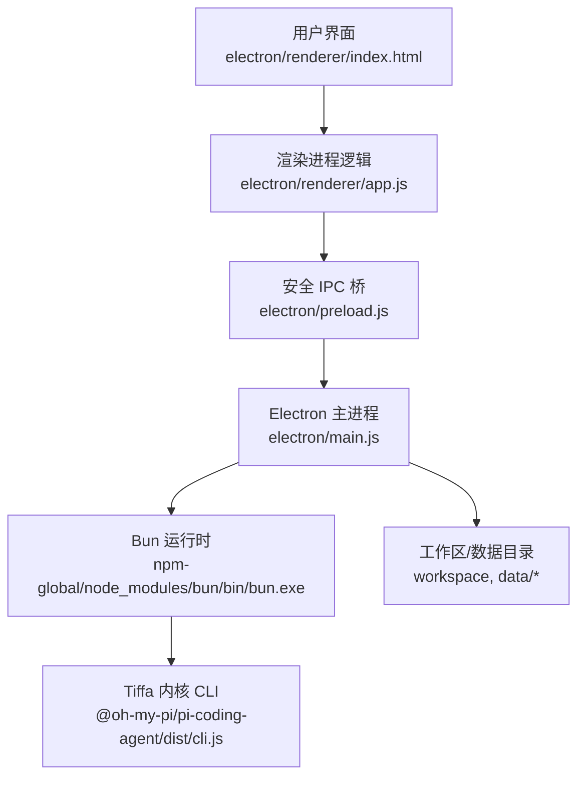
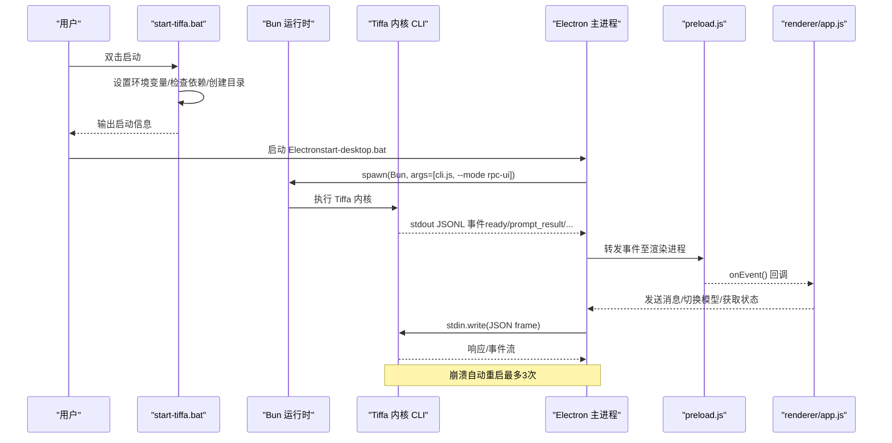
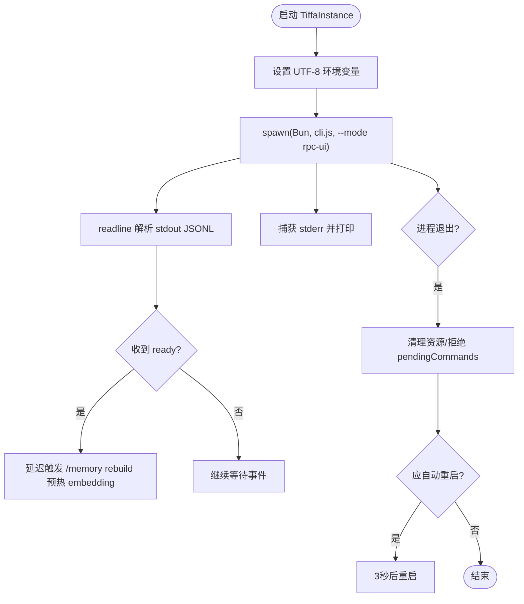
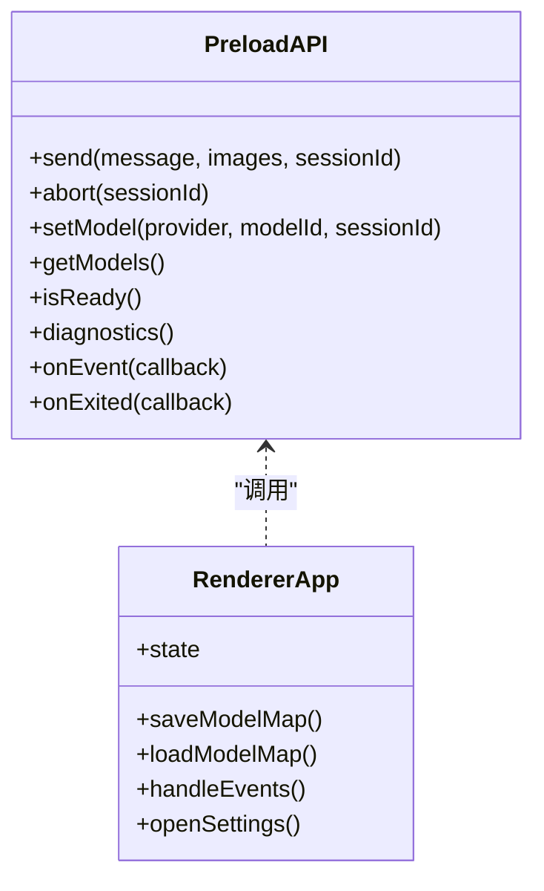
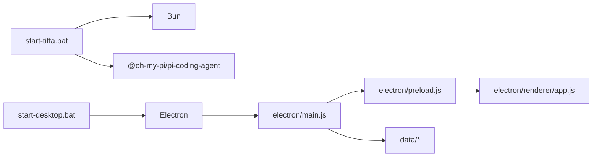

# 故障排除

<cite>
**本文引用的文件**   
- [README.md](file://README.md)
- [start-tiffa.bat](file://start-tiffa.bat)
- [start-desktop.bat](file://start-desktop.bat)
- [install.ps1](file://install.ps1)
- [electron/main.js](file://electron/main.js)
- [electron/preload.js](file://electron/preload.js)
- [electron/renderer/index.html](file://electron/renderer/index.html)
- [electron/renderer/app.js](file://electron/renderer/app.js)
- [data/agent/config.yml](file://data/agent/config.yml)
</cite>

## 目录
1. [简介](#简介)
2. [项目结构](#项目结构)
3. [核心组件](#核心组件)
4. [架构总览](#架构总览)
5. [详细组件分析](#详细组件分析)
6. [依赖关系分析](#依赖关系分析)
7. [性能与资源优化](#性能与资源优化)
8. [常见问题与解决方案](#常见问题与解决方案)
9. [日志查看与分析](#日志查看与分析)
10. [调试工具与诊断命令](#调试工具与诊断命令)
11. [问题收集与提交 Bug](#问题收集与提交-bug)
12. [结论](#结论)

## 简介
本指南面向 Tiffa 用户与维护者，聚焦启动失败、模型加载错误、内存不足、权限问题等常见故障的诊断与修复；提供日志定位方法、调试工具使用建议，以及性能优化与资源释放的最佳实践。文档内容基于仓库中的启动脚本、Electron 主进程、预加载桥接、渲染层与配置文件的实现进行归纳总结。

## 项目结构
Tiffa 采用“Electron 桌面壳 + Bun 运行时内核”的架构：
- Electron 主进程负责窗口管理、子进程生命周期、IPC 路由与实例管理
- Bun 运行 Tiffa 内核（pi-coding-agent），通过 JSONL 事件流与主进程通信
- 渲染层通过 preload 暴露受控 API，处理 UI 交互与状态
- 数据与配置集中在 data 目录，支持便携模式

**图表来源** 
- [electron/main.js:1-120](file://electron/main.js#L1-L120)
- [electron/preload.js:1-60](file://electron/preload.js#L1-L60)
- [electron/renderer/index.html:1-40](file://electron/renderer/index.html#L1-L40)
- [start-tiffa.bat:1-60](file://start-tiffa.bat#L1-L60)

**章节来源**
- [README.md:190-214](file://README.md#L190-L214)
- [start-tiffa.bat:1-60](file://start-tiffa.bat#L1-L60)
- [start-desktop.bat:1-25](file://start-desktop.bat#L1-L25)

## 核心组件
- 启动脚本与环境准备
  - start-tiffa.bat：设置环境变量、检测依赖、创建必要目录、从模板生成 models.yml、选择运行模式（tui/web/rpc）
  - install.ps1：安装 Node/Bun/Tiffa 内核、初始化目录与默认配置、创建桌面快捷方式
- Electron 主进程
  - 子进程生命周期管理（启动、退出、自动重启、强制终止）
  - JSONL 事件解析、stderr 捕获、UTF-8 环境注入
  - 多实例管理器（LRU 淘汰、会话级实例隔离）
  - IPC 路由（发送消息、切换模型、获取状态、重启内核）
- 预加载桥接
  - 暴露 tiffaDesktop API 给渲染进程，封装 IPC 调用
- 渲染层
  - 会话/项目管理、消息缓冲、UI 状态、模型配置编辑与保存、重启内核入口

**章节来源**
- [start-tiffa.bat:1-151](file://start-tiffa.bat#L1-L151)
- [install.ps1:1-186](file://install.ps1#L1-L186)
- [electron/main.js:70-180](file://electron/main.js#L70-L180)
- [electron/preload.js:24-105](file://electron/preload.js#L24-L105)
- [electron/renderer/app.js:90-160](file://electron/renderer/app.js#L90-L160)

## 架构总览
下图展示从双击启动到内核就绪的关键流程，包括环境变量注入、子进程启动、事件预热与自动重启策略。

**图表来源** 
- [start-tiffa.bat:120-151](file://start-tiffa.bat#L120-L151)
- [electron/main.js:94-179](file://electron/main.js#L94-L179)
- [electron/preload.js:24-60](file://electron/preload.js#L24-L60)
- [electron/renderer/app.js:90-160](file://electron/renderer/app.js#L90-L160)

## 详细组件分析

### 启动与子进程管理（Electron 主进程）
- 关键职责
  - 设置 UTF-8 环境变量，避免中文乱码
  - 启动 Tiffa 内核子进程，逐行解析 stdout JSONL 事件
  - 监听 stderr 并输出到控制台
  - 处理进程退出：拒绝挂起 Promise、清理资源、自动重启（非用户主动 kill、非零退出码、未超限）
  - 多实例管理：按 cwd#sessionId 键值区分，LRU 淘汰最久未活跃实例
- 典型问题定位
  - 启动失败：检查 BUN_EXE 与 TIFFA_CLI 路径是否存在
  - 事件无法解析：stdout 非 JSONL 或编码异常
  - 进程频繁退出：关注 exit code/signal、crashCount、是否被用户 kill

**图表来源** 
- [electron/main.js:50-179](file://electron/main.js#L50-L179)

**章节来源**
- [electron/main.js:50-179](file://electron/main.js#L50-L179)

### 预加载桥接与渲染层
- 预加载桥接
  - 暴露 tiffaDesktop.send/abort/setModel/getModels/isReady/diagnostics 等方法
  - 事件订阅：onEvent/onExited
- 渲染层
  - 维护会话/项目状态、消息缓冲、模型映射持久化
  - 提供设置面板读写 models.yml、重启内核入口

**图表来源** 
- [electron/preload.js:24-105](file://electron/preload.js#L24-L105)
- [electron/renderer/app.js:90-200](file://electron/renderer/app.js#L90-L200)

**章节来源**
- [electron/preload.js:24-105](file://electron/preload.js#L24-L105)
- [electron/renderer/app.js:90-200](file://electron/renderer/app.js#L90-L200)

### 配置与模型管理
- config.yml：定义模型角色、Mnemopi 记忆后端与参数、工具审批模式
- models.yml：供应商与模型端点、API Key 等（由 install/start 脚本辅助创建/读取）
- 渲染层提供读写 models.yml 的能力，并在变更后触发内核重启

**章节来源**
- [data/agent/config.yml:1-30](file://data/agent/config.yml#L1-L30)
- [electron/main.js:955-999](file://electron/main.js#L955-L999)

## 依赖关系分析
- 外部依赖
  - Bun：运行时与包管理
  - Electron：桌面应用框架
  - @oh-my-pi/pi-coding-agent：Tiffa 内核
- 内部模块耦合
  - main.js 依赖 preload.js 暴露的 IPC 通道
  - renderer/app.js 依赖 preload.js 的 tiffaDesktop API
  - 启动脚本依赖 install.ps1 生成的目录结构与配置文件

**图表来源** 
- [start-tiffa.bat:1-60](file://start-tiffa.bat#L1-L60)
- [start-desktop.bat:1-25](file://start-desktop.bat#L1-L25)
- [electron/main.js:1-120](file://electron/main.js#L1-L120)
- [electron/preload.js:1-60](file://electron/preload.js#L1-L60)
- [electron/renderer/app.js:1-60](file://electron/renderer/app.js#L1-L60)

**章节来源**
- [install.ps1:1-186](file://install.ps1#L1-L186)
- [start-tiffa.bat:1-60](file://start-tiffa.bat#L1-L60)
- [start-desktop.bat:1-25](file://start-desktop.bat#L1-L25)

## 性能与资源优化
- 内存管理
  - embedding 预热：启动后延迟触发 /memory rebuild，避免首次冷加载导致超时
  - LRU 实例淘汰：超过 MAX_INSTANCES（默认 8）时关闭最久未活跃的实例
  - 会话消息缓存：切换会话时缓存 DOM 子树，减少重绘开销
- 进程清理
  - 退出时拒绝 pendingCommands，避免 Promise 永久挂起
  - Windows 下使用 taskkill /T /F 确保子进程树被清理
- 资源释放
  - readline 接口关闭、process 引用置空
  - 重启前备份 models.yml，避免配置损坏影响运行

**章节来源**
- [electron/main.js:250-319](file://electron/main.js#L250-L319)
- [electron/main.js:325-570](file://electron/main.js#L325-L570)
- [electron/renderer/app.js:120-200](file://electron/renderer/app.js#L120-L200)

## 常见问题与解决方案

### 启动失败
- 症状
  - 双击无反应或立即退出
  - 控制台提示找不到 Bun 或 Tiffa 内核
- 排查步骤
  - 确认 npm-global 目录下存在 bun.exe 与 pi-coding-agent
  - 检查 start-tiffa.bat 中 BUN_EXE 与 TIFFA_CLI 路径是否正确
  - 若首次运行，确认 models.yml 已根据模板创建
- 解决方案
  - 重新运行 install.ps1 安装依赖
  - 手动创建缺失目录与 models.yml
  - 以管理员权限运行 PowerShell 安装脚本

**章节来源**
- [start-tiffa.bat:35-60](file://start-tiffa.bat#L35-L60)
- [install.ps1:100-146](file://install.ps1#L100-L146)

### 模型加载错误
- 症状
  - 启动后长时间无响应或报错
  - 设置面板无法列出可用模型
- 排查步骤
  - 检查 data/agent/models.yml 语法与必填字段
  - 确认网络可达（云端模型）或本地模型路径正确
  - 观察主进程 stderr 是否有 YAML 解析错误
- 解决方案
  - 在设置面板编辑 models.yml 并保存
  - 点击“重启 Tiffa”使配置生效
  - 如为本地模型，确认路径与权限无误

**章节来源**
- [electron/main.js:955-999](file://electron/main.js#L955-L999)
- [electron/renderer/app.js:180-200](file://electron/renderer/app.js#L180-L200)

### 内存不足
- 症状
  - 进程频繁崩溃或卡顿
  - 对话切换缓慢
- 排查步骤
  - 观察实例数量是否超过上限（MAX_INSTANCES=8）
  - 检查 embedding 预热是否完成（isPrewarming 标志）
  - 查看系统内存占用与页面文件使用情况
- 解决方案
  - 关闭不活跃会话与项目实例
  - 减少同时打开的预览/图片数量
  - 调整系统虚拟内存大小

**章节来源**
- [electron/main.js:325-570](file://electron/main.js#L325-L570)
- [electron/main.js:250-319](file://electron/main.js#L250-L319)

### 权限问题
- 症状
  - 无法写入 data 目录或 workspace
  - 文件操作失败
- 排查步骤
  - 确认当前用户对 data/workspace/home 有读写权限
  - 检查防病毒软件或企业策略是否拦截
- 解决方案
  - 以管理员权限运行
  - 将 Tiffa 目录移动到用户可写路径（如桌面或文档）

**章节来源**
- [install.ps1:100-146](file://install.ps1#L100-L146)
- [electron/main.js:955-999](file://electron/main.js#L955-L999)

## 日志查看与分析
- 主进程控制台输出
  - 启动信息、stderr 内容、事件解析警告、进程退出详情
  - 关键字段：cwd、sessionId、code、signal、userKilled、crashCount
- 会话日志
  - sessions 目录下 .jsonl 文件记录消息与工具调用
  - 可通过内置导出功能生成 HTML 便于阅读
- 分析方法
  - 过滤关键词：error、exit、stderr、JSON parse error
  - 关联时间戳与用户操作序列
  - 结合 models.yml 变更历史定位配置问题

**章节来源**
- [electron/main.js:137-179](file://electron/main.js#L137-L179)
- [electron/main.js:1770-1860](file://electron/main.js#L1770-L1860)

## 调试工具与诊断命令
- 诊断命令
  - tiffa:diagnostics：返回实例就绪状态、PID、stdin 可写性、待处理命令数
  - tiffa:getState：获取内核状态
  - tiffa:setModel：切换模型
  - tiffa:restart：重启所有实例（配置变更后）
- 调试模式
  - Electron 启动参数 --dev 或 --verbose 打开开发者工具
  - 控制台查看 stderr 与 warn/error 日志

**章节来源**
- [electron/main.js:752-770](file://electron/main.js#L752-L770)
- [electron/main.js:984-999](file://electron/main.js#L984-L999)
- [electron/renderer/index.html:180-200](file://electron/renderer/index.html#L180-L200)

## 问题收集与提交 Bug
- 收集信息
  - 主进程控制台完整输出（含 stderr）
  - 最近一次会话的 .jsonl 日志
  - models.yml 与 config.yml 内容（脱敏）
  - 操作系统版本与权限情况
- 提交渠道
  - GitHub Issues（附上述信息）
  - 社区论坛或讨论组（描述复现步骤与期望行为）
- 最佳实践
  - 最小化复现步骤
  - 标注问题发生时间与操作序列
  - 附上相关截图或录屏

[本节为通用指导，无需特定文件引用]

## 结论
通过理解 Tiffa 的启动流程、子进程管理与事件机制，用户可以快速定位启动失败、模型加载错误、内存不足与权限问题。利用内置诊断命令与日志分析能力，结合性能优化建议，可有效提升稳定性与用户体验。遇到问题时，按规范收集信息并提交，有助于社区快速响应与修复。