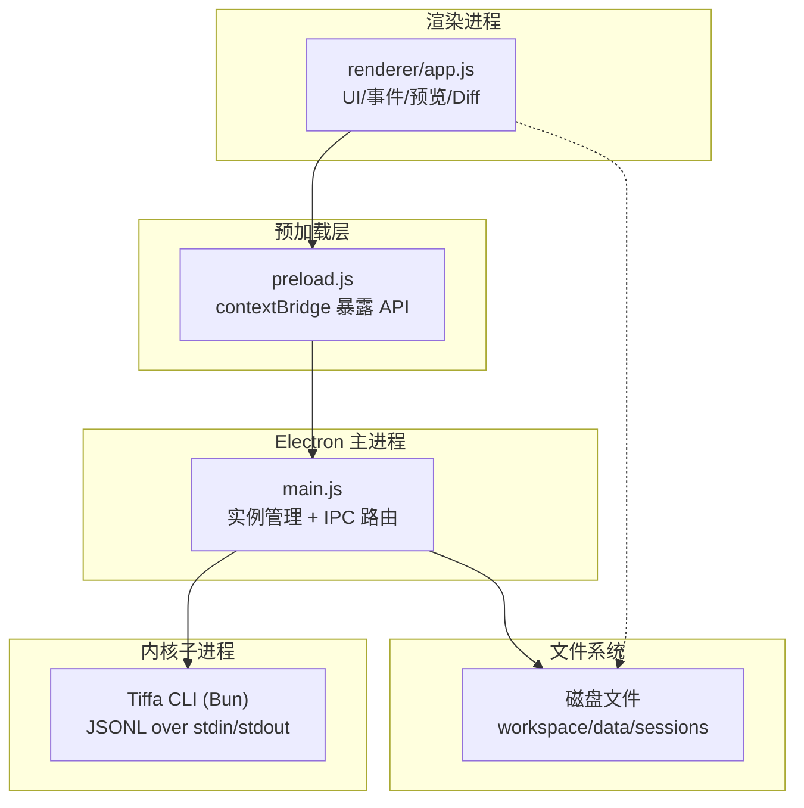
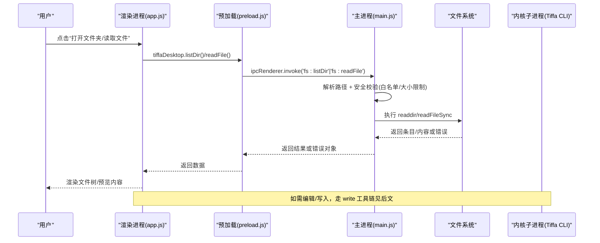
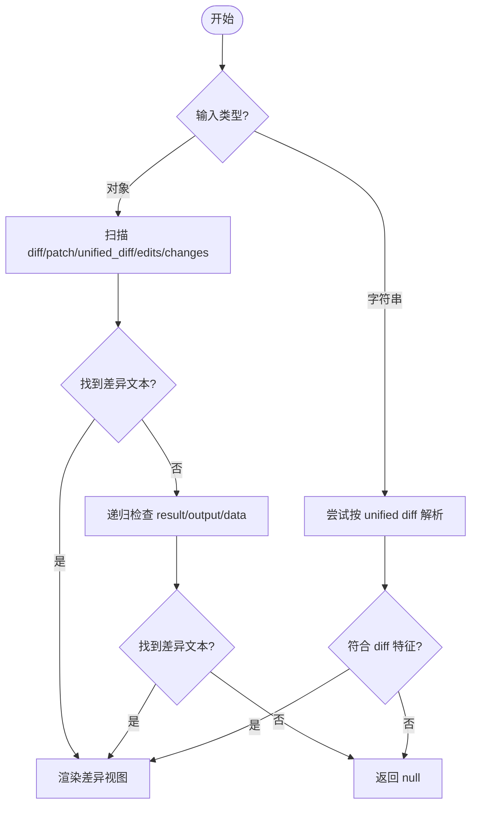
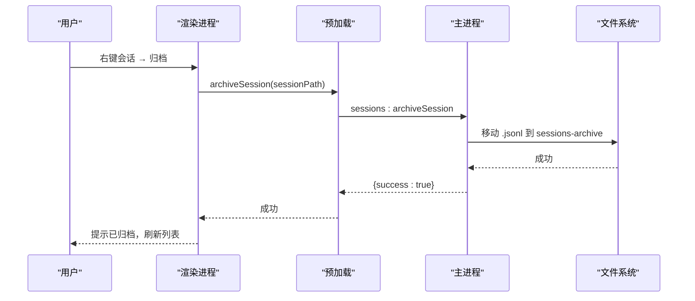
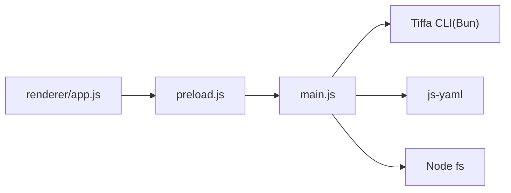

# 文件操作

<cite>
**本文引用的文件**   
- [README.md](file://README.md)
- [AGENTS.md](file://AGENTS.md)
- [electron/main.js](file://electron/main.js)
- [electron/preload.js](file://electron/preload.js)
- [electron/renderer/app.js](file://electron/renderer/app.js)
</cite>

## 目录
1. [简介](#简介)
2. [项目结构](#项目结构)
3. [核心组件](#核心组件)
4. [架构总览](#架构总览)
5. [详细组件分析](#详细组件分析)
6. [依赖关系分析](#依赖关系分析)
7. [性能考量](#性能考量)
8. [故障排查指南](#故障排查指南)
9. [结论](#结论)
10. [附录](#附录)

## 简介
本文件面向 Tiffa 桌面端“文件操作”能力，系统性说明文件系统访问的安全策略、权限控制与沙箱机制；深入解释文件预览、实时编辑支持、Diff 视图的技术实现；并覆盖文件树导航、批量操作、版本控制集成（会话归档/恢复）、工作区管理、项目结构组织与文件同步机制。文末提供最佳实践与安全建议，帮助在弱模型与本地优先的约束下安全高效地操作文件。

## 项目结构
Tiffa 采用 Electron 多进程架构：主进程负责实例管理与 IPC 路由，预加载脚本暴露受控 API，渲染进程承载 UI 与交互逻辑。文件操作通过主进程的 fs IPC 接口完成，渲染进程仅通过 preload 暴露的最小化 API 访问。

图表来源
- [electron/main.js:577-612](file://electron/main.js#L577-L612)
- [electron/preload.js:24-132](file://electron/preload.js#L24-L132)
- [electron/renderer/app.js:378-481](file://electron/renderer/app.js#L378-L481)

章节来源
- [README.md:161-207](file://README.md#L161-L207)
- [AGENTS.md:158-207](file://AGENTS.md#L158-L207)

## 核心组件
- 主进程实例管理器：TiffaInstanceManager 维护多实例（项目级/对话级），懒启动、LRU 淘汰、崩溃自动重启、stall 检测。
- IPC 桥接：preload.js 通过 contextBridge 暴露最小化 API（fs:listDir/readFile/writeFile/readImage、sessions、models、workspace 等）。
- 渲染进程 UI：app.js 处理消息流、文件树、预览、Diff、会话标签、历史面板、主题与状态管理。
- 内核子进程：通过 JSONL 协议与 Tiffa CLI 通信，事件驱动渲染更新。

章节来源
- [electron/main.js:325-570](file://electron/main.js#L325-L570)
- [electron/preload.js:24-132](file://electron/preload.js#L24-L132)
- [electron/renderer/app.js:94-154](file://electron/renderer/app.js#L94-L154)

## 架构总览
下图展示从用户操作到文件读写的完整链路，包括安全校验、路径白名单、大小限制与错误回传。

图表来源
- [electron/preload.js:47-51](file://electron/preload.js#L47-L51)
- [electron/main.js:826-856](file://electron/main.js#L826-L856)

章节来源
- [electron/main.js:826-910](file://electron/main.js#L826-L910)
- [electron/preload.js:47-51](file://electron/preload.js#L47-L51)

## 详细组件分析

### 安全策略与权限控制
- 路径白名单与根限制
  - 所有 fs 操作均基于 path.resolve 解析绝对路径，并在主进程中统一校验，避免越权访问。
  - 列表目录默认使用 currentWorkspaceDir，防止任意路径枚举。
- 文件大小限制
  - readFile 强制 5MB 上限，避免大文件导致内存抖动与卡顿。
- 沙箱与最小权限
  - 渲染进程禁用 nodeIntegration，仅通过 preload 暴露必要 API。
  - 主进程窗口配置 sandbox=false 仅为 preload 能访问 fs，但实际读写集中在主进程，渲染侧不可直接调用 Node fs。
- 危险路径拦截（扩展 Hook）
  - 通过扩展 tool_call hook 拦截 System32/Windows/Program Files、配置文件自改、workspace 根新建一级子目录等高危操作。
- 审批模式（approvalMode）
  - 前端可切换 normal/auto/yolo，映射为内核 tools.approvalMode，控制写操作的确认策略。

章节来源
- [electron/main.js:577-592](file://electron/main.js#L577-L592)
- [electron/main.js:826-856](file://electron/main.js#L826-L856)
- [AGENTS.md:98-111](file://AGENTS.md#L98-L111)
- [electron/main.js:1052-1073](file://electron/main.js#L1052-L1073)

### 文件预览与实时编辑
- 文件树导航
  - listDir 返回目录项（名称、路径、是否目录、大小、扩展名），按目录优先+字母序排序。
- 图片预览
  - readImage 将图片转 base64 并附带 MIME，供渲染进程直接显示。
- 文本预览
  - readFile 以 UTF-8 读取文本，超过 5MB 拒绝。
- 实时编辑支持
  - 渲染进程不直接写盘，写操作由内核工具链（write/edit）完成，并通过 tool_execution_* 事件在 UI 中呈现参数与结果。
  - 对包含 diff 的结果，自动识别并渲染 Diff 视图。

章节来源
- [electron/main.js:826-846](file://electron/main.js#L826-L846)
- [electron/main.js:894-910](file://electron/main.js#L894-L910)
- [electron/renderer/app.js:2320-2375](file://electron/renderer/app.js#L2320-L2375)

### Diff 视图技术细节
- 差异提取
  - extractDiff 兼容多种字段名（diff/patch/unified_diff/unifiedDiff/edits/changes），并递归查找 result/output/data。
  - looksLikeDiff 通过正则匹配 unified diff 特征（--- /+++ /@@ /[-+] 行）。
- 渲染规则
  - renderDiffView 逐行着色：上下文、hunk、新增、删除分别对应不同 CSS 类。
- 集成点
  - 工具调用结果若包含 diff，则在 ToolCard 正文下方渲染差异视图，便于审阅变更。

图表来源
- [electron/renderer/app.js:2252-2294](file://electron/renderer/app.js#L2252-L2294)

章节来源
- [electron/renderer/app.js:2252-2294](file://electron/renderer/app.js#L2252-L2294)

### 文件树导航与批量操作
- 文件树
  - 左侧栏文件树通过 listDir 获取目录结构，支持展开/折叠与刷新。
- 批量操作
  - 当前仓库未实现“批量重命名/移动”等专用批量工具，批量行为通常由内核工具链组合多个 write/edit 命令完成。
  - 会话/项目级别的批量：归档/恢复/删除（见下文“版本控制集成”）。

章节来源
- [electron/main.js:826-846](file://electron/main.js#L826-L846)
- [electron/renderer/app.js:800-851](file://electron/renderer/app.js#L800-L851)

### 版本控制集成（会话归档/恢复）
- 会话归档与恢复
  - sessions:archiveSession/deleteSession/listArchivedSessions/restoreSession 等 IPC 接口支持单会话级别归档与恢复。
- 项目归档与恢复
  - sessions:archiveProject/deleteProject/listArchived/restoreProject 支持项目级归档与恢复。
- 会话持久化与标签恢复
  - 顶栏会话标签持久化到 localStorage，重启后可恢复最近打开的会话。

图表来源
- [electron/main.js:2077-2106](file://electron/main.js#L2077-L2106)
- [electron/renderer/app.js:1370-1434](file://electron/renderer/app.js#L1370-L1434)

章节来源
- [electron/main.js:1960-2106](file://electron/main.js#L1960-L2106)
- [electron/renderer/app.js:1370-1434](file://electron/renderer/app.js#L1370-L1434)

### 工作区管理与项目结构组织
- 工作区选择与切换
  - workspace:openFolderDialog 选择项目文件夹（不允许选择 workspace 根目录本身）。
  - workspace:change 激活实例（懒启动/复用），自动创建不存在的项目目录（workspace 下）。
- 项目注册与发现
  - discoverWorkspaceProjects 自动扫描 workspace 子目录并注册到 projects.json。
  - migrateSessionDirsForNewRoot 迁移旧盘符/根路径变化导致的会话目录，确保跨设备便携。
- 会话与历史
  - sessions:listSessions 列出项目下的会话（按文件名时间排序）。
  - loadAndRenderHistory 加载历史消息并渲染，支持缓存与懒高亮。

章节来源
- [electron/main.js:1078-1124](file://electron/main.js#L1078-L1124)
- [electron/main.js:1574-1593](file://electron/main.js#L1574-L1593)
- [electron/main.js:1439-1550](file://electron/main.js#L1439-L1550)
- [electron/main.js:1721-1737](file://electron/main.js#L1721-L1737)
- [electron/renderer/app.js:1773-1818](file://electron/renderer/app.js#L1773-L1818)

### 文件同步机制
- 事件驱动同步
  - 内核子进程通过 JSONL 事件（ready/prompt_result/agent_start/agent_end/tool_execution_*）驱动渲染进程更新。
- 会话状态同步
  - session_switch 事件用于切换会话时更新标题、活跃会话 ID 与标签状态。
- 首次响应与卡住检测
  - 首次响应超时与 2 分钟无事件检测，保障长时间任务的可观测性。

章节来源
- [electron/renderer/app.js:484-646](file://electron/renderer/app.js#L484-L646)
- [electron/renderer/app.js:648-701](file://electron/renderer/app.js#L648-L701)

## 依赖关系分析
- 模块耦合
  - 渲染进程依赖 preload 暴露的 API，不直接访问 Node fs。
  - 主进程集中处理 fs 与内核子进程通信，降低渲染进程风险面。
- 外部依赖
  - Bun 作为内核运行时，Tiffa CLI 通过 JSONL 协议通信。
  - JS-YAML 用于 models.yml/config.yml 读写。
- 潜在循环依赖
  - 主进程与渲染进程通过 IPC 单向通信，无循环依赖。

图表来源
- [electron/preload.js:24-132](file://electron/preload.js#L24-L132)
- [electron/main.js:1-30](file://electron/main.js#L1-L30)

章节来源
- [electron/preload.js:24-132](file://electron/preload.js#L24-L132)
- [electron/main.js:1-30](file://electron/main.js#L1-L30)

## 性能考量
- 大文件保护
  - readFile 限制 5MB，避免内存峰值过高。
- 懒加载与缓存
  - 会话历史加载使用 DocumentFragment 批量插入，减少 DOM 重排。
  - 会话消息 DOM 缓存（最多 3 份）提升切换速度。
- 代码块懒高亮
  - IntersectionObserver 仅在进入视口时执行 hljs 高亮，避免长会话卡顿。
- 实例生命周期
  - LRU 淘汰与 stall 检测，避免过多实例占用资源。

章节来源
- [electron/main.js:848-856](file://electron/main.js#L848-L856)
- [electron/renderer/app.js:1794-1818](file://electron/renderer/app.js#L1794-L1818)
- [electron/renderer/app.js:2109-2158](file://electron/renderer/app.js#L2109-L2158)
- [electron/main.js:536-552](file://electron/main.js#L536-L552)

## 故障排查指南
- 无法读取目录/文件
  - 检查路径是否在允许范围内（currentWorkspaceDir），确认文件存在且大小不超过限制。
- 预览空白或乱码
  - 确认编码为 UTF-8；Windows 环境下主进程注入 UTF-8 环境变量治理中文输出。
- 会话切换卡顿
  - 查看是否触发大量 hljs 高亮；确认懒高亮生效，必要时清理缓存。
- 进程崩溃/无响应
  - 观察主进程日志中的退出码与信号；检查是否达到自动重启上限；确认网络/模型服务可达。

章节来源
- [electron/main.js:50-66](file://electron/main.js#L50-L66)
- [electron/main.js:144-173](file://electron/main.js#L144-L173)
- [electron/renderer/app.js:648-701](file://electron/renderer/app.js#L648-L701)

## 结论
Tiffa 的文件操作体系以“主进程集中管控 + 渲染进程最小权限”为核心，结合路径白名单、大小限制、审批模式与扩展 Hook 的危险操作拦截，构建了稳健的安全边界。文件预览与 Diff 视图提升了可读性与可审性；会话/项目的归档与恢复提供了轻量版版本管理能力。配合懒加载、缓存与实例生命周期优化，整体在弱模型与本地优先场景下具备良好可用性与安全性。

## 附录
- 最佳实践
  - 始终通过 preload 暴露的 API 进行文件操作，避免绕过主进程校验。
  - 大文件先判断大小再读取，必要时分块或流式处理。
  - 写操作前启用合适的 approvalMode，重要变更保留会话归档。
  - 利用 Diff 视图审阅变更，避免误覆盖。
- 安全建议
  - 不要修改主进程 IPC 路由逻辑；保持 sandbox 与 contextIsolation 开启。
  - 谨慎添加自定义 fs 接口，遵循最小权限原则。
  - 定期清理归档与临时文件，控制磁盘占用。