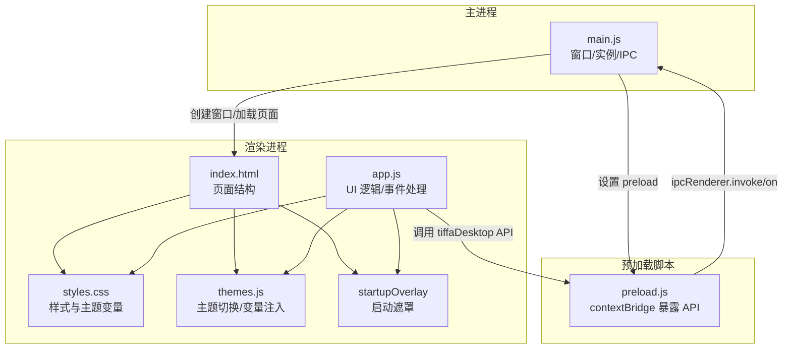
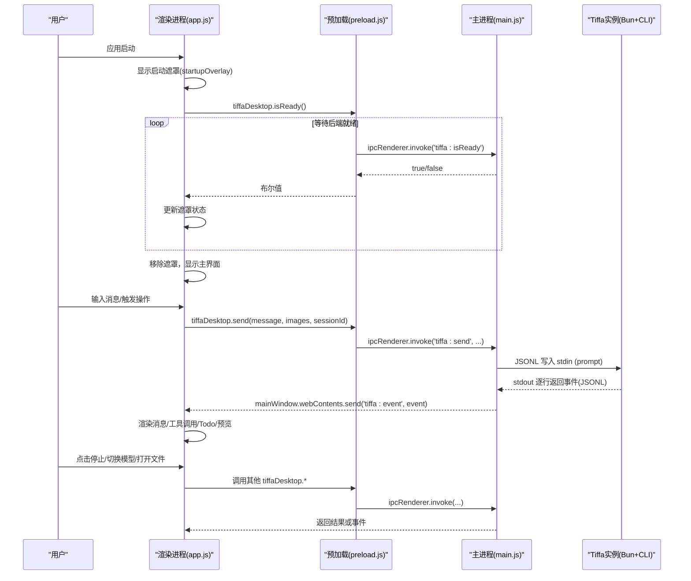
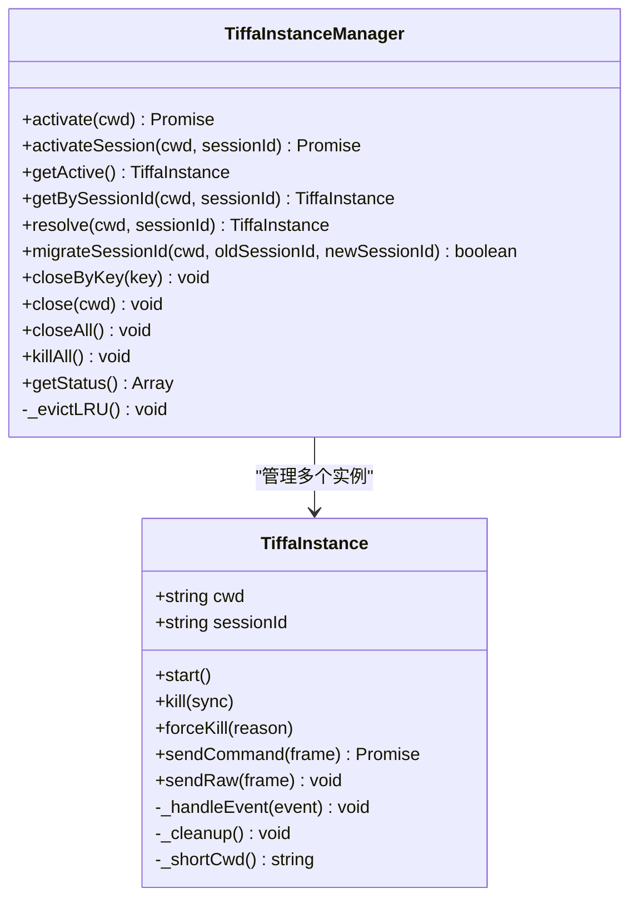
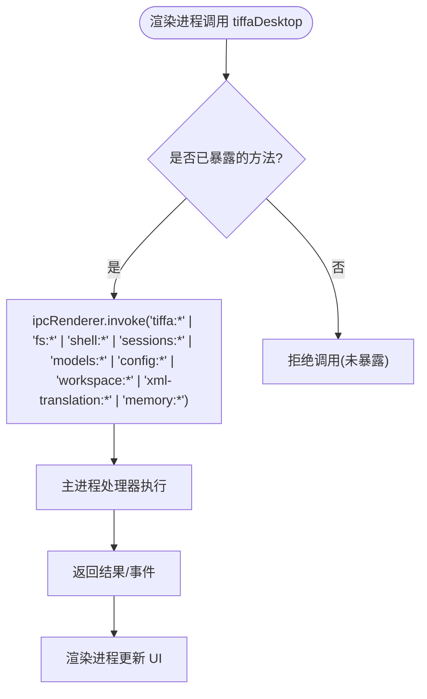
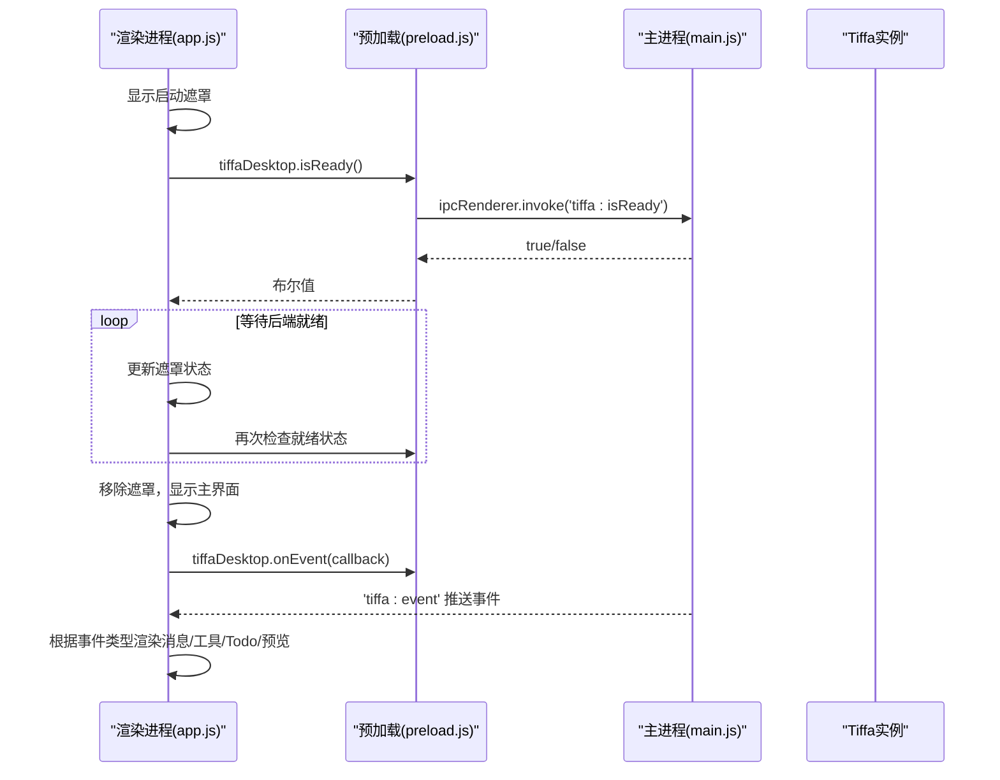
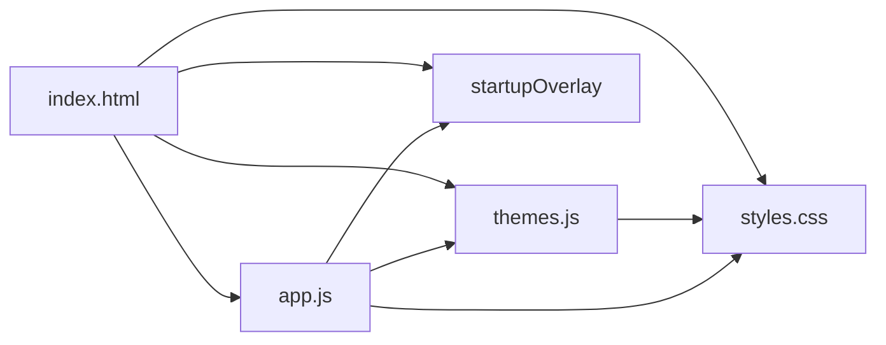
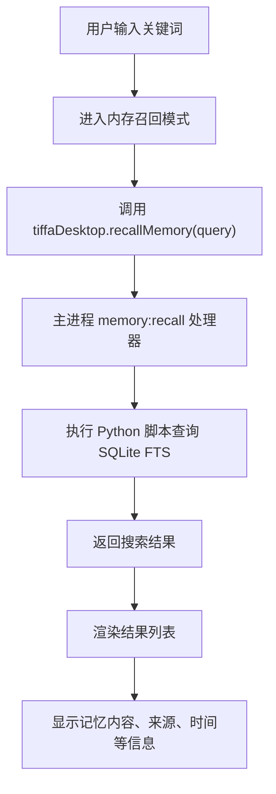
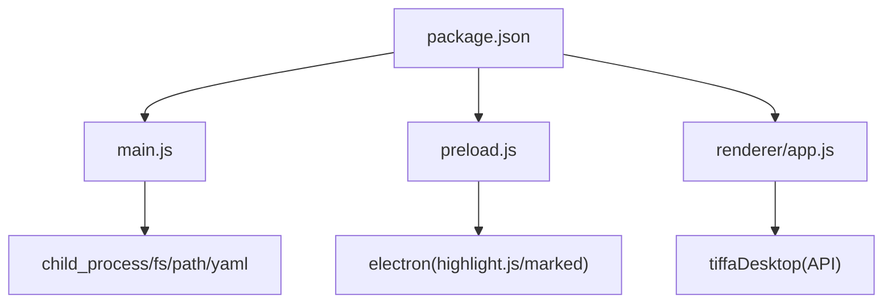

# Electron应用架构

<cite>
**本文引用的文件**   
- [electron/main.js](file://electron/main.js)
- [electron/preload.js](file://electron/preload.js)
- [electron/renderer/app.js](file://electron/renderer/app.js)
- [electron/renderer/index.html](file://electron/renderer/index.html)
- [electron/renderer/styles.css](file://electron/renderer/styles.css)
- [electron/renderer/themes.js](file://electron/renderer/themes.js)
- [electron/package.json](file://electron/package.json)
- [README.md](file://README.md)
</cite>

## 更新摘要
**所做更改**   
- 增强了主进程实例生命周期管理，支持会话ID迁移和崩溃重启上下文恢复
- 实现了内存召回功能，直接查询mnemopi SQLite FTS数据库
- 优化了环境路径配置，支持便携模式下的盘符迁移和数据修复
- 完善了启动遮罩机制，确保后端就绪后再允许用户操作
- 改进了多对话实例管理，支持每个对话独立进程隔离

## 目录
1. [简介](#简介)
2. [项目结构](#项目结构)
3. [核心组件](#核心组件)
4. [架构总览](#架构总览)
5. [详细组件分析](#详细组件分析)
6. [依赖关系分析](#依赖关系分析)
7. [性能考量](#性能考量)
8. [故障排查指南](#故障排查指南)
9. [结论](#结论)
10. [附录](#附录)

## 简介
本文件系统化阐述 Tiffa Electron 应用的架构与实现，重点覆盖：
- 主进程（main.js）、渲染进程（renderer/app.js）与预加载脚本（preload.js）的职责分离与安全模型
- BrowserWindow 配置、上下文隔离（contextIsolation）与沙箱模式的安全策略
- 渲染进程的 HTML/CSS/JS 结构与主题系统、样式管理、用户交互逻辑
- 预加载脚本如何安全暴露 Node.js API 给渲染进程
- 三进程通信关系与数据流向的架构图
- 面向初学者的 Electron 基础概念，以及面向高级开发者的安全最佳实践与性能优化建议

**最新更新**：增强了主进程实例生命周期管理，实现了会话ID迁移、崩溃重启上下文恢复、内存召回功能和环境路径配置优化。

## 项目结构
Tiffa 采用典型的 Electron 多进程架构：
- 主进程：负责窗口生命周期、子进程管理、IPC 路由与系统能力访问
- 预加载脚本：作为受信任桥接层，通过 contextBridge 向渲染进程暴露最小化、受控的 API
- 渲染进程：基于 HTML/CSS/JS 构建 UI，处理用户交互与事件渲染

**图表来源** 
- [electron/main.js:775-826](file://electron/main.js#L775-L826)
- [electron/preload.js:24-134](file://electron/preload.js#L24-L134)
- [electron/renderer/index.html:13-19](file://electron/renderer/index.html#L13-L19)
- [electron/renderer/styles.css:1-200](file://electron/renderer/styles.css#L1-L200)
- [electron/renderer/themes.js:1-200](file://electron/renderer/themes.js#L1-L200)

**章节来源**
- [electron/main.js:775-826](file://electron/main.js#L775-L826)
- [electron/package.json:1-75](file://electron/package.json#L1-L75)
- [README.md:1-207](file://README.md#L1-L207)

## 核心组件
- 主进程（main.js）
  - 窗口创建与配置（BrowserWindow），启用 contextIsolation，禁用 nodeIntegration，按需开启 sandbox=false 以便通过 preload 访问文件系统
  - 子进程管理：启动并维护 Tiffa 内核进程（Bun + CLI），JSONL 协议通信，自动重启与 LRU 淘汰
  - IPC 路由：将渲染进程请求转发到对应实例，统一事件分发
  - **新增**：会话ID迁移、崩溃重启上下文恢复、内存召回功能
- 预加载脚本（preload.js）
  - 使用 contextBridge.exposeInMainWorld 暴露最小化 API（tiffaDesktop）
  - 封装 ipcRenderer.invoke/on，屏蔽底层通道名，限制可调用方法
  - 内置 Markdown 渲染与代码高亮能力（marked + highlight.js）
- 渲染进程（renderer/app.js）
  - 全局状态管理、事件路由、会话与项目管理、消息流式渲染、工具调用面板、Todo 面板、预览面板等
  - 主题切换、样式管理、Minimap 滚动条、拖拽图片上传、输入框行为等
  - 与 tiffaDesktop 交互完成所有系统级操作
  - **新增**：启动遮罩显示后端就绪状态，改进会话切换逻辑，内存召回模式

**章节来源**
- [electron/main.js:775-826](file://electron/main.js#L775-L826)
- [electron/preload.js:24-134](file://electron/preload.js#L24-L134)
- [electron/renderer/app.js:387-524](file://electron/renderer/app.js#L387-L524)

## 架构总览
下图展示三个进程间的通信关系与数据流向。主进程负责实例管理与 IPC，预加载脚本提供受控 API，渲染进程专注 UI 与交互。

**图表来源** 
- [electron/main.js:830-1072](file://electron/main.js#L830-L1072)
- [electron/preload.js:24-134](file://electron/preload.js#L24-L134)
- [electron/renderer/app.js:486-524](file://electron/renderer/app.js#L486-L524)

## 详细组件分析

### 主进程（main.js）职责与安全策略
- 窗口配置
  - 启用 contextIsolation=true，nodeIntegration=false，sandbox=false（允许通过 preload 访问 fs）
  - 隐藏原生菜单栏，按需打开 DevTools
- 子进程管理
  - TiffaInstance：启动 Bun CLI，stdin/stdout JSONL 协议，readline 解析，错误与退出处理，自动重启（最多 3 次）
  - TiffaInstanceManager：LRU 淘汰，按 cwd#sessionId 键管理实例，支持激活/关闭/查询状态
  - **新增**：会话ID迁移机制，崩溃重启后上下文恢复，内存召回功能
- IPC 路由
  - 统一 handle('tiffa:*') 通道，转发到对应实例；事件通过 webContents.send('tiffa:event', event) 推送渲染进程
  - 特殊命令拦截（如 /omfg）生成规则提示，增强约束
  - **新增**：memory:recall 通道直接查询 mnemopi SQLite FTS 数据库

**图表来源** 
- [electron/main.js:121-435](file://electron/main.js#L121-L435)
- [electron/main.js:441-768](file://electron/main.js#L441-L768)

**章节来源**
- [electron/main.js:775-826](file://electron/main.js#L775-L826)
- [electron/main.js:121-435](file://electron/main.js#L121-L435)
- [electron/main.js:441-768](file://electron/main.js#L441-L768)
- [electron/main.js:830-1072](file://electron/main.js#L830-L1072)

### 预加载脚本（preload.js）安全桥接
- 通过 contextBridge.exposeInMainWorld('tiffaDesktop', {...}) 暴露受控 API
- 仅暴露必要方法：发送消息、中止、模型管理、文件系统读取/写入、外部路径打开、会话/项目管理、Markdown 渲染等
- 使用 ipcRenderer.invoke/on 与主进程通信，屏蔽底层通道名，避免渲染进程直接访问敏感 API
- **新增**：内存召回 API（recallMemory）

**图表来源** 
- [electron/preload.js:24-134](file://electron/preload.js#L24-L134)

**章节来源**
- [electron/preload.js:24-134](file://electron/preload.js#L24-L134)

### 渲染进程（renderer/app.js）结构与交互
- 初始化流程
  - 获取工作区路径、初始化 Minimap、绑定本地文件链接打开、事件委托、设置输入/项目面板/会话标签/侧边栏/预览等
  - 监听 tiffaDesktop.onEvent 与 onExited，进行多对话实例事件路由与状态同步
- 事件处理
  - ready/prompt_result/agent_start/agent_end/message_* 等事件驱动 UI 更新
  - 卡住检测与首次响应超时提示，提升用户体验
- 主题与样式
  - 通过 themes.js 动态注入 CSS 变量，支持多套预设与日夜模式
  - styles.css 定义布局、颜色变量、组件样式
- **新增功能**：启动遮罩显示后端就绪状态，改进会话切换逻辑，内存召回模式

**图表来源** 
- [electron/renderer/app.js:387-524](file://electron/renderer/app.js#L387-L524)
- [electron/renderer/app.js:486-524](file://electron/renderer/app.js#L486-L524)

**章节来源**
- [electron/renderer/app.js:387-524](file://electron/renderer/app.js#L387-L524)
- [electron/renderer/app.js:527-741](file://electron/renderer/app.js#L527-L741)

### 渲染进程 HTML/CSS/JS 结构
- index.html
  - 定义应用骨架：左侧项目栏、顶部标题栏、会话标签、聊天区域、输入区、侧边栏（文件树/Todo/预览）、设置浮层、模型切换器等
  - 引入 styles.css、themes.js、app.js
  - **新增**：启动全屏遮罩（startupOverlay）用于显示后端就绪状态
- styles.css
  - 基于 HSL Token 的主题变量体系，兼容旧 hex 变量别名
  - 布局与组件样式，响应式与交互态
  - **新增**：启动遮罩样式定义
- themes.js
  - 多套主题预设（Eucalyptus、Claude、Breeze 等），light/dark 双配色
  - 运行时注入 CSS 变量到 :root，支持系统/手动切换

**图表来源** 
- [electron/renderer/index.html:1-261](file://electron/renderer/index.html#L1-L261)
- [electron/renderer/styles.css:1-200](file://electron/renderer/styles.css#L1-L200)
- [electron/renderer/themes.js:1-200](file://electron/renderer/themes.js#L1-L200)

**章节来源**
- [electron/renderer/index.html:1-261](file://electron/renderer/index.html#L1-L261)
- [electron/renderer/styles.css:1-200](file://electron/renderer/styles.css#L1-L200)
- [electron/renderer/themes.js:1-200](file://electron/renderer/themes.js#L1-L200)

### 新增功能：内存召回系统
- 主进程实现
  - memory:recall IPC 处理器，直接查询 mnemopi SQLite FTS 数据库
  - 支持全文搜索和模糊匹配，优先使用 FTS 索引，回退到 LIKE 查询
  - 跨项目搜索所有记忆库，返回相关结果排序
- 渲染进程实现
  - 内存召回模式切换，专用搜索界面
  - 结果展示包含内容、来源、时间戳、记忆库信息
  - 支持从项目记忆视图切换到全局搜索模式

**图表来源** 
- [electron/main.js:2535-2611](file://electron/main.js#L2535-L2611)
- [electron/renderer/app.js:3754-3825](file://electron/renderer/app.js#L3754-L3825)

**章节来源**
- [electron/main.js:2535-2611](file://electron/main.js#L2535-L2611)
- [electron/renderer/app.js:3754-3825](file://electron/renderer/app.js#L3754-L3825)

### 新增功能：会话ID迁移与环境路径配置
- 会话ID迁移机制
  - _extractSessionIdFromPath：从 sessionPath 提取 UUID
  - migrateSessionId：在 CLI 分配真实 sessionId 后迁移实例 key
  - 防止切回时查不到实例导致 spawn 新进程丢失上下文
- 环境路径配置优化
  - PORTABLE_ROOT 支持 CLI 参数、环境变量、默认路径三种方式
  - PATH 环境变量前置便携 python/node/bun，避免系统占位符冲突
  - UTF-8 环境变量注入解决中文乱码问题
- 启动时路径迁移
  - migrateSessionDirsForNewRoot：修复换电脑后盘符变化导致的数据丢失
  - extractWorkspaceSuffix：智能提取 workspace 相对路径后缀
  - 自动清理孤儿目录和重复项目条目

**章节来源**
- [electron/main.js:50-93](file://electron/main.js#L50-93)
- [electron/main.js:95-111](file://electron/main.js#L95-L111)
- [electron/main.js:1687-1841](file://electron/main.js#L1687-L1841)
- [electron/main.js:1808-1819](file://electron/main.js#L1808-L1819)

## 依赖关系分析
- package.json
  - 入口 main: electron/main.js
  - 依赖：electron、highlight.js、marked、yaml
  - 构建：electron-builder 打包为便携版，包含 npm-global、plugins、data、home、workspace 等资源
- 模块依赖
  - main.js 依赖 child_process、fs、path、js-yaml、yaml
  - preload.js 依赖 electron（contextBridge、ipcRenderer、clipboard、webUtils）、highlight.js、marked
  - renderer/app.js 依赖 tiffaDesktop（由 preload 暴露）

**图表来源** 
- [electron/package.json:1-75](file://electron/package.json#L1-L75)

**章节来源**
- [electron/package.json:1-75](file://electron/package.json#L1-L75)

## 性能考量
- 子进程管理
  - LRU 淘汰与最大实例数限制（MAX_INSTANCES=8），避免内存与进程膨胀
  - 自动重启机制（崩溃上限 3 次），减少人工干预
  - **新增**：会话ID迁移避免不必要的进程重建
- 渲染性能
  - Minimap 使用 Canvas 绘制，requestAnimationFrame 与 MutationObserver 增量重绘，降低长列表卡顿
  - 历史加载专用 markedNoHighlight，避免全量高亮导致阻塞
- 事件与状态
  - 会话消息缓存（sessionMessageCache）与 loadEpoch 防竞态，快速切换会话时恢复 DOM 子树
  - 卡住检测与首次响应超时提示，改善用户感知
  - **新增**：启动遮罩防止用户在后端就绪前进行无效操作
- **新增优化**：内存召回直接查询 SQLite FTS，避免经过内核进程的网络开销

[本节为通用性能讨论，不直接分析具体文件]

## 故障排查指南
- 常见问题定位
  - 子进程退出：检查 stderr 输出与 exit code/signal，确认自动重启计数与原因
  - 事件丢失：确认 tiffa:event 推送与渲染进程 onEvent 回调是否注册
  - 文件访问失败：校验 preload 暴露的 fs 方法参数与路径权限
- 诊断接口
  - tiffa:diagnostics 返回实例状态（ready、agentRunning、cwd、pid、stdinWritable、pendingCommands）
  - tiffa:getState 获取后端状态
- 调试建议
  - 启动参数 --dev/--verbose 打开 DevTools
  - 在 preload 中打印 ipcRenderer 调用日志，确认通道名与参数
- **新增排查**：启动遮罩长时间不消失可能是后端启动失败，检查端口占用或服务状态
- **新增排查**：内存召回失败检查 Python 环境和 mnemopi 数据库文件完整性

**章节来源**
- [electron/main.js:1001-1012](file://electron/main.js#L1001-L1012)
- [electron/main.js:201-232](file://electron/main.js#L201-L232)
- [electron/preload.js:24-134](file://electron/preload.js#L24-L134)

## 结论
Tiffa 的 Electron 架构清晰分离了主进程、预加载脚本与渲染进程的职责，通过 contextIsolation 与最小化 API 暴露实现安全通信。主进程集中管理子进程与 IPC，预加载脚本作为可信桥接层，渲染进程专注于 UI 与交互。该设计兼顾安全性与性能，适合初学者理解 Electron 基础，也为高级开发者提供了可扩展的安全与优化空间。

**最新更新**：增强了主进程实例生命周期管理，实现了会话ID迁移、崩溃重启上下文恢复、内存召回功能和环境路径配置优化，进一步提升了用户体验和系统稳定性。

[本节为总结性内容，不直接分析具体文件]

## 附录
- Electron 基础概念
  - 主进程：应用入口，管理窗口与系统能力
  - 渲染进程：每个窗口一个渲染进程，运行网页代码
  - 预加载脚本：在主进程与渲染进程之间建立受控桥接
  - contextIsolation：隔离渲染进程上下文，防止直接访问 Node.js API
  - sandbox：可选的沙箱模式，进一步限制渲染进程能力
- 安全最佳实践
  - 始终启用 contextIsolation，禁用 nodeIntegration
  - 仅在 preload 中暴露最小化 API，避免直接暴露 fs/shell 等
  - 对 IPC 通道名与方法名进行白名单控制
- 性能优化建议
  - 使用懒加载与增量渲染，避免一次性大对象渲染
  - 合理使用缓存与去抖/节流，减少重复计算
  - 监控子进程资源占用，及时清理与重启
- **新增建议**：使用启动遮罩确保后端就绪后再允许用户操作，避免无效请求
- **新增建议**：利用内存召回功能直接查询 SQLite FTS，提高搜索性能

[本节为通用指导，不直接分析具体文件]