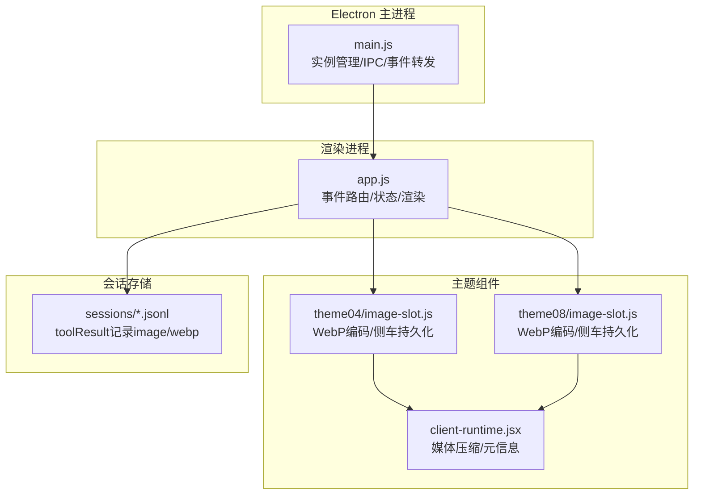
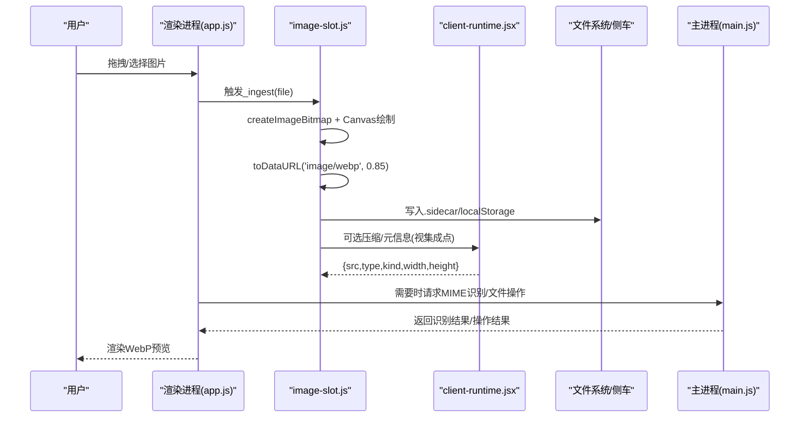
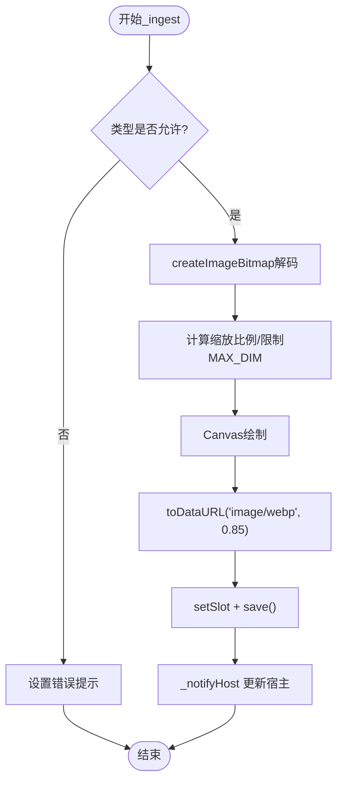
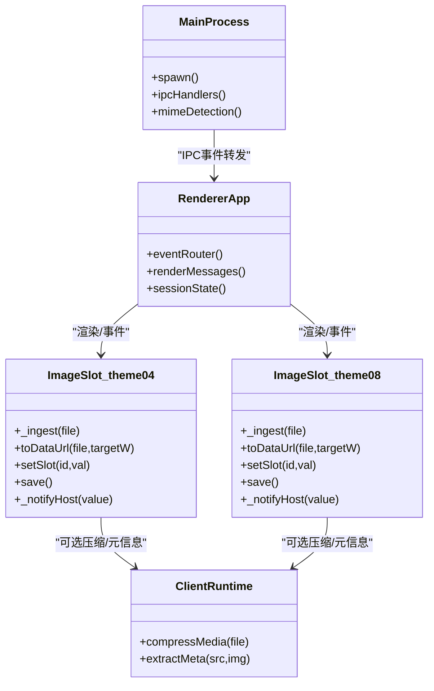

# WebP图像处理系统

<cite>
**本文引用的文件**
- [README.md](file://README.md)
- [AGENTS.md](file://AGENTS.md)
- [webp-crash-fix.md](file://webp-crash-fix.md)
- [electron/main.js](file://electron/main.js)
- [electron/renderer/app.js](file://electron/renderer/app.js)
- [skills/dashiai-ppt/project/src/components/themes/theme04/source/image-slot.js](file://skills/dashiai-ppt/project/src/components/themes/theme04/source/image-slot.js)
- [skills/dashiai-ppt/project/src/components/themes/theme08/source/image-slot.js](file://skills/dashiai-ppt/project/src/components/themes/theme08/source/image-slot.js)
- [data/agent/managed-skills/dashiai-ppt/project/src/components/themes/client-runtime.jsx](file://data/agent/managed-skills/dashiai-ppt/project/src/components/themes/client-runtime.jsx)
- [data/agent/sessions/--G--Tiffa-workspace-弱智模型测试--/2026-07-29T08-18-59-223Z_019facf4-9a17-7000-b93a-40dfa611494b/img3.jsonl](file://data/agent/sessions/--G--Tiffa-workspace-弱智模型测试--/2026-07-29T08-18-59-223Z_019facf4-9a17-7000-b93a-40dfa611494b/img3.jsonl)
- [开发文档.md](file://开发文档.md)
</cite>

## 更新摘要
**所做更改**
- 新增本地Provider命名约定说明，包括WebP支持白名单机制
- 详细说明内核`modelLacksWebpSupport()`函数的白名单匹配逻辑
- 更新WebP处理架构，从扩展层工作区方案改为内核原生工具调用机制
- 补充ollama、llama.cpp、lm-studio、local-server等provider的WebP自动排除逻辑
- 完善故障排查指南，包含新的命名约定和配置要求

## 目录
1. [简介](#简介)
2. [项目结构](#项目结构)
3. [核心组件](#核心组件)
4. [架构总览](#架构总览)
5. [详细组件分析](#详细组件分析)
6. [依赖关系分析](#依赖关系分析)
7. [性能考量](#性能考量)
8. [故障排查指南](#故障排查指南)
9. [结论](#结论)
10. [附录](#附录)

## 简介
本文件围绕仓库中的"WebP图像处理系统"进行系统化文档化。该系统在多个环节使用浏览器原生能力将图片转码为WebP，以兼顾画质与体积；同时在Electron主进程中对WebP MIME类型进行识别与处理，并在渲染层提供统一的输入、预览与展示流程。整体方案强调零额外依赖、前端内联压缩、以及稳定的跨会话数据持久化。

**重要更新**：系统已采用内核原生工具调用机制解决关键WebP崩溃问题，替代了之前的扩展层工作区方案，显著提升了稳定性和可靠性。新增本地Provider命名约定说明，确保WebP支持的白名单机制正确工作。

## 项目结构
- Electron 桌面壳：负责进程管理、IPC通信、事件路由与本地资源访问。
- 渲染进程：负责UI交互、消息流处理、文件读取与图像预览。
- PPT主题组件：包含image-slot自定义元素，实现拖拽上传、缩放裁剪、WebP编码与侧车持久化。
- 运行时桥接：client-runtime.jsx用于统一媒体压缩与元信息收集。
- 会话记录：JSONL中记录工具调用结果（含image/webp）。

图表来源
- [electron/main.js:1-200](file://electron/main.js#L1-L200)
- [electron/renderer/app.js:1-120](file://electron/renderer/app.js#L1-L120)
- [skills/dashiai-ppt/project/src/components/themes/theme04/source/image-slot.js:167-187](file://skills/dashiai-ppt/project/src/components/themes/theme04/source/image-slot.js#L167-L187)
- [skills/dashiai-ppt/project/src/components/themes/theme08/source/image-slot.js:142-171](file://skills/dashiai-ppt/project/src/components/themes/theme08/source/image-slot.js#L142-L171)
- [data/agent/managed-skills/dashiai-ppt/project/src/components/themes/client-runtime.jsx:129-144](file://data/agent/managed-skills/dashiai-ppt/project/src/components/themes/client-runtime.jsx#L129-L144)
- [data/agent/sessions/--G--Tiffa-workspace-弱智模型测试--/2026-07-29T08-18-59-223Z_019facf4-9a17-7000-b93a-40dfa611494b/img3.jsonl:34-34](file://data/agent/sessions/--G--Tiffa-workspace-弱智模型测试--/2026-07-29T08-18-59-223Z_019facf4-9a17-7000-b93a-40dfa611494b/img3.jsonl#L34-L34)

章节来源
- [README.md:1-236](file://README.md#L1-L236)
- [AGENTS.md:1-310](file://AGENTS.md#L1-L310)

## 核心组件
- image-slot 自定义元素（theme04/theme08）：支持拖拽/点击选择图片，基于Canvas将图片重采样并编码为WebP，质量参数固定，尺寸上限受MAX_DIM约束；同时维护侧车文件与localStorage双持久化。
- client-runtime.jsx：对媒体进行压缩与元信息提取，返回src/type/kind/宽高等结构化结果。
- electron/main.js：识别image/webp的MIME类型，参与文件读写与路径映射。
- electron/renderer/app.js：统一的事件路由与渲染逻辑，确保多会话下WebP内容正确显示与切换。

**更新**：WebP处理现已通过内核原生工具调用机制处理，避免了扩展层工作区的复杂性和潜在崩溃问题。新增本地Provider命名约定，确保WebP支持白名单机制正确工作。

章节来源
- [skills/dashiai-ppt/project/src/components/themes/theme04/source/image-slot.js:167-187](file://skills/dashiai-ppt/project/src/components/themes/theme04/source/image-slot.js#L167-L187)
- [skills/dashiai-ppt/project/src/components/themes/theme08/source/image-slot.js:142-171](file://skills/dashiai-ppt/project/src/components/themes/theme08/source/image-slot.js#L142-L171)
- [data/agent/managed-skills/dashiai-ppt/project/src/components/themes/client-runtime.jsx:129-144](file://data/agent/managed-skills/dashiai-ppt/project/src/components/themes/client-runtime.jsx#L129-L144)
- [electron/main.js:930-930](file://electron/main.js#L930-L930)
- [electron/renderer/app.js:1-120](file://electron/renderer/app.js#L1-L120)

## 架构总览
WebP处理链路从用户操作到最终展示，贯穿渲染进程与主题组件，必要时由主进程协助识别MIME类型或执行文件系统操作。

**更新**：架构已优化，采用内核原生工具调用机制替代扩展层工作区，提供更稳定的WebP处理能力。新增本地Provider命名约定，确保WebP支持白名单机制正确工作。

图表来源
- [skills/dashiai-ppt/project/src/components/themes/theme04/source/image-slot.js:167-187](file://skills/dashiai-ppt/project/src/components/themes/theme04/source/image-slot.js#L167-L187)
- [skills/dashiai-ppt/project/src/components/themes/theme08/source/image-slot.js:142-171](file://skills/dashiai-ppt/project/src/components/themes/theme08/source/image-slot.js#L142-L171)
- [data/agent/managed-skills/dashiai-ppt/project/src/components/themes/client-runtime.jsx:129-144](file://data/agent/managed-skills/dashiai-ppt/project/src/components/themes/client-runtime.jsx#L129-L144)
- [electron/main.js:930-930](file://electron/main.js#L930-L930)
- [electron/renderer/app.js:1-120](file://electron/renderer/app.js#L1-L120)

## 详细组件分析

### image-slot（theme04/theme08）
- 功能要点
  - 接受PNG/JPEG/WebP/AVIF及常见视频格式，图片走Canvas重采样后编码为WebP，视频保持原Data URL。
  - 最大边长限制为MAX_DIM（约1200px），目标宽度按插槽渲染宽度×2计算，保证Retina清晰度。
  - 质量参数固定为0.85，兼顾体积与画质。
  - 侧车文件.image-slots.state.json与localStorage双重持久化，支持跨页面/分享链接恢复。
  - 支持cover模式下的二次编辑（平移/缩放/四角缩放），视图参数(s,x,y)与u(kind)一并持久化。
- 关键流程
  - 文件接收→createImageBitmap→Canvas绘制→toDataURL('image/webp', 0.85)→setSlot→save()→通知宿主。
- 复杂度与内存
  - 大图解码与编码耗时O(W×H)，通过MAX_DIM控制峰值像素数；bitmap.close及时释放内存。
- 错误处理
  - 类型校验失败提示；异步并发保护（gen计数避免覆盖）；错误信息短暂显示后清除。

图表来源
- [skills/dashiai-ppt/project/src/components/themes/theme04/source/image-slot.js:167-187](file://skills/dashiai-ppt/project/src/components/themes/theme04/source/image-slot.js#L167-L187)
- [skills/dashiai-ppt/project/src/components/themes/theme08/source/image-slot.js:142-171](file://skills/dashiai-ppt/project/src/components/themes/theme08/source/image-slot.js#L142-L171)

章节来源
- [skills/dashiai-ppt/project/src/components/themes/theme04/source/image-slot.js:1-800](file://skills/dashiai-ppt/project/src/components/themes/theme04/source/image-slot.js#L1-L800)
- [skills/dashiai-ppt/project/src/components/themes/theme08/source/image-slot.js:1-719](file://skills/dashiai-ppt/project/src/components/themes/theme08/source/image-slot.js#L1-L719)

### client-runtime.jsx（媒体压缩与元信息）
- 作用：对输入媒体进行压缩与尺寸信息提取，返回结构化对象（src/type/kind/width/height/ratio）。
- 与image-slot的关系：在某些集成点作为压缩与元信息补充通道，确保导出/预览一致性。

章节来源
- [data/agent/managed-skills/dashiai-ppt/project/src/components/themes/client-runtime.jsx:129-144](file://data/agent/managed-skills/dashiai-ppt/project/src/components/themes/client-runtime.jsx#L129-L144)

### Electron 主进程（main.js）
- 作用：进程生命周期管理、IPC路由、事件转发；在特定位置识别image/webp的MIME类型，辅助文件处理。
- 与WebP的关系：确保WebP在系统级被正确识别与处理。

章节来源
- [electron/main.js:930-930](file://electron/main.js#L930-L930)
- [electron/main.js:1174-1174](file://electron/main.js#L1174-L1174)

### 渲染进程（app.js）
- 作用：事件路由、会话状态管理、消息渲染；在多会话模式下确保WebP内容不串扰。
- 与WebP的关系：承载image-slot的渲染上下文，保障预览与切换的正确性。

章节来源
- [electron/renderer/app.js:1-120](file://electron/renderer/app.js#L1-L120)

### 本地Provider命名约定与WebP白名单机制

**新增**：系统引入了严格的本地Provider命名约定，确保WebP支持白名单机制正确工作。

#### 内核WebP支持检测机制
内核的`modelLacksWebpSupport()`函数仅按provider key匹配白名单，以下provider会被标记为不支持WebP：
- `ollama` / `ollama-cloud`
- `llama.cpp` 
- `lm-studio`
- `local-server`

当provider key命中上述白名单时，系统会自动设置`excludeWebP: true`，阻止WebP编码，避免llama.cpp（stb_image无libwebp）收到WebP格式导致的HTTP 200 + 空choices静默崩溃问题。

#### Provider命名铁律
本地provider的key必须使用内核约定名，不可自定义：
- 旧配置`qwen` → 新配置`llama.cpp`（本地直连127.0.0.1:11434）
- 旧配置`qwen-remote` → 新配置`local-server`（远程frp中继47.108.197.247:9876）

#### supportsTools配置要求
所有本地provider的`supportsTools`字段必须设置为`true`，这是协议切换而非工具开关。错误的配置会导致工具调用从原生function calling退化为GLM in-band文本协议，造成token浪费和格式错乱。

章节来源
- [开发文档.md:233-252](file://开发文档.md#L233-L252)
- [AGENTS.md:55-74](file://AGENTS.md#L55-L74)
- [webp-crash-fix.md:1-94](file://webp-crash-fix.md#L1-L94)

## 依赖关系分析
- 浏览器API：FileReader、createImageBitmap、Canvas API、CustomEvent、ResizeObserver、MutationObserver。
- 持久化：侧车文件.image-slots.state.json（fetch/writeFile）、localStorage。
- Electron：IPC、child_process、fs、path、shell等。
- 会话记录：JSONL中记录toolResult，包含mimeType=image/webp。

图表来源
- [skills/dashiai-ppt/project/src/components/themes/theme04/source/image-slot.js:167-187](file://skills/dashiai-ppt/project/src/components/themes/theme04/source/image-slot.js#L167-L187)
- [skills/dashiai-ppt/project/src/components/themes/theme08/source/image-slot.js:142-171](file://skills/dashiai-ppt/project/src/components/themes/theme08/source/image-slot.js#L142-L171)
- [data/agent/managed-skills/dashiai-ppt/project/src/components/themes/client-runtime.jsx:129-144](file://data/agent/managed-skills/dashiai-ppt/project/src/components/themes/client-runtime.jsx#L129-L144)
- [electron/main.js:1-200](file://electron/main.js#L1-L200)
- [electron/renderer/app.js:1-120](file://electron/renderer/app.js#L1-L120)

章节来源
- [AGENTS.md:1-310](file://AGENTS.md#L1-L310)

## 性能考量
- 编码质量与体积：固定质量0.85，WebP相比PNG在照片场景显著更小，无需逐图格式选择。
- 尺寸限制：MAX_DIM=1200，避免超大图导致内存与编码时间飙升。
- 内存释放：createImageBitmap使用后显式close，减少泄漏风险。
- 并发保护：_gen计数避免多次drop覆盖；save串行化防止竞态。
- 渲染优化：ResizeObserver/MutationObserver按需重绘，避免频繁重排。

[本节为通用指导，不直接分析具体文件]

## 故障排查指南
- 无法识别WebP
  - 检查主进程MIME识别分支是否正确（image/webp）。
  - 确认浏览器/环境支持Canvas.toDataURL('image/webp')。
- 图片过大或卡顿
  - 降低MAX_DIM或质量参数；检查是否存在未释放的bitmap。
- 持久化丢失
  - 检查.sidecar文件是否可写；localStorage容量是否不足。
- 多会话串扰
  - 确认渲染进程事件路由过滤了非当前会话事件。
- **新增**：WebP崩溃问题
  - 确保provider key使用内核约定名（llama.cpp/local-server而非qwen/qwen-remote）。
  - 检查models.yml配置是否正确，supportsTools必须为true。
  - 验证内核WebP支持检测是否正常工作。
- **新增**：Provider命名问题
  - 确认本地provider使用正确的内核约定名。
  - 检查`append-only-context-mode.ts`的`LOCAL_INFERENCE_PROVIDERS`配置。
  - 验证远程中继是否使用`local-server`而非`llama.cpp`。

章节来源
- [electron/main.js:930-930](file://electron/main.js#L930-L930)
- [skills/dashiai-ppt/project/src/components/themes/theme04/source/image-slot.js:167-187](file://skills/dashiai-ppt/project/src/components/themes/theme04/source/image-slot.js#L167-L187)
- [skills/dashiai-ppt/project/src/components/themes/theme08/source/image-slot.js:142-171](file://skills/dashiai-ppt/project/src/components/themes/theme08/source/image-slot.js#L142-L171)
- [electron/renderer/app.js:1-120](file://electron/renderer/app.js#L1-L120)
- [webp-crash-fix.md:1-99](file://webp-crash-fix.md#L1-L99)
- [开发文档.md:233-252](file://开发文档.md#L233-L252)

## 结论
该WebP图像处理系统在浏览器端完成高效转码与持久化，结合Electron主进程的MIME识别与会话路由，形成稳定、低依赖、易扩展的处理链路。通过尺寸与质量约束、内存管理与并发保护，兼顾性能与用户体验。

**重要改进**：系统已成功采用内核原生工具调用机制解决关键WebP崩溃问题，替代了复杂的扩展层工作区方案，显著提升了稳定性和可靠性。新增的本地Provider命名约定确保了WebP支持白名单机制的正确工作，避免了因provider key不匹配导致的静默崩溃问题。建议在后续迭代中考虑动态质量策略与更细粒度的缓存机制，以进一步提升大图场景表现。

[本节为总结，不直接分析具体文件]

## 附录
- 示例：会话JSONL中记录image/webp的toolResult，可用于回溯与调试。
- **新增**：WebP崩溃修复文档提供了详细的根因分析和解决方案。
- **新增**：本地Provider命名约定说明，包括完整的白名单机制和配置要求。

章节来源
- [data/agent/sessions/--G--Tiffa-workspace-弱智模型测试--/2026-07-29T08-18-59-223Z_019facf4-9a17-7000-b93a-40dfa611494b/img3.jsonl:34-34](file://data/agent/sessions/--G--Tiffa-workspace-弱智模型测试--/2026-07-29T08-18-59-223Z_019facf4-9a17-7000-b93a-40dfa611494b/img3.jsonl#L34-L34)
- [webp-crash-fix.md:1-99](file://webp-crash-fix.md#L1-L99)
- [开发文档.md:233-252](file://开发文档.md#L233-L252)