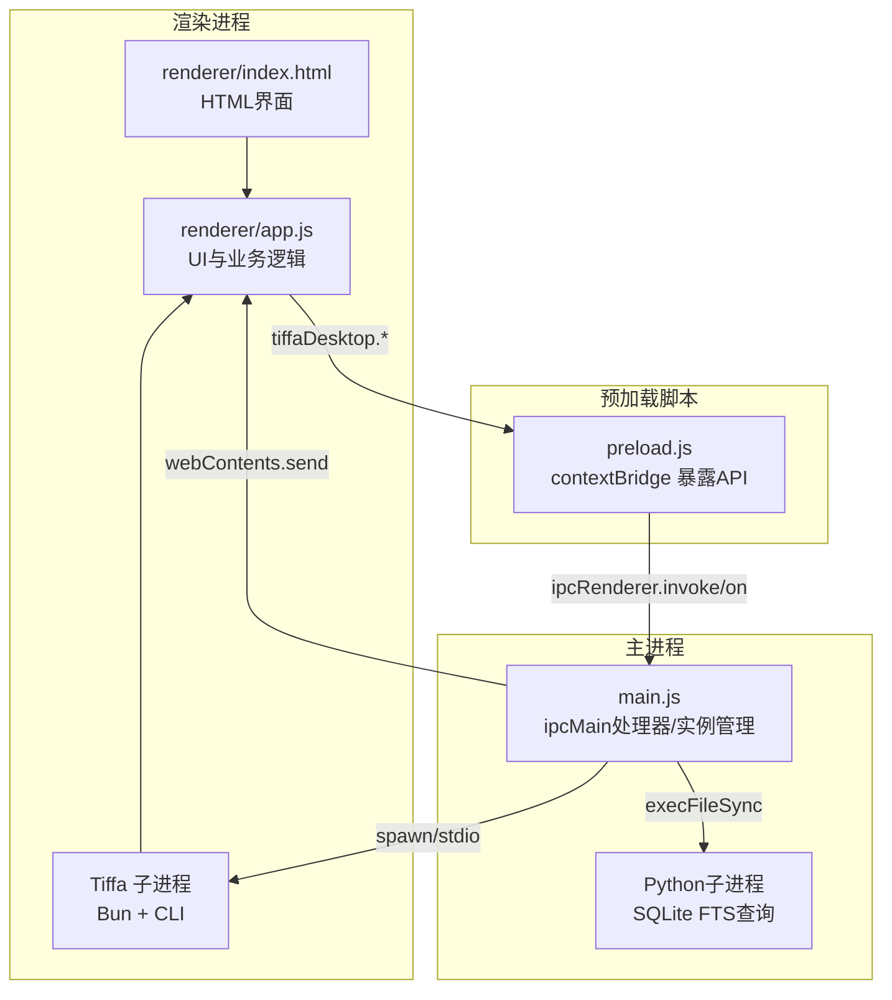
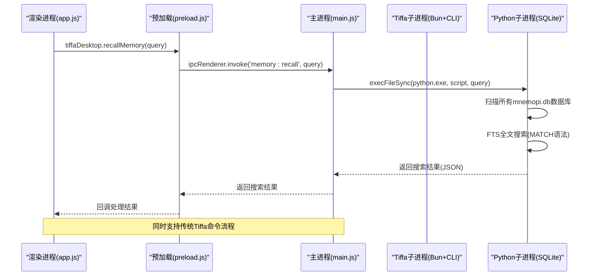
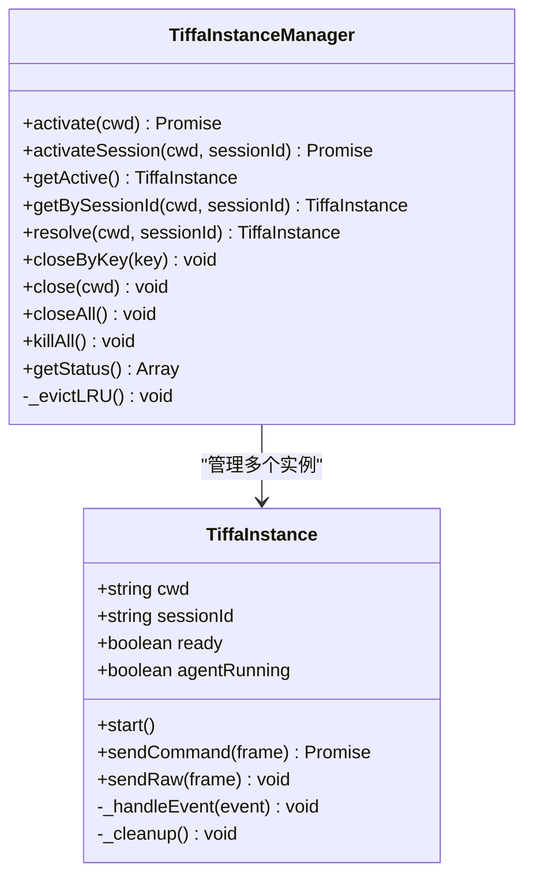
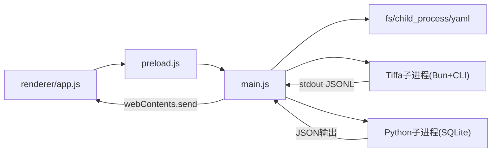
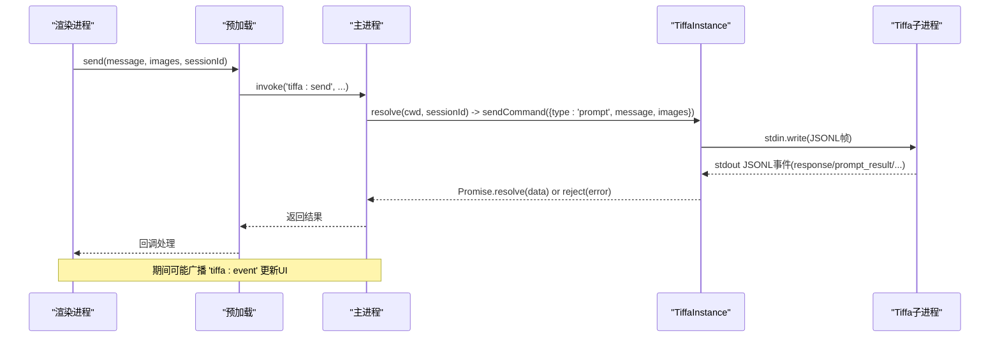
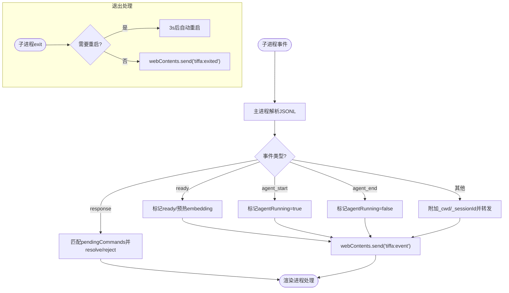
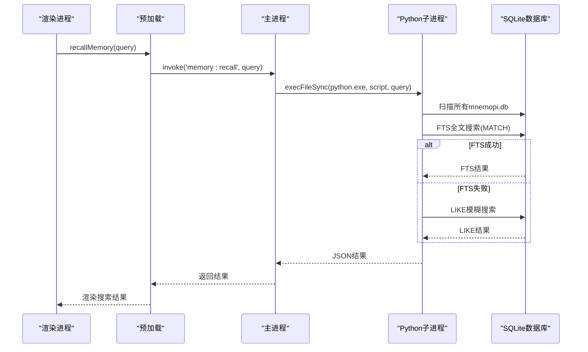
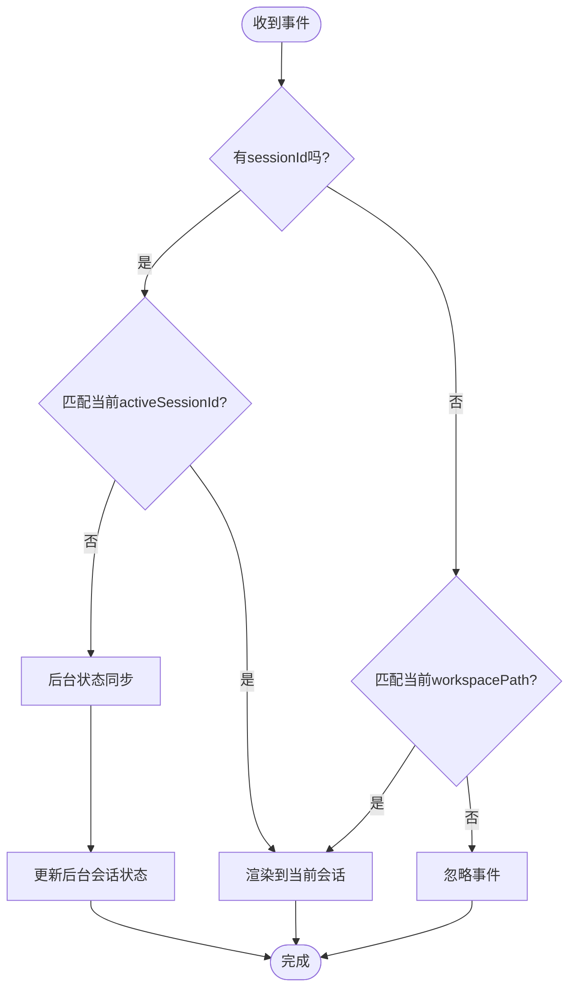

# IPC通信机制

<cite>
**本文引用的文件**
- [main.js](file://electron/main.js)
- [preload.js](file://electron/preload.js)
- [app.js](file://electron/renderer/app.js)
- [index.html](file://electron/renderer/index.html)
- [styles.css](file://electron/renderer/styles.css)
- [memory-recall-ui.md](file://workspace/Tiffa开发/design/memory-recall-ui.md)
</cite>

## 更新摘要
**所做更改**
- 新增 memory:recall IPC处理器实现，支持跨所有mnemopi SQLite数据库的全局全文搜索
- 实现了FTS全文检索和LIKE模糊搜索的降级机制
- 添加了完整的UI界面支持，包括全局记忆召回按钮和结果展示
- 扩展了37个IPC处理器清单，新增memory:recall处理器
- 更新了预加载脚本API，暴露recallMemory方法给渲染进程

## 目录
1. [简介](#简介)
2. [项目结构](#项目结构)
3. [核心组件](#核心组件)
4. [架构总览](#架构总览)
5. [详细组件分析](#详细组件分析)
6. [依赖关系分析](#依赖关系分析)
7. [性能考量](#性能考量)
8. [故障排查指南](#故障排查指南)
9. [结论](#结论)
10. [附录：IPC接口清单与协议说明](#附录ipc接口清单与协议说明)

## 简介
本文件系统性梳理 Tiffa 桌面端基于 Electron 的 IPC 通信机制，覆盖主进程、预加载脚本与渲染进程三端的职责边界、事件驱动消息传递、JSONL over stdin/stdout 子进程协议、以及 38 个 IPC 处理器的功能说明。重点解释 tiffa:send、tiffa:activateSession、tiffa:setModel 等核心接口，并给出时序图、错误处理策略与性能优化建议，帮助开发者快速定位问题与扩展能力。

**最新更新**：新增了 memory:recall IPC处理器，实现了跨所有mnemopi SQLite数据库的全局全文搜索功能，支持FTS全文检索和LIKE模糊搜索的降级机制，为用户提供独立于模型的全局记忆检索能力。

## 项目结构
- 主进程（main.js）：管理窗口生命周期、Tiffa 子进程实例池、所有 ipcMain.handle 处理器、事件转发与 JSONL 协议解析。
- 预加载脚本（preload.js）：通过 contextBridge.exposeInMainWorld 暴露受控 API，封装 ipcRenderer.invoke/on，实现安全桥接。
- 渲染进程（app.js）：UI 交互、状态管理、事件监听与业务逻辑调用，通过 tiffaDesktop.* 调用主进程能力。
- UI界面（index.html, styles.css）：提供全局记忆召回的交互界面和样式支持。

**图表来源**
- [main.js:576-612](file://electron/main.js#L576-L612)
- [preload.js:24-132](file://electron/preload.js#L24-L132)
- [app.js:378-481](file://electron/renderer/app.js#L378-L481)
- [index.html:146-155](file://electron/renderer/index.html#L146-L155)

**章节来源**
- [main.js:1-120](file://electron/main.js#L1-L120)
- [preload.js:1-132](file://electron/preload.js#L1-L132)
- [app.js:1-120](file://electron/renderer/app.js#L1-L120)
- [index.html:140-160](file://electron/renderer/index.html#L140-L160)

## 核心组件
- TiffaInstance：封装单个 Tiffa 子进程的启动、命令发送、事件接收、自动重启与清理。
- TiffaInstanceManager：多实例管理器，支持项目级与对话级实例的懒启动、LRU 淘汰、活跃实例切换与状态查询。
- IPC 处理器集合：统一在 setupIpc 中注册，涵盖 Tiffa 命令、文件系统、会话/项目管理、模型配置、全局记忆搜索等。
- 预加载桥接：将主进程能力以 tiffaDesktop.* 形式暴露给渲染进程，限制直接 Node 访问，保障安全。
- 全局记忆搜索：通过Python子进程直接查询mnemopi SQLite数据库的FTS表，实现跨项目的全文检索。

**最新更新**：新增了memory:recall处理器，支持跨所有mnemopi SQLite数据库的全局全文搜索，使用FTS MATCH语法进行语义检索，失败时自动降级为LIKE模糊搜索。

**章节来源**
- [main.js:76-319](file://electron/main.js#L76-L319)
- [main.js:325-570](file://electron/main.js#L325-L570)
- [main.js:616-824](file://electron/main.js#L616-L824)
- [main.js:2537-2613](file://electron/main.js#L2537-L2613)
- [preload.js:24-132](file://electron/preload.js#L24-L132)

## 架构总览
下图展示从渲染进程到主进程再到 Tiffa 子进程的完整调用链与事件回传路径，以及新增的全局记忆搜索流程。

**图表来源**
- [preload.js:77-78](file://electron/preload.js#L77-L78)
- [main.js:2537-2613](file://electron/main.js#L2537-L2613)
- [main.js:626-708](file://electron/main.js#L626-L708)

## 详细组件分析

### 主进程：TiffaInstance 与 TiffaInstanceManager
- TiffaInstance
  - 启动：使用 Bun 执行 Tiffa CLI，设置 UTF-8 环境变量，stdin/stdout/stderr 管道化。
  - 事件解析：readline 逐行解析 stdout JSONL，区分 ready、agent_start/end、prompt_result、response 等类型。
  - 命令发送：sendCommand 为带 id 的请求-响应模式；sendRaw 为 fire-and-forget 推送。
  - 自动重启：非用户主动 kill、非零退出码且未达上限则 3s 后重试，最多 3 次。
  - 清理：关闭 readline、释放进程引用、重置状态。
- TiffaInstanceManager
  - 激活：activate/cwd 激活项目级实例；activateSession/cwd+sessionId 激活对话级实例。
  - LRU 淘汰：超过 MAX_INSTANCES(8) 时按 lastActiveTime 淘汰最久未活跃的非当前实例。
  - 状态：getStatus 返回各实例 key、cwd、sessionId、active、ready、agentRunning、lastActiveTime。
  - 关闭：closeByKey/close/closeAll/killAll 提供不同粒度的终止与清理。

**最新更新**：TiffaInstanceManager的activateSession方法现在不会修改activeKey/activeCwd，避免了fire-and-forget调用竞态覆盖活跃实例的问题。新增getBySessionId方法支持按sessionId精确查找实例。

**图表来源**
- [main.js:76-319](file://electron/main.js#L76-L319)
- [main.js:325-570](file://electron/main.js#L325-L570)

**章节来源**
- [main.js:76-319](file://electron/main.js#L76-L319)
- [main.js:325-570](file://electron/main.js#L325-L570)

### 新增：全局记忆搜索处理器 (memory:recall)
- **功能概述**：直接查询 mnemopi SQLite 数据库的 FTS 表，不经过内核，实现跨项目的全局记忆搜索。
- **实现方式**：通过 Python 子进程执行 SQL 查询，支持 FTS MATCH 语法和 LIKE 模糊搜索的降级机制。
- **查询流程**：
  1. 扫描 `data/agent/memories/mnemopi/banks/*/mnemopi.db` 所有 bank 数据库
  2. 优先尝试 FTS 全文搜索：`SELECT ... FROM fts_working JOIN working_memory wm ON fts_working.id = wm.id WHERE fts_working MATCH ? ORDER BY rank LIMIT 20`
  3. FTS 失败时自动降级为 LIKE 模糊搜索：`SELECT ... FROM working_memory WHERE content LIKE ? ORDER BY timestamp DESC LIMIT 20`
  4. 合并所有 bank 的结果，按 timestamp 降序排列，返回前 30 条
- **返回格式**：`{ results: [{ id, content, source, timestamp, session_id, bank, score }] }`
- **错误处理**：空查询返回 `{ results: [], error: '空查询' }`；异常时返回 `{ results: [], error: err.message }`

**章节来源**
- [main.js:2537-2613](file://electron/main.js#L2537-L2613)

### 预加载脚本：安全暴露 API
- 使用 contextBridge.exposeInMainWorld 暴露 tiffaDesktop.*，包括：
  - Tiffa 代理命令：send、abort、setModel、getModels、getState、isReady、diagnostics、steer、followUp、extensionResponse、compact、command。
  - 事件监听：onEvent、onExited。
  - 文件系统：listDir、readFile、writeFile、readImage。
  - 外部调用：openExternal、openPath。
  - 路径工具：getWorkspacePath、getRootPath。
  - 会话/项目管理：listProjects、listSessions、switchSession、newSession、loadSessionHistory、归档/删除/恢复等。
  - 模型配置：readModelsYml、writeModelsYml、restartTiffa、writeTiffaProvider、deleteTiffaProvider。
  - 配置写入：writeApprovalMode。
  - 工作区/项目管理：openFolderDialog、changeWorkspace。
  - 多实例管理：activateInstance、activateSession、closeSession、getInstances。
  - XML 翻译开关：getXmlTranslationStatus、toggleXmlTranslation。
  - 渲染库：marked、hljs、clipboardWriteText、getPathForFile。
  - **新增**：全局记忆搜索：recallMemory(query)。
- 权限控制：仅暴露必要方法，禁止直接访问 Node 模块；参数校验由主进程处理器负责。

**章节来源**
- [preload.js:24-132](file://electron/preload.js#L24-L132)

### 渲染进程：事件驱动的消息处理与UI交互
- 初始化：加载 workspace、最小地图、事件委托、主题、XML 翻译、审批模式等。
- 事件路由：根据 _sessionId/_cwd 过滤后台事件，避免影响当前活跃对话。
- 状态机：tiffaReady、agentRunning、sessionAgentRunning、instanceAgentRunning 等状态同步。
- 超时与卡住检测：首次响应 30s 无事件提示；2min 无事件提示可能卡住。
- 会话切换：缓存 DOM 树、恢复标签页、懒加载历史、异步刷新真实会话列表。
- **新增**：全局记忆搜索UI：
  - 在"项目记忆"区域添加"全局记忆召回"按钮
  - 支持 recallMode 状态切换，改变搜索框 placeholder 和行为
  - 实现 performMemoryRecall(query) 函数调用 tiffaDesktop.recallMemory
  - 实现 renderRecallResults(results) 函数展示搜索结果卡片
  - 支持退出召回模式返回项目记忆视图

**章节来源**
- [app.js:378-481](file://electron/renderer/app.js#L378-L481)
- [app.js:484-646](file://electron/renderer/app.js#L484-646)
- [app.js:649-731](file://electron/renderer/app.js#L649-731)
- [app.js:1200-1299](file://electron/renderer/app.js#L1200-1299)
- [app.js:3760-3825](file://electron/renderer/app.js#L3760-L3825)

### UI界面：全局记忆召回功能
- **HTML结构**：在"项目记忆"标题栏添加搜索输入框和全局召回按钮
- **CSS样式**：定义了 .memory-recall-btn、.memory-recall-results、.memory-recall-item 等样式类
- **交互逻辑**：点击全局召回按钮进入 recallMode，回车触发搜索，显示结果卡片列表

**章节来源**
- [index.html:146-155](file://electron/renderer/index.html#L146-L155)
- [styles.css:893-969](file://electron/renderer/styles.css#L893-L969)

## 依赖关系分析
- 渲染进程依赖预加载桥接，不直接访问 Node。
- 主进程依赖 Electron 模块、fs、child_process、yaml 解析器。
- Tiffa 子进程通过 JSONL over stdin/stdout 与主进程通信。
- **新增**：Python子进程用于SQLite FTS查询，依赖内置sqlite3模块。
- 事件流：子进程 stdout → 主进程 readline → 主进程 webContents.send → 渲染进程 onEvent。

**图表来源**
- [main.js:8-14](file://electron/main.js#L8-L14)
- [main.js:121-135](file://electron/main.js#L121-L135)
- [main.js:300-303](file://electron/main.js#L300-L303)
- [main.js:2602-2608](file://electron/main.js#L2602-L2608)

**章节来源**
- [main.js:8-14](file://electron/main.js#L8-L14)
- [main.js:121-135](file://electron/main.js#L121-L135)
- [main.js:300-303](file://electron/main.js#L300-L303)
- [main.js:2602-2608](file://electron/main.js#L2602-L2608)

## 性能考量
- 子进程事件解析：使用 readline 逐行解析，避免大缓冲拼接导致的内存峰值。
- 命令超时：sendCommand 默认 5 分钟超时，防止 Promise 永久挂起。
- 实例数量限制：MAX_INSTANCES=8，LRU 淘汰最久未活跃实例，降低内存占用。
- 预热机制：ready 后延迟 3s 触发 /memory rebuild，减少首次请求冷加载耗时。
- 历史加载：大文件只读尾部 10MB，避免长会话全量加载卡顿。
- 渲染优化：最小地图绘制使用 rAF 节流，DOM 缓存限制 3 份，避免堆内存膨胀。
- **新增**：全局记忆搜索性能：
  - Python子进程查询超时10秒，最大缓冲区5MB
  - FTS全文搜索优先，失败时自动降级为LIKE模糊搜索
  - 限制每个数据库最多返回20条结果，最终合并限制30条
  - 按timestamp排序确保最新结果优先显示

**章节来源**
- [main.js:207-248](file://electron/main.js#L207-L248)
- [main.js:252-303](file://electron/main.js#L252-L303)
- [main.js:167-173](file://electron/main.js#L167-L173)
- [main.js:2602-2608](file://electron/main.js#L2602-L2608)

## 故障排查指南
- 常见问题
  - 子进程崩溃：检查 stderr 输出与退出码；观察自动重启计数与上限。
  - 命令无响应：确认 pendingCommands 是否超时；检查 stdin 可写性。
  - 事件丢失：确认 _sessionId/_cwd 路由是否正确；预热期间噪音事件被过滤。
  - 文件读写失败：检查路径是否在 PORTABLE_ROOT 内；文件大小限制 5MB。
  - 会话冲突：检查activeSessionId验证是否正常工作，确保会话间数据隔离。
  - **新增**：全局记忆搜索失败：检查Python环境是否正常；确认mnemopi数据库路径存在；查看FTS表是否已建立索引。
- 调试技巧
  - 启用 DevTools：命令行参数 --dev 或 --verbose。
  - 查看诊断：调用 diagnostics 获取 pid、stdinWritable、pendingCommands 数量。
  - 日志定位：主进程 console.log/warn/error 输出包含 [TiffaInstance:短路径] 前缀。
  - 网络与模型：fetchProviderModels 超时 10s；确保 baseUrl/models 可达。
  - **新增**：记忆搜索调试：查看 `[memory:recall] error:` 日志；检查Python子进程输出；验证SQL查询语法。

**章节来源**
- [main.js:137-178](file://electron/main.js#L137-L178)
- [main.js:207-248](file://electron/main.js#L207-L248)
- [main.js:757-768](file://electron/main.js#L757-L768)
- [main.js:878-892](file://electron/main.js#L878-L892)
- [main.js:2609-2612](file://electron/main.js#L2609-L2612)

## 结论
Tiffa 的 IPC 机制以 Electron 为主轴，结合预加载脚本的安全桥接与 JSONL over stdin/stdout 的子进程协议，实现了稳定、可扩展的多实例通信。通过严格的路由、超时与自动重启策略，保障了用户体验与系统健壮性。**最新的memory:recall功能增强**进一步提升了全局记忆检索能力，通过直接SQLite FTS查询和智能降级机制，为用户提供了独立于模型的强大搜索功能。开发者可基于现有处理器扩展新能力，同时遵循安全与性能最佳实践。

## 附录：IPC接口清单与协议说明

### 38 个 IPC 处理器概览（按类别分组）
- Tiffa 命令类（12）
  - tiffa:send、tiffa:abort、tiffa:setModel、tiffa:getModels、tiffa:isReady、tiffa:diagnostics、tiffa:getState、tiffa:steer、tiffa:followUp、tiffa:extensionResponse、tiffa:compact、tiffa:command
- 多实例管理类（4）
  - tiffa:activate、tiffa:activateSession、tiffa:closeSession、tiffa:instances
- 文件系统类（4）
  - fs:listDir、fs:readFile、fs:writeFile、fs:readImage
- 外部调用类（2）
  - shell:openExternal、shell:openPath
- 路径工具类（2）
  - path:workspace、path:root
- XML 翻译类（2）
  - xml-translation:status、xml-translation:toggle
- 模型配置类（5）
  - models:read、models:write、models:restart、models:writeProvider、models:deleteProvider
- 配置写入类（1）
  - config:writeApprovalMode
- 工作区/项目管理类（2）
  - workspace:openFolderDialog、workspace:change
- 会话/项目管理类（15）
  - sessions:listProjects、sessions:listSessions、sessions:switch、sessions:new、sessions:loadHistory、sessions:archiveProject、sessions:deleteProject、sessions:listArchived、sessions:restoreProject、sessions:archiveSession、sessions:deleteSession、sessions:rename、sessions:listArchivedSessions、sessions:restoreSession、sessions:getUserEntries、sessions:exportHtml、sessions:getRemovedCwds、sessions:addRemovedCwd、sessions:removeRemovedCwd
- **新增**：全局记忆搜索类（1）
  - memory:recall

**章节来源**
- [main.js:626-824](file://electron/main.js#L626-L824)
- [main.js:825-948](file://electron/main.js#L825-L948)
- [main.js:950-1073](file://electron/main.js#L950-L1073)
- [main.js:1075-1124](file://electron/main.js#L1075-L1124)
- [main.js:1662-1741](file://electron/main.js#L1662-L1741)
- [main.js:1743-1867](file://electron/main.js#L1743-L1867)
- [main.js:1882-2092](file://electron/main.js#L1882-L2092)
- [main.js:2120-2210](file://electron/main.js#L2120-L2210)
- [main.js:2537-2613](file://electron/main.js#L2537-L2613)

### JSONL over stdin/stdout 协议要点
- 格式：每行一个 JSON 对象，UTF-8 编码。
- 命令帧：{ type, ...payload, id? }，id 用于请求-响应匹配。
- 事件帧：{ type, ...data }，如 ready、agent_start、agent_end、prompt_result、message_*、tool_execution_*、extension_ui_request、config_update、session_info_update、notice、set_todos、auto_retry_*、session_switch 等。
- 错误处理：response.success=false 时携带 error；子进程退出时通过 tiffa:exited 通知渲染进程。
- 重试机制：主进程对非零退出码且非用户主动 kill 的情况进行最多 3 次自动重启，间隔 3s。

**章节来源**
- [main.js:207-248](file://electron/main.js#L207-L248)
- [main.js:252-303](file://electron/main.js#L252-L303)
- [main.js:167-173](file://electron/main.js#L167-L173)

### 关键时序图示例

#### 发送消息流程（tiffa:send）

**图表来源**
- [preload.js:24-36](file://electron/preload.js#L24-L36)
- [main.js:626-708](file://electron/main.js#L626-L708)
- [main.js:207-248](file://electron/main.js#L207-L248)
- [main.js:252-303](file://electron/main.js#L252-L303)

#### 事件广播流程（tiffa:event / tiffa:exited）

**图表来源**
- [main.js:252-303](file://electron/main.js#L252-L303)
- [main.js:167-173](file://electron/main.js#L167-L173)

#### 全局记忆搜索流程（memory:recall）

**图表来源**
- [preload.js:77-78](file://electron/preload.js#L77-L78)
- [main.js:2537-2613](file://electron/main.js#L2537-L2613)

#### 多会话事件路由流程

**图表来源**
- [app.js:423-447](file://electron/renderer/app.js#L423-L447)
- [main.js:295-306](file://electron/main.js#L295-L306)