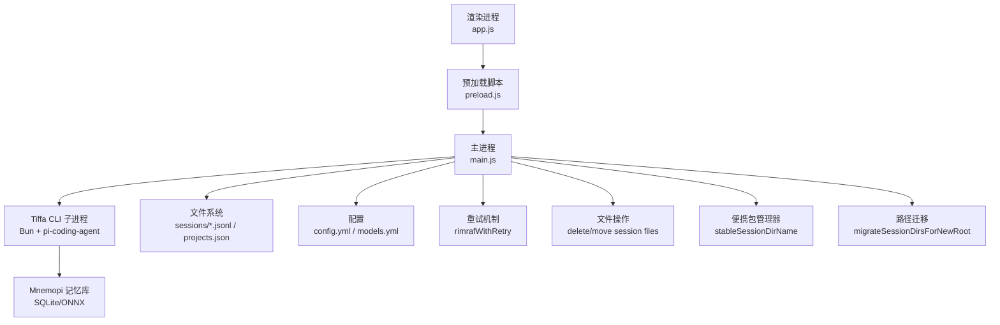
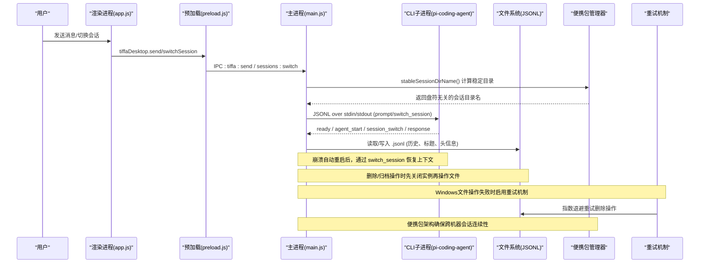
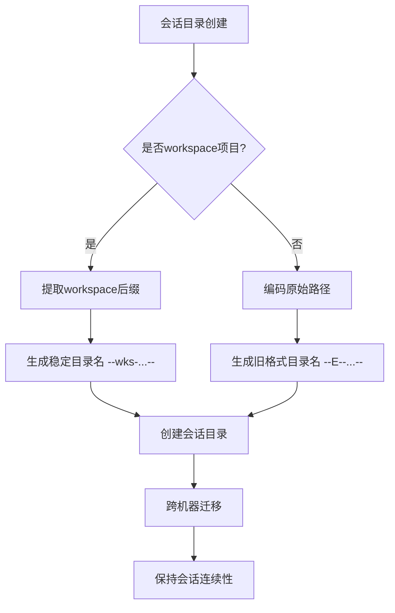
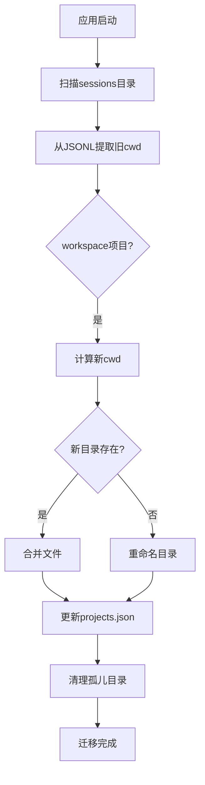
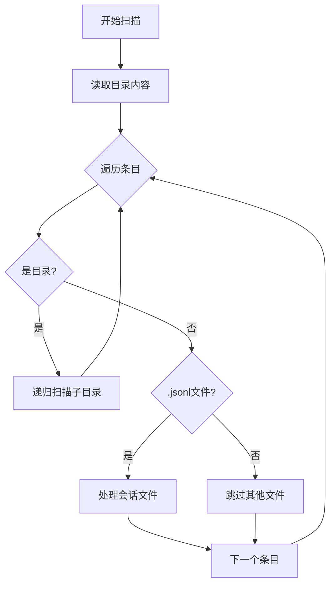
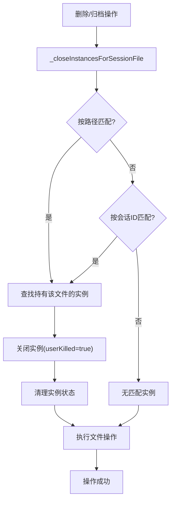
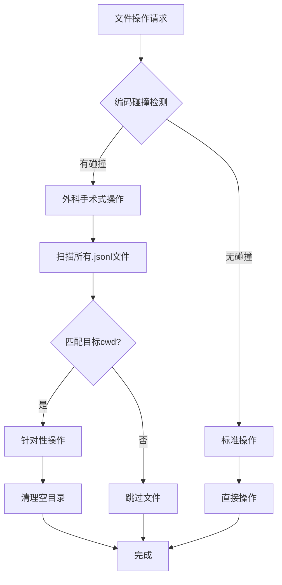
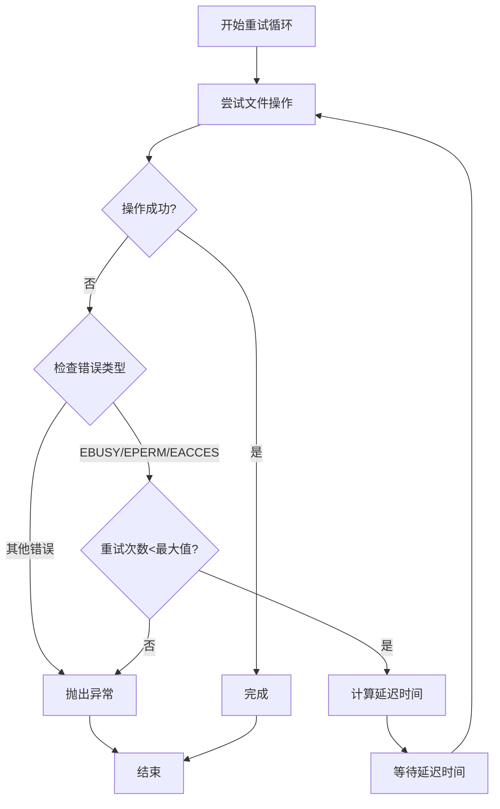
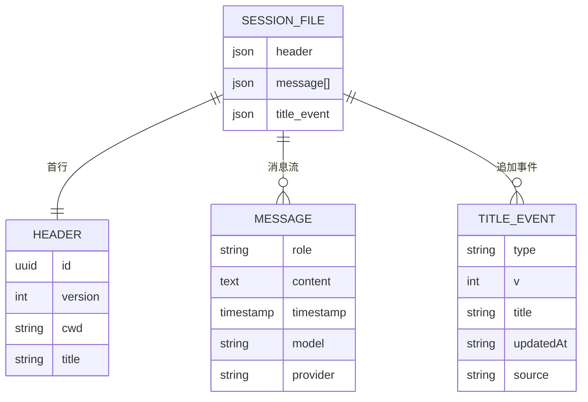
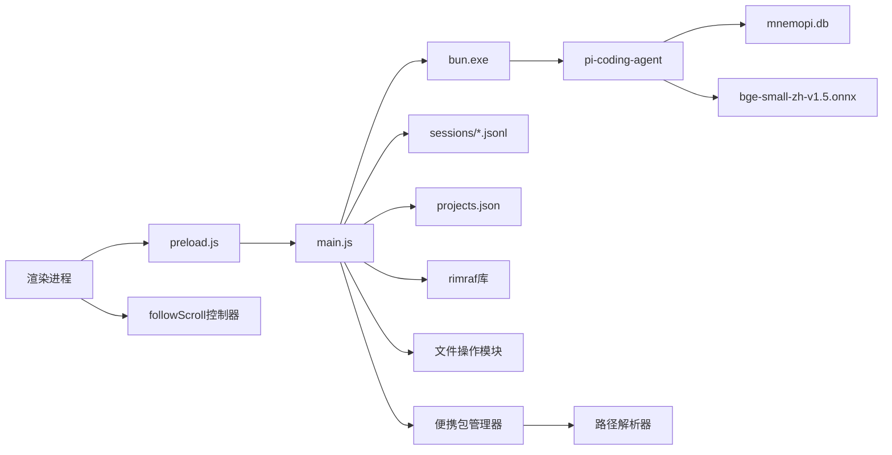

# 会话管理与上下文恢复

<cite>
**本文引用的文件**   
- [electron/main.js](file://electron/main.js)
- [electron/renderer/app.js](file://electron/renderer/app.js)
- [data/agent/config.yml](file://data/agent/config.yml)
- [skills/memory-manager/SKILL.md](file://skills/memory-manager/SKILL.md)
- [test_memory_system.ts](file://test_memory_system.ts)
</cite>

## 更新摘要
**所做更改**   
- 实现了便携包架构的重大改进，包括稳定的会话目录管理和跨驱动器迁移支持
- 增强了递归目录扫描功能，支持嵌套会话子目录的完整管理
- 改进了NTFS文件系统损坏的处理机制，提供更健壮的容错能力
- 新增了智能滚动跟随机制，提供三态行为的自适应滚动控制
- 完善了实例清理机制，确保删除和归档操作时的资源正确释放
- 实现了外科手术式的文件操作，专门处理编码碰撞场景
- 添加了Windows文件操作的健壮重试机制，支持指数退避策略

## 目录
1. [简介](#简介)
2. [项目结构](#项目结构)
3. [核心组件](#核心组件)
4. [架构总览](#架构总览)
5. [详细组件分析](#详细组件分析)
6. [依赖关系分析](#依赖关系分析)
7. [性能考量](#性能考量)
8. [故障排查指南](#故障排查指南)
9. [结论](#结论)
10. [附录](#附录)

## 简介
本文件聚焦 Tiffa 的"会话管理与上下文恢复"能力，围绕 Electron 主进程的多实例管理、JSONL 会话持久化、崩溃自动重启与上下文恢复、以及 Mnemopi 语义记忆在跨会话中的注入与召回机制进行系统化说明。**本次更新重点反映了便携包架构的重大改进**，包括稳定的会话目录管理、跨驱动器迁移支持、递归目录扫描和NTFS损坏处理增强。目标是帮助开发者与使用者理解：
- 会话如何创建、切换、归档与恢复
- 进程崩溃后如何无缝恢复对话上下文
- 记忆系统如何在不同时间尺度上保持连续性（用户偏好、项目纲领、全局/项目级语义库、断片补救）
- **新增**：便携包架构的稳定会话目录管理，支持跨机器和盘符变化
- **新增**：智能滚动跟随机制提升用户体验
- **新增**：外科手术式文件操作处理编码碰撞场景
- **新增**：Windows文件操作的健壮重试机制

## 项目结构
Tiffa 采用"Electron 桌面壳 + 内核 CLI 子进程"的双层架构。会话与上下文的核心实现集中在 Electron 主进程中，负责：
- 多实例生命周期管理（按项目/对话维度）
- JSONL 会话文件的读写与迁移
- IPC 事件路由与渲染进程通信
- 启动时路径迁移与项目发现
- **新增**：便携包架构的稳定会话目录管理，支持跨驱动器迁移
- **新增**：递归目录扫描和NTFS损坏处理增强



**图表来源**
- [electron/main.js:1-120](file://electron/main.js#L1-L120)
- [electron/main.js:277-283](file://electron/main.js#L277-L283)
- [electron/main.js:2131-2260](file://electron/main.js#L2131-L2260)

**章节来源**
- [electron/main.js:17-43](file://electron/main.js#L17-L43)
- [electron/main.js:277-283](file://electron/main.js#L277-L283)
- [electron/main.js:2131-2260](file://electron/main.js#L2131-L2260)

## 核心组件
- TiffaInstance：封装单个 Tiffa CLI 子进程的启动、事件解析、命令发送、崩溃重启与上下文恢复
- TiffaInstanceManager：多实例管理器，维护 cwd#sessionId 维度的实例映射、LRU 淘汰、活跃实例切换
- Session 文件系统：以 .jsonl 为单位的会话记录，包含 header、消息流、title 事件等
- IPC Handler：暴露 37+ 个 IPC 接口，覆盖会话/项目管理、模型配置、文件系统、XML 翻译开关等
- 记忆系统（Mnemopi）：通过 settings 数据库与 config.yml 控制 autoRetain/autoRecall/recallLimit/injectionTokenLimit 等
- **新增**：便携包管理器：`stableSessionDirName()` 函数实现盘符无关的稳定会话目录命名
- **新增**：路径迁移器：`migrateSessionDirsForNewRoot()` 函数处理跨驱动器迁移场景
- **新增**：实例清理机制：`_closeInstancesForSessionFile()` 函数确保删除/归档操作时正确关闭相关实例
- **新增**：智能滚动跟随：三态行为的 followScroll 控制器提供流畅的用户体验
- **新增**：外科手术式文件操作：`deleteSessionFilesForCwd()` 和 `moveSessionFilesForCwd()` 处理编码碰撞场景
- **新增**：健壮重试机制：`rimrafWithRetry()` 支持指数退避策略处理Windows文件锁问题

**章节来源**
- [electron/main.js:224-643](file://electron/main.js#L224-L643)
- [electron/main.js:649-800](file://electron/main.js#L649-L800)
- [electron/main.js:277-283](file://electron/main.js#L277-L283)
- [electron/main.js:2131-2260](file://electron/main.js#L2131-L2260)
- [electron/main.js:61-93](file://electron/main.js#L61-L93)
- [electron/renderer/app.js:700-832](file://electron/renderer/app.js#L700-L832)
- [electron/main.js:2696-2745](file://electron/main.js#L2696-L2745)
- [electron/main.js:1780-1795](file://electron/main.js#L1780-L1795)

## 架构总览
下图展示从用户输入到上下文恢复的关键流程，包括新增的便携包架构和重试机制：



**图表来源**
- [electron/main.js:277-283](file://electron/main.js#L277-L283)
- [electron/main.js:2131-2260](file://electron/main.js#L2131-L2260)
- [electron/main.js:1780-1795](file://electron/main.js#L1780-L1795)

## 详细组件分析

### 便携包架构：稳定会话目录管理
**新增功能**：实现盘符无关的稳定会话目录命名，支持跨机器迁移

- `stableSessionDirName()` 函数：对 workspace 项目使用 workspace 相对后缀作为稳定目录名
- `extractWorkspaceSuffix()` 函数：提取 PORTABLE_ROOT/workspace 下的相对路径后缀
- 跨机器兼容：A/B 机器盘符不同但 workspace 后缀相同 → 映射到同一目录 → 进度连续
- 外部文件夹保护：非 workspace 项目保持原 cwd 编码，行为不变



**图表来源**
- [electron/main.js:112-139](file://electron/main.js#L112-L139)
- [electron/main.js:277-283](file://electron/main.js#L277-L283)

**章节来源**
- [electron/main.js:112-139](file://electron/main.js#L112-L139)
- [electron/main.js:277-283](file://electron/main.js#L277-L283)

### 跨驱动器迁移：启动时路径迁移
**新增功能**：修复换电脑后盘符/路径变化导致的数据丢失

- `migrateSessionDirsForNewRoot()` 函数：启动时自动检测和迁移会话目录
- 双阶段迁移：先修复 projects.json 中旧盘符条目，再迁移会话目录
- 孤儿目录清理：检测并清理不在 projects.json 中的旧目录
- 合并策略：新目录已存在时合并文件，避免数据重复



**图表来源**
- [electron/main.js:2131-2260](file://electron/main.js#L2131-L2260)

**章节来源**
- [electron/main.js:2131-2260](file://electron/main.js#L2131-L2260)

### 递归目录扫描与NTFS损坏处理
**新增功能**：增强的文件系统操作，支持嵌套会话子目录和损坏处理

- 递归扫描：支持 `*_<uuid>/<name>.jsonl` 格式的嵌套会话目录
- NTFS损坏防护：捕获文件系统错误并记录警告日志
- 空目录清理：自动清理空的会话目录和子目录
- 优雅降级：扫描失败时继续执行其他操作



**图表来源**
- [electron/main.js:2441-2456](file://electron/main.js#L2441-L2456)
- [electron/main.js:2514-2532](file://electron/main.js#L2514-L2532)

**章节来源**
- [electron/main.js:2441-2456](file://electron/main.js#L2441-L2456)
- [electron/main.js:2514-2532](file://electron/main.js#L2514-L2532)

### 增强的实例清理机制
**新增功能**：在删除和归档操作时确保正确的实例清理

- `_closeInstancesForSessionFile()` 函数：根据会话文件路径或会话ID查找并关闭相关实例
- 双重匹配机制：支持通过文件路径精确匹配或通过会话ID模糊匹配
- 安全清理：设置 `userKilled=true` 防止自动重启，同步终止进程树
- 状态同步：清理后重置活动实例指针，避免悬空引用



**图表来源**
- [electron/main.js:61-93](file://electron/main.js#L61-L93)
- [electron/main.js:2793-2886](file://electron/main.js#L2793-L2886)

**章节来源**
- [electron/main.js:61-93](file://electron/main.js#L61-L93)
- [electron/main.js:2793-2886](file://electron/main.js#L2793-L2886)

### 外科手术式文件操作与编码碰撞处理
**新增功能**：专门处理编码碰撞场景的精准文件操作

- `deleteSessionFilesForCwd()` 函数：只删除属于指定 cwd 的 .jsonl 文件，避免误删兄弟项目文件
- `moveSessionFilesForCwd()` 函数：只移动属于指定 cwd 的会话文件到归档目录
- 编码碰撞检测：`logo\design` 与 `logo-design` 编码后目录名相同，需要精准识别
- 双层扫描：支持直接文件和子目录模式下的精准匹配
- 空目录清理：自动清理空的子目录和会话目录



**图表来源**
- [electron/main.js:2696-2745](file://electron/main.js#L2696-L2745)

**章节来源**
- [electron/main.js:2696-2745](file://electron/main.js#L2696-L2745)

### Windows文件操作的健壮重试机制
**新增功能**：指数退避策略处理Windows文件锁问题

- `rimrafWithRetry()` 函数：支持最多3次重试，每次延迟递增（400ms、800ms、1200ms）
- 错误类型识别：专门处理 EBUSY、EPERM、EACCES 等Windows特有错误码
- 日志记录：详细记录重试原因和进度，便于问题诊断
- 自动恢复：在文件句柄释放后自动重试，无需用户干预



**图表来源**
- [electron/main.js:1780-1795](file://electron/main.js#L1780-L1795)

**章节来源**
- [electron/main.js:1780-1795](file://electron/main.js#L1780-L1795)

### 智能滚动跟随机制
**新增功能**：三态行为的自适应滚动控制器

- **默认粘底模式**：视窗跟随流式输出自动滚动到底部
- **用户主动干预**：向上滚动、点击滚动条、触摸下滑等操作立即交出控制权
- **智能恢复**：滚回底部或点击"回到最新消息"按钮恢复跟随
- **视觉反馈**：脱离跟随时显示"回到最新消息"按钮，有新内容时提示

```mermaid
stateDiagram-v2
[*] --> 跟随模式 : 初始状态
跟随模式 --> 用户控制 : 用户向上滚动/点击滚动条/触摸下滑
用户控制 --> 跟随模式 : 滚回底部/点击恢复按钮
跟随模式 --> 跟随模式 : 内容变化时自动调整
state 跟随模式 {
[*] --> 检查距离
检查距离 --> 贴底滚动 : 距离<=4px
检查距离 --> 保持位置 : 距离>4px
}
state 用户控制 {
[*] --> 监听滚动
监听滚动 --> 检查恢复 : 滚动到底部
检查恢复 --> 跟随模式 : 距离<=4px
检查恢复 --> 用户控制 : 距离>4px
}
```

**图表来源**
- [electron/renderer/app.js:700-832](file://electron/renderer/app.js#L700-L832)

**章节来源**
- [electron/renderer/app.js:700-832](file://electron/renderer/app.js#L700-L832)

### 会话文件系统：JSONL 结构与历史加载
- 会话目录：data/agent/sessions/<编码后的cwd>/
- 会话文件：<timestamp>_<uuid>.jsonl
- Header：首行为 JSON，包含 id、version、cwd、title 等
- 历史加载：支持大文件尾读（>20MB 仅读最后 10MB），两遍解析关联 toolCallId 与工具参数



**图表来源**
- [electron/main.js:2287-2353](file://electron/main.js#L2287-L2353)
- [electron/main.js:2558-2673](file://electron/main.js#L2558-L2673)

**章节来源**
- [electron/main.js:2287-2353](file://electron/main.js#L2287-L2353)
- [electron/main.js:2558-2673](file://electron/main.js#L2558-L2673)

### IPC 接口与会话管理
- 会话相关接口：listProjects、listSessions、switch、new、loadHistory、archive/delete/rename、restore 等
- 模型配置接口：read/write/restart、writeProvider/deleteProvider
- 工作区接口：openFolderDialog、changeWorkspace
- XML 翻译开关：status/toggle
- **新增**：增强的删除/归档接口，确保实例清理后再操作文件，支持编码碰撞场景

**章节来源**
- [electron/main.js:2428-2886](file://electron/main.js#L2428-L2886)
- [electron/preload.js:24-133](file://electron/preload.js#L24-L133)

### 记忆系统与上下文注入
- 五层记忆：USER.md（L1）、全局 bank（L2）、PROJECT.md（L3）、项目 bank（L4）、gap-fill（L5）
- Mnemopi 配置：scoping、autoRecall、autoRetain、retainEveryNTurns、recallLimit、injectionTokenLimit
- gap-fill：在 session.compacting 钩子中提取关键信息并立即注入，60 分钟后清理

**章节来源**
- [data/agent/config.yml:18-27](file://data/agent/config.yml#L18-L27)
- [skills/memory-manager/SKILL.md:1-56](file://skills/memory-manager/SKILL.md#L1-L56)

## 依赖关系分析
- 主进程依赖 Bun 运行 CLI 子进程，通过 JSONL 协议通信
- 会话文件位于 data/agent/sessions，项目元数据在 data/agent/projects.json
- 记忆系统依赖 SQLite 数据库与 ONNX embedding 模型（BAAI/bge-small-zh-v1.5）
- 渲染进程通过 preload 暴露受控 API，避免直接访问 Node 模块
- **新增**：滚动跟随机制依赖 MutationObserver 和 ResizeObserver 监听内容变化
- **新增**：重试机制依赖 rimraf 库进行递归删除操作
- **新增**：便携包架构依赖 PORTABLE_ROOT 环境变量和路径解析逻辑



**图表来源**
- [electron/main.js:17-43](file://electron/main.js#L17-L43)
- [electron/main.js:277-283](file://electron/main.js#L277-L283)
- [electron/renderer/app.js:700-832](file://electron/renderer/app.js#L700-L832)

**章节来源**
- [electron/main.js:17-43](file://electron/main.js#L17-L43)
- [electron/main.js:277-283](file://electron/main.js#L277-L283)
- [electron/renderer/app.js:700-832](file://electron/renderer/app.js#L700-L832)

## 性能考量
- 事件解析：使用 readline 逐行解析，避免 buffer 拼接开销
- 大文件加载：>20MB 的 .jsonl 仅读尾部 10MB，提升历史加载速度
- 预热优化：embedding 冷加载耗时 ~93MB，预热期间过滤噪音事件，用户交互优先
- LRU 淘汰：非活跃实例按 lastActiveTime 淘汰，避免内存泄漏
- 崩溃重启：非用户 kill 的退出触发 3 秒后自动重启，最多 3 次
- **新增**：滚动性能优化：rAF 节流合并高频滚动操作，避免频繁重排
- **新增**：实例清理优化：批量关闭实例，减少文件锁竞争
- **新增**：文件操作优化：外科手术式操作避免不必要的文件扫描
- **新增**：重试机制优化：指数退避策略平衡响应速度和成功率
- **新增**：便携包架构优化：稳定目录名减少路径解析开销

**章节来源**
- [electron/main.js:294-308](file://electron/main.js#L294-L308)
- [electron/main.js:2565-2582](file://electron/main.js#L2565-L2582)
- [electron/main.js:467-477](file://electron/main.js#L467-L477)
- [electron/main.js:696-700](file://electron/main.js#L696-L700)
- [electron/main.js:329-340](file://electron/main.js#L329-L340)
- [electron/renderer/app.js:774-779](file://electron/renderer/app.js#L774-L779)
- [electron/main.js:1780-1795](file://electron/main.js#L1780-L1795)
- [electron/main.js:2696-2745](file://electron/main.js#L2696-L2745)

## 故障排查指南
- 会话找不到上下文：检查 sessionFilePath 是否正确保存，确认 switch_session 成功执行
- 进程频繁崩溃：查看 crashCount 与 maxCrashRestart，确认非用户 kill 的退出原因
- 中文乱码：确保 _utf8Env 环境变量设置正确（LANG/LC_ALL/PYTHONIOENCODING 等）
- 记忆未生效：验证 mnemopi 配置（settings 数据库或 config.yml），确认 autoRetain/autoRecall 开启
- 路径迁移失败：检查 extractWorkspaceSuffix 与 encodeSessionDirName 逻辑，确认盘符变化后的重命名
- **新增**：删除操作失败：检查 `_closeInstancesForSessionFile` 是否正确关闭实例，确认文件句柄已释放
- **新增**：滚动异常：检查 followScroll 初始化是否成功，确认 DOM 元素存在且可访问
- **新增**：编码碰撞问题：检查 `deleteSessionFilesForCwd()` 和 `moveSessionFilesForCwd()` 的匹配逻辑
- **新增**：Windows文件锁问题：查看重试日志，确认指数退避策略是否正常工作
- **新增**：便携包迁移失败：检查 PORTABLE_ROOT 环境变量和 workspace 目录结构

**章节来源**
- [electron/main.js:573-584](file://electron/main.js#L573-L584)
- [electron/main.js:317-349](file://electron/main.js#L317-L349)
- [electron/main.js:190-206](file://electron/main.js#L190-L206)
- [data/agent/config.yml:18-27](file://data/agent/config.yml#L18-L27)
- [electron/main.js:2131-2260](file://electron/main.js#L2131-L2260)
- [electron/main.js:61-93](file://electron/main.js#L61-L93)
- [electron/renderer/app.js:715-767](file://electron/renderer/app.js#L715-L767)
- [electron/main.js:2696-2745](file://electron/main.js#L2696-L2745)
- [electron/main.js:1780-1795](file://electron/main.js#L1780-L1795)
- [electron/main.js:17-43](file://electron/main.js#L17-L43)

## 结论
Tiffa 的会话管理与上下文恢复通过"多实例管理 + JSONL 持久化 + 崩溃自动重启 + Mnemopi 语义记忆"形成闭环，确保用户在跨会话、跨项目、甚至进程崩溃场景下仍能获得连贯的智能体体验。**本次重大更新引入了便携包架构**，通过稳定的会话目录管理和跨驱动器迁移支持，解决了移动硬盘、换电脑等场景下的数据连续性问題。**新增的智能滚动跟随机制**提升了用户的交互体验，**外科手术式文件操作**解决了编码碰撞场景的问题，**健壮的重试机制**保证了Windows环境下的稳定性。其设计兼顾性能与可靠性，适合弱模型与本地优先的使用场景。

## 附录
- 启动方式：tiffa-desktop.exe / start-tiffa.bat（TUI/WebUI/RPC）
- 环境变量：PI_CODING_AGENT_DIR、HOME、PORTABLE_ROOT、MNEMOPI_EMBEDDING_MODEL
- 技能加载：read skill://<name> 协议，由内核解析到 skills/<name>/SKILL.md
- **新增**：滚动控制：followScroll 对象提供 attach/detach/reset/sync 等方法控制滚动行为
- **新增**：文件操作：deleteSessionFilesForCwd() 和 moveSessionFilesForCwd() 处理编码碰撞场景
- **新增**：重试机制：rimrafWithRetry() 支持指数退避策略处理Windows文件锁问题
- **新增**：便携包配置：PORTABLE_ROOT 环境变量定义便携包根目录，userData 锁定到便携目录

**章节来源**
- [AGENTS.md:26-35](file://AGENTS.md#L26-L35)
- [AGENTS.md:256-264](file://AGENTS.md#L256-L264)
- [AGENTS.md:144-151](file://AGENTS.md#L144-L151)
- [electron/renderer/app.js:700-832](file://electron/renderer/app.js#L700-L832)
- [electron/main.js:2696-2745](file://electron/main.js#L2696-L2745)
- [electron/main.js:1780-1795](file://electron/main.js#L1780-L1795)
- [electron/main.js:17-43](file://electron/main.js#L17-L43)