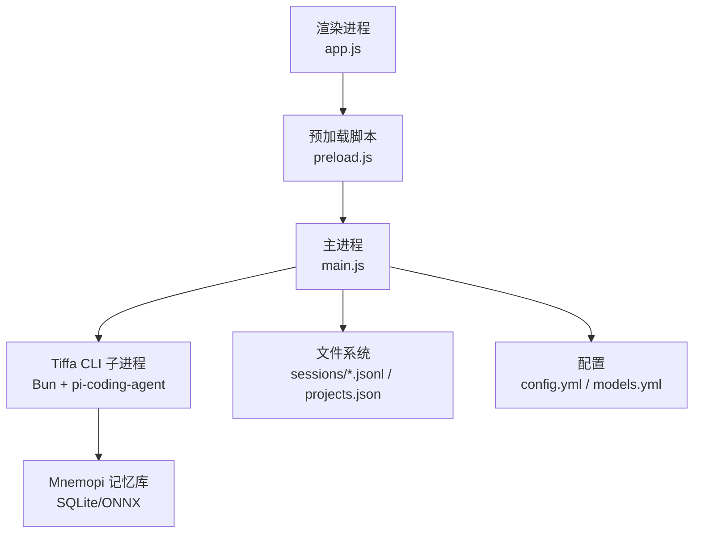
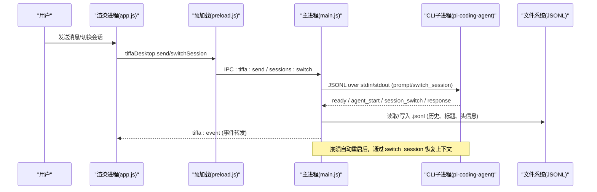
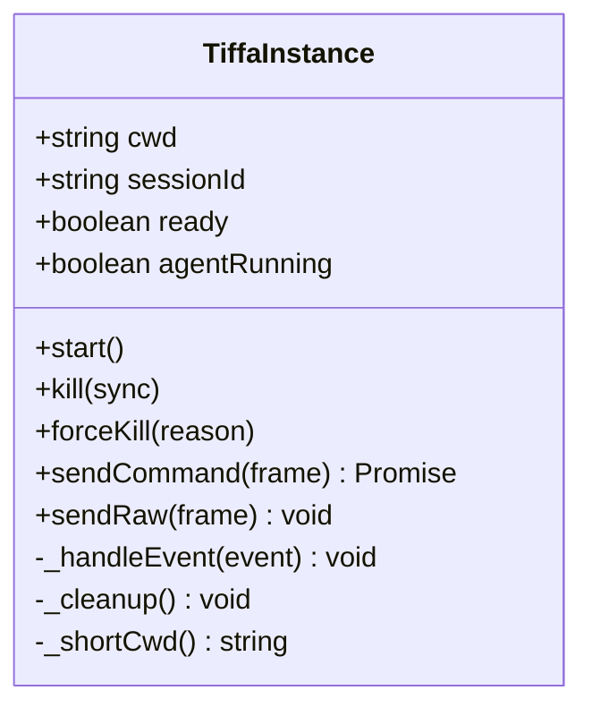
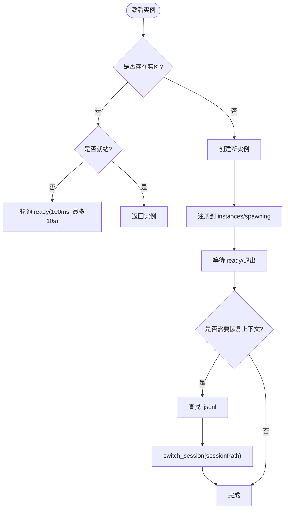
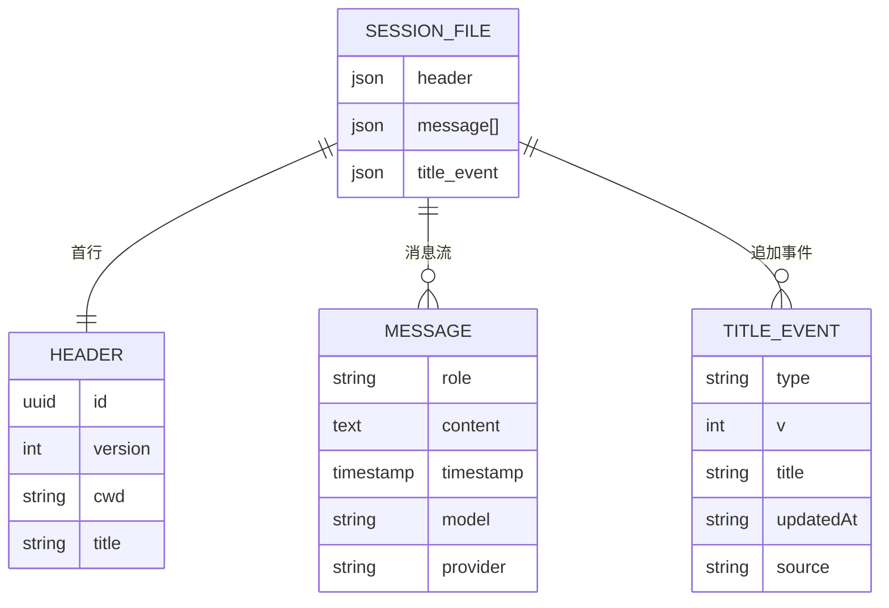
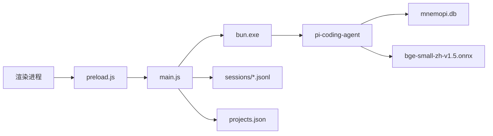

# 会话管理与上下文恢复

<cite>
**本文引用的文件**   
- [README.md](file://README.md)
- [AGENTS.md](file://AGENTS.md)
- [electron/main.js](file://electron/main.js)
- [electron/preload.js](file://electron/preload.js)
- [data/agent/config.yml](file://data/agent/config.yml)
- [skills/memory-manager/SKILL.md](file://skills/memory-manager/SKILL.md)
- [test_memory_system.ts](file://test_memory_system.ts)
</cite>

## 目录
1. [简介](#简介)
2. [项目结构](#项目结构)
3. [核心组件](#核心组件)
4. [架构总览](#架构总览)
5. [详细组件分析](#详细组件分析)
6. [依赖关系分析](#依赖关系分析)
7. [性能考量](#性能考量)
8. [故障排查指南](#故障排查指南)
9. [结论](#结论)
10. [附录](#附录)

## 简介
本文件聚焦 Tiffa 的“会话管理与上下文恢复”能力，围绕 Electron 主进程的多实例管理、JSONL 会话持久化、崩溃自动重启与上下文恢复、以及 Mnemopi 语义记忆在跨会话中的注入与召回机制进行系统化说明。目标是帮助开发者与使用者理解：
- 会话如何创建、切换、归档与恢复
- 进程崩溃后如何无缝恢复对话上下文
- 记忆系统如何在不同时间尺度上保持连续性（用户偏好、项目纲领、全局/项目级语义库、断片补救）

## 项目结构
Tiffa 采用“Electron 桌面壳 + 内核 CLI 子进程”的双层架构。会话与上下文的核心实现集中在 Electron 主进程中，负责：
- 多实例生命周期管理（按项目/对话维度）
- JSONL 会话文件的读写与迁移
- IPC 事件路由与渲染进程通信
- 启动时路径迁移与项目发现

**图表来源**
- [electron/main.js:1-120](file://electron/main.js#L1-L120)
- [electron/preload.js:1-134](file://electron/preload.js#L1-L134)
- [data/agent/config.yml:1-30](file://data/agent/config.yml#L1-L30)

**章节来源**
- [README.md:23-70](file://README.md#L23-L70)
- [AGENTS.md:158-208](file://AGENTS.md#L158-L208)

## 核心组件
- TiffaInstance：封装单个 Tiffa CLI 子进程的启动、事件解析、命令发送、崩溃重启与上下文恢复
- TiffaInstanceManager：多实例管理器，维护 cwd#sessionId 维度的实例映射、LRU 淘汰、活跃实例切换
- Session 文件系统：以 .jsonl 为单位的会话记录，包含 header、消息流、title 事件等
- IPC Handler：暴露 37+ 个 IPC 接口，覆盖会话/项目管理、模型配置、文件系统、XML 翻译开关等
- 记忆系统（Mnemopi）：通过 settings 数据库与 config.yml 控制 autoRetain/autoRecall/recallLimit/injectionTokenLimit 等

**章节来源**
- [electron/main.js:121-437](file://electron/main.js#L121-L437)
- [electron/main.js:443-770](file://electron/main.js#L443-L770)
- [electron/main.js:1376-2399](file://electron/main.js#L1376-L2399)
- [data/agent/config.yml:1-30](file://data/agent/config.yml#L1-L30)
- [AGENTS.md:61-77](file://AGENTS.md#L61-L77)

## 架构总览
下图展示从用户输入到上下文恢复的关键流程：

**图表来源**
- [electron/main.js:843-943](file://electron/main.js#L843-L943)
- [electron/main.js:2068-2074](file://electron/main.js#L2068-L2074)
- [electron/main.js:325-421](file://electron/main.js#L325-L421)

## 详细组件分析

### TiffaInstance：单实例生命周期与上下文恢复
- 启动与事件处理：通过 readline 逐行解析 stdout JSONL 事件，区分 ready、agent_start、agent_end、response、session_switch 等
- 预热与过滤：embedding 预热期间过滤噪音事件；用户交互立即取消预热过滤
- 上下文恢复：
  - 新进程激活时，若存在 sessionId，则查找对应 .jsonl 并通过 switch_session 恢复内存上下文
  - 崩溃重启后，若保留 sessionFilePath，再次执行 switch_session 恢复
- 会话 ID 迁移：当 CLI 分配真实 sessionId 后，更新实例 key 并迁移 map，避免切回丢失上下文

**图表来源**
- [electron/main.js:121-437](file://electron/main.js#L121-L437)

**章节来源**
- [electron/main.js:121-437](file://electron/main.js#L121-L437)
- [electron/main.js:325-421](file://electron/main.js#L325-L421)
- [electron/main.js:592-613](file://electron/main.js#L592-L613)

### TiffaInstanceManager：多实例管理与 LRU 淘汰
- 实例键：cwd#sessionId（项目级 sessionId=null）
- 激活策略：懒启动、等待 ready、超过上限触发 LRU 淘汰
- 会话上下文恢复：activateSession 中根据 sessionId 定位 .jsonl 并调用 switch_session
- 会话 ID 迁移：migrateSessionId 将旧 tempSessionId 迁移至 realSessionId，保证后续路由正确

**图表来源**
- [electron/main.js:443-770](file://electron/main.js#L443-L770)
- [electron/main.js:592-613](file://electron/main.js#L592-L613)

**章节来源**
- [electron/main.js:443-770](file://electron/main.js#L443-L770)

### 会话文件系统：JSONL 结构与历史加载
- 会话目录：data/agent/sessions/<编码后的cwd>/
- 会话文件：<timestamp>_<uuid>.jsonl
- Header：首行为 JSON，包含 id、version、cwd、title 等
- 历史加载：支持大文件尾读（>20MB 仅读最后 10MB），两遍解析关联 toolCallId 与工具参数

**图表来源**
- [electron/main.js:1845-1912](file://electron/main.js#L1845-L1912)
- [electron/main.js:2077-2192](file://electron/main.js#L2077-L2192)

**章节来源**
- [electron/main.js:1845-1912](file://electron/main.js#L1845-L1912)
- [electron/main.js:2077-2192](file://electron/main.js#L2077-L2192)

### IPC 接口与会话管理
- 会话相关接口：listProjects、listSessions、switch、new、loadHistory、archive/delete/rename、restore 等
- 模型配置接口：read/write/restart、writeProvider/deleteProvider
- 工作区接口：openFolderDialog、changeWorkspace
- XML 翻译开关：status/toggle

**章节来源**
- [electron/main.js:1376-2399](file://electron/main.js#L1376-L2399)
- [electron/preload.js:24-133](file://electron/preload.js#L24-L133)

### 记忆系统与上下文注入
- 五层记忆：USER.md（L1）、全局 bank（L2）、PROJECT.md（L3）、项目 bank（L4）、gap-fill（L5）
- Mnemopi 配置：scoping、autoRecall、autoRetain、retainEveryNTurns、recallLimit、injectionTokenLimit
- gap-fill：在 session.compacting 钩子中提取关键信息并立即注入，60 分钟后清理

**章节来源**
- [README.md:45-80](file://README.md#L45-L80)
- [AGENTS.md:61-77](file://AGENTS.md#L61-L77)
- [AGENTS.md:134-142](file://AGENTS.md#L134-L142)
- [skills/memory-manager/SKILL.md:1-56](file://skills/memory-manager/SKILL.md#L1-L56)

## 依赖关系分析
- 主进程依赖 Bun 运行 CLI 子进程，通过 JSONL 协议通信
- 会话文件位于 data/agent/sessions，项目元数据在 data/agent/projects.json
- 记忆系统依赖 SQLite 数据库与 ONNX embedding 模型（BAAI/bge-small-zh-v1.5）
- 渲染进程通过 preload 暴露受控 API，避免直接访问 Node 模块

**图表来源**
- [electron/main.js:1-120](file://electron/main.js#L1-L120)
- [data/agent/config.yml:1-30](file://data/agent/config.yml#L1-L30)

**章节来源**
- [electron/main.js:1-120](file://electron/main.js#L1-L120)
- [data/agent/config.yml:1-30](file://data/agent/config.yml#L1-L30)

## 性能考量
- 事件解析：使用 readline 逐行解析，避免 buffer 拼接开销
- 大文件加载：>20MB 的 .jsonl 仅读尾部 10MB，提升历史加载速度
- 预热优化：embedding 冷加载耗时 ~93MB，预热期间过滤噪音事件，用户交互优先
- LRU 淘汰：非活跃实例按 lastActiveTime 淘汰，避免内存泄漏
- 崩溃重启：非用户 kill 的退出触发 3 秒后自动重启，最多 3 次

**章节来源**
- [electron/main.js:184-194](file://electron/main.js#L184-L194)
- [electron/main.js:2077-2101](file://electron/main.js#L2077-L2101)
- [electron/main.js:336-343](file://electron/main.js#L336-L343)
- [electron/main.js:732-751](file://electron/main.js#L732-L751)
- [electron/main.js:214-225](file://electron/main.js#L214-L225)

## 故障排查指南
- 会话找不到上下文：检查 sessionFilePath 是否正确保存，确认 switch_session 成功执行
- 进程频繁崩溃：查看 crashCount 与 maxCrashRestart，确认非用户 kill 的退出原因
- 中文乱码：确保 _utf8Env 环境变量设置正确（LANG/LC_ALL/PYTHONIOENCODING 等）
- 记忆未生效：验证 mnemopi 配置（settings 数据库或 config.yml），确认 autoRetain/autoRecall 开启
- 路径迁移失败：检查 extractWorkspaceSuffix 与 encodeSessionDirName 逻辑，确认盘符变化后的重命名

**章节来源**
- [electron/main.js:95-111](file://electron/main.js#L95-L111)
- [electron/main.js:592-613](file://electron/main.js#L592-L613)
- [electron/main.js:214-225](file://electron/main.js#L214-L225)
- [data/agent/config.yml:18-27](file://data/agent/config.yml#L18-L27)
- [test_memory_system.ts:1-95](file://test_memory_system.ts#L1-L95)

## 结论
Tiffa 的会话管理与上下文恢复通过“多实例管理 + JSONL 持久化 + 崩溃自动重启 + Mnemopi 语义记忆”形成闭环，确保用户在跨会话、跨项目、甚至进程崩溃场景下仍能获得连贯的智能体体验。其设计兼顾性能与可靠性，适合弱模型与本地优先的使用场景。

## 附录
- 启动方式：tiffa-desktop.exe / start-tiffa.bat（TUI/WebUI/RPC）
- 环境变量：PI_CODING_AGENT_DIR、HOME、PORTABLE_ROOT、MNEMOPI_EMBEDDING_MODEL
- 技能加载：read skill://<name> 协议，由内核解析到 skills/<name>/SKILL.md

**章节来源**
- [AGENTS.md:26-35](file://AGENTS.md#L26-L35)
- [AGENTS.md:256-264](file://AGENTS.md#L256-L264)
- [AGENTS.md:144-151](file://AGENTS.md#L144-L151)