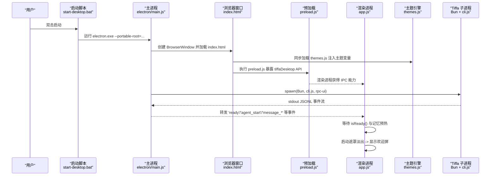
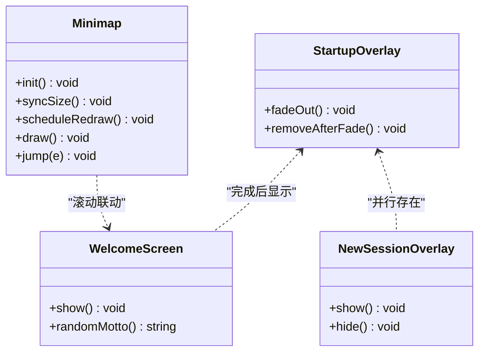
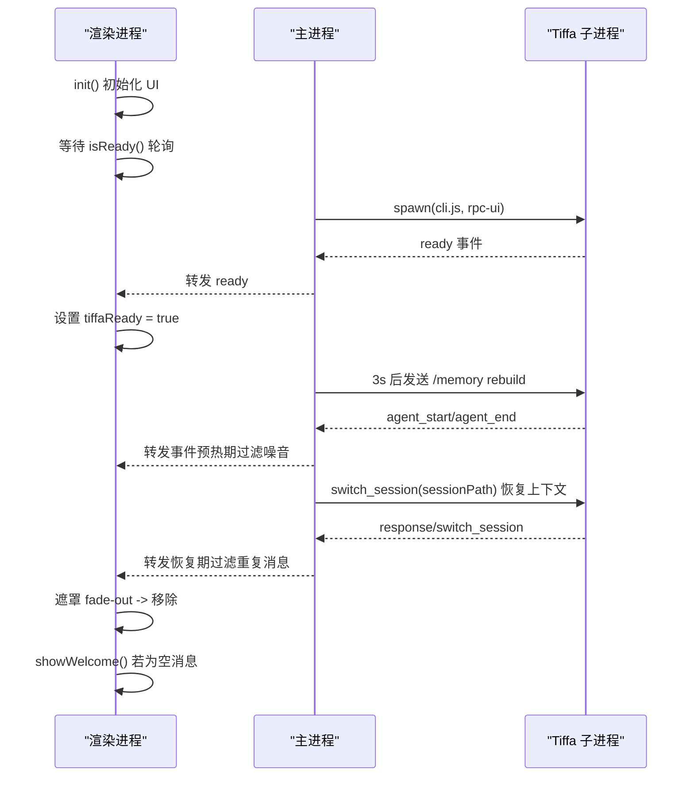
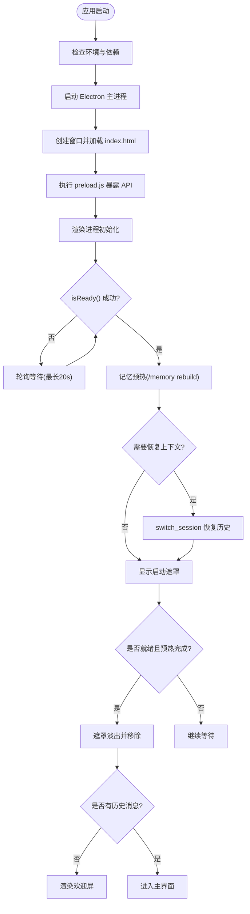
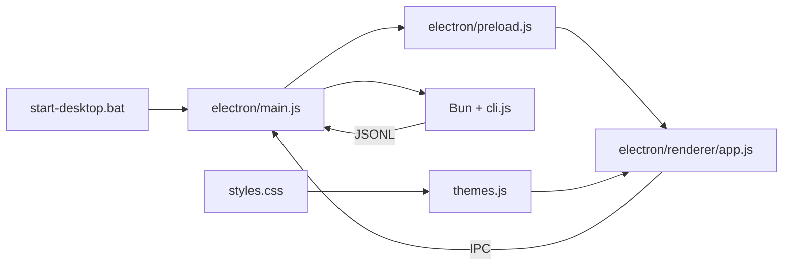

# 启动流程与动画系统

<cite>
**本文引用的文件**   
- [README.md](file://README.md)
- [start-desktop.bat](file://start-desktop.bat)
- [start-tiffa.bat](file://start-tiffa.bat)
- [electron/main.js](file://electron/main.js)
- [electron/preload.js](file://electron/preload.js)
- [electron/renderer/index.html](file://electron/renderer/index.html)
- [electron/renderer/styles.css](file://electron/renderer/styles.css)
- [electron/renderer/app.js](file://electron/renderer/app.js)
- [electron/renderer/themes.js](file://electron/renderer/themes.js)
</cite>

## 更新摘要
**所做更改**   
- 新增高级视觉特效章节，详细说明四层星空动画系统
- 更新主题系统章节，强调早期主题注入机制
- 完善动画时序分析，包含10秒优化目标
- 增强启动遮罩和欢迎屏的视觉效果描述

## 目录
1. [简介](#简介)
2. [项目结构](#项目结构)
3. [核心组件](#核心组件)
4. [架构总览](#架构总览)
5. [详细组件分析](#详细组件分析)
6. [高级视觉特效系统](#高级视觉特效系统)
7. [依赖关系分析](#依赖关系分析)
8. [性能考量](#性能考量)
9. [故障排查指南](#故障排查指南)
10. [结论](#结论)

## 简介
本文件聚焦 Tiffa 桌面应用的"启动流程"与"动画系统"。内容涵盖从双击可执行到渲染进程就绪的完整链路、主进程对子进程的托管与事件转发、以及启动遮罩与欢迎屏的动画实现。**最新更新**包括多层星空动画效果、早期主题注入机制和优化的动画时序控制。目标是帮助读者快速理解应用如何启动、如何呈现启动体验，以及如何扩展或排障。

## 项目结构
Tiffa 采用 Electron 多进程架构：
- 主进程（main.js）负责窗口创建、子进程生命周期管理、IPC 桥接与事件路由。
- 预加载脚本（preload.js）通过 contextBridge 暴露安全 API 给渲染进程。
- 渲染进程（index.html + app.js）负责 UI、动画与用户交互。
- 主题引擎（themes.js）在 `<head>` 中同步加载，防止 FOUC。
- 启动脚本（start-desktop.bat / start-tiffa.bat）完成环境准备与进程拉起。

```mermaid
graph TB
A["启动脚本<br/>start-desktop.bat"] --> B["Electron 主进程<br/>electron/main.js"]
B --> C["BrowserWindow<br/>加载 index.html"]
C --> D["预加载脚本<br/>electron/preload.js"]
D --> E["渲染进程<br/>electron/renderer/app.js"]
B --> F["Bun 子进程<br/>Tiffa CLI (rpc-ui/tui/rpc)"]
E <- --> |IPC| B
B <- --> |JSONL stdin/stdout| F
G["主题引擎<br/>themes.js"] -.-> C
```

**图表来源**
- [start-desktop.bat:1-25](file://start-desktop.bat#L1-L25)
- [electron/main.js:1-120](file://electron/main.js#L1-L120)
- [electron/preload.js:1-134](file://electron/preload.js#L1-L134)
- [electron/renderer/index.html:1-302](file://electron/renderer/index.html#L1-L302)
- [electron/renderer/app.js:1-120](file://electron/renderer/app.js#L1-L120)
- [electron/renderer/themes.js:1-692](file://electron/renderer/themes.js#L1-L692)

章节来源
- [README.md:1-236](file://README.md#L1-L236)
- [start-desktop.bat:1-25](file://start-desktop.bat#L1-L25)
- [start-tiffa.bat:1-154](file://start-tiffa.bat#L1-L154)

## 核心组件
- 启动脚本层：设置环境变量、检测依赖、拉起 Electron 或 Bun/Tiffa 内核。
- 主进程层：创建窗口、启动/管理 Tiffa 子进程、处理崩溃重启、事件转发。
- 预加载层：封装 IPC 调用，暴露文件系统、会话管理、模型配置等能力。
- 主题引擎层：在页面加载早期注入主题变量，防止闪烁（FOUC）。
- 渲染层：初始化 UI、监听事件、控制启动遮罩与欢迎屏动画、消息流渲染。

章节来源
- [electron/main.js:1-120](file://electron/main.js#L1-L120)
- [electron/preload.js:1-134](file://electron/preload.js#L1-L134)
- [electron/renderer/app.js:1-120](file://electron/renderer/app.js#L1-L120)
- [electron/renderer/themes.js:1-692](file://electron/renderer/themes.js#L1-L692)

## 架构总览
下图展示从双击启动到渲染进程就绪的关键时序，包括主进程启动子进程、预热 embedding、上下文恢复与前端遮罩淡出。



**图表来源**
- [start-desktop.bat:1-25](file://start-desktop.bat#L1-L25)
- [electron/main.js:1-120](file://electron/main.js#L1-L120)
- [electron/preload.js:1-134](file://electron/preload.js#L1-L134)
- [electron/renderer/index.html:11-14](file://electron/renderer/index.html#L11-L14)
- [electron/renderer/themes.js:677-692](file://electron/renderer/themes.js#L677-L692)
- [electron/renderer/app.js:1-120](file://electron/renderer/app.js#L1-L120)

## 详细组件分析

### 启动脚本与环境准备
- start-desktop.bat：设置便携根路径，校验 Electron 存在后以 --portable-root 启动 Electron。
- start-tiffa.bat：为 TUI/WebUI/RPC 模式准备环境变量（PI_CODING_AGENT_DIR、HOME、MNEMOPI_EMBEDDING_MODEL），确保 Python/Node/Bun 在 PATH 中，自动复制 models.yml 模板，解析参数并拉起 Bun + cli.js。

章节来源
- [start-desktop.bat:1-25](file://start-desktop.bat#L1-L25)
- [start-tiffa.bat:1-154](file://start-tiffa.bat#L1-L154)

### 主进程：窗口与子进程生命周期
- 窗口创建：设置背景色、隐藏菜单、加载 renderer/index.html，并在 ready-to-show 时显示窗口避免黑屏闪烁。
- 子进程管理：
  - TiffaInstance：封装子进程启动、stdin/stdout 逐行解析、命令发送与超时、崩溃自动重启、会话切换与上下文恢复、embedding 预热过滤。
  - TiffaInstanceManager：LRU 淘汰、按 cwd/sessionId 激活实例、迁移 sessionId、关闭/批量清理。
- 事件转发：将子进程 JSONL 事件加上 _cwd/_sessionId 标记后转发至渲染进程；预热期间过滤噪音事件；上下文恢复期间过滤重复消息。

章节来源
- [electron/main.js:1-120](file://electron/main.js#L1-L120)
- [electron/main.js:120-440](file://electron/main.js#L120-L440)
- [electron/main.js:440-770](file://electron/main.js#L440-L770)

### 预加载脚本：安全 IPC 桥
- 通过 contextBridge.exposeInMainWorld 暴露 tiffaDesktop API，包含：
  - 代理命令：send/abort/setModel/getModels/isReady/diagnostics/steer/followUp/compact/command 等
  - 事件监听：onEvent/onExited
  - 文件系统：listDir/readFile/writeFile/readImage
  - 外部调用：openExternal/openPath
  - 路径工具：getWorkspacePath/getRootPath
  - 会话/项目管理：listProjects/listSessions/switchSession/newSession/loadSessionHistory 等
  - 模型配置：readModelsYml/writeModelsYml/restartTiffa 等
  - 渲染库：marked/hljs 集成
- 使用 marked 与 highlight.js 进行 Markdown 渲染与代码高亮。

章节来源
- [electron/preload.js:1-134](file://electron/preload.js#L1-L134)

### 主题引擎：早期注入与动态切换
- **早期注入机制**：themes.js 在 `<head>` 中同步加载，通过 IIFE 立即执行 `applyThemeToDOM()`，在 body 渲染前注入 CSS 变量，防止 FOUC（闪烁）。
- **主题预设**：支持 7 套主题（Eucalyptus、Claude、Breeze、Sakura、Ocean、Dracula、Obsidian），每套包含 light/dark 两套配色。
- **HSL Token 架构**：颜色使用 HSL 格式存储，通过 JS 动态生成 CSS 变量，支持旧 hex 变量名兼容。
- **系统主题跟随**：支持 system/light/dark 三种模式，自动跟随系统主题变化。
- **localStorage 持久化**：主题选择与模式设置持久化存储，支持从旧 key 迁移。

章节来源
- [electron/renderer/themes.js:1-692](file://electron/renderer/themes.js#L1-L692)
- [electron/renderer/index.html:11-14](file://electron/renderer/index.html#L11-L14)

### 渲染进程：初始化、事件处理与动画
- 初始化流程：
  - 获取工作区路径、初始化 minimap、绑定本地文件链接点击行为。
  - 注册 onEvent/onExited，设置输入框、项目面板、会话标签、侧边栏等。
  - 等待后端 isReady()，轮询最多 20s；成功后进入"阅览旧谱…"阶段等待记忆预热约 6s。
  - 启动遮罩 fade-out 并移除，若无历史消息则显示欢迎屏。
- 事件处理：
  - 多对话实例事件路由：非当前会话的事件仅更新后台状态，不污染全局 state。
  - 处理 agent_start/agent_end/prompt_result/message_* 等事件，维护卡住检测与首次响应超时提示。
  - session_switch 迁移 __new__ tab 的真实路径与会话 ID。
- 动画系统：
  - 启动遮罩：全屏覆盖，logo 渐显模糊到清晰，标题延迟上移，涟漪环扩散，状态文字呼吸闪烁。
  - 欢迎屏：随机名言、功能图标列表、提示语，无消息时显示。
  - 新建对话过渡遮罩：半透明磨砂背景 + 旋转 spinner。

章节来源
- [electron/renderer/index.html:1-302](file://electron/renderer/index.html#L1-L302)
- [electron/renderer/app.js:1-120](file://electron/renderer/app.js#L1-L120)
- [electron/renderer/app.js:380-530](file://electron/renderer/app.js#L380-L530)
- [electron/renderer/app.js:830-900](file://electron/renderer/app.js#L830-L900)

#### 启动遮罩与欢迎屏动画类图


**图表来源**
- [electron/renderer/index.html:18-38](file://electron/renderer/index.html#L18-L38)
- [electron/renderer/app.js:830-900](file://electron/renderer/app.js#L830-L900)
- [electron/renderer/app.js:267-384](file://electron/renderer/app.js#L267-L384)

#### 启动时序序列图（含预热与上下文恢复）


**图表来源**
- [electron/main.js:320-420](file://electron/main.js#L320-L420)
- [electron/renderer/app.js:480-530](file://electron/renderer/app.js#L480-L530)

#### 启动流程流程图（算法级）


**图表来源**
- [electron/renderer/app.js:480-530](file://electron/renderer/app.js#L480-L530)
- [electron/main.js:320-420](file://electron/main.js#L320-L420)

## 高级视觉特效系统

### 多层星空动画效果
Tiffa 的启动遮罩实现了精美的多层星空动画系统，提供沉浸式的启动体验：

#### 四层同步动画架构
- **外层容器**（`.startup-muse`）：控制整体漂移动画（10秒周期），包含缩放、透明度渐变和径向遮罩。
- **四层背景**（`.muse-layer.l0-l3`）：同一张星空素材的四层叠加，每层独立呼吸动画，周期分别为 4.18s、4.73s、5.28s、5.83s。
- **染色罩**（`.muse-tint`）：使用 `mix-blend-mode: color` 将星光染成当前主题的强调色。
- **混合模式**：采用 `normal` 混合模式保持星点轮廓清晰，避免被背景融合。

#### 动画设计原理
- **相位错开**：四层动画使用负 delay 值（-1.85s、-3.55s、-0.90s）确保开局即处于不同相位。
- **不规则拍频**：周期比值刻意不成整数，合成后产生不规则明暗起伏，避免循环感。
- **亮度峰值**：brightness(1.3) 让星点过曝，暗部几乎不动，闪烁只发生在星点上。
- **浅色适配**：浅色主题使用独立的浅底暗星素材，保持轮廓清晰度。

#### 无障碍支持
- 系统开启"减少动态效果"时，停掉所有呼吸动画，只显示静态图层。
- 第一层保持可见，其他三层透明度降为 0，确保基础视觉效果。

### 启动遮罩动画时序
- **Logo 揭示**：2.2秒缓动，从模糊到清晰，字间距从 16px 收缩到 2px。
- **标题浮现**：1.6秒延迟后上移出现，透明度从 0 到 0.7。
- **涟漪效果**：三圈同心圆扩散动画，间隔 1.2 秒，模拟墨晕效果。
- **状态文字**：3秒呼吸闪烁，传达应用正在准备的状态。
- **整体退场**：1秒透明度渐变，星光先于遮罩溶解（1.2秒），收尾更干净。

### 欢迎屏动画
- **淡入效果**：4秒缓动淡入，营造优雅的开场体验。
- **随机名言**：13条精选中文名言随机显示，增加文化韵味。
- **功能展示**：8个核心功能图标网格布局，hover 时边框变色高亮。
- **响应式设计**：移动端自动调整为 2x4 网格布局。

**章节来源**
- [electron/renderer/styles.css:2039-2298](file://electron/renderer/styles.css#L2039-L2298)
- [electron/renderer/styles.css:2799-2884](file://electron/renderer/styles.css#L2799-L2884)
- [electron/renderer/index.html:18-38](file://electron/renderer/index.html#L18-L38)

## 依赖关系分析
- 启动脚本依赖系统 shell 与路径变量，确保 Electron/Bun/Python/Node 可用。
- 主进程依赖 Electron 模块、child_process、yaml 解析器、fs/path。
- 预加载脚本依赖 Electron contextBridge/ipcRenderer、marked、highlight.js。
- 主题引擎依赖 localStorage、matchMedia API、CSS 变量注入。
- 渲染进程依赖 DOM API、localStorage、ResizeObserver/MutationObserver。



**图表来源**
- [start-desktop.bat:1-25](file://start-desktop.bat#L1-L25)
- [electron/main.js:1-120](file://electron/main.js#L1-L120)
- [electron/preload.js:1-134](file://electron/preload.js#L1-L134)
- [electron/renderer/app.js:1-120](file://electron/renderer/app.js#L1-L120)
- [electron/renderer/themes.js:1-692](file://electron/renderer/themes.js#L1-L692)
- [electron/renderer/styles.css:1-800](file://electron/renderer/styles.css#L1-L800)

章节来源
- [electron/main.js:1-120](file://electron/main.js#L1-L120)
- [electron/preload.js:1-134](file://electron/preload.js#L1-L134)
- [electron/renderer/app.js:1-120](file://electron/renderer/app.js#L1-L120)
- [electron/renderer/themes.js:1-692](file://electron/renderer/themes.js#L1-L692)

## 性能考量
- **启动预热**：embedding 模型冷加载耗时较长，主进程在 ready 后延迟 3s 触发 /memory rebuild，渲染进程等待最多 6s 以确保体验流畅。
- **事件过滤**：预热期间过滤噪音事件，避免前端被无关消息刷屏；上下文恢复期间过滤重复消息，防止重放导致 UI 抖动。
- **LRU 与资源上限**：主进程限制最大实例数，按 lastActiveTime 淘汰最久未活跃实例，避免内存膨胀。
- **渲染优化**：minimap 使用 requestAnimationFrame 与 ResizeObserver/MutationObserver 合并绘制，减少重绘开销。
- **动画性能**：多层星空动画使用 CSS transform 和 opacity，利用 GPU 加速；will-change 属性预声明动画元素。
- **主题注入优化**：themes.js 在 `<head>` 中同步执行，避免二次渲染和闪烁。

章节来源
- [electron/main.js:320-420](file://electron/main.js#L320-L420)
- [electron/main.js:440-770](file://electron/main.js#L440-L770)
- [electron/renderer/app.js:267-384](file://electron/renderer/app.js#L267-L384)
- [electron/renderer/themes.js:677-692](file://electron/renderer/themes.js#L677-L692)

## 故障排查指南
- **启动失败（Electron 未找到）**：检查 start-desktop.bat 中的路径与依赖安装。
- **中文乱码**：确认 start-tiffa.bat 已设置 chcp 65001 与 UTF-8 环境变量。
- **子进程频繁崩溃**：查看主进程日志，关注 crashCount 与 autoRestarting；超过上限将停止自动重启。
- **上下文丢失**：确认 session_switch 事件是否正确转发，检查 _restoringContext 过滤逻辑。
- **渲染卡顿**：检查 minimap 绘制频率与 MutationObserver 触发次数，必要时降低刷新频率。
- **主题闪烁（FOUC）**：确认 themes.js 在 `<head>` 中正确加载，检查早期注入 IIFE 是否执行。
- **动画异常**：检查 CSS 动画关键帧定义，确认 prefers-reduced-motion 媒体查询处理。
- **星空效果异常**：验证 assets/tiffa-muse.png 和 tiffa-muse-light.png 文件是否存在。

章节来源
- [start-desktop.bat:1-25](file://start-desktop.bat#L1-L25)
- [start-tiffa.bat:1-154](file://start-tiffa.bat#L1-L154)
- [electron/main.js:200-240](file://electron/main.js#L200-L240)
- [electron/main.js:320-420](file://electron/main.js#L320-L420)
- [electron/renderer/app.js:740-800](file://electron/renderer/app.js#L740-L800)
- [electron/renderer/themes.js:677-692](file://electron/renderer/themes.js#L677-L692)

## 结论
Tiffa 的启动流程由脚本、主进程、预加载与渲染进程协同完成，强调"预热—恢复—呈现"的平滑体验。**最新的高级视觉特效系统**通过四层星空动画、早期主题注入和优化动画时序，提供了沉浸式的启动体验。主题引擎在页面加载早期注入 CSS 变量，有效防止闪烁问题。主进程对子进程的生命周期管理与事件路由确保了稳定性与可扩展性。理解这些机制有助于定制启动体验、优化性能与快速定位问题。

**更新亮点**：
- 多层星空动画系统提供独特的品牌识别度
- 早期主题注入机制消除 FOUC 问题  
- 10秒优化目标确保快速启动体验
- 完善的无障碍支持和响应式设计