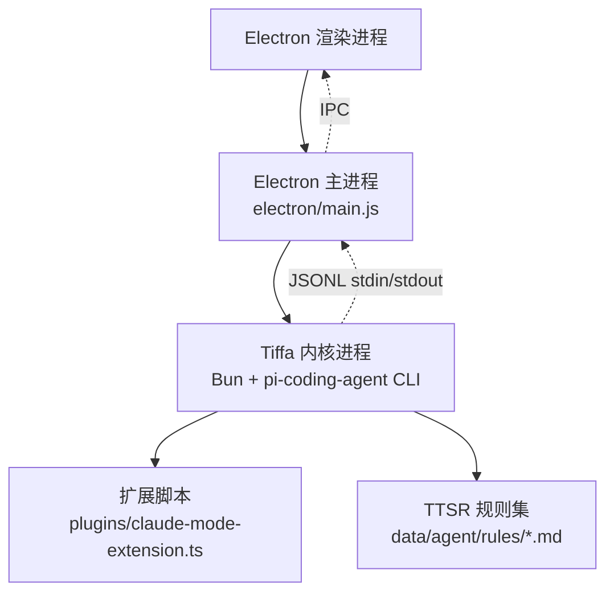
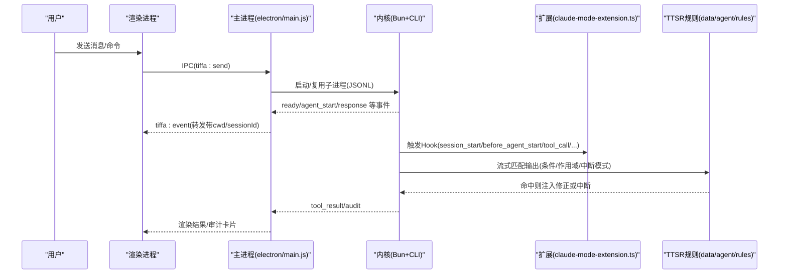
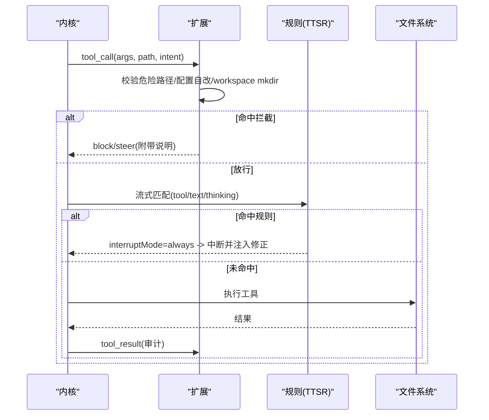
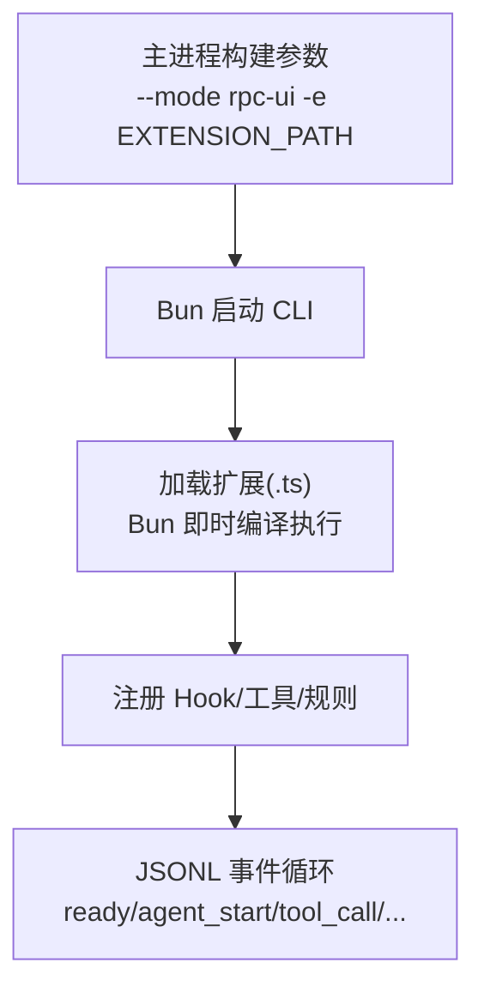
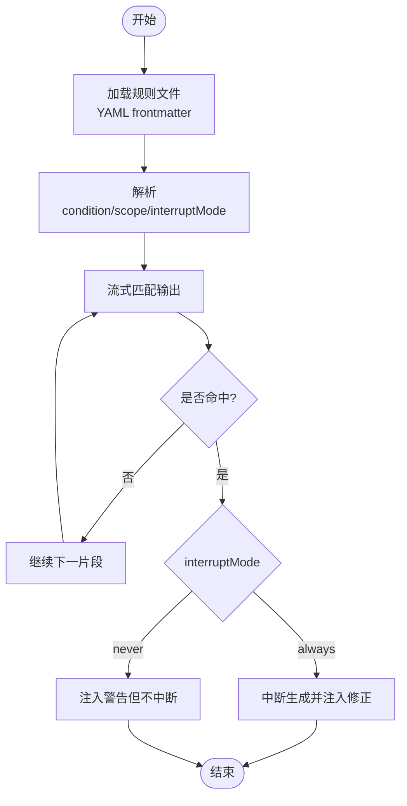
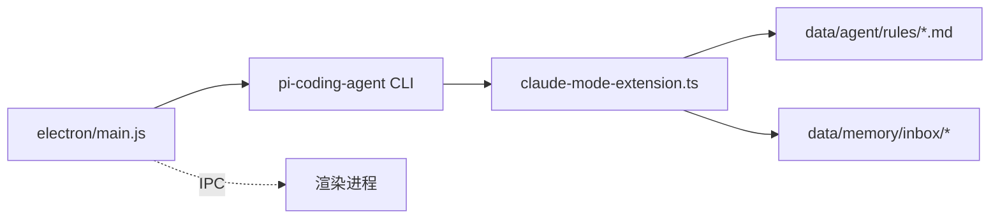

# 扩展系统

<cite>
**本文引用的文件**   
- [electron/main.js](file://electron/main.js)
- [AGENTS.md](file://AGENTS.md)
- [README.md](file://README.md)
</cite>

## 目录
1. [引言](#引言)
2. [项目结构](#项目结构)
3. [核心组件](#核心组件)
4. [架构总览](#架构总览)
5. [详细组件分析](#详细组件分析)
6. [依赖关系分析](#依赖关系分析)
7. [性能考量](#性能考量)
8. [故障排查指南](#故障排查指南)
9. [结论](#结论)
10. [附录](#附录)

## 引言
本文件系统化阐述 Tiffa 扩展体系，重点覆盖：
- Hook 系统设计原理与 6 个关键扩展点的作用、触发时机与数据流
- ClaudeModeExtension（Claude 化扩展）的安全约束、行为控制与工具调用拦截机制
- 扩展加载机制（TypeScript 动态编译与执行环境）
- 扩展与 Agent 内核的集成方式（事件监听、数据修改、流程控制）
- TTSR（Time Traveling Stream Rule）规则系统的实现要点（正则匹配、作用域控制、中断模式）
- 扩展开发指南、API 参考与最佳实践
- 自定义扩展示例与调试方法

## 项目结构
Tiffa 采用“Electron 桌面壳 + 内核进程 + 扩展”的分层架构。主进程负责实例管理、IPC 桥接与 /omfg 命令拦截；内核通过 Bun 运行 CLI，并以 JSONL 协议进行事件通信；扩展以 TypeScript 文件形式提供，由内核在启动时动态加载。

图表来源
- [electron/main.js:1-200](file://electron/main.js#L1-L200)

章节来源
- [electron/main.js:1-200](file://electron/main.js#L1-L200)
- [AGENTS.md:1-310](file://AGENTS.md#L1-L310)
- [README.md:1-214](file://README.md#L1-L214)

## 核心组件
- Electron 主进程（electron/main.js）
  - 多实例管理：TiffaInstanceManager/TiffaInstance，JSONL 通信、就绪检测、崩溃自动重启、stall 检测
  - IPC 路由：37 个处理器（tiffa:*、fs:*、workspace:*、models:*、sessions:*）
  - /omfg 命令拦截：将用户抱怨转换为 TTSR 规则生成提示，驱动模型写规则文件
- 内核进程（Bun + pi-coding-agent CLI）
  - 启动参数包含 -e 扩展路径，启用扩展加载
  - 事件总线：session_start、before_agent_start、tool_call、session_stop、session.compacting、tool_result 等
- 扩展（plugins/claude-mode-extension.ts）
  - 注册 6 个 Hook，实现安全约束、行为注入、工具拦截、审计日志、gap-fill 断片补救
- TTSR 规则（data/agent/rules/*.md）
  - YAML frontmatter + Markdown 正文，流式匹配，零 Context 成本

章节来源
- [electron/main.js:1-200](file://electron/main.js#L1-L200)
- [AGENTS.md:123-154](file://AGENTS.md#L123-L154)
- [README.md:76-125](file://README.md#L76-L125)

## 架构总览
下图展示从用户输入到扩展与规则生效的整体流程。

图表来源
- [electron/main.js:1-200](file://electron/main.js#L1-L200)
- [AGENTS.md:123-154](file://AGENTS.md#L123-L154)
- [README.md:76-125](file://README.md#L76-L125)

## 详细组件分析

### Hook 系统与 6 个关键扩展点
- session_start（#0）
  - 触发时机：会话/进程启动后
  - 功能：移除危险工具（如 eval/hub），确保记忆类工具可见
  - 注意：仅一次，若内核后续重置工具列表需在其他 Hook 再次保障
- before_agent_start（#1）
  - 触发时机：每轮 agent 启动前
  - 功能：重置静默计数、确定性注入 PROJECT.md、必要时补充安全约束
- tool_call（#2）
  - 触发时机：每次工具调用前
  - 功能：危险路径拦截、配置文件自改拦截、workspace 根目录新建子目录拦截、静默调用检测（≥3次 → steer）
- session_stop（#3）
  - 触发时机：会话结束
  - 功能：error 续行一次（最多一次，5秒延迟），其他不干预
- session.compacting（#4）
  - 触发时机：上下文压缩时
  - 功能：gap-fill 提取（改动文件/命令/决策）、compact dump、立即返回 context 注入
- tool_result（#5）
  - 触发时机：工具执行结果回传
  - 功能：审计日志（JSONL）

章节来源
- [AGENTS.md:123-154](file://AGENTS.md#L123-L154)

#### Hook 时序图（工具调用与拦截）

图表来源
- [AGENTS.md:123-154](file://AGENTS.md#L123-L154)

### ClaudeModeExtension 的实现要点
- 安全约束
  - 禁用高危工具（eval/hub）
  - 危险路径拦截（System32、Windows、Program Files）
  - 配置文件自改拦截（config.yml、models.yml、扩展自身）
  - workspace 根目录新建一级子目录拦截
- 行为控制
  - 静默工具调用检测（连续多次无文字说明 → steer 提醒）
  - 技能强制：调特定脚本前先 read skill:// 加载步骤并 ask 询问用户
- 工具调用拦截机制
  - 在 tool_call Hook 中前置校验，必要时 block 或 steer
  - 结合 TTSR 规则对工具参数进行流式匹配（如硬编码密钥、git 危险命令）

章节来源
- [AGENTS.md:98-110](file://AGENTS.md#L98-L110)
- [AGENTS.md:123-154](file://AGENTS.md#L123-L154)

### 扩展加载机制（TypeScript 动态编译与执行环境）
- 主进程构造 CLI 启动参数，包含 -e 扩展路径
- 内核使用 Bun 运行 CLI，Bun 原生支持 TS 模块即时编译执行
- 环境变量注入（UTF-8、HOME/USERPROFILE 重定向、PI_CODING_AGENT_DIR）
- 子进程 JSONL 通信，事件经主进程转发至渲染进程

图表来源
- [electron/main.js:1-200](file://electron/main.js#L1-L200)

章节来源
- [electron/main.js:1-200](file://electron/main.js#L1-L200)

### 扩展与 Agent 内核的集成方式
- 事件监听：扩展通过内核事件总线订阅 Hook，获取上下文（sessionId、cwd、工具名、参数等）
- 数据修改：setActiveTools、inject systemPrompt、返回 {context: [...]} 注入断片补救
- 流程控制：block/steer/interrupt，配合 TTSR 规则实现“零 Context 成本”约束

章节来源
- [AGENTS.md:123-154](file://AGENTS.md#L123-L154)

### TTSR（Time Traveling Stream Rule）规则系统
- 文件格式：Markdown + YAML frontmatter
- 关键字段
  - description：规则描述
  - condition：JavaScript 正则（字符串或数组）
  - scope：text | thinking | tool | tool:<name>(<glob>)
  - interruptMode：always（立即中断）| never（仅警告不中断）
  - repeatMode（可选）：once（默认，会话内只触发一次）| after-gap（间隔 N 条消息后重新触发）
- 匹配与执行
  - 流式匹配：模型输出时实时检测
  - 命中后：按 interruptMode 决定是否中断并注入 Markdown 正文作为修正指导
- 典型规则
  - no-bare-codeblock.md：代码块必须标注语言
  - no-filler-opening.md：禁止废话开头
  - no-xml-toolcall.md：禁止 XML 格式调用工具
  - no-md-filepath-link.md：禁止链接包装文件路径
  - no-hardcoded-secrets.md：禁止硬编码密钥
  - no-git-add-all.md / no-git-push-force.md：Git 危险命令
  - cwd-file-placement.md：文件必须放在项目目录内
  - chinese-punctuation.md：中文标点
  - tool-call-commentary.md：禁止工具调用废话

图表来源
- [README.md:97-125](file://README.md#L97-L125)
- [AGENTS.md:80-110](file://AGENTS.md#L80-L110)

章节来源
- [README.md:97-125](file://README.md#L97-L125)
- [AGENTS.md:80-110](file://AGENTS.md#L80-L110)

### gap-fill 断片补救（session.compacting）
- 触发：session.compacting Hook
- 处理：compact dump（最近 50 条消息原文）+ gap-fill 提取（改动文件/关键命令/决策要点）
- 落盘：inbox/gap-fill-{sessionId}.md + compact-{sessionId}-{ts}.txt
- 注入：立即返回 {context: [gapFill内容]}，不等下轮
- 清理：60 分钟后自动删除（跨 session）

章节来源
- [AGENTS.md:134-142](file://AGENTS.md#L134-L142)

## 依赖关系分析
- electron/main.js 依赖 Bun 与 pi-coding-agent CLI，通过 -e 加载扩展
- 扩展依赖内核事件总线与文件系统（rules/inbox/memory）
- TTSR 规则为纯文本配置，无需运行时依赖

图表来源
- [electron/main.js:1-200](file://electron/main.js#L1-L200)
- [AGENTS.md:1-310](file://AGENTS.md#L1-L310)

章节来源
- [electron/main.js:1-200](file://electron/main.js#L1-L200)
- [AGENTS.md:1-310](file://AGENTS.md#L1-L310)

## 性能考量
- TTSR 规则零 Context 成本：相比每轮注入 systemPrompt，显著节省 token
- 流式匹配：在输出过程中实时检测，避免全量缓存
- 扩展 Hook 粒度：仅在必要 Hook 做轻量校验，减少阻塞
- 内存与 I/O：gap-fill 文件及时清理，避免长期占用

[本节为通用建议，不直接分析具体文件]

## 故障排查指南
- 扩展未生效
  - 检查 -e 参数是否正确指向扩展文件
  - 确认内核已加载扩展（查看启动日志）
- 工具被重新启用（如 eval/hub）
  - 确认 session_start 与 before_agent_start 均执行了 sanitizeTools
  - 关注内核 compacting 后是否重置工具列表
- TTSR 规则未命中
  - 校验 condition 正则与 scope 设置
  - 检查 interruptMode 是否符合预期
- 中文乱码
  - 确认 UTF-8 环境变量注入生效（LANG/LC_ALL/PYTHONIOENCODING）

章节来源
- [electron/main.js:50-66](file://electron/main.js#L50-L66)
- [AGENTS.md:123-154](file://AGENTS.md#L123-L154)

## 结论
Tiffa 扩展系统通过“Hook + TTSR 规则”的双层约束，实现了低开销、高可控的智能体行为治理。ClaudeModeExtension 聚焦安全与行为控制，结合 gap-fill 断片补救与审计日志，形成稳定可靠的扩展生态。开发者可基于 6 个 Hook 与 TTSR 规则快速定制策略，并通过 /omfg 命令驱动规则迭代。

[本节为总结性内容，不直接分析具体文件]

## 附录

### 扩展开发指南（v6.1）
- 新增 Hook
  - 选择合适的事件点（session_start/before_agent_start/tool_call/session_stop/session.compacting/tool_result）
  - 保持逻辑轻量，避免阻塞主流程
- 安全策略
  - 优先使用 tool_call 前置拦截
  - 结合 TTSR 规则进行流式校验
- 数据交互
  - 通过 setActiveTools/inject context 等方式影响内核状态
  - 使用 tool_result 记录审计日志

章节来源
- [AGENTS.md:123-154](file://AGENTS.md#L123-L154)

### API 参考（扩展侧）
- 事件订阅
  - pi.on("session_start", handler)
  - pi.on("before_agent_start", handler)
  - pi.on("tool_call", handler)
  - pi.on("session_stop", handler)
  - pi.on("session.compacting", handler)
  - pi.on("tool_result", handler)
- 工具管理
  - pi.getActiveTools()
  - pi.setActiveTools(filtered)
- 上下文注入
  - 返回 {context: [...]} 用于 gap-fill 注入

章节来源
- [AGENTS.md:123-154](file://AGENTS.md#L123-L154)

### 最佳实践
- 规则编写
  - condition 精确匹配，避免宽泛 catch-all
  - scope 尽量窄化，针对具体工具或文件类型
  - interruptMode 谨慎使用 always，避免误伤正常流程
- 扩展设计
  - 将重复逻辑抽取为函数（如 sanitizeTools）
  - 在多个 Hook 中保证一致性（如每轮都移除危险工具）
- 调试技巧
  - 利用 tool_result 审计日志定位问题
  - 使用 /omfg 命令快速生成/修复规则

章节来源
- [AGENTS.md:80-110](file://AGENTS.md#L80-L110)
- [README.md:97-125](file://README.md#L97-L125)

### 自定义扩展示例（思路）
- 目标：限制特定工具只能在白名单路径下执行
- 步骤：
  - 在 tool_call Hook 中校验 args.path 是否匹配白名单
  - 若不匹配，返回 block 并附带 steer 说明
  - 同时添加一条 TTSR 规则，对 tool:write/edit 的参数进行正则校验
- 验证：
  - 观察 tool_result 审计日志
  - 使用 /omfg 命令反馈并迭代规则

[本节为概念性示例，不直接分析具体文件]

### 调试方法
- 主进程日志
  - 查看 stderr 输出与事件转发
- 内核日志
  - 查看 TTSR 规则注册与命中情况
- 扩展日志
  - 在 Hook 中打印关键变量（sessionId、toolName、args）
- 规则测试
  - 使用 /omfg 命令生成规则，观察是否命中

章节来源
- [electron/main.js:137-142](file://electron/main.js#L137-L142)
- [AGENTS.md:123-154](file://AGENTS.md#L123-L154)